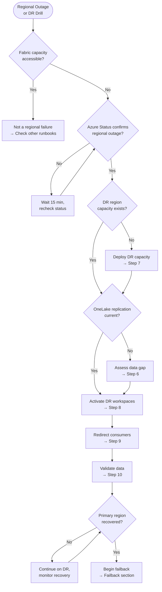

[Home](../index.md) > [Docs](..) > [Runbooks](index.md) > Disaster Recovery Execution

# 🌐 Disaster Recovery Execution Runbook

> **Last Updated**: 2026-05-05 | **Version**: 1.0
> **Audience**: Platform engineers, SRE, infrastructure operations, Fabric admins
> **Purpose**: Execute regional failover, verify OneLake replication, redeploy Fabric capacity in the DR region, and validate data integrity after a regional outage.

<div align="center" markdown>


</div>

---

## 📑 Table of Contents

1. [Trigger Conditions](#trigger-conditions)
2. [Severity Classification](#severity-classification)
3. [Decision Flowchart](#decision-flowchart)
4. [Step-by-Step Procedure](#step-by-step-procedure)
5. [OneLake Replication Verification](#onelake-replication-verification)
6. [Capacity Redeployment](#capacity-redeployment)
7. [Data Validation](#data-validation)
8. [Failback Procedure](#failback-procedure)
9. [Escalation Path](#escalation-path)
10. [Post-Incident Review Checklist](#post-incident-review-checklist)
11. [Related Documents](#related-documents)

---

## Trigger Conditions

Use this runbook when any of the following conditions are observed:

| # | Condition | Detection Source |
|---|-----------|------------------|
| 1 | Microsoft Fabric regional outage declared on Azure Status page | [Azure Status](https://status.azure.com), [Fabric Status](https://status.fabric.microsoft.com) |
| 2 | Fabric capacity unavailable for `> 30 min` despite no throttling | Admin Portal → Capacity status shows `Unavailable` |
| 3 | OneLake endpoint unreachable from all clients for `> 15 min` | Application monitoring; OneLake SDK connection failures |
| 4 | Azure region failure affecting Fabric's home region | Azure Service Health notification |
| 5 | Planned DR drill scheduled by operations team | DR test calendar |
| 6 | Compliance-mandated failover test (annual or semi-annual) | Compliance requirements (SOX, HIPAA, FedRAMP) |

---

## Severity Classification

| Severity | Condition | Response SLA |
|----------|-----------|--------------|
| **SEV1** | Unplanned regional outage; production Fabric workloads unavailable; compliance reporting at risk | **5 min** page |
| **SEV2** | Partial regional degradation; some workspaces affected; workaround possible via secondary region | **15 min** page |
| **DR Drill** | Planned test; no production impact; executed during maintenance window | **Scheduled** |

---

## Decision Flowchart



---

## Step-by-Step Procedure

### Phase 1 — Detect and Declare (0–15 min)

**Step 1.** Confirm the regional outage by checking all three sources:
   - [Azure Status Page](https://status.azure.com) — check the Fabric service and the home region.
   - [Fabric Status Page](https://status.fabric.microsoft.com) — check for service advisories.
   - Microsoft 365 Admin Center → Service Health → Microsoft Fabric.

**Step 2.** If confirmed, declare a **SEV1 DR incident** and page the Incident Commander, VP Engineering, and infrastructure team.

**Step 3.** Open a dedicated incident bridge (Teams call or war room) and assign roles:
   - **Incident Commander**: Coordinates overall response.
   - **Infrastructure Lead**: Handles capacity deployment.
   - **Data Lead**: Handles replication verification and data validation.
   - **Communications Lead**: Handles stakeholder updates.

**Step 4.** Notify stakeholders that DR failover is beginning. Send initial communication:
   > *"A regional outage has been declared for [region]. DR failover is in progress. ETA for service restoration: [X hours]. Updates every 30 minutes."*

### Phase 2 — Verify Replication State (15–30 min)

**Step 5.** Check OneLake replication status for all critical Lakehouses:

```bash
# List OneLake shortcut targets to verify DR copies exist
az rest --method get \
  --url "https://api.fabric.microsoft.com/v1/workspaces/$drWorkspaceId/items" \
  --query "value[?type=='Lakehouse'].{name:displayName, id:id}"
```

**Step 6.** Assess the replication lag (RPO — Recovery Point Objective):

```python
# Compare latest file timestamps between primary and DR OneLake
from datetime import datetime, timezone

primary_latest = mssparkutils.fs.ls("abfss://primary-lakehouse@onelake.dfs.fabric.microsoft.com/Tables/gold/fact_daily_slot_performance/")
dr_latest = mssparkutils.fs.ls("abfss://dr-lakehouse@onelake.dfs.fabric.microsoft.com/Tables/gold/fact_daily_slot_performance/")

primary_max = max(f.modifyTime for f in primary_latest)
dr_max = max(f.modifyTime for f in dr_latest)

lag_minutes = (primary_max - dr_max) / 60000
print(f"Replication lag: {lag_minutes:.0f} minutes")
```

   - If lag is within **RPO target** (e.g., < 60 min), proceed to Step 8.
   - If lag exceeds RPO, document the data gap and proceed — missing data will be backfilled after failback.

### Phase 3 — Deploy and Activate DR (30–90 min)

**Step 7.** If DR capacity does not already exist, deploy it in the secondary region:

```bash
# Deploy Fabric capacity in DR region using Bicep
az deployment group create \
  --resource-group rg-fabric-dr \
  --template-file infra/modules/fabric/fabric-capacity.bicep \
  --parameters \
    capacityName=fabric-casino-dr \
    location=westus2 \
    skuName=F64 \
    adminMembers='["admin@contoso.com"]'
```

**Step 8.** Activate DR workspaces:
   1. Assign DR workspaces to the DR Fabric capacity.
   2. Verify all Lakehouse items, notebooks, pipelines, and semantic models are present.
   3. Update connection strings in pipelines to point to DR data sources (if sources are also region-specific).

```bash
# Assign workspace to DR capacity
az rest --method post \
  --url "https://api.fabric.microsoft.com/v1/workspaces/$drWorkspaceId/assignToCapacity" \
  --body "{\"capacityId\": \"$drCapacityId\"}"
```

**Step 9.** Redirect consumers to DR:
   - Update DNS or application configuration to point to DR workspace URLs.
   - For Power BI reports, update the semantic model connection to the DR Lakehouse.
   - For API consumers, update the Fabric REST API base URL.
   - Notify consumers that they should use DR endpoints.

### Phase 4 — Validate (90–180 min)

**Step 10.** Execute the data validation suite:

```python
# Run Great Expectations checkpoint against DR tables
import subprocess
result = subprocess.run(
    ["great_expectations", "checkpoint", "run", "dr_validation_checkpoint"],
    capture_output=True, text=True
)
print(result.stdout)
assert result.returncode == 0, f"DR validation failed: {result.stderr}"
```

**Step 11.** Verify critical workloads:

| Workload | Validation | Expected Result |
|----------|-----------|-----------------|
| Power BI exec dashboard | Load report, check data freshness | Data within RPO window |
| CTR compliance pipeline | Trigger manual run | Pipeline succeeds |
| Real-time Eventstream | Check ingestion metrics | Events flowing |
| Semantic model | Trigger refresh | Refresh succeeds |
| KQL dashboard | Run sample query | Results returned |

**Step 12.** Send stakeholder update confirming DR is active:
   > *"DR failover complete. Services are running from [DR region]. Data is current as of [timestamp]. RPO gap: [X minutes]. Monitoring continues."*

---

## OneLake Replication Verification

| Check | Command / Method | Expected Result |
|-------|-----------------|-----------------|
| Shortcut targets exist | `GET /workspaces/{id}/items?type=Lakehouse` | All Lakehouses present |
| Table row counts match | `spark.table("dr.table").count()` vs primary count | Within 1% tolerance |
| Latest partition present | `ls` on partition directory | Latest date partition exists |
| Delta log consistent | `DESCRIBE HISTORY table` | No corrupt commits |
| Schema matches | `df.schema` comparison | Identical schemas |

---

## Capacity Redeployment

If the DR capacity was not pre-provisioned, use the Bicep module:

```bash
az deployment group create \
  --resource-group rg-fabric-dr \
  --template-file infra/modules/fabric/fabric-capacity.bicep \
  --parameters \
    capacityName=fabric-casino-dr \
    location=westus2 \
    skuName=F64 \
    adminMembers='["admin@contoso.com"]'
```

Provisioning typically takes **5–10 minutes**. Monitor via:

```bash
az resource show \
  --resource-group rg-fabric-dr \
  --name fabric-casino-dr \
  --resource-type "Microsoft.Fabric/capacities" \
  --query "{state: properties.state, sku: sku.name}"
```

---

## Data Validation

Run a comprehensive validation after failover:

```python
tables_to_validate = [
    "bronze_slot_telemetry",
    "silver_slot_cleansed",
    "gold.fact_daily_slot_performance",
    "gold.dim_machine",
    "gold.dim_customer",
]

for table in tables_to_validate:
    dr_count = spark.table(f"dr_lakehouse.{table}").count()
    print(f"{table}: {dr_count:,} rows")

    # Check for recent data
    latest = spark.sql(f"""
        SELECT MAX(process_date) as latest_date
        FROM dr_lakehouse.{table}
    """).collect()[0]["latest_date"]
    print(f"  Latest data: {latest}")
```

---

## Failback Procedure

After the primary region recovers:

**Step 13.** Verify the primary region is fully operational:
   - Azure Status shows **Resolved**.
   - Primary Fabric capacity shows **Active** state.
   - OneLake endpoints are reachable.

**Step 14.** Sync data created during the DR period back to the primary:
   - Identify new data written to DR (tables, files, notebooks modified during outage).
   - Copy DR-period data to primary OneLake using shortcuts or copy jobs.

**Step 15.** Switch consumers back to the primary:
   - Revert DNS / configuration changes from Step 9.
   - Update Power BI connections back to primary Lakehouse.
   - Notify consumers of failback completion.

**Step 16.** Validate primary environment using the same checks from Step 10 and Step 11.

**Step 17.** If DR capacity was deployed on-demand, deprovision to save costs:

```bash
az resource delete \
  --resource-group rg-fabric-dr \
  --name fabric-casino-dr \
  --resource-type "Microsoft.Fabric/capacities"
```

---

## Escalation Path

| Time Elapsed | Action | Contact |
|--------------|--------|---------|
| **0 min** | Incident Commander declared; DR failover initiated | IC + On-call SRE |
| **5 min** | Page VP Engineering and CISO (data at risk) | VP Engineering + CISO |
| **15 min** | Open Microsoft support case (Sev A — business-critical outage) | Microsoft Unified Support |
| **30 min** | Executive communication sent to business stakeholders | Communications Lead |
| **1 hr** | If DR deployment blocked, engage Azure support for capacity provisioning | Azure Support |
| **4 hr** | If failover incomplete, escalate to Microsoft Fabric product team | Microsoft Fabric Engineering |
| **8 hr** | If RPO breach impacts compliance, notify Legal and Compliance | Legal + Compliance Officer |

---

## Post-Incident Review Checklist

- [ ] Outage start and end times documented
- [ ] Time to detect (TTD) and time to failover (TTF) measured against SLA
- [ ] RPO achieved vs RPO target documented
- [ ] RTO achieved vs RTO target documented
- [ ] OneLake replication lag at time of failover recorded
- [ ] DR capacity deployment time recorded (if on-demand)
- [ ] Data validation results captured (pass/fail per table)
- [ ] Consumer redirect process evaluated — any gaps or delays?
- [ ] Failback completed successfully
- [ ] Data created during DR period synced to primary
- [ ] DR capacity deprovisioned (if on-demand)
- [ ] Communication timeline reviewed — were stakeholders informed promptly?
- [ ] Runbook accuracy reviewed — any steps to add or update?
- [ ] DR test schedule updated for next drill
- [ ] Blameless postmortem completed within 48 hours

---

## Related Documents

| Document | Description |
|----------|-------------|
| [Disaster Recovery & BCDR](../best-practices/disaster-recovery-bcdr.md) | BCDR architecture and design patterns |
| [Multi-Region Failover](multi-region-failover.md) | Detailed multi-region failover procedures |
| [Monitoring & Observability](../best-practices/monitoring-observability.md) | Alert setup and dashboards |
| [Capacity Planning & Cost](../best-practices/capacity-planning-cost-optimization.md) | DR capacity sizing |
| [Incident Response Template](incident-response-template.md) | Master incident response structure |
| [Capacity Throttling](capacity-throttling.md) | When DR capacity is throttled |

---

[⬆️ Back to Top](#-disaster-recovery-execution-runbook) | [📋 Runbook Index](index.md) | [🏠 Home](../index.md)
