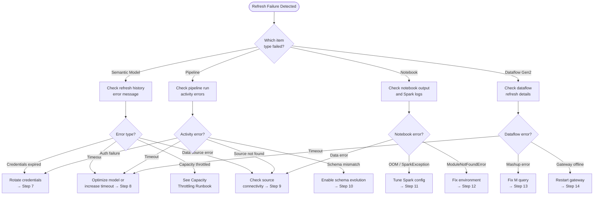

# ❌ Failed Refresh Triage Runbook

> **Last Updated**: 2026-05-05 | **Version**: 1.0
> **Audience**: Data engineers, on-call SRE, BI developers
> **Purpose**: Diagnose and recover from semantic model refresh failures, pipeline failures, notebook failures, and Dataflow Gen2 failures in Microsoft Fabric.

<div align="center" markdown>


</div>

---

## Trigger Conditions

Use this runbook when any of the following conditions are observed:

| # | Condition | Detection Source |
|---|-----------|------------------|
| 1 | Semantic model refresh shows **Failed** status | Power BI workspace → Refresh history |
| 2 | Data Factory pipeline run failed | Data Factory → Monitor → Pipeline runs |
| 3 | Notebook execution failed or timed out | Workspace → Monitor → Notebook runs |
| 4 | Dataflow Gen2 refresh error | Workspace → Dataflow → Refresh history |
| 5 | Scheduled refresh did not start (missed schedule) | Refresh history shows gap; no run recorded |
| 6 | Data Activator alert for stale data in downstream report | Activator reflex notification |
| 7 | Workspace Monitoring shows `RefreshFailed` events | `system.pipeline_runs` or `system.dataset_refreshes` |

---

## Severity Classification

| Severity | Condition | Example | Response SLA |
|----------|-----------|---------|--------------|
| **SEV1** | Compliance-critical refresh failed; regulatory reporting stale | CTR daily aggregation pipeline failed; SOX audit dataset >24h stale | **5 min** page |
| **SEV2** | Production BI report dataset refresh failed; exec dashboard stale | `gold.fact_daily_slot_performance` dataset refresh failed for 2 consecutive runs | **15 min** page |
| **SEV3** | Non-critical pipeline or notebook failed; workaround exists | Silver dedup notebook failed but can be re-run manually | **2 hr** ack |
| **SEV4** | Dev/test refresh failed; no downstream impact | Dev workspace notebook syntax error | **24 hr** ack |

---

## Decision Flowchart



---

## Step-by-Step Procedure

### Phase 1 — Detect and Classify (0–15 min)

**Step 1.** Identify the failed item type (semantic model, pipeline, notebook, or Dataflow Gen2) and open its run history in the Fabric portal.

**Step 2.** Copy the full error message from the failed run details. For pipelines, expand each activity to find the first failed activity.

**Step 3.** Check whether this is a first-time failure or a recurring pattern:

```kql
// Workspace Monitoring — recent failures for this item
system_pipeline_runs
| where ItemName == "<item-name>"
| where Status == "Failed"
| where Timestamp > ago(7d)
| project Timestamp, Status, ErrorMessage, DurationSeconds
| order by Timestamp desc
```

**Step 4.** Classify severity using the table above. Open an incident channel if SEV1 or SEV2.

### Phase 2 — Diagnose (15–45 min)

**Step 5.** Determine the error category from the error message:

| Error Pattern | Category | Go To |
|---------------|----------|-------|
| `InvalidCredentials`, `AuthenticationFailed`, `TokenExpired` | Credential | Step 7 |
| `Timeout`, `OperationTimedOut`, `TaskCanceled` | Timeout | Step 8 |
| `SourceNotFound`, `FileNotFound`, `ConnectionFailed` | Source connectivity | Step 9 |
| `InvalidSchema`, `SchemaChanged`, `ColumnNotFound` | Schema mismatch | Step 10 |
| `OutOfMemoryError`, `SparkException`, `ExecutorLost` | Spark resource | Step 11 |
| `ModuleNotFoundError`, `ImportError` | Environment | Step 12 |
| `MashupError`, `DataFormat.Error` | Dataflow M query | Step 13 |
| `GatewayOffline`, `GatewayUnreachable` | Gateway | Step 14 |
| `CapacityThrottled`, `429 Too Many Requests` | Capacity | [Capacity Throttling Runbook](capacity-throttling.md) |

**Step 6.** If the error pattern does not match any category, collect diagnostic artifacts (error message, run ID, timestamps, item name) and proceed to [Escalation Path](#escalation-path).

### Phase 3 — Resolve

**Step 7.** *Credential failure* — Rotate the affected credential:
   1. Navigate to **Workspace → Settings → Manage connections and gateways**.
   2. Edit the connection for the affected data source.
   3. Re-enter or refresh the credential (OAuth, service principal, or key).
   4. Test the connection.
   5. Re-trigger the refresh.

**Step 8.** *Timeout failure* — Increase timeout or optimize the operation:
   1. For semantic models: reduce table row counts, add incremental refresh, or remove unnecessary tables.
   2. For pipelines: increase the activity timeout in the pipeline JSON (`"timeout": "02:00:00"`).
   3. For notebooks: partition the data processing into smaller batches.
   4. Re-trigger the refresh.

**Step 9.** *Source connectivity failure* — Verify the data source is reachable:
   1. Test the connection from the Fabric portal (**Manage connections** → **Test connection**).
   2. If using an on-premises data gateway, verify the gateway service is running (see Step 14).
   3. Check firewall rules and network connectivity between Fabric and the source.
   4. If the source file was moved or deleted, update the path in the connection settings.
   5. Re-trigger the refresh.

**Step 10.** *Schema mismatch* — Reconcile the schema change:
   1. Compare the current source schema against the expected schema.
   2. For Delta Lake notebooks, enable schema evolution:
      ```python
      spark.conf.set("spark.databricks.delta.schema.autoMerge.enabled", "true")
      ```
   3. For pipelines, update the Copy Activity schema mapping.
   4. For semantic models, open the model in the web editor and refresh the table schema.
   5. Re-trigger the refresh.

**Step 11.** *Spark resource failure (OOM / executor lost)* — Tune Spark configuration:
   1. Increase driver/executor memory in the notebook's Spark configuration:
      ```python
      spark.conf.set("spark.executor.memory", "8g")
      spark.conf.set("spark.driver.memory", "8g")
      ```
   2. Increase shuffle partitions for large datasets:
      ```python
      spark.conf.set("spark.sql.shuffle.partitions", "200")
      ```
   3. If the notebook is processing a very large file, consider partitioning the input.
   4. Re-trigger the notebook run.

**Step 12.** *Environment / module error* — Fix the Spark environment:
   1. Navigate to **Workspace → Environments** and open the environment attached to the notebook.
   2. Add the missing library to the environment's public libraries or custom libraries.
   3. Publish the environment and wait for it to build.
   4. Re-trigger the notebook run.

**Step 13.** *Dataflow Gen2 M query error* — Debug the mashup:
   1. Open the Dataflow Gen2 item and navigate to the failing query step.
   2. Check the error details pane for the specific M expression that failed.
   3. Common fixes: update column names, fix data type conversions, handle nulls with `try ... otherwise`.
   4. Test the query in the Dataflow editor.
   5. Save and re-trigger the refresh.

**Step 14.** *Gateway offline* — Restart the on-premises data gateway:
   1. RDP or SSH into the gateway machine.
   2. Open **Services** (Windows) and restart the **On-premises data gateway** service.
   3. Verify the gateway status in the Fabric portal (**Manage connections and gateways** → **Gateways**).
   4. If the gateway remains offline, check for Windows updates, disk space, and network connectivity.
   5. Re-trigger the refresh.

### Phase 4 — Verify

**Step 15.** After re-triggering the refresh, monitor the run to completion:
   - Confirm the run status changes to **Succeeded**.
   - Verify data freshness in the target table or report.

**Step 16.** If the failure was recurring, set up a Data Activator reflex to alert on consecutive failures:

```kql
system_dataset_refreshes
| where ItemName == "<dataset-name>"
| where Status == "Failed"
| summarize FailCount = count() by bin(Timestamp, 1h)
| where FailCount >= 2
```

**Step 17.** Document the resolution and proceed to the [Post-Incident Review Checklist](#post-incident-review-checklist).

---

## Failure-Specific Diagnosis

### Semantic Model Refresh

| Error | Root Cause | Resolution |
|-------|-----------|------------|
| `CredentialsExpired` | OAuth token expired | Re-authenticate connection |
| `DataSourceNotFound` | Source table dropped or renamed | Update model table source |
| `ProcessingTimeout` | Model too large for refresh window | Enable incremental refresh |
| `CapacityNotAvailable` | Capacity throttled during refresh | See [Capacity Throttling](capacity-throttling.md) |

### Pipeline Failures

| Error | Root Cause | Resolution |
|-------|-----------|------------|
| `CopyActivity_InvalidSchema` | Source schema changed | Update schema mapping |
| `NotebookActivity_Failed` | Downstream notebook error | Debug notebook independently |
| `DependencyConditionNotMet` | Upstream activity failed | Fix upstream activity first |
| `UserCancelledExecution` | Manual cancellation | Verify intent; re-run if accidental |

### Notebook Failures

| Error | Root Cause | Resolution |
|-------|-----------|------------|
| `Py4JJavaError: OutOfMemoryError` | Insufficient executor memory | Increase memory or partition data |
| `AnalysisException: Table not found` | Table dropped or path changed | Verify table exists in Lakehouse |
| `IllegalArgumentException` | Bad parameter value | Check parameterized cell values |

### Dataflow Gen2 Failures

| Error | Root Cause | Resolution |
|-------|-----------|------------|
| `DataFormat.Error` | Source data type mismatch | Add type conversion in M query |
| `Expression.Error` | Null value in non-nullable operation | Add null handling (`try ... otherwise`) |
| `GatewayTimeout` | Gateway unresponsive | Restart gateway service |

---

## Escalation Path

| Time Elapsed | Action | Contact |
|--------------|--------|---------|
| **0 min** | On-call engineer begins triage | On-call rotation |
| **15 min** | If SEV1/SEV2 and root cause unclear, escalate to Data Platform Lead | Data Platform Lead |
| **30 min** | If compliance refresh (CTR/SAR/W-2G), notify Compliance Officer | Compliance Officer |
| **1 hr** | If unresolved, engage Microsoft support | Microsoft Unified Support (Sev B) |
| **2 hr** | If SEV1 still unresolved, escalate to VP Engineering | VP Engineering |
| **4 hr** | If gateway-related, engage gateway infrastructure team | Infrastructure Team |

---

## Post-Incident Review Checklist

- [ ] Failed item type and name documented
- [ ] Error message and run ID captured
- [ ] Root cause category identified (credential, timeout, source, schema, resource, environment, M query, gateway)
- [ ] Resolution steps taken documented
- [ ] Refresh successfully re-triggered and verified
- [ ] Recurring failure pattern checked — is this the first occurrence or a repeat?
- [ ] Credential rotation scheduled (if credential failure)
- [ ] Timeout / resource settings permanently updated (if applicable)
- [ ] Schema evolution or mapping updated (if schema mismatch)
- [ ] Monitoring alert created for consecutive failures
- [ ] Blameless postmortem completed within 48 hours (SEV1/SEV2 only)

---

## Related Documents

| Document | Description |
|----------|-------------|
| [Error Handling & Monitoring](../best-practices/error-handling-monitoring.md) | Pipeline error architecture |
| [Monitoring & Observability](../best-practices/monitoring-observability.md) | Dashboard and alert setup |
| [Alerting & Data Activator](../best-practices/alerting-data-activator.md) | Data Activator reflex patterns |
| [Dataflow Gen2](../features/dataflow-gen2.md) | Dataflow Gen2 best practices |
| [Capacity Throttling](capacity-throttling.md) | When failure is caused by throttling |
| [Incident Response Template](incident-response-template.md) | Master incident response structure |
| [Testing Strategies](../best-practices/testing-strategies.md) | Data quality and integration testing |

---

[⬆️ Back to Top](#-failed-refresh-triage-runbook) | [📋 Runbook Index](index.md) | [🏠 Home](../index.md)
