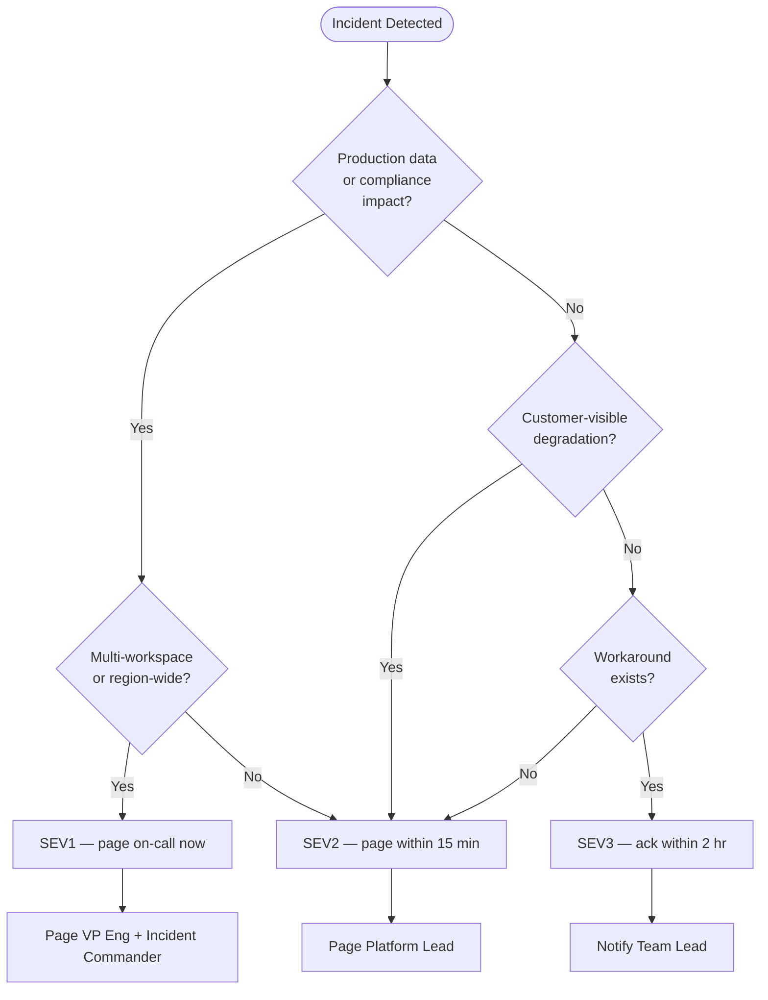

# 🚨 Incident Response Template

> **Last Updated**: 2026-04-27 | **Phase**: 14 (Wave 1) | **Anchor Runbook**
> **Audience**: On-call engineers, incident commanders, SRE teams
> **Purpose**: Reusable template for any Fabric production incident — clone this file and fill in the brackets

<div align="center" markdown>


</div>

---

## How to Use This Template

This is the **master template** every Fabric incident runbook should mirror. When responding to an incident:

1. **Open this document** while paging-in. The structure tells you what to do next.
2. **Open the specific runbook** for the failure mode (e.g., [Capacity Throttling](capacity-throttling-response.md), [Pipeline Failure](pipeline-failure-triage.md), [Auth Failure](auth-failure-playbook.md)).
3. **Use the [Communication Tree](#communication-tree)** to page the right people.
4. **Fill in the [Postmortem Template](#blameless-postmortem-template)** within 48 hours of resolution.

**Authoring new runbooks:** Copy the section structure from this file. Every runbook MUST have: Symptoms, Severity Classification, Diagnostic Steps, Resolution Procedures, Verification, Rollback, Post-Incident Actions, Escalation Path.

---

## Severity Matrix

> **Rule of thumb:** Pick the highest severity any condition matches. When in doubt, classify higher and de-escalate later.

| Severity | Definition | Examples (Fabric) | Response SLA | Resolution SLA | Escalation |
|----------|------------|-------------------|--------------|----------------|------------|
| **SEV1** — Critical | Production outage. Revenue or compliance impact. Multi-tenant blast radius. | Capacity unavailable region-wide; mass auth failure; data corruption in Gold; SOX/HIPAA-impacting Bronze loss | **5 min** page | **2 hr** | Immediate: VP Eng + Incident Commander |
| **SEV2** — High | Major feature degraded. Single workspace down. Customer-visible. | Capacity throttling >90% sustained; primary pipeline failed >2 hr; Power BI dataset refresh failure for prod report | **15 min** page | **4 hr** | Within 30 min: Platform Lead |
| **SEV3** — Medium | Degraded but workable. Workaround exists. | Single non-critical pipeline failed; intermittent slow queries; non-prod dataset stale | **2 hr** ack | **24 hr** | Within 4 hr: Team Lead |
| **SEV4** — Low | Minor / cosmetic. No customer impact. | Dev workspace warning; documentation gap; non-blocking GE warning | **24 hr** ack | **5 business days** | Ticket queue |

### Severity Classification Decision Tree



---

## Incident Response Lifecycle

```
┌────────────┐   ┌────────────┐   ┌────────────┐   ┌────────────┐
│  DETECT    │──▶│  MITIGATE  │──▶│  RESOLVE   │──▶│    PIR     │
│  + TRIAGE  │   │            │   │            │   │            │
│  0–15 min  │   │ 15–60 min  │   │  Variable  │   │ ≤48 hr post│
└────────────┘   └────────────┘   └────────────┘   └────────────┘
      │                │                │                │
      ▼                ▼                ▼                ▼
  Page on-call    Stop bleeding    Root cause        Postmortem
  Classify SEV    Stabilize        Permanent fix     Action items
  Open channel    Rollback if      Verify recovery   Process update
                  needed
```

---

## Phase 1 — Detect & Triage (0–15 min)

### 1.1 Acknowledge the Page

```bash
# In your paging tool (PagerDuty, Opsgenie, Azure Action Group), acknowledge within 5 min for SEV1/SEV2.
# Acknowledgment stops escalation but does NOT mean resolved.
```

### 1.2 Open the Incident Channel

| Tool | Channel Convention | Naming |
|------|-------------------|--------|
| Microsoft Teams | `#incident-` channel in Engineering | `#incident-2026-04-27-capacity-sev1` |
| Slack (if used) | `#inc-` channel | `#inc-2026-04-27-capacity-sev1` |
| Phone bridge (SEV1 only) | Always-on bridge URL | (from runbook header) |

### 1.3 Assign Incident Roles

| Role | Responsibility | Who |
|------|----------------|-----|
| **Incident Commander (IC)** | Owns the incident end-to-end. Makes decisions. Coordinates roles. | First responder for SEV3/4; designated IC for SEV1/2 |
| **Communications Lead** | Posts updates every 15 min (SEV1/2) or 60 min (SEV3). Manages stakeholder comms. | Platform Lead or designate |
| **Technical Lead** | Drives diagnosis and remediation. | Subject-matter on-call |
| **Scribe** | Captures timeline in real-time (timestamp, action, outcome). Critical for postmortem. | Anyone on the bridge |

### 1.4 Classify Severity

Use the [Severity Matrix](#severity-matrix). Document classification in the channel pin.

### 1.5 Initial Triage Checklist

- [ ] Confirm the alert is real (not a false positive — check dashboard)
- [ ] Identify scope: which workspace(s)? which capacity? which item type?
- [ ] Check [Microsoft Fabric Status Page](https://support.fabric.microsoft.com/support/) for known issues
- [ ] Check Azure Service Health for region-level issues
- [ ] Identify customer impact: who sees what's broken?
- [ ] Snapshot diagnostics (capacity metrics, error logs, query plans) — these become postmortem evidence

---

## Phase 2 — Mitigate (15–60 min)

> **Goal:** Stop the bleeding. Restore service even if root cause unknown. Permanent fix comes later.

### 2.1 Common Mitigation Patterns

| Failure Mode | Quick Mitigation | Reference Runbook |
|--------------|------------------|--------------------|
| Capacity throttled | Scale up SKU temporarily; pause non-critical workspaces on shared capacity | [capacity-throttling-response.md](capacity-throttling-response.md) |
| Pipeline failed | Rerun failed activity; if data corruption, rollback via Delta time-travel | [pipeline-failure-triage.md](pipeline-failure-triage.md) |
| Auth failures | Validate Workspace Identity / Service Principal credentials; re-grant scopes | [auth-failure-playbook.md](auth-failure-playbook.md) |
| Region outage | Trigger geo-failover; redirect traffic to secondary | [multi-region-failover.md](multi-region-failover.md) |
| Data quality breach | Quarantine affected partition; halt downstream consumers | [data-quality-incident.md](data-quality-incident.md) |
| Bad deployment | Roll back via Deployment Pipelines; revert Git commit | [tenant-migration-dev-staging-prod.md](tenant-migration-dev-staging-prod.md) |

### 2.2 Mitigation Decision Framework

```
   Is service restored by mitigation?
            │
     ┌──────┴──────┐
     │             │
    YES           NO
     │             │
     ▼             ▼
  Move to      Escalate one
  Phase 3      severity level
                + add resources
```

### 2.3 Communication During Mitigation

**Every 15 min (SEV1/2)** post in the incident channel:

```
[STATUS UPDATE — {HH:MM}]
Severity: {SEV1/SEV2}
Status: {INVESTIGATING / MITIGATING / MONITORING}
Impact: {what's broken, who's affected}
Actions taken: {bullet list of last 15 min}
Next steps: {what we're trying next}
ETA to next update: {15 min}
```

---

## Phase 3 — Resolve

### 3.1 Identify Root Cause

Use the **5 Whys** technique. Document each "why" in the scribe log.

```
Symptom: Power BI report stale at 9 AM
  Why? Refresh failed at 6 AM
    Why? Source query timed out
      Why? Bronze table had 10x normal row count
        Why? Upstream system retried failed batches creating duplicates
          Why? Idempotency key was not enforced ← ROOT CAUSE
```

### 3.2 Apply Permanent Fix

- Code changes go through normal PR review (NOT direct-to-prod, even during incident — unless SEV1 hotfix)
- Hotfix branch convention: `hotfix/incident-{YYYYMMDD}-{short-desc}`
- All hotfixes MUST have follow-up PR to merge fix into main + dev environments

### 3.3 Verify Resolution

- [ ] Original alert clears
- [ ] Capacity metrics back in green band (<70% sustained)
- [ ] Affected pipelines complete successfully end-to-end
- [ ] Sample customer queries return expected data
- [ ] No related downstream alerts firing
- [ ] Monitor for **2× the incident duration** before declaring resolved (if 2hr incident, watch 4hr)

### 3.4 Resolve in Tooling

```
1. Update paging tool: status = RESOLVED, add resolution note
2. Close incident channel topic (keep channel open for postmortem discussion)
3. Communicate resolution to stakeholders
4. Schedule postmortem within 48 hours
```

---

## Phase 4 — Post-Incident Review (PIR)

> **Schedule within 48 hours** of resolution for SEV1/SEV2; within 5 business days for SEV3.

### 4.1 PIR Meeting

- Facilitator: Incident Commander
- Required attendees: All who responded + service owner + product/customer rep
- Recommended: 60 min for SEV1/2, 30 min for SEV3
- Format: blameless — focus on systems and process, not individuals

### 4.2 Postmortem Doc

Use the [Blameless Postmortem Template](#blameless-postmortem-template) below. Publish in `docs/postmortems/{YYYY-MM-DD}-{slug}.md`.

### 4.3 Action Items

Every action item MUST have:
- Owner (named individual, not team)
- Due date
- Tracking ticket (link to Archon task or GitHub issue)
- Severity (P0 for "won't survive recurrence" → P3 for nice-to-have)

---

## Communication Tree

### Internal Escalation (Engineering)

```
On-Call Engineer  ─────15 min──▶  Platform Lead
       │                                │
   30 min for SEV1                  30 min for SEV1
       ▼                                ▼
Incident Commander  ◀──────────  VP Engineering
       │
   45 min for SEV1
       ▼
   CTO / CDO
```

### External / Stakeholder Communication

| Audience | When | Channel | Owner |
|----------|------|---------|-------|
| Affected workspace owners | SEV1/SEV2 within 30 min | Email + Teams DM | Comms Lead |
| All Fabric users (tenant) | SEV1 only, within 1 hr | Tenant-wide banner + email | Platform Lead |
| Compliance Officer | Any incident with PII/SOX/HIPAA touch | Phone + email | Incident Commander |
| Legal | If SLA breach or contractual notification required | Email | VP Eng |
| Executive team | SEV1 sustained >1 hr or any data loss | Briefing email | VP Eng → CTO |
| Customers (external) | If customer SLA at risk | Status page + email | Product + Comms |

### Stakeholder Update Template

```
Subject: [INC-{YYYYMMDD}-{slug}] {SEV1/2/3} — {one-line summary}

Status: {INVESTIGATING / MITIGATING / RESOLVED}
Started: {HH:MM UTC}
{If resolved} Resolved: {HH:MM UTC}
Duration: {N min}

Impact:
- {what was broken}
- {who was affected}

Current state:
- {what's working}
- {what's still degraded if any}

Next update: {HH:MM UTC} OR upon resolution

Incident channel: {link}
Incident Commander: {name}
```

---

## Incident Channel Conventions

### Channel Naming

```
#incident-{YYYY-MM-DD}-{slug}-{sevN}

Examples:
  #incident-2026-04-27-capacity-throttle-sev1
  #incident-2026-04-27-pipeline-bronze-fail-sev2
  #incident-2026-04-27-power-bi-refresh-sev3
```

### Pinned Messages (set immediately on creation)

1. **Severity + Status** — `SEV1 | INVESTIGATING`
2. **Impact statement** — one sentence, customer-facing
3. **Incident Commander** — `@username`
4. **Bridge link** — Teams call URL (SEV1/2 only)
5. **Tracking ticket** — Archon or GitHub issue
6. **Status page entry** — if external comms

### Closing the Channel

- Keep channel open for **7 days post-resolution** for postmortem discussion
- After 7 days, archive with naming `archive/incident-...`
- Postmortem doc must link to (archived) channel for evidence chain

---

## Blameless Postmortem Template

> **Copy this section** into `docs/postmortems/{YYYY-MM-DD}-{slug}.md` after every SEV1/SEV2.

```markdown
# Postmortem: {Short Title}

**Incident ID:** INC-{YYYYMMDD}-{slug}
**Severity:** {SEV1/SEV2/SEV3}
**Date:** {YYYY-MM-DD}
**Duration:** {detection → resolution} = {N min/hr}
**Authors:** {IC name + technical lead}
**Status:** DRAFT / REVIEWED / PUBLISHED

## Summary

{2–3 sentences: what happened, who was impacted, how long, root cause in one phrase.}

## Impact

- **Customer impact:** {users affected, revenue impact, data loss/corruption}
- **Internal impact:** {engineering hours, opportunity cost}
- **Compliance impact:** {SOX, HIPAA, GDPR, PCI implications — explicit YES/NO each}

## Timeline

| Time (UTC) | Event |
|------------|-------|
| {HH:MM} | First alert fired ({alert name}) |
| {HH:MM} | On-call paged |
| {HH:MM} | IC assigned, channel opened |
| {HH:MM} | Severity classified as {SEV} |
| {HH:MM} | First mitigation attempted: {action} → {result} |
| {HH:MM} | Root cause identified |
| {HH:MM} | Permanent fix deployed |
| {HH:MM} | Verification complete, incident resolved |

## Root Cause

{Plain-English explanation — what failed and why. Use 5 Whys to dig past surface symptoms.}

### Contributing Factors

- {what made detection slow / mitigation hard / impact larger}
- {gaps in alerting, monitoring, runbooks, training}

## What Went Well

- {detection was fast because...}
- {communication was clear because...}
- {mitigation worked because...}

## What Went Wrong

> **Blameless rule:** describe systems and decisions, not individuals.

- {alert took N min to fire because threshold was wrong}
- {runbook was missing for this failure mode}
- {mitigation step in runbook didn't account for {edge case}}

## Action Items

| ID | Action | Owner | Due | Priority | Ticket |
|----|--------|-------|-----|----------|--------|
| AI-1 | {Specific, measurable action} | @owner | {date} | P0/P1/P2 | {link} |
| AI-2 | ... | ... | ... | ... | ... |

**Action item rules:**
- Every action item must have a named owner (not "the team")
- Every action item must have a due date
- Every action item must have a tracking link
- Recurring postmortems (same root cause class twice) auto-promote action items to P0

## Lessons Learned

{What does this incident teach us about the system, our process, our assumptions? 1–3 paragraphs.}

## Detection & Monitoring Improvements

{Specifically: how would we detect this faster next time?}

## Process Improvements

{Specifically: how would we respond better next time?}

## Appendix

- Incident channel: {archived link}
- Diagnostic snapshots: {paths to logs, screenshots, query results}
- Hotfix PR: {link}
- Follow-up PR: {link}
```

---

## Quick-Reference Commands

### Capacity Health (Azure CLI)

```bash
# Get capacity status
az rest --method get \
  --url "https://api.fabric.microsoft.com/v1/capacities/${CAPACITY_ID}"

# Scale capacity (mitigation)
az rest --method patch \
  --url "https://management.azure.com/subscriptions/${SUB}/resourceGroups/${RG}/providers/Microsoft.Fabric/capacities/${NAME}?api-version=2023-11-01" \
  --body '{"sku": {"name": "F128", "tier": "Fabric"}}'

# List recent pipeline runs (last 24h)
az rest --method get \
  --url "https://api.fabric.microsoft.com/v1/workspaces/${WS_ID}/items?type=DataPipeline"
```

### Capacity Metrics (KQL — Workspace Monitoring)

```kql
// Top 10 CU consumers in last hour
FabricCapacityMetrics
| where TimeGenerated > ago(1h)
| summarize TotalCU = sum(CUSeconds) by ItemName, ItemType
| top 10 by TotalCU desc
```

### Pipeline Failure Lookup

```kql
// All pipeline failures last 24h
FabricPipelineRuns
| where TimeGenerated > ago(24h)
| where Status == "Failed"
| project TimeGenerated, PipelineName, ActivityName, ErrorMessage
| order by TimeGenerated desc
```

### Eventhouse Ingestion Failures

```kql
.show ingestion failures
| where FailedOn > ago(1h)
| summarize Failures = count(), Sample = any(Details) by Table, FailureKind
| order by Failures desc
```

### Delta Time-Travel Recovery

```python
# Roll back a corrupted Gold table to a known-good version
spark.sql("DESCRIBE HISTORY gold.fact_daily_revenue").show(20, False)

# Restore to specific version
spark.sql("RESTORE TABLE gold.fact_daily_revenue TO VERSION AS OF 145")

# Or to specific timestamp
spark.sql("RESTORE TABLE gold.fact_daily_revenue TO TIMESTAMP AS OF '2026-04-27 06:00:00'")
```

---

## Related Runbooks

| Runbook | When to Use |
|---------|-------------|
| [Capacity Throttling Response](capacity-throttling-response.md) | CU > 90%, throttling, query queueing |
| [Pipeline Failure Triage](pipeline-failure-triage.md) | Data Pipeline activity failed, retry exhausted |
| [Auth Failure Playbook](auth-failure-playbook.md) | Workspace Identity, SP, MI auth failures |
| [Multi-Region Failover](multi-region-failover.md) | Region outage, geo-failover required |
| [Tenant Migration (Dev/Staging/Prod)](tenant-migration-dev-staging-prod.md) | Bad deployment rollback, environment promotion |
| [Data Quality Incident](data-quality-incident.md) | GE failure, schema breach, downstream consumer impact |

## Related Best-Practice Docs

| Document | Description |
|----------|-------------|
| [SLO/SLI for Fabric](../best-practices/operations/slo-sli-fabric.md) | Service-level objectives that trigger paging |
| [On-Call Rotation Handbook](../best-practices/operations/oncall-rotation-handbook.md) | Rotation, handoff, paging integration |
| [Change Management](../best-practices/operations/change-management.md) | RFC, freeze windows, rollback policy |
| [Observability Stack](../best-practices/operations/observability-stack.md) | Log Analytics + Workspace Monitoring + Action Groups |
| [Error Handling & Monitoring](../best-practices/error-handling-monitoring.md) | Pipeline error architecture |
| [Alerting & Data Activator](../best-practices/alerting-data-activator.md) | Alert wiring patterns |

---

[⬆️ Back to Top](#-incident-response-template) | [📚 Runbooks Index](index.md) | [🏠 Home](../index.md)
