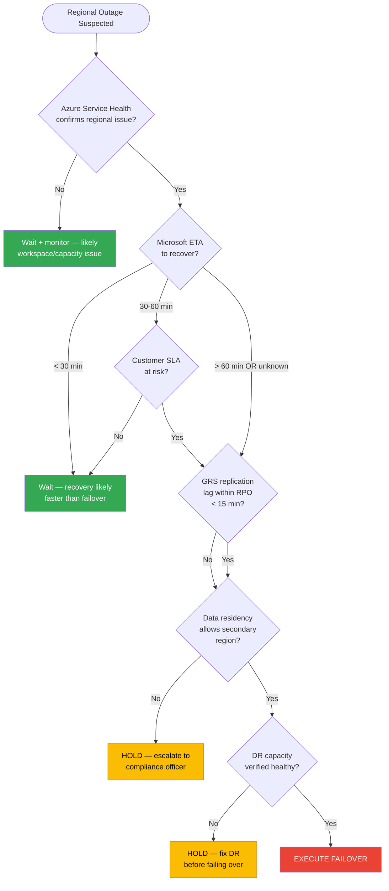
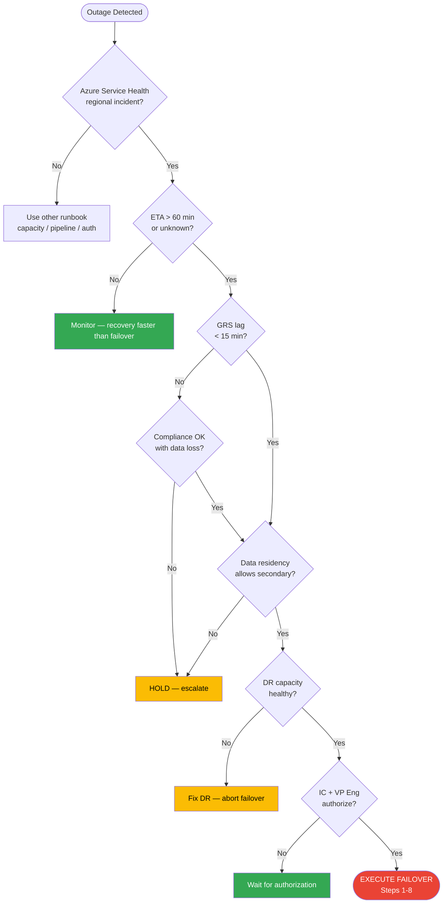
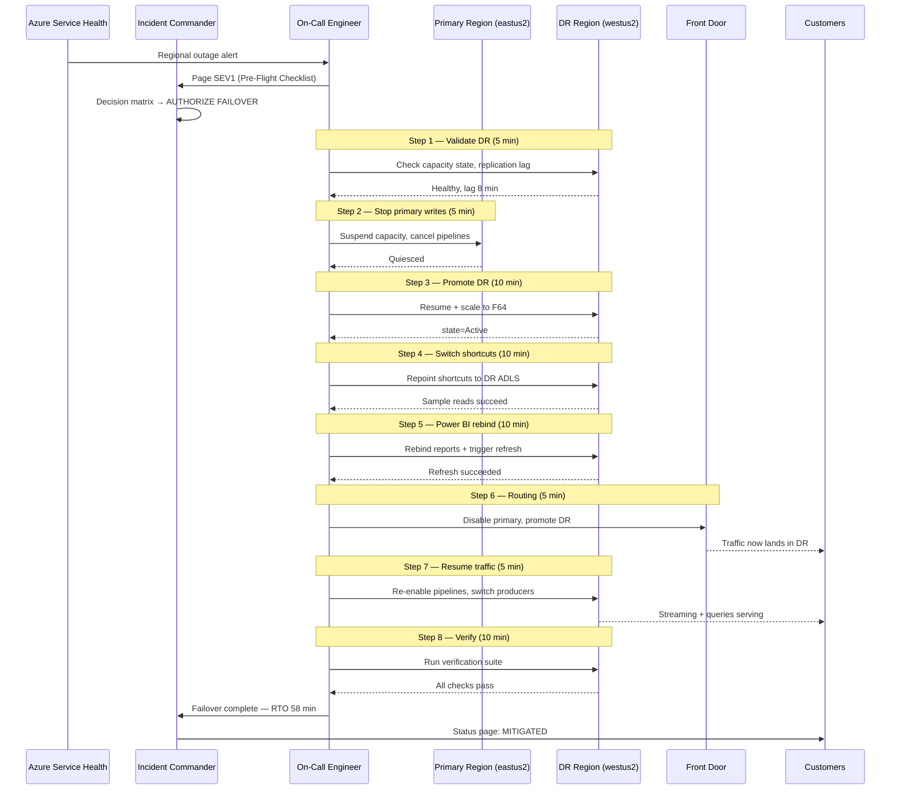

# 🌐 Multi-Region Failover Runbook

> **Last Updated**: 2026-04-27 | **Phase**: 14 (Wave 1) | **Feature**: 1.5
> **Audience**: On-call engineers, incident commanders, platform leads, Fabric admins
> **Purpose**: Step-by-step procedure for failing Fabric workloads from a primary region to a secondary region during a regional outage — including OneLake geo-redundancy, capacity failover, and Power BI report redirection.

<div align="center" markdown>


</div>

---

## Pre-Requisites

> **These must be configured BEFORE an incident.** A failover during outage assumes everything below is already in place. If any item is missing, fix it during the next DR drill — not mid-incident.

### Infrastructure Pre-Requisites

| # | Pre-Requisite | Validation | Owner |
|---|---------------|------------|-------|
| 1 | **Secondary Fabric capacity provisioned (warm standby)** — F32+ in paired region (e.g., `westus2` for `eastus2`), paused to control cost | `az fabric capacity show --name fabric-cap-dr-westus2` returns `state=Paused` | Platform Lead |
| 2 | **OneLake geo-redundancy enabled** — Capacity uses GRS or GZRS; replication lag < 15 min steady-state | `AzureStorageMetrics` GeoReplicationLag < 900,000 ms (15 min) | Fabric Admin |
| 3 | **Workspace pairs configured** — Every prod workspace has a DR twin (`ws-prod-{name}` ↔ `ws-dr-{name}`) deployed via `fabric-cicd` from the same git source | `fabric-cicd-deploy.py --verify-only --workspace-id $DR_WS_ID` succeeds | Platform Lead |
| 4 | **Power BI dataset replicas** — Semantic models deployed to DR workspace via Deployment Pipelines or git; Direct Lake bindings parameterized | DR semantic models present + refresh succeeds against DR Gold tables | BI Lead |
| 5 | **DNS / Front Door routing configured** — Azure Front Door or Traffic Manager profile with primary + secondary backends; health probes target Fabric API per region | `az network front-door show --name fd-fabric` lists both backends | Network Lead |
| 6 | **Key Vault replicated** — Workspace Identity / SP credentials available in DR-region Key Vault; CMK keys present | `az keyvault key list --vault-name kv-fabric-dr-westus2` matches primary keys | Security Lead |
| 7 | **ADLS Gen2 landing zones GRS** — All upstream landing storage accounts use Standard_GRS or GZRS | `az storage account show --query sku.name` returns `Standard_GRS` or `Standard_GZRS` | Data Engineering |
| 8 | **Eventstream/Event Hub DR namespaces** — Standby Event Hub namespace pre-provisioned in DR region; producer SDK has both endpoints in config | DR namespace exists; producer config has `EH_PRIMARY` + `EH_SECONDARY` | Streaming Lead |
| 9 | **Break-glass account** — Emergency Global Admin in DR region with FIDO2 hardware key; credentials in physical safe (dual-control) | Quarterly access review confirms credentials sealed | Security Lead |
| 10 | **Runbook tested in last 90 days** — Quarterly DR drill executed against DR region with documented RTO achieved | Last `dr-drill-{YYYY-MM-DD}.md` postmortem ≤ 90 days old | Incident Commander |

### Recovery Objectives (Documented Targets)

| Objective | Target | Source |
|-----------|--------|--------|
| **RTO (Recovery Time Objective)** | **1 hour** end-to-end (detection → traffic on DR) | [BCDR Best Practices](../best-practices/disaster-recovery-bcdr.md) Tier 1 |
| **RPO (Recovery Point Objective)** | **15 minutes** for Delta tables (OneLake GRS); **1 minute** for streaming (Event Hub replay) | Same |
| **Failback RTO** | **2 hours** (after primary stable for 24 hr) | Casino/Federal BCDR |
| **Drill cadence** | Quarterly tabletop + annual full failover | NIST SP 800-34 / FedRAMP CP-4 |

### Pre-Flight Checklist (run within 5 min of decision to failover)

- [ ] DR capacity status verified (`Paused` and resumable)
- [ ] OneLake replication lag < 15 min (within RPO)
- [ ] DR workspace last-deployed timestamp < 24 hr ago
- [ ] Front Door health probes confirm DR region is healthy
- [ ] Incident channel open and IC assigned
- [ ] Stakeholder notification draft ready

---

## Symptoms

| Indicator | Where to Check | Interpretation |
|-----------|----------------|----------------|
| Azure Service Health regional outage notification | Azure Portal → Service Health → Service issues | Confirmed regional incident — proceed to severity classification |
| Fabric capacity unavailable in primary region | `az fabric capacity show` returns 503/timeout | Capacity-level outage; may be regional or capacity-specific |
| Mass query failures from one region only | Workspace Monitoring KQL: `FabricCapacityMetrics \| where Region == "eastus2"` shows 0 events | Regional data plane issue |
| OneLake reads failing tenant-wide | Notebook reads return `StorageException`; `mssparkutils.fs.ls("Files/")` fails | Storage layer regional outage |
| Power BI reports stale or 5xx | `https://app.powerbi.com` returns 503 for tenant; refresh failures across all datasets | Front-end or capacity outage |
| Event Hub ingestion drops to zero | Eventstream input metric flatlines; producer SDK errors | Region or Event Hub namespace outage |
| Cross-region GRS replication lag spike (>1 hr) | `AzureStorageMetrics \| where MetricName == "GeoReplicationLag"` | Regional storage degradation precursor |
| Microsoft Fabric Status Page red | https://support.fabric.microsoft.com/support/ | Microsoft has confirmed the incident |

> **Important:** A single workspace failure or a single capacity throttling event is **not** a multi-region failover scenario. Use [capacity-throttling-response.md](capacity-throttling-response.md) or [auth-failure-playbook.md](auth-failure-playbook.md) for those.

---

## Severity Classification

| Condition | Severity | Why |
|-----------|----------|-----|
| **Regional outage confirmed by Azure Service Health, ETA > RTO target (1 hr), customer-facing impact** | **SEV1** | Multi-tenant blast radius, RTO breach imminent |
| **Capacity unreachable region-wide, ETA unknown** | **SEV1** | Treat as regional until proven otherwise |
| **Single workspace down, other workspaces in same region healthy** | **SEV2** | Workspace-scoped — use pipeline/auth runbooks |
| **GRS replication lag > 1 hr (no outage yet)** | **SEV2** | RPO at risk; investigate but do not failover |
| **DR drill / planned failover** | **SEV4** | Scheduled change; follow change management |

> **Rule of thumb:** Regional outage with customer impact **= SEV1**. Page VP Eng + Incident Commander immediately per [incident-response-template.md](incident-response-template.md).

---

## Decision Matrix: Failover vs Wait

> **The cost of an unnecessary failover is real:** ~2 hr engineering time, possible data divergence, customer-visible cutover, and a failback effort. Do not failover reflexively.



### Decision Criteria (must answer YES to all before failover)

| # | Criterion | If NO |
|---|-----------|-------|
| 1 | Azure Service Health confirms regional incident | Wait — likely capacity/workspace issue |
| 2 | Estimated outage duration > RTO target (1 hr) OR unknown | Wait — recovery faster than failover |
| 3 | OneLake GRS replication lag is within RPO (< 15 min) | Hold — escalate to compliance for data-loss exception approval |
| 4 | Data residency / sovereignty rules allow secondary region (US-East ↔ US-West OK; commercial → gov NOT OK) | Hold — compliance officer must approve |
| 5 | DR capacity is provisioned and resumable (Pre-Req #1) | Hold — re-provision DR before failing over |
| 6 | Incident Commander has authorized the failover | Wait — get IC sign-off (SEV1 requires VP Eng concurrence) |

### When to ALWAYS Wait

- Outage ETA < 30 min
- Single workspace impacted (use pipeline-failure runbook instead)
- Replication lag exceeds RPO **and** data loss not acceptable
- DR region itself is degraded
- Compliance constraint not yet cleared

---

## Failover Procedure

> **Total target: 60 minutes from decision to "DR serving traffic". Time-box each step. If a step exceeds 1.5x its budget, escalate.**

### Step 1 — Validate Secondary Region Health (Target: 5 min)

```bash
# 1.1 — Confirm secondary region is healthy
az rest --method get \
  --url "https://management.azure.com/subscriptions/${SUB}/providers/Microsoft.ResourceHealth/availabilityStatuses?api-version=2022-10-01&\$filter=location eq '${DR_REGION}'"

# 1.2 — Check DR capacity provisioning state
az fabric capacity show \
  --resource-group "${DR_RG}" \
  --name "fabric-cap-dr-${DR_REGION}" \
  --query "{name:name, state:properties.state, sku:sku.name}"

# 1.3 — Verify DR workspace last-deployed timestamp
python scripts/fabric-cicd-deploy.py \
  --workspace-id "${DR_WORKSPACE_ID}" \
  --verify-only

# 1.4 — Confirm OneLake DR replication lag is within RPO
# (Run in Workspace Monitoring KQL — see Quick-Reference Commands)
```

**Pass criteria:** Region healthy, DR capacity in `Paused` or `Active` state, last deployment < 24 hr, lag < 15 min.

**On fail:** Abort failover, escalate to Microsoft support — DR region itself is at risk.

---

### Step 2 — Stop Writes to Primary (if reachable) (Target: 5 min)

> **Goal:** Quiesce writes so secondary becomes the system of record cleanly. Skip if primary is fully unreachable.

```bash
# 2.1 — Pause primary capacity (if still reachable) to halt all compute
az fabric capacity suspend \
  --resource-group "${PRIMARY_RG}" \
  --name "fabric-cap-prod-${PRIMARY_REGION}"

# 2.2 — Stop upstream Event Hub producers (issue command to producer apps)
# Producer apps should switch to DR endpoint based on env flag
az appconfig kv set \
  --name "appcs-fabric" \
  --key "Streaming:ActiveRegion" \
  --value "${DR_REGION}" --yes

# 2.3 — Pause running pipelines via Fabric REST API
for ws in $(echo "$PRIMARY_WORKSPACES" | tr ',' ' '); do
  az rest --method post \
    --url "https://api.fabric.microsoft.com/v1/workspaces/${ws}/jobs/instances?jobType=Pipeline&action=cancel"
done
```

**Pass criteria:** No new writes hitting primary OneLake; pipelines cancelled.

**On fail (primary unreachable):** Skip — primary is already silent. Document timestamp of last known write for reconciliation.

---

### Step 3 — Promote (Resume + Scale) Secondary Capacity (Target: 10 min)

```bash
# 3.1 — Resume DR capacity
az fabric capacity resume \
  --resource-group "${DR_RG}" \
  --name "fabric-cap-dr-${DR_REGION}"

# 3.2 — Scale to production SKU (F64) if currently smaller
az rest --method patch \
  --url "https://management.azure.com/subscriptions/${SUB}/resourceGroups/${DR_RG}/providers/Microsoft.Fabric/capacities/fabric-cap-dr-${DR_REGION}?api-version=2023-11-01" \
  --body '{"sku": {"name": "F64", "tier": "Fabric"}}'

# 3.3 — Wait for capacity to be Active (poll up to 8 min)
for i in $(seq 1 16); do
  STATE=$(az fabric capacity show --resource-group "${DR_RG}" --name "fabric-cap-dr-${DR_REGION}" --query "properties.state" -o tsv)
  echo "Attempt ${i}: ${STATE}"
  if [ "${STATE}" = "Active" ]; then break; fi
  sleep 30
done
```

**Pass criteria:** Capacity state = `Active`, SKU = F64.

**On fail:** Engage Microsoft support (severity A — production down). See [Escalation](#escalation).

---

### Step 4 — Switch OneLake Shortcuts to Secondary Paths (Target: 10 min)

```python
# 4.1 — Run in DR workspace notebook (or via REST API script)
# Update all shortcuts in DR lakehouses to point at the DR-region ADLS / paired OneLake

import requests
DR_WORKSPACE_ID = "${DR_WORKSPACE_ID}"
DR_LAKEHOUSE_ID  = "${DR_LAKEHOUSE_ID}"
DR_ADLS_ACCOUNT  = "stfabriclz-dr"  # GRS-paired storage in DR region

# List existing shortcuts
shortcuts = requests.get(
    f"https://api.fabric.microsoft.com/v1/workspaces/{DR_WORKSPACE_ID}/items/{DR_LAKEHOUSE_ID}/shortcuts",
    headers={"Authorization": f"Bearer {TOKEN}"},
).json()

# Re-create each shortcut with DR target
for sc in shortcuts["value"]:
    new_target = sc["target"]["adlsGen2"]
    new_target["location"] = f"https://{DR_ADLS_ACCOUNT}.dfs.core.windows.net"
    requests.post(
        f"https://api.fabric.microsoft.com/v1/workspaces/{DR_WORKSPACE_ID}/items/{DR_LAKEHOUSE_ID}/shortcuts",
        headers={"Authorization": f"Bearer {TOKEN}"},
        json={"name": sc["name"], "path": sc["path"], "target": {"adlsGen2": new_target}},
    )
```

```bash
# 4.2 — If using ADLS storage account failover (single-account pattern)
az storage account failover \
  --name "stfabriclz" \
  --resource-group "${PRIMARY_RG}" \
  --no-wait

# 4.3 — Validate sample read from DR lakehouse
# (Run in DR workspace notebook)
# spark.read.format("delta").load("Tables/bronze_slot_telemetry").limit(10).show()
```

**Pass criteria:** Sample DR notebook reads return rows; row counts within RPO of last primary write.

**On fail:** GRS failover may still be in progress (can take 15+ min). Wait 5 min and retry; if still failing escalate.

---

### Step 5 — Repoint Power BI Datasets to Secondary Semantic Models (Target: 10 min)

```powershell
# 5.1 — Connect to Power BI service
Connect-PowerBIServiceAccount

# 5.2 — Rebind reports in DR workspace to DR semantic models
$drWorkspaceId = "${DR_WORKSPACE_ID}"
$reports = Get-PowerBIReport -WorkspaceId $drWorkspaceId

foreach ($r in $reports) {
    # Find the DR semantic model with same name as primary
    $drModel = Get-PowerBIDataset -WorkspaceId $drWorkspaceId | Where-Object Name -eq $r.Name
    if ($drModel) {
        Invoke-PowerBIRestMethod -Url "groups/$drWorkspaceId/reports/$($r.Id)/Rebind" `
            -Method Post -Body (@{datasetId = $drModel.Id} | ConvertTo-Json)
        Write-Host "Rebound $($r.Name) → $($drModel.Id)"
    }
}

# 5.3 — Trigger refresh of DR semantic models
Get-PowerBIDataset -WorkspaceId $drWorkspaceId | ForEach-Object {
    Invoke-PowerBIRestMethod -Url "groups/$drWorkspaceId/datasets/$($_.Id)/refreshes" -Method Post
}
```

**Pass criteria:** All critical reports list DR dataset as source; first refresh completes within 5 min.

**On fail:** Direct Lake reports auto-recover from Gold tables; check that DR Gold tables exist and are queryable.

---

### Step 6 — Update DNS / Front Door Routing (Target: 5 min)

```bash
# 6.1 — Disable primary backend in Front Door
az network front-door backend-pool backend update \
  --front-door-name "fd-fabric" \
  --resource-group "${NETWORK_RG}" \
  --pool-name "fabric-backends" \
  --index 1 \
  --enabled-state Disabled

# 6.2 — Promote secondary backend to weight 100
az network front-door backend-pool backend update \
  --front-door-name "fd-fabric" \
  --resource-group "${NETWORK_RG}" \
  --pool-name "fabric-backends" \
  --index 2 \
  --weight 100 \
  --enabled-state Enabled

# 6.3 — Purge Front Door cache to flush stale primary responses
az network front-door purge-endpoint \
  --resource-group "${NETWORK_RG}" \
  --name "fd-fabric" \
  --content-paths "/*"

# 6.4 — Alternative: Traffic Manager
az network traffic-manager endpoint update \
  --resource-group "${NETWORK_RG}" \
  --profile-name "tm-fabric" \
  --name "primary" --type azureEndpoints \
  --endpoint-status Disabled
```

**Pass criteria:** `dig` / `nslookup` of customer-facing hostname resolves to DR backend within TTL window (typically < 60 sec).

---

### Step 7 — Resume Traffic (Target: 5 min)

```bash
# 7.1 — Switch streaming producers (already prepared via App Configuration in Step 2.2)
# Producers tail App Config and reconnect within 30 sec

# 7.2 — Re-enable scheduled pipelines in DR workspace
for pipeline in $(echo "$DR_PIPELINES" | tr ',' ' '); do
  az rest --method post \
    --url "https://api.fabric.microsoft.com/v1/workspaces/${DR_WORKSPACE_ID}/items/${pipeline}/jobs/instances?jobType=Pipeline"
done

# 7.3 — Notify customers via status page that DR is serving
# (Manual: update https://status.your-org.com)
```

**Pass criteria:** Streaming ingestion rate in DR ≥ 80% of pre-incident primary rate within 5 min.

---

### Step 8 — Verify Customer Queries Succeed (Target: 10 min)

See [Verification](#verification) — must complete before declaring failover successful.

---

## Verification

> **Do not declare the incident "MITIGATED" until every check below passes.** Run all checks; document results in incident channel.

### 8.1 Capacity Health

```bash
# Capacity must be Active in DR
az fabric capacity show --resource-group "${DR_RG}" --name "fabric-cap-dr-${DR_REGION}" \
  --query "{name:name, state:properties.state, sku:sku.name}"
# Expected: state=Active, sku=F64
```

### 8.2 Sample Customer Queries

Run in DR workspace notebook — these are the canonical "is the platform working?" queries:

```python
# 8.2.1 — Bronze layer freshness (RPO check)
spark.sql("""
    SELECT MAX(event_timestamp) AS latest_event,
           COUNT(*) AS row_count
    FROM lh_bronze.bronze_slot_telemetry
""").show(truncate=False)
# Expected: latest_event within 15 min of failover start

# 8.2.2 — Silver layer integrity
spark.sql("""
    SELECT COUNT(*) AS row_count,
           COUNT(DISTINCT machine_id) AS unique_machines
    FROM lh_silver.silver_slot_cleansed
""").show()

# 8.2.3 — Gold layer KPI
spark.sql("""
    SELECT * FROM lh_gold.gold_slot_performance
    WHERE business_date = current_date() - 1
    LIMIT 10
""").show()
```

### 8.3 Power BI Refresh

- [ ] Trigger refresh on top-5 customer-facing datasets — must complete within 5 min
- [ ] Open one report from each domain (casino, federal/USDA, federal/EPA) — visuals render
- [ ] No 5xx errors in Power BI service logs

### 8.4 Streaming Ingestion

```kql
// In DR Workspace Monitoring
EventstreamMetrics
| where TimeGenerated > ago(15m)
| where WorkspaceId == "${DR_WORKSPACE_ID}"
| summarize EventsPerMin = count() by bin(TimeGenerated, 1m), EventstreamName
| render timechart
```

Expected: ingestion rate ≥ 80% of pre-incident baseline.

### 8.5 End-to-End Smoke Test

- [ ] Submit synthetic transaction at source → confirm landing in DR Bronze within 5 min
- [ ] Confirm Silver/Gold pipeline picks it up on next schedule
- [ ] Confirm Power BI report shows the new row

### 8.6 Verification Pass Criteria

All of:
- All KQL/SQL queries return expected row counts (within RPO tolerance)
- Power BI refresh succeeds for all critical datasets
- Streaming rate within 80% of baseline
- No SEV1/SEV2 alerts firing on DR capacity
- Customer-reported queries resolved

If any check fails, **do not declare resolved** — continue mitigation or escalate.

---

## Failback Procedure

> **Failback is its own change.** Do not failback during the incident. Wait until primary is stable for 24 hr and schedule failback as a planned change with full change management approval.

### Failback Pre-Conditions

- [ ] Primary region healthy for **24 hours minimum**
- [ ] Microsoft confirms incident resolved
- [ ] Reverse data-sync has caught up (DR → primary lag < 15 min)
- [ ] Change Management ticket approved
- [ ] Off-peak window scheduled (target: lowest-traffic hour)

### Step 1 — Reverse-Sync Data from Secondary to Primary (Target: 30-120 min)

```python
# Use Mirroring or scripted Delta sync to push DR data back to primary OneLake
# Pattern: read DR Delta tables, write as overwrite to primary

tables_to_sync = [
    "bronze_slot_telemetry",
    "silver_slot_cleansed",
    "gold_slot_performance",
    "gold_compliance_ctr",
]

for table in tables_to_sync:
    df = spark.read.format("delta").load(f"abfss://{DR_WS}@onelake.dfs.fabric.microsoft.com/Tables/{table}")
    df.write.format("delta").mode("overwrite") \
        .option("overwriteSchema", "true") \
        .save(f"abfss://{PRIMARY_WS}@onelake.dfs.fabric.microsoft.com/Tables/{table}")
    print(f"Synced {table}: {df.count()} rows")
```

> **Mirroring shortcut:** If using Fabric Mirroring (see [mirroring.md](../features/mirroring.md)) the reverse direction can be configured with a new mirror profile; this avoids manual sync code.

### Step 2 — Verify Integrity (Target: 30 min)

```python
# Row count + checksum comparison
for table in tables_to_sync:
    primary_cnt = spark.sql(f"SELECT COUNT(*) AS c FROM primary.{table}").collect()[0]["c"]
    dr_cnt      = spark.sql(f"SELECT COUNT(*) AS c FROM dr.{table}").collect()[0]["c"]
    primary_chk = spark.sql(f"SELECT SHA2(STRING_AGG(CAST(* AS STRING)), 256) AS h FROM primary.{table}").collect()[0]["h"]
    dr_chk      = spark.sql(f"SELECT SHA2(STRING_AGG(CAST(* AS STRING)), 256) AS h FROM dr.{table}").collect()[0]["h"]
    assert primary_cnt == dr_cnt, f"Row count mismatch on {table}: P={primary_cnt} D={dr_cnt}"
    assert primary_chk == dr_chk, f"Checksum mismatch on {table}"
    print(f"{table} OK: {primary_cnt} rows, checksum match")
```

### Step 3 — Quiesce Secondary Writes (Target: 5 min)

```bash
# Cancel all running pipelines in DR workspace
for ws in "${DR_WORKSPACE_ID}"; do
  az rest --method post \
    --url "https://api.fabric.microsoft.com/v1/workspaces/${ws}/jobs/instances?jobType=Pipeline&action=cancel"
done

# Switch streaming producers back to primary endpoint
az appconfig kv set \
  --name "appcs-fabric" \
  --key "Streaming:ActiveRegion" \
  --value "${PRIMARY_REGION}" --yes
```

### Step 4 — Switch Routing Back (Target: 5 min)

```bash
# Re-enable primary in Front Door, demote secondary to standby weight
az network front-door backend-pool backend update \
  --front-door-name "fd-fabric" --resource-group "${NETWORK_RG}" \
  --pool-name "fabric-backends" --index 1 \
  --enabled-state Enabled --weight 100

az network front-door backend-pool backend update \
  --front-door-name "fd-fabric" --resource-group "${NETWORK_RG}" \
  --pool-name "fabric-backends" --index 2 \
  --weight 0
```

### Step 5 — Validate Primary (Target: 30 min)

Run full [Verification](#verification) checklist against primary workspace.

### Step 6 — Re-Pause DR Capacity (Target: 5 min)

```bash
# Cost optimization — return DR to warm-standby state
az fabric capacity suspend \
  --resource-group "${DR_RG}" \
  --name "fabric-cap-dr-${DR_REGION}"
```

---

## Post-Incident Actions

| Action | Owner | Due |
|--------|-------|-----|
| Data reconciliation report (rows ingested DR vs. expected primary) | Data Engineering Lead | Within 24 hr |
| Customer comms — "DR Activation Notice" with impact summary | Communications Lead | Within 24 hr |
| Compliance notifications (NIGC/FinCEN for casino; OMB/CISA for federal) | Incident Commander + Compliance Officer | Per regulatory deadline |
| Gap analysis — what worked, what didn't, missing automation | Incident Commander | Within 48 hr |
| Postmortem published | IC + Tech Lead | Within 48 hr (SEV1) |
| Action items entered into Archon | IC | Within 5 business days |
| Update this runbook with lessons learned | Platform Lead | Within 5 business days |
| Schedule next DR drill (if last drill > 60 days ago) | Platform Lead | Within 30 days |

Use the [Blameless Postmortem Template](incident-response-template.md#blameless-postmortem-template).

---

## Escalation

### Microsoft Support (Capacity / Service Issues)

| Issue | Severity | Path |
|-------|----------|------|
| DR capacity won't resume | Severity A | Azure Portal → Help + support → New support request → Production system down |
| GRS replication lag > 1 hr | Severity B | Same path; reference incident ID |
| Fabric service-side errors during failover | Severity A | Same path; cite Service Health incident ID |
| Power BI tenant-wide outage | Severity A | Power Platform support |

**Microsoft Premier/Unified support phone:** (use your contracted support number — store in incident channel pin)

### Internal Escalation Path

```
On-Call Engineer ──(5 min)──▶ Platform Lead ──(15 min)──▶ Incident Commander
                                                    │
                                              (30 min for SEV1)
                                                    ▼
                                              VP Engineering ──(45 min)──▶ CTO/CDO
```

### Executive Communications

For SEV1 sustained > 1 hour, the IC must brief executives:

| Recipient | Trigger | Channel |
|-----------|---------|---------|
| VP Engineering | Failover decision made | Phone + Teams |
| CTO / CDO | SEV1 sustained > 1 hr | Email briefing every 60 min |
| CFO | Customer SLA breach likely | Email from VP Eng |
| Compliance Officer | Any SOX/HIPAA/FedRAMP impact | Phone + email immediately |
| Legal | Regulatory notification required | Email |
| Customer Success | Customer-visible impact | Slack + email |

Use the [Stakeholder Update Template](incident-response-template.md#stakeholder-update-template).

---

## Communication Tree Reference

See the canonical [Communication Tree](incident-response-template.md#communication-tree) in the anchor runbook. Specific multi-region failover additions:

| Audience | When | Owner |
|----------|------|-------|
| Casino Gaming Commission | Within 24 hr (regulatory requirement) | Compliance Officer |
| FinCEN | If CTR/SAR filing window missed | Compliance Officer |
| Federal OCIO (per agency) | Per agency-specific timeline (USDA: 2 hr, SBA: 1 hr, NOAA: immediate, EPA: 4 hr, DOI: 4 hr) | Agency liaison |
| OMB / CISA | If FedRAMP system, per ATO terms | COOP Coordinator |

---

## Quick-Reference Commands

### Capacity Status Across Regions (Azure CLI)

```bash
# List all Fabric capacities and their state
az resource list --resource-type "Microsoft.Fabric/capacities" \
  --query "[].{name:name, region:location, state:properties.state, sku:sku.name}" \
  --output table

# Get specific capacity health
az fabric capacity show \
  --resource-group "${RG}" \
  --name "${CAPACITY_NAME}" \
  --query "{state:properties.state, sku:sku.name, region:location}"

# Resume / Suspend
az fabric capacity resume  --resource-group "${RG}" --name "${CAPACITY_NAME}"
az fabric capacity suspend --resource-group "${RG}" --name "${CAPACITY_NAME}"

# Scale SKU (mid-incident upsize)
az rest --method patch \
  --url "https://management.azure.com/subscriptions/${SUB}/resourceGroups/${RG}/providers/Microsoft.Fabric/capacities/${CAPACITY_NAME}?api-version=2023-11-01" \
  --body '{"sku": {"name": "F64", "tier": "Fabric"}}'
```

### Front Door / Traffic Manager Updates

```bash
# Front Door — disable primary backend
az network front-door backend-pool backend update \
  --front-door-name "fd-fabric" --resource-group "${NETWORK_RG}" \
  --pool-name "fabric-backends" --index 1 --enabled-state Disabled

# Front Door — purge cache after failover
az network front-door purge-endpoint \
  --resource-group "${NETWORK_RG}" --name "fd-fabric" --content-paths "/*"

# Traffic Manager — disable primary endpoint
az network traffic-manager endpoint update \
  --resource-group "${NETWORK_RG}" --profile-name "tm-fabric" \
  --name "primary" --type azureEndpoints --endpoint-status Disabled

# DNS — direct CNAME flip (if not using Front Door)
az network dns record-set cname set-record \
  --resource-group "${DNS_RG}" --zone-name "your-org.com" \
  --record-set-name "fabric" --cname "fabric-dr.westus2.cloudapp.azure.com"
```

### Power BI Dataset Rebinding (PowerShell)

```powershell
Connect-PowerBIServiceAccount

# Rebind a single report to a new dataset
$workspaceId = "${DR_WORKSPACE_ID}"
$reportId    = "${REPORT_ID}"
$newDsId     = "${DR_DATASET_ID}"

Invoke-PowerBIRestMethod -Url "groups/$workspaceId/reports/$reportId/Rebind" `
    -Method Post -Body (@{datasetId = $newDsId} | ConvertTo-Json)

# Refresh all datasets in DR workspace
Get-PowerBIDataset -WorkspaceId $workspaceId | ForEach-Object {
    Invoke-PowerBIRestMethod -Url "groups/$workspaceId/datasets/$($_.Id)/refreshes" -Method Post
    Write-Host "Refresh started: $($_.Name)"
}

# Update gateway / data source connection (if not Direct Lake)
Invoke-PowerBIRestMethod -Url "gateways/$gatewayId/datasources/$dsId" `
    -Method Patch -Body (@{
        connectionDetails = '{"server":"fabric-dr.westus2","database":"lh_gold"}'
    } | ConvertTo-Json)
```

### KQL — Cross-Region Telemetry

```kql
// Replication lag across regions
AzureStorageMetrics
| where TimeGenerated > ago(1h)
| where MetricName == "GeoReplicationLag"
| summarize AvgLagSec = avg(Value)/1000, MaxLagSec = max(Value)/1000
    by bin(TimeGenerated, 5m), Resource
| render timechart
```

```kql
// Capacity utilization by region
FabricCapacityMetrics
| where TimeGenerated > ago(1h)
| extend Region = tostring(split(ResourceId, "/")[4])
| summarize AvgCU = avg(CUSeconds), MaxCU = max(CUSeconds)
    by bin(TimeGenerated, 5m), Region, CapacityName
| render timechart
```

```kql
// Cross-region pipeline failure correlation
FabricPipelineRuns
| where TimeGenerated > ago(2h)
| where Status == "Failed"
| extend Region = tostring(split(WorkspaceId, "-")[2])
| summarize Failures = count() by bin(TimeGenerated, 5m), Region
| render columnchart
```

```kql
// DR readiness — last successful deployment per workspace
FabricDeploymentLogs
| where TimeGenerated > ago(7d)
| where Status == "Succeeded"
| summarize LastDeploy = max(TimeGenerated) by WorkspaceId, Environment
| extend HoursSinceDeploy = datetime_diff("hour", now(), LastDeploy)
| extend ReadyForFailover = iff(HoursSinceDeploy < 24, "✅", "⚠️ Stale")
```

### Bicep Reference (DR Capacity)

The DR capacity uses the same module as production — see [`infra/modules/fabric/fabric-capacity.bicep`](https://github.com/fgarofalo56/Suppercharge_Microsoft_Fabric/blob/main/infra/modules/fabric/fabric-capacity.bicep). Set `skuName: 'F32'` and add `tags: { Environment: 'DR', AutoPause: 'true' }` to keep cost low until activation.

---

## Diagrams

### Failover Decision Tree



### Failover Sequence Diagram



---

## Related Runbooks

| Runbook | When to Use |
|---------|-------------|
| [Incident Response Template](incident-response-template.md) | Anchor — every incident starts here |
| [Capacity Throttling Response](capacity-throttling-response.md) | Single-capacity throttling (not regional) |
| [Pipeline Failure Triage](pipeline-failure-triage.md) | Pipeline-scoped failure inside one region |
| [Auth Failure Playbook](auth-failure-playbook.md) | Workspace Identity / SP issues |
| [Tenant Migration (Dev/Staging/Prod)](tenant-migration-dev-staging-prod.md) | Bad-deployment rollback (not regional outage) |
| [Data Quality Incident](data-quality-incident.md) | GE failure, schema breach |

## Related Best-Practice Docs

| Document | Description |
|----------|-------------|
| [Disaster Recovery & BCDR](../best-practices/disaster-recovery-bcdr.md) | RTO/RPO targets, BCDR architecture, FedRAMP CP controls |
| [Multi-Tenant Workspace Architecture](../best-practices/multi-tenant-workspace-architecture.md) | Workspace pairing patterns for primary/DR |
| [Network Security](../best-practices/network-security.md) | Front Door, private endpoints, DR network topology |
| [Customer-Managed Keys](../best-practices/customer-managed-keys.md) | CMK key replication for DR region |
| [Fabric CI/CD Deployment](../best-practices/fabric-cicd-deployment.md) | Git-based deployment to keep DR workspaces current |
| [Capacity Planning & Cost Optimization](../best-practices/capacity-planning-cost-optimization.md) | DR capacity cost trade-offs (paused vs active) |
| [Mirroring](../features/mirroring.md) | Cross-region replication for warehouses & SQL DBs |

---

[⬆️ Back to Top](#-multi-region-failover-runbook) | [📚 Runbooks Index](index.md) | [🏠 Home](../index.md)
