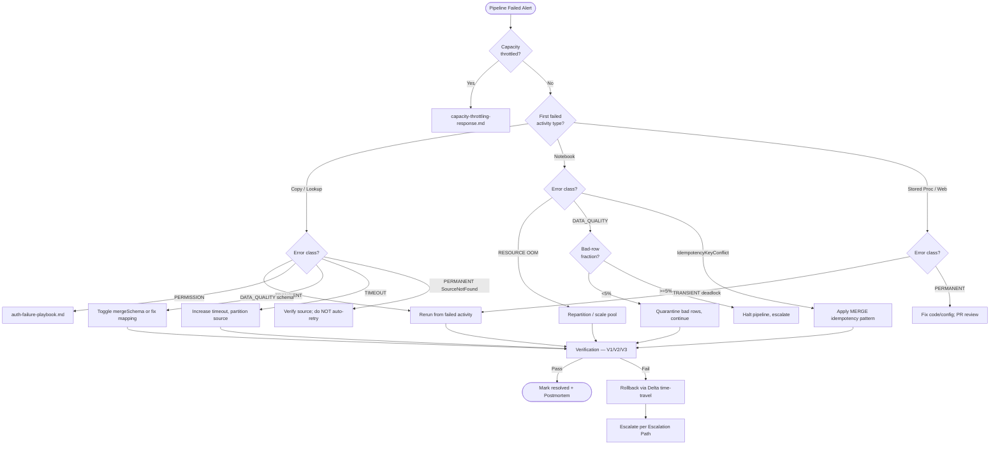

# 🛠️ Pipeline Failure Triage

> **Last Updated**: 2026-04-27 | **Phase**: 14 (Wave 1) | **Feature**: 1.3
> **Audience**: On-call data engineers, platform operators, pipeline owners
> **Purpose**: Diagnose and resolve Microsoft Fabric Data Pipeline failures — failed activities, retry exhaustion, timeouts, source connectivity, sink errors

<div align="center" markdown>


</div>

---

## Symptoms

Trigger this runbook when **any** of the following are observed:

- **Fabric Monitor** shows pipeline status `Failed` or `PartiallyFailed` in the *Monitoring hub*.
- **Data Activator / Action Group alert** fires from `pipeline_errors` or a workspace KQL alert.
- **Downstream consumer signal**: Power BI report stale, Lakehouse row count flat vs. baseline, GE checkpoint missing a partition, semantic model refresh fails.
- **Partial loads**: Bronze partition exists but row count materially below the rolling 7-day same-hour average.
- **Retry exhaustion**: activity has hit `retryPolicy.count` and pipeline run is `Failed`.
- **Copy Job watermark stale** (>2× schedule frequency — see [copy-job-cdc.md](../features/copy-job-cdc.md)).
- **Notebook activity** ends with `2147467259` / generic `UserError` in pipeline output.

> **Companion to [incident-response-template.md](incident-response-template.md)** — open that template **first**, then drill into this runbook.

---

## Severity Classification

Use the master [Severity Matrix](incident-response-template.md#severity-matrix). Pipeline-specific mapping:

| Pipeline Failure Scope | Severity | Response SLA | Escalation |
|------------------------|----------|--------------|------------|
| Compliance pipeline (CTR/SAR/W-2G/HIPAA) failed in filing window | **SEV1** | 5 min page | VP Eng + Compliance Officer |
| Gold-layer pipeline failed; Power BI prod report stale | **SEV2** | 15 min page | Platform Lead |
| Bronze ingestion failed >2 hr; downstream Silver/Gold blocked | **SEV2** | 15 min page | Platform Lead |
| Single non-critical pipeline failed; backfill window available | **SEV3** | 2 hr ack | Team Lead |
| Dev/Staging pipeline failure; no prod consumer | **SEV4** | 24 hr ack | Ticket queue |

> **Rule of thumb:** if the failure prevents a regulatory filing or a contractually-bound report, classify **SEV1** and page immediately. Compliance > convenience.

---

## Symptom → Cause Matrix

Map the surface error to the most-likely classification before applying a fix. Classification drives whether you **retry**, **fix-and-replay**, or **fail-forward**. See [error-handling-monitoring.md](../best-practices/error-handling-monitoring.md) for taxonomy details.

| Error Code / Pattern | Activity Type | Classification | Likely Cause | First Action |
|----------------------|---------------|----------------|--------------|--------------|
| `SourceNotFound` / `Path does not exist` | Copy / Notebook | PERMANENT | Source file/table missing or moved | Verify source system; do **not** retry blindly |
| `InvalidSchema` / `Schema mismatch` / `AnalysisException: cannot resolve` | Copy / Notebook | DATA_QUALITY | Source schema drift (new/dropped/renamed column) | Compare schemas; toggle `mergeSchema` if additive |
| `QuotaExceeded` / `429` / `CapacityThrottled` | Copy / Notebook | TRANSIENT | Capacity throttling, source API rate limit | Backoff & retry; see [capacity-throttling-response.md](capacity-throttling-response.md) |
| `AuthenticationFailed` / `401` / `403` / `Unauthorized` | Any | PERMISSION | Workspace Identity / SP / MI credential expired or scope removed | Re-grant; see [auth-failure-playbook.md](auth-failure-playbook.md) |
| `Timeout` / `Operation timed out` / `Command timeout` | Copy / Lookup / Stored Proc | TIMEOUT | Long-running query, large batch, slow source | Increase timeout, partition source query |
| `NetworkUnreachable` / `TNS:Connect timeout` / `ETIMEDOUT` | Copy (DB source) | TRANSIENT | VPN/ExpressRoute drop, gateway down, firewall change | Validate connectivity; check gateway health |
| `SinkDataIntegrityError` | Copy → Delta | DATA_QUALITY | NOT NULL/CHECK violation, type coercion failure | Inspect rejected rows; quarantine |
| `ChecksumMismatch` | Copy (file source) | DATA_QUALITY | Source file truncated/corrupt mid-transfer | Re-fetch source; do not commit partial |
| `IdempotencyKeyConflict` / `MERGE found duplicates` | Notebook MERGE | DATA_QUALITY | Source emitted duplicate keys in same batch | Dedupe staging frame before MERGE |
| `ConcurrentAppendException` | Notebook write | TRANSIENT | Two writers hit same Delta table version | Stagger schedules, retry |
| `OutOfMemoryError` / `Job aborted due to stage failure` | Notebook (Spark) | RESOURCE | Skewed join, unbounded collect, undersized pool | Repartition, broadcast small side, scale pool |
| `DeadlockVictim` / `Lock wait timeout exceeded` | Stored Proc | TRANSIENT | Source DB contention | Retry; coordinate with source DBA |
| `ServiceUnavailable` / `503` / `504` | Web / REST source | TRANSIENT | Upstream API outage | Backoff, then escalate to source owner |
| `WatermarkStale` (Copy Job) | Copy Job | PERMANENT | Previous run failed before watermark commit | Reset watermark; replay from last good run |

---

## Diagnostic Steps

### Step 1 — Open Pipeline Run in Fabric Monitor

```
Fabric Portal → Workspace → Monitoring hub
  Filter:
    Item type   = Data pipeline
    Status      = Failed (last 24h)
    Workspace   = ${WS_NAME}
  Sort: Start time DESC
```

Click the failed run to open the **Pipeline run details** blade.

### Step 2 — Identify the First Failed Activity

Pipelines often cascade — a downstream activity may fail because an upstream activity produced no output. **Always investigate the earliest failed activity, not the last.**

```
Pipeline run → Activity runs tab
  Sort: Activity start time ASC
  Find: First row with Status = Failed
```

### Step 3 — Extract Error Details

Click the failed activity → **Output** tab → expand the `error` object. Capture for the incident channel: `errorCode`, `message` (first 200 chars), `target` (activity name), `failureType` (`UserError` = our fault, `SystemError` = Fabric platform fault).

```json
{ "errorCode": "2200", "message": "ErrorCode=UserErrorInvalidColumnName,...",
  "failureType": "UserError", "target": "Copy_USDA_NASS_To_Bronze" }
```

### Step 4 — Cross-Reference Centralized Error Table

If the pipeline uses the [Single Error Activity pattern](../best-practices/error-handling-monitoring.md#single-error-activity-pattern):

```sql
SELECT TOP 20 error_id, error_timestamp, activity_name,
       error_classification, severity, error_message, retry_count, correlation_id
FROM dbo.pipeline_errors
WHERE pipeline_run_id = '${PIPELINE_RUN_ID}'
ORDER BY error_timestamp ASC;
```

### Step 5 — Capacity & Source Health

```bash
az rest --method get --url "https://api.fabric.microsoft.com/v1/capacities/${CAPACITY_ID}"
nc -vz ${SOURCE_HOST} ${SOURCE_PORT}
```

For Notebook activities, click **Output → notebookutils logs** or open the linked Spark application UI. If capacity is throttled, **stop here** — switch to [capacity-throttling-response.md](capacity-throttling-response.md).

---

## Resolution Procedures

### R1 — Retry / Replay (Single Activity vs Full Pipeline)

**Use when:** classification is `TRANSIENT`, retries are not exhausted, and source is healthy.

```
Fabric Monitor → Failed pipeline run → Rerun ▼
  ☑ Rerun from failed activity   ← preferred (preserves successful upstream work)
  ☐ Rerun entire pipeline        ← only if upstream produced bad output
```

REST equivalent:

```bash
# Rerun from failed activity (Fabric REST API)
az rest --method post \
  --url "https://api.fabric.microsoft.com/v1/workspaces/${WS_ID}/items/${PIPELINE_ID}/jobs/instances/${RUN_ID}?jobType=Pipeline" \
  --headers "Content-Type=application/json" \
  --body '{"executionData": {"runMode": "rerunFromFailed"}}'
```

### R2 — Schema Evolution Toggles

**Use when:** classification is `DATA_QUALITY` and the change is **additive** (new columns) — not breaking (renamed/dropped/retyped).

```python
# Notebook activity — enable additive schema merge for Delta sink
spark.conf.set("spark.databricks.delta.schema.autoMerge.enabled", "true")

(df_source
   .write
   .format("delta")
   .mode("append")
   .option("mergeSchema", "true")
   .saveAsTable("lh_bronze.bronze_usda_crop_production"))
```

> **Do NOT enable autoMerge for Silver/Gold layers** — schema drift in business tables must go through PR review. See [medallion-architecture-deep-dive.md](../best-practices/medallion-architecture-deep-dive.md).

For Copy Activity sinks, edit the activity → **Mapping** tab → **Import schemas** to refresh, then save.

### R3 — Source Connectivity Validation

**Use when:** classification is `NetworkUnreachable` / `TNS:Connect timeout`.

```python
import socket, traceback

SOURCE_HOST = "${SOURCE_HOST}"; SOURCE_PORT = ${SOURCE_PORT}

# Layer 1 — TCP reachability
try:
    with socket.create_connection((SOURCE_HOST, SOURCE_PORT), timeout=10):
        print(f"OK  TCP {SOURCE_HOST}:{SOURCE_PORT}")
except OSError as e:
    print(f"FAIL TCP: {e}"); raise

# Layer 2 — credential / driver
try:
    spark.read.format("jdbc") \
        .option("url", f"jdbc:sqlserver://{SOURCE_HOST}:{SOURCE_PORT};database=${DB}") \
        .option("dbtable", "(SELECT 1 AS hc) h") \
        .option("authentication", "ActiveDirectoryMSI").load().show()
    print("OK  JDBC auth")
except Exception:
    traceback.print_exc(); raise
```

Layer 1 fails → gateway/firewall/DNS — escalate network team.
Layer 1 passes, Layer 2 fails → see [auth-failure-playbook.md](auth-failure-playbook.md).

### R4 — Sink Rollback via Delta Time-Travel

**Use when:** the failed run **partially wrote** corrupt data to Bronze/Silver/Gold and downstream consumers must see only the last good state.

```sql
-- Step 1: identify the last good Delta version BEFORE the failed run started
DESCRIBE HISTORY lh_bronze.bronze_usda_crop_production;
-- Look for the operation row with timestamp just BEFORE the failed pipeline start

-- Step 2: restore to that version
RESTORE TABLE lh_bronze.bronze_usda_crop_production
TO VERSION AS OF 248;

-- OR by timestamp (often cleaner)
RESTORE TABLE lh_bronze.bronze_usda_crop_production
TO TIMESTAMP AS OF '2026-04-27 06:00:00';
```

```python
# Or in PySpark
spark.sql("""
  RESTORE TABLE lh_silver.silver_compliance_events
  TO TIMESTAMP AS OF '2026-04-27 05:55:00'
""")
```

> **CRITICAL:** Notify downstream consumers BEFORE running RESTORE — semantic models reading the table will see row counts shift. See [Verification](#verification) below.

### R5 — Idempotency MERGE Pattern

**Use when:** classification is `IdempotencyKeyConflict` / duplicate keys, or replaying a partially-completed run that may double-load.

```python
from delta.tables import DeltaTable
from pyspark.sql import functions as F

# Dedupe staging BEFORE merge — idempotency on natural key
staging = raw_df.withColumn("_ingest_ts", F.current_timestamp()) \
                .dropDuplicates(["event_id"])

target = DeltaTable.forName(spark, "lh_bronze.bronze_compliance_events")
(target.alias("t").merge(staging.alias("s"), "t.event_id = s.event_id")
   .whenMatchedUpdate(
       condition="s._ingest_ts > t._ingest_ts",
       set={c: f"s.{c}" for c in staging.columns})
   .whenNotMatchedInsertAll().execute())
```

This pattern is **safe to replay** — re-running it after a failure produces the same result.

### R6 — Backfill Window Calculation

**Use when:** the pipeline missed one or more scheduled runs and only the gap needs loading.

```python
# Compute the gap from current watermark
wm = spark.sql("SELECT MAX(transaction_timestamp) AS wm FROM lh_bronze.bronze_slot_transactions") \
          .collect()[0]["wm"]

# Source query bounded to the gap — avoids full re-fetch
backfill = spark.read.format("jdbc").option("url", JDBC_URL).option("query", f"""
    SELECT * FROM SLOT_TRANSACTIONS
     WHERE TRANSACTION_TIMESTAMP >  '{wm.isoformat()}'
       AND TRANSACTION_TIMESTAMP <= CURRENT_TIMESTAMP
""").load()
print(f"Backfill: {wm} → now, rows={backfill.count()}")
```

For Copy Job: `Monitor → Watermark State → Reset` (set to last good timestamp), then trigger an immediate run. See [copy-job-cdc.md](../features/copy-job-cdc.md#monitoring-and-troubleshooting).

---

## Quarantine Pattern

When a small fraction of records fail data-quality checks, **do not fail the whole pipeline** — quarantine bad rows and continue. This keeps Bronze fresh while preserving evidence for triage.

```python
from pyspark.sql import functions as F

bad  = raw_df.filter(F.col("event_id").isNull() | F.col("event_type").isNull() | (F.col("amount") < 0))
good = raw_df.subtract(bad)

good.write.mode("append").format("delta").saveAsTable("lh_bronze.bronze_compliance_events")

(bad.withColumn("_quarantine_reason", F.lit("required_null_or_negative_amount"))
    .withColumn("_quarantine_ts",     F.current_timestamp())
    .withColumn("_pipeline_run_id",   F.lit("${PIPELINE_RUN_ID}"))
    .write.mode("append").format("delta")
    .saveAsTable("lh_bronze.dlq_bronze_compliance_events"))

ratio = bad.count() / max(raw_df.count(), 1)
if ratio > 0.05:
    raise ValueError(f"DLQ ratio {ratio:.1%} > 5% — investigate source")
```

DLQ governance: retention 30 days (90 for compliance domains); triage daily — rows >7 days old auto-page pipeline owner; once root cause fixed, MERGE good DLQ rows back into target.

---

## Verification

After applying any resolution, **all** of the following must pass before declaring resolved.

### V1 — Target Table Row Count vs Baseline

```sql
SELECT COUNT(*) AS rows_total, COUNT(DISTINCT event_id) AS rows_distinct,
       MAX(event_ts) AS max_ts,
       SUM(CASE WHEN event_ts >= '${PIPELINE_START}' THEN 1 ELSE 0 END) AS rows_this_run
FROM lh_silver.silver_compliance_events;
```

Expected: `rows_this_run` within ±10% of rolling 7-day average for same hour-of-day.

### V2 — Freshness Check

```python
from datetime import datetime, timezone
max_ts = spark.sql("SELECT MAX(event_ts) m FROM lh_silver.silver_compliance_events").collect()[0]["m"]
age_min = (datetime.now(timezone.utc) - max_ts).total_seconds() / 60
assert age_min < 30, f"Table stale: {age_min:.1f} min"
```

### V3 — Downstream Consumer Signal

- [ ] Power BI dataset refresh **Succeeded** (re-run if needed)
- [ ] Semantic model row count card matches expected
- [ ] GE checkpoint passes: `great_expectations checkpoint run silver_compliance_checkpoint`
- [ ] No related downstream alerts firing in the last 30 min

### V4 — Watch for 2× Incident Duration

Per [incident-response-template.md §3.3](incident-response-template.md#33-verify-resolution): a 2 hr incident → watch **4 hr** before declaring fully resolved.

---

## Rollback

If the resolution **made things worse** or introduces a regression:

```sql
-- 1. Roll back target table to pre-incident state
DESCRIBE HISTORY lh_silver.silver_compliance_events;
RESTORE TABLE lh_silver.silver_compliance_events TO VERSION AS OF ${LAST_GOOD_VERSION};

-- 2. Snapshot the bad version into an audit table for forensics
CREATE TABLE lh_audit.audit_silver_compliance_events_${YYYYMMDD_HHMM} USING DELTA
AS SELECT * FROM lh_silver.silver_compliance_events VERSION AS OF ${BAD_VERSION};
```

Pipeline-definition rollback (revert via fabric-cicd):

```bash
git revert ${BAD_COMMIT_SHA} && git push origin hotfix/incident-${YYYYMMDD}-pipeline-revert
python scripts/fabric-cicd-deploy.py --workspace-id ${WS_ID} \
  --branch hotfix/incident-${YYYYMMDD}-pipeline-revert
```

**Mandatory rollback notifications:** post in `#incident-${date}-...-sevN`; email pipeline-owners with restored version; update Status Page if customer-visible.

---

## Post-Incident Actions

Within 48 hours of resolution (per [PIR §4](incident-response-template.md#phase-4--post-incident-review-pir)):

- [ ] **Root-cause categorization** — tag in `pipeline_errors.error_classification` so the trend lands in the [Error Trend KQL](#quick-reference-commands).
- [ ] **GE rule additions** — add a Great Expectations expectation for the failure mode (e.g. `expect_column_values_to_not_be_null("event_id")`) so the next occurrence is caught upstream.
- [ ] **Retry policy review** — if classification was `TRANSIENT` but retries didn't recover, re-tune `retryPolicy.count` / `intervalInSeconds` / `backoffMultiplier`.
- [ ] **Idempotency audit** — confirm the pipeline can replay safely; retrofit MERGE pattern (see [R5](#r5--idempotency-merge-pattern)) if missing.
- [ ] **Add quarantine** — if a data-quality failure halted the pipeline, retrofit the [Quarantine Pattern](#quarantine-pattern).
- [ ] **Write postmortem** in `docs/postmortems/${YYYY-MM-DD}-pipeline-${slug}.md` using the template.
- [ ] **Update this runbook** if a new failure mode emerged — append to the [Symptom → Cause Matrix](#symptom--cause-matrix).

---

## Escalation Path

| Trigger | Escalate To | When |
|---------|-------------|------|
| 30 min on SEV1/SEV2 with no mitigation | Platform Lead | Immediate |
| Compliance pipeline (CTR/SAR/HIPAA) fails inside filing window | Compliance Officer + VP Eng | Page on detection |
| Source system owner action required (DBA, agency liaison) | Source-system on-call | Within 15 min |
| Capacity throttling is the root cause | Switch to [capacity-throttling-response.md](capacity-throttling-response.md) | On classification |
| Auth/Identity failure | Switch to [auth-failure-playbook.md](auth-failure-playbook.md) | On classification |
| Data-quality breach with downstream blast radius | Open companion [data-quality-incident.md](data-quality-incident.md) | On classification |
| 2 hr SEV2 / 1 hr SEV1 sustained | VP Engineering | Per [Communication Tree](incident-response-template.md#communication-tree) |

---

## Quick-Reference Commands

### Fabric REST — Pipeline Runs

```bash
# List pipelines in workspace
az rest --method get --url "https://api.fabric.microsoft.com/v1/workspaces/${WS_ID}/items?type=DataPipeline"

# Get a specific run's status
az rest --method get --url "https://api.fabric.microsoft.com/v1/workspaces/${WS_ID}/items/${PIPELINE_ID}/jobs/instances/${RUN_ID}"

# Cancel a hung run
az rest --method post --url "https://api.fabric.microsoft.com/v1/workspaces/${WS_ID}/items/${PIPELINE_ID}/jobs/instances/${RUN_ID}/cancel"

# Rerun from failed activity
az rest --method post --url "https://api.fabric.microsoft.com/v1/workspaces/${WS_ID}/items/${PIPELINE_ID}/jobs/instances/${RUN_ID}?jobType=Pipeline" \
  --body '{"executionData": {"runMode": "rerunFromFailed"}}'
```

### KQL — Workspace Monitoring

```kql
// All pipeline failures last 24h, top failing pipelines first
FabricPipelineRuns
| where TimeGenerated > ago(24h)
| where Status == "Failed"
| summarize Failures = count(),
            LastError = take_any(ErrorMessage),
            LastRunId = arg_max(TimeGenerated, RunId)
            by PipelineName
| order by Failures desc
```

```kql
// Activity-level drill-down for a specific pipeline run
FabricPipelineActivityRuns
| where RunId == "${PIPELINE_RUN_ID}"
| project ActivityStart, ActivityName, ActivityType, Status, ErrorCode, ErrorMessage, DurationMs
| order by ActivityStart asc
```

```kql
// Error trend — bin by hour, classify by errorCode prefix
FabricPipelineActivityRuns
| where TimeGenerated > ago(7d) and Status == "Failed"
| extend Bucket = bin(TimeGenerated, 1h)
| summarize Failures = count() by Bucket, ErrorCode
| render timechart
```

### PySpark — Delta History & Diagnostics

```python
spark.sql("DESCRIBE HISTORY lh_bronze.bronze_slot_transactions").show(20, False)

# Row count delta between two versions
def cnt(v): return spark.sql(f"SELECT COUNT(*) c FROM lh_bronze.bronze_slot_transactions VERSION AS OF {v}").collect()[0].c
print(f"Delta v247→v248: {cnt(248) - cnt(247)}")

spark.sql("RESTORE TABLE lh_bronze.bronze_slot_transactions TO VERSION AS OF 247")
```

### Centralized Error Table

```sql
SELECT error_id, activity_name, error_classification, severity,
       LEFT(error_message, 200) AS msg, retry_count
FROM dbo.pipeline_errors
WHERE pipeline_run_id = '${PIPELINE_RUN_ID}' AND is_resolved = 0
ORDER BY error_timestamp ASC;

EXEC dbo.usp_resolve_error @error_id=${ERROR_ID}, @resolved_by='${YOUR_UPN}',
     @resolution_notes='Schema drift — mergeSchema enabled; source notified';
```

---

## Decision Tree



---

## Related Runbooks

| Runbook | When to Use |
|---------|-------------|
| [Incident Response Template](incident-response-template.md) | **Always open first** — anchor structure for any incident |
| [Capacity Throttling Response](capacity-throttling-response.md) | Failure root-caused to CU > 90% / throttling |
| [Auth Failure Playbook](auth-failure-playbook.md) | 401/403/Workspace-Identity/SP/MI auth failures |
| [Data Quality Incident](data-quality-incident.md) | DLQ ratio > 5% or downstream consumer impact |
| [Multi-Region Failover](multi-region-failover.md) | Region outage caused source unreachable |
| [Tenant Migration (Dev/Staging/Prod)](tenant-migration-dev-staging-prod.md) | Bad pipeline deployment rollback |

## Related Best-Practice Docs

| Document | Description |
|----------|-------------|
| [Error Handling & Monitoring](../best-practices/error-handling-monitoring.md) | Pipeline error architecture, classification, taxonomy |
| [Pipelines & Data Movement](../best-practices/03-pipelines-data-movement.md) | Pipeline patterns, retry policies, error activity wiring |
| [Copy Job CDC](../features/copy-job-cdc.md) | Watermark management, CDC failure modes, replay |
| [Alerting & Data Activator](../best-practices/alerting-data-activator.md) | Wiring alerts that page this runbook |
| [Monitoring & Observability](../best-practices/monitoring-observability.md) | KQL dashboards, FabricPipelineRuns schema |
| [Medallion Architecture Deep Dive](../best-practices/medallion-architecture-deep-dive.md) | Schema-evolution policy by layer |
| [Testing Strategies](../best-practices/testing-strategies.md) | GE checkpoints, regression protection |
| [Disaster Recovery (BCDR)](../best-practices/disaster-recovery-bcdr.md) | Delta time-travel retention, RTO/RPO targets |

---

[⬆️ Back to Top](#-pipeline-failure-triage) | [📚 Runbooks Index](index.md) | [🏠 Home](../index.md)
