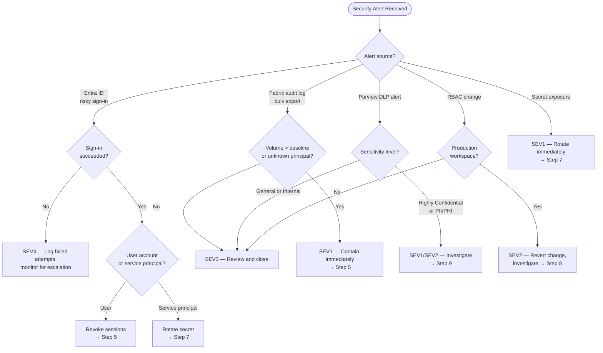
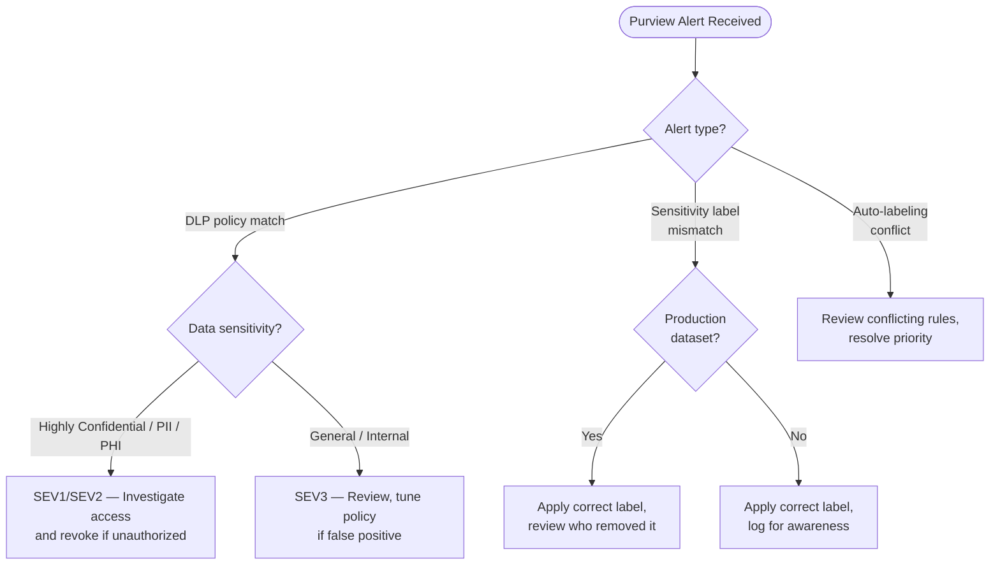

# 🛡️ Security Incident Response Runbook

> **Last Updated**: 2026-05-05 | **Version**: 1.0
> **Audience**: Security operations, on-call SRE, compliance officers, identity administrators
> **Purpose**: Detect unauthorized access, investigate audit logs, rotate compromised credentials, triage Purview alerts, and contain security breaches in Microsoft Fabric.

<div align="center" markdown>


</div>

---

## Trigger Conditions

Use this runbook when any of the following conditions are observed:

| # | Condition | Detection Source |
|---|-----------|------------------|
| 1 | Unauthorized user accessed a workspace or Lakehouse | Entra ID sign-in logs; Fabric audit log `GetWorkspace` from unknown principal |
| 2 | Anomalous sign-in (impossible travel, unfamiliar location, risky sign-in) | Entra ID Protection → Risky sign-ins |
| 3 | Bulk data export or download from OneLake | Fabric audit log `ExportData`, `DownloadReport` in high volume |
| 4 | Service principal or Workspace Identity secret exposed | Secret scanning alert (GitHub Advanced Security, Defender for Cloud) |
| 5 | Purview sensitivity label violation — highly sensitive data accessed by unauthorized role | Purview alert → Data Loss Prevention policy match |
| 6 | RBAC change on production workspace by non-admin | Fabric audit log `AddWorkspaceMember`, `UpdateWorkspaceAccess` |
| 7 | SQL Audit Log shows `ALTER`, `DROP`, or `GRANT` from unexpected principal | SQL audit logs in Lakehouse |
| 8 | Data exfiltration pattern — large query results sent to external email or storage | Microsoft Defender for Cloud Apps alert |

---

## Severity Classification

| Severity | Condition | Example | Response SLA |
|----------|-----------|---------|--------------|
| **SEV1** | Confirmed data breach; PII / PHI / PCI data accessed by unauthorized party; credential compromise confirmed | SSN data exported from Gold Lakehouse by unknown service principal; admin credential found in public GitHub repo | **5 min** page |
| **SEV2** | Suspicious access detected; no confirmed exfiltration yet; RBAC change on prod workspace | Impossible travel sign-in to Fabric admin portal; new member added to prod workspace by non-admin | **15 min** page |
| **SEV3** | Purview DLP policy informational match; minor RBAC anomaly in non-prod | Sensitivity label mismatch on dev dataset; service principal granted Viewer on staging workspace | **2 hr** ack |
| **SEV4** | Failed authentication attempts; informational alerts | Multiple failed sign-in attempts from known IP range; password spray with no success | **24 hr** ack |

---

## Decision Flowchart



---

## Step-by-Step Procedure

### Phase 1 — Detect and Contain (0–15 min)

**Step 1.** Receive the security alert and identify the alert source (Entra ID, Fabric audit log, Purview, Defender for Cloud, secret scanning).

**Step 2.** Classify severity using the table above. For SEV1 or SEV2, immediately open a secure incident channel (do not discuss details in general channels).

**Step 3.** Determine the compromised principal (user account, service principal, or Workspace Identity).

**Step 4.** Assess the blast radius:
   - Which workspaces did the principal have access to?
   - What data sensitivity levels are in those workspaces?
   - Was any data exported or modified?

**Step 5.** **Contain the threat** — revoke access immediately:

   For **user accounts**:
   ```powershell
   # Revoke all active sessions
   Revoke-MgUserSignInSession -UserId "<user-object-id>"

   # Disable the account (if confirmed compromise)
   Update-MgUser -UserId "<user-object-id>" -AccountEnabled:$false
   ```

   For **service principals**:
   ```powershell
   # Remove service principal credentials
   Remove-MgServicePrincipalPassword -ServicePrincipalId "<sp-id>" -KeyId "<key-id>"
   ```

   For **Fabric workspace access**:
   ```powershell
   # Remove user from workspace via Fabric REST API
   Invoke-RestMethod -Method Delete `
     -Uri "https://api.fabric.microsoft.com/v1/workspaces/$workspaceId/roleAssignments/$principalId" `
     -Headers @{ Authorization = "Bearer $token" }
   ```

### Phase 2 — Investigate (15–60 min)

**Step 6.** Query the **Fabric unified audit log** to determine what the compromised principal accessed:

```powershell
# Search Office 365 audit log for Fabric activities
Search-UnifiedAuditLog -StartDate (Get-Date).AddDays(-7) -EndDate (Get-Date) `
  -UserIds "<compromised-principal>" `
  -RecordType PowerBIAudit `
  -ResultSize 5000 | Export-Csv -Path "audit_export.csv"
```

**Step 7.** If a **service principal secret or Workspace Identity** was exposed, rotate credentials:

   1. Generate a new secret in Entra ID → App registrations → Certificates & secrets.
   2. Update the secret in all Fabric connections and pipelines that reference it.
   3. Delete the old secret.
   4. Verify all dependent workloads still function.

   ```powershell
   # Generate new secret
   $newSecret = Add-MgApplicationPassword -ApplicationId "<app-id>" `
     -PasswordCredential @{ displayName = "rotated-$(Get-Date -Format yyyyMMdd)" }

   # Remove old secret
   Remove-MgApplicationPassword -ApplicationId "<app-id>" -KeyId "<old-key-id>"
   ```

**Step 8.** If an **unauthorized RBAC change** was detected, revert it:

   1. Query the audit log for the original RBAC state.
   2. Remove the unauthorized role assignment.
   3. Investigate who made the change and whether their account is compromised.

**Step 9.** For **Purview DLP alert triage**:

   1. Open the alert in the Microsoft Purview compliance portal.
   2. Review the matched policy and the data that triggered the alert.
   3. Determine whether the access was legitimate (false positive) or unauthorized.
   4. If unauthorized, identify all copies of the sensitive data and revoke access.
   5. If a false positive, tune the DLP policy to reduce noise.

### Phase 3 — Remediate (1–4 hr)

**Step 10.** Based on the investigation, implement permanent fixes:

   - **Compromised user**: Force password reset, require MFA re-registration, review Conditional Access policies.
   - **Compromised service principal**: Rotate to certificate-based authentication, restrict IP ranges.
   - **RBAC gap**: Implement Privileged Identity Management (PIM) for workspace admin roles.
   - **DLP gap**: Tighten sensitivity labels, enable auto-labeling, restrict external sharing.

**Step 11.** Verify containment by confirming the compromised principal can no longer authenticate:

```powershell
# Verify user is disabled and sessions revoked
Get-MgUser -UserId "<user-object-id>" | Select-Object AccountEnabled, SignInSessionsValidFromDateTime
```

### Phase 4 — Close

**Step 12.** Notify affected stakeholders per the communication plan (see [Escalation Path](#escalation-path)).

**Step 13.** Preserve forensic evidence:
   - Export audit logs for the incident timeframe.
   - Screenshot Purview alert details.
   - Document the timeline of compromise and containment.

**Step 14.** Complete the [Post-Incident Review Checklist](#post-incident-review-checklist) and schedule a blameless postmortem within 48 hours.

---

## Audit Log Investigation

### Key Fabric Audit Events

| Event | Description | Investigation Value |
|-------|-------------|---------------------|
| `GetWorkspace` | User opened a workspace | Access scope |
| `ExportReport` | Report exported to file | Data exfiltration risk |
| `GetDatasource` | Connection string accessed | Credential exposure risk |
| `UpdateWorkspaceAccess` | RBAC changed | Unauthorized privilege escalation |
| `CreateDataflow` | New dataflow created | Potential data movement |
| `ExecuteQuery` | SQL/KQL query executed | Data access scope |
| `DeleteWorkspace` | Workspace deleted | Destructive action |

### Useful KQL Queries

```kql
// All actions by a specific user in the last 24 hours
FabricAuditLogs
| where Timestamp > ago(24h)
| where UserId == "<principal>"
| summarize count() by Operation
| order by count_ desc

// Bulk data exports in the last 7 days
FabricAuditLogs
| where Timestamp > ago(7d)
| where Operation in ("ExportReport", "ExportData", "DownloadReport")
| summarize ExportCount = count() by UserId, bin(Timestamp, 1h)
| where ExportCount > 10
| order by ExportCount desc

// RBAC changes on production workspaces
FabricAuditLogs
| where Timestamp > ago(30d)
| where Operation in ("AddWorkspaceMember", "UpdateWorkspaceAccess", "RemoveWorkspaceMember")
| where WorkspaceName contains "prod"
| project Timestamp, UserId, Operation, WorkspaceName, TargetPrincipal
```

---

## Credential Rotation Procedures

| Credential Type | Rotation Steps | Downstream Impact |
|----------------|----------------|-------------------|
| **User password** | Entra ID → Users → Reset password → Require change at next sign-in | User must re-authenticate everywhere |
| **Service principal secret** | Entra ID → App registrations → New secret → Update connections → Delete old | All pipelines using old secret will fail until updated |
| **Workspace Identity** | Regenerate managed identity credential → Update RBAC assignments | Connections using WI may need re-authorization |
| **On-premises gateway key** | Gateway app → Regenerate key → Re-register gateway | Gateway goes offline during re-registration |
| **Connection string / API key** | Rotate at source → Update in Fabric connection manager | Dependent refreshes fail until updated |

---

## Purview Alert Triage



---

## Escalation Path

| Time Elapsed | Action | Contact |
|--------------|--------|---------|
| **0 min** | Security on-call begins triage; contain compromised principal | Security on-call (PagerDuty) |
| **5 min** | If SEV1 confirmed, page CISO and VP Engineering | CISO + VP Engineering |
| **15 min** | If PII/PHI breach confirmed, notify Legal and Compliance | Legal Counsel + Compliance Officer |
| **30 min** | If data exfiltration confirmed, engage Microsoft DART (Detection and Response Team) | Microsoft Unified Support (Sev A) |
| **1 hr** | If regulatory notification required (HIPAA, GDPR, state breach laws), begin notification process | Legal + Privacy Officer |
| **4 hr** | Executive briefing if breach is customer-impacting | CTO / CEO |

> **Regulatory notification deadlines**: HIPAA requires notification within 60 days. GDPR requires notification within 72 hours. State breach notification laws vary. Engage Legal immediately for SEV1 breaches.

---

## Post-Incident Review Checklist

- [ ] Compromised principal identified and contained
- [ ] Scope of access determined (workspaces, datasets, reports)
- [ ] Data accessed or exfiltrated quantified
- [ ] Credentials rotated for all affected service principals and connections
- [ ] Unauthorized RBAC changes reverted
- [ ] Audit log evidence preserved and exported
- [ ] Root cause identified (phishing, leaked secret, insider, misconfiguration)
- [ ] Conditional Access policies reviewed and hardened
- [ ] MFA enforcement verified for all admin accounts
- [ ] Purview DLP policies tuned (if false positive triggered investigation)
- [ ] Regulatory notification obligations assessed with Legal
- [ ] Blameless postmortem completed within 48 hours
- [ ] Lessons learned applied (new alerts, tighter RBAC, PIM enforcement)

---

## Related Documents

| Document | Description |
|----------|-------------|
| [Identity & RBAC Patterns](../best-practices/identity-rbac-patterns.md) | RBAC design and Entra ID integration |
| [OneLake Security](../features/onelake-security.md) | OneLake access control and encryption |
| [Network Security](../best-practices/network-security.md) | Private endpoints and network isolation |
| [SQL Audit Logs Compliance](../best-practices/sql-audit-logs-compliance.md) | SQL-level audit logging |
| [Monitoring & Observability](../best-practices/monitoring-observability.md) | Alert setup and dashboards |
| [Auth Failure Playbook](auth-failure-playbook.md) | Authentication failure diagnosis |
| [Incident Response Template](incident-response-template.md) | Master incident response structure |

---

[⬆️ Back to Top](#️-security-incident-response-runbook) | [📋 Runbook Index](index.md) | [🏠 Home](../index.md)
