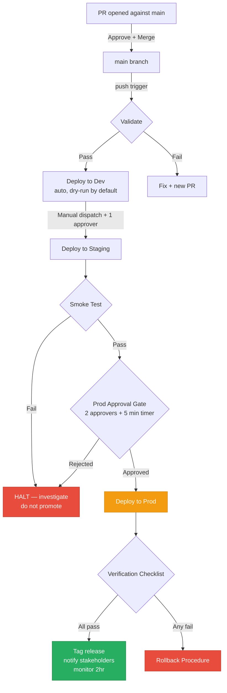
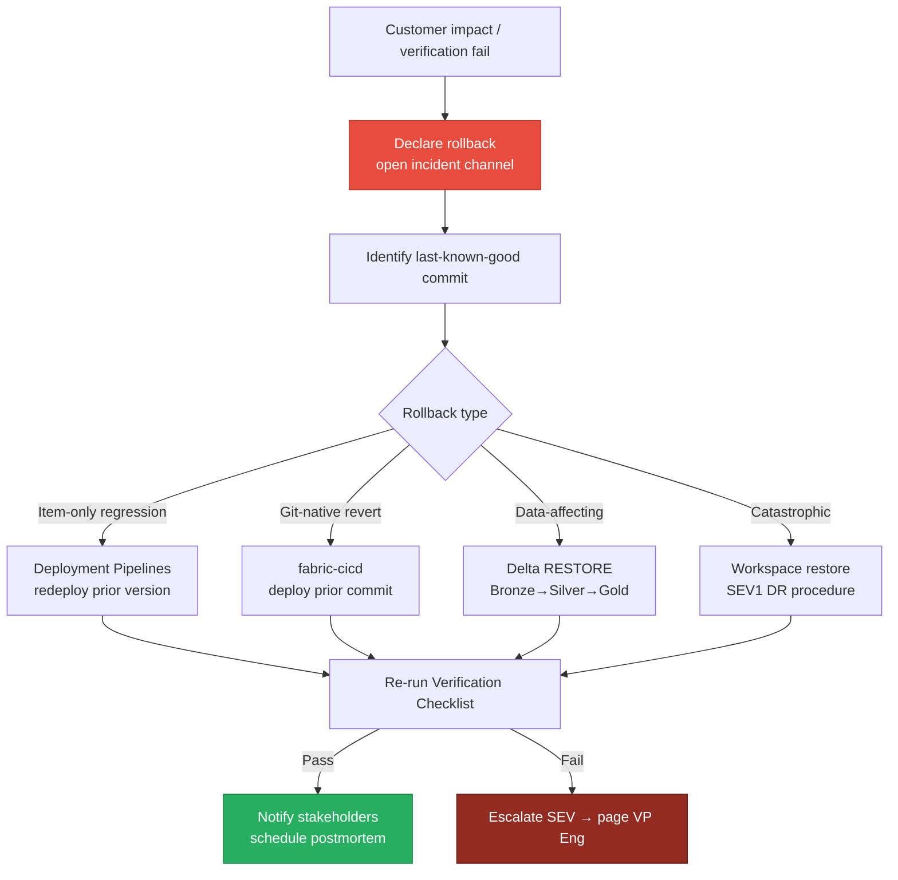

# 🚀 Tenant Migration: Dev → Staging → Prod Promotion

> **Last Updated**: 2026-04-27 | **Phase**: 14 (Wave 1) | **Feature 1.6**
> **Audience**: Release engineers, Platform Lead, on-call engineers, deployment approvers
> **Purpose**: End-to-end procedure for promoting Fabric workspace items (Lakehouses, Notebooks, Pipelines, Power BI datasets) across Dev → Staging → Prod using Deployment Pipelines + `fabric-cicd`, including rollback for bad deployments

<div align="center" markdown>


</div>

---

## Use Cases

> **Pick the path that matches your scenario.** Each path links to the section that handles it.

| Scenario | Path | Approval Gate | Typical Duration |
|----------|------|---------------|------------------|
| Promoting tested feature from Dev → Staging → Prod (normal release) | [Standard Promotion](#standard-promotion-procedure) | Required for Prod | 30–90 min |
| Rolling back a bad deployment in Prod (data or behavior regression) | [Rollback Procedure](#rollback-procedure) | Notify, then act | 15–45 min |
| Hotfix promotion (skip Dev, urgent Prod fix) | [Hotfix Procedure](#hotfix-procedure) | Required for Prod | 30–60 min |
| Disaster recovery: rebuilding Prod from Staging after capacity loss | [Rollback / DR Variant](#rollback-procedure) | SEV1 — page Platform Lead | 1–4 hr |
| Routine bi-weekly release train | [Standard Promotion](#standard-promotion-procedure) | Required for Prod | 30–90 min |
| Federal agency promotion (per-agency pipelines, FedRAMP audit trail) | [Standard Promotion](#standard-promotion-procedure) (run per agency) | Required for Prod, dual-approver | 60–120 min |

> ⚠️ **Cross-reference:** This runbook focuses on **promotion mechanics**. For incident handling during deployment, see [Incident Response Template](incident-response-template.md). For change-control policy (freeze windows, RFC, CAB), see [Change Management](../best-practices/operations/change-management.md).

---

## Pre-Requisites

Before any promotion runs, **verify** the following are configured. Missing prerequisites are the #1 cause of failed promotions.

### 1. Workspace Pairs Configured

| Stage | Workspace | Capacity | Connected To |
|-------|-----------|----------|--------------|
| Dev | `casino-fabric-dev` | F2 (shared) | Git branch `dev` |
| Staging | `casino-fabric-staging` | F4 (dedicated) | Git branch `staging` (or via Deployment Pipelines) |
| Prod | `casino-fabric-prod` | F64 (dedicated) | Git branch `main` (or via Deployment Pipelines) |

> Each workspace can belong to **only one** Deployment Pipeline. Verify with REST API:
> `GET https://api.fabric.microsoft.com/v1/workspaces/{id}` → check `capacityId` and pipeline assignment.

### 2. Git Integration Enabled

- [ ] Each workspace connected to its branch (Workspace Settings → Git Integration)
- [ ] Branch protection on `main` (required PR, ≥1 reviewer, build validation, comment resolution)
- [ ] `.platform` files committed for every Fabric item
- [ ] Fabric folder convention: `casino-fabric-{stage}.Workspace/` per workspace

See: [Git Integration](../features/git-integration.md) for connection steps.

### 3. fabric-cicd Installed in CI Runners

```bash
# Verify in workflow logs after first run
pip install "fabric-cicd==1.0.0" azure-identity
python -c "from fabric_cicd import FabricWorkspace; print('OK')"
```

### 4. Service Principal & OIDC

| Secret / Var | GitHub Scope | Purpose |
|--------------|--------------|---------|
| `AZURE_CLIENT_ID` | Repo secret | App Registration client ID |
| `AZURE_TENANT_ID` | Repo secret | Microsoft Entra ID tenant |
| `AZURE_SUBSCRIPTION_ID` | Repo secret | Subscription |
| `FABRIC_DEV_WORKSPACE_ID` | Environment `dev` | Dev workspace GUID |
| `FABRIC_STAGING_WORKSPACE_ID` | Environment `staging` | Staging workspace GUID |
| `FABRIC_PROD_WORKSPACE_ID` | Environment `production` | Prod workspace GUID |

The Service Principal must be **Contributor** (minimum) on each workspace and have Fabric API permissions granted with admin consent.

### 5. Branch Protection on `main`

```
Settings → Branches → Branch protection rule for "main"
  ✅ Require a pull request before merging
  ✅ Require approvals: 1 (or 2 for Prod-impacting changes)
  ✅ Require status checks: validate, test, lint
  ✅ Require conversation resolution before merging
  ✅ Do not allow bypassing the above settings
```

### 6. GitHub Environments with Approval Gates

| Environment | Required Reviewers | Wait Timer | Deployment Branches |
|-------------|--------------------|-----------:|---------------------|
| `dev` | 0 (auto) | 0 | `main`, manual dispatch |
| `staging` | 1 | 0 | manual dispatch only |
| `production` | 2 (Platform Lead + Service Owner) | 5 min | manual dispatch from `main` only |

### 7. Pre-Promotion Checklist

- [ ] All open PRs targeting the release have been merged to `main`
- [ ] Test suite green: `pytest validation/unit_tests/ -v` (612 tests)
- [ ] Bicep validation green: `az bicep build --file infra/main.bicep`
- [ ] Great Expectations checkpoints pass for affected Lakehouses
- [ ] Release notes drafted (link in PR description)
- [ ] Stakeholders notified of promotion window (Teams + email for Prod)
- [ ] No active SEV1/SEV2 incidents (check incident channel)
- [ ] Outside change-freeze window (no Friday/holiday Prod deploys without VP approval)

---

## Standard Promotion Procedure

> **Goal:** Move a tested change set from `main` → Dev → Staging → Prod. **Time budget: 30–90 min.**

### Step 1 — PR Merge to `main`

1. Author opens PR against `main` with passing checks.
2. Reviewer approves; PR is merged via **squash-and-merge** (preserves linear history for rollback).
3. Merge triggers `Deploy Fabric Items` workflow (`.github/workflows/deploy-fabric.yml`) on push.

### Step 2 — fabric-cicd Workflow Runs (Validate → Deploy Dev)

The pipeline auto-runs on push:

```
validate → deploy-dev (dry-run by default on push)
```

Watch the workflow run:

```bash
gh run watch --repo fgarofalo56/Suppercharge_Microsoft_Fabric
```

If validate fails, **stop**. Do not bypass — fix the underlying issue and re-merge.

### Step 3 — Validate Dev → Staging via Deployment Pipelines

Two paths are supported. Pick one and stick with it for the release.

#### Path A — fabric-cicd (Recommended for Git-Native Teams)

Manually trigger the staging deploy:

```bash
gh workflow run deploy-fabric.yml \
  -f target_environment=staging \
  -f dry_run=false
```

Approval is enforced by the GitHub Environment `staging` (1 reviewer).

#### Path B — Deployment Pipelines (Visual / Portal)

1. Open the Fabric portal → **Deployment Pipelines** → `casino-analytics-pipeline`.
2. Review the side-by-side comparison (Dev vs. Staging).
3. Select all changed items (or specific items for partial release).
4. Click **Deploy** → confirm deployment rules (Lakehouse rebind, connection overrides).
5. Wait for completion — typically 2–10 min depending on item count.

### Step 4 — Smoke Tests in Staging

Run the smoke test script and verify each control point:

```bash
python scripts/fabric_smoke_test.py \
  --workspace-id "$FABRIC_STAGING_WORKSPACE_ID"
```

Verification gates (must all pass before proceeding):

- [ ] All notebooks executable (test-run a sample bronze, silver, gold notebook)
- [ ] Lakehouse schemas match Dev schemas (`DESCRIBE EXTENDED` on key tables)
- [ ] Pipeline test-run completes end-to-end without error
- [ ] Power BI dataset refresh succeeds
- [ ] Sample queries return expected row counts (within ±5% of Dev)

### Step 5 — Manual Approval Gate for Prod

The `production` GitHub Environment requires **2 approvers** (Platform Lead + Service Owner). Approval window is the 5-min wait timer.

1. Trigger the workflow:

   ```bash
   gh workflow run deploy-fabric.yml \
     -f target_environment=prod \
     -f dry_run=false
   ```

2. Both approvers receive notification. Each must:
   - Re-verify smoke tests passed in Staging
   - Confirm release notes are accurate
   - Confirm no active incidents
   - Approve in GitHub UI (or via `gh api`)

3. After both approvals, the deploy-prod job runs.

### Step 6 — Deploy to Prod via Deployment Pipelines / fabric-cicd

The workflow executes:

```bash
python scripts/fabric-cicd-deploy.py \
  --workspace-id "$FABRIC_PROD_WORKSPACE_ID" \
  --environment prod \
  --item-type-in-scope Notebook Lakehouse SemanticModel
```

**Do not close the terminal.** Watch logs for:
- `Authenticating with Azure...` → OIDC succeeded
- `Connected to workspace: ...` → SP has access
- `Publishing items to workspace...` → fabric-cicd is acting
- `Deployment to prod COMPLETE` → success

If errors appear, see [Common Failure Modes](#common-failure-modes).

### Step 7 — Post-Deployment Verification

Run the [Verification Checklist](#verification-checklist) **immediately** after deploy. If anything fails, proceed to [Rollback Procedure](#rollback-procedure).

---

## Rollback Procedure

> **Goal:** Restore Prod to a known-good state when a deployment introduces regression. **Time budget: 15–45 min.**
>
> **Decision rule:** Rollback within 30 min if customer impact is detected. Don't try to forward-fix in Prod under pressure.

### Step 1 — Declare Rollback

1. Open incident channel (`#incident-{YYYY-MM-DD}-deploy-rollback-sev{N}`) — see [Incident Response Template](incident-response-template.md).
2. Page Platform Lead + on-call. Severity is at minimum **SEV2** for Prod rollback.
3. Communicate intent to stakeholders: "Rolling back deploy `{commit-sha}` due to {symptom}."

### Step 2 — Identify the Bad Commit

```bash
# Show last 10 commits to main
git log --oneline -10 origin/main

# Identify the deploy commit (squash-merged from a PR)
gh pr list --state merged --limit 10 --base main

# Confirm which commit was deployed (cross-check workflow run)
gh run list --workflow=deploy-fabric.yml --limit 5
```

Capture the **last-known-good commit SHA** — this is your rollback target.

### Step 3 — Choose Rollback Mechanism

| Mechanism | When to Use | Speed | Risk |
|-----------|-------------|-------|------|
| **Deployment Pipelines "previous version"** | Item-definition regression only, no data side-effects | Fast (5–10 min) | Low |
| **fabric-cicd redeploy from prior commit** | Git is source of truth, want full state revert | Medium (10–20 min) | Low |
| **Delta time-travel RESTORE** | Data-affecting change (bad transformation wrote to Gold) | Medium (10–20 min per table) | Medium — verify FK chain |
| **Workspace restore from backup** | Catastrophic loss (workspace corruption, SEV1 DR) | Slow (1–4 hr) | High — last resort |

### Step 4a — Rollback via Deployment Pipelines (Item Definitions)

1. Fabric portal → **Deployment Pipelines** → select pipeline.
2. Click the **Production** stage → **Deployment History**.
3. Find the prior successful deployment (before the bad one).
4. Click **... → Redeploy this version** (backwards/forward as needed) — Deployment Pipelines support back-deploy from Staging or roll-forward from a previous Dev snapshot.
5. Confirm the diff. Deploy. Verify.

### Step 4b — Rollback via fabric-cicd (Re-deploy Prior Commit)

```bash
# Check out last-known-good commit on a rollback branch
git checkout -b rollback/INC-$(date +%Y%m%d) <last-known-good-sha>
git push origin rollback/INC-$(date +%Y%m%d)

# Trigger deploy from rollback branch (workflow_dispatch supports any ref)
gh workflow run deploy-fabric.yml \
  --ref rollback/INC-$(date +%Y%m%d) \
  -f target_environment=prod \
  -f dry_run=false
```

After verification, fast-forward `main` with a revert PR:

```bash
git checkout main
git revert <bad-commit-sha> --no-edit
git push origin main
```

### Step 4c — Restore Delta Tables via Time-Travel (Data-Affecting)

If the bad deployment **wrote to Delta tables** (silver/gold), data must also be reverted. Run in a Fabric notebook:

```python
# Identify last-good version per affected table
spark.sql("DESCRIBE HISTORY lh_gold.fact_daily_revenue").show(20, False)

# Restore by version
spark.sql("RESTORE TABLE lh_gold.fact_daily_revenue TO VERSION AS OF 145")

# Or restore by timestamp (use deploy time as cutoff)
spark.sql("""
    RESTORE TABLE lh_gold.fact_daily_revenue
    TO TIMESTAMP AS OF '2026-04-27 06:00:00'
""")
```

> ⚠️ **Order matters.** Restore Bronze → Silver → Gold in dependency order. Restore Power BI dataset cache afterwards (refresh dataset).

### Step 5 — Notify Stakeholders

```
Subject: [INC-{YYYYMMDD}-deploy-rollback] RESOLVED — Prod rolled back to {sha}

Status: RESOLVED
Started: {HH:MM UTC}
Resolved: {HH:MM UTC}

Impact:
- {feature/dataset} regressed from {bad-deploy-time} to {rollback-time}
- {N} customers affected / {N} reports stale

Action taken:
- Rolled back to commit {last-known-good-sha}
- {Delta tables restored if applicable}

Forward plan:
- Postmortem scheduled for {date}
- Root cause investigation owned by {name}
- Forward-fix PR tracked at {link}
```

---

## Hotfix Procedure

> **Goal:** Apply an urgent Prod fix without going through the full Dev → Staging cycle. **Use sparingly.**
>
> **Threshold for hotfix:** SEV1/SEV2 incident, customer impact > 30 min projected, no safe rollback path. **All other fixes go through Standard Promotion.**

### Step 1 — Open Hotfix Branch from `main`

```bash
git checkout main
git pull origin main
git checkout -b hotfix/INC-$(date +%Y%m%d)-{short-desc}
```

Branch naming convention: `hotfix/INC-YYYYMMDD-{slug}` (e.g., `hotfix/INC-20260427-bronze-null-fix`).

### Step 2 — Targeted Fix + Minimal Test

- Change the **smallest possible surface** to fix the incident.
- Add a regression test that fails without the fix and passes with it.
- Run `pytest validation/unit_tests/` for the affected module only.
- Get **one approver** review (Platform Lead or designate). Hotfix PRs do NOT need full CAB.

### Step 3 — Direct Staging → Prod Deployment

Hotfix flow **skips Dev** but **must hit Staging** for at least a 5-minute smoke before Prod (no exceptions, even for SEV1).

```bash
# Push hotfix branch
git push origin hotfix/INC-20260427-bronze-null-fix

# Deploy to Staging from hotfix branch
gh workflow run deploy-fabric.yml \
  --ref hotfix/INC-20260427-bronze-null-fix \
  -f target_environment=staging \
  -f dry_run=false

# 5-minute smoke test in Staging — minimum
python scripts/fabric_smoke_test.py --workspace-id "$FABRIC_STAGING_WORKSPACE_ID"

# Deploy to Prod (still requires 2 approvers — incident commander can be one)
gh workflow run deploy-fabric.yml \
  --ref hotfix/INC-20260427-bronze-null-fix \
  -f target_environment=prod \
  -f dry_run=false
```

### Step 4 — Required Followup (Within 24 Hours)

A hotfix deploy is **incomplete** until the fix is back-merged to all environments and `main`:

- [ ] Open PR to merge `hotfix/...` → `main` (squash merge to preserve history)
- [ ] Verify Dev workspace receives the fix on next push-to-main deploy
- [ ] Verify Staging is in sync (re-deploy to staging if drift)
- [ ] Close the hotfix branch after merge

### Step 5 — Postmortem Requirement

Every hotfix triggers a **mandatory postmortem within 48 hours**, regardless of incident severity:

- Use [Blameless Postmortem Template](incident-response-template.md#blameless-postmortem-template)
- File at `docs/postmortems/{YYYY-MM-DD}-{slug}.md`
- Include: why hotfix was justified, why standard process couldn't be used, what process change would prevent recurrence

---

## Verification Checklist

> Run this checklist after **every** deploy to Staging and Prod. **All boxes must be checked** before declaring promotion complete.

### Items Deployed

- [ ] Item count match: `GET /workspaces/{id}/items?type=Notebook` returns expected count vs. source
- [ ] Lakehouse count matches (lh_bronze, lh_silver, lh_gold + agency lakehouses)
- [ ] Pipeline count matches
- [ ] Semantic Model count matches
- [ ] Reports count matches

### Schemas

- [ ] `DESCRIBE EXTENDED lh_bronze.{table}` matches expected schema for affected tables
- [ ] No unexpected new columns or dropped columns in Silver/Gold
- [ ] Delta table version incremented as expected (one per deploy)

### Data Freshness

- [ ] Latest partition timestamp on bronze tables is within SLA (<24 hr)
- [ ] Silver/Gold pipelines have run successfully post-deploy
- [ ] No backlog of failed pipeline activities

### Power BI

- [ ] Semantic model refresh succeeds (`POST /datasets/{id}/refreshes`)
- [ ] Top 5 reports render with current data
- [ ] No "Cannot connect to data source" errors in dataset settings

### Customer Queries

- [ ] Sample compliance query returns expected count (CTR, SAR thresholds)
- [ ] Sample BI query latency within SLA (<2s p95)
- [ ] Direct Lake fallback path tested (Power BI report load)

### Operational

- [ ] No new error alerts firing in Workspace Monitoring
- [ ] Capacity utilization in green band (<70%) within 15 min of deploy
- [ ] No new entries in pipeline failure KQL query (last 1 hr)

---

## Post-Promotion Actions

After successful Prod deployment:

1. **Update CHANGELOG.md** with release notes (link the PR / commit SHA)
2. **Tag the release**:

   ```bash
   git tag -a v$(date +%Y.%m.%d) -m "Release {description}"
   git push origin v$(date +%Y.%m.%d)
   ```

3. **Notify stakeholders** (deploy-success template):

   ```
   ✅ Prod deploy complete — {commit-sha}
   Items deployed: {N notebooks, M lakehouses, K pipelines}
   Verification: all checks passed
   Tag: v2026.04.27
   Release notes: {link}
   ```

4. **Update Archon Session Context document** with deploy outcome
5. **Monitor for 2 hours** post-deploy: capacity, pipeline runs, Power BI errors
6. **Close the deploy ticket** in Archon (status = `done`)

---

## Escalation

| Trigger | Action | Who |
|---------|--------|-----|
| Validate stage fails 2x consecutively | Page Release Engineer | Release Engineer |
| Staging smoke test fails | Notify Platform Lead, halt promotion | Platform Lead |
| Prod deploy fails midway | Page on-call, open incident channel SEV2 | On-call + IC |
| Verification check fails post-Prod | Begin [Rollback Procedure](#rollback-procedure) | IC + Platform Lead |
| Approver unavailable for Prod gate | Escalate to VP Eng for delegation | Platform Lead → VP Eng |
| Service Principal auth failure | See [Auth Failure Playbook](auth-failure-playbook.md) | On-call |
| Data corruption suspected | SEV1, page VP Eng + Compliance | IC → VP Eng |

---

## Quick-Reference Commands

### fabric-cicd CLI

```bash
# Dry-run preview to Staging
python scripts/fabric-cicd-deploy.py \
  --workspace-id "$FABRIC_STAGING_WORKSPACE_ID" \
  --environment staging \
  --item-type-in-scope Notebook Lakehouse SemanticModel \
  --dry-run

# Live deploy to Prod
python scripts/fabric-cicd-deploy.py \
  --workspace-id "$FABRIC_PROD_WORKSPACE_ID" \
  --environment prod \
  --item-type-in-scope Notebook Lakehouse SemanticModel
```

### GitHub Actions workflow_dispatch

```bash
# Trigger staging deploy from main
gh workflow run deploy-fabric.yml \
  -f target_environment=staging \
  -f dry_run=false

# Trigger prod deploy (requires 2 approvers post-trigger)
gh workflow run deploy-fabric.yml \
  -f target_environment=prod \
  -f dry_run=false

# Trigger from a rollback branch
gh workflow run deploy-fabric.yml \
  --ref rollback/INC-20260427 \
  -f target_environment=prod \
  -f dry_run=false

# Watch the latest run
gh run watch

# View prior run logs
gh run view --log
```

### Deployment Pipelines REST API

```bash
# Get token
TOKEN=$(az account get-access-token \
  --resource https://api.fabric.microsoft.com \
  --query accessToken -o tsv)

# List deployment pipelines
curl -X GET \
  "https://api.fabric.microsoft.com/v1/deploymentPipelines" \
  -H "Authorization: Bearer $TOKEN"

# Get pipeline stages
curl -X GET \
  "https://api.fabric.microsoft.com/v1/deploymentPipelines/${PIPELINE_ID}/stages" \
  -H "Authorization: Bearer $TOKEN"

# Deploy Staging (stage 1) → Prod (stage 2)
curl -X POST \
  "https://api.fabric.microsoft.com/v1/deploymentPipelines/${PIPELINE_ID}/deploy" \
  -H "Authorization: Bearer $TOKEN" \
  -H "Content-Type: application/json" \
  -d '{
    "sourceStageOrder": 1,
    "targetStageOrder": 2,
    "options": {
      "allowOverwriteArtifact": true,
      "allowCreateArtifact": true
    }
  }'

# Check deploy operation status
curl -X GET \
  "https://api.fabric.microsoft.com/v1/deploymentPipelines/${PIPELINE_ID}/operations/${OPERATION_ID}" \
  -H "Authorization: Bearer $TOKEN"
```

### Delta RESTORE (Data Rollback)

```python
# Inspect history
spark.sql("DESCRIBE HISTORY lh_gold.fact_daily_revenue").show(20, False)

# Restore by version (preferred — exact)
spark.sql("RESTORE TABLE lh_gold.fact_daily_revenue TO VERSION AS OF 145")

# Restore by timestamp (use deploy timestamp)
spark.sql("""
    RESTORE TABLE lh_gold.fact_daily_revenue
    TO TIMESTAMP AS OF '2026-04-27 06:00:00'
""")

# Verify post-restore row count
spark.sql("SELECT COUNT(*) AS row_count FROM lh_gold.fact_daily_revenue").show()
```

### Power BI Dataset Refresh (Post-Deploy)

```bash
curl -X POST \
  "https://api.powerbi.com/v1.0/myorg/groups/${WORKSPACE_ID}/datasets/${DATASET_ID}/refreshes" \
  -H "Authorization: Bearer $TOKEN" \
  -H "Content-Type: application/json" \
  -d '{"notifyOption": "MailOnFailure"}'
```

---

## Promotion & Rollback Flow Diagrams

### Standard Promotion Flow



### Rollback Flow



### Hotfix Flow

```mermaid
flowchart LR
    INC[Active SEV1/SEV2 incident] --> HF[Open hotfix/ branch from main]
    HF --> FIX[Targeted fix + regression test]
    FIX --> APV[1 approver review]
    APV --> STG[Deploy to Staging]
    STG --> SMOKE[5-min smoke minimum]
    SMOKE --> PROD[Deploy to Prod<br/>2 approvers]
    PROD --> BACK[Backmerge to main within 24hr]
    BACK --> PM[Mandatory postmortem within 48hr]

    style INC fill:#E74C3C,stroke:#C0392B,color:#fff
    style PM fill:#F39C12,stroke:#D68910,color:#fff
```



---

## Common Failure Modes

| Failure Mode | Symptom | Diagnosis | Resolution |
|--------------|---------|-----------|------------|
| **Item not deploying** | `publish_all_items` skips an item, no error | Item type not in `--item-type-in-scope`, or `.platform` file missing | Add type to scope; commit `.platform`; re-run |
| **Schema drift** | `DESCRIBE EXTENDED` shows columns not in source | Manual portal edit in Prod (out-of-band change) | Detect via Git Integration "incoming changes"; revert via Deployment Pipelines back-deploy |
| **Auth failure** | `DefaultAzureCredential` returns 401 | OIDC token expired, SP lost workspace permission | Verify SP is Contributor on workspace; re-grant if needed; see [Auth Failure Playbook](auth-failure-playbook.md) |
| **Lakehouse rebind failure** | Notebook in Prod references `lh_bronze_dev` | Deployment rule missing on Prod stage | Configure Deployment Rule for Lakehouse rebind; redeploy |
| **Connection string drift** | Semantic Model points to dev SQL server | Connection rule missing | Configure connection rule per stage |
| **Item dependency error** | Notebook deploys before Lakehouse exists | fabric-cicd ordering edge case | Deploy Lakehouses in a separate `publish_all_items` call first (see [fabric-cicd doc](../best-practices/fabric-cicd-deployment.md#dependency-management)) |
| **Stale items not cleaned up** | Old notebook present in Prod after rename | fabric-cicd does not delete | Manually delete via portal or REST API: `DELETE /items/{id}` |
| **Pipeline schedule still active in Dev** | Dev pipeline triggers on Prod data | Dev pipeline binding wrong | Disable schedule in Dev workspace; enable only in target environment |
| **Power BI dataset refresh fails post-deploy** | Refresh job errors in PBI | Connection/credentials not bound on deployed model | Open dataset settings → Edit credentials; re-run refresh |
| **Workflow approver unavailable** | Prod deploy stuck pending approval | Approver OOO | Use designate list; escalate to Platform Lead |
| **Backwards-deploy collision** | Deployment Pipelines blocks back-deploy | Item exists in target with newer version | Use `allowOverwriteArtifact: true` in REST body or selectively deploy |
| **Concurrent deploy conflict** | Workflow waits or fails | `concurrency.group` already running | Wait for in-flight deploy to finish; do not cancel mid-deploy |
| **Capacity throttling during deploy** | Items publish slowly or time out | F-SKU CU pressure from concurrent workloads | Schedule deploys outside peak; see [Capacity Throttling Response](capacity-throttling-response.md) |

---

## Related Runbooks

| Runbook | When to Use |
|---------|-------------|
| [Incident Response Template](incident-response-template.md) | Master template — open incident channel, classify SEV, run PIR |
| [Pipeline Failure Triage](pipeline-failure-triage.md) | Pipeline activity failed during/after deploy |
| [Auth Failure Playbook](auth-failure-playbook.md) | Workspace Identity / Service Principal failures |
| [Capacity Throttling Response](capacity-throttling-response.md) | Deploy slow due to capacity CU pressure |
| [Data Quality Incident](data-quality-incident.md) | GE failure post-deploy, downstream consumer impact |
| [Multi-Region Failover](multi-region-failover.md) | Region outage requires DR rebuild from Staging |

## Related Best-Practice Docs

| Document | Description |
|----------|-------------|
| [Deployment Pipelines](../features/deployment-pipelines.md) | Stage-based promotion feature reference |
| [Git Integration](../features/git-integration.md) | Workspace ↔ Git source control |
| [fabric-cicd Deployment](../best-practices/fabric-cicd-deployment.md) | Programmatic deployment with the Python library |
| [Change Management](../best-practices/operations/change-management.md) | RFC, freeze windows, rollback policy |
| [Identity & RBAC Patterns](../best-practices/identity-rbac-patterns.md) | Service Principal scoping for deploys |
| [Multi-Tenant Workspace Architecture](../best-practices/multi-tenant-workspace-architecture.md) | Cross-tenant promotion considerations |
| [Migration Patterns](../best-practices/migration-patterns.md) | Larger structural migrations beyond standard promotion |
| [Disaster Recovery (BCDR)](../best-practices/disaster-recovery-bcdr.md) | Workspace restore, backup retention |

---

[⬆️ Back to Top](#-tenant-migration-dev--staging--prod-promotion) | [📚 Runbooks Index](index.md) | [🏠 Home](../index.md)
