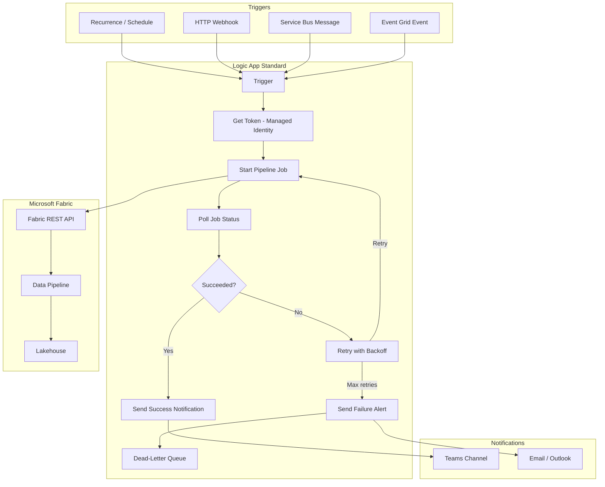

# Logic App Orchestrator for Fabric Pipelines

A reference architecture for using Azure Logic App (Standard) to orchestrate
Microsoft Fabric data pipelines via the Fabric REST API. Covers trigger
patterns, authentication, error handling, and comparison with alternative
orchestration services.

---

## Architecture



## Overview

Logic App Standard provides a serverless, stateful workflow engine that can
trigger Fabric pipelines on a schedule, in response to events, or via HTTP
webhooks. This guide covers:

1. **Trigger patterns** -- Schedule, HTTP, Service Bus, Event Grid
2. **Authentication** -- Managed identity with Fabric API permissions
3. **Core workflow** -- Start pipeline, poll status, notify, retry
4. **Error handling** -- Retry policies, dead-letter queues, alerting
5. **ARM deployment** -- Infrastructure-as-code snippet
6. **Comparison** -- Logic App vs Power Automate vs Azure Functions

---

## Prerequisites

| Requirement | Details |
|-------------|---------|
| Azure Subscription | With permissions to create Logic App Standard |
| Fabric Workspace | A workspace with at least one data pipeline |
| Managed Identity | System-assigned or user-assigned identity on the Logic App |
| Fabric API Permission | The identity needs `Fabric.ReadWrite.All` or workspace Contributor |

## Authentication Setup

### Grant Managed Identity Access to Fabric

1. Enable **System-assigned managed identity** on the Logic App.
2. In the Fabric workspace, add the managed identity as a **Contributor**:
   - Workspace Settings > Access > Add member
   - Paste the Logic App's managed identity Object ID
   - Assign **Contributor** role
3. Alternatively, grant the `Fabric.ReadWrite.All` application permission
   via PowerShell:

```powershell
# Grant Fabric API permission to the managed identity
$fabricAppId = "00000009-0000-0000-c000-000000000000"  # Fabric resource app
$permissionId = "f3076109-ca66-412a-be10-d4ee1be95d00"  # Fabric.ReadWrite.All

New-MgServicePrincipalAppRoleAssignment `
    -ServicePrincipalId (Get-MgServicePrincipal -Filter "displayName eq 'la-fabric-orchestrator'").Id `
    -PrincipalId (Get-MgServicePrincipal -Filter "displayName eq 'la-fabric-orchestrator'").Id `
    -ResourceId (Get-MgServicePrincipal -Filter "appId eq '$fabricAppId'").Id `
    -AppRoleId $permissionId
```

---

## Trigger Patterns

### 1. Schedule (Recurrence)

Run the pipeline every day at 2:00 AM UTC:

```json
{
  "type": "Recurrence",
  "recurrence": {
    "frequency": "Day",
    "interval": 1,
    "schedule": {
      "hours": [2],
      "minutes": [0]
    },
    "timeZone": "UTC"
  }
}
```

### 2. HTTP Webhook

Expose an endpoint that external systems can call:

```json
{
  "type": "Request",
  "kind": "Http",
  "inputs": {
    "schema": {
      "type": "object",
      "properties": {
        "pipelineName": { "type": "string" },
        "parameters": { "type": "object" }
      },
      "required": ["pipelineName"]
    }
  }
}
```

The Logic App returns a callback URL. The caller POSTs to it and receives
the pipeline result asynchronously.

### 3. Service Bus Message

Trigger when a message arrives on a Service Bus queue:

```json
{
  "type": "ServiceBusQueueTrigger",
  "inputs": {
    "host": {
      "connection": "serviceBusConnection"
    },
    "method": "peekLock",
    "queueName": "fabric-pipeline-requests"
  }
}
```

This pattern decouples the requester from the pipeline execution. The
message body contains the pipeline name and parameters.

### 4. Event Grid

React to storage events (e.g., new file in ADLS Gen2):

```json
{
  "type": "EventGridTrigger",
  "inputs": {
    "schema": {
      "type": "object",
      "properties": {
        "subject": { "type": "string" },
        "eventType": { "type": "string" },
        "data": { "type": "object" }
      }
    }
  }
}
```

Filter to `Microsoft.Storage.BlobCreated` events on a specific container
to trigger ingestion pipelines when source files land.

---

## Core Workflow

### Step 1: Acquire Token

Use the built-in **HTTP with Azure AD** connector or a raw HTTP action
with managed identity:

```json
{
  "type": "Http",
  "inputs": {
    "method": "POST",
    "uri": "https://login.microsoftonline.com/@{variables('tenantId')}/oauth2/v2.0/token",
    "body": "grant_type=client_credentials&scope=https://api.fabric.microsoft.com/.default",
    "authentication": {
      "type": "ManagedServiceIdentity",
      "audience": "https://api.fabric.microsoft.com"
    }
  }
}
```

With managed identity, you can skip the explicit token call and use the
`authentication` block directly on each HTTP action.

### Step 2: Start Pipeline Job

```json
{
  "type": "Http",
  "inputs": {
    "method": "POST",
    "uri": "https://api.fabric.microsoft.com/v1/workspaces/@{variables('workspaceId')}/items/@{variables('pipelineId')}/jobs/instances?jobType=Pipeline",
    "headers": {
      "Content-Type": "application/json"
    },
    "body": {},
    "authentication": {
      "type": "ManagedServiceIdentity",
      "audience": "https://api.fabric.microsoft.com"
    }
  },
  "runtimeConfiguration": {
    "contentTransfer": { "transferMode": "Chunked" }
  }
}
```

Capture the `Location` header and the job `id` from the 202 response.

### Step 3: Poll Job Status

Use a **Do Until** loop:

```json
{
  "type": "Until",
  "expression": "@or(equals(variables('jobStatus'), 'Completed'), equals(variables('jobStatus'), 'Failed'), equals(variables('jobStatus'), 'Cancelled'))",
  "limit": {
    "count": 60,
    "timeout": "PT2H"
  },
  "actions": {
    "Delay": {
      "type": "Wait",
      "inputs": { "interval": { "count": 30, "unit": "Second" } }
    },
    "GetJobStatus": {
      "type": "Http",
      "inputs": {
        "method": "GET",
        "uri": "https://api.fabric.microsoft.com/v1/workspaces/@{variables('workspaceId')}/items/@{variables('pipelineId')}/jobs/instances/@{variables('jobId')}",
        "authentication": {
          "type": "ManagedServiceIdentity",
          "audience": "https://api.fabric.microsoft.com"
        }
      },
      "runAfter": { "Delay": ["Succeeded"] }
    },
    "SetStatus": {
      "type": "SetVariable",
      "inputs": {
        "name": "jobStatus",
        "value": "@body('GetJobStatus')['status']"
      },
      "runAfter": { "GetJobStatus": ["Succeeded"] }
    }
  }
}
```

### Step 4: Send Notification

On success, post to a Teams channel:

```json
{
  "type": "ApiConnection",
  "inputs": {
    "host": { "connection": { "name": "@parameters('$connections')['teams']['connectionId']" } },
    "method": "post",
    "path": "/v3/beta/teams/@{variables('teamId')}/channels/@{variables('channelId')}/messages",
    "body": {
      "body": {
        "content": "Fabric pipeline **@{variables('pipelineName')}** completed successfully.\n\nDuration: @{variables('duration')}\nRows processed: @{body('GetJobStatus')['rowsProcessed']}"
      }
    }
  }
}
```

On failure, send an email alert via Outlook.

---

## Error Handling and Retry

### Retry Policy

Configure exponential backoff on the Start Pipeline action:

```json
{
  "retryPolicy": {
    "type": "exponential",
    "count": 3,
    "interval": "PT30S",
    "minimumInterval": "PT10S",
    "maximumInterval": "PT5M"
  }
}
```

### Dead-Letter Pattern

When retries are exhausted:

1. Write the failed request to a **Service Bus dead-letter queue**.
2. Include the original trigger payload, error message, and timestamp.
3. Set up a separate Logic App that processes the dead-letter queue for
   manual review or automated recovery.

```json
{
  "type": "ApiConnection",
  "inputs": {
    "host": { "connection": { "name": "@parameters('$connections')['servicebus']['connectionId']" } },
    "method": "post",
    "path": "/@{encodeURIComponent('fabric-pipeline-dlq')}/messages",
    "body": {
      "ContentData": "@{base64(string(json(concat('{\"pipelineId\":\"', variables('pipelineId'), '\",\"error\":\"', body('GetJobStatus')['error'], '\",\"timestamp\":\"', utcNow(), '\"}'))))}"
    }
  },
  "runAfter": { "Send_Failure_Email": ["Succeeded"] }
}
```

### Alerting

Configure Azure Monitor alerts on the Logic App:

- **Run failure rate** > 10% in a 1-hour window
- **Run duration** > 2x the P95 baseline
- **Consecutive failures** >= 3

---

## ARM Template Snippet

Deploy the Logic App Standard resource:

```json
{
  "$schema": "https://schema.management.azure.com/schemas/2019-04-01/deploymentTemplate.json#",
  "contentVersion": "1.0.0.0",
  "parameters": {
    "logicAppName": {
      "type": "string",
      "defaultValue": "la-fabric-orchestrator"
    },
    "location": {
      "type": "string",
      "defaultValue": "[resourceGroup().location]"
    },
    "fabricWorkspaceId": { "type": "string" },
    "fabricPipelineId": { "type": "string" }
  },
  "resources": [
    {
      "type": "Microsoft.Web/sites",
      "apiVersion": "2023-01-01",
      "name": "[parameters('logicAppName')]",
      "location": "[parameters('location')]",
      "kind": "functionapp,workflowapp",
      "identity": {
        "type": "SystemAssigned"
      },
      "properties": {
        "siteConfig": {
          "appSettings": [
            {
              "name": "FABRIC_WORKSPACE_ID",
              "value": "[parameters('fabricWorkspaceId')]"
            },
            {
              "name": "FABRIC_PIPELINE_ID",
              "value": "[parameters('fabricPipelineId')]"
            },
            {
              "name": "FUNCTIONS_EXTENSION_VERSION",
              "value": "~4"
            },
            {
              "name": "FUNCTIONS_WORKER_RUNTIME",
              "value": "node"
            },
            {
              "name": "AzureWebJobsStorage",
              "value": "[concat('DefaultEndpointsProtocol=https;AccountName=', 'stfabricorchestrator', ';EndpointSuffix=core.windows.net')]"
            }
          ]
        }
      }
    }
  ],
  "outputs": {
    "principalId": {
      "type": "string",
      "value": "[reference(resourceId('Microsoft.Web/sites', parameters('logicAppName')), '2023-01-01', 'full').identity.principalId]"
    }
  }
}
```

---

## Comparison: Orchestration Options

| Feature | Logic App Standard | Power Automate | Azure Functions |
|---------|-------------------|----------------|-----------------|
| **Target user** | Integration developer | Citizen developer / analyst | Software developer |
| **Authoring** | Visual designer + code view | Visual designer only | Code (C#, Python, JS, etc.) |
| **Triggers** | 400+ connectors, HTTP, Event Grid, Service Bus | 600+ connectors, Dataverse, SharePoint | HTTP, Timer, Queue, Event Grid |
| **Stateful orchestration** | Built-in (durable) | Limited (flow runs) | Durable Functions |
| **Long-running jobs** | Do-Until loops, webhooks | 30-day timeout | Durable orchestrations |
| **Retry policies** | Configurable per action | Fixed retry (default 4x) | Custom code |
| **Dead-letter** | Service Bus DLQ integration | Manual error handling | Custom implementation |
| **Cost model** | Per-execution + vCPU/memory | Per-flow-run (Premium) | Per-execution + compute |
| **Network isolation** | VNet integration, private endpoints | Limited (Premium only) | VNet integration |
| **Best for Fabric** | Scheduled + event-driven pipelines | Simple ad-hoc triggers | Complex custom logic |

### When to Use Each

- **Logic App Standard** -- Best for production pipeline orchestration
  with enterprise requirements (retry, DLQ, monitoring, VNet).
- **Power Automate** -- Best for business-user-triggered pipelines from
  Power Apps, Teams, or SharePoint.
- **Azure Functions** -- Best when you need custom transformation logic
  alongside orchestration, or when using Durable Functions for complex
  fan-out/fan-in patterns.

---

## Monitoring

### Logic App Run History

The Logic App Standard portal shows every run with per-action timing,
inputs, and outputs. Use this for debugging failed pipeline triggers.

### Application Insights Integration

Enable Application Insights on the Logic App to get:

- End-to-end transaction tracing
- Custom metrics (pipeline duration, rows processed)
- Alerting on anomalies

```json
{
  "name": "APPINSIGHTS_INSTRUMENTATIONKEY",
  "value": "<your-instrumentation-key>"
}
```

### Log Analytics Queries

```kql
// Failed pipeline runs in the last 24 hours
LogicAppWorkflowRuntime
| where TimeGenerated > ago(24h)
| where Status == "Failed"
| project TimeGenerated, WorkflowName, RunId, Error
| order by TimeGenerated desc
```

---

## Security Considerations

- Use **managed identity** instead of connection strings or client secrets.
- Store any required secrets in **Azure Key Vault** and reference them via
  app settings.
- Enable **VNet integration** and **private endpoints** for the Logic App
  to keep traffic within the Azure backbone.
- Restrict the HTTP trigger endpoint with **Azure AD authentication** or
  **IP allow-listing**.
- Enable **diagnostic logging** to a Log Analytics workspace for audit
  compliance.

## Limitations

| Limitation | Workaround |
|------------|------------|
| Logic App cannot use Fabric SDK directly | Use REST API via HTTP actions |
| Polling loop adds latency | Use webhook callback if Fabric supports it in future |
| ARM template does not include workflow definition | Deploy workflow definition separately via zip deploy or CI/CD |
| Managed identity setup requires admin consent | Pre-configure via PowerShell in CI/CD pipeline |

## Related Resources

- [Fabric REST API - Jobs](https://learn.microsoft.com/rest/api/fabric/core/job-scheduler)
- [Logic App Standard overview](https://learn.microsoft.com/azure/logic-apps/single-tenant-overview-compare)
- [Managed identity for Logic Apps](https://learn.microsoft.com/azure/logic-apps/authenticate-with-managed-identity)
- [Service Bus dead-letter queues](https://learn.microsoft.com/azure/service-bus-messaging/service-bus-dead-letter-queues)
- [Casino POC Pipelines](../../features/translytical-task-flows.md)
