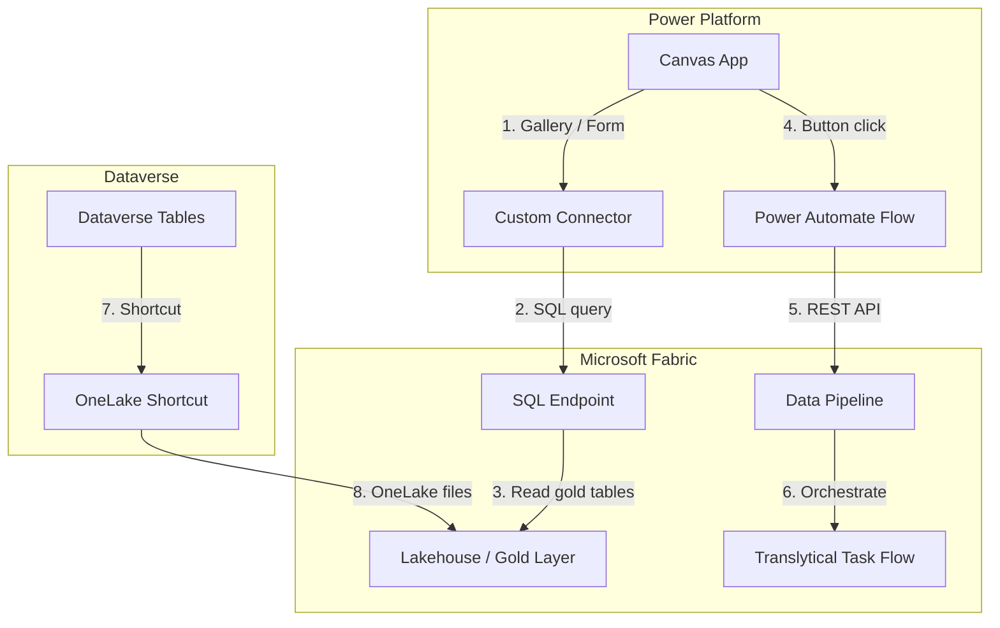

# Power Apps Canvas Consumer

A pattern for building Power Apps Canvas applications that consume data from
Microsoft Fabric, trigger Translytical Task Flows, and integrate with
Dataverse via OneLake shortcuts.

---

## Architecture



## Overview

This guide walks through three integration patterns for consuming Fabric
data in a Power Apps Canvas app:

1. **Custom Connector to Fabric SQL Endpoint** -- Query gold-layer tables
   directly from galleries, charts, and forms.
2. **Translytical Task Flow Trigger** -- Let business users kick off Fabric
   pipelines from a button in the app.
3. **Dataverse + OneLake Shortcuts** -- Sync Fabric data into Dataverse
   for offline and relational use cases.

---

## Pattern 1: Custom Connector to Fabric SQL Endpoint

### Prerequisites

- A Fabric Lakehouse with the SQL analytics endpoint enabled.
- An Entra ID app registration with `SQLEndpoint.Read` delegated permission.
- Power Apps Premium license (custom connectors require Premium).

### Step 1: Create the Custom Connector

1. Go to **Power Apps > Custom Connectors > New custom connector > Create
   from blank**.
2. Set the **Host** to your Fabric SQL endpoint hostname:
   ```
   your-workspace.datawarehouse.fabric.microsoft.com
   ```
3. Under **Security**, choose **OAuth 2.0** with these settings:

   | Field | Value |
   |-------|-------|
   | Identity provider | Azure Active Directory |
   | Client ID | `<your-app-client-id>` |
   | Client secret | `<your-app-client-secret>` |
   | Resource URL | `https://database.windows.net/` |
   | Scope | `https://database.windows.net/.default` |

4. Under **Definition**, create an action:

   **Action: GetSlotPerformance**

   | Property | Value |
   |----------|-------|
   | Operation ID | `GetSlotPerformance` |
   | Verb | `POST` |
   | URL | `/v1.0/` |
   | Body | SQL query string |

   Request body schema:
   ```json
   {
     "query": "SELECT TOP 1000 machine_id, casino_name, denomination, coin_in, coin_out, actual_hold_pct FROM gold_slot_performance WHERE play_date >= @startDate"
   }
   ```

5. Define the response schema by importing a sample response from the SQL
   endpoint.
6. **Create connector** and test the connection.

### Step 2: Build the Gallery

1. Insert a **Vertical Gallery** on the main screen.
2. Set the gallery `Items` property:
   ```
   ClearCollect(
       colSlotData,
       FabricConnector.GetSlotPerformance({
           query: "SELECT TOP 500 machine_id, casino_name, denomination, coin_in, coin_out, actual_hold_pct FROM gold_slot_performance WHERE play_date >= '" & Text(dpStartDate.SelectedDate, "yyyy-mm-dd") & "' ORDER BY coin_in DESC"
       }).value
   );
   colSlotData
   ```
3. Add labels bound to `ThisItem.machine_id`, `ThisItem.casino_name`, etc.

### Step 3: Add Filter Controls

1. Insert a **Date Picker** (`dpStartDate`) and a **Dropdown**
   (`ddCasino`).
2. Populate the dropdown:
   ```
   Distinct(colSlotData, casino_name)
   ```
3. Update the gallery filter:
   ```
   Filter(
       colSlotData,
       casino_name = ddCasino.Selected.Value
       Or ddCasino.Selected.Value = "All"
   )
   ```

### Delegation Considerations

Power Apps delegation limits default to 500 rows (configurable up to
2,000). For datasets exceeding this limit:

- **Push filtering to the SQL query** rather than using client-side
  `Filter()` or `Search()` functions.
- Use `ClearCollect` to fetch pre-filtered results from the connector.
- For very large datasets, implement server-side pagination with `OFFSET`
  / `FETCH NEXT` in the SQL query.
- Consider caching results in a Dataverse table for instant gallery
  binding with full delegation support.

---

## Pattern 2: Translytical Task Flow Integration

Translytical Task Flows let you define multi-step data operations
(ingest, transform, publish) as a single callable unit. Triggering them
from Power Apps gives business users self-service data refresh.

### Step 1: Create a Power Automate Flow

1. In Power Automate, create an **Instant cloud flow** triggered by
   **PowerApps (V2)**.
2. Add an **HTTP** action to call the Fabric REST API:

   | Field | Value |
   |-------|-------|
   | Method | `POST` |
   | URI | `https://api.fabric.microsoft.com/v1/workspaces/{workspaceId}/items/{pipelineId}/jobs/instances?jobType=Pipeline` |
   | Authentication | Managed Identity or OAuth (see below) |
   | Headers | `Content-Type: application/json` |

3. Add a **Do Until** loop that polls the job status:

   ```
   GET https://api.fabric.microsoft.com/v1/workspaces/{workspaceId}/items/{pipelineId}/jobs/instances/{runId}
   ```

   Loop until `body('GetJobStatus')['status']` equals `Completed` or
   `Failed`.

4. Add a **Respond to a PowerApp or flow** action returning the final
   status.

### Step 2: Wire Up the Canvas App

1. Add a **Button** labeled "Refresh Data Pipeline".
2. Set the `OnSelect` property:
   ```
   Set(
       varPipelineResult,
       TriggerFabricPipeline.Run()
   );
   If(
       varPipelineResult.status = "Completed",
       Notify("Pipeline completed successfully", NotificationType.Success),
       Notify("Pipeline failed: " & varPipelineResult.error, NotificationType.Error)
   )
   ```
3. Add a loading spinner bound to a `varIsRunning` variable.

### Authentication for Fabric REST API

| Method | When to Use |
|--------|-------------|
| Managed Identity | Flow runs in Azure (Logic Apps, Functions) |
| Service Principal | Automated / unattended scenarios |
| Delegated (user) | User-context execution; honors RLS |

For Power Automate, the simplest approach is a **service principal**
connection reference with `Fabric.ReadWrite.All` application permission.

---

## Pattern 3: Dataverse + OneLake Shortcuts

OneLake shortcuts allow Dataverse to reference Fabric Lakehouse files
without copying data. This enables:

- Gallery binding with full delegation (Dataverse supports delegation
  natively).
- Offline mode for mobile apps.
- Relational joins between Dataverse entities and Fabric data.

### Step 1: Create a OneLake Shortcut in Dataverse

1. In the Power Platform admin center, go to **Environments > [your env]
   > OneLake shortcuts**.
2. Select **New shortcut** and choose the Fabric Lakehouse.
3. Pick the Delta table (e.g., `gold_slot_performance`).
4. Dataverse creates a virtual table backed by OneLake.

### Step 2: Bind the Canvas App

1. Add a Dataverse data source in the Canvas app.
2. Set a gallery `Items` to:
   ```
   'gold_slot_performance'
   ```
3. Delegation works natively because Dataverse handles query push-down.

### Sync Considerations

| Scenario | Approach |
|----------|----------|
| Near-real-time | Use Fabric Mirroring to keep Dataverse in sync |
| Batch (daily) | Schedule a pipeline to refresh the shortcut |
| On-demand | Trigger via Pattern 2 (Task Flow button) |

---

## Complete App Layout

```
Screen: HomeScreen
  Header: "Casino Operations Dashboard"
  KPI Cards:
    - Total Coin-In (SUM from connector)
    - Net Revenue (SUM coin_in - coin_out)
    - Active Machines (COUNTROWS)
    - Avg Hold % (AVERAGE)
  Gallery: Top 10 machines by coin_in
  Button: "Refresh Pipeline" (Pattern 2)

Screen: DetailScreen
  Form: Machine details (from gallery selection)
  Chart: 7-day coin-in trend (line chart component)

Screen: SettingsScreen
  Date range picker
  Casino selector
  Denomination filter
  Connection status indicator
```

## Error Handling

```
// Wrap connector calls in IfError
IfError(
    ClearCollect(
        colSlotData,
        FabricConnector.GetSlotPerformance({query: varQuery}).value
    ),
    Notify(
        "Unable to connect to Fabric: " & FirstError.Message,
        NotificationType.Error
    );
    // Fall back to cached Dataverse data
    ClearCollect(colSlotData, 'gold_slot_performance_cache')
)
```

## Security Considerations

- Custom connectors use OAuth delegated auth; users see only data they
  have access to in Fabric (respects workspace RBAC).
- Dataverse shortcuts inherit Dataverse security roles.
- Pipeline triggers via Power Automate should use a service account with
  minimal Fabric permissions.
- Audit connector usage via the Power Platform admin center analytics.

## Limitations

| Limitation | Workaround |
|------------|------------|
| Delegation limit (2,000 rows max) | Push filters to SQL; use Dataverse virtual tables |
| No DirectQuery from Canvas apps | Cache results in collections or Dataverse |
| Custom connector requires Premium | Use Dataverse virtual tables as a non-Premium alternative |
| No real-time streaming in Canvas | Use Power BI embedded for live dashboards |

## Related Resources

- [Fabric SQL endpoint in Power Apps](https://learn.microsoft.com/power-apps/maker/canvas-apps/connections/sql-server)
- [Translytical Task Flows](https://learn.microsoft.com/fabric/data-factory/translytical-task-flows)
- [OneLake shortcuts for Dataverse](https://learn.microsoft.com/power-platform/admin/onelake-shortcuts)
- [Power Apps delegation](https://learn.microsoft.com/power-apps/maker/canvas-apps/delegation-overview)
- [Casino POC Gold Layer](../../notebooks/gold/)
