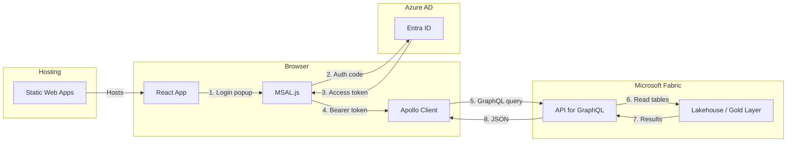

# React GraphQL Fabric Consumer

A React + TypeScript application that queries a Microsoft Fabric API for
GraphQL endpoint using Apollo Client, displaying casino player data and
slot-machine KPIs in a Material UI interface.

---

## Architecture



## Prerequisites

| Requirement | Details |
|-------------|---------|
| Node.js | 18 or later |
| Fabric Workspace | A workspace with API for GraphQL configured |
| App Registration | Entra ID app with SPA redirect and `PowerBI.Read` scope |
| Gold tables | `gold_slot_performance` and `gold_player_summary` exposed via GraphQL |

## Fabric GraphQL API Setup

1. In your Fabric workspace, select **New item > API for GraphQL**.
2. Connect it to your Lakehouse SQL endpoint.
3. In the GraphQL schema editor, expose the tables:
   - `gold_slot_performance` (query: `slotPerformance`)
   - `gold_player_summary` (query: `players`, `player`)
   - `gold_kpi_summary` (query: `kpiSummary`)
4. Publish the API and copy the endpoint URL.

### Example schema mapping

```graphql
type Player {
  player_id: String!
  first_name: String!
  last_name: String!
  loyalty_tier: String!
  total_coin_in: Float!
  total_coin_out: Float!
  visit_count: Int!
  last_visit_date: String
  signup_date: String
  favorite_machine_type: String
  avg_session_duration_min: Float
}

type SlotPerformance {
  machine_id: String!
  casino_name: String!
  denomination: String!
  coin_in: Float!
  coin_out: Float!
  jackpot_amount: Float
  theoretical_hold_pct: Float!
  actual_hold_pct: Float!
  games_played: Int!
  play_date: String!
}

type KpiSummary {
  total_coin_in: Float!
  total_coin_out: Float!
  net_revenue: Float!
  avg_hold_pct: Float!
  active_machines: Int!
  total_games_played: Int!
  unique_players: Int!
}
```

## Authentication (MSAL)

### Register the app in Entra ID

1. Go to **Azure Portal > App registrations > New registration**.
2. Set the redirect URI to `http://localhost:3000` (SPA platform).
3. Under **API permissions**, add:
   - `Microsoft.PowerBI > PowerBI.Read` (delegated)
4. Note the **Application (client) ID** and **Directory (tenant) ID**.

### Environment variables

Create a `.env` file in the project root:

```dotenv
REACT_APP_FABRIC_GRAPHQL_ENDPOINT=https://<workspace>.fabric.microsoft.com/v1/workspaces/<id>/graphqlapis/<api-id>/graphql
REACT_APP_MSAL_CLIENT_ID=00000000-0000-0000-0000-000000000000
REACT_APP_MSAL_AUTHORITY=https://login.microsoftonline.com/<tenant-id>
```

## Local Development

```bash
# Install dependencies
npm install

# Start development server
npm start
```

The app opens at `http://localhost:3000`.

### Pages

**Dashboard** -- Four KPI cards (Coin-In, Net Revenue, Hold %, Active
Machines) and a revenue-by-denomination bar chart.

> *Screenshot placeholder: dashboard.png*

**Player Data** -- Sortable, paginated table of player records with
loyalty-tier badges and a search filter.

> *Screenshot placeholder: player-table.png*

## Project Structure

```
src/
  App.tsx              Main app with Apollo Provider and MSAL setup
  queries.ts           GraphQL query definitions
  components/
    Dashboard.tsx      KPI cards and revenue chart
    PlayerTable.tsx    Sortable, filterable player data table
```

## Deploy to Azure Static Web Apps

### Option 1: GitHub Actions (recommended)

1. Push this directory to a GitHub repository.
2. In Azure Portal, create a **Static Web App** linked to the repo.
3. Set the build configuration:
   - **App location:** `sample-apps/react-graphql-consumer`
   - **Output location:** `build`
4. Add environment variables in the SWA **Configuration** blade.

### Option 2: SWA CLI

```bash
# Install SWA CLI
npm install -g @azure/static-web-apps-cli

# Build
npm run build

# Deploy
swa deploy build/ \
    --deployment-token $SWA_DEPLOYMENT_TOKEN \
    --env production
```

### CORS and redirect URIs

After deploying, update the Entra ID app registration:

1. Add the SWA URL (`https://<name>.azurestaticapps.net`) as a SPA redirect
   URI.
2. In the Fabric GraphQL API settings, add the SWA URL to the allowed
   origins list.

## Security Considerations

- MSAL tokens are stored in `sessionStorage` by default. For stricter
  security, configure `cacheLocation: "memoryStorage"`.
- The GraphQL API enforces row-level security defined in the Lakehouse.
- Never expose service-principal secrets in client-side code; use delegated
  (user) auth only.
- Enable Content Security Policy headers in the SWA configuration.

## Troubleshooting

| Symptom | Fix |
|---------|-----|
| CORS error on GraphQL request | Add `http://localhost:3000` to the API's allowed origins in Fabric |
| `interaction_in_progress` | Only one MSAL popup can be active; close duplicates and retry |
| Empty query results | Verify the GraphQL schema exposes the correct table names |
| 401 on GraphQL | Ensure the app registration has `PowerBI.Read` permission and admin consent |

## Related Resources

- [Fabric API for GraphQL](https://learn.microsoft.com/fabric/data-engineering/api-graphql-overview)
- [MSAL.js for React](https://learn.microsoft.com/entra/identity-platform/tutorial-v2-react)
- [Apollo Client docs](https://www.apollographql.com/docs/react/)
- [Casino POC Gold Layer](../../notebooks/gold/)
