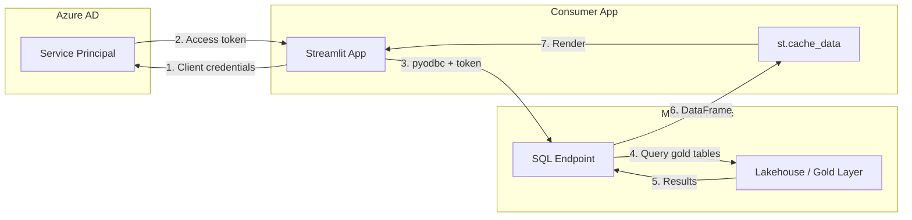

# Streamlit Fabric Consumer

A Streamlit dashboard that queries a Microsoft Fabric SQL endpoint to display
casino slot-machine performance KPIs, interactive charts, and revenue trend
analysis.

---

## Architecture



## Prerequisites

| Requirement | Details |
|-------------|---------|
| Python | 3.10 or later |
| ODBC Driver | Microsoft ODBC Driver 18 for SQL Server |
| Fabric Workspace | A workspace with a Lakehouse SQL endpoint enabled |
| Service Principal | App registration with `SQLEndpoint.Read` on the Fabric workspace |
| Gold tables | `gold_slot_performance` table populated via the medallion pipeline |

### Install ODBC Driver 18

**Windows (winget)**

```powershell
winget install --id Microsoft.ODBCDriver --version 18
```

**Ubuntu / Debian**

```bash
curl https://packages.microsoft.com/keys/microsoft.asc | sudo apt-key add -
sudo add-apt-repository "$(curl https://packages.microsoft.com/config/ubuntu/$(lsb_release -rs)/prod.list)"
sudo apt-get update && sudo apt-get install -y msodbcsql18
```

**macOS (Homebrew)**

```bash
brew tap microsoft/mssql-release https://github.com/Microsoft/homebrew-mssql-release
brew install msodbcsql18
```

## Service Principal Setup

1. Register an application in Azure AD (Entra ID).
2. Create a client secret and note the value.
3. In your Fabric workspace, grant the application **Viewer** (or
   **Contributor**) access.
4. In the Lakehouse SQL endpoint settings, ensure the service principal has
   `SELECT` on the `gold_slot_performance` table (or equivalent).

## Environment Variables

Create a `.env` file in this directory (never commit it):

```dotenv
# .env.example
FABRIC_SQL_ENDPOINT=your-workspace.datawarehouse.fabric.microsoft.com
FABRIC_DATABASE=your-lakehouse-sql-endpoint
AZURE_CLIENT_ID=00000000-0000-0000-0000-000000000000
AZURE_CLIENT_SECRET=your-client-secret
AZURE_TENANT_ID=00000000-0000-0000-0000-000000000000
```

| Variable | Description |
|----------|-------------|
| `FABRIC_SQL_ENDPOINT` | SQL endpoint hostname shown in the Lakehouse SQL analytics endpoint settings |
| `FABRIC_DATABASE` | Database name (usually the Lakehouse name) |
| `AZURE_CLIENT_ID` | App (client) ID of the service principal |
| `AZURE_CLIENT_SECRET` | Client secret value |
| `AZURE_TENANT_ID` | Azure AD tenant ID |

## Local Development

```bash
# 1. Create virtual environment
python -m venv .venv
source .venv/bin/activate   # Linux/macOS
# .venv\Scripts\activate    # Windows

# 2. Install dependencies
pip install -r requirements.txt

# 3. Run the app
streamlit run app.py
```

The app opens at `http://localhost:8501`. Use the sidebar to select date
ranges, casinos, and denominations.

## Pages

### Executive Dashboard

Displays four KPI cards (Total Coin-In, Total Coin-Out, Net Revenue, Avg
Hold %) along with a revenue-share donut chart and a revenue-by-denomination
bar chart.

> *Screenshot placeholder: executive-dashboard.png*

### Slot Performance

Scatter plot of theoretical vs actual hold percentage, sized by coin-in and
colored by denomination. Includes a parity reference line and a raw data
table below the chart.

> *Screenshot placeholder: slot-performance.png*

### Revenue Trends

Time-series line chart of daily net revenue per casino and an area chart of
daily games played.

> *Screenshot placeholder: revenue-trends.png*

## Caching

The app uses `st.cache_data` with a 5-minute TTL for query results and a
10-minute TTL for filter-option lookups. Changing any sidebar filter
automatically invalidates the relevant cache entry.

## Deploy to Azure Container Apps

### Dockerfile

Create a `Dockerfile` in this directory:

```dockerfile
FROM python:3.12-slim

# Install ODBC Driver 18
RUN apt-get update && \
    apt-get install -y --no-install-recommends \
        curl gnupg2 unixodbc-dev && \
    curl https://packages.microsoft.com/keys/microsoft.asc | apt-key add - && \
    curl https://packages.microsoft.com/config/debian/12/prod.list \
        > /etc/apt/sources.list.d/mssql-release.list && \
    apt-get update && \
    ACCEPT_EULA=Y apt-get install -y msodbcsql18 && \
    apt-get clean && rm -rf /var/lib/apt/lists/*

WORKDIR /app
COPY requirements.txt .
RUN pip install --no-cache-dir -r requirements.txt

COPY app.py .
EXPOSE 8501

HEALTHCHECK CMD curl --fail http://localhost:8501/_stcore/health || exit 1

ENTRYPOINT ["streamlit", "run", "app.py", \
    "--server.port=8501", \
    "--server.headless=true", \
    "--server.address=0.0.0.0"]
```

### Build and Push

```bash
# Variables
RG=rg-fabric-poc
ACR=acrfabricpoc
IMAGE=streamlit-fabric-consumer

# Build
az acr build --registry $ACR --image $IMAGE:latest .

# Create Container App environment (one-time)
az containerapp env create \
    --name cae-fabric-poc \
    --resource-group $RG \
    --location eastus2

# Deploy
az containerapp create \
    --name ca-streamlit-dashboard \
    --resource-group $RG \
    --environment cae-fabric-poc \
    --image $ACR.azurecr.io/$IMAGE:latest \
    --registry-server $ACR.azurecr.io \
    --target-port 8501 \
    --ingress external \
    --min-replicas 0 \
    --max-replicas 3 \
    --secrets \
        fabric-sql-endpoint="$FABRIC_SQL_ENDPOINT" \
        fabric-database="$FABRIC_DATABASE" \
        azure-client-id="$AZURE_CLIENT_ID" \
        azure-client-secret="$AZURE_CLIENT_SECRET" \
        azure-tenant-id="$AZURE_TENANT_ID" \
    --env-vars \
        FABRIC_SQL_ENDPOINT=secretref:fabric-sql-endpoint \
        FABRIC_DATABASE=secretref:fabric-database \
        AZURE_CLIENT_ID=secretref:azure-client-id \
        AZURE_CLIENT_SECRET=secretref:azure-client-secret \
        AZURE_TENANT_ID=secretref:azure-tenant-id
```

### Managed Identity Alternative

For production workloads, replace the service principal secret with a
user-assigned managed identity:

1. Create a managed identity and assign it to the Container App.
2. Grant the identity access to the Fabric workspace.
3. Remove `AZURE_CLIENT_SECRET` and update `app.py` to use
   `DefaultAzureCredential` from `azure-identity`.

## Troubleshooting

| Symptom | Fix |
|---------|-----|
| `[IM002] Data source name not found` | ODBC Driver 18 is not installed. See prerequisites. |
| `Login failed for user` | Verify the service principal has workspace access and the SQL endpoint allows SP auth. |
| `No data for the selected filters` | Confirm the `gold_slot_performance` table is populated and the date range overlaps with existing data. |
| Slow first load | The initial token acquisition and query take a few seconds; subsequent calls use the cache. |

## Security Considerations

- Never commit `.env` to version control (add it to `.gitignore`).
- Use Azure Key Vault references or Container App secrets for production
  deployments.
- The SQL endpoint connection uses TLS encryption (`Encrypt=yes`).
- Consider IP allow-listing the Container App outbound IPs in Fabric
  firewall rules.

## Related Resources

- [Fabric SQL endpoint documentation](https://learn.microsoft.com/fabric/data-warehouse/sql-endpoint)
- [pyodbc + Azure AD token auth](https://learn.microsoft.com/sql/connect/odbc/using-azure-active-directory)
- [Streamlit deployment on Azure](https://learn.microsoft.com/azure/developer/python/tutorial-deploy-python-web-app-azure-container-apps)
- [Casino POC Gold Layer](../../notebooks/gold/)
