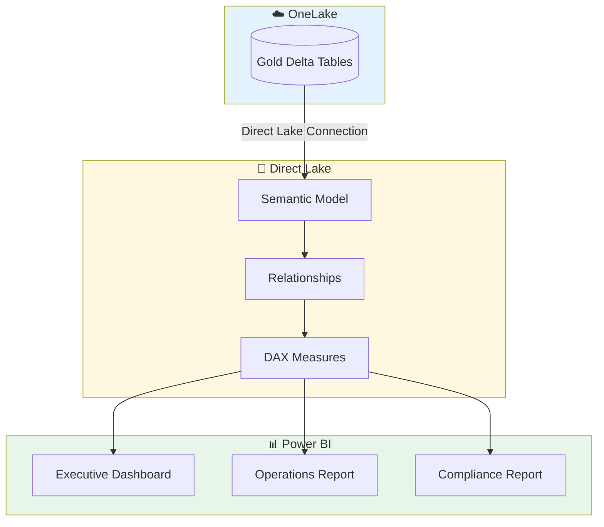
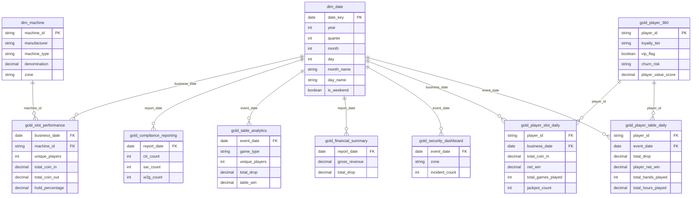
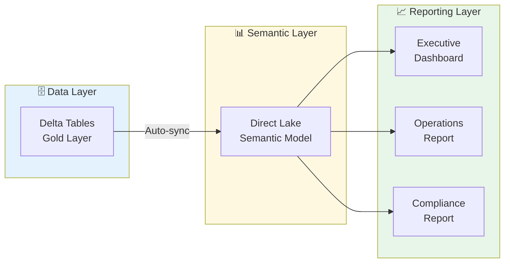

# 📊 Tutorial 05: Direct Lake & Power BI

> **Last Updated**: 2026-04-15 | **Version**: 2.0
> **Status**: ✅ Final | **Maintainer**: Documentation Team

> **🏠 [Home](https://github.com/fgarofalo56/Supercharge_Microsoft_Fabric/blob/main/README.md)** > **📖 [Tutorials](../index.md)** > **📊 Direct Lake & Power BI**

---

<div align="center" markdown>


</div>

---

## 📊 Tutorial 05: Direct Lake & Power BI - Executive Analytics

| Attribute | Details |
|-----------|---------|
| **Difficulty** | ⭐⭐ Intermediate |
| **Time Estimate** | ⏱️ 60-90 minutes |
| **Focus Area** | Business Intelligence |
| **Key Skills** | Direct Lake, Semantic Models, DAX, Power BI Reports |

---

### 📊 Progress Tracker

```
┌────────┬────────┬────────┬────────┬────────┬────────┬────────┬────────┬────────┬────────┐
│   00   │   01   │   02   │   03   │   04   │   05   │   06   │   07   │   08   │   09   │
│ SETUP  │ BRONZE │ SILVER │  GOLD  │   RT   │  PBI   │ PIPES  │  GOV   │ MIRROR │  AI/ML │
├────────┼────────┼────────┼────────┼────────┼────────┼────────┼────────┼────────┼────────┤
│   ✓    │   ✓    │   ✓    │   ✓    │   ✓    │  📊    │   ○    │   ○    │   ○    │   ○    │
└────────┴────────┴────────┴────────┴────────┴────────┴────────┴────────┴────────┴────────┘
                                                  ▲
                                                  │
                                             YOU ARE HERE
```

| Navigation | Link |
|------------|------|
| ⬅️ **Previous** | [04-Real-Time Analytics](../04-real-time-analytics/README.md) |
| ➡️ **Next** | [06-Data Pipelines](../06-data-pipelines/README.md) |

---

## 📋 Overview

This tutorial covers creating **Direct Lake semantic models** and **Power BI reports** for casino executive analytics. Direct Lake provides sub-second query performance directly against Delta tables in OneLake, combining the speed of Import mode with the freshness of DirectQuery.

> **💡 Why Direct Lake?**
>
> Traditional BI approaches require choosing between:
> - **Import mode**: Fast queries but stale data (requires refresh)
> - **DirectQuery**: Fresh data but slower performance
>
> **Direct Lake delivers both**: Sub-second queries on always-fresh Delta table data, with no scheduled refresh required.

---

## 🎯 Learning Objectives

By the end of this tutorial, you will be able to:

- [ ] Understand Direct Lake mode and its benefits
- [ ] Create a semantic model from Gold layer tables
- [ ] Define table relationships for star schema
- [ ] Build DAX measures for casino KPIs
- [ ] Create executive and operational Power BI reports
- [ ] Configure row-level security (RLS)

---

## 🏗️ Direct Lake Architecture


*Source: [Direct Lake Overview in Microsoft Fabric](https://learn.microsoft.com/en-us/fabric/get-started/direct-lake-overview)*



### Direct Lake Benefits

| Feature | Description |
|---------|-------------|
| **Sub-second queries** | Queries execute directly against Delta tables with V-Order optimization |
| **No data import** | No duplication of data - queries go directly to OneLake |
| **Automatic freshness** | Data updates are automatically visible without refresh |
| **Full DAX support** | All DAX calculations, time intelligence, and measures work |
| **Fallback protection** | Automatically falls back to DirectQuery if needed |

---

## 📋 Prerequisites

Before starting this tutorial, ensure you have:

- [ ] ✅ Completed [Tutorial 03: Gold Layer](../03-gold-layer/README.md)
- [ ] ✅ Gold tables populated in `lh_gold` Lakehouse:
  - `gold_slot_performance`, `gold_player_360`, `gold_compliance_reporting`, `gold_table_analytics`, `gold_financial_summary`, `gold_security_dashboard` (fact tables from Tutorial 03)
  - `dim_date`, `dim_machine` (dimensions — created by [notebooks/gold/00_gold_dim_tables.py](https://github.com/fgarofalo56/Supercharge_Microsoft_Fabric/blob/main/notebooks/gold/00_gold_dim_tables.py))
  - `gold_player_slot_daily` (player-grain fact — created by [notebooks/gold/07_gold_player_slot_daily.py](https://github.com/fgarofalo56/Supercharge_Microsoft_Fabric/blob/main/notebooks/gold/07_gold_player_slot_daily.py))
  - `gold_player_table_daily` (player-grain fact — created by [notebooks/gold/08_gold_player_table_daily.py](https://github.com/fgarofalo56/Supercharge_Microsoft_Fabric/blob/main/notebooks/gold/08_gold_player_table_daily.py))
- [ ] ✅ Power BI license (Pro or Premium Per User)
- [ ] ✅ Fabric workspace with semantic model creation permissions

> **⚠️ Run the three prerequisite notebooks first.** Tutorial 03 does not create `dim_date`, `dim_machine`, `gold_player_slot_daily`, or `gold_player_table_daily`. Run [notebooks/gold/00_gold_dim_tables.py](https://github.com/fgarofalo56/Supercharge_Microsoft_Fabric/blob/main/notebooks/gold/00_gold_dim_tables.py), [notebooks/gold/07_gold_player_slot_daily.py](https://github.com/fgarofalo56/Supercharge_Microsoft_Fabric/blob/main/notebooks/gold/07_gold_player_slot_daily.py), and [notebooks/gold/08_gold_player_table_daily.py](https://github.com/fgarofalo56/Supercharge_Microsoft_Fabric/blob/main/notebooks/gold/08_gold_player_table_daily.py) against your Silver/Gold lakehouses before proceeding. Each takes under a minute.

> **⚠️ License Note**
>
> Power BI Pro or Premium Per User (PPU) license is required to create and share semantic models. Users consuming reports need at least a Free license if content is in a Premium capacity.

---

## 🛠️ Step 1: Create Semantic Model

### 1.1 Create from Lakehouse

1. Navigate to your workspace (`casino-fabric-poc`)
2. Open the `lh_gold` Lakehouse
3. Click **New semantic model** in the toolbar
4. Select **all 10 tables** to include:

| Table | Type | Purpose |
| ----- | ---- | ------- |
| ✅ `gold_slot_performance` | Fact | Daily slot machine performance (machine-day grain) |
| ✅ `gold_player_360` | Dimension | Player profiles and value scores (player grain) |
| ✅ `gold_compliance_reporting` | Fact | Regulatory filing summaries (CTR/SAR/W-2G) |
| ✅ `gold_table_analytics` | Fact | Table games KPIs at game-day grain |
| ✅ `gold_financial_summary` | Fact | Daily P&L and cash flow |
| ✅ `gold_security_dashboard` | Fact | Security events and incident tracking |
| ✅ `gold_player_slot_daily` | Fact | Slot activity at **player-day** grain (joins player_360 to slots) |
| ✅ `gold_player_table_daily` | Fact | Table games at **player-day** grain (joins player_360 to tables) |
| ✅ `dim_date` | Dimension | Date hierarchy for time intelligence (2020–2030) |
| ✅ `dim_machine` | Dimension | Slot machine master data |

> **Missing tables from the picker?**
>
> - `dim_date` / `dim_machine` → run [notebooks/gold/00_gold_dim_tables.py](https://github.com/fgarofalo56/Supercharge_Microsoft_Fabric/blob/main/notebooks/gold/00_gold_dim_tables.py)
> - `gold_player_slot_daily` → run [notebooks/gold/07_gold_player_slot_daily.py](https://github.com/fgarofalo56/Supercharge_Microsoft_Fabric/blob/main/notebooks/gold/07_gold_player_slot_daily.py)
> - `gold_player_table_daily` → run [notebooks/gold/08_gold_player_table_daily.py](https://github.com/fgarofalo56/Supercharge_Microsoft_Fabric/blob/main/notebooks/gold/08_gold_player_table_daily.py)

5. Configure semantic model:

| Setting | Value |
|---------|-------|
| **Name** | `sm_casino_gold` |
| **Workspace** | `casino-fabric-poc` |

6. Click **Create**

> **Already created the model with fewer tables?** Open `sm_casino_gold` → top ribbon → **Home** → **Get data** → **OneLake** → pick `lh_gold` → check any missing tables from the list above → **Load**. They'll join the existing tables without re-creating the model.


*Direct Lake semantic models connect directly to Delta tables in OneLake for optimal performance. Source: [Direct Lake overview](https://learn.microsoft.com/en-us/fabric/fundamentals/direct-lake-overview)*

### 1.2 Verify Direct Lake Mode

After creation, verify the model is using Direct Lake:

1. Open the semantic model in your workspace
2. Click **Settings** (gear icon)
3. Verify **Storage mode** shows: `Direct Lake`
4. In the model diagram, confirm tables display "DirectLake" badge

> **💡 Direct Lake Requirements**
>
> For Direct Lake to work optimally:
> - Tables must be Delta format in OneLake
> - V-Order optimization should be enabled (default in Fabric)
> - Tables should have reasonable row counts (billions supported)
> - Complex calculated columns may cause DirectQuery fallback

---

## 🛠️ Step 2: Define Table Relationships

A well-designed star schema is critical for optimal query performance and intuitive reporting.

### 2.1 Open Model View

1. Click on the semantic model
2. Select **Model view** from the left panel

### 2.2 Create Relationships



### 2.3 Configure Each Relationship

Create the **10 relationships** below by dragging columns between tables (or via **Manage relationships → New**). The Many side is always the Fact; the One side is always the Dimension.

#### Dimension → Fact relationships (dim_date as universal date dimension)

| From (One / Dimension) | From Column | To (Many / Fact) | To Column | Cardinality | Cross-filter |
| ---------------------- | ----------- | ---------------- | --------- | ----------- | ------------ |
| `dim_date` | `date_key` | `gold_slot_performance` | `business_date` | One-to-Many | Single |
| `dim_date` | `date_key` | `gold_compliance_reporting` | `report_date` | One-to-Many | Single |
| `dim_date` | `date_key` | `gold_table_analytics` | `event_date` | One-to-Many | Single |
| `dim_date` | `date_key` | `gold_financial_summary` | `report_date` | One-to-Many | Single |
| `dim_date` | `date_key` | `gold_security_dashboard` | `event_date` | One-to-Many | Single |
| `dim_date` | `date_key` | `gold_player_slot_daily` | `business_date` | One-to-Many | Single |
| `dim_date` | `date_key` | `gold_player_table_daily` | `event_date` | One-to-Many | Single |

#### Machine dimension → Slot fact

| From (One / Dimension) | From Column | To (Many / Fact) | To Column | Cardinality | Cross-filter |
| ---------------------- | ----------- | ---------------- | --------- | ----------- | ------------ |
| `dim_machine` | `machine_id` | `gold_slot_performance` | `machine_id` | One-to-Many | Single |

#### Player dimension → Player-grain facts

`gold_player_360` now joins the model through the two player-grain fact tables (`gold_player_slot_daily`, `gold_player_table_daily`). This enables cross-filtering VIP/loyalty/churn slicers against slot and table activity.

| From (One / Dimension) | From Column | To (Many / Fact) | To Column | Cardinality | Cross-filter |
| ---------------------- | ----------- | ---------------- | --------- | ----------- | ------------ |
| `gold_player_360` | `player_id` | `gold_player_slot_daily` | `player_id` | One-to-Many | Single |
| `gold_player_360` | `player_id` | `gold_player_table_daily` | `player_id` | One-to-Many | Single |

#### Configuration for every relationship

- **Cardinality:** Many-to-One (from fact to dimension)
- **Cross-filter direction:** Single
- **Make this relationship active:** Yes

> **Ambiguity note.** Because `dim_date` filters five facts and several of those facts share natural-key columns (e.g., `report_date` appears on both `gold_compliance_reporting` and `gold_financial_summary`), Power BI may warn about "ambiguous paths." This is expected and safe — each relationship is between distinct tables. If you see a warning about an inactive relationship, that's fine; for a Direct Lake star schema, one active date relationship per fact is what you want.

> **⚠️ Relationship Best Practices.** Always use **single cross-filter direction** for better performance. Avoid bidirectional filters unless absolutely necessary. Use **integer keys** when possible for faster joins. Validate relationships with sample queries.

---

## 🛠️ Step 3: Create DAX Measures

DAX measures provide calculated metrics that respond to filter context in reports.

### 3.1 Create Measures Table

1. In the model view, click **New measure**
2. Create a "Measures" display folder to organize measures


*Measures appear in the Data pane with a calculator icon. Source: [Create measures in Power BI Desktop](https://learn.microsoft.com/en-us/power-bi/transform-model/desktop-measures)*


*The formula bar displays the DAX expression for the selected measure. Source: [Create measures in Power BI Desktop](https://learn.microsoft.com/en-us/power-bi/transform-model/desktop-measures)*

### 3.2 Slot Performance Measures

```dax
// ===========================================
// SLOT PERFORMANCE MEASURES
// ===========================================

// Total Coin In
Total Coin In =
SUM(gold_slot_performance[total_coin_in])

// Total Coin Out
Total Coin Out =
SUM(gold_slot_performance[total_coin_out])

// Net Win (House Win)
Net Win =
[Total Coin In] - [Total Coin Out]

// Hold Percentage
Hold % =
DIVIDE(
    [Net Win],
    [Total Coin In],
    0
) * 100

// Theoretical Win (based on programmed hold)
Theoretical Win =
SUMX(
    gold_slot_performance,
    gold_slot_performance[total_coin_in] *
    gold_slot_performance[avg_theoretical_hold]
)

// Hold Variance (Actual vs Theoretical)
Hold Variance =
[Net Win] - [Theoretical Win]

// Hold Variance % (for alerting)
Hold Variance % =
DIVIDE(
    [Hold Variance],
    [Theoretical Win],
    0
) * 100

// Total Games Played
Total Games =
SUM(gold_slot_performance[total_games])

// Unique Players
Unique Players =
SUM(gold_slot_performance[unique_players])

// Average Bet
Avg Bet =
DIVIDE(
    [Total Coin In],
    [Total Games],
    0
)

// Win Per Machine
Win Per Machine =
DIVIDE(
    [Net Win],
    DISTINCTCOUNT(gold_slot_performance[machine_id]),
    0
)

// Active Machines Count
Active Machines =
DISTINCTCOUNT(gold_slot_performance[machine_id])
```

### 3.3 Player Analytics Measures

```dax
// ===========================================
// PLAYER MEASURES
// ===========================================

// Total Players
Total Players =
COUNTROWS(gold_player_360)

// VIP Player Count
VIP Players =
CALCULATE(
    COUNTROWS(gold_player_360),
    gold_player_360[vip_flag] = TRUE()
)

// VIP Percentage
VIP % =
DIVIDE(
    [VIP Players],
    [Total Players],
    0
) * 100

// High Churn Risk Players
High Churn Risk Players =
CALCULATE(
    COUNTROWS(gold_player_360),
    gold_player_360[churn_risk] = "High"
)

// Average Player Value Score
Avg Player Value =
AVERAGE(gold_player_360[player_value_score])

// Total Player Theo
Total Player Theo =
SUM(gold_player_360[total_theo_win])

// Active Players (visited in last 30 days)
Active Players 30D =
CALCULATE(
    COUNTROWS(gold_player_360),
    gold_player_360[days_since_visit] <= 30
)

// Lapsed Players (no visit in 90+ days)
Lapsed Players =
CALCULATE(
    COUNTROWS(gold_player_360),
    gold_player_360[days_since_visit] > 90
)

// Player Retention Rate
Retention Rate 30D =
DIVIDE(
    [Active Players 30D],
    [Total Players],
    0
) * 100
```

### 3.4 Compliance Measures

```dax
// ===========================================
// COMPLIANCE MEASURES
// ===========================================

// Total CTR Filings
CTR Count =
SUM(gold_compliance_reporting[ctr_count])

// Total SAR Filings
SAR Count =
SUM(gold_compliance_reporting[sar_count])

// Total W2G Filings
W2G Count =
SUM(gold_compliance_reporting[w2g_count])

// Total Regulatory Filings
Total Filings =
[CTR Count] + [SAR Count] + [W2G Count]

// CTR Total Amount
CTR Total Amount =
SUM(gold_compliance_reporting[ctr_total_amount])

// Average Daily Filing Rate
Daily Filing Rate =
DIVIDE(
    [Total Filings],
    DISTINCTCOUNT(gold_compliance_reporting[report_date]),
    0
)

// SAR Rate (per 1000 players)
SAR Rate =
DIVIDE(
    [SAR Count],
    [Total Players] / 1000,
    0
)
```

### 3.5 Time Intelligence Measures

```dax
// ===========================================
// TIME INTELLIGENCE MEASURES
// ===========================================

// Coin In - Month to Date
Coin In MTD =
TOTALMTD(
    [Total Coin In],
    dim_date[date_key]
)

// Coin In - Year to Date
Coin In YTD =
TOTALYTD(
    [Total Coin In],
    dim_date[date_key]
)

// Net Win - Previous Month
Net Win PM =
CALCULATE(
    [Net Win],
    DATEADD(dim_date[date_key], -1, MONTH)
)

// Net Win - Month over Month Growth %
Net Win MoM % =
VAR CurrentMonth = [Net Win]
VAR PreviousMonth = [Net Win PM]
RETURN
DIVIDE(
    CurrentMonth - PreviousMonth,
    PreviousMonth,
    0
) * 100

// Net Win - Previous Year
Net Win PY =
CALCULATE(
    [Net Win],
    SAMEPERIODLASTYEAR(dim_date[date_key])
)

// Net Win - Year over Year Growth %
Net Win YoY % =
VAR CurrentPeriod = [Net Win]
VAR PreviousYear = [Net Win PY]
RETURN
DIVIDE(
    CurrentPeriod - PreviousYear,
    PreviousYear,
    0
) * 100

// 7-Day Rolling Average Coin In
Coin In 7D Avg =
AVERAGEX(
    DATESINPERIOD(
        dim_date[date_key],
        MAX(dim_date[date_key]),
        -7,
        DAY
    ),
    [Total Coin In]
)

// 30-Day Rolling Average Net Win
Net Win 30D Avg =
AVERAGEX(
    DATESINPERIOD(
        dim_date[date_key],
        MAX(dim_date[date_key]),
        -30,
        DAY
    ),
    [Net Win]
)
```

> **💡 DAX Best Practices**
>
> - Use **measures over calculated columns** for better performance
> - Avoid **FILTER()** with large tables - use simpler predicates
> - Use **variables (VAR)** to improve readability and avoid recalculation
> - Test measures with different filter contexts before deploying

---

## 🛠️ Step 4: Create Executive Dashboard

### 4.1 Create New Report

1. From the semantic model, click **Create report**
   - Or in Power BI service: **+ New** > **Report** > Select `Casino Analytics Model`
2. The report canvas opens in edit mode

### 4.2 Page 1: Executive Summary

#### Layout Design

```
┌─────────────────────────────────────────────────────────────────────────────────┐
│  🎰 CASINO EXECUTIVE DASHBOARD                        📅 Date: [Date Slicer]   │
├──────────────┬──────────────┬──────────────┬──────────────┬────────────────────┤
│   💰         │    📊        │    👥        │    🎮        │   🏷️ Zone Filter   │
│   $2.5M      │    8.2%      │   12,450     │    1.2M      │   [Dropdown]       │
│   Net Win    │   Hold %     │   Players    │   Games      │                    │
│   ▲ +5.2%    │   ▼ -0.3%    │   ▲ +2.1%    │   ▲ +8.4%    │                    │
├──────────────┴──────────────┴──────────────┴──────────────┴────────────────────┤
│                         📈 NET WIN TREND (30 Days)                              │
│  ████████████████████████████████████████████████████████████████████████████  │
│  [Line Chart - Daily Net Win with trend line and target]                        │
├─────────────────────────────────────────┬───────────────────────────────────────┤
│   📊 PERFORMANCE BY ZONE                │   🏆 TOP 10 MACHINES                  │
│   ┌─────────────────────────────┐       │   ┌─────────────────────────────────┐ │
│   │ ████████████ Main Floor     │       │   │ Machine  │ Zone   │ Net Win    │ │
│   │ ██████████ High Limit       │       │   │ SM-0234  │ VIP    │ $45,230    │ │
│   │ ████████ VIP                │       │   │ SM-0089  │ HL     │ $38,420    │ │
│   │ ██████ Penny Palace         │       │   │ SM-0445  │ Main   │ $32,100    │ │
│   └─────────────────────────────┘       │   └─────────────────────────────────┘ │
├─────────────────────────────────────────┼───────────────────────────────────────┤
│   📋 COMPLIANCE SUMMARY                 │   👥 PLAYER TIER DISTRIBUTION         │
│   ┌────────┬────────┬────────┐          │        ┌─────────────┐                │
│   │  CTR   │  SAR   │  W2G   │          │       ╱  Platinum   ╲                │
│   │   45   │   12   │  234   │          │      ╱    Gold       ╲               │
│   │ $4.2M  │        │ $1.8M  │          │     ╱     Silver      ╲              │
│   └────────┴────────┴────────┘          │    ╱      Bronze       ╲             │
│                                          │        [Donut Chart]                 │
└─────────────────────────────────────────┴───────────────────────────────────────┘
```

#### Create Visuals


*Drag fields from the Data pane to create visualizations on the report canvas. Source: [Report view in Power BI Desktop](https://learn.microsoft.com/en-us/power-bi/create-reports/desktop-report-view)*


*Visualizations powered by DAX measures for business analytics. Source: [Create measures in Power BI Desktop](https://learn.microsoft.com/en-us/power-bi/transform-model/desktop-measures)*

**1. KPI Cards (Top Row)**

Create 4 card visuals with conditional formatting:

| Card | Measure | Format | Trend |
|------|---------|--------|-------|
| Net Win | `[Net Win]` | Currency, $0.0M | Compare to `[Net Win PM]` |
| Hold % | `[Hold %]` | Percentage, 0.0% | Target: 8.0% |
| Unique Players | `[Unique Players]` | Number, #,##0 | Compare to previous |
| Total Games | `[Total Games]` | Number, 0.0M | Compare to previous |

**2. Net Win Trend (Line Chart)**

| Property | Value |
|----------|-------|
| **X-axis** | `dim_date[date_key]` |
| **Y-axis** | `[Net Win]` |
| **Secondary Y-axis** | `[Net Win 30D Avg]` (trend line) |
| **Reference line** | Target value or previous period |

**3. Performance by Zone (Bar Chart)**

| Property | Value |
|----------|-------|
| **Y-axis** | `gold_slot_performance[zone]` |
| **X-axis** | `[Net Win]` |
| **Sort** | Descending by Net Win |
| **Data colors** | Conditional by performance |

**4. Top 10 Machines (Table)**

| Column | Measure/Field |
|--------|---------------|
| Machine ID | `gold_slot_performance[machine_id]` |
| Zone | `gold_slot_performance[zone]` |
| Net Win | `[Net Win]` |
| Hold % | `[Hold %]` |
| Games | `[Total Games]` |

Apply **Top N filter**: Top 10 by Net Win

**5. Compliance Summary (Multi-row Card)**

| Metric | Measure |
|--------|---------|
| CTR Count | `[CTR Count]` |
| SAR Count | `[SAR Count]` |
| W2G Count | `[W2G Count]` |
| CTR Amount | `[CTR Total Amount]` |

**6. Player Tier Distribution (Donut Chart)**

| Property | Value |
|----------|-------|
| **Legend** | `gold_player_360[loyalty_tier]` |
| **Values** | Count of `player_id` |
| **Colors** | Platinum (gold), Gold, Silver, Bronze |

### 4.3 Page 2: Slot Operations

#### Layout Design

```
┌─────────────────────────────────────────────────────────────────────────────────┐
│  🎰 SLOT OPERATIONS                     📅 Date: [Range]  🏷️ Zone: [Multi]     │
├─────────────────────────────────────────────────────────────────────────────────┤
│                    📊 MACHINE PERFORMANCE MATRIX                                 │
│  ┌───────────────────────────────────────────────────────────────────────────┐  │
│  │ Zone/Denom  │  $0.01  │  $0.05  │  $0.25  │  $1.00  │  $5.00  │  Total   │  │
│  ├─────────────┼─────────┼─────────┼─────────┼─────────┼─────────┼──────────┤  │
│  │ Main Floor  │  $125K  │  $89K   │  $234K  │  $456K  │  $78K   │  $982K   │  │
│  │ High Limit  │    -    │    -    │  $45K   │  $234K  │  $567K  │  $846K   │  │
│  └───────────────────────────────────────────────────────────────────────────┘  │
├─────────────────────────────────────────┬───────────────────────────────────────┤
│   📈 HOURLY ACTIVITY PATTERN            │   📊 HOLD VARIANCE ANALYSIS           │
│   ┌─────────────────────────────┐       │   ┌─────────────────────────────────┐ │
│   │ [Area chart by hour]        │       │   │ [Scatter: Theo vs Actual]       │ │
│   │                             │       │   │   x: Theoretical Win             │ │
│   │ Peak: 8PM-11PM              │       │   │   y: Actual Win                  │ │
│   │ Low: 4AM-7AM                │       │   │   Color by variance              │ │
│   └─────────────────────────────┘       │   └─────────────────────────────────┘ │
├─────────────────────────────────────────┼───────────────────────────────────────┤
│   🏭 MANUFACTURER PERFORMANCE           │   🎰 JACKPOT SUMMARY                  │
│   ┌─────────────────────────────┐       │   ┌─────────────────────────────────┐ │
│   │ [Clustered bar chart]       │       │   │ Total Jackpots: 234             │ │
│   │   - IGT                     │       │   │ Total Amount: $1.2M             │ │
│   │   - Aristocrat              │       │   │ Largest: $45,230 (SM-0234)      │ │
│   │   - Scientific Games        │       │   │ [Table of recent jackpots]      │ │
│   └─────────────────────────────┘       │   └─────────────────────────────────┘ │
└─────────────────────────────────────────┴───────────────────────────────────────┘
```

#### Key Visuals

**1. Performance Matrix**
- Visual type: Matrix
- Rows: Zone
- Columns: Denomination
- Values: Net Win, Hold %, Games

**2. Hold Variance Scatter Plot**
- X-axis: Theoretical Win
- Y-axis: Net Win (Actual)
- Size: Total Games
- Color saturation: Hold Variance %
- Reference line: y=x (where actual = theoretical)

### 4.4 Page 3: Player Analytics

#### Layout Design

```
┌─────────────────────────────────────────────────────────────────────────────────┐
│  👥 PLAYER ANALYTICS                           🏷️ Tier: [Slicer] 📅 [Date]     │
├──────────────┬──────────────┬──────────────┬────────────────────────────────────┤
│   👥         │   ⭐         │    ⚠️        │    📈                               │
│   45,230     │   2,340      │    1,256     │    72.5                            │
│   Total      │   VIP        │   At Risk    │    Avg Value                       │
│   Players    │   Players    │   (Churn)    │    Score                           │
├──────────────┴──────────────┴──────────────┴────────────────────────────────────┤
│                    📊 PLAYER VALUE DISTRIBUTION                                  │
│  ┌───────────────────────────────────────────────────────────────────────────┐  │
│  │ [Histogram of player_value_score with normal curve overlay]               │  │
│  └───────────────────────────────────────────────────────────────────────────┘  │
├─────────────────────────────────────────┬───────────────────────────────────────┤
│   📊 TIER BREAKDOWN                     │   ⚠️ CHURN RISK ANALYSIS             │
│   ┌─────────────────────────────┐       │   ┌─────────────────────────────────┐ │
│   │ [Stacked bar by tier]       │       │   │ [Pie: High/Medium/Low risk]     │ │
│   │   Platinum: 5%              │       │   │                                 │ │
│   │   Gold: 15%                 │       │   │   High: 12%                     │ │
│   │   Silver: 30%               │       │   │   Medium: 28%                   │ │
│   │   Bronze: 50%               │       │   │   Low: 60%                      │ │
│   └─────────────────────────────┘       │   └─────────────────────────────────┘ │
├─────────────────────────────────────────────────────────────────────────────────┤
│                    🏆 TOP PLAYERS BY THEORETICAL VALUE                          │
│  ┌───────────────────────────────────────────────────────────────────────────┐  │
│  │ Player ID  │  Tier     │  Total Theo  │  Visits  │  Churn Risk  │ Action  │  │
│  │ PLY-00234  │ Platinum  │   $125,000   │   45     │    Low       │  [View] │  │
│  │ PLY-00892  │ Platinum  │   $98,500    │   38     │    Medium    │  [View] │  │
│  └───────────────────────────────────────────────────────────────────────────────┘ │
└─────────────────────────────────────────────────────────────────────────────────┘
```

---

## 🛠️ Step 5: Configure Report Settings

### 5.1 Publish Report

1. Save the report: **File** > **Save as** > `Casino Executive Dashboard`
2. Click **Publish**
3. Select workspace: `casino-fabric-poc`

### 5.2 Verify Direct Lake Refresh

For Direct Lake semantic models, data updates are automatic:

1. Open the report in Power BI service
2. Click **Settings** (gear icon) on the semantic model
3. Verify under **Refresh**:
   - Shows: "Direct Lake - data is always current"
   - No scheduled refresh is needed

> **💡 Direct Lake Refresh Behavior**
>
> - Data changes in Delta tables are visible within seconds
> - No manual refresh button needed
> - If framing (metadata sync) is needed, it happens automatically
> - Monitor with semantic model refresh history for any issues

### 5.3 Configure Row-Level Security (RLS)

Restrict data access by user role (e.g., zone managers see only their zones).

#### Create RLS Role

1. Open semantic model in **Edit** mode
2. Go to **Modeling** > **Manage roles**
3. Create new role: `Zone Manager`

#### Define DAX Filter

```dax
// RLS Rule: Zone-based access
// Users see only their assigned zone(s)
[Zone Security] =
VAR UserZones =
    LOOKUPVALUE(
        UserZoneMapping[Zone],
        UserZoneMapping[UserEmail],
        USERPRINCIPALNAME()
    )
RETURN
    gold_slot_performance[zone] = UserZones
    || UserZones = "All"  // "All" grants full access
```

#### Alternative: Multiple Zones per User

```dax
// RLS Rule: Support multiple zones per user
[Zone Security Multi] =
VAR UserEmail = USERPRINCIPALNAME()
VAR AllowedZones =
    CALCULATETABLE(
        VALUES(UserZoneMapping[Zone]),
        UserZoneMapping[UserEmail] = UserEmail
    )
RETURN
    gold_slot_performance[zone] IN AllowedZones
    || "All" IN AllowedZones
```

#### Test RLS

1. Click **View as role** in Power BI Desktop
2. Select `Zone Manager` role
3. Enter test user email
4. Verify data is filtered correctly

---

## 🛠️ Step 6: Create Paginated Report (Optional)

For compliance reporting requiring exact formatting and pagination.

### 6.1 Use Power BI Report Builder

1. Download **Power BI Report Builder** (free)
2. Create new report connecting to semantic model
3. Design compliance-friendly layouts:
   - CTR summary with transaction details
   - SAR filing log with timestamps
   - W2G jackpot listing with IRS form format

### 6.2 Paginated Report Features

| Feature | Use Case |
|---------|----------|
| **Pixel-perfect formatting** | Regulatory forms requiring exact layout |
| **Multi-page export** | Reports spanning multiple pages |
| **Parameterized** | Date range, zone, filing type filters |
| **Export formats** | PDF, Excel, Word for regulator submission |

---

## ✅ Validation Checklist

Before moving to the next tutorial, verify:

- [ ] **Direct Lake Semantic Model Created** - Model exists with Direct Lake storage mode
- [ ] **Reports Load Successfully** - Executive dashboard opens without errors
- [ ] **Visuals Display Data** - All charts and tables show current data
- [ ] **Relationships Work** - Drill-through and filters function correctly
- [ ] **DAX Measures Calculate** - All KPIs return expected values
- [ ] **Auto-Refresh Works** - Data changes appear within seconds

<details>
<summary>🔍 How to verify each item</summary>

### Direct Lake Semantic Model Created
```
1. Navigate to workspace
2. Look for semantic model (dataset icon)
3. Click on model > Settings
4. Under "Storage mode" section, verify:
   ✅ "Direct Lake" is selected
   ✅ Source lakehouse shows "lh_gold"
   ✅ Status shows "Connected"
```

### Reports Load Successfully
```
1. Open "Casino Executive Dashboard" report
2. Verify:
   - Report loads without error messages
   - All pages accessible (Executive Summary, Slot Performance, Player Insights)
   - No "Can't load visual" errors
   - Data loads within 5-10 seconds
```

### Visuals Display Data
```
Check each visual on each page:

Page 1 - Executive Summary:
✅ Total Revenue card shows value
✅ Hold % gauge displays percentage
✅ Daily trend line chart shows data points
✅ Top machines table populated

Page 2 - Slot Performance:
✅ Machine heatmap shows color gradients
✅ Performance matrix has data
✅ Trend over time chart displays lines

Page 3 - Player Insights:
✅ Player segmentation chart shows segments
✅ Value tier distribution populated
✅ Top players table shows names/metrics
```

### Relationships Work
```
Test relationship functionality:

1. Click-through test:
   - Click a zone in bar chart
   - Verify all other visuals filter to that zone

2. Slicer test:
   - Select date range in date slicer
   - Verify all visuals update for that period

3. Drill-through test:
   - Right-click a machine in the table
   - Select "Drill through" > Machine Details
   - Verify detail page shows correct machine data
```

### DAX Measures Calculate
```
Verify key DAX measures in report:

✅ [Total Coin In] - Should be > $0
✅ [Total Net Win] - Should be positive
✅ [Hold %] - Should be between 5-15%
✅ [Theoretical Win] - Should be > $0
✅ [Variance to Theo] - Should be ± reasonable
✅ [Player Count] - Should be > 0

Test a measure manually:
- Select a measure in Fields pane
- Click "Table view" in Modeling tab
- Verify it calculates without errors
```

### Auto-Refresh Works (Direct Lake Test)
```python
# 1. Update Gold layer data
from pyspark.sql.functions import col, lit

# Add a test record with recognizable values
df = spark.table("lh_gold.gold_slot_performance").limit(1)
test_record = df.withColumn("net_win", lit(99999.99))
test_record.write.format("delta").mode("append").saveAsTable("lh_gold.gold_slot_performance")

print("✅ Test record added with net_win = 99999.99")
```

```
2. In Power BI:
   - Open the report (or refresh if already open)
   - Navigate to Slot Performance page
   - Look for the test machine
   - Verify net_win shows 99999.99
   - Data should appear within 5-10 seconds (no manual refresh needed!)
```

### Performance Validation
```
Test query performance:

1. Open report in Power BI Desktop or Service
2. Enable Performance Analyzer (View > Performance Analyzer)
3. Click "Start recording"
4. Refresh all visuals (Ctrl+R)
5. Click "Stop recording"

Expected performance:
✅ Visual queries: < 2 seconds each
✅ DAX queries: < 1 second for most measures
✅ Page load: < 5 seconds
```

</details>

---

## 🔧 Performance Optimization

### For Direct Lake

| Optimization | Description |
|--------------|-------------|
| **Pre-aggregate in Gold** | Create summary tables for common aggregations |
| **Limit columns** | Only include needed columns in semantic model |
| **Use numeric keys** | Integer keys are faster than string keys |
| **Avoid complex calculated columns** | Use measures instead |
| **Monitor fallback** | Check if queries fall back to DirectQuery |

### For Reports

| Optimization | Description |
|--------------|-------------|
| **Limit visuals per page** | 6-8 visuals maximum for performance |
| **Use slicers efficiently** | Dropdown for high-cardinality fields |
| **Avoid ALLEXCEPT/ALL** | These can cause full table scans |
| **Use bookmarks** | For pre-filtered views instead of complex filters |
| **Test with production data** | Validate performance with realistic volumes |

### Monitoring Direct Lake

Check the semantic model for fallback indicators:

```dax
// Query to identify fallback scenarios
// Run in DAX Studio or external tools
EVALUATE
INFO.STORAGETABLECOLUMNS()
```

---

## 🔧 Troubleshooting

### Issue: Fallback to DirectQuery Mode

| Symptom | Cause | Solution |
|---------|-------|----------|
| Slow queries | DirectQuery fallback | Check for unsupported DAX patterns |
| "DQ" indicator | Complex calculations | Simplify calculated columns |
| Timeout errors | Large table scans | Add filters, pre-aggregate |

**Common fallback triggers:**
- Complex calculated columns with RELATED()
- Very large tables (check row counts)
- Certain DAX functions on large datasets

### Issue: Slow Query Performance

| Symptom | Cause | Solution |
|---------|-------|----------|
| Report loads slowly | Too many visuals | Reduce visual count per page |
| Slicers lag | High cardinality | Use dropdown, add search |
| Aggregations slow | No pre-aggregation | Create Gold summary tables |

### Issue: Data Not Refreshing

| Symptom | Cause | Solution |
|---------|-------|----------|
| Stale data | Framing issue | Check semantic model refresh logs |
| No updates | Table not synced | Verify OneLake sync status |
| Partial updates | Delta log issues | Rebuild Delta table |

---

## 🎉 Summary

Congratulations! You have successfully built executive analytics using Direct Lake and Power BI.

### What You Accomplished

- ✅ Created a **Direct Lake semantic model** for casino analytics
- ✅ Defined **table relationships** for star schema
- ✅ Built **DAX measures** for slot, player, and compliance KPIs
- ✅ Created **time intelligence** calculations (MTD, YTD, trends)
- ✅ Designed **executive dashboards** with automatic data refresh
- ✅ Configured **row-level security** for zone-based access

### Key Takeaways

| Concept | Key Point |
|---------|-----------|
| **Direct Lake** | Combines Import speed with DirectQuery freshness |
| **No Refresh Needed** | Data updates automatically from Delta tables |
| **Star Schema** | Fact + Dimension tables for optimal performance |
| **DAX Measures** | Dynamic calculations that respond to filter context |
| **RLS** | Secure data access by user role |

### Architecture Achieved



---

## 🚀 Next Steps

Continue your learning journey:

**Next Tutorial:** [Tutorial 06: Data Pipelines](../06-data-pipelines/README.md) - Orchestrate end-to-end data workflows

**Optional Deep Dives:**
- Add more sophisticated DAX calculations
- Create mobile-optimized report layouts
- Implement Q&A natural language queries
- Set up email subscriptions and alerts

---

## 📚 Resources

| Resource | Link |
|----------|------|
| Direct Lake Overview | [Microsoft Learn](https://learn.microsoft.com/fabric/get-started/direct-lake-overview) |
| DAX Reference | [DAX Guide](https://learn.microsoft.com/dax/) |
| Power BI Best Practices | [Guidance Docs](https://learn.microsoft.com/power-bi/guidance/) |
| Semantic Model Design | [Star Schema Guide](https://learn.microsoft.com/power-bi/guidance/star-schema) |
| Row-Level Security | [RLS Documentation](https://learn.microsoft.com/power-bi/enterprise/service-admin-rls) |

---

## 🧭 Navigation

| Previous | Up | Next |
|:---------|:--:|-----:|
| [⬅️ 04-Real-Time Analytics](../04-real-time-analytics/README.md) | [📖 Tutorials Index](../index.md) | [06-Data Pipelines ➡️](../06-data-pipelines/README.md) |

---

<div align="center" markdown>

**Questions or issues?** Open an issue in the [GitHub repository](https://github.com/fgarofalo56/Supercharge_Microsoft_Fabric/issues)

*Tutorial 05 of 10 in the Microsoft Fabric Casino POC Series*

</div>

---

[⬆️ Back to Top](#-tutorial-05-direct-lake--power-bi) | [📚 Tutorials](../) | [🏠 Home](../../index.md)
