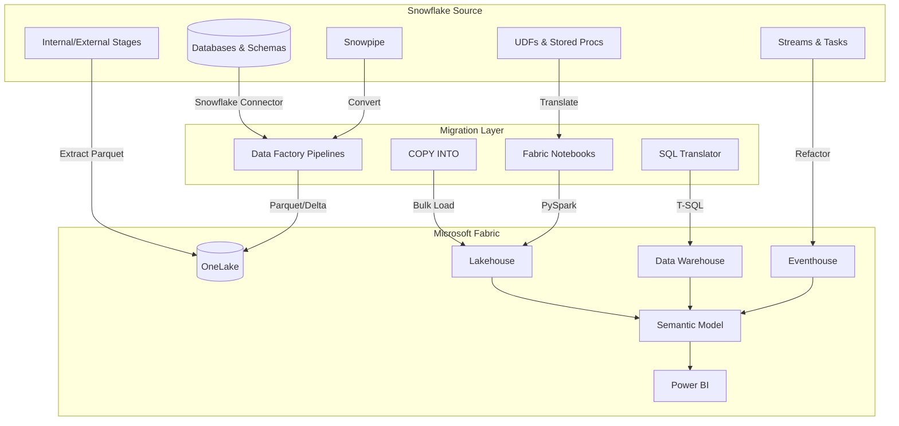
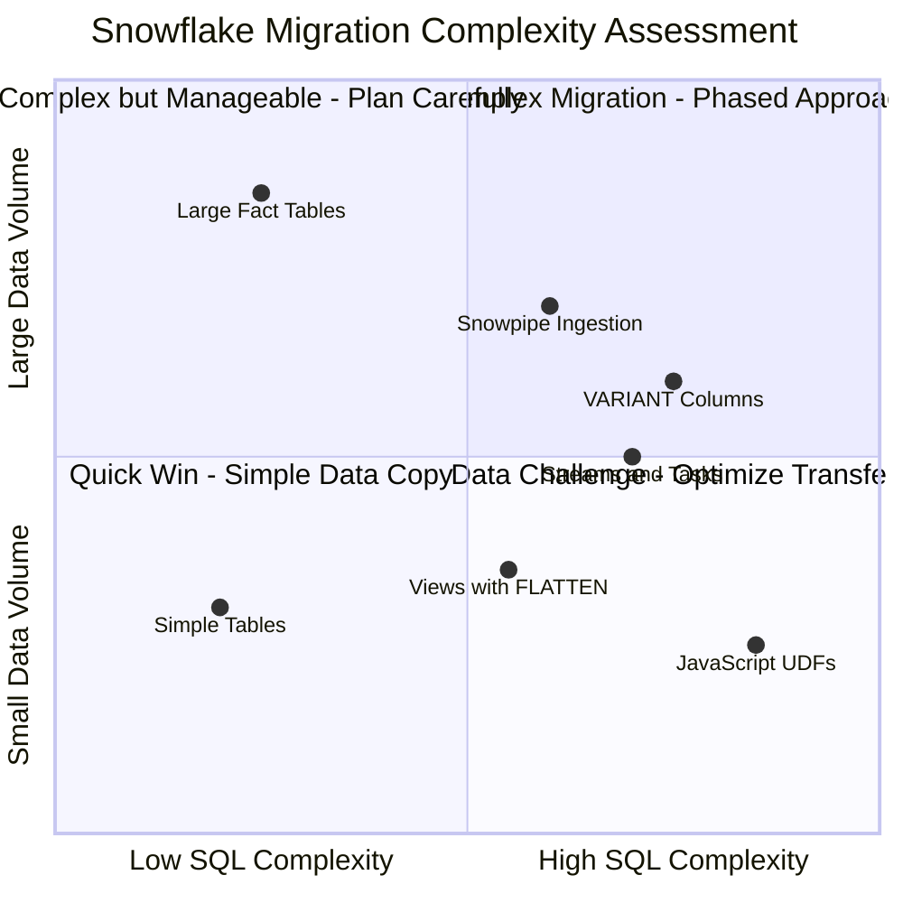
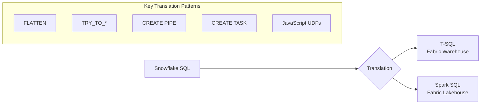
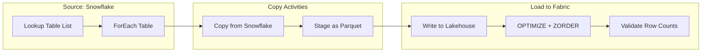
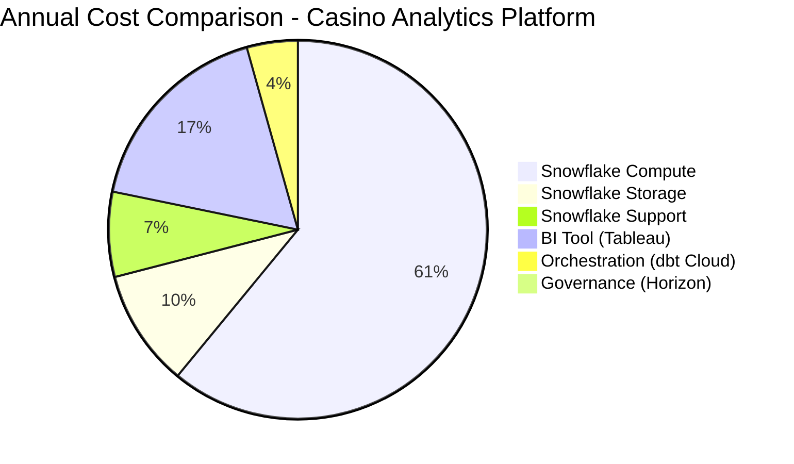

[Home](../../index.md) > [Tutorials](../) > Snowflake to Fabric Migration

# ❄️ Tutorial 24: Snowflake to Microsoft Fabric Migration

> **Last Updated**: 2026-04-15 | **Version**: 2.0
> **Status**: ✅ Final | **Maintainer**: Documentation Team

<div align="center" markdown>


</div>

---

!!! info "Third-party references — publicly sourced, good-faith comparison"
    This page references non-Microsoft products and services. That information is drawn from each vendor's **publicly available documentation** and is offered for honest, good-faith comparison only. This is a personal project written from a Microsoft Fabric and Azure perspective; it does **not** claim expertise in, or authority over, any third-party product, and nothing here is an official statement by, or endorsed by, those vendors. Capabilities, pricing, and features change often — always verify against the vendor's current official documentation. Where a third-party offering is the stronger choice, we say so plainly.

## ❄️ Tutorial 24: Snowflake to Microsoft Fabric Migration

| | |
|---|---|
| **Difficulty** | ⭐⭐⭐ Advanced |
| **Time** | ⏱️ 150-210 minutes |
| **Focus** | Cloud Data Warehouse Migration & Modernization |

---

### 📊 Progress Tracker

```
┌────────┬────────┬────────┬────────┬────────┬────────┬────────┬────────┬────────┬────────┬────────┬────────┬────────┬────────┐
│   00   │   01   │   02   │   03   │   04   │   05   │   06   │   07   │   08   │   09   │   10   │   11   │   12   │   13   │
│ SETUP  │ BRONZE │ SILVER │  GOLD  │  RT    │  PBI   │ PIPES  │  GOV   │ MIRROR │  AI/ML │TERADATA│  SAS   │ CI/CD  │MIGRATE │
├────────┼────────┼────────┼────────┼────────┼────────┼────────┼────────┼────────┼────────┼────────┼────────┼────────┼────────┤
│   ✅   │   ✅   │   ✅   │   ✅   │   ✅   │   ✅   │   ✅   │   ✅   │   ✅   │   ✅   │   ✅   │   ✅   │   ✅   │   ✅   │
└────────┴────────┴────────┴────────┴────────┴────────┴────────┴────────┴────────┴────────┴────────┴────────┴────────┴────────┘

┌────────┬────────┬────────┬────────┬────────┬────────┬────────┬────────┬────────┬────────┬────────┬────────┬────────┐
│   14   │   15   │   16   │   17   │   18   │   19   │   20   │   21   │   22   │   23   │   24   │   25   │   26   │
│SECURITY│  COST  │  PERF  │MONITOR │ SHARE  │COPILOT │WKSPACE │  GEO   │NETWORK │  SHIR  │SNOWFLK │ DB2    │STREAM  │
├────────┼────────┼────────┼────────┼────────┼────────┼────────┼────────┼────────┼────────┼────────┼────────┼────────┤
│   ✅   │   ✅   │   ✅   │   ✅   │   ✅   │   ✅   │   ✅   │   ✅   │   ✅   │   ✅   │  🔵   │   ⬚   │   ⬚   │
└────────┴────────┴────────┴────────┴────────┴────────┴────────┴────────┴────────┴────────┴────────┴────────┴────────┘
                                                                                              ▲
                                                                                         YOU ARE HERE
```

| Navigation | |
|---|---|
| ⬅️ **Previous** | [23-SHIR & Data Gateways](../23-shir-data-gateways/README.md) |
| ➡️ **Next** | [25-IBM DB2 Source](../25-ibm-db2-source/README.md) |

---

## 📖 Overview

This tutorial provides a comprehensive guide for migrating from **Snowflake** to **Microsoft Fabric**. You will learn how to assess your Snowflake environment, translate SQL and objects, move data efficiently, and validate the results -- all using casino/gaming industry examples.

### Why Some Teams Move from Snowflake to Microsoft Fabric

Snowflake is a mature, capable cloud-native data warehouse with deep strengths in elastic compute, multi-cloud reach, and data sharing — for many teams it remains an excellent fit. Some organizations nonetheless choose to consolidate analytics onto Microsoft Fabric, typically for its **unified analytics platform** approach. Based on Snowflake's publicly available documentation (as of this doc's date) and Microsoft's, common considerations include:

- **Unified Platform** -- Fabric combines data engineering, data warehousing, real-time analytics, data science, and Power BI into a single SaaS experience. With Snowflake, BI, orchestration, and ML are typically assembled from additional tools or partner services.
- **Cost Model** -- Snowflake uses credit-based pricing for compute with separately metered storage; Fabric uses a capacity-based model (CU) that bundles compute, storage, and all workloads into a single SKU. Which is more cost-effective depends heavily on your usage pattern — neither is universally cheaper.
- **OneLake & Open Formats** -- All data in Fabric lives in OneLake using Delta Lake (Parquet). (Snowflake also supports open formats such as Iceberg per its public docs; evaluate based on your storage and interoperability needs.)
- **Microsoft 365 Integration** -- Native integration with Teams, SharePoint, Excel, and Power BI can make analytics reach Microsoft 365 users with less additional tooling.
- **Governance** -- Microsoft Purview provides unified governance, lineage, and sensitivity labels across the estate.

### Cost Comparison at a Glance

| Dimension | Snowflake | Microsoft Fabric |
|-----------|-----------|-----------------|
| **Pricing Model** | Credits (compute) + Storage (per TB) | Capacity Units (CU) -- all-inclusive |
| **Idle Cost** | $0 if warehouse suspended | Capacity always available (pause optional) |
| **BI Tool** | Separate (Tableau, Sigma, etc.) | Power BI included |
| **Orchestration** | Separate (dbt, Airflow, etc.) | Data Factory included |
| **Real-Time** | Snowpipe + Streams (credit cost) | Eventstreams + Eventhouse included |
| **Data Science** | Snowpark (credit cost) | Fabric Notebooks included |
| **Governance** | Snowflake Horizon (Enterprise+) | Microsoft Purview included |

> 💡 **Tip:** The table above maps roughly equivalent capabilities per each vendor's public documentation; it is not a like-for-like price quote. Cost outcomes vary widely with concurrency, idle time, data volume, and existing Microsoft licensing. As one illustrative scenario, a casino running a 2XL Snowflake warehouse 12 hours/day might incur on the order of ~$140K/year in compute credits, while an F64 Fabric capacity (which also covers BI, real-time, and governance) lists around ~$36K/year — but always model your own workload before drawing conclusions.

---

## 🎯 Learning Objectives

By the end of this tutorial, you will be able to:

- [ ] Assess a Snowflake environment for migration readiness
- [ ] Map Snowflake data types to Fabric T-SQL and Spark equivalents
- [ ] Configure Snowflake connectivity in Fabric Data Factory
- [ ] Translate Snowflake SQL to Fabric T-SQL and Spark SQL
- [ ] Migrate data using Data Factory Copy Activity and notebooks
- [ ] Convert Snowpipe and Streams to Fabric-native equivalents
- [ ] Migrate JavaScript and SQL UDFs to PySpark UDFs
- [ ] Compare Snowflake credit costs to Fabric CU pricing
- [ ] Validate migrated data for accuracy and completeness

---

## 📋 Prerequisites

Before starting this tutorial, ensure you have:

- [ ] Completed [Tutorial 00: Environment Setup](../00-environment-setup/README.md)
- [ ] Completed [Tutorials 01-03: Medallion Architecture](../01-bronze-layer/README.md)
- [ ] Completed [Tutorial 23: SHIR & Data Gateways](../23-shir-data-gateways/README.md) (for hybrid connectivity)
- [ ] Snowflake account with ACCOUNTADMIN or SYSADMIN role access
- [ ] Snowflake user with SELECT privileges on the databases in migration scope
- [ ] Fabric workspace with F64+ capacity (recommended for production migrations)
- [ ] Network connectivity between Fabric and Snowflake (public or Private Link)
- [ ] Snowflake JDBC driver (for custom notebook-based extraction)
- [ ] Key pair authentication configured in Snowflake (recommended over password auth)

> 💡 **Tip:** For testing without a live Snowflake instance, you can use the sample DDL scripts and synthetic casino data included in this tutorial to practice SQL translation patterns.

---

## 🏗️ Migration Architecture Overview



### Migration Approaches

| Approach | Description | Best For | Casino Example |
|----------|-------------|----------|----------------|
| **Lift and Shift** | Direct data copy with minimal SQL changes | Quick POC, testing environments | Copy player tables as-is to validate Fabric |
| **Refactor** | Modernize SQL, leverage Fabric-native features | Long-term value, optimization | Convert Snowpipe to Eventstreams for slot telemetry |
| **Replatform** | Rebuild using Fabric-native patterns from scratch | Maximum Fabric benefits | Redesign loyalty program analytics on Direct Lake |
| **Hybrid** | Keep some workloads in Snowflake, mirror to Fabric | Phased migration, risk mitigation | Keep compliance reporting in Snowflake during transition |

---

## 🛠️ Step 1: Assess Your Snowflake Environment

### 1.1 Inventory Assessment

Run these queries in your Snowflake worksheet to inventory the objects to migrate:

```sql
-- Snowflake: List all databases and their sizes
SELECT
    TABLE_CATALOG AS database_name,
    TABLE_SCHEMA AS schema_name,
    COUNT(*) AS table_count,
    SUM(BYTES) / POWER(1024, 3) AS size_gb,
    SUM(ROW_COUNT) AS total_rows
FROM INFORMATION_SCHEMA.TABLES
WHERE TABLE_SCHEMA NOT IN ('INFORMATION_SCHEMA')
  AND TABLE_TYPE = 'BASE TABLE'
GROUP BY TABLE_CATALOG, TABLE_SCHEMA
ORDER BY size_gb DESC;

-- List all tables with row counts and storage
SELECT
    TABLE_CATALOG AS database_name,
    TABLE_SCHEMA AS schema_name,
    TABLE_NAME,
    TABLE_TYPE,
    ROW_COUNT,
    BYTES / POWER(1024, 2) AS size_mb,
    CREATED,
    LAST_ALTERED,
    CLUSTERING_KEY
FROM INFORMATION_SCHEMA.TABLES
WHERE TABLE_SCHEMA NOT IN ('INFORMATION_SCHEMA')
ORDER BY size_mb DESC;

-- List all views
SELECT
    TABLE_CATALOG AS database_name,
    TABLE_SCHEMA AS schema_name,
    TABLE_NAME AS view_name,
    VIEW_DEFINITION
FROM INFORMATION_SCHEMA.VIEWS
WHERE TABLE_SCHEMA NOT IN ('INFORMATION_SCHEMA')
ORDER BY TABLE_CATALOG, TABLE_SCHEMA, TABLE_NAME;
```

### 1.2 Compute Credit Usage Analysis

Understanding current Snowflake spend helps justify migration and size the Fabric capacity:

```sql
-- Credit usage by warehouse over the last 30 days
SELECT
    WAREHOUSE_NAME,
    SUM(CREDITS_USED) AS total_credits,
    AVG(CREDITS_USED) AS avg_daily_credits,
    COUNT(DISTINCT DATE_TRUNC('DAY', START_TIME)) AS active_days,
    SUM(CREDITS_USED) * 3.00 AS estimated_cost_usd  -- Standard credit price
FROM SNOWFLAKE.ACCOUNT_USAGE.WAREHOUSE_METERING_HISTORY
WHERE START_TIME >= DATEADD('DAY', -30, CURRENT_TIMESTAMP())
GROUP BY WAREHOUSE_NAME
ORDER BY total_credits DESC;

-- Storage usage trend
SELECT
    USAGE_DATE,
    STORAGE_BYTES / POWER(1024, 4) AS storage_tb,
    STAGE_BYTES / POWER(1024, 4) AS stage_tb,
    FAILSAFE_BYTES / POWER(1024, 4) AS failsafe_tb,
    (STORAGE_BYTES + STAGE_BYTES + FAILSAFE_BYTES) / POWER(1024, 4) AS total_tb
FROM SNOWFLAKE.ACCOUNT_USAGE.STORAGE_USAGE
WHERE USAGE_DATE >= DATEADD('DAY', -30, CURRENT_DATE())
ORDER BY USAGE_DATE DESC;
```

### 1.3 Complexity Scoring

Identify Snowflake-specific features that require special migration handling:

```sql
-- Count Snowflake-specific objects (Stages, Pipes, Tasks, Streams, UDFs)
SELECT 'Stages' AS object_type, COUNT(*) AS object_count
FROM INFORMATION_SCHEMA.STAGES
WHERE STAGE_SCHEMA NOT IN ('INFORMATION_SCHEMA')
UNION ALL
SELECT 'Pipes', COUNT(*)
FROM INFORMATION_SCHEMA.PIPES
WHERE PIPE_SCHEMA NOT IN ('INFORMATION_SCHEMA')
UNION ALL
SELECT 'Tasks', COUNT(*)
FROM INFORMATION_SCHEMA.TASKS  -- Requires ACCOUNTADMIN
UNION ALL
SELECT 'Streams', COUNT(*)
FROM INFORMATION_SCHEMA.STREAMS  -- Requires ACCOUNTADMIN
UNION ALL
SELECT 'User Functions', COUNT(*)
FROM INFORMATION_SCHEMA.FUNCTIONS
WHERE FUNCTION_SCHEMA NOT IN ('INFORMATION_SCHEMA')
UNION ALL
SELECT 'Stored Procedures', COUNT(*)
FROM INFORMATION_SCHEMA.PROCEDURES
WHERE PROCEDURE_SCHEMA NOT IN ('INFORMATION_SCHEMA')
ORDER BY object_count DESC;
```

### 1.4 Complexity Scoring Matrix



| Complexity Factor | What to Look For | Migration Impact |
|-------------------|------------------|-----------------|
| **VARIANT/OBJECT/ARRAY columns** | Semi-structured data types | Requires JSON mapping strategy |
| **Snowpipe** | Continuous ingestion pipes | Convert to Data Factory triggers or Eventstreams |
| **Streams** | Change data capture streams | Map to Fabric CDC or Eventstreams |
| **Tasks** | Scheduled SQL tasks | Convert to scheduled notebooks or pipelines |
| **JavaScript UDFs** | Custom JS functions | Rewrite as PySpark UDFs |
| **External Functions** | API-backed functions | Rebuild as Fabric API calls |
| **Clustering Keys** | Table clustering definitions | Map to Delta Lake Z-ORDER |
| **Time Travel** | Data versioning queries | Leverage Delta Lake versioning |
| **Data Sharing** | Snowflake shares | Convert to Fabric data sharing or OneLake shortcuts |
| **Materialized Views** | Auto-refreshed views | Convert to Gold layer tables with refresh pipeline |

---

## 🛠️ Step 2: Schema Mapping

### 2.1 Data Type Mapping

Snowflake's type system is broad and includes semi-structured types. The following table maps every Snowflake type to its Fabric equivalents.

| Snowflake Type | Fabric T-SQL (Warehouse) | Fabric Spark SQL (Lakehouse) | Notes |
|----------------|--------------------------|------------------------------|-------|
| `NUMBER(p,s)` | `DECIMAL(p,s)` | `DecimalType(p,s)` | Direct mapping |
| `INT` / `INTEGER` | `INT` | `IntegerType` | Direct mapping |
| `BIGINT` | `BIGINT` | `LongType` | Direct mapping |
| `FLOAT` / `DOUBLE` | `FLOAT` | `DoubleType` | Direct mapping |
| `VARCHAR(n)` | `VARCHAR(n)` | `StringType` | Max 8000 in T-SQL |
| `STRING` / `TEXT` | `VARCHAR(MAX)` | `StringType` | Unbounded text |
| `BOOLEAN` | `BIT` | `BooleanType` | `TRUE`/`FALSE` to `1`/`0` |
| `DATE` | `DATE` | `DateType` | Direct mapping |
| `TIMESTAMP_NTZ` | `DATETIME2` | `TimestampType` | No timezone |
| `TIMESTAMP_LTZ` | `DATETIMEOFFSET` | `TimestampType` | Local timezone |
| `TIMESTAMP_TZ` | `DATETIMEOFFSET` | `TimestampType` | With timezone |
| `VARIANT` | `VARCHAR(MAX)` (JSON) | `StringType` (JSON) | Store as JSON string |
| `OBJECT` | `VARCHAR(MAX)` (JSON) | `StringType` (JSON) | Store as JSON string |
| `ARRAY` | `VARCHAR(MAX)` (JSON) | `ArrayType` or `StringType` | Store as JSON array string |
| `GEOGRAPHY` | `GEOMETRY` | `StringType` (WKT/GeoJSON) | Requires spatial functions |
| `GEOMETRY` | `GEOMETRY` | `StringType` (WKT) | Requires spatial functions |
| `BINARY` | `VARBINARY(MAX)` | `BinaryType` | Direct mapping |
| `TIME` | `TIME` | `StringType` (HH:MM:SS) | No native Spark TIME type |

### 2.2 VARIANT Column Migration Strategy

Snowflake's `VARIANT` type is heavily used for semi-structured data. In the casino domain, player event payloads and device telemetry frequently use VARIANT:

```sql
-- Snowflake: Table with VARIANT column
CREATE TABLE casino_raw.slot_events (
    event_id        VARCHAR(36),
    machine_id      VARCHAR(20),
    event_timestamp TIMESTAMP_NTZ,
    event_payload   VARIANT,       -- JSON event data
    player_tags     ARRAY,         -- Array of loyalty tags
    machine_config  OBJECT         -- Device configuration
);
```

**Fabric Lakehouse Equivalent:**
```python
# PySpark: Read VARIANT data as JSON strings
from pyspark.sql.types import StructType, StructField, StringType, TimestampType

schema = StructType([
    StructField("event_id", StringType(), False),
    StructField("machine_id", StringType(), False),
    StructField("event_timestamp", TimestampType(), False),
    StructField("event_payload", StringType(), True),    # JSON string
    StructField("player_tags", StringType(), True),      # JSON array string
    StructField("machine_config", StringType(), True),   # JSON object string
])

# Query JSON fields using Spark SQL after loading
df = spark.table("bronze.slot_events")
df_parsed = df.selectExpr(
    "event_id",
    "machine_id",
    "event_timestamp",
    "get_json_object(event_payload, '$.spin_result') AS spin_result",
    "get_json_object(event_payload, '$.bet_amount') AS bet_amount",
    "get_json_object(event_payload, '$.payout_amount') AS payout_amount"
)
```

### 2.3 Clustering Keys to Z-ORDER

Snowflake clustering keys optimize micro-partition pruning. In Fabric, the equivalent is Delta Lake Z-ORDER:

| Snowflake Clustering | Fabric Delta Lake Equivalent |
|----------------------|------------------------------|
| `CLUSTER BY (col1, col2)` | `OPTIMIZE table ZORDER BY (col1, col2)` |
| Automatic re-clustering | Scheduled `OPTIMIZE` in notebook or pipeline |
| `SYSTEM$CLUSTERING_INFORMATION(...)` | `DESCRIBE DETAIL table` for file statistics |

```sql
-- Snowflake: Clustered table
CREATE TABLE casino_dw.slot_transactions (
    transaction_id   VARCHAR(36),
    machine_id       VARCHAR(20),
    player_id        VARCHAR(36),
    transaction_date DATE,
    coin_in          DECIMAL(18,2),
    coin_out         DECIMAL(18,2)
) CLUSTER BY (transaction_date, machine_id);
```

```sql
-- Fabric Spark SQL: Z-ORDER equivalent
OPTIMIZE casino.slot_transactions
ZORDER BY (transaction_date, machine_id);
```

### 2.4 Time Travel to Delta Lake Versioning

Snowflake Time Travel allows querying historical data. Delta Lake provides equivalent versioning:

| Snowflake Time Travel | Delta Lake Versioning |
|----------------------|----------------------|
| `SELECT ... AT (TIMESTAMP => ...)` | `SELECT ... TIMESTAMP AS OF ...` |
| `SELECT ... BEFORE (STATEMENT => ...)` | `SELECT ... VERSION AS OF n` |
| `UNDROP TABLE` | `RESTORE TABLE ... TO VERSION AS OF n` |
| Retention: 0-90 days (edition dependent) | Retention: configurable via `delta.logRetentionDuration` |

```sql
-- Snowflake: Query historical data
SELECT * FROM casino_dw.player_profiles
AT (TIMESTAMP => '2024-06-15 10:00:00'::TIMESTAMP);

-- Fabric Spark SQL: Delta Lake equivalent
SELECT * FROM casino.player_profiles
TIMESTAMP AS OF '2024-06-15T10:00:00';

-- Or by version number
SELECT * FROM casino.player_profiles
VERSION AS OF 42;
```

---

## 🛠️ Step 3: Configure Snowflake Connectivity in Fabric

### 3.1 Snowflake Connector in Data Factory


*Source: [Create your first pipeline in Data Factory](https://learn.microsoft.com/en-us/fabric/data-factory/create-first-pipeline-with-sample-data)*

Fabric Data Factory includes a native **Snowflake connector** for Copy Activity. To configure:

1. Open your Fabric workspace
2. Navigate to **Data Factory** > **New Pipeline**
3. Add a **Copy Activity**
4. Under **Source**, select **Snowflake** as the connection type

### 3.2 Connection Configuration

| Setting | Description | Example |
|---------|-------------|---------|
| **Name** | Descriptive connection name | `ls_snowflake_casino_dw` |
| **Account** | Snowflake account identifier | `xy12345.us-east-1` |
| **Warehouse** | Compute warehouse name | `CASINO_ETL_WH` |
| **Database** | Default database | `CASINO_DW` |
| **Schema** | Default schema | `PUBLIC` |
| **Authentication** | Auth method | `Key Pair` (recommended) or `Basic` |
| **Username** | Service account | `FABRIC_MIGRATION_SVC` |

### 3.3 JDBC/ODBC Connection Strings

For notebook-based extraction, use JDBC:

```
jdbc:snowflake://<account>.snowflakecomputing.com/?db=CASINO_DW&schema=PUBLIC&warehouse=CASINO_ETL_WH&role=MIGRATION_ROLE
```

ODBC connection string (for Power BI or linked services):

```
Driver={SnowflakeDSIIDriver};Server=<account>.snowflakecomputing.com;Database=CASINO_DW;Schema=PUBLIC;Warehouse=CASINO_ETL_WH;Role=MIGRATION_ROLE;Authenticator=snowflake;
```

### 3.4 Key Pair Authentication Setup

Key pair authentication is more secure than password-based auth and is recommended for automated pipelines:

```sql
-- Snowflake: Create key pair for service account
-- Step 1: Generate RSA key pair (run on local machine)
-- openssl genrsa 2048 | openssl pkcs8 -topk8 -inform PEM -out rsa_key.p8 -nocrypt
-- openssl rsa -in rsa_key.p8 -pubout -out rsa_key.pub

-- Step 2: Assign public key to Snowflake user
ALTER USER FABRIC_MIGRATION_SVC SET RSA_PUBLIC_KEY='MIIBIjANBgkq...';

-- Step 3: Grant necessary privileges
GRANT USAGE ON DATABASE CASINO_DW TO ROLE MIGRATION_ROLE;
GRANT USAGE ON ALL SCHEMAS IN DATABASE CASINO_DW TO ROLE MIGRATION_ROLE;
GRANT SELECT ON ALL TABLES IN DATABASE CASINO_DW TO ROLE MIGRATION_ROLE;
GRANT SELECT ON ALL VIEWS IN DATABASE CASINO_DW TO ROLE MIGRATION_ROLE;
GRANT ROLE MIGRATION_ROLE TO USER FABRIC_MIGRATION_SVC;
```

### 3.5 Test Connection Notebook

```python
# Fabric Notebook: Test Snowflake Connectivity
from pyspark.sql import SparkSession
from notebookutils import mssparkutils

# Retrieve credentials from Azure Key Vault
sf_account = "xy12345.us-east-1"
sf_user = mssparkutils.credentials.getSecret("casino-keyvault", "snowflake-user")
sf_password = mssparkutils.credentials.getSecret("casino-keyvault", "snowflake-password")

# Test JDBC connection
jdbc_url = f"jdbc:snowflake://{sf_account}.snowflakecomputing.com/"

try:
    df_test = spark.read \
        .format("jdbc") \
        .option("url", jdbc_url) \
        .option("user", sf_user) \
        .option("password", sf_password) \
        .option("db", "CASINO_DW") \
        .option("schema", "PUBLIC") \
        .option("warehouse", "CASINO_ETL_WH") \
        .option("query", "SELECT CURRENT_TIMESTAMP() AS connected_at, CURRENT_DATABASE() AS db, CURRENT_WAREHOUSE() AS wh") \
        .option("driver", "net.snowflake.client.jdbc.SnowflakeDriver") \
        .load()

    df_test.show()
    print("Snowflake connection successful!")
except Exception as e:
    print(f"Connection failed: {e}")
```

> ⚠️ **Warning:** Store Snowflake credentials in Azure Key Vault, never in notebook code or pipeline parameters. Use `mssparkutils.credentials.getSecret()` for all secret retrieval.

---

## 🛠️ Step 4: SQL Translation Patterns

### 4.1 Key SQL Differences

Snowflake SQL is ANSI-compliant with Snowflake-specific extensions. Fabric supports T-SQL (for Warehouse) and Spark SQL (for Lakehouse).



### 4.2 FLATTEN to LATERAL VIEW EXPLODE

Snowflake's `FLATTEN` unpacks VARIANT, OBJECT, and ARRAY columns. Fabric uses `LATERAL VIEW EXPLODE` in Spark SQL or `OPENJSON` in T-SQL.

**Snowflake (Original):**
```sql
-- Flatten player loyalty tags from VARIANT column
SELECT
    p.player_id,
    p.player_name,
    f.value::STRING AS loyalty_tag
FROM casino_dw.player_profiles p,
    LATERAL FLATTEN(input => p.loyalty_tags) f
WHERE f.value::STRING LIKE '%VIP%';
```

**Fabric T-SQL (Converted):**
```sql
-- T-SQL: Use OPENJSON to unnest JSON arrays
SELECT
    p.player_id,
    p.player_name,
    t.value AS loyalty_tag
FROM casino.player_profiles p
CROSS APPLY OPENJSON(p.loyalty_tags) t
WHERE t.value LIKE '%VIP%';
```

**Fabric Spark SQL (Converted):**
```python
from pyspark.sql.functions import explode, from_json, col
from pyspark.sql.types import ArrayType, StringType

df = spark.table("casino.player_profiles")

# Parse JSON array string and explode
df_tags = df.withColumn(
    "loyalty_tags_parsed",
    from_json(col("loyalty_tags"), ArrayType(StringType()))
).select(
    "player_id",
    "player_name",
    explode("loyalty_tags_parsed").alias("loyalty_tag")
).filter(col("loyalty_tag").like("%VIP%"))
```

### 4.3 TRY_TO_* Functions to TRY_CAST / TRY_PARSE

Snowflake's safe casting functions return NULL on failure instead of raising an error:

| Snowflake Function | Fabric T-SQL | Fabric Spark SQL |
|--------------------|--------------|------------------|
| `TRY_TO_NUMBER(x)` | `TRY_CAST(x AS DECIMAL)` | `try_cast(x AS DECIMAL)` |
| `TRY_TO_DECIMAL(x, p, s)` | `TRY_CAST(x AS DECIMAL(p,s))` | `try_cast(x AS DECIMAL(p,s))` |
| `TRY_TO_DATE(x, fmt)` | `TRY_CONVERT(DATE, x, style)` | `to_date(x, fmt)` (returns NULL on fail) |
| `TRY_TO_TIMESTAMP(x, fmt)` | `TRY_CONVERT(DATETIME2, x, style)` | `to_timestamp(x, fmt)` |
| `TRY_TO_BOOLEAN(x)` | `TRY_CAST(x AS BIT)` | `try_cast(x AS BOOLEAN)` |

**Snowflake (Original):**
```sql
-- Safe cast player transaction amounts
SELECT
    transaction_id,
    player_id,
    TRY_TO_DECIMAL(raw_amount, 18, 2) AS transaction_amount,
    TRY_TO_TIMESTAMP(raw_timestamp, 'YYYY-MM-DD HH24:MI:SS') AS event_time
FROM casino_staging.raw_transactions
WHERE TRY_TO_DECIMAL(raw_amount, 18, 2) IS NOT NULL;
```

**Fabric T-SQL (Converted):**
```sql
SELECT
    transaction_id,
    player_id,
    TRY_CAST(raw_amount AS DECIMAL(18, 2)) AS transaction_amount,
    TRY_CONVERT(DATETIME2, raw_timestamp, 120) AS event_time
FROM casino_staging.raw_transactions
WHERE TRY_CAST(raw_amount AS DECIMAL(18, 2)) IS NOT NULL;
```

### 4.4 CREATE OR REPLACE PIPE to Data Factory Pipeline

Snowpipe provides continuous serverless ingestion in Snowflake. In Fabric, this maps to a Data Factory pipeline with a trigger.

**Snowflake (Original):**
```sql
-- Snowpipe: Auto-ingest slot events from S3
CREATE OR REPLACE PIPE casino_dw.slot_events_pipe
    AUTO_INGEST = TRUE
AS
COPY INTO casino_dw.slot_events
FROM @casino_dw.external_stage/slot_events/
FILE_FORMAT = (TYPE = 'JSON');
```

**Fabric Equivalent:** Create a Data Factory pipeline with a storage event trigger (see Step 6 for full architecture).

### 4.5 CREATE TASK to Fabric Scheduled Notebooks

Snowflake Tasks are scheduled SQL jobs. In Fabric, use scheduled notebooks or pipeline triggers.

**Snowflake (Original):**
```sql
-- Snowflake Task: Daily loyalty tier refresh
CREATE OR REPLACE TASK casino_dw.refresh_loyalty_tiers
    WAREHOUSE = CASINO_ETL_WH
    SCHEDULE = 'USING CRON 0 6 * * * America/Los_Angeles'
AS
MERGE INTO casino_dw.player_loyalty_tiers t
USING (
    SELECT
        player_id,
        SUM(total_spend) AS lifetime_spend,
        CASE
            WHEN SUM(total_spend) >= 100000 THEN 'PLATINUM'
            WHEN SUM(total_spend) >= 50000 THEN 'GOLD'
            WHEN SUM(total_spend) >= 10000 THEN 'SILVER'
            ELSE 'BRONZE'
        END AS computed_tier
    FROM casino_dw.player_transactions
    GROUP BY player_id
) s ON t.player_id = s.player_id
WHEN MATCHED AND t.tier != s.computed_tier THEN
    UPDATE SET tier = s.computed_tier, updated_at = CURRENT_TIMESTAMP()
WHEN NOT MATCHED THEN
    INSERT (player_id, tier, updated_at)
    VALUES (s.player_id, s.computed_tier, CURRENT_TIMESTAMP());
```

**Fabric Notebook Equivalent:**
```python
# Fabric Notebook: refresh_loyalty_tiers (scheduled via pipeline)
# Schedule: Daily at 6:00 AM PT via Data Factory pipeline trigger

from pyspark.sql.functions import col, sum as spark_sum, when, current_timestamp
from delta.tables import DeltaTable

# Read transaction history
df_transactions = spark.table("silver.player_transactions")

# Compute loyalty tiers
df_tiers = df_transactions.groupBy("player_id").agg(
    spark_sum("total_spend").alias("lifetime_spend")
).withColumn("computed_tier",
    when(col("lifetime_spend") >= 100000, "PLATINUM")
    .when(col("lifetime_spend") >= 50000, "GOLD")
    .when(col("lifetime_spend") >= 10000, "SILVER")
    .otherwise("BRONZE")
).withColumn("updated_at", current_timestamp())

# MERGE into target (Delta Lake MERGE)
target = DeltaTable.forName(spark, "gold.player_loyalty_tiers")

target.alias("t").merge(
    df_tiers.alias("s"),
    "t.player_id = s.player_id"
).whenMatchedUpdate(
    condition="t.tier != s.computed_tier",
    set={"tier": "s.computed_tier", "updated_at": "s.updated_at"}
).whenNotMatchedInsert(
    values={
        "player_id": "s.player_id",
        "tier": "s.computed_tier",
        "updated_at": "s.updated_at"
    }
).execute()

print("Loyalty tiers refreshed successfully")
```

### 4.6 Stored Procedures to Fabric Notebooks

**Snowflake JavaScript Stored Procedure (Original):**
```sql
CREATE OR REPLACE PROCEDURE casino_dw.calculate_ctr_report(report_date DATE)
RETURNS STRING
LANGUAGE JAVASCRIPT
EXECUTE AS CALLER
AS
$$
    var sql_cmd = `
        INSERT INTO casino_dw.ctr_reports
        SELECT
            transaction_date,
            player_id,
            SUM(amount) AS total_amount,
            CASE WHEN SUM(amount) >= 10000 THEN 'CTR_REQUIRED' ELSE 'BELOW_THRESHOLD' END
        FROM casino_dw.cage_transactions
        WHERE transaction_date = '${REPORT_DATE}'
        GROUP BY transaction_date, player_id
        HAVING SUM(amount) >= 10000
    `;
    snowflake.execute({sqlText: sql_cmd});
    return 'CTR report generated for ' + REPORT_DATE;
$$;
```

**Fabric Notebook Equivalent:**
```python
# Fabric Notebook: calculate_ctr_report
# Parameters cell (for pipeline integration)
report_date = "2024-06-15"  # Overridden by pipeline parameter

from pyspark.sql.functions import col, sum as spark_sum, when, lit

# CTR threshold: $10,000 per NIGC MICS compliance
CTR_THRESHOLD = 10000

df_cage = spark.table("silver.cage_transactions") \
    .filter(col("transaction_date") == report_date)

df_ctr = df_cage.groupBy("transaction_date", "player_id").agg(
    spark_sum("amount").alias("total_amount")
).filter(col("total_amount") >= CTR_THRESHOLD) \
 .withColumn("ctr_status", lit("CTR_REQUIRED"))

# Append to CTR reports table
df_ctr.write.mode("append").saveAsTable("gold.ctr_reports")

print(f"CTR report generated for {report_date}: {df_ctr.count()} records")
```

### 4.7 Streams and Tasks to Eventstreams + Scheduled Notebooks

| Snowflake Pattern | Fabric Equivalent | Use Case |
|-------------------|-------------------|----------|
| `CREATE STREAM ... ON TABLE ...` | Fabric Eventstreams or Delta Lake CDF | CDC on player profiles |
| `CREATE TASK ... AS MERGE ...` | Scheduled notebook with Delta MERGE | Incremental silver refresh |
| Stream + Task chain | Pipeline with notebook activities | End-to-end CDC pipeline |

**Fabric Delta Lake Change Data Feed (CDF) -- equivalent to Snowflake Streams:**
```python
# Enable Change Data Feed on the source table
spark.sql("""
    ALTER TABLE bronze.player_profiles
    SET TBLPROPERTIES (delta.enableChangeDataFeed = true)
""")

# Read changes since last checkpoint (like Snowflake STREAM consumption)
df_changes = spark.read.format("delta") \
    .option("readChangeFeed", "true") \
    .option("startingVersion", 5) \
    .table("bronze.player_profiles")

# Filter to inserts and updates only
df_upserts = df_changes.filter(
    col("_change_type").isin("insert", "update_postimage")
)

# MERGE into silver (like Snowflake TASK consuming a STREAM)
from delta.tables import DeltaTable
target = DeltaTable.forName(spark, "silver.player_profiles")
target.alias("t").merge(
    df_upserts.alias("s"),
    "t.player_id = s.player_id"
).whenMatchedUpdateAll() \
 .whenNotMatchedInsertAll() \
 .execute()
```

### 4.8 Common Function Mappings

| Snowflake Function | Fabric T-SQL | Fabric Spark SQL |
|--------------------|--------------|------------------|
| `NVL(a, b)` | `ISNULL(a, b)` | `coalesce(a, b)` |
| `NVL2(a, b, c)` | `IIF(a IS NOT NULL, b, c)` | `when(col('a').isNotNull(), b).otherwise(c)` |
| `IFF(cond, t, f)` | `IIF(cond, t, f)` | `when(cond, t).otherwise(f)` |
| `IFNULL(a, b)` | `ISNULL(a, b)` | `coalesce(a, b)` |
| `ZEROIFNULL(x)` | `ISNULL(x, 0)` | `coalesce(x, lit(0))` |
| `NULLIFZERO(x)` | `NULLIF(x, 0)` | `when(col('x') == 0, None).otherwise(col('x'))` |
| `DATEADD(part, n, d)` | `DATEADD(part, n, d)` | `date_add(d, n)` (days) / `add_months(d, n)` |
| `DATEDIFF(part, d1, d2)` | `DATEDIFF(part, d1, d2)` | `datediff(d2, d1)` (days only) |
| `DATE_TRUNC(part, d)` | `DATETRUNC(part, d)` | `date_trunc(part, d)` |
| `TO_VARCHAR(d, fmt)` | `FORMAT(d, fmt)` | `date_format(d, fmt)` |
| `PARSE_JSON(s)` | `JSON_VALUE(s, '$')` | `from_json(s, schema)` |
| `OBJECT_CONSTRUCT(...)` | `JSON_OBJECT(...)` | `struct(...)` then `to_json(...)` |
| `ARRAY_AGG(x)` | `STRING_AGG(x, ',')` (string) | `collect_list(x)` |
| `LISTAGG(x, ',')` | `STRING_AGG(x, ',')` | `concat_ws(',', collect_list(x))` |
| `SPLIT(s, delim)` | `STRING_SPLIT(s, delim)` | `split(s, delim)` |
| `REGEXP_LIKE(s, pattern)` | `s LIKE pattern` / `PATINDEX` | `rlike(s, pattern)` |
| `HASH(*)` | `HASHBYTES('SHA2_256', ...)` | `sha2(concat_ws('|', *cols), 256)` |
| `LATERAL FLATTEN(...)` | `CROSS APPLY OPENJSON(...)` | `explode(...)` / `posexplode(...)` |
| `QUALIFY ROW_NUMBER() ...` | CTE with `ROW_NUMBER()` + `WHERE` | `.withColumn("rn", ...).filter("rn=1")` |
| `GENERATOR(ROWCOUNT => n)` | Recursive CTE or `VALUES` | `spark.range(n)` |
| `SEQ1() / SEQ4() / SEQ8()` | `ROW_NUMBER()` | `monotonically_increasing_id()` |
| `$$` (dollar quoting) | Standard string quoting | Python triple-quotes |

---

## 🛠️ Step 5: Migrate Data

### 5.1 Full Load via Data Factory Copy Activity


*Source: [Copy activity in Data Factory](https://learn.microsoft.com/en-us/fabric/data-factory/copy-data-activity)*



**Pipeline JSON Definition:**
```json
{
    "name": "pl_snowflake_migration_full",
    "properties": {
        "activities": [
            {
                "name": "Get Tables to Migrate",
                "type": "Lookup",
                "typeProperties": {
                    "source": {
                        "type": "SnowflakeV2Source",
                        "query": "SELECT TABLE_SCHEMA, TABLE_NAME FROM INFORMATION_SCHEMA.TABLES WHERE TABLE_SCHEMA = 'CASINO_DW' AND TABLE_TYPE = 'BASE TABLE'"
                    },
                    "dataset": {
                        "referenceName": "ds_snowflake_query",
                        "type": "DatasetReference"
                    },
                    "firstRowOnly": false
                }
            },
            {
                "name": "ForEach Table",
                "type": "ForEach",
                "typeProperties": {
                    "items": {
                        "value": "@activity('Get Tables to Migrate').output.value",
                        "type": "Expression"
                    },
                    "isSequential": false,
                    "batchCount": 4,
                    "activities": [
                        {
                            "name": "Copy Table to Lakehouse",
                            "type": "Copy",
                            "typeProperties": {
                                "source": {
                                    "type": "SnowflakeV2Source",
                                    "query": {
                                        "value": "SELECT * FROM @{item().TABLE_SCHEMA}.@{item().TABLE_NAME}",
                                        "type": "Expression"
                                    },
                                    "exportMethod": "COPY_INTO"
                                },
                                "sink": {
                                    "type": "ParquetSink",
                                    "storeSettings": {
                                        "type": "LakehouseWriteSettings"
                                    }
                                }
                            }
                        }
                    ]
                }
            }
        ]
    }
}
```

> 💡 **Tip:** Set the Snowflake source `exportMethod` to `COPY_INTO` for large tables. This uses Snowflake's internal COPY INTO to stage data as Parquet, then transfers files to Fabric -- significantly faster than row-by-row JDBC reads.

### 5.2 Incremental Load via Snowflake CHANGES Clause

Snowflake supports querying changes on tables with change tracking enabled:

```sql
-- Snowflake: Enable change tracking on source table
ALTER TABLE casino_dw.player_transactions SET CHANGE_TRACKING = TRUE;

-- Query changes since a specific time
SELECT *
FROM casino_dw.player_transactions
    CHANGES (INFORMATION => DEFAULT)
    AT (TIMESTAMP => '2024-06-15 00:00:00'::TIMESTAMP);
```

**Fabric Notebook -- Incremental Migration:**
```python
# Fabric Notebook: Incremental Snowflake Migration
from pyspark.sql.functions import max as spark_max, col
from datetime import datetime

# Configuration
sf_table = "CASINO_DW.PLAYER_TRANSACTIONS"
fabric_table = "bronze.player_transactions"
watermark_column = "transaction_timestamp"

# Get current watermark from Fabric
try:
    current_watermark = spark.table(fabric_table) \
        .select(spark_max(watermark_column)) \
        .collect()[0][0]
    watermark_str = current_watermark.strftime('%Y-%m-%d %H:%M:%S')
except Exception:
    watermark_str = "2020-01-01 00:00:00"

print(f"Current watermark: {watermark_str}")

# Read incremental data from Snowflake using CHANGES clause
query = f"""
    SELECT *
    FROM {sf_table}
        CHANGES (INFORMATION => DEFAULT)
        AT (TIMESTAMP => '{watermark_str}'::TIMESTAMP)
"""

df_incremental = spark.read \
    .format("jdbc") \
    .option("url", jdbc_url) \
    .option("query", query) \
    .option("user", sf_user) \
    .option("password", sf_password) \
    .option("driver", "net.snowflake.client.jdbc.SnowflakeDriver") \
    .load()

# Append to Fabric table
row_count = df_incremental.count()
print(f"Rows to migrate: {row_count:,}")

if row_count > 0:
    df_incremental.write.mode("append").saveAsTable(fabric_table)
    print(f"Successfully migrated {row_count:,} rows")
```

### 5.3 Large Table Migration with Partitioned JDBC Reads

For tables with hundreds of millions of rows, use partitioned reads to parallelize extraction:

```python
# Fabric Notebook: Partitioned Large Table Migration
from pyspark.sql.functions import col, year, month

# Configuration
sf_table = "CASINO_DW.SLOT_TRANSACTIONS_HISTORY"
fabric_table = "bronze.slot_transactions_history"

# Partitioned JDBC read for parallel extraction
df = spark.read \
    .format("jdbc") \
    .option("url", jdbc_url) \
    .option("dbtable", sf_table) \
    .option("user", sf_user) \
    .option("password", sf_password) \
    .option("driver", "net.snowflake.client.jdbc.SnowflakeDriver") \
    .option("partitionColumn", "TRANSACTION_ID") \
    .option("lowerBound", "1") \
    .option("upperBound", "500000000") \
    .option("numPartitions", 48) \
    .option("fetchsize", 100000) \
    .load()

print(f"Extracting with 48 parallel partitions...")

# Write with Fabric partitioning
df.write \
    .mode("overwrite") \
    .partitionBy("transaction_year", "transaction_month") \
    .format("delta") \
    .saveAsTable(fabric_table)

# Optimize the table
spark.sql(f"OPTIMIZE {fabric_table} ZORDER BY (machine_id, player_id)")
print("Migration and optimization complete")
```

### 5.4 COPY INTO from Staged Parquet Files

For maximum throughput, export data from Snowflake to cloud storage, then load into Fabric:

```sql
-- Snowflake: Export table to external stage as Parquet
COPY INTO @casino_dw.azure_stage/migration/slot_transactions/
FROM casino_dw.slot_transactions
FILE_FORMAT = (TYPE = 'PARQUET')
HEADER = TRUE
OVERWRITE = TRUE
MAX_FILE_SIZE = 268435456;  -- 256 MB files
```

```python
# Fabric Notebook: Load staged Parquet files from ADLS
# (Assumes Snowflake external stage points to an Azure storage account)

storage_path = "abfss://migration@casinostorage.dfs.core.windows.net/slot_transactions/"

df = spark.read.parquet(storage_path)

print(f"Loaded {df.count():,} rows from staged Parquet files")

# Write to Lakehouse
df.write.mode("overwrite").format("delta").saveAsTable("bronze.slot_transactions")

# Clean up staging area after validation
# mssparkutils.fs.rm(storage_path, recurse=True)
```

---

## 🛠️ Step 6: Snowpipe Equivalents in Fabric

### 6.1 Architecture Comparison

```mermaid
flowchart TB
    subgraph Snowflake_Pattern["Snowflake: Snowpipe + Streams"]
        S3[S3 / Azure Blob] -->|SQS/Event Grid| SP[Snowpipe]
        SP -->|Auto-ingest| RAW[(Raw Table)]
        RAW -->|Stream captures CDC| STR[Stream]
        STR -->|Task consumes| PROC[Task: MERGE]
        PROC -->|Updates| FINAL[(Target Table)]
    end

    subgraph Fabric_Pattern["Fabric: Eventstreams + Pipelines"]
        BLOB[Azure Blob / ADLS] -->|Event trigger| PIPE[Data Factory Pipeline]
        PIPE -->|Copy Activity| BRONZE[(Bronze Lakehouse)]
        BRONZE -->|Delta CDF| CDF[Change Data Feed]
        CDF -->|Scheduled Notebook| NB_MERGE[Notebook: Delta MERGE]
        NB_MERGE -->|Updates| SILVER[(Silver Lakehouse)]

        EH_ALT[Event Hub / Kafka] -->|Eventstream| ES[Fabric Eventstream]
        ES -->|Real-time ingest| KDB[(Eventhouse / KQL DB)]
    end
```



### 6.2 Snowpipe to Data Factory Trigger-Based Pipeline

| Snowflake Component | Fabric Equivalent | Configuration |
|---------------------|-------------------|---------------|
| Snowpipe (S3 auto-ingest) | Data Factory + Storage Event Trigger | Trigger on blob created event |
| Snowpipe (Azure auto-ingest) | Data Factory + Event Grid Trigger | Trigger on Event Grid event |
| Notification integration | Pipeline activity notifications | Email / Teams via Logic Apps |
| COPY INTO (Snowpipe internal) | Copy Activity (Parquet sink) | Lakehouse destination |

**Data Factory Pipeline with Storage Event Trigger:**
```json
{
    "name": "pl_slot_events_auto_ingest",
    "properties": {
        "activities": [
            {
                "name": "Copy New Slot Events",
                "type": "Copy",
                "typeProperties": {
                    "source": {
                        "type": "ParquetSource",
                        "storeSettings": {
                            "type": "AzureBlobFSReadSettings",
                            "wildcardFolderPath": "@triggerBody().folderPath",
                            "wildcardFileName": "*.parquet"
                        }
                    },
                    "sink": {
                        "type": "LakehouseTableSink",
                        "tableActionOption": "Append"
                    }
                }
            }
        ]
    },
    "triggers": [
        {
            "name": "tr_new_slot_events",
            "type": "BlobEventsTrigger",
            "typeProperties": {
                "blobPathBeginsWith": "/slot-events/blobs/",
                "events": ["Microsoft.Storage.BlobCreated"]
            }
        }
    ]
}
```

### 6.3 Snowflake Stream to Fabric Eventstreams

For real-time ingestion patterns (slot machine telemetry, player card swipes):

```python
# Fabric Notebook: Configure Eventstream consumer
# This replaces Snowflake's CREATE STREAM + CREATE TASK pattern

# Eventstream automatically ingests from Event Hub / Kafka
# Configure in Fabric portal: Eventstream > Add source > Azure Event Hub

# Read from Eventstream-backed KQL database for real-time analytics
df_realtime = spark.sql("""
    SELECT
        machine_id,
        player_id,
        event_type,
        event_timestamp,
        coin_in,
        coin_out
    FROM eventhouse.slot_telemetry
    WHERE event_timestamp > DATEADD(MINUTE, -5, CURRENT_TIMESTAMP())
""")

display(df_realtime)
```

---

## 🛠️ Step 7: UDF Migration

### 7.1 JavaScript UDFs to PySpark UDFs

Snowflake supports JavaScript UDFs, which have no direct equivalent in Fabric. Rewrite as PySpark UDFs.

**Snowflake JavaScript UDF (Original):**
```sql
-- Mask player SSN for compliance display
CREATE OR REPLACE FUNCTION casino_dw.mask_ssn(ssn VARCHAR)
RETURNS VARCHAR
LANGUAGE JAVASCRIPT
AS
$$
    if (SSN === null || SSN.length < 4) return '***-**-****';
    return '***-**-' + SSN.slice(-4);
$$;

-- Usage
SELECT player_id, casino_dw.mask_ssn(ssn) AS masked_ssn
FROM casino_dw.player_pii;
```

**Fabric PySpark UDF Equivalent:**
```python
from pyspark.sql.functions import udf
from pyspark.sql.types import StringType

@udf(returnType=StringType())
def mask_ssn(ssn):
    """Mask SSN for compliance display -- shows only last 4 digits."""
    if ssn is None or len(ssn) < 4:
        return "***-**-****"
    return f"***-**-{ssn[-4:]}"

# Register for SQL usage
spark.udf.register("mask_ssn", mask_ssn)

# DataFrame API usage
df = spark.table("bronze.player_pii")
df_masked = df.withColumn("masked_ssn", mask_ssn("ssn"))

# Spark SQL usage
spark.sql("SELECT player_id, mask_ssn(ssn) AS masked_ssn FROM bronze.player_pii")
```

**Snowflake JavaScript UDF -- Complex Example (Loyalty Points Calculator):**
```sql
CREATE OR REPLACE FUNCTION casino_dw.calculate_loyalty_points(
    total_spend FLOAT, tier VARCHAR, multiplier_event BOOLEAN
)
RETURNS FLOAT
LANGUAGE JAVASCRIPT
AS
$$
    var base_rate = 1.0;
    switch(TIER) {
        case 'PLATINUM': base_rate = 3.0; break;
        case 'GOLD':     base_rate = 2.0; break;
        case 'SILVER':   base_rate = 1.5; break;
        default:         base_rate = 1.0;
    }
    var points = TOTAL_SPEND * base_rate;
    if (MULTIPLIER_EVENT) points *= 2;
    return Math.round(points * 100) / 100;
$$;
```

**Fabric PySpark UDF Equivalent:**
```python
from pyspark.sql.functions import udf
from pyspark.sql.types import DoubleType

@udf(returnType=DoubleType())
def calculate_loyalty_points(total_spend, tier, multiplier_event):
    """Calculate loyalty points based on tier and event multipliers."""
    tier_rates = {
        "PLATINUM": 3.0,
        "GOLD": 2.0,
        "SILVER": 1.5,
        "BRONZE": 1.0
    }
    base_rate = tier_rates.get(tier, 1.0)
    points = (total_spend or 0.0) * base_rate
    if multiplier_event:
        points *= 2
    return round(points, 2)

spark.udf.register("calculate_loyalty_points", calculate_loyalty_points)

# Apply to player transactions
df = spark.table("silver.player_transactions")
df_points = df.withColumn(
    "loyalty_points",
    calculate_loyalty_points("total_spend", "tier", "multiplier_event")
)
```

### 7.2 SQL UDFs to Fabric SQL Functions

Simple SQL UDFs translate directly:

**Snowflake SQL UDF (Original):**
```sql
CREATE OR REPLACE FUNCTION casino_dw.win_loss_ratio(coin_in DECIMAL, coin_out DECIMAL)
RETURNS DECIMAL(10,4)
AS
$$
    CASE WHEN coin_in = 0 THEN 0
         ELSE coin_out / coin_in
    END
$$;
```

**Fabric T-SQL Function:**
```sql
CREATE FUNCTION casino.win_loss_ratio(
    @coin_in DECIMAL(18,2),
    @coin_out DECIMAL(18,2)
)
RETURNS DECIMAL(10,4)
AS
BEGIN
    RETURN CASE WHEN @coin_in = 0 THEN 0
                ELSE @coin_out / @coin_in
           END;
END;
```

**Fabric Spark SQL (inline):**
```python
# Register as Spark SQL function
spark.sql("""
    CREATE OR REPLACE FUNCTION casino.win_loss_ratio(coin_in DECIMAL(18,2), coin_out DECIMAL(18,2))
    RETURNS DECIMAL(10,4)
    RETURN CASE WHEN coin_in = 0 THEN 0 ELSE coin_out / coin_in END
""")
```

### 7.3 External Functions to Fabric API Calls

Snowflake external functions call remote APIs via API Gateway integrations. In Fabric, use notebook HTTP calls or Data Factory Web Activity.

**Snowflake External Function (Original):**
```sql
-- External function calling a fraud detection API
CREATE OR REPLACE EXTERNAL FUNCTION casino_dw.check_fraud(transaction_json VARCHAR)
RETURNS VARIANT
API_INTEGRATION = casino_fraud_api
AS 'https://fraud-api.casino.com/v1/check';
```

**Fabric Notebook Equivalent:**
```python
import requests
from pyspark.sql.functions import udf, struct, to_json
from pyspark.sql.types import StringType

@udf(returnType=StringType())
def check_fraud(transaction_json):
    """Call fraud detection API -- equivalent to Snowflake external function."""
    try:
        response = requests.post(
            "https://fraud-api.casino.com/v1/check",
            json={"transaction": transaction_json},
            headers={"Authorization": f"Bearer {api_token}"},
            timeout=5
        )
        return response.text
    except Exception as e:
        return f'{{"error": "{str(e)}"}}'

# Apply to suspicious transactions
df_suspicious = spark.table("silver.cage_transactions") \
    .filter("amount >= 8000 AND amount <= 9999")  # SAR structuring threshold

df_checked = df_suspicious.withColumn(
    "fraud_result",
    check_fraud(to_json(struct("*")))
)
```

> ⚠️ **Warning:** Calling external APIs row-by-row via UDFs can be slow. For high-volume scenarios, batch transactions and call the API using `mapPartitions` or a dedicated Data Factory Web Activity.

---

## 🛠️ Step 8: Cost Comparison

### 8.1 Snowflake Credits vs Fabric CU Pricing

Understanding cost mapping helps build the business case for migration.

| Snowflake Warehouse Size | Credits/Hour | Approx $/Hour (Standard) | Fabric CU Equivalent | Fabric $/Hour (Pay-as-you-go) |
|--------------------------|-------------|--------------------------|----------------------|-------------------------------|
| X-Small | 1 | $3.00 | 4 CU | ~$1.10 |
| Small | 2 | $6.00 | 8 CU | ~$2.20 |
| Medium | 4 | $12.00 | 16 CU | ~$4.40 |
| Large | 8 | $24.00 | 32 CU | ~$8.80 |
| X-Large | 16 | $48.00 | 64 CU (F64) | ~$17.60 |
| 2X-Large | 32 | $96.00 | 128 CU (F128) | ~$35.20 |
| 3X-Large | 64 | $192.00 | 256 CU (F256) | ~$70.40 |
| 4X-Large | 128 | $384.00 | 512 CU (F512) | ~$140.80 |

> 💡 **Note:** Fabric CU pricing is approximate and varies by region. Fabric capacity includes **all workloads** (data engineering, data warehousing, real-time, BI), whereas Snowflake credits cover only warehouse compute. BI, orchestration, and governance are separate costs in Snowflake.

### 8.2 Storage Cost Comparison

| Storage Dimension | Snowflake | Microsoft Fabric (OneLake) |
|-------------------|-----------|---------------------------|
| **Price per TB/month** | $23.00 (on-demand) / $40.00 (pre-purchased) | ~$0.023/GB ($23.55/TB) |
| **Time Travel storage** | Included (1-90 days) | Delta Lake versioning (configurable) |
| **Fail-Safe storage** | 7 days (additional cost) | Not applicable (ADLS redundancy) |
| **Compression** | Automatic columnar | Delta Lake Parquet (columnar) |
| **Cross-region replication** | $23/TB + transfer | ADLS GRS ($0.04/GB/month) |
| **Format** | Proprietary micro-partitions | Open Delta Lake (Parquet) |

### 8.3 Total Cost of Ownership -- Casino Example



| Cost Category | Snowflake Stack (Annual) | Fabric Stack (Annual) | Savings |
|---------------|-------------------------|-----------------------|---------|
| **Compute** (12h/day, XL warehouse) | $140,160 | -- | -- |
| **Storage** (100 TB) | $27,600 | -- | -- |
| **Premier Support** | $20,000 | -- | -- |
| **BI Tool** (Tableau, 50 users) | $48,000 | -- | -- |
| **Orchestration** (dbt Cloud) | $12,000 | -- | -- |
| **Fabric F64 Capacity** (reserved 1yr) | -- | $36,500 | -- |
| **Power BI Pro** (50 users, included in M365 E5) | -- | $0 | -- |
| **Purview Governance** | -- | Included | -- |
| **Total** | **$247,760** | **$36,500** | **$211,260 (85%)** |

> ⚠️ **Important:** This is a simplified comparison for a specific workload profile. Actual savings depend on usage patterns, concurrency, data volumes, and existing Microsoft licensing. Always perform a detailed TCO analysis for your specific environment.

### 8.4 What Fabric Bundles vs. Separately Priced Components

The following components are included in Fabric capacity, whereas in a Snowflake-centered stack they are commonly licensed or metered separately (per public pricing as of this doc's date). Whether bundling is an advantage depends on whether you would otherwise buy those components — many Snowflake shops already standardize on some of these tools.

| Fabric Included Feature | Commonly Separate in a Snowflake Stack |
|-------------------------|------------------------|
| Power BI (Direct Lake) | A separately licensed BI tool |
| Data Factory pipelines | A separate orchestration tool (e.g., Airflow, dbt Cloud) |
| Eventstreams (real-time) | Snowpipe credits + streaming costs |
| Fabric Notebooks (Spark) | Snowpark credits |
| Microsoft Purview (governance) | Snowflake Horizon (Enterprise+) |
| OneLake (unified storage) | Object storage + Snowflake storage |
| Copilot AI assistance | Third-party AI tools |

---

## 🛠️ Step 9: Validate Migrated Data

### 9.1 Row Count Validation

```python
# Fabric Notebook: Row Count Validation
from pyspark.sql import SparkSession
import pandas as pd

# Snowflake JDBC settings
sf_jdbc_url = f"jdbc:snowflake://{sf_account}.snowflakecomputing.com/"
sf_properties = {
    "user": sf_user,
    "password": sf_password,
    "db": "CASINO_DW",
    "schema": "PUBLIC",
    "warehouse": "CASINO_ETL_WH",
    "driver": "net.snowflake.client.jdbc.SnowflakeDriver"
}

# Tables to validate
validation_tables = [
    ("CASINO_DW.SLOT_TRANSACTIONS", "bronze.slot_transactions"),
    ("CASINO_DW.PLAYER_PROFILES", "bronze.player_profiles"),
    ("CASINO_DW.CAGE_OPERATIONS", "bronze.cage_operations"),
    ("CASINO_DW.LOYALTY_EVENTS", "bronze.loyalty_events"),
    ("CASINO_DW.TABLE_GAME_SESSIONS", "bronze.table_game_sessions"),
]

results = []

for sf_table, fabric_table in validation_tables:
    # Fabric count
    fabric_count = spark.table(fabric_table).count()

    # Snowflake count
    sf_count_df = spark.read \
        .format("jdbc") \
        .option("url", sf_jdbc_url) \
        .options(**sf_properties) \
        .option("query", f"SELECT COUNT(*) AS cnt FROM {sf_table}") \
        .load()
    sf_count = sf_count_df.collect()[0]["cnt"]

    # Calculate difference
    diff = abs(sf_count - fabric_count)
    diff_pct = (diff / sf_count * 100) if sf_count > 0 else 0
    status = "PASS" if diff_pct < 0.01 else "FAIL"

    results.append({
        "Snowflake Table": sf_table,
        "Fabric Table": fabric_table,
        "Snowflake Count": f"{sf_count:,}",
        "Fabric Count": f"{fabric_count:,}",
        "Difference": f"{diff:,}",
        "Diff %": f"{diff_pct:.4f}%",
        "Status": status
    })

df_results = pd.DataFrame(results)
display(df_results)
```

### 9.2 Checksum Comparison

```python
# Fabric Notebook: Numeric Checksum Validation
from pyspark.sql.functions import sum as spark_sum, count, avg, min as spark_min, max as spark_max

def calculate_checksums(df, numeric_columns):
    """Calculate aggregate checksums for numeric columns."""
    agg_exprs = [count("*").alias("row_count")]
    for col_name in numeric_columns:
        agg_exprs.extend([
            spark_sum(col_name).alias(f"sum_{col_name}"),
            avg(col_name).alias(f"avg_{col_name}"),
            spark_min(col_name).alias(f"min_{col_name}"),
            spark_max(col_name).alias(f"max_{col_name}")
        ])
    return df.agg(*agg_exprs).collect()[0]

# Validate slot_transactions
df_fabric = spark.table("bronze.slot_transactions")
numeric_cols = ["coin_in", "coin_out", "jackpot_contribution", "theoretical_win"]

fabric_checksums = calculate_checksums(df_fabric, numeric_cols)

print("=== Fabric Checksums ===")
print(f"  Row Count:       {fabric_checksums['row_count']:,}")
for col_name in numeric_cols:
    print(f"  Sum {col_name:25s}: {fabric_checksums[f'sum_{col_name}']:,.2f}")
    print(f"  Avg {col_name:25s}: {fabric_checksums[f'avg_{col_name}']:,.4f}")

# Run equivalent checksums on Snowflake for comparison
sf_checksum_query = f"""
    SELECT
        COUNT(*) AS row_count,
        {', '.join([f"SUM({c}) AS sum_{c}, AVG({c}) AS avg_{c}" for c in numeric_cols])}
    FROM CASINO_DW.SLOT_TRANSACTIONS
"""

df_sf_checksums = spark.read.format("jdbc") \
    .option("url", sf_jdbc_url) \
    .options(**sf_properties) \
    .option("query", sf_checksum_query) \
    .load()

print("\n=== Snowflake Checksums ===")
display(df_sf_checksums)
```

### 9.3 Schema Validation

```python
# Fabric Notebook: Schema Comparison
from pyspark.sql.functions import col
import pandas as pd

def compare_schemas(sf_table, fabric_table):
    """Compare column names and types between Snowflake and Fabric tables."""
    # Get Snowflake schema
    sf_schema_query = f"""
        SELECT COLUMN_NAME, DATA_TYPE, IS_NULLABLE, CHARACTER_MAXIMUM_LENGTH, NUMERIC_PRECISION, NUMERIC_SCALE
        FROM INFORMATION_SCHEMA.COLUMNS
        WHERE TABLE_SCHEMA || '.' || TABLE_NAME = '{sf_table}'
        ORDER BY ORDINAL_POSITION
    """
    df_sf_schema = spark.read.format("jdbc") \
        .option("url", sf_jdbc_url) \
        .options(**sf_properties) \
        .option("query", sf_schema_query) \
        .load().toPandas()

    # Get Fabric schema
    df_fabric = spark.table(fabric_table)
    fabric_cols = [(f.name, str(f.dataType), f.nullable) for f in df_fabric.schema.fields]
    df_fabric_schema = pd.DataFrame(fabric_cols, columns=["COLUMN_NAME", "DATA_TYPE", "NULLABLE"])

    # Compare
    print(f"\n=== Schema Comparison: {sf_table} -> {fabric_table} ===")
    print(f"Snowflake columns: {len(df_sf_schema)}")
    print(f"Fabric columns:    {len(df_fabric_schema)}")

    sf_cols = set(df_sf_schema["COLUMN_NAME"].str.lower())
    fb_cols = set(df_fabric_schema["COLUMN_NAME"].str.lower())

    missing_in_fabric = sf_cols - fb_cols
    extra_in_fabric = fb_cols - sf_cols

    if missing_in_fabric:
        print(f"  Missing in Fabric: {missing_in_fabric}")
    if extra_in_fabric:
        print(f"  Extra in Fabric:   {extra_in_fabric}")
    if not missing_in_fabric and not extra_in_fabric:
        print("  All columns present in both systems")

    return df_sf_schema, df_fabric_schema

# Run for all migrated tables
for sf_table, fabric_table in validation_tables:
    compare_schemas(sf_table, fabric_table)
```

---

## 🔧 Troubleshooting

### Common Issues

| Issue | Cause | Resolution |
|-------|-------|------------|
| **JDBC connection timeout** | Network/firewall blocking | Ensure Snowflake account allows Fabric IP ranges; use Private Link if available |
| **Authentication failed (key pair)** | Mismatched public key | Verify RSA key fingerprint matches `DESC USER` output in Snowflake |
| **VARIANT data truncated** | VARCHAR(MAX) overflow | Check JSON string lengths; consider splitting large payloads |
| **FLATTEN not supported** | Snowflake-specific syntax | Convert to `CROSS APPLY OPENJSON` (T-SQL) or `explode()` (Spark) |
| **TRY_TO_NUMBER fails** | Untranslated function | Replace with `TRY_CAST(x AS DECIMAL)` or Spark `try_cast()` |
| **QUALIFY clause error** | Not supported in T-SQL/Spark | Wrap in CTE with `ROW_NUMBER()` + `WHERE rn = 1` |
| **Snowpipe not migrated** | No direct equivalent | Create Data Factory pipeline with storage event trigger |
| **JavaScript UDF error** | JS not supported in Fabric | Rewrite as PySpark UDF (see Step 7) |
| **Slow data transfer** | Single-threaded JDBC read | Use `numPartitions` for parallel reads; use Snowflake `COPY INTO` staging |
| **Time Travel query fails** | Different syntax | Use Delta Lake `TIMESTAMP AS OF` or `VERSION AS OF` |
| **GENERATOR() not supported** | Snowflake-specific | Use `spark.range(n)` or recursive CTE |
| **Data type mismatch** | Type mapping error | Review type mapping table in Step 2; add explicit CAST |
| **Out of memory on Spark** | Large VARIANT expansion | Increase Spark executor memory; process in batches |
| **MERGE INTO syntax** | Minor differences | Use Delta Lake `DeltaTable.forName().merge()` API |
| **Clustering not applied** | No auto-clustering in Fabric | Schedule `OPTIMIZE ... ZORDER BY` in a pipeline |

---

## 📚 Best Practices

1. **Inventory before migrating** -- Run a complete assessment of databases, schemas, tables, views, UDFs, pipes, streams, and tasks before writing any migration code. Unexpected objects (like JavaScript UDFs or external functions) can derail timelines.

2. **Migrate data in waves** -- Start with dimension tables and simple fact tables. Move to complex objects (VARIANT columns, streams, tasks) in later waves. Validate each wave before proceeding.

3. **Use Snowflake COPY INTO for extraction** -- For large tables, use Snowflake's native `COPY INTO @stage` to export Parquet files, then load into Fabric. This is 5-10x faster than row-by-row JDBC reads.

4. **Preserve VARIANT data as JSON strings** -- Do not attempt to flatten all semi-structured data during migration. Store as JSON strings in Bronze, then parse and flatten in Silver using `from_json()` and `explode()`.

5. **Replace Snowpipe with Eventstreams for real-time** -- If your casino floor telemetry uses Snowpipe for continuous ingestion, evaluate Fabric Eventstreams for sub-second latency. For batch patterns, use Data Factory storage event triggers.

6. **Test SQL translation against known results** -- For every translated query, run both the original Snowflake version and the Fabric version against the same dataset. Compare row counts, aggregates, and sample rows before going live.

7. **Schedule OPTIMIZE regularly** -- Snowflake's automatic re-clustering has no equivalent in Fabric. Schedule `OPTIMIZE table ZORDER BY (columns)` in a daily pipeline to maintain query performance.

8. **Keep Snowflake running during validation** -- Do not decommission Snowflake until all migrated data is validated and all downstream consumers (reports, dashboards, APIs) are confirmed working on Fabric.

9. **Document every SQL translation** -- Maintain a living document mapping every Snowflake-specific function, syntax, and pattern to its Fabric equivalent. This accelerates developer onboarding and prevents repeated research.

10. **Leverage Fabric Copilot for SQL conversion** -- Fabric's built-in Copilot can assist with translating Snowflake SQL to T-SQL or Spark SQL. Use it as a starting point, then validate the output manually.

---

## 🎉 Summary

Congratulations! You have completed the Snowflake to Microsoft Fabric migration tutorial. You have learned to:

- ✅ Assess Snowflake environments for migration readiness (databases, schemas, credit usage, complexity)
- ✅ Map Snowflake data types to Fabric T-SQL and Spark equivalents (including VARIANT, ARRAY, OBJECT)
- ✅ Configure Snowflake connectivity in Fabric Data Factory (JDBC, Key Pair auth)
- ✅ Translate Snowflake SQL to Fabric (FLATTEN, TRY_TO_*, QUALIFY, Streams, Tasks)
- ✅ Migrate data using full load, incremental, partitioned, and staged Parquet approaches
- ✅ Convert Snowpipe to Data Factory triggers and Eventstreams
- ✅ Rewrite JavaScript UDFs as PySpark UDFs
- ✅ Build a cost comparison between Snowflake credits and Fabric CU pricing
- ✅ Validate migrated data with row counts, checksums, and schema comparisons

---

## ➡️ Next Steps

Continue to **[Tutorial 25: IBM DB2 Source](../25-ibm-db2-source/README.md)** to learn how to connect IBM DB2 databases to Microsoft Fabric and migrate mainframe data warehouse workloads.

---

## 📁 Included Resources

This tutorial includes the following supplementary files:

| Resource | Description |
|----------|-------------|
| [`scripts/snowflake_assessment_queries.sql`](https://github.com/fgarofalo56/Supercharge_Microsoft_Fabric/tree/main/tutorials/24-snowflake-to-fabric) | Snowflake inventory and complexity assessment queries |
| [`scripts/sql_translation_patterns.sql`](https://github.com/fgarofalo56/Supercharge_Microsoft_Fabric/tree/main/tutorials/24-snowflake-to-fabric) | Side-by-side SQL translation examples |
| [`scripts/snowflake_migration_notebook.py`](https://github.com/fgarofalo56/Supercharge_Microsoft_Fabric/tree/main/tutorials/24-snowflake-to-fabric) | PySpark notebook for full and incremental migration |
| [`scripts/udf_migration_examples.py`](https://github.com/fgarofalo56/Supercharge_Microsoft_Fabric/tree/main/tutorials/24-snowflake-to-fabric) | JavaScript UDF to PySpark UDF conversion examples |
| [`templates/snowflake_migration_assessment.md`](https://github.com/fgarofalo56/Supercharge_Microsoft_Fabric/tree/main/tutorials/24-snowflake-to-fabric) | Assessment template for your Snowflake environment |
| [`templates/cost_comparison_calculator.md`](https://github.com/fgarofalo56/Supercharge_Microsoft_Fabric/tree/main/tutorials/24-snowflake-to-fabric) | TCO comparison worksheet |

---

## 📚 Additional Resources

- [Microsoft Fabric Documentation](https://learn.microsoft.com/en-us/fabric/)
- [Snowflake Connector in Data Factory](https://learn.microsoft.com/en-us/fabric/data-factory/connector-snowflake-overview)
- [Copy Activity in Data Factory](https://learn.microsoft.com/en-us/fabric/data-factory/copy-data-activity)
- [Delta Lake Documentation](https://docs.delta.io/latest/index.html)
- [Fabric Migration Guide](https://learn.microsoft.com/en-us/fabric/fundamentals/migration)
- [Fabric Data Warehouse T-SQL Reference](https://learn.microsoft.com/en-us/fabric/data-warehouse/tsql-surface-area)
- [Snowflake SQL Reference](https://docs.snowflake.com/en/sql-reference) (for comparison)
- [OneLake Shortcuts](https://learn.microsoft.com/en-us/fabric/onelake/onelake-shortcuts) (for hybrid access)
- [Fabric Eventstreams](https://learn.microsoft.com/en-us/fabric/real-time-intelligence/event-streams/overview)

---

## 🧭 Navigation

| ⬅️ Previous | ⬆️ Up | ➡️ Next |
|------------|------|--------|
| [23-SHIR & Data Gateways](../23-shir-data-gateways/README.md) | [Tutorials Index](../index.md) | [25-IBM DB2 Source](../25-ibm-db2-source/README.md) |

---

> 💬 **Questions or issues?** Open an issue in the [GitHub repository](https://github.com/fgarofalo56/Supercharge_Microsoft_Fabric/issues).

---

[⬆️ Back to Top](#-tutorial-24-snowflake-to-microsoft-fabric-migration) | [📚 Tutorials](../) | [🏠 Home](../../index.md)
