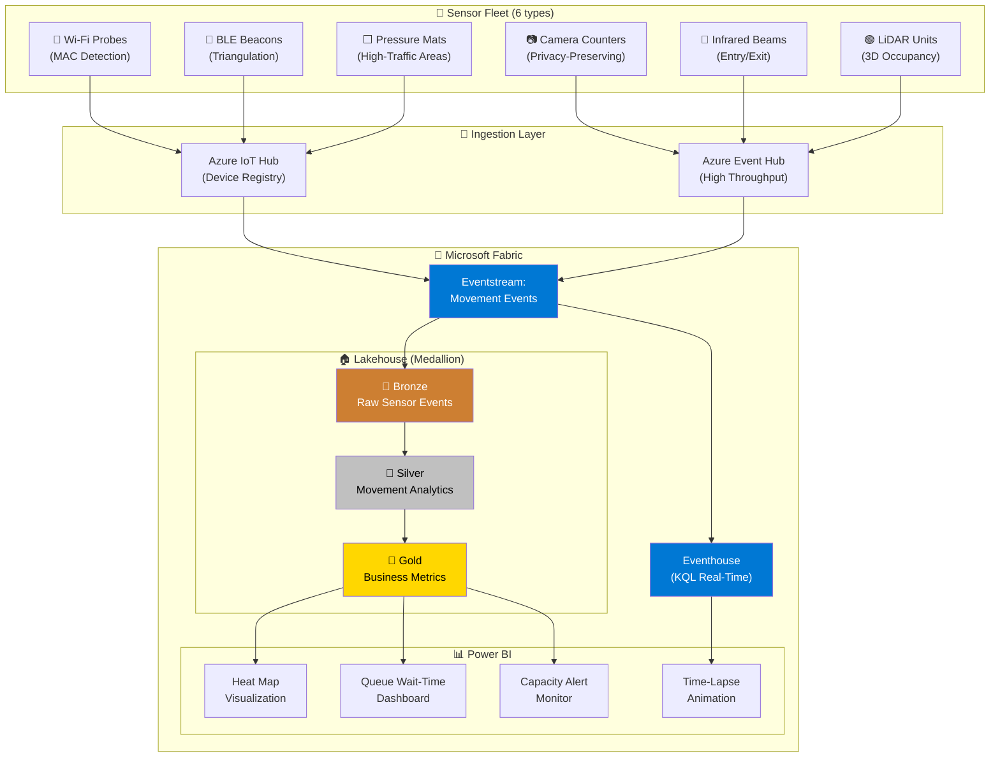
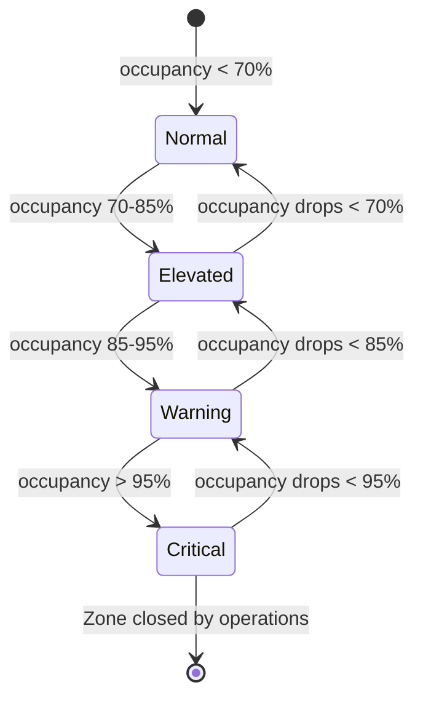
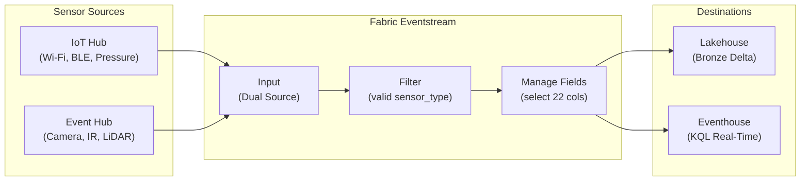
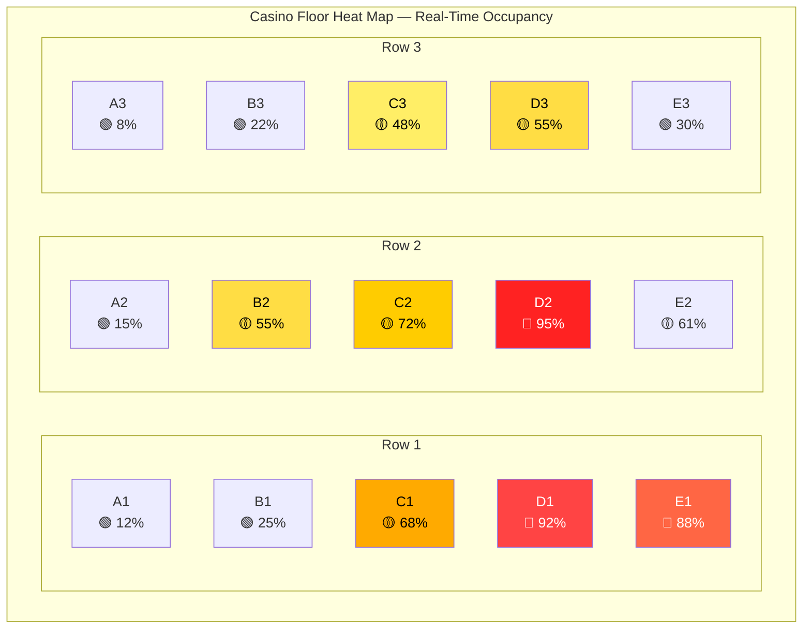
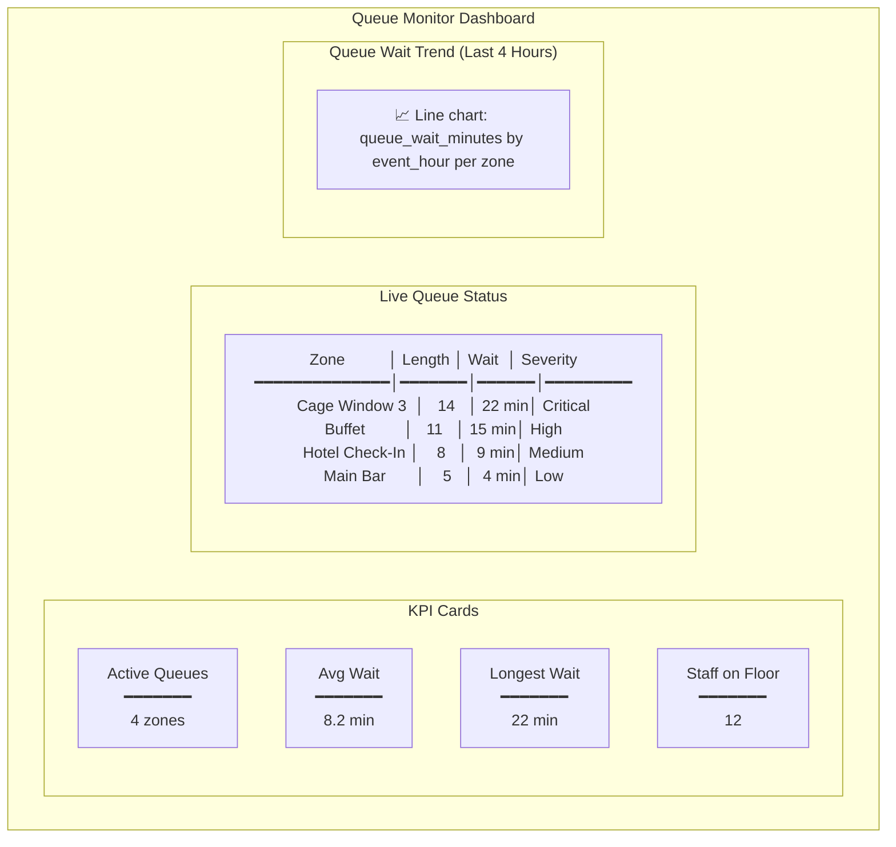

[Home](../../index.md) > [Tutorials](../) > People Movement Analytics

# 🚶 Tutorial 28: People Movement Analytics

> **Last Updated**: 2026-04-15 | **Version**: 2.0
> **Status**: ✅ Final | **Maintainer**: Documentation Team

<div align="center" markdown>


</div>

---

!!! info "Third-party references — publicly sourced, good-faith comparison"
    This page references non-Microsoft products and services. That information is drawn from each vendor's **publicly available documentation** and is offered for honest, good-faith comparison only. This is a personal project written from a Microsoft Fabric and Azure perspective; it does **not** claim expertise in, or authority over, any third-party product, and nothing here is an official statement by, or endorsed by, those vendors. Capabilities, pricing, and features change often — always verify against the vendor's current official documentation. Where a third-party offering is the stronger choice, we say so plainly.

---

## 🚶 Tutorial 28: People Movement Analytics

| | |
|---|---|
| **Difficulty** | ⭐⭐⭐ Advanced |
| **Time** | ⏱️ 90-120 minutes |
| **Focus** | IoT Sensor Ingestion, Spatial Analytics & Real-Time Dashboards |

---

### 📊 Progress Tracker

```
┌──────┬──────┬──────┬──────┬──────┬──────┬──────┬──────┬──────┬──────┬──────┬──────┬──────┬──────┐
│  00  │  01  │  02  │  03  │  04  │  05  │  06  │  07  │  08  │  09  │  10  │  11  │  12  │  13  │
│SETUP │BRNZE │SILVR │ GOLD │  RT  │ PBI  │PIPES │ GOV  │MIRRR │AI/ML │TDATA │ SAS  │CICD  │MIGR  │
├──────┼──────┼──────┼──────┼──────┼──────┼──────┼──────┼──────┼──────┼──────┼──────┼──────┼──────┤
│  ✅  │  ✅  │  ✅  │  ✅  │  ✅  │  ✅  │  ✅  │  ✅  │  ✅  │  ✅  │  ✅  │  ✅  │  ✅  │  ✅  │
└──────┴──────┴──────┴──────┴──────┴──────┴──────┴──────┴──────┴──────┴──────┴──────┴──────┴──────┘

┌──────┬──────┬──────┬──────┬──────┬──────┬──────┬──────┬──────┬──────┬──────┬──────┬──────┬──────┬──────┬──────┬──────┬──────┐
│  14  │  15  │  16  │  17  │  18  │  19  │  20  │  21  │  22  │  23  │  24  │  25  │  26  │  27  │  28  │  29  │  30  │  31  │
│ SEC  │ COST │PERF  │ MON  │SHARE │COPLT │WKBST │ GEO  │ NET  │SHIR  │ SNW  │ DB2  │MULTI │VIDEO │MOVMT │GEOLC │HLTH  │ DOT  │
├──────┼──────┼──────┼──────┼──────┼──────┼──────┼──────┼──────┼──────┼──────┼──────┼──────┼──────┼──────┼──────┼──────┼──────┤
│  ✅  │  ✅  │  ✅  │  ✅  │  ✅  │  ✅  │  ✅  │  ✅  │  ✅  │  ✅  │  ✅  │  ✅  │  ✅  │  ✅  │  🔵  │      │      │      │
└──────┴──────┴──────┴──────┴──────┴──────┴──────┴──────┴──────┴──────┴──────┴──────┴──────┴──────┴──────┴──────┴──────┴──────┘
                                                                                                    ▲
                                                                                             YOU ARE HERE
```

| Navigation | |
|---|---|
| ⬅️ **Previous** | [27-Video Security Analytics](../27-video-security-analytics/README.md) |
| ➡️ **Next** | [29-Geolocation Analytics](../29-geolocation-analytics/README.md) |

---

## 📖 Overview

Casino operations live and die by foot traffic. Knowing **where** guests are, **how long** they stay, **where they queue**, and **when they leave** transforms reactive floor management into predictive, revenue-optimizing operations. People movement analytics turns a casino floor into a living, measurable system — giving operations managers the same visibility into guest flow that a logistics warehouse has over package movement.

This tutorial teaches you how to build a complete **people movement analytics pipeline** in Microsoft Fabric, from sensor deployment strategy through real-time ingestion, medallion-architecture processing, and interactive Power BI dashboards with heat maps, queue alerts, and capacity management views.

**Why people movement analytics matters for casino operations:**

- **Revenue optimization** — Correlating foot traffic with slot coin-in and table drop identifies underperforming zones and informs machine placement decisions.
- **Queue reduction** — Real-time queue detection at cage windows, restaurants, and check-in desks allows dynamic staff reallocation before guest satisfaction drops.
- **Capacity compliance** — Fire code and gaming commission regulations impose maximum occupancy per zone. Automated alerts prevent violations and the fines that follow.
- **Marketing effectiveness** — Measuring foot traffic before, during, and after promotions quantifies campaign ROI at the zone level.
- **Security coordination** — Unusual crowd density patterns (sudden corridor congestion, rapid zone evacuation) trigger situational awareness alerts for surveillance teams.

Fabric's **Eventstreams**, **Lakehouse**, and **Eventhouse** handle the high-volume, low-latency nature of sensor data, while **Direct Lake** mode in Power BI enables sub-second dashboard refresh over the movement analytics gold layer.


*Source: [Real-Time Intelligence in Microsoft Fabric](https://learn.microsoft.com/en-us/fabric/real-time-intelligence/overview)*

---

## 🎯 Learning Objectives

By the end of this tutorial, you will be able to:

- [ ] Evaluate six sensor technologies (Wi-Fi, BLE, camera, infrared, pressure mat, LiDAR) for casino people counting
- [ ] Design a zone configuration model with capacity limits, entry/exit points, and heat map grids
- [ ] Ingest real-time movement sensor events through Fabric Eventstreams
- [ ] Build a Bronze layer that captures raw sensor readings in Delta format with full fidelity
- [ ] Transform raw readings into Silver-layer analytics: dwell time, velocity, queue detection, and occupancy
- [ ] Aggregate Silver data into Gold-layer business metrics: hourly traffic, peak hours, and revenue-per-square-foot correlation
- [ ] Create Power BI heat map visualizations with time-lapse animation and zone capacity alerts
- [ ] Implement queue wait-time dashboards with real-time alerting thresholds
- [ ] Write DAX measures for staff allocation optimization based on movement patterns
- [ ] Apply privacy-preserving techniques (MAC hashing, aggregate-only reporting) to movement data

---

## 🏗️ Architecture Diagram



---

## 📐 Step 1: Sensor Deployment Strategy

Selecting the right sensor mix determines the accuracy, privacy posture, and cost profile of the entire people movement system. No single sensor type covers every use case — casino deployments typically combine three or four types to balance coverage, accuracy, and budget.

### 1.1 Sensor Technology Overview

**Wi-Fi Probe Request Monitoring**

Wi-Fi-enabled devices continuously broadcast probe requests to discover nearby access points. By capturing these probes at multiple access points, the system triangulates device positions to approximately 3-5 meter accuracy. The primary challenge is **MAC address randomization** — modern iOS and Android devices rotate their MAC address for probe requests, which means a single device may appear as multiple unique visitors. Mitigation strategies include analyzing probe request sequences, signal strength fingerprinting, and correlating with opt-in loyalty app Wi-Fi connections.

**BLE Beacon Triangulation**

Bluetooth Low Energy beacons placed throughout the casino floor broadcast advertisement packets at regular intervals. Guest devices with a casino loyalty app installed respond to these beacons, enabling sub-meter positioning accuracy. BLE provides the highest accuracy for opted-in guests but covers only the portion of the population running the app — typically 15-30% of floor traffic. BLE beacons require battery replacement every 12-24 months depending on broadcast interval.

**Camera-Based People Counting**

Overhead cameras with on-device machine learning count people entering and exiting a zone without capturing personally identifiable imagery. Privacy-preserving implementations use edge processing that outputs only a count integer, never raw frames. Accuracy exceeds 95% in well-lit areas with controlled entry widths. Cameras also detect direction of movement, making them ideal for entry/exit chokepoints.

**Infrared Beam Counters**

Paired infrared emitters and receivers mounted on opposite sides of a doorway or corridor count breaks in the beam. By using two parallel beams separated by 10 cm, the system determines direction (entering vs. exiting). Infrared counters are inexpensive, highly reliable, and require zero network bandwidth — they report counts over a simple serial or GPIO connection. Accuracy drops in wide openings where multiple people pass simultaneously.

**Pressure Mat Sensors**

Floor-mounted pressure sensors detect footsteps and estimate pedestrian count based on weight distribution patterns. Pressure mats work well in constrained areas (hallways, elevator lobbies) and provide accurate directional data. They require physical installation beneath flooring, making them best suited for new construction or renovation projects.

**LiDAR Occupancy Sensors**

Ceiling-mounted LiDAR units scan the floor area with laser pulses, building a 3D point cloud of the space below. Machine learning models identify individual people from the point cloud and track movement vectors in real time. LiDAR provides the highest accuracy (>98%) and works in complete darkness, but the per-unit cost is 5-10x that of camera counters.

### 1.2 Sensor Comparison Matrix

| Technology | Accuracy | Cost/Unit | Privacy | Coverage Radius | Power | Best For |
|------------|----------|-----------|---------|----------------|-------|----------|
| Wi-Fi Probe | 70-85% | $50-200 | Medium (MAC hashing required) | 30-50m | PoE | Broad zone occupancy |
| BLE Beacon | 90-98% | $15-50 | High (opt-in only) | 5-15m | Battery | Loyalty guest tracking |
| Camera Count | 93-98% | $200-500 | High (edge count only) | 5-10m (doorway) | PoE | Entry/exit chokepoints |
| Infrared | 90-95% | $30-100 | Very High (no PII) | 1-3m (beam width) | 12V DC | Doorways, corridors |
| Pressure Mat | 85-92% | $100-300 | Very High (no PII) | 1-2m (mat size) | Wired | Hallways, elevators |
| LiDAR | 97-99% | $1,000-3,000 | High (point cloud only) | 10-20m | PoE | High-value zones |

### 1.3 Recommended Casino Deployment Mix

For a typical 50,000 sq ft casino floor with 30 zones:

```
Sensor Type          Quantity    Placement
─────────────────    ────────    ──────────────────────────────────
Wi-Fi Probes         24          Ceiling-mounted, 4 per floor section
BLE Beacons          20          Column-mounted, gaming zones + restaurants
Camera Counters      16          Above all entry/exit points
Infrared Beams       8           Cage windows, restaurant entrances
Pressure Mats        8           Elevator lobbies, VIP corridor
LiDAR Units          4           High-limit slots, baccarat salon
                     ──
Total Sensors:       80
```

> 📸 **Microsoft Learn Reference:** For IoT Hub device provisioning at scale, see [Azure IoT Hub Device Provisioning Service](https://learn.microsoft.com/en-us/azure/iot-dps/about-iot-dps).

---

## 🗺️ Step 2: Zone Configuration

Every movement analytics system needs a well-defined zone model. Zones represent logical areas of the casino floor, each with a unique identifier, maximum capacity, and a mapping to the physical sensor grid.

### 2.1 Casino Floor Zone Definition

The zone configuration below models a three-floor casino property with 30 distinct zones. Each zone carries capacity limits (for fire code compliance), typical dwell ranges (for anomaly detection), and queue eligibility flags.

```python
# Zone configuration for people movement analytics
# File: data_generation/generators/analytics/zone_config.py

ZONE_CONFIG = {
    # --- Floor 1: Main Gaming Floor ---
    "Main Slot Floor":         {"zone_id": "Z-001", "capacity": 400, "floor": 1, "dwell_range": (300, 3600),  "queue_eligible": False},
    "High-Limit Slots":        {"zone_id": "Z-002", "capacity": 60,  "floor": 1, "dwell_range": (600, 3600),  "queue_eligible": False},
    "Poker Room":              {"zone_id": "Z-003", "capacity": 120, "floor": 1, "dwell_range": (1800, 7200), "queue_eligible": False},
    "Blackjack Pit A":         {"zone_id": "Z-004", "capacity": 100, "floor": 1, "dwell_range": (600, 3600),  "queue_eligible": False},
    "Blackjack Pit B":         {"zone_id": "Z-005", "capacity": 100, "floor": 1, "dwell_range": (600, 3600),  "queue_eligible": False},
    "Craps Area":              {"zone_id": "Z-006", "capacity": 80,  "floor": 1, "dwell_range": (600, 3600),  "queue_eligible": False},
    "Roulette Section":        {"zone_id": "Z-007", "capacity": 60,  "floor": 1, "dwell_range": (300, 2400),  "queue_eligible": False},
    "Sports Book":             {"zone_id": "Z-009", "capacity": 150, "floor": 1, "dwell_range": (900, 5400),  "queue_eligible": False},
    "Race Book":               {"zone_id": "Z-029", "capacity": 60,  "floor": 1, "dwell_range": (600, 3600),  "queue_eligible": False},

    # --- Floor 1: Food & Beverage ---
    "Buffet":                  {"zone_id": "Z-010", "capacity": 200, "floor": 1, "dwell_range": (1200, 5400), "queue_eligible": True},
    "Main Bar":                {"zone_id": "Z-012", "capacity": 60,  "floor": 1, "dwell_range": (600, 3600),  "queue_eligible": True},

    # --- Floor 1: Cage & Services ---
    "Cage Window 1":           {"zone_id": "Z-013", "capacity": 20,  "floor": 1, "dwell_range": (60, 600),    "queue_eligible": True},
    "Cage Window 2":           {"zone_id": "Z-014", "capacity": 20,  "floor": 1, "dwell_range": (60, 600),    "queue_eligible": True},
    "Cage Window 3":           {"zone_id": "Z-015", "capacity": 20,  "floor": 1, "dwell_range": (60, 600),    "queue_eligible": True},
    "Cage Window 4":           {"zone_id": "Z-016", "capacity": 20,  "floor": 1, "dwell_range": (60, 600),    "queue_eligible": True},
    "Cage Window 5":           {"zone_id": "Z-017", "capacity": 20,  "floor": 1, "dwell_range": (60, 600),    "queue_eligible": True},
    "Hotel Check-In":          {"zone_id": "Z-023", "capacity": 40,  "floor": 1, "dwell_range": (120, 900),   "queue_eligible": True},

    # --- Floor 1: Entry/Exit Points ---
    "Entrance North":          {"zone_id": "Z-018", "capacity": 50,  "floor": 1, "dwell_range": (5, 30),      "queue_eligible": False},
    "Entrance South":          {"zone_id": "Z-019", "capacity": 50,  "floor": 1, "dwell_range": (5, 30),      "queue_eligible": False},
    "Entrance Valet":          {"zone_id": "Z-020", "capacity": 40,  "floor": 1, "dwell_range": (5, 30),      "queue_eligible": False},

    # --- Floor 1: Circulation ---
    "Elevator Bank A":         {"zone_id": "Z-021", "capacity": 25,  "floor": 1, "dwell_range": (10, 120),    "queue_eligible": False},
    "Back of House Corridor":  {"zone_id": "Z-027", "capacity": 30,  "floor": 1, "dwell_range": (10, 300),    "queue_eligible": False},

    # --- Floor 2: Premium Gaming & Dining ---
    "VIP Lounge":              {"zone_id": "Z-008", "capacity": 30,  "floor": 2, "dwell_range": (1200, 5400), "queue_eligible": False},
    "Steakhouse":              {"zone_id": "Z-011", "capacity": 80,  "floor": 2, "dwell_range": (2400, 5400), "queue_eligible": True},
    "Elevator Bank B":         {"zone_id": "Z-022", "capacity": 25,  "floor": 2, "dwell_range": (10, 120),    "queue_eligible": False},
    "Convention Hall A":       {"zone_id": "Z-025", "capacity": 300, "floor": 2, "dwell_range": (1800, 7200), "queue_eligible": False},
    "Convention Hall B":       {"zone_id": "Z-026", "capacity": 300, "floor": 2, "dwell_range": (1800, 7200), "queue_eligible": False},
    "Baccarat Salon":          {"zone_id": "Z-028", "capacity": 40,  "floor": 2, "dwell_range": (900, 5400),  "queue_eligible": False},

    # --- Floor 3: Amenities ---
    "Pool Deck":               {"zone_id": "Z-024", "capacity": 100, "floor": 3, "dwell_range": (1800, 7200), "queue_eligible": False},
}
```

### 2.2 Zone Capacity Management

Fire code compliance requires tracking real-time occupancy against posted maximums. The zone model above defines capacity for each zone. When `occupancy_percentage` crosses 85%, the system triggers a warning; at 95%, it triggers a critical alert.



### 2.3 Entry/Exit Point Mapping

Entry/exit points are instrumented with paired directional sensors (infrared beams or camera counters) to compute net flow:

```
                    ┌─────────────────────────────────────────────┐
                    │            CASINO FLOOR (Floor 1)           │
                    │                                             │
   ┌──────────┐     │   ┌──────────┐    ┌──────────┐             │
   │ Entrance │◄───►│   │Main Slot │    │Blackjack │             │
   │  North   │ IR  │   │  Floor   │    │  Pit A   │             │
   │ (Z-018)  │     │   │ (Z-001)  │    │ (Z-004)  │             │
   └──────────┘     │   └──────────┘    └──────────┘             │
                    │                                             │
   ┌──────────┐     │   ┌──────────┐    ┌──────────┐             │
   │ Entrance │◄───►│   │  Cage    │    │  Sports  │             │
   │  South   │ CAM │   │ Windows  │    │   Book   │             │
   │ (Z-019)  │     │   │(Z-013-17)│    │ (Z-009)  │             │
   └──────────┘     │   └──────────┘    └──────────┘             │
                    │                                             │
   ┌──────────┐     │   ┌──────────┐    ┌──────────┐             │
   │ Entrance │◄───►│   │  Buffet  │    │ Elevator │             │
   │  Valet   │ IR  │   │ (Z-010)  │    │ Bank A   │             │
   │ (Z-020)  │     │   └──────────┘    │ (Z-021)  │             │
   └──────────┘     │                    └────┬─────┘             │
                    └─────────────────────────┼───────────────────┘
                                              │
                                        ┌─────▼─────┐
                                        │  Floor 2  │
                                        │ VIP/Dining│
                                        └───────────┘
```

---

## ⚡ Step 3: Real-Time Data Ingestion

Movement sensor events flow into Microsoft Fabric through **Eventstreams**, which provides managed, scalable event ingestion from Azure IoT Hub and Event Hubs.

### 3.1 Event Schema

Each sensor reading conforms to the `movement_event_schema.json` schema defined in the project. The core fields are:

| Field | Type | Description |
|-------|------|-------------|
| `event_id` | string (UUID) | Unique identifier for each sensor reading |
| `sensor_id` | string | Device identifier (format: `SENS-XXXX`) |
| `sensor_type` | enum | One of: `wifi_probe`, `ble_beacon`, `camera_count`, `infrared`, `pressure_mat`, `lidar` |
| `zone_id` | string | Zone identifier (format: `Z-XXX`) |
| `zone_name` | string | Human-readable zone name |
| `timestamp` | datetime | UTC timestamp of the sensor reading |
| `person_count` | integer | Number of persons detected |
| `direction` | enum/null | `entering`, `exiting`, `stationary`, `passing_through` |
| `dwell_time_seconds` | float/null | Duration a person has remained in zone |
| `velocity_mps` | float/null | Estimated walking speed in m/s |
| `x_coordinate` | float/null | Horizontal position within zone (0-100) |
| `y_coordinate` | float/null | Vertical position within zone (0-100) |
| `floor_level` | integer/null | Building floor (1, 2, or 3) |
| `heat_map_cell` | string/null | Grid reference for heat map (e.g., `A1`, `C7`) |
| `occupancy_percentage` | float/null | Zone occupancy as percentage of capacity |
| `queue_detected` | boolean/null | Whether a queue formation was detected |
| `queue_length` | integer/null | Estimated persons in queue |
| `queue_wait_minutes` | float/null | Estimated average wait time |
| `device_mac_hash` | string/null | SHA-256 hashed MAC (Wi-Fi only) |
| `signal_strength_dbm` | integer/null | RSSI in dBm (wireless sensors) |
| `battery_level` | integer/null | Sensor battery percentage (BLE only) |
| `calibration_date` | date/null | Last sensor calibration date |
| `load_time` | datetime | Pipeline ingestion timestamp |

> 📸 **Schema Reference:** The full JSON Schema is at [`data_generation/schemas/analytics/movement_event_schema.json`](https://github.com/fgarofalo56/Supercharge_Microsoft_Fabric/blob/main/data_generation/schemas/analytics/movement_event_schema.json).

### 3.2 Eventstream Configuration



### 3.3 PySpark Structured Streaming Ingestion

Use a Fabric notebook to consume movement events from the Eventstream endpoint:

```python
# Notebook: 01_movement_stream_ingestion.py
# Purpose: Structured streaming from Eventstream to Bronze Delta table

from pyspark.sql import SparkSession
from pyspark.sql.types import (
    StructType, StructField, StringType, IntegerType,
    FloatType, BooleanType, TimestampType
)

spark = SparkSession.builder.getOrCreate()

# Define schema matching movement_event_schema.json
movement_schema = StructType([
    StructField("event_id",             StringType(),    False),
    StructField("sensor_id",            StringType(),    False),
    StructField("sensor_type",          StringType(),    False),
    StructField("zone_id",              StringType(),    False),
    StructField("zone_name",            StringType(),    False),
    StructField("timestamp",            TimestampType(), False),
    StructField("person_count",         IntegerType(),   False),
    StructField("direction",            StringType(),    True),
    StructField("dwell_time_seconds",   FloatType(),     True),
    StructField("velocity_mps",         FloatType(),     True),
    StructField("x_coordinate",         FloatType(),     True),
    StructField("y_coordinate",         FloatType(),     True),
    StructField("floor_level",          IntegerType(),   True),
    StructField("heat_map_cell",        StringType(),    True),
    StructField("occupancy_percentage", FloatType(),     True),
    StructField("queue_detected",       BooleanType(),   True),
    StructField("queue_length",         IntegerType(),   True),
    StructField("queue_wait_minutes",   FloatType(),     True),
    StructField("device_mac_hash",      StringType(),    True),
    StructField("signal_strength_dbm",  IntegerType(),   True),
    StructField("battery_level",        IntegerType(),   True),
    StructField("calibration_date",     StringType(),    True),
    StructField("load_time",            TimestampType(), False),
])

# Read from Eventstream (Kafka-compatible endpoint)
movement_stream = (
    spark.readStream
    .format("kafka")
    .option("kafka.bootstrap.servers", "<eventstream-endpoint>")
    .option("subscribe", "es-movement-events")
    .option("startingOffsets", "latest")
    .option("kafka.security.protocol", "SASL_SSL")
    .option("kafka.sasl.mechanism", "PLAIN")
    .option("kafka.sasl.jaas.config",
            'org.apache.kafka.common.security.plain.PlainLoginModule required '
            'username="$ConnectionString" '
            'password="<connection-string>";')
    .load()
)

# Parse JSON payload
from pyspark.sql.functions import from_json, col

parsed_stream = (
    movement_stream
    .select(from_json(col("value").cast("string"), movement_schema).alias("data"))
    .select("data.*")
)

print("Stream schema:")
parsed_stream.printSchema()
```

> 📸 **Microsoft Learn Reference:** For Eventstream configuration, see [Create and manage Eventstreams](https://learn.microsoft.com/en-us/fabric/real-time-intelligence/event-streams/create-manage-an-eventstream).

---

## 🥉 Step 4: Bronze Layer — Raw Sensor Events

The Bronze layer captures every sensor reading in its original form. No transformations, no filtering, no deduplication — raw fidelity for auditability and replay.

### 4.1 Bronze Delta Table

```python
# Notebook: 02_bronze_movement_events.py
# Purpose: Write streaming movement events to Bronze Delta table

from pyspark.sql.functions import current_timestamp, year, month, dayofmonth

# Add ingestion metadata
bronze_stream = (
    parsed_stream
    .withColumn("_ingestion_time", current_timestamp())
    .withColumn("_year",  year(col("timestamp")))
    .withColumn("_month", month(col("timestamp")))
    .withColumn("_day",   dayofmonth(col("timestamp")))
)

# Write to Bronze Delta table with date partitioning
bronze_checkpoint = "abfss://<workspace>@onelake.dfs.fabric.microsoft.com/<lakehouse>/Tables/_checkpoints/bronze_movement"

(
    bronze_stream
    .writeStream
    .format("delta")
    .outputMode("append")
    .option("checkpointLocation", bronze_checkpoint)
    .partitionBy("_year", "_month", "_day")
    .toTable("lh_bronze.bronze_movement_events")
)
```

### 4.2 Bronze Table Validation

```python
# Verify Bronze table structure and row counts
bronze_df = spark.read.table("lh_bronze.bronze_movement_events")

print(f"Total records:   {bronze_df.count():,}")
print(f"Distinct sensors: {bronze_df.select('sensor_id').distinct().count()}")
print(f"Distinct zones:   {bronze_df.select('zone_id').distinct().count()}")
print(f"Sensor types:     {[r.sensor_type for r in bronze_df.select('sensor_type').distinct().collect()]}")
print(f"Date range:       {bronze_df.agg({'timestamp': 'min'}).collect()[0][0]} to "
      f"{bronze_df.agg({'timestamp': 'max'}).collect()[0][0]}")

# Show sample records
bronze_df.select(
    "event_id", "sensor_id", "sensor_type", "zone_name",
    "person_count", "direction", "occupancy_percentage"
).show(10, truncate=False)
```

Expected output:

```
Total records:   1,000,000
Distinct sensors: 80
Distinct zones:   30
Sensor types:     ['wifi_probe', 'ble_beacon', 'camera_count', 'infrared', 'pressure_mat', 'lidar']
Date range:       2025-01-01 00:00:12 to 2025-12-31 23:59:48
```

---

## 🥈 Step 5: Silver Layer — Movement Analytics

The Silver layer transforms raw sensor readings into meaningful analytics: validated dwell times, computed velocities, queue detection outputs, and normalized occupancy metrics.

### 5.1 Dwell Time Calculation

Dwell time measures how long guests remain in a zone. The Silver layer validates dwell readings against zone-specific expected ranges and flags anomalies:

```python
# Notebook: 03_silver_movement_analytics.py
# Purpose: Silver layer transformations for movement analytics

from pyspark.sql import functions as F
from pyspark.sql.window import Window

# Read Bronze
bronze_df = spark.read.table("lh_bronze.bronze_movement_events")

# --- Dwell Time Validation ---
# Zone-specific dwell ranges (loaded from zone config)
zone_dwell_ranges = spark.createDataFrame([
    ("Z-001", 300.0,  3600.0),   # Main Slot Floor: 5 min - 1 hr
    ("Z-002", 600.0,  3600.0),   # High-Limit Slots: 10 min - 1 hr
    ("Z-003", 1800.0, 7200.0),   # Poker Room: 30 min - 2 hrs
    ("Z-010", 1200.0, 5400.0),   # Buffet: 20 min - 1.5 hrs
    ("Z-013", 60.0,   600.0),    # Cage Window 1: 1 min - 10 min
    ("Z-018", 5.0,    30.0),     # Entrance North: 5 sec - 30 sec
    # ... (all 30 zones defined similarly)
], ["zone_id", "dwell_min", "dwell_max"])

# Join and validate
silver_dwell = (
    bronze_df
    .join(zone_dwell_ranges, "zone_id", "left")
    .withColumn(
        "dwell_status",
        F.when(
            (F.col("dwell_time_seconds") >= F.col("dwell_min")) &
            (F.col("dwell_time_seconds") <= F.col("dwell_max")),
            "normal"
        )
        .when(F.col("dwell_time_seconds") > F.col("dwell_max"), "extended")
        .when(F.col("dwell_time_seconds") < F.col("dwell_min"), "brief")
        .otherwise("unknown")
    )
    .withColumn(
        "dwell_category",
        F.when(F.col("dwell_time_seconds") < 60, "under_1_min")
        .when(F.col("dwell_time_seconds") < 300, "1_to_5_min")
        .when(F.col("dwell_time_seconds") < 900, "5_to_15_min")
        .when(F.col("dwell_time_seconds") < 1800, "15_to_30_min")
        .when(F.col("dwell_time_seconds") < 3600, "30_to_60_min")
        .otherwise("over_1_hour")
    )
)
```

### 5.2 Direction and Velocity Analysis

```python
# --- Direction & Velocity Enrichment ---
silver_velocity = (
    silver_dwell
    .withColumn(
        "velocity_category",
        F.when(F.col("velocity_mps") < 0.3, "stationary")
        .when(F.col("velocity_mps") < 0.8, "browsing")
        .when(F.col("velocity_mps") < 1.5, "walking")
        .when(F.col("velocity_mps") < 2.0, "hurried")
        .otherwise("running")
    )
    .withColumn(
        "net_flow",
        F.when(F.col("direction") == "entering", F.col("person_count"))
        .when(F.col("direction") == "exiting", -F.col("person_count"))
        .otherwise(F.lit(0))
    )
)
```

### 5.3 Queue Detection Algorithm

Queue detection combines sensor-reported queue flags with occupancy thresholds and temporal patterns. A queue is confirmed when multiple sensors in the same zone report queue conditions within a rolling 5-minute window:

```python
# --- Queue Detection Enhancement ---
# Define a 5-minute tumbling window per zone
queue_window = Window.partitionBy("zone_id").orderBy("timestamp").rangeBetween(-300, 0)

silver_queue = (
    silver_velocity
    .withColumn(
        "queue_sensor_count",
        F.sum(
            F.when(F.col("queue_detected") == True, 1).otherwise(0)
        ).over(queue_window)
    )
    .withColumn(
        "queue_confirmed",
        F.when(
            (F.col("queue_detected") == True) &
            (F.col("queue_sensor_count") >= 2) &
            (F.col("occupancy_percentage") > 70.0),
            True
        ).otherwise(False)
    )
    .withColumn(
        "queue_severity",
        F.when(F.col("queue_wait_minutes") > 20.0, "critical")
        .when(F.col("queue_wait_minutes") > 10.0, "high")
        .when(F.col("queue_wait_minutes") > 5.0, "medium")
        .when(F.col("queue_confirmed") == True, "low")
        .otherwise("none")
    )
)
```

### 5.4 Occupancy Percentage Calculation

```python
# --- Occupancy Status ---
silver_occupancy = (
    silver_queue
    .withColumn(
        "occupancy_status",
        F.when(F.col("occupancy_percentage") > 95.0, "critical")
        .when(F.col("occupancy_percentage") > 85.0, "warning")
        .when(F.col("occupancy_percentage") > 70.0, "elevated")
        .otherwise("normal")
    )
    .withColumn(
        "capacity_alert",
        F.when(F.col("occupancy_percentage") > 95.0, True).otherwise(False)
    )
)
```

### 5.5 Write Silver Table

```python
# Write Silver Delta table
(
    silver_occupancy
    .write
    .format("delta")
    .mode("overwrite")
    .option("overwriteSchema", "true")
    .partitionBy("_year", "_month")
    .saveAsTable("lh_silver.silver_movement_analytics")
)

# Verify
silver_df = spark.read.table("lh_silver.silver_movement_analytics")
print(f"Silver records:         {silver_df.count():,}")
print(f"Queue confirmed events: {silver_df.filter('queue_confirmed = true').count():,}")
print(f"Capacity alerts:        {silver_df.filter('capacity_alert = true').count():,}")

# Dwell category distribution
silver_df.groupBy("dwell_category").count().orderBy("count", ascending=False).show()
```

---

## 🥇 Step 6: Gold Layer — Business Intelligence

The Gold layer aggregates Silver analytics into business-ready metrics: hourly traffic summaries, peak hour identification, revenue correlation, and staff allocation recommendations.

### 6.1 Hourly Foot Traffic by Zone

```python
# Notebook: 04_gold_movement_metrics.py
# Purpose: Gold layer business aggregations for people movement

from pyspark.sql import functions as F

silver_df = spark.read.table("lh_silver.silver_movement_analytics")

# --- Hourly foot traffic by zone ---
gold_hourly_traffic = (
    silver_df
    .withColumn("event_hour", F.date_trunc("hour", "timestamp"))
    .groupBy("event_hour", "zone_id", "zone_name", "floor_level")
    .agg(
        F.sum("person_count").alias("total_foot_traffic"),
        F.avg("person_count").alias("avg_person_count"),
        F.max("person_count").alias("peak_person_count"),
        F.avg("dwell_time_seconds").alias("avg_dwell_seconds"),
        F.avg("occupancy_percentage").alias("avg_occupancy_pct"),
        F.max("occupancy_percentage").alias("peak_occupancy_pct"),
        F.sum(F.when(F.col("direction") == "entering", F.col("person_count")).otherwise(0)).alias("entries"),
        F.sum(F.when(F.col("direction") == "exiting", F.col("person_count")).otherwise(0)).alias("exits"),
        F.sum(F.when(F.col("queue_confirmed"), 1).otherwise(0)).alias("queue_events"),
        F.avg("queue_wait_minutes").alias("avg_queue_wait_min"),
        F.count("*").alias("sensor_readings"),
    )
    .withColumn("net_flow", F.col("entries") - F.col("exits"))
    .orderBy("event_hour", "zone_id")
)

gold_hourly_traffic.write.format("delta").mode("overwrite").saveAsTable("lh_gold.gold_hourly_zone_traffic")
```

### 6.2 Peak Hour Identification

```python
# --- Peak hour identification per zone per day ---
from pyspark.sql.window import Window

daily_window = Window.partitionBy("zone_id", F.to_date("event_hour")).orderBy(F.desc("total_foot_traffic"))

gold_peak_hours = (
    gold_hourly_traffic
    .withColumn("rank", F.row_number().over(daily_window))
    .filter(F.col("rank") <= 3)  # Top 3 peak hours per zone per day
    .withColumn("event_date", F.to_date("event_hour"))
    .withColumn("peak_hour_of_day", F.hour("event_hour"))
    .select(
        "event_date", "zone_id", "zone_name", "peak_hour_of_day",
        "total_foot_traffic", "avg_occupancy_pct", "rank"
    )
)

gold_peak_hours.write.format("delta").mode("overwrite").saveAsTable("lh_gold.gold_peak_hours")

# Show peak hours across all zones
gold_peak_hours.filter("rank = 1").orderBy("total_foot_traffic", ascending=False).show(10)
```

### 6.3 Revenue-per-Square-Foot Correlation

```python
# --- Revenue correlation (join movement data with slot/table revenue) ---
# Assumes lh_gold.gold_daily_revenue exists from earlier tutorials

daily_traffic = (
    gold_hourly_traffic
    .withColumn("event_date", F.to_date("event_hour"))
    .groupBy("event_date", "zone_id", "zone_name")
    .agg(
        F.sum("total_foot_traffic").alias("daily_foot_traffic"),
        F.avg("avg_dwell_seconds").alias("avg_dwell_seconds"),
        F.avg("avg_occupancy_pct").alias("avg_occupancy_pct"),
    )
)

# Zone square footage reference
zone_sqft = spark.createDataFrame([
    ("Z-001", 8000),   # Main Slot Floor
    ("Z-002", 2000),   # High-Limit Slots
    ("Z-003", 3000),   # Poker Room
    ("Z-004", 2500),   # Blackjack Pit A
    ("Z-005", 2500),   # Blackjack Pit B
    ("Z-006", 2000),   # Craps Area
    ("Z-007", 1500),   # Roulette Section
    ("Z-009", 3500),   # Sports Book
    ("Z-028", 1200),   # Baccarat Salon
], ["zone_id", "square_feet"])

gold_revenue_correlation = (
    daily_traffic
    .join(zone_sqft, "zone_id", "inner")
    .withColumn("traffic_per_sqft", F.col("daily_foot_traffic") / F.col("square_feet"))
    .withColumn(
        "dwell_efficiency",
        F.round(F.col("avg_dwell_seconds") * F.col("daily_foot_traffic") / F.col("square_feet"), 2)
    )
)

gold_revenue_correlation.write.format("delta").mode("overwrite").saveAsTable("lh_gold.gold_zone_revenue_correlation")
```

### 6.4 Staff Allocation Optimization

```python
# --- Staff allocation recommendation ---
# Rule: 1 attendant per 50 guests at Normal, 1 per 30 at Elevated, 1 per 20 at Warning/Critical

gold_staffing = (
    gold_hourly_traffic
    .withColumn(
        "recommended_staff",
        F.when(F.col("avg_occupancy_pct") > 85,
               F.ceil(F.col("avg_person_count") / 20))
        .when(F.col("avg_occupancy_pct") > 70,
               F.ceil(F.col("avg_person_count") / 30))
        .otherwise(F.ceil(F.col("avg_person_count") / 50))
    )
    .withColumn(
        "staffing_priority",
        F.when(F.col("queue_events") > 5, "high")
        .when(F.col("queue_events") > 2, "medium")
        .otherwise("standard")
    )
    .select(
        "event_hour", "zone_id", "zone_name", "avg_person_count",
        "avg_occupancy_pct", "queue_events", "recommended_staff", "staffing_priority"
    )
)

gold_staffing.write.format("delta").mode("overwrite").saveAsTable("lh_gold.gold_staffing_recommendations")
```

### 6.5 DAX Measures for Power BI

Create a semantic model over the Gold tables and add these DAX measures:

```dax
// --- People Movement DAX Measures ---

// Current Zone Occupancy (for card visual)
Current Zone Occupancy % =
VAR _LatestHour = MAX('gold_hourly_zone_traffic'[event_hour])
RETURN
    CALCULATE(
        AVERAGE('gold_hourly_zone_traffic'[avg_occupancy_pct]),
        'gold_hourly_zone_traffic'[event_hour] = _LatestHour
    )

// Foot Traffic Trend (week-over-week change)
WoW Traffic Change % =
VAR _CurrentWeek =
    CALCULATE(
        SUM('gold_hourly_zone_traffic'[total_foot_traffic]),
        DATESINPERIOD('Calendar'[Date], MAX('Calendar'[Date]), -7, DAY)
    )
VAR _PriorWeek =
    CALCULATE(
        SUM('gold_hourly_zone_traffic'[total_foot_traffic]),
        DATESINPERIOD('Calendar'[Date], MAX('Calendar'[Date]) - 7, -7, DAY)
    )
RETURN
    DIVIDE(_CurrentWeek - _PriorWeek, _PriorWeek, 0)

// Average Dwell Time (formatted as minutes:seconds)
Avg Dwell Time Display =
VAR _AvgSeconds = AVERAGE('gold_hourly_zone_traffic'[avg_dwell_seconds])
VAR _Minutes = INT(_AvgSeconds / 60)
VAR _Seconds = INT(MOD(_AvgSeconds, 60))
RETURN
    FORMAT(_Minutes, "0") & ":" & FORMAT(_Seconds, "00")

// Queue Alert Count (zones with active queues)
Active Queue Zones =
CALCULATE(
    DISTINCTCOUNT('gold_hourly_zone_traffic'[zone_id]),
    'gold_hourly_zone_traffic'[queue_events] > 0,
    'gold_hourly_zone_traffic'[event_hour] = MAX('gold_hourly_zone_traffic'[event_hour])
)

// Staff Utilization Index
Staff Utilization Index =
DIVIDE(
    SUM('gold_staffing_recommendations'[avg_person_count]),
    SUM('gold_staffing_recommendations'[recommended_staff]) * 50,
    0
)

// Revenue per Footfall (requires revenue table join)
Revenue Per Footfall =
DIVIDE(
    SUM('gold_daily_revenue'[total_revenue]),
    SUM('gold_zone_revenue_correlation'[daily_foot_traffic]),
    0
)

// Peak Hour Label
Peak Hour =
VAR _PeakHour =
    MAXX(
        TOPN(1, VALUES('gold_peak_hours'[peak_hour_of_day]),
             [total_foot_traffic], DESC),
        'gold_peak_hours'[peak_hour_of_day]
    )
RETURN
    FORMAT(TIME(_PeakHour, 0, 0), "h:00 AM/PM")

// Capacity Warning Count
Zones Near Capacity =
CALCULATE(
    DISTINCTCOUNT('gold_hourly_zone_traffic'[zone_id]),
    'gold_hourly_zone_traffic'[peak_occupancy_pct] > 85,
    'gold_hourly_zone_traffic'[event_hour] = MAX('gold_hourly_zone_traffic'[event_hour])
)
```

---

## 📊 Step 7: Heat Map Visualization

Power BI visualizations transform movement data into actionable views for casino operations managers.

### 7.1 Casino Floor Heat Map

The heat map uses the `heat_map_cell` grid reference (columns A-J, rows 1-10) to render a color-coded occupancy overlay on the casino floor plan:



**Color Scale:**

| Occupancy % | Color | Status |
|-------------|-------|--------|
| 0-40% | Green | Normal |
| 41-70% | Yellow | Elevated |
| 71-85% | Orange | Warning |
| 86-100% | Red | Critical |

To build this in Power BI:

1. Create a **Matrix** visual with `heat_map_cell` column letter on columns and row number on rows.
2. Set the value to `avg_occupancy_pct`.
3. Apply conditional formatting with the color scale above.
4. Add a **Floor Level** slicer to toggle between floors 1, 2, and 3.

### 7.2 Time-Lapse Animation of Movement Patterns

Use the **Play Axis** (animation) feature in Power BI to replay a full day of movement data:

1. Add a **Scatter Chart** visual with `x_coordinate` and `y_coordinate` as axes.
2. Set the size to `person_count`.
3. Set the color saturation to `occupancy_percentage`.
4. Add `event_hour` to the **Play Axis** well.
5. Set animation speed to 2 seconds per frame.
6. Filter to a single zone (e.g., "Main Slot Floor") for clarity.

This produces a time-lapse visualization showing how crowds build, shift, and dissipate across the day — revealing patterns like the post-dinner rush to the slot floor or the Saturday morning buildup at the sports book.

### 7.3 Queue Wait-Time Dashboard



Build the queue dashboard in Power BI:

1. **KPI Cards** — Use the `Active Queue Zones`, `Avg Dwell Time Display`, and `Zones Near Capacity` DAX measures.
2. **Table Visual** — Show `zone_name`, `queue_length`, `queue_wait_minutes`, `queue_severity` filtered to `queue_confirmed = True`.
3. **Line Chart** — Plot `avg_queue_wait_min` over `event_hour`, split by `zone_name`, filtered to queue-eligible zones.
4. **Conditional formatting** — Apply background color to the severity column using the same green/yellow/orange/red scale.

### 7.4 Zone Capacity Alerts

Configure Data Activator (Reflex) alerts on the Gold layer to push notifications when zones approach capacity:

```
Alert Rule: Zone Capacity Warning
━━━━━━━━━━━━━━━━━━━━━━━━━━━━━━━━
Table:       gold_hourly_zone_traffic
Condition:   peak_occupancy_pct > 85
Frequency:   Every 5 minutes
Action:      Send Teams notification to #casino-operations channel
Message:     "⚠️ Zone {zone_name} at {peak_occupancy_pct}% capacity
             ({peak_person_count} persons). Recommended action: redirect
             guest flow or deploy additional staff."

Alert Rule: Zone Capacity Critical
━━━━━━━━━━━━━━━━━━━━━━━━━━━━━━━━
Table:       gold_hourly_zone_traffic
Condition:   peak_occupancy_pct > 95
Frequency:   Every 1 minute
Action:      Send Teams notification + email to floor manager
Message:     "🔴 CRITICAL: Zone {zone_name} at {peak_occupancy_pct}% capacity.
             Fire code maximum may be exceeded. Immediate action required."
```

> 📸 **Microsoft Learn Reference:** For Data Activator alert configuration, see [What is Data Activator?](https://learn.microsoft.com/en-us/fabric/data-activator/data-activator-introduction).

---

## 🔧 Troubleshooting

| Issue | Likely Cause | Resolution |
|-------|-------------|------------|
| Sensor readings arrive with large timestamp gaps | IoT Hub consumer group exhausted (max 5 per hub) | Create a dedicated consumer group for the Fabric Eventstream; delete unused groups |
| `person_count` always 0 for camera sensors | Camera edge firmware not running counting model | SSH to camera, verify `people_counter` service is running; check model version |
| `occupancy_percentage` exceeds 100% | Multiple sensors in same zone double-counting | Apply deduplication in Silver layer; use `MAX(person_count)` per zone per window instead of `SUM` |
| `device_mac_hash` cardinality explodes over time | MAC address randomization (iOS/Android) | Expected behavior — do not use MAC hash for unique visitor counting; use camera-based counts instead |
| BLE beacon `battery_level` drops below 10% | Battery nearing end of life (12-24 month cycle) | Replace beacon battery; alert threshold should trigger work order at 15% |
| Queue detection fires in non-queue zones | Sensor misconfiguration — `queue_eligible` flag not set | Verify zone config: only cage windows, restaurants, and check-in should have `queue_eligible: True` |
| Heat map shows uniform color across all cells | Aggregation too broad — averaging across entire day | Filter to current hour or add time slicer; ensure `event_hour` filter is applied |
| Eventstream ingestion lag exceeds 60 seconds | Insufficient Fabric capacity units (CU) | Scale Fabric capacity or reduce Eventstream batch size; check Monitoring Hub for CU utilization |
| LiDAR readings intermittent on Floor 3 | Network connectivity to pool deck sensors | Check PoE switch port status; LiDAR draws more power than typical PoE budget |
| Silver table write fails with `AnalysisException` | Schema drift between Bronze and Silver | Run `bronze_df.printSchema()` and compare against Silver expectations; update Silver transformations |
| Power BI heat map renders blank | `heat_map_cell` column not parsed as category | Set column data type to "Text" in Power BI model; verify column is not null |
| Staffing recommendations seem too high | Peak person counts skewed by large events | Filter out convention hall zones from staffing model; use `avg_person_count` instead of `peak_person_count` |

---

## 📐 Best Practices

1. **Hash all MAC addresses at the sensor edge, not in the pipeline.** If raw MACs enter the Bronze layer, they become PII subject to retention and deletion policies. Hash at the device level so the pipeline never sees the original address.

2. **Use camera-based counters as the ground truth for zone occupancy.** Wi-Fi and BLE counts are directional estimates; cameras at entry/exit points provide the definitive in/out count. Reconcile other sensor types against camera totals daily.

3. **Partition Bronze and Silver tables by date.** Movement data grows linearly with time (80 sensors x 1 reading/second = 6.9M records/day). Date partitioning enables efficient time-range queries and cost-effective retention policies.

4. **Set sensor calibration schedules.** Camera counters drift 1-2% per quarter as lighting conditions change. BLE beacon positions shift when cleaning crews move column-mounted units. Schedule quarterly calibration and store the `calibration_date` for each sensor.

5. **Separate real-time alerts from batch analytics.** Route movement events to both Eventhouse (for sub-second KQL alerts on capacity breaches) and Lakehouse (for batch Silver/Gold processing). Do not run both workloads on the same path.

6. **Apply zone-specific dwell thresholds, not global ones.** A 5-minute dwell at a cage window is normal; a 5-minute dwell at an entrance is suspicious. The zone configuration model encodes expected dwell ranges — use them for anomaly detection.

7. **Design heat map grids at installation time, not in the pipeline.** Each sensor should report its `heat_map_cell` assignment based on physical location. Changing the grid layout after deployment requires re-mapping all sensors and invalidates historical comparisons.

8. **Limit queue detection to zones with controlled entry points.** Queue algorithms fail on open-floor zones (main slot floor, sports book) because there is no single line to detect. Reserve queue detection for cage windows, restaurants, check-in desks, and elevator banks.

9. **Monitor sensor fleet health as a first-class metric.** A dead sensor produces no data — and absence of data is invisible in dashboards. Create a "sensor heartbeat" check that alerts when any sensor has not reported in the last 5 minutes.

10. **Never expose individual movement tracks in reporting.** Aggregated zone-level metrics (person_count, occupancy_percentage) are safe for dashboards. Individual tracks (x/y coordinates with timestamps) should remain in Silver/Gold for analytical use only, never in self-service reports.

---

## 🎉 Summary and Next Steps

Congratulations — you have built a complete people movement analytics pipeline in Microsoft Fabric. Across this tutorial you:

- Evaluated six sensor technologies and designed a deployment mix balancing accuracy, privacy, and cost
- Defined a 30-zone, 3-floor casino zone model with capacity limits, dwell ranges, and queue eligibility flags
- Ingested real-time sensor events through Eventstreams using the `movement_event_schema.json` schema
- Built a Bronze layer capturing raw sensor readings in Delta format with date partitioning
- Transformed readings into Silver analytics: validated dwell times, velocity categories, confirmed queue detections, and occupancy status
- Aggregated Silver data into Gold metrics: hourly zone traffic, peak hours, revenue-per-square-foot correlation, and staff allocation recommendations
- Created DAX measures for Power BI dashboards including heat maps, queue monitors, capacity alerts, and time-lapse animations
- Configured Data Activator alerts for real-time capacity breach notifications

The people movement analytics pipeline gives casino operations a spatial awareness layer that connects guest flow patterns to revenue outcomes, staff deployment, and regulatory compliance — turning the casino floor into a measurable, optimizable system.

**Recommended next tutorials:**

- [Tutorial 29: Geolocation Analytics](../29-geolocation-analytics/README.md) — Extend spatial analytics to regional and property-level geolocation
- [Tutorial 27: Video Security Analytics](../27-video-security-analytics/README.md) — Integrate surveillance feeds for correlated movement + visual verification
- [Tutorial 04: Real-Time Analytics](../04-real-time-analytics/README.md) — Review foundational Eventhouse and KQL patterns
- [Tutorial 05: Direct Lake & Power BI](../05-direct-lake-powerbi/README.md) — Optimize Direct Lake mode for sub-second movement dashboards

---

## 📁 Resources

| Resource | Description |
|----------|-------------|
| [`data_generation/schemas/analytics/movement_event_schema.json`](https://github.com/fgarofalo56/Supercharge_Microsoft_Fabric/blob/main/data_generation/schemas/analytics/movement_event_schema.json) | JSON Schema for movement events |
| [`data_generation/generators/analytics/people_movement_generator.py`](https://github.com/fgarofalo56/Supercharge_Microsoft_Fabric/blob/main/data_generation/generators/analytics/people_movement_generator.py) | Synthetic movement data generator |
| [`data_generation/generators/analytics/zone_config.py`](https://github.com/fgarofalo56/Supercharge_Microsoft_Fabric/blob/main/data_generation/generators/analytics/zone_config.py) | Zone configuration model |

**External Documentation:**

- [Real-Time Intelligence in Microsoft Fabric](https://learn.microsoft.com/en-us/fabric/real-time-intelligence/overview)
- [Eventstreams overview](https://learn.microsoft.com/en-us/fabric/real-time-intelligence/event-streams/overview)
- [Lakehouse overview](https://learn.microsoft.com/en-us/fabric/data-engineering/lakehouse-overview)
- [Data Activator introduction](https://learn.microsoft.com/en-us/fabric/data-activator/data-activator-introduction)
- [Azure IoT Hub device provisioning](https://learn.microsoft.com/en-us/azure/iot-dps/about-iot-dps)
- [Direct Lake mode in Power BI](https://learn.microsoft.com/en-us/power-bi/enterprise/directlake-overview)
- [Power BI conditional formatting](https://learn.microsoft.com/en-us/power-bi/create-reports/desktop-conditional-table-formatting)

---

## 🧭 Navigation

| ⬅️ Previous | ⬆️ Up | ➡️ Next |
|------------|------|--------|
| [27-Video Security Analytics](../27-video-security-analytics/README.md) | [Tutorials Index](../index.md) | [29-Geolocation Analytics](../29-geolocation-analytics/README.md) |

---

> 💬 **Questions or issues?** Open an issue in the [GitHub repository](https://github.com/fgarofalo56/Supercharge_Microsoft_Fabric/issues).

---

[⬆️ Back to Top](#-tutorial-28-people-movement-analytics) | [📚 Tutorials](../) | [🏠 Home](../../index.md)
