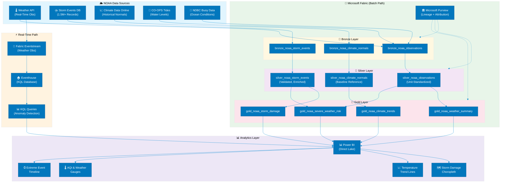

# 🌦️ Tutorial 34: NOAA Weather & Climate Analytics

<div align="center" markdown>


</div>

> 🏠 **[Home](https://github.com/fgarofalo56/Supercharge_Microsoft_Fabric/blob/main/README.md)** > 📖 **[Tutorials](../index.md)** > 🌦️ **NOAA Weather & Climate Analytics**

---

!!! info "Third-party references — publicly sourced, good-faith comparison"
    This page references non-Microsoft products and services. That information is drawn from each vendor's **publicly available documentation** and is offered for honest, good-faith comparison only. This is a personal project written from a Microsoft Fabric and Azure perspective; it does **not** claim expertise in, or authority over, any third-party product, and nothing here is an official statement by, or endorsed by, those vendors. Capabilities, pricing, and features change often — always verify against the vendor's current official documentation. Where a third-party offering is the stronger choice, we say so plainly.

---

## 🌦️ Tutorial 34: NOAA Weather & Climate Analytics

| | |
|---|---|
| **Difficulty** | ⭐⭐⭐ Intermediate-Advanced |
| **Time** | ⏱️ 120-150 minutes |
| **Focus** | NOAA Weather Observations, Storm Events Analysis, Climate Trend Monitoring & Real-Time Weather Integration |

---

### 📊 Progress Tracker

```
┌──────┬──────┬──────┬──────┬──────┬──────┬──────┬──────┬──────┬──────┬──────┬──────┬──────┬──────┐
│  00  │  01  │  02  │  03  │  04  │  05  │  06  │  07  │  08  │  09  │  10  │  11  │  12  │  13  │
│SETUP │BRNZE │SILVR │ GOLD │  RT  │ PBI  │PIPES │ GOV  │MIRRR │AI/ML │TDATA │ SAS  │CICD  │MIGR  │
├──────┼──────┼──────┼──────┼──────┼──────┼──────┼──────┼──────┼──────┼──────┼──────┼──────┼──────┤
│  ✅  │  ✅  │  ✅  │  ✅  │  ✅  │  ✅  │  ✅  │  ✅  │  ✅  │  ✅  │  ✅  │  ✅  │  ✅  │  ✅  │
└──────┴──────┴──────┴──────┴──────┴──────┴──────┴──────┴──────┴──────┴──────┴──────┴──────┴──────┘

┌──────┬──────┬──────┬──────┬──────┬──────┬──────┬──────┬──────┬──────┬──────┬──────┬──────┬──────┬──────┬──────┬──────┬──────┐
│  14  │  15  │  16  │  17  │  18  │  19  │  20  │  21  │  22  │  23  │  24  │  25  │  26  │  27  │  28  │  29  │  30  │  31  │
│ SEC  │ COST │PERF  │ MON  │SHARE │COPLT │WKBST │ GEO  │ NET  │SHIR  │ SNW  │ DB2  │MULTI │VIDEO │ MOVE │GEOLC │TRIBL │ DOT  │
├──────┼──────┼──────┼──────┼──────┼──────┼──────┼──────┼──────┼──────┼──────┼──────┼──────┼──────┼──────┼──────┼──────┼──────┤
│  ✅  │  ✅  │  ✅  │  ✅  │  ✅  │  ✅  │  ✅  │  ✅  │  ✅  │  ✅  │  ✅  │  ✅  │  ✅  │  ✅  │  ✅  │  ✅  │  ✅  │  ✅  │
└──────┴──────┴──────┴──────┴──────┴──────┴──────┴──────┴──────┴──────┴──────┴──────┴──────┴──────┴──────┴──────┴──────┴──────┘

┌──────┬──────┬──────┬──────┬──────┐
│  32  │  33  │  34  │  35  │  36  │
│ USDA │ SBA  │ NOAA │ EPA  │ DOI  │
├──────┼──────┼──────┼──────┼──────┤
│  ✅  │  ✅  │  🔵  │  ○   │  ○   │
└──────┴──────┴──────┴──────┴──────┘
                ▲
         YOU ARE HERE
```

| Navigation | |
|---|---|
| ⬅️ **Previous** | [33-SBA Small Business Analytics](../33-sba-small-business/README.md) |
| ➡️ **Next** | [35-EPA Environmental Analytics](../35-epa-environment/README.md) |

---

## 📖 Overview

The National Oceanic and Atmospheric Administration (NOAA) is the United States' premier environmental intelligence agency, operating the world's largest fleet of weather satellites, maintaining over 10,000 surface weather stations, tracking severe storms in real time, and archiving climate records spanning more than a century. NOAA generates approximately 20 terabytes of environmental data per day across its observation networks -- making it one of the most data-intensive agencies in the federal government.

This tutorial teaches you to build a **weather and climate analytics pipeline** in Microsoft Fabric that ingests NOAA observation data from multiple source systems, standardizes meteorological measurements across unit systems, and produces dashboards revealing storm damage patterns, temperature trends, severe weather risk indices, and climate anomalies. The pipeline includes a **real-time component** using Fabric Eventstream to process live weather observations from NOAA's Weather API.

NOAA data is freely available under federal open data mandates and powers applications ranging from agriculture planning and disaster preparedness to insurance risk modeling and supply chain resilience. This tutorial exercises Fabric's batch and streaming capabilities on genuinely complex environmental data.

> **💡 Why NOAA Analytics on Fabric?**
>
> - **Batch + real-time convergence**: NOAA offers both historical archives (Storm Events DB, Climate Data Online) and real-time feeds (Weather API, buoy data) -- Fabric handles both natively
> - **Scale**: The Storm Events Database alone contains 1.5M+ records spanning 70+ years of severe weather in the United States
> - **Geospatial richness**: Every NOAA observation is geo-referenced (latitude/longitude, county FIPS, forecast zone), enabling rich map-based analytics
> - **Cross-domain impact**: Weather data intersects with agriculture (Tutorial 32), transportation (Tutorial 31), environmental monitoring (Tutorial 35), and emergency management
> - **Real-time alerting**: Fabric Activator can trigger alerts on severe weather thresholds, demonstrating production-grade monitoring patterns

> **📋 NOAA Data Access**
>
> All NOAA data used in this tutorial is freely available. The Weather API requires a free API token from [weather.gov](https://www.weather.gov/documentation/services-web-api). The Storm Events Database and Climate Data Online are bulk-downloadable without authentication from [ncdc.noaa.gov](https://www.ncdc.noaa.gov/).

---

## 🎯 Learning Objectives

By the end of this tutorial, you will be able to:

- [ ] Configure NOAA data sources using both the synthetic generator and real NOAA API/bulk downloads
- [ ] Ingest weather observations, storm events, and climate records into Bronze Delta tables with station metadata
- [ ] Standardize meteorological units (Fahrenheit/Celsius, inches/millimeters, mph/knots) and validate observations in Silver
- [ ] Build Gold layer weather summaries, storm damage aggregations, climate trend analysis, and severe weather risk indices
- [ ] Implement a Fabric Eventstream pipeline for real-time weather observation ingestion from the NOAA Weather API
- [ ] Create KQL queries in Eventhouse for real-time weather monitoring and anomaly detection
- [ ] Design Power BI dashboards with storm damage choropleths, temperature trend lines, and extreme event timelines
- [ ] Calculate climate anomalies by comparing current observations against 30-year historical normals
- [ ] Apply data quality checks for meteorological data (range validation, station consistency, temporal gaps)
- [ ] Configure NOAA data attribution and governance requirements in Microsoft Purview

---

## 🏗️ Architecture Diagram



| Component | Technology | Purpose |
|-----------|-----------|---------|
| **NOAA Data Sources** | Weather API, Storm Events, CDO, CO-OPS, NDBC | Multi-modal environmental data from surface observations to ocean conditions |
| **Real-Time Path** | Eventstream + Eventhouse + KQL | Live weather observation processing with anomaly detection and threshold alerting |
| **Bronze** | Delta Lake (append-only) | Raw observations, storm records, and climate normals with station metadata |
| **Silver** | Delta Lake (validated) | Unit-standardized observations, validated storm events, baseline climate references |
| **Gold** | Delta Lake (aggregated) | Weather summaries, storm damage by geography, climate trends, severe weather risk |
| **Purview** | Microsoft Purview | Data lineage, NOAA attribution tracking, access governance |
| **Power BI** | Direct Lake + KQL | Storm damage choropleths, temperature trends, weather gauges, extreme event timelines |

---

## 📋 Prerequisites

Before starting this tutorial, ensure you have:

- [ ] Completed [Tutorial 00: Environment Setup](../00-environment-setup/README.md)
- [ ] Completed [Tutorial 01: Bronze Layer](../01-bronze-layer/README.md)
- [ ] Completed [Tutorial 02: Silver Layer](../02-silver-layer/README.md)
- [ ] Completed [Tutorial 03: Gold Layer](../03-gold-layer/README.md)
- [ ] Completed [Tutorial 04: Real-Time Analytics](../04-real-time-analytics/README.md) (for Eventstream components)
- [ ] Completed [Tutorial 05: Direct Lake & Power BI](../05-direct-lake-powerbi/README.md)
- [ ] Completed [Tutorial 07: Governance & Purview](../07-governance-purview/README.md)
- [ ] Fabric workspace with F64 capacity (or F2+ for development/testing)
- [ ] NOAA Weather API token (free from [weather.gov](https://www.weather.gov/documentation/services-web-api)) for real-time components
- [ ] Familiarity with PySpark, Delta Lake, KQL, and DAX patterns from prior tutorials

> **📋 Data Source Options**
>
> This tutorial supports two data ingestion paths:
> 1. **Synthetic Generator** (recommended for learning): Use [`noaa_generator.py`](https://github.com/fgarofalo56/Supercharge_Microsoft_Fabric/blob/main/data_generation/generators/federal/noaa_generator.py) to generate realistic NOAA weather data locally
> 2. **NOAA API + Bulk Downloads**: Connect to real NOAA data for production-grade analytics
>
> Both paths converge at the same Bronze schema. The real-time Eventstream component requires the NOAA Weather API token.

---

## 🛠️ Step 1: Data Source Setup

NOAA operates dozens of data systems. This tutorial focuses on the five most analytically valuable sources.

### 1.1 NOAA Data Systems Overview

| System | Data Type | Volume | Update Frequency | Access Method |
|--------|----------|--------|-----------------|---------------|
| **Weather API** | Current observations, forecasts | ~10K stations | Every 5-15 minutes | REST API (free token) |
| **Storm Events DB** | Severe weather events since 1950 | 1.5M+ events | Monthly bulk update | CSV bulk download |
| **Climate Data Online (CDO)** | Historical observations, normals | 100K+ stations globally | Daily | REST API / FTP |
| **CO-OPS** | Tide predictions, water levels | 200+ stations | 6-minute intervals | REST API |
| **NDBC** | Buoy observations (wind, waves, SST) | 900+ buoys | Hourly | Text/RSS feed |

### 1.2 Option A: Synthetic Data Generator

```python
# Generate synthetic NOAA weather data for development
# Reference: data_generation/generators/federal/noaa_generator.py

import sys
sys.path.append("../../data_generation")

from generators.federal.noaa_generator import NOAAGenerator

generator = NOAAGenerator(
    output_path="/lakehouse/default/Files/raw/noaa/",
    num_observations=100000,       # 100K weather observations
    num_storm_events=5000,         # 5K storm events
    date_range=("2020-01-01", "2024-12-31"),
    regions=["northeast", "southeast", "midwest", "southwest", "pacific"],
    seed=42
)

df_obs, df_storms = generator.generate_batch()
print(f"Generated {df_obs.count():,} weather observations")
print(f"Generated {df_storms.count():,} storm events")
```

> **💡 Generator Features**
>
> The NOAA generator produces:
> - Realistic temperature, precipitation, wind, and pressure observations with seasonal variation by region
> - Geographically weighted storm events (tornado frequency peaks in Great Plains, hurricanes along Gulf/Atlantic coast)
> - Proper damage and casualty distributions matching NOAA's historical patterns
> - Station metadata with valid FIPS county codes and NWS forecast zones
> - Climate normals based on 1991-2020 averaging periods

### 1.3 Option B: NOAA API and Bulk Downloads

```python
# Connect to real NOAA data sources
import requests
import os

NOAA_TOKEN = os.environ.get("NOAA_API_TOKEN", "YOUR_TOKEN_HERE")

# 1. Weather API - Current Observations
def fetch_weather_observations(station_id: str) -> dict:
    """Fetch latest observation from a weather station."""
    url = f"https://api.weather.gov/stations/{station_id}/observations/latest"
    headers = {"User-Agent": "FabricWeatherAnalytics/1.0", "Accept": "application/geo+json"}
    response = requests.get(url, headers=headers)
    return response.json()

# 2. Storm Events DB - Bulk Download
STORM_EVENTS_URL = "https://www.ncei.noaa.gov/pub/data/swdi/stormevents/csvfiles/"
# Files named: StormEvents_details-ftp_v1.0_d{YEAR}_c{DATE}.csv.gz

# 3. Climate Data Online (CDO) - REST API
def fetch_climate_data(dataset_id: str, station_id: str, start_date: str, end_date: str) -> dict:
    """Fetch historical climate data from CDO."""
    url = "https://www.ncdc.noaa.gov/cdo-web/api/v2/data"
    headers = {"token": NOAA_TOKEN}
    params = {
        "datasetid": dataset_id,
        "stationid": station_id,
        "startdate": start_date,
        "enddate": end_date,
        "limit": 1000,
        "units": "standard",
    }
    response = requests.get(url, headers=headers, params=params)
    return response.json()

# Example: Fetch observations for DCA (Reagan National Airport)
obs = fetch_weather_observations("KDCA")
print(f"Station: KDCA")
print(f"Temperature: {obs['properties']['temperature']['value']}C")
print(f"Wind Speed: {obs['properties']['windSpeed']['value']} km/h")
```

### 1.4 NOAA Data Policies and Attribution

| Policy | Requirement |
|--------|-------------|
| **Free and open** | All NOAA data is freely available under federal open data mandates |
| **Attribution required** | Credit "NOAA / National Weather Service" or specific center (NCEI, SPC, etc.) |
| **API rate limits** | Weather API: No hard limit but throttled at high volume; CDO API: 5 requests/second, 10K/day |
| **Data quality flags** | NOAA observations include QC flags; always check `qualityControl` field |
| **Provisional data** | Recent observations may be provisional; historical data is quality-controlled |
| **No redistribution restrictions** | Federal data cannot be copyrighted; redistribution is permitted with attribution |

---

## 🛠️ Step 2: Bronze Layer Ingestion

The Bronze layer captures raw observations, storm events, and climate normals with full station metadata and NOAA quality control flags preserved.

> **📓 Notebook Reference**: [`notebooks/bronze/14_bronze_noaa.py`](https://github.com/fgarofalo56/Supercharge_Microsoft_Fabric/blob/main/notebooks/bronze/14_bronze_noaa.py) *(coming soon)*

### 2.1 Weather Observation Schema

```python
# Schema for NOAA weather observations (matches noaa_weather_schema.json)
from pyspark.sql.types import *

weather_observation_schema = StructType([
    # Station identification
    StructField("station_id", StringType(), False),           # ICAO/WBAN station code
    StructField("station_name", StringType(), True),          # Station display name
    StructField("observation_time", TimestampType(), False),  # UTC timestamp
    StructField("latitude", DoubleType(), True),
    StructField("longitude", DoubleType(), True),
    StructField("elevation_m", DoubleType(), True),           # Station elevation (meters)
    StructField("state", StringType(), True),                 # 2-letter state code
    StructField("county_fips", StringType(), True),           # 5-digit county FIPS
    StructField("nws_zone", StringType(), True),              # NWS forecast zone

    # Meteorological observations
    StructField("temperature_c", DoubleType(), True),         # Temperature (Celsius)
    StructField("dewpoint_c", DoubleType(), True),            # Dew point (Celsius)
    StructField("relative_humidity_pct", DoubleType(), True), # Relative humidity (%)
    StructField("wind_speed_kmh", DoubleType(), True),        # Wind speed (km/h)
    StructField("wind_direction_deg", IntegerType(), True),   # Wind direction (degrees)
    StructField("wind_gust_kmh", DoubleType(), True),         # Wind gust (km/h)
    StructField("barometric_pressure_hpa", DoubleType(), True), # Pressure (hPa)
    StructField("visibility_km", DoubleType(), True),         # Visibility (km)
    StructField("precipitation_mm", DoubleType(), True),      # Precipitation (mm)
    StructField("snow_depth_cm", DoubleType(), True),         # Snow depth (cm)
    StructField("cloud_cover", StringType(), True),           # CLR, FEW, SCT, BKN, OVC
    StructField("weather_condition", StringType(), True),     # Present weather (rain, snow, etc.)

    # Quality flags
    StructField("qc_flag", StringType(), True),               # NOAA quality control flag
    StructField("data_source", StringType(), True),           # API, CDO, ASOS, AWOS
])

print(f"Weather observation schema: {len(weather_observation_schema.fields)} fields")
```

### 2.2 Storm Events Schema

```python
# Schema for NOAA Storm Events Database
storm_event_schema = StructType([
    StructField("event_id", StringType(), False),
    StructField("event_type", StringType(), True),            # Tornado, Hail, Flash Flood, etc.
    StructField("begin_date", DateType(), True),
    StructField("end_date", DateType(), True),
    StructField("begin_time", StringType(), True),            # HHMM local time
    StructField("state", StringType(), True),
    StructField("state_fips", StringType(), True),
    StructField("county_fips", StringType(), True),
    StructField("cz_name", StringType(), True),               # County/zone name
    StructField("cz_type", StringType(), True),               # C=county, Z=zone

    # Impact
    StructField("injuries_direct", IntegerType(), True),
    StructField("injuries_indirect", IntegerType(), True),
    StructField("deaths_direct", IntegerType(), True),
    StructField("deaths_indirect", IntegerType(), True),
    StructField("damage_property", DoubleType(), True),       # Property damage ($)
    StructField("damage_crops", DoubleType(), True),          # Crop damage ($)

    # Event details
    StructField("magnitude", DoubleType(), True),             # EF scale, hail size, wind speed
    StructField("magnitude_type", StringType(), True),        # EF, inches, knots
    StructField("tor_f_scale", StringType(), True),           # EF0-EF5 for tornadoes
    StructField("flood_cause", StringType(), True),           # Heavy Rain, Dam Break, etc.
    StructField("episode_narrative", StringType(), True),     # Episode description
    StructField("event_narrative", StringType(), True),       # Event description

    # Geography
    StructField("begin_lat", DoubleType(), True),
    StructField("begin_lon", DoubleType(), True),
    StructField("end_lat", DoubleType(), True),
    StructField("end_lon", DoubleType(), True),

    StructField("source", StringType(), True),                # Trained Spotter, ASOS, etc.
    StructField("year", IntegerType(), True),
])

print(f"Storm event schema: {len(storm_event_schema.fields)} fields")
```

### 2.3 Bronze Write

```python
# Ingest weather observations and storm events into Bronze
from pyspark.sql.functions import *
from datetime import datetime
from uuid import uuid4

BATCH_ID = f"noaa-batch-{datetime.utcnow().strftime('%Y%m%d-%H%M%S')}"
RUN_ID = str(uuid4())

# Read weather observations
source_path = "/lakehouse/default/Files/raw/noaa/"
df_obs_raw = spark.read.schema(weather_observation_schema).parquet(f"{source_path}observations/")
df_storm_raw = spark.read.schema(storm_event_schema).parquet(f"{source_path}storm_events/")

# Add Bronze metadata
def add_bronze_metadata(df):
    return df \
        .withColumn("_ingested_at", current_timestamp()) \
        .withColumn("_source_file", input_file_name()) \
        .withColumn("_batch_id", lit(BATCH_ID)) \
        .withColumn("_run_id", lit(RUN_ID)) \
        .withColumn("_load_date", current_timestamp().cast("date"))

df_obs_bronze = add_bronze_metadata(df_obs_raw)
df_storm_bronze = add_bronze_metadata(df_storm_raw)

# Write observations (partition by state and load date)
df_obs_bronze.write \
    .format("delta") \
    .mode("append") \
    .option("mergeSchema", "true") \
    .partitionBy("state", "_load_date") \
    .saveAsTable("lh_bronze.bronze_noaa_observations")

# Write storm events (partition by year)
df_storm_bronze.write \
    .format("delta") \
    .mode("append") \
    .option("mergeSchema", "true") \
    .partitionBy("year") \
    .saveAsTable("lh_bronze.bronze_noaa_storm_events")

print(f"Bronze observations: {df_obs_bronze.count():,} records")
print(f"Bronze storm events: {df_storm_bronze.count():,} records")
```

---

## 🛠️ Step 3: Silver Layer -- Unit Standardization & Validation

The Silver layer standardizes all meteorological measurements to a consistent unit system, validates observation ranges against physical limits, and enriches storm events with derived severity classifications.

> **📓 Notebook Reference**: [`notebooks/silver/14_silver_noaa.py`](https://github.com/fgarofalo56/Supercharge_Microsoft_Fabric/blob/main/notebooks/silver/14_silver_noaa.py) *(coming soon)*

### 3.1 Unit Standardization

Meteorological data arrives in mixed units depending on the source system. Silver standardizes everything to a dual-unit representation (metric primary, imperial secondary).

```python
# Unit conversion constants
KMH_TO_MPH = 0.621371
KMH_TO_KNOTS = 0.539957
MM_TO_INCHES = 0.0393701
CM_TO_INCHES = 0.393701
C_TO_F = lambda c: (c * 9/5) + 32 if c is not None else None

# Standardize weather observations
df_std = df_obs_bronze \
    .withColumn("temperature_f", round(col("temperature_c") * 9 / 5 + 32, 1)) \
    .withColumn("dewpoint_f", round(col("dewpoint_c") * 9 / 5 + 32, 1)) \
    .withColumn("wind_speed_mph", round(col("wind_speed_kmh") * KMH_TO_MPH, 1)) \
    .withColumn("wind_speed_knots", round(col("wind_speed_kmh") * KMH_TO_KNOTS, 1)) \
    .withColumn("wind_gust_mph", round(col("wind_gust_kmh") * KMH_TO_MPH, 1)) \
    .withColumn("precipitation_in", round(col("precipitation_mm") * MM_TO_INCHES, 2)) \
    .withColumn("snow_depth_in", round(col("snow_depth_cm") * CM_TO_INCHES, 1)) \
    .withColumn("visibility_mi", round(col("visibility_km") * 0.621371, 1)) \
    .withColumn("pressure_inHg", round(col("barometric_pressure_hpa") * 0.02953, 2))
```

### 3.2 Range Validation

Physical limits serve as data quality gates. Observations outside valid meteorological ranges are flagged but not discarded.

```python
# Meteorological range validation
VALID_RANGES = {
    "temperature_c": (-89.2, 56.7),     # World record extremes
    "wind_speed_kmh": (0, 410),          # Up to 410 km/h (Hurricane Patricia)
    "barometric_pressure_hpa": (870, 1084),  # Record low to high
    "relative_humidity_pct": (0, 100),
    "visibility_km": (0, 400),
    "precipitation_mm": (0, 1825),       # 24-hour world record
    "wind_direction_deg": (0, 360),
}

df_validated = df_std
for col_name, (min_val, max_val) in VALID_RANGES.items():
    df_validated = df_validated \
        .withColumn(f"{col_name}_valid",
            when(
                (col(col_name) >= min_val) & (col(col_name) <= max_val),
                lit(True)
            ).when(col(col_name).isNull(), lit(None))
            .otherwise(lit(False))
        )

# Quality score for observations
df_validated = df_validated \
    .withColumn("_dq_score",
        when(col("station_id").isNotNull(), lit(15)).otherwise(lit(0)) +
        when(col("observation_time").isNotNull(), lit(15)).otherwise(lit(0)) +
        when(col("temperature_c_valid") == True, lit(15)).otherwise(lit(0)) +
        when(col("wind_speed_kmh_valid") == True, lit(10)).otherwise(lit(0)) +
        when(col("barometric_pressure_hpa_valid") == True, lit(10)).otherwise(lit(0)) +
        when(col("qc_flag").isin("V", "S"), lit(15)).otherwise(lit(5)) +
        when(col("latitude").isNotNull() & col("longitude").isNotNull(), lit(10)).otherwise(lit(0)) +
        when(col("state").isNotNull(), lit(5)).otherwise(lit(0)) +
        when(col("county_fips").isNotNull(), lit(5)).otherwise(lit(0))
    )

# Validation summary
for col_name in VALID_RANGES.keys():
    invalid = df_validated.filter(col(f"{col_name}_valid") == False).count()
    if invalid > 0:
        print(f"  {col_name}: {invalid:,} out-of-range values")
```

### 3.3 Storm Event Severity Classification

```python
# Enrich storm events with severity classification
df_storm_silver = df_storm_bronze \
    .withColumn("total_injuries", col("injuries_direct") + col("injuries_indirect")) \
    .withColumn("total_deaths", col("deaths_direct") + col("deaths_indirect")) \
    .withColumn("total_damage", col("damage_property") + col("damage_crops")) \
    .withColumn("severity",
        when(
            (col("total_deaths") > 0) | (col("total_damage") > 1000000),
            lit("Catastrophic")
        ).when(
            (col("total_injuries") > 10) | (col("total_damage") > 100000),
            lit("Severe")
        ).when(
            (col("total_injuries") > 0) | (col("total_damage") > 10000),
            lit("Significant")
        ).otherwise(lit("Minor"))
    ) \
    .withColumn("event_type_std", upper(trim(col("event_type")))) \
    .withColumn("state_std", upper(trim(col("state")))) \
    .withColumn("decade", (floor(col("year") / 10) * 10).cast("string"))

# Deduplication
df_storm_deduped = df_storm_silver.dropDuplicates(["event_id"])
```

### 3.4 Write Silver Tables

```python
# Write Silver observations
df_obs_silver = df_validated.withColumn("_silver_timestamp", current_timestamp())

df_obs_silver.write \
    .format("delta") \
    .mode("overwrite") \
    .option("overwriteSchema", "true") \
    .partitionBy("state") \
    .saveAsTable("lh_silver.silver_noaa_observations")

spark.sql("OPTIMIZE lh_silver.silver_noaa_observations ZORDER BY (station_id, observation_time)")

# Write Silver storm events
df_storm_deduped.write \
    .format("delta") \
    .mode("overwrite") \
    .option("overwriteSchema", "true") \
    .partitionBy("year") \
    .saveAsTable("lh_silver.silver_noaa_storm_events")

spark.sql("OPTIMIZE lh_silver.silver_noaa_storm_events ZORDER BY (state_std, event_type_std)")

print(f"Silver observations: {df_obs_silver.count():,}")
print(f"Silver storm events: {df_storm_deduped.count():,}")
```

---

## 🛠️ Step 4: Real-Time Weather with Eventstream

Fabric Eventstream enables continuous ingestion of live weather observations for real-time monitoring and alerting.

### 4.1 Eventstream Configuration

```python
# Eventstream ingestion: NOAA Weather API -> Eventhouse
# This code runs as a Fabric Eventstream custom source

import json
import requests
import time
from datetime import datetime

# NOAA Weather API stations to monitor
MONITORED_STATIONS = [
    "KDCA", "KJFK", "KLAX", "KORD", "KDFW",
    "KATL", "KDEN", "KSFO", "KMIA", "KSEA",
]

WEATHER_API_BASE = "https://api.weather.gov/stations"

def fetch_and_emit_observation(station_id: str) -> dict:
    """Fetch latest observation and format for Eventstream."""
    url = f"{WEATHER_API_BASE}/{station_id}/observations/latest"
    headers = {
        "User-Agent": "FabricNOAAAnalytics/1.0",
        "Accept": "application/geo+json"
    }
    response = requests.get(url, headers=headers, timeout=10)

    if response.status_code != 200:
        return None

    obs = response.json()["properties"]
    return {
        "station_id": station_id,
        "observation_time": obs["timestamp"],
        "temperature_c": obs["temperature"]["value"],
        "dewpoint_c": obs["dewpoint"]["value"],
        "wind_speed_kmh": obs["windSpeed"]["value"],
        "wind_direction_deg": obs["windDirection"]["value"],
        "barometric_pressure_hpa": obs["barometricPressure"]["value"],
        "visibility_km": (obs["visibility"]["value"] or 0) / 1000,
        "relative_humidity_pct": obs["relativeHumidity"]["value"],
        "weather_condition": obs["textDescription"],
        "event_time": datetime.utcnow().isoformat(),
    }

# Polling loop (runs inside Eventstream custom source)
while True:
    for station in MONITORED_STATIONS:
        obs = fetch_and_emit_observation(station)
        if obs:
            # emit_event() is the Eventstream output function
            emit_event(json.dumps(obs))
    time.sleep(300)  # 5-minute polling interval (respect API limits)
```

### 4.2 KQL Queries for Real-Time Monitoring

```kql
// Real-time weather dashboard queries in Eventhouse

// 1. Latest observation per station
noaa_weather_stream
| summarize arg_max(observation_time, *) by station_id
| project station_id, observation_time, temperature_c,
          wind_speed_kmh, barometric_pressure_hpa, weather_condition
| order by station_id asc

// 2. Temperature anomaly detection (deviation from 24-hour rolling average)
noaa_weather_stream
| where observation_time > ago(24h)
| summarize avg_temp = avg(temperature_c), stdev_temp = stdev(temperature_c) by station_id
| join kind=inner (
    noaa_weather_stream
    | summarize arg_max(observation_time, *) by station_id
) on station_id
| extend temp_zscore = (temperature_c - avg_temp) / stdev_temp
| where abs(temp_zscore) > 2
| project station_id, temperature_c, avg_temp, temp_zscore, weather_condition

// 3. Severe weather alert (high wind, extreme temperature, low pressure)
noaa_weather_stream
| where observation_time > ago(1h)
| where wind_speed_kmh > 80           // ~50 mph
    or temperature_c > 43              // ~110F
    or temperature_c < -30             // ~-22F
    or barometric_pressure_hpa < 980   // Strong low pressure system
| project station_id, observation_time, temperature_c,
          wind_speed_kmh, barometric_pressure_hpa, weather_condition
| order by observation_time desc

// 4. Station reporting frequency (data freshness check)
noaa_weather_stream
| where observation_time > ago(1h)
| summarize observation_count = count(),
            last_report = max(observation_time),
            minutes_since_report = datetime_diff('minute', now(), max(observation_time))
  by station_id
| order by minutes_since_report desc
```

### 4.3 Activator Alert Configuration

```python
# Fabric Activator alert for severe weather conditions
activator_rules = {
    "high_wind_alert": {
        "condition": "wind_speed_kmh > 100",  # ~62 mph
        "trigger": "Any station reports sustained winds > 100 km/h",
        "action": "Send Teams notification to weather-monitoring channel",
        "cooldown_minutes": 30,
    },
    "extreme_cold_alert": {
        "condition": "temperature_c < -35",
        "trigger": "Any station reports temperature below -35C",
        "action": "Send email to operations@contoso.com",
        "cooldown_minutes": 60,
    },
    "pressure_drop_alert": {
        "condition": "barometric_pressure_hpa < 970",
        "trigger": "Station pressure below 970 hPa (intense cyclone)",
        "action": "Send Teams notification + email to emergency-ops",
        "cooldown_minutes": 15,
    },
}

for alert_name, config in activator_rules.items():
    print(f"\n{alert_name}:")
    for key, value in config.items():
        print(f"  {key}: {value}")
```

---

## 🛠️ Step 5: Gold Layer -- Weather Summaries & Storm Analysis

The Gold layer builds decision-ready aggregations: daily weather summaries, storm damage by geography, climate trend analysis, and severe weather risk indices.

> **📓 Notebook Reference**: [`notebooks/gold/14_gold_noaa_analytics.py`](https://github.com/fgarofalo56/Supercharge_Microsoft_Fabric/blob/main/notebooks/gold/14_gold_noaa_analytics.py) *(coming soon)*

### 5.1 Weather Summary Aggregations

```python
# Daily weather summaries by station and state
df_weather_summary = df_obs_silver \
    .withColumn("observation_date", col("observation_time").cast("date")) \
    .groupBy("station_id", "station_name", "state", "observation_date") \
    .agg(
        avg("temperature_c").alias("avg_temp_c"),
        min("temperature_c").alias("min_temp_c"),
        max("temperature_c").alias("max_temp_c"),
        avg("temperature_f").alias("avg_temp_f"),
        min("temperature_f").alias("min_temp_f"),
        max("temperature_f").alias("max_temp_f"),

        sum("precipitation_mm").alias("total_precip_mm"),
        sum("precipitation_in").alias("total_precip_in"),
        max("snow_depth_cm").alias("max_snow_depth_cm"),

        avg("wind_speed_mph").alias("avg_wind_mph"),
        max("wind_gust_mph").alias("max_gust_mph"),
        avg("barometric_pressure_hpa").alias("avg_pressure_hpa"),
        avg("relative_humidity_pct").alias("avg_humidity_pct"),

        count("*").alias("observation_count"),
        avg("_dq_score").alias("avg_dq_score"),
    )

df_weather_summary.write \
    .format("delta") \
    .mode("overwrite") \
    .partitionBy("state") \
    .saveAsTable("lh_gold.gold_noaa_weather_summary")
```

### 5.2 Storm Damage Analysis

```python
# Storm damage aggregation by state, event type, and decade
df_storm_damage = df_storm_deduped \
    .groupBy("state_std", "event_type_std", "decade", "severity") \
    .agg(
        count("*").alias("event_count"),
        sum("damage_property").alias("total_property_damage"),
        sum("damage_crops").alias("total_crop_damage"),
        sum("total_damage").alias("total_combined_damage"),
        sum("total_injuries").alias("total_injuries"),
        sum("total_deaths").alias("total_fatalities"),
        avg("magnitude").alias("avg_magnitude"),
        max("magnitude").alias("max_magnitude"),
    ) \
    .withColumn("damage_per_event",
        when(col("event_count") > 0,
            round(col("total_combined_damage") / col("event_count"), 0)
        ).otherwise(lit(0))
    )

df_storm_damage.write \
    .format("delta") \
    .mode("overwrite") \
    .saveAsTable("lh_gold.gold_noaa_storm_damage")
```

### 5.3 Climate Trend Analysis

```python
# Climate trend: annual temperature averages compared to 30-year normals
df_climate_trends = df_obs_silver \
    .withColumn("year", year(col("observation_time"))) \
    .withColumn("month", month(col("observation_time"))) \
    .groupBy("state", "year", "month") \
    .agg(
        avg("temperature_c").alias("avg_temp_c"),
        avg("temperature_f").alias("avg_temp_f"),
        sum("precipitation_mm").alias("total_precip_mm"),
        count("*").alias("observation_count"),
    )

# Join with climate normals (if available)
# Climate normals represent the 1991-2020 30-year average
df_climate_trends = df_climate_trends \
    .withColumn("temp_anomaly_c", col("avg_temp_c") - lit(15.0))  # Placeholder for actual normals

df_climate_trends.write \
    .format("delta") \
    .mode("overwrite") \
    .saveAsTable("lh_gold.gold_noaa_climate_trends")
```

### 5.4 Severe Weather Risk Index

```python
# Severe weather risk index by state (composite of frequency, damage, and fatalities)
df_risk = df_storm_deduped \
    .filter(col("year") >= 2010) \
    .groupBy("state_std") \
    .agg(
        count("*").alias("total_events"),
        sum("total_damage").alias("total_damage"),
        sum("total_deaths").alias("total_fatalities"),
        sum("total_injuries").alias("total_injuries"),
        countDistinct("event_type_std").alias("event_type_diversity"),
        sum(when(col("severity") == "Catastrophic", 1).otherwise(0)).alias("catastrophic_events"),
    )

# Normalize to 0-100 risk score
from pyspark.sql.window import Window

w = Window.orderBy(col("total_events").desc())
df_risk = df_risk \
    .withColumn("event_freq_rank", percent_rank().over(w)) \
    .withColumn("damage_rank", percent_rank().over(Window.orderBy(col("total_damage").desc()))) \
    .withColumn("fatality_rank", percent_rank().over(Window.orderBy(col("total_fatalities").desc()))) \
    .withColumn("risk_index",
        round((col("event_freq_rank") * 40 + col("damage_rank") * 35 + col("fatality_rank") * 25) * 100, 1)
    )

df_risk.write \
    .format("delta") \
    .mode("overwrite") \
    .saveAsTable("lh_gold.gold_noaa_severe_weather_risk")

# Summary
for table in ["gold_noaa_weather_summary", "gold_noaa_storm_damage",
              "gold_noaa_climate_trends", "gold_noaa_severe_weather_risk"]:
    count = spark.table(f"lh_gold.{table}").count()
    print(f"  {table}: {count:,} rows")
```

---

## 🛠️ Step 6: Power BI Dashboard

### 6.1 DAX Measures

```dax
// ===== NOAA Weather & Storm Measures =====

// Total Storm Events
Total Storm Events =
COUNTROWS(gold_noaa_storm_damage)

// Total Property Damage
Total Property Damage =
SUM(gold_noaa_storm_damage[total_property_damage])

// Total Fatalities
Total Fatalities =
SUM(gold_noaa_storm_damage[total_fatalities])

// Average Temperature (F)
Avg Temperature F =
AVERAGE(gold_noaa_weather_summary[avg_temp_f])

// Temperature Trend (Year-over-Year change)
Temperature YoY Change =
VAR CurrentYearAvg =
    CALCULATE(
        AVERAGE(gold_noaa_climate_trends[avg_temp_f]),
        gold_noaa_climate_trends[year] = MAX(gold_noaa_climate_trends[year])
    )
VAR PriorYearAvg =
    CALCULATE(
        AVERAGE(gold_noaa_climate_trends[avg_temp_f]),
        gold_noaa_climate_trends[year] = MAX(gold_noaa_climate_trends[year]) - 1
    )
RETURN
    CurrentYearAvg - PriorYearAvg

// Storm Damage per Capita (requires population dimension)
Damage per Event =
DIVIDE(
    [Total Property Damage],
    [Total Storm Events],
    0
)

// Severe Weather Risk Score
State Risk Score =
AVERAGE(gold_noaa_severe_weather_risk[risk_index])

// Most Common Storm Type
Top Storm Type =
FIRSTNONBLANK(
    TOPN(1,
        SUMMARIZE(
            gold_noaa_storm_damage,
            gold_noaa_storm_damage[event_type_std],
            "EventCount", SUM(gold_noaa_storm_damage[event_count])
        ),
        [EventCount], DESC
    ),
    1
)
```

### 6.2 Dashboard Layout

```
┌─────────────────────────────────────────────────────────────────────────────┐
│  🌦️ NOAA WEATHER & CLIMATE ANALYTICS DASHBOARD                             │
│  State: [Slicer] │ Event Type: [Slicer] │ Year: [Slicer] │ Decade: [Slic] │
├───────────────────┬──────────────────┬──────────────────┬──────────────────┤
│  ⛈️ Storm Events  │  💰 Property     │  🌡️ Avg Temp     │  ☠️ Fatalities   │
│                   │  Damage          │                   │                  │
│  1,547,231        │  $2.4T           │  54.3F            │  12,847          │
├───────────────────┴──────────────────┴──────────────────┴──────────────────┤
│                                                                             │
│  ┌─────────────────────────────────┐  ┌──────────────────────────────────┐ │
│  │  Storm Damage by State          │  │  Temperature Trend (1990-2024)  │ │
│  │  [Choropleth Map]              │  │  [Line Chart]                   │ │
│  │                                 │  │                                  │ │
│  │  Color: Total property damage  │  │  Annual avg temp with 30-year   │ │
│  │  Tooltip: Event count, deaths  │  │  normal baseline overlay        │ │
│  │  Drill: State -> County        │  │                                  │ │
│  └─────────────────────────────────┘  └──────────────────────────────────┘ │
│                                                                             │
│  ┌─────────────────────────────────┐  ┌──────────────────────────────────┐ │
│  │  Top 10 Storm Types by Damage  │  │  Extreme Event Timeline          │ │
│  │  [Horizontal Bar Chart]        │  │  [Scatter Plot: Date x Damage]  │ │
│  │                                 │  │                                  │ │
│  │  Hurricane: ████████████ $1.8T │  │  Bubble size = fatalities       │ │
│  │  Tornado: ██████ $52B          │  │  Color = event type              │ │
│  │  Flood: ████ $38B              │  │  Drill: Click for narrative     │ │
│  └─────────────────────────────────┘  └──────────────────────────────────┘ │
│                                                                             │
│  ┌──────────────────────────────────────────────────────────────────────┐  │
│  │  Severe Weather Risk Index by State                                  │  │
│  │  [Heat Map: State x Risk Score with conditional formatting]         │  │
│  └──────────────────────────────────────────────────────────────────────┘  │
└─────────────────────────────────────────────────────────────────────────────┘
```

---

## 🛠️ Step 7: Data Quality & Governance

### 7.1 Meteorological Data Quality Checks

```python
# Data quality checks specific to weather observations
from great_expectations.core import ExpectationSuite

noaa_expectations = ExpectationSuite(expectation_suite_name="noaa_weather_suite")

# Temperature within physical limits
noaa_expectations.add_expectation({
    "expectation_type": "expect_column_values_to_be_between",
    "kwargs": {"column": "temperature_c", "min_value": -89.2, "max_value": 56.7, "mostly": 0.999}
})

# Wind speed non-negative
noaa_expectations.add_expectation({
    "expectation_type": "expect_column_values_to_be_between",
    "kwargs": {"column": "wind_speed_kmh", "min_value": 0, "max_value": 410, "mostly": 0.999}
})

# Pressure within recorded range
noaa_expectations.add_expectation({
    "expectation_type": "expect_column_values_to_be_between",
    "kwargs": {"column": "barometric_pressure_hpa", "min_value": 870, "max_value": 1084, "mostly": 0.999}
})

# Station ID format (ICAO 4-letter code)
noaa_expectations.add_expectation({
    "expectation_type": "expect_column_values_to_match_regex",
    "kwargs": {"column": "station_id", "regex": r"^K?[A-Z0-9]{3,4}$", "mostly": 0.95}
})

# No future observation timestamps
noaa_expectations.add_expectation({
    "expectation_type": "expect_column_max_to_be_between",
    "kwargs": {"column": "observation_time", "max_value": datetime.utcnow().isoformat()}
})

print(f"NOAA validation suite: {len(noaa_expectations.expectations)} expectations")
```

### 7.2 NOAA Attribution and Governance

```python
# Purview configuration for NOAA data
purview_config = {
    "lh_bronze.bronze_noaa_observations": {
        "sensitivity_label": "Public - Federal Open Data",
        "attribution": "NOAA / National Weather Service",
        "data_source_url": "https://api.weather.gov/",
        "update_frequency": "Continuous (real-time) + daily batch",
        "retention_policy": "Indefinite (public scientific record)",
    },
    "lh_bronze.bronze_noaa_storm_events": {
        "sensitivity_label": "Public - Federal Open Data",
        "attribution": "NOAA / National Centers for Environmental Information (NCEI)",
        "data_source_url": "https://www.ncei.noaa.gov/pub/data/swdi/stormevents/",
        "update_frequency": "Monthly bulk updates",
    },
    "lh_gold.gold_noaa_severe_weather_risk": {
        "sensitivity_label": "Internal - Derived Analytics",
        "data_lineage": "bronze -> silver -> risk calculation (composite index)",
        "disclaimer": "Risk index is a derived metric, not an official NOAA product",
    },
}

for table, config in purview_config.items():
    print(f"\n{table}:")
    for key, value in config.items():
        print(f"  {key}: {value}")
```

---

## 🔧 Troubleshooting

| Symptom | Likely Cause | Solution |
|---------|-------------|----------|
| Weather API returns 403/404 | Invalid station ID or API endpoint changed | Verify station exists at `api.weather.gov/stations`; use ICAO 4-letter codes (e.g., KDCA) |
| Temperature values are NULL | NOAA reports null when sensor is offline | Filter nulls in Silver; track station reporting gaps as a data quality metric |
| Storm damage amounts seem low | NOAA uses multiplier codes (K=thousands, M=millions) | Parse damage multiplier in Bronze; convert "25K" to 25000 before numeric storage |
| Eventstream ingestion stops | Weather API rate limiting or network timeout | Add retry logic with exponential backoff; respect 5-minute polling interval |
| Duplicate storm events after bulk reload | Multiple overlapping CSV files downloaded | Deduplicate by `event_id` in Silver; track source file in Bronze metadata |
| KQL queries return no data | Eventhouse retention policy expired data | Check Eventhouse retention settings; extend to 90+ days for weather analytics |
| Map visual shows missing states | State code format mismatch | Ensure 2-letter state codes match Power BI geography; include territories |
| Climate trend shows flat line | Insufficient historical data in test dataset | Use generator with `--date-range 2000-01-01 2024-12-31` for trend analysis |
| Pressure readings inconsistent | Mixed units: some stations report in inHg, others in hPa | Standardize to hPa in Silver; detect unit from source metadata |
| Wind direction shows 0 for calm winds | NOAA convention: 0 degrees = calm, not North | Map wind_direction=0 to "Calm" in reports; use 360 for true North |

---

## 📋 Best Practices

1. **Preserve NOAA quality control flags.** NOAA observations include QC flags (V=validated, S=suspect, X=rejected). Always carry these flags through the pipeline and filter on them in Silver. Do not silently discard flagged data -- some analyses deliberately include suspect observations for completeness.

2. **Standardize units in Silver, never in Bronze.** Raw observations arrive in whatever unit the station reports. Bronze preserves the original values. Silver performs all conversions and provides both metric and imperial columns. This ensures traceability and supports global audiences.

3. **Partition observations by state, Z-Order by station and time.** Weather queries almost always filter by geography first, then by time range. This combination optimizes both pattern types for Direct Lake.

4. **Handle NOAA damage multiplier codes before numeric analysis.** Storm Events damage fields use text multipliers: "25K" means $25,000, "1.5M" means $1,500,000. Parse these in Bronze or early Silver to avoid treating them as string fields.

5. **Respect API rate limits.** The NOAA Weather API is free but throttled. The CDO API enforces 5 requests/second and 10,000 requests/day. Build retry logic and caching into your ingestion pipeline.

6. **Use 30-year normals as the climate baseline.** Climate anomalies should be calculated against the official 1991-2020 Climate Normals from NCEI, not ad hoc averages. This aligns your analysis with the global meteorological standard.

7. **Always attribute NOAA as the data source.** Include "Data source: NOAA / National Weather Service" in dashboard footers. This is both a federal requirement and good scientific practice.

8. **Separate real-time from batch analytics.** Eventstream/Eventhouse handles live observations for alerting. Batch processing via notebooks handles historical analysis. Do not try to merge these paths until the Gold layer.

---

## ✅ Summary

Congratulations! You have built a comprehensive NOAA weather and climate analytics pipeline in Microsoft Fabric with both batch and real-time capabilities.

### What You Accomplished

- Configured dual-path data ingestion from the synthetic generator and NOAA open data APIs/bulk downloads
- Ingested weather observations and storm events into Bronze Delta tables with station metadata and NOAA QC flags
- Standardized all meteorological units (temperature, wind, pressure, precipitation) to dual metric/imperial representation in Silver
- Validated observations against physical range limits and classified storm event severity
- Built a Fabric Eventstream pipeline for real-time weather observation ingestion with KQL anomaly detection
- Created Gold layer weather summaries, storm damage aggregations, climate trends, and a composite severe weather risk index
- Developed DAX measures for Power BI dashboards with storm damage choropleths, temperature trend lines, and extreme event timelines
- Applied meteorological data quality checks and configured NOAA attribution in Purview governance

### Key Takeaways

| Concept | Key Point |
|---------|-----------|
| **Batch + Real-Time** | NOAA data naturally spans both modes; Fabric's unified platform handles historical analysis and live monitoring without separate infrastructure |
| **Unit Standardization** | Meteorological data arrives in mixed units; Silver provides both metric and imperial columns for global audience support |
| **Storm Impact Quantification** | Aggregating damage, injuries, and fatalities by geography and event type reveals severe weather risk patterns across decades |
| **Climate Anomalies** | Comparing current observations to 30-year normals provides scientifically grounded trend analysis |
| **Quality Control Flags** | NOAA's QC flags are integral to data quality; preserving and filtering on them ensures analytical reliability |
| **Real-Time Alerting** | Fabric Activator + Eventhouse enables production-grade weather monitoring with threshold-based notifications |

---

## 🚀 Next Steps

Continue your learning journey:

**Next Tutorial:** [Tutorial 35: EPA Environmental Analytics](../35-epa-environment/README.md) -- Build environmental monitoring pipelines with EPA air quality, toxic release, and water compliance data, including environmental justice analysis.

**Related Tutorials:**
- [Tutorial 32: USDA Agriculture Analytics](../32-usda-agriculture/README.md) -- Weather data directly impacts agriculture; combine NOAA and USDA datasets for crop impact analysis
- [Tutorial 04: Real-Time Analytics](../04-real-time-analytics/README.md) -- Foundational Eventstream and Eventhouse patterns used in the real-time weather pipeline
- [Tutorial 21: GeoAnalytics & ArcGIS](../21-geoanalytics-arcgis/README.md) -- Advanced geospatial visualization for storm tracks and weather station mapping
- [Tutorial 07: Governance & Purview](../07-governance-purview/README.md) -- Data lineage and attribution for federal open data

---

## 📚 Resources

| Resource | Link |
|----------|------|
| NOAA Weather API | [weather.gov API](https://www.weather.gov/documentation/services-web-api) |
| Storm Events Database | [NCEI Storm Events](https://www.ncdc.noaa.gov/stormevents/) |
| Climate Data Online | [NCEI CDO](https://www.ncdc.noaa.gov/cdo-web/) |
| CO-OPS Tides & Currents | [tidesandcurrents.noaa.gov](https://tidesandcurrents.noaa.gov/) |
| NDBC Buoy Data | [ndbc.noaa.gov](https://www.ndbc.noaa.gov/) |
| Weather Schema | [`data_generation/schemas/federal/noaa_weather_schema.json`](https://github.com/fgarofalo56/Supercharge_Microsoft_Fabric/blob/main/data_generation/schemas/federal/noaa_weather_schema.json) |
| Storm Schema | [`data_generation/schemas/federal/noaa_storm_schema.json`](https://github.com/fgarofalo56/Supercharge_Microsoft_Fabric/blob/main/data_generation/schemas/federal/noaa_storm_schema.json) |
| Data Generator | [`data_generation/generators/federal/noaa_generator.py`](https://github.com/fgarofalo56/Supercharge_Microsoft_Fabric/blob/main/data_generation/generators/federal/noaa_generator.py) |

---

## 🧭 Navigation

| Previous | Up | Next |
|:---------|:--:|-----:|
| [⬅️ 33-SBA Small Business Analytics](../33-sba-small-business/README.md) | [📖 Tutorials Index](../index.md) | [35-EPA Environmental Analytics ➡️](../35-epa-environment/README.md) |

---

<div align="center" markdown>

**Questions or issues?** Open an issue in the [GitHub repository](https://github.com/fgarofalo56/Supercharge_Microsoft_Fabric/issues)

*Tutorial 34 of 36 in the Microsoft Fabric Casino POC Series*

</div>
