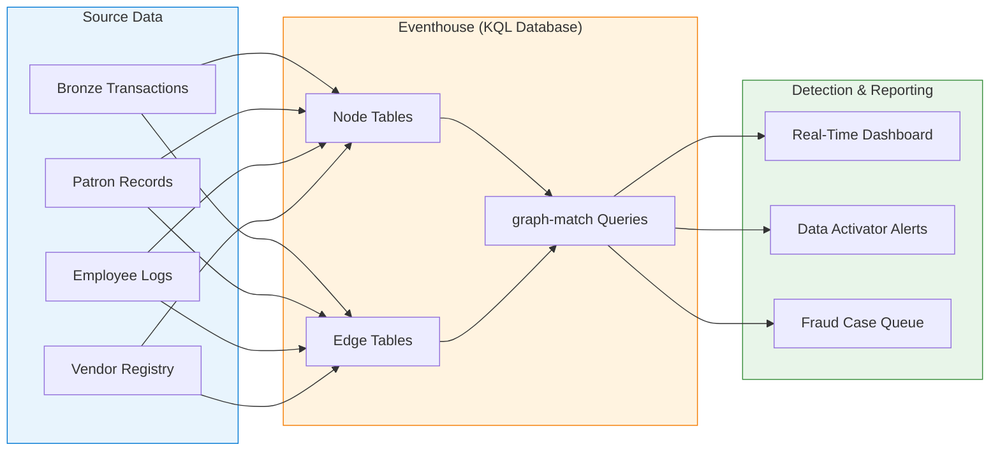

[Home](../../index.md) > [Tutorials](../index.md) > Graph Analytics for Fraud Detection

# 🔗 Tutorial 37: Graph Analytics for Fraud Detection

<div align="center" markdown>

**Detect Structuring, Money Laundering, and Procurement Fraud with Graph in Fabric**


</div>

---

## 📋 Prerequisites

| Requirement | Details |
|------------|---------|
| **Fabric Capacity** | F64 or higher with Eventhouse enabled |
| **Workspace** | Fabric workspace with Contributor+ access |
| **Eventhouse** | At least one Eventhouse provisioned |
| **Prior Tutorials** | [00 - Environment Setup](../00-environment-setup/README.md), [01 - Medallion Architecture](../01-bronze-layer/README.md), [04 - Real-Time Intelligence](../04-real-time-analytics/README.md) |
| **Knowledge** | Basic KQL, familiarity with graph concepts (nodes/edges) |

---

## 🎯 Learning Objectives

By the end of this tutorial you will be able to:

1. Create a **graph model** inside an Eventhouse KQL database
2. Define **entity types** — patrons, transactions, machines, employees, vendors
3. Write **KQL graph traversal queries** using the `graph-match` operator
4. Detect **structuring patterns** ($8K–$9.9K transactions avoiding the $10K CTR threshold)
5. Identify **circular transaction paths** indicative of money laundering
6. Visualize **fraud networks** in Real-Time Dashboards
7. Apply graph analytics to **federal procurement fraud** scenarios

---

## 🏗️ Architecture



**How it works:** Raw medallion data is modeled as nodes (entities) and edges (relationships) in Eventhouse. KQL `graph-match` queries traverse these relationships to surface fraud patterns that are invisible in flat tabular analysis.

---

## 🔧 Step 1: Create the Graph Schema

Navigate to your Eventhouse KQL database and run the following commands to create node and edge tables.

### 1.1 — Node Tables

```kql
// Patrons — casino customers
.create table Patrons (
    PatronId: string,
    FullName: string,
    TierLevel: string,
    JoinDate: datetime,
    RiskScore: int
)

// Machines — slot machines and table game positions
.create table Machines (
    MachineId: string,
    MachineType: string,
    Location: string,
    Zone: string
)

// Employees — floor staff, cashiers, supervisors
.create table Employees (
    EmployeeId: string,
    FullName: string,
    Role: string,
    Department: string,
    HireDate: datetime
)

// Transactions — cash-ins, cash-outs, fills, credits
.create table Transactions (
    TransactionId: string,
    TransactionType: string,
    Amount: real,
    Timestamp: datetime,
    CurrencyCode: string
)
```

### 1.2 — Edge Tables

```kql
// Patron played at a machine
.create table PlayedAt (
    PatronId: string,
    MachineId: string,
    SessionStart: datetime,
    SessionEnd: datetime,
    TotalWagered: real
)

// Patron cashed out a transaction
.create table CashedOut (
    PatronId: string,
    TransactionId: string,
    CashierId: string,
    Timestamp: datetime
)

// Employee served / approved a transaction
.create table ApprovedBy (
    TransactionId: string,
    EmployeeId: string,
    ApprovalType: string,
    Timestamp: datetime
)

// Patron-to-patron transfer (chip pass, marker co-sign)
.create table TransferredTo (
    FromPatronId: string,
    ToPatronId: string,
    Amount: real,
    Timestamp: datetime,
    Method: string
)
```

> ✅ **Checkpoint:** Run `.show tables` and confirm all 8 tables exist.

---

## 📦 Step 2: Populate with Sample Data

Insert a mix of **normal** and **suspicious** records so queries return meaningful results.

### 2.1 — Patrons

```kql
.ingest inline into table Patrons <|
P001,Alice Martinez,Gold,2024-01-15,12
P002,Bob Chen,Silver,2023-06-20,45
P003,Carlos Rivera,Platinum,2022-03-10,8
P004,Diana Okafor,Bronze,2024-09-01,72
P005,Evan Walsh,Gold,2023-11-11,65
P006,Fiona Patel,Silver,2024-04-22,38
```

### 2.2 — Machines

```kql
.ingest inline into table Machines <|
M101,Slot,Floor-A,Zone-1
M102,Slot,Floor-A,Zone-1
M201,Blackjack,Floor-B,Zone-2
M301,Roulette,Floor-C,Zone-3
```

### 2.3 — Employees

```kql
.ingest inline into table Employees <|
E01,James Lee,Cashier,Cage,2021-05-01
E02,Maria Santos,Supervisor,Cage,2019-08-15
E03,Kenji Tanaka,Floor Host,VIP,2022-01-10
```

### 2.4 — Transactions (includes structuring pattern)

```kql
.ingest inline into table Transactions <|
T1001,CashOut,9500,2026-04-20T10:15:00Z,USD
T1002,CashOut,9200,2026-04-20T14:30:00Z,USD
T1003,CashOut,8800,2026-04-20T18:45:00Z,USD
T1004,CashOut,2500,2026-04-20T11:00:00Z,USD
T1005,CashOut,15000,2026-04-19T09:00:00Z,USD
T1006,CashOut,9700,2026-04-20T20:10:00Z,USD
T1007,CashIn,50000,2026-04-18T08:00:00Z,USD
T1008,CashOut,9100,2026-04-20T22:00:00Z,USD
```

### 2.5 — Edges

```kql
// CashedOut edges — P002 (Bob) has five cash-outs between $8K–$9.9K in one day
.ingest inline into table CashedOut <|
P002,T1001,E01,2026-04-20T10:15:00Z
P002,T1002,E01,2026-04-20T14:30:00Z
P002,T1003,E01,2026-04-20T18:45:00Z
P002,T1006,E01,2026-04-20T20:10:00Z
P002,T1008,E01,2026-04-20T22:00:00Z
P003,T1004,E02,2026-04-20T11:00:00Z
P003,T1005,E02,2026-04-19T09:00:00Z
P001,T1007,E02,2026-04-18T08:00:00Z

// ApprovedBy edges
.ingest inline into table ApprovedBy <|
T1001,E01,Standard,2026-04-20T10:15:00Z
T1002,E01,Standard,2026-04-20T14:30:00Z
T1003,E01,Standard,2026-04-20T18:45:00Z
T1005,E02,HighValue,2026-04-19T09:00:00Z
T1006,E01,Standard,2026-04-20T20:10:00Z
T1008,E01,Standard,2026-04-20T22:00:00Z

// TransferredTo — circular path: P002 → P004 → P005 → P002
.ingest inline into table TransferredTo <|
P002,P004,5000,2026-04-19T15:00:00Z,ChipPass
P004,P005,4800,2026-04-19T16:30:00Z,ChipPass
P005,P002,4500,2026-04-19T18:00:00Z,ChipPass

// PlayedAt edges
.ingest inline into table PlayedAt <|
P002,M101,2026-04-20T09:00:00Z,2026-04-20T23:00:00Z,45000
P003,M201,2026-04-20T10:00:00Z,2026-04-20T12:00:00Z,8000
P001,M301,2026-04-18T07:00:00Z,2026-04-18T10:00:00Z,60000
```

> ✅ **Checkpoint:** Run `Patrons | count` — expect **6**. Run `CashedOut | count` — expect **8**.

---

## 🔍 Step 3: Basic Graph Queries

### 3.1 — All transactions by a patron

```kql
CashedOut
| graph-match (patron)-[co]->(txn)
    with Patrons as patron on PatronId,
         Transactions as txn on TransactionId,
         CashedOut as co on PatronId == patron.PatronId and TransactionId == txn.TransactionId
| where patron.FullName == "Bob Chen"
| project patron.FullName, txn.TransactionId, txn.Amount, txn.Timestamp
| order by txn.Timestamp asc
```

### 3.2 — Find patrons who used the same machine

```kql
PlayedAt
| graph-match (p1)-[e1]->(m)<-[e2]-(p2)
    with Patrons as p1 on PatronId,
         Patrons as p2 on PatronId,
         Machines as m on MachineId,
         PlayedAt as e1 on PatronId == p1.PatronId and MachineId == m.MachineId,
         PlayedAt as e2 on PatronId == p2.PatronId and MachineId == m.MachineId
| where p1.PatronId != p2.PatronId
| project Machine = m.MachineId, Patron1 = p1.FullName, Patron2 = p2.FullName
| distinct Machine, Patron1, Patron2
```

### 3.3 — Employee–patron connections (who approved whose transactions)

```kql
CashedOut
| join kind=inner ApprovedBy on TransactionId
| graph-match (p)-[co]->(txn)<-[ap]-(emp)
    with Patrons as p on PatronId,
         Transactions as txn on TransactionId,
         Employees as emp on EmployeeId,
         CashedOut as co on PatronId == p.PatronId and TransactionId == txn.TransactionId,
         ApprovedBy as ap on TransactionId == txn.TransactionId and EmployeeId == emp.EmployeeId
| summarize TxnCount = count(), TotalAmount = sum(txn.Amount) by p.FullName, emp.FullName
| order by TxnCount desc
```

> ✅ **Checkpoint:** Query 3.3 should show **E01 / James Lee** approved 5 transactions for **Bob Chen** totaling ~$46,300.

---

## 🚨 Step 4: Fraud Pattern Detection

### 4.1 — Structuring Detection

Find patrons with **3 or more** cash-out transactions between **$8,000–$9,999** within a **24-hour window**. This is the classic pattern used to avoid the $10,000 Currency Transaction Report (CTR) threshold.

```kql
CashedOut
| join kind=inner Transactions on TransactionId
| join kind=inner Patrons on PatronId
| where TransactionType == "CashOut"
    and Amount >= 8000 and Amount < 10000
| order by PatronId, Timestamp asc
| partition by PatronId (
    extend PrevTimestamp = prev(Timestamp)
    | extend HoursDiff = datetime_diff('hour', Timestamp, PrevTimestamp)
)
| summarize
    TxnCount = count(),
    TotalAmount = sum(Amount),
    FirstTxn = min(Timestamp),
    LastTxn = max(Timestamp),
    Amounts = make_list(Amount)
    by PatronId, FullName
| where TxnCount >= 3
| extend WindowHours = datetime_diff('hour', LastTxn, FirstTxn)
| where WindowHours <= 24
| project
    PatronId,
    FullName,
    TxnCount,
    TotalAmount,
    WindowHours,
    Amounts,
    RiskLevel = case(TxnCount >= 5, "Critical", TxnCount >= 3, "High", "Medium")
| order by TxnCount desc
```

> 🔴 **Expected Result:** Bob Chen — 5 transactions, ~$46,300 total, all within 12 hours. **Risk Level: Critical.**

### 4.2 — Circular Transaction Paths (Money Laundering)

Detect closed loops where funds cycle back to the originator.

```kql
TransferredTo
| graph-match (a)-[t1]->(b)-[t2]->(c)-[t3]->(a)
    with Patrons as a on PatronId == FromPatronId,
         Patrons as b on PatronId == FromPatronId,
         Patrons as c on PatronId == FromPatronId,
         TransferredTo as t1 on FromPatronId == a.PatronId and ToPatronId == b.PatronId,
         TransferredTo as t2 on FromPatronId == b.PatronId and ToPatronId == c.PatronId,
         TransferredTo as t3 on FromPatronId == c.PatronId and ToPatronId == a.PatronId
| project
    Loop = strcat(a.FullName, " → ", b.FullName, " → ", c.FullName, " → ", a.FullName),
    TotalMoved = t1.Amount + t2.Amount + t3.Amount,
    Leakage = t1.Amount - t3.Amount,
    StartTime = t1.Timestamp,
    EndTime = t3.Timestamp
```

> 🔴 **Expected Result:** Bob Chen → Diana Okafor → Evan Walsh → Bob Chen — $14,300 moved, $500 leakage.

### 4.3 — Cashier Collusion Detection

Find a single employee who approved a disproportionate number of below-threshold transactions for the same patron.

```kql
ApprovedBy
| join kind=inner CashedOut on TransactionId
| join kind=inner Transactions on TransactionId
| join kind=inner Employees on EmployeeId
| join kind=inner Patrons on PatronId
| where Amount >= 8000 and Amount < 10000
| summarize
    TxnCount = count(),
    TotalAmount = sum(Amount),
    AvgAmount = avg(Amount)
    by EmployeeId, Employees_FullName = FullName, PatronId, Patrons_FullName = FullName1
| where TxnCount >= 3
| extend CollusionScore = TxnCount * 20
| project
    Employee = Employees_FullName,
    Patron = Patrons_FullName,
    TxnCount,
    TotalAmount,
    AvgAmount,
    CollusionScore,
    Alert = iff(CollusionScore >= 80, "🔴 Investigate", "🟡 Monitor")
```

> 🔴 **Expected Result:** James Lee approved 5 structuring-range transactions for Bob Chen. **CollusionScore: 100. Alert: 🔴 Investigate.**

---

## 📊 Step 5: Visualize Fraud Networks

### 5.1 — Create a Real-Time Dashboard

1. Open your Fabric workspace and select **+ New → Real-Time Dashboard**
2. Name it `Fraud Network Monitor`
3. Connect it to your Eventhouse KQL database

### 5.2 — Add a Structuring Heatmap Tile

Add a new tile with the following query:

```kql
CashedOut
| join kind=inner Transactions on TransactionId
| join kind=inner Patrons on PatronId
| where Amount >= 8000 and Amount < 10000
| summarize TxnCount = count(), Total = sum(Amount) by FullName, bin(Timestamp, 1h)
| render timechart with (title="Structuring Activity by Patron")
```

**Visual type:** Time chart — each patron as a separate series.

### 5.3 — Add a Network Graph Tile

Use the **Force-directed graph** visual (available in Real-Time Dashboards):

```kql
// Build an edge list for the graph visual
CashedOut
| join kind=inner Patrons on PatronId
| join kind=inner Employees on $left.CashierId == $right.EmployeeId
| project Source = FullName, Target = FullName1, Weight = 1
| union (
    TransferredTo
    | join kind=inner (Patrons | project PatronId, FromName = FullName) on $left.FromPatronId == $right.PatronId
    | join kind=inner (Patrons | project PatronId, ToName = FullName) on $left.ToPatronId == $right.PatronId
    | project Source = FromName, Target = ToName, Weight = 2
)
| summarize Weight = sum(Weight) by Source, Target
```

**Configuration:**
- Source column → `Source`
- Target column → `Target`
- Weight column → `Weight`
- Layout → Force-directed

### 5.4 — Add a Geographic Cluster Tile (optional)

If machine location data includes lat/long, use the **Map** visual to show geographic clustering of suspicious transactions by casino zone.

> ✅ **Checkpoint:** Dashboard shows at least 2 tiles — the time chart with Bob Chen's activity spike and the network graph linking patrons, employees, and transfers.

---

## 🔔 Step 6: Set Up Real-Time Alerts

### 6.1 — Create a Data Activator Reflex

1. From your Real-Time Dashboard, select the **Structuring Heatmap** tile
2. Click **Set alert** → this opens Data Activator
3. Configure the reflex:

| Setting | Value |
|---------|-------|
| **Trigger name** | Structuring Alert |
| **Object** | Patron (FullName) |
| **Property** | TxnCount |
| **Condition** | Greater than or equal to 3 |
| **Time window** | Rolling 24 hours |
| **Action** | Send email to compliance team / Teams channel |

4. Click **Save and Start**

### 6.2 — KQL Continuous Query (alternative)

For programmatic alerting, create a materialized view that flags suspicious activity:

```kql
.create materialized-view StructuringAlerts on table CashedOut {
    CashedOut
    | join kind=inner Transactions on TransactionId
    | where Amount >= 8000 and Amount < 10000
    | summarize
        TxnCount = count(),
        TotalAmount = sum(Amount),
        LastSeen = max(Timestamp)
        by PatronId
    | where TxnCount >= 3
}
```

Query the view on a schedule to feed downstream case management systems.

> ✅ **Checkpoint:** Trigger a test alert by re-ingesting a structuring-range transaction for Bob Chen and confirming the reflex fires.

---

## 🏛️ Federal Extension: Procurement Fraud

Graph analytics applies equally well to federal government fraud scenarios. Below are patterns for **SBA** and **DOI** procurement data.

### Vendor Relationship Graph

```kql
// Node tables (assume already ingested from federal Bronze layer)
// Vendors, Contracts, Agencies, Officers

// Edge: Vendor awarded contract
.create table AwardedTo (
    VendorId: string,
    ContractId: string,
    AwardDate: datetime,
    Amount: real
)

// Edge: Officer approved contract
.create table OfficerApproved (
    OfficerId: string,
    ContractId: string,
    ApprovalDate: datetime
)

// Edge: Vendor has relationship to another vendor (shared address, officers, phone)
.create table VendorLinkedTo (
    VendorId1: string,
    VendorId2: string,
    LinkType: string,
    Confidence: real
)
```

### Shell Company Detection

Find vendor clusters that share registered agents, addresses, or phone numbers — a classic indicator of shell company networks:

```kql
VendorLinkedTo
| where Confidence >= 0.8
| graph-match (v1)-[link]->(v2)
    with Vendors as v1 on VendorId == VendorId1,
         Vendors as v2 on VendorId == VendorId2,
         VendorLinkedTo as link on VendorId1 == v1.VendorId and VendorId2 == v2.VendorId
| summarize
    Links = count(),
    LinkTypes = make_set(link.LinkType)
    by v1.VendorName, v2.VendorName
| where Links >= 2
| project Vendor1 = v1_VendorName, Vendor2 = v2_VendorName, Links, LinkTypes
| order by Links desc
```

### Cross-Agency Vendor Overlap

Identify vendors receiving awards from multiple agencies — potential bid-rigging when combined with shell company links:

```kql
AwardedTo
| join kind=inner Contracts on ContractId
| summarize
    AgencyCount = dcount(AgencyId),
    Agencies = make_set(AgencyName),
    TotalAwarded = sum(Amount),
    ContractCount = count()
    by VendorId
| where AgencyCount >= 3
| order by TotalAwarded desc
```

> 💡 **Tip:** Combine the shell company and cross-agency queries — vendors that appear in both result sets represent the highest-risk targets.

---

## ✅ Verification Checklist

| # | Task | Status |
|---|------|--------|
| 1 | Graph node and edge tables created (8 tables) | ☐ |
| 2 | Sample data loaded — 6 patrons, 8 transactions, edges | ☐ |
| 3 | Basic graph traversal queries return expected results | ☐ |
| 4 | Structuring detection query flags Bob Chen (5 txns, Critical) | ☐ |
| 5 | Circular path query finds P002 → P004 → P005 → P002 loop | ☐ |
| 6 | Collusion query flags James Lee / Bob Chen pair | ☐ |
| 7 | Real-Time Dashboard created with ≥ 2 tiles | ☐ |
| 8 | Data Activator reflex configured and tested | ☐ |
| 9 | Federal vendor graph schema created (optional) | ☐ |

---

## 🧹 Cleanup

To remove the tutorial resources when finished:

```kql
// Drop edge tables first
.drop table PlayedAt
.drop table CashedOut
.drop table ApprovedBy
.drop table TransferredTo

// Drop node tables
.drop table Patrons
.drop table Machines
.drop table Employees
.drop table Transactions

// Drop materialized view
.drop materialized-view StructuringAlerts
```

Delete the `Fraud Network Monitor` dashboard from your workspace manually.

---

## 🔗 Related Tutorials

| Tutorial | Relevance |
|----------|-----------|
| [04 - Real-Time Intelligence](../04-real-time-analytics/README.md) | Eventhouse setup and KQL fundamentals |
| [08 - Data Activator](../../features/data-activator.md) | Reflex and alert configuration |
| [14 - Compliance Reporting](../14-security-networking/README.md) | CTR/SAR threshold logic and FinCEN reporting |
| [29 - Federal Data Processing](../29-geolocation-analytics/README.md) | Federal agency medallion pipelines |

---

## 📚 References

- [Graph in Microsoft Fabric — Overview](https://learn.microsoft.com/fabric/real-time-intelligence/graph-overview) — GA March 2026 (FabCon Atlanta)
- [KQL graph-match operator](https://learn.microsoft.com/kusto/query/graph-match-operator) — Pattern matching syntax
- [Real-Time Dashboards](https://learn.microsoft.com/fabric/real-time-intelligence/dashboard-real-time-create) — Visualization setup
- [Data Activator](https://learn.microsoft.com/fabric/data-activator/data-activator-introduction) — Alerting and reflexes
- [NIGC MICS — Currency Transaction Reporting](https://www.nigc.gov/) — Compliance thresholds

---

<div align="center" markdown>

**[⬅️ Tutorial 36](../36-data-mesh-domains/README.md)** · **[🏠 All Tutorials](../index.md)**

</div>
