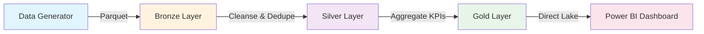
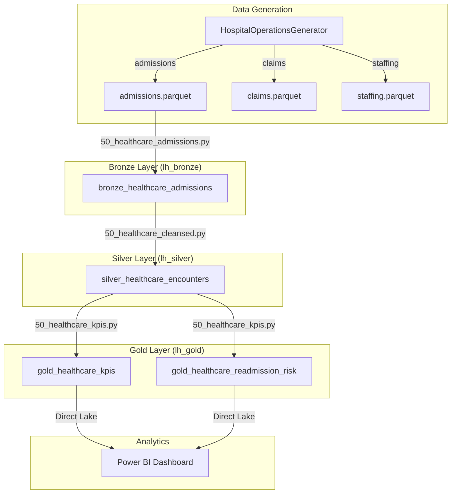

# Tutorial 46: Commercial Healthcare Operations


## Overview

Build an end-to-end hospital operations analytics platform on Microsoft Fabric. This tutorial covers synthetic data generation, medallion architecture ingestion, clinical KPI computation, and Power BI dashboarding -- all with HIPAA compliance built in.

### What You'll Build



### KPIs Delivered

| KPI | Description | Clinical Benchmark |
|-----|-------------|-------------------|
| 30-Day Readmission Rate | % patients readmitted within 30 days | < 15% |
| Average LOS | Mean length of stay by DRG | Varies by DRG |
| ED-to-Admit Time | Minutes from ED arrival to inpatient bed | < 240 min |
| Bed Occupancy Rate | Daily census / total beds | 75-85% |
| Denial Rate | % claims denied by payer | < 5% |
| Case Mix Index | Weighted DRG complexity score | ~1.4 - 1.8 |

---

## Prerequisites

- Microsoft Fabric workspace (F64 or trial)
- Three Lakehouses: `lh_bronze`, `lh_silver`, `lh_gold`
- Python 3.10+ (for local data generation)
- Environment variable: `FABRIC_POC_HASH_SALT` (for HIPAA-safe hashing)

---

## Step 1: Generate Synthetic Data

### 1.1 Install Dependencies

```bash
pip install pandas numpy faker tqdm
```

### 1.2 Set HIPAA Hash Salt

```bash
# Required for MRN hashing -- never use a weak salt in production
export FABRIC_POC_HASH_SALT="your-secure-salt-here"
```

### 1.3 Generate Hospital Data

```python
from data_generation.generators.healthcare.hospital_operations_generator import (
    HospitalOperationsGenerator,
)

gen = HospitalOperationsGenerator(seed=42)

# Generate datasets
admissions = gen.generate_admissions(10000)
claims = gen.generate_claims(25000)
staffing = gen.generate_staffing_records(5000)

# Save to Parquet
gen.to_parquet(admissions, "output/healthcare/admissions.parquet")
gen.to_parquet(claims, "output/healthcare/claims.parquet")
gen.to_parquet(staffing, "output/healthcare/staffing.parquet")

print(f"Admissions: {len(admissions):,} records")
print(f"Claims: {len(claims):,} records")
print(f"Staffing: {len(staffing):,} records")
```

### Verification

- [ ] Admissions file created with 10,000 rows
- [ ] Claims file created with 25,000 rows
- [ ] All SSNs are 900-series (synthetic)
- [ ] MRN values are SHA-256 hashes (64 hex chars)

---

## Step 2: Upload to Fabric Lakehouse

### 2.1 Upload Files

1. Open your `lh_bronze` Lakehouse in Fabric
2. Navigate to **Files** > create folder `landing/healthcare/`
3. Upload the three Parquet files from Step 1

### 2.2 Verify Upload

```python
# In a Fabric notebook
files = mssparkutils.fs.ls("Files/landing/healthcare/")
for f in files:
    print(f"{f.name} - {f.size:,} bytes")
```

### Verification

- [ ] Three Parquet files visible in Files/landing/healthcare/
- [ ] File sizes are non-zero

---

## Step 3: Bronze Ingestion

### 3.1 Import Notebook

Import `notebooks/bronze/50_healthcare_admissions.py` into your Fabric workspace.

### 3.2 Run Bronze Notebook

Execute all cells. The notebook will:
1. Read Parquet files with explicit schema enforcement
2. Add Bronze metadata (`_bronze_ingested_at`, `_bronze_source_file`, `_bronze_batch_id`)
3. Write to `bronze_healthcare_admissions` Delta table partitioned by load date

### 3.3 Verify

```sql
SELECT COUNT(*) as total,
       COUNT(DISTINCT encounter_id) as unique_encounters,
       MIN(admit_dt) as earliest,
       MAX(admit_dt) as latest
FROM lh_bronze.dbo.bronze_healthcare_admissions
```

### Verification

- [ ] Delta table created with expected record count
- [ ] No null encounter_id or mrn_hash values
- [ ] Bronze metadata columns present

---

## Step 4: Silver Cleansing

### 4.1 Import & Run Silver Notebook

Import `notebooks/silver/50_healthcare_cleansed.py` and execute.

### 4.2 Transformations Applied

| Transformation | Description |
|---------------|-------------|
| Deduplication | Latest ingestion wins per encounter_id |
| LOS Recalculation | `datediff(discharge_dt, admit_dt)` |
| 30-Day Readmission | Lag window on mrn_hash by admit_dt |
| ED-to-Admit Time | Minutes between ED arrival and admission |
| Data Quality Score | 0-100 based on field completeness |

### 4.3 Verify

```sql
SELECT COUNT(*) as total,
       ROUND(AVG(_dq_score), 1) as avg_quality,
       ROUND(AVG(los_calc), 1) as avg_los,
       SUM(readmit_30d) as readmissions
FROM lh_silver.dbo.silver_healthcare_encounters
```

### Verification

- [ ] Record count matches (after dedup)
- [ ] Average quality score > 80
- [ ] LOS values are positive integers
- [ ] readmit_30d is 0 or 1

---

## Step 5: Gold KPIs

### 5.1 Import & Run Gold Notebook

Import `notebooks/gold/50_healthcare_kpis.py` and execute.

### 5.2 Output Tables

**gold_healthcare_kpis** - Aggregated operational metrics by DRG:

| Column | Description |
|--------|-------------|
| drg_code | MS-DRG code |
| encounters | Count of encounters |
| avg_los | Mean length of stay |
| readmit_rate_pct | 30-day readmission % |
| case_mix_index | Overall CMI |

**gold_healthcare_readmission_risk** - Patient-level risk scoring:

| Column | Description |
|--------|-------------|
| encounter_id | Encounter identifier |
| risk_score | Composite 0-100 score |
| risk_tier | HIGH / MEDIUM / LOW |

### 5.3 Verify

```sql
-- KPI check
SELECT drg_code, encounters, avg_los, readmit_rate_pct
FROM lh_gold.dbo.gold_healthcare_kpis
ORDER BY encounters DESC LIMIT 10;

-- Risk distribution
SELECT risk_tier, COUNT(*) as patients
FROM lh_gold.dbo.gold_healthcare_readmission_risk
GROUP BY risk_tier;
```

### Verification

- [ ] KPI table has rows for each DRG code
- [ ] Readmission rates are between 0-100%
- [ ] Risk tiers include HIGH, MEDIUM, LOW
- [ ] Case Mix Index is a reasonable value (1.0-2.5)

---

## Step 6: Power BI Dashboard

### 6.1 Create Direct Lake Semantic Model

1. In your Fabric workspace, select **New** > **Semantic model**
2. Choose `lh_gold` as the data source
3. Select tables: `gold_healthcare_kpis`, `gold_healthcare_readmission_risk`
4. Direct Lake mode is automatic

### 6.2 Build Dashboard Pages

**Page 1: Executive Summary**
- Card: Case Mix Index, Overall Readmission Rate, Avg LOS
- Bar chart: Readmission rate by DRG (top 10)
- Line chart: Daily occupancy rate trend

**Page 2: Readmission Risk**
- Donut: Risk tier distribution (HIGH/MEDIUM/LOW)
- Table: High-risk encounters with DRG, LOS, payer
- Slicer: Filter by payer, DRG, disposition

**Page 3: ED Operations**
- Gauge: Median ED-to-admit time vs 240-min target
- Histogram: ED wait time distribution
- KPI: ED encounter volume trend

### 6.3 DAX Measures

```dax
// 30-Day Readmission Rate
Readmission Rate =
DIVIDE(
    CALCULATE(COUNTROWS('gold_healthcare_readmission_risk'),
              'gold_healthcare_readmission_risk'[risk_score] >= 40),
    COUNTROWS('gold_healthcare_readmission_risk'),
    0
)

// Case Mix Index
CMI = AVERAGE('gold_healthcare_kpis'[case_mix_index])
```

### Verification

- [ ] Semantic model connects via Direct Lake (no import)
- [ ] All three dashboard pages render correctly
- [ ] Slicers filter across visuals

---

## HIPAA Compliance Checklist

This POC implements the following HIPAA safeguards:

| Control | Implementation | Status |
|---------|---------------|--------|
| PHI De-identification | MRN hashed with HMAC-SHA-256 + salt | Implemented |
| Synthetic SSN | 900-series only (IRS test range) | Implemented |
| No Real Patient Data | All data is synthetically generated | Verified |
| SSN Masking | Only last 4 digits shown (`XXX-XX-####`) | Implemented |
| Salt Management | `FABRIC_POC_HASH_SALT` env var required | Enforced |
| Access Control | Lakehouse schemas + workspace RBAC | Configurable |
| Audit Logging | Fabric unified audit log enabled | Platform |
| Encryption at Rest | OneLake default encryption (AES-256) | Platform |
| Encryption in Transit | TLS 1.2+ enforced | Platform |

> **Important:** This is a POC with synthetic data. Production healthcare workloads require a full HIPAA Business Associate Agreement (BAA) with Microsoft and additional controls per 45 CFR 164.

---

## Architecture Diagram



---

## Troubleshooting

| Issue | Cause | Fix |
|-------|-------|-----|
| `ValueError: hash_value requires salt` | Missing env var | Set `FABRIC_POC_HASH_SALT` |
| Bronze table empty | Wrong source path | Verify `Files/landing/healthcare/` has Parquet files |
| Negative LOS values | discharge < admit | Silver notebook filters these (sets to NULL) |
| High readmission rate | Small synthetic dataset | Generate more records (50K+) for realistic distributions |
| Direct Lake fallback | Table not optimized | Run `OPTIMIZE ... ZORDER BY` on Gold tables |

---

## Next Steps

- Expand claims pipeline with `bronze/silver/gold_healthcare_claims`
- Add staffing ratio analysis to Gold layer
- Integrate with Fabric Data Activator for readmission alerts
- Connect to Real-Time Intelligence for ED wait time streaming
- Add Great Expectations data quality suite

---

## References

- [CMS MS-DRG Definitions](https://www.cms.gov/medicare/payment/prospective-payment-systems/acute-inpatient-pps/ms-drg-classifications-and-software)
- [HIPAA Security Rule](https://www.hhs.gov/hipaa/for-professionals/security/index.html)
- [Microsoft Fabric Healthcare Solutions](https://learn.microsoft.com/en-us/industry/healthcare/)
- [Direct Lake Documentation](https://learn.microsoft.com/en-us/fabric/get-started/direct-lake-overview)

---

*Tutorial 46 | Commercial Healthcare Operations | Microsoft Fabric POC*
