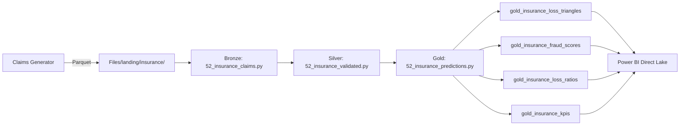
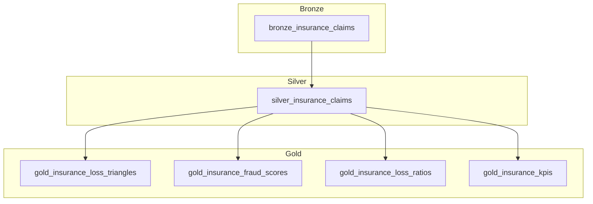

# :shield: Tutorial 48: Insurance Claims Analytics on Microsoft Fabric


## :dart: Learning Objectives

By the end of this tutorial you will be able to:

1. Generate synthetic P&C insurance claims data across four lines of business
2. Ingest raw claims into a Bronze lakehouse with schema enforcement
3. Validate, deduplicate, and enrich claims in a Silver layer
4. Build actuarial loss development triangles in the Gold layer
5. Compute fraud score features for SIU referral
6. Create a Power BI dashboard for claims analytics

---

## :world_map: Architecture Overview





---

## :books: Prerequisites

- Microsoft Fabric workspace with F64 capacity
- Python 3.10+ (for data generation)
- Fabric Lakehouse: `lh_bronze`, `lh_silver`, `lh_gold`
- Required Python packages: `numpy`, `pandas`, `faker`, `tqdm`

---

## :one: Step 1 -- Generate Synthetic Insurance Data

### Install Dependencies

```bash
pip install numpy pandas faker tqdm
```

### Generate Claims Data

```python
from datetime import datetime
from data_generation.generators.insurance.claims_generator import InsuranceClaimsGenerator

generator = InsuranceClaimsGenerator(
    seed=42,
    num_policies=5_000,
    num_adjusters=50,
    start_date=datetime(2023, 1, 1),
    end_date=datetime(2025, 12, 31),
)

# Generate 10,000 claims
claims_df = generator.generate(num_records=10_000)
print(f"Generated {len(claims_df):,} claims")
print(f"Fraud rate: {claims_df['fraud_flag'].mean():.1%}")
print(f"LOB distribution:\n{claims_df['line_of_business'].value_counts()}")

# Save to Parquet for upload
generator.to_parquet(claims_df, "output/insurance/claims.parquet")
```

### Verify the Data

```python
# Check key distributions
print(f"\nStatus distribution:")
print(claims_df["status"].value_counts())

print(f"\nReserve statistics:")
print(claims_df["reserve_amt"].describe())

print(f"\nStates covered: {claims_df['state'].nunique()}")
```

:white_check_mark: **Checkpoint:** You should see ~10,000 claims with ~2% fraud rate, 4 LOBs, and 30 states.

---

## :two: Step 2 -- Upload Data to Fabric Lakehouse

### Option A: Manual Upload

1. Open your Fabric workspace
2. Navigate to `lh_bronze` lakehouse
3. Click **Files** > **Upload** > **Upload folder**
4. Upload the `output/insurance/` folder to `Files/landing/insurance/`

### Option B: Using mssparkutils

```python
from notebookutils import mssparkutils

# Copy from local to lakehouse
mssparkutils.fs.cp(
    "file:///tmp/insurance/claims.parquet",
    "Files/landing/insurance/claims.parquet",
)
```

:white_check_mark: **Checkpoint:** Verify files appear under `Files/landing/insurance/` in the lakehouse explorer.

---

## :three: Step 3 -- Bronze Ingestion

### Import and Run Notebook

1. Import `notebooks/bronze/52_insurance_claims.py` into your Fabric workspace
2. Attach to a Spark cluster
3. Run all cells

### What This Notebook Does

| Step | Action | Output |
|------|--------|--------|
| Schema definition | Defines 14-column schema with types | StructType |
| Read landing | Reads Parquet with schema enforcement | Raw DataFrame |
| Add metadata | Adds `_ingested_at`, `_source_file` | Enriched DataFrame |
| Quality check | Counts records, unique claims, total reserves | Console summary |
| Write bronze | Appends to `bronze_insurance_claims` Delta table | Delta table |

### Verify Bronze Table

```sql
SELECT
    COUNT(*) as total_records,
    COUNT(DISTINCT claim_id) as unique_claims,
    COUNT(DISTINCT policy_id) as linked_policies,
    SUM(reserve_amt) as total_reserves
FROM lh_bronze.bronze_insurance_claims
```

:white_check_mark: **Checkpoint:** Record count matches generated data. All claims have valid claim_id.

---

## :four: Step 4 -- Silver Validation

### Import and Run Notebook

1. Import `notebooks/silver/52_insurance_validated.py`
2. Run all cells

### Validation Steps

| # | Validation | Action on Failure |
|---|-----------|-------------------|
| 1 | Deduplication | Keep latest ingestion per claim_id |
| 2 | Policy linkage | Remove claims with null/empty policy_id |
| 3 | Report lag | Calculate `report_lag_days = report_dt - loss_dt`; drop if negative |
| 4 | Development age | Calculate months since loss date |
| 5 | Loss type standardization | Lowercase, trim, underscores |
| 6 | Reserve validation | Flag active claims with zero reserves |
| 7 | PII masking | SHA-256 hash of claimant_name |

### Verify Silver Table

```sql
SELECT
    line_of_business,
    COUNT(*) as claims,
    AVG(report_lag_days) as avg_report_lag,
    AVG(reserve_amt) as avg_reserve,
    SUM(CASE WHEN reserve_warning IS NOT NULL THEN 1 ELSE 0 END) as reserve_warnings
FROM lh_silver.silver_insurance_claims
GROUP BY line_of_business
```

:white_check_mark: **Checkpoint:** No negative report lags. PII column replaced with hash. Loss types are standardized.

---

## :five: Step 5 -- Gold Analytics

### Import and Run Notebook

1. Import `notebooks/gold/52_insurance_predictions.py`
2. Run all cells

### Gold Tables Produced

#### Loss Ratios (`gold_insurance_loss_ratios`)
```sql
SELECT line_of_business, accident_year, accident_quarter,
       claim_count, incurred_losses, loss_ratio_estimate
FROM lh_gold.gold_insurance_loss_ratios
ORDER BY line_of_business, accident_year, accident_quarter
```

#### Fraud Scores (`gold_insurance_fraud_scores`)
```sql
-- High-risk claims for SIU review
SELECT claim_id, line_of_business, state, loss_type,
       reserve_amt, fraud_score, fraud_flag
FROM lh_gold.gold_insurance_fraud_scores
WHERE fraud_score > 75
ORDER BY fraud_score DESC
LIMIT 20
```

#### Loss Triangles (`gold_insurance_loss_triangles`)
```sql
-- Actuarial loss development for Auto
SELECT accident_period, dev_quarter,
       cumulative_incurred, cumulative_paid, claim_count
FROM lh_gold.gold_insurance_loss_triangles
WHERE line_of_business = 'auto'
ORDER BY accident_period, dev_quarter
```

#### KPIs (`gold_insurance_kpis`)
```sql
SELECT line_of_business, accident_year,
       total_claims, closure_rate, subro_recovery_rate, avg_report_lag
FROM lh_gold.gold_insurance_kpis
ORDER BY line_of_business, accident_year
```

:white_check_mark: **Checkpoint:** All 4 gold tables populated. Fraud scores range 0-100. Loss triangles show increasing cumulative incurred by development quarter.

---

## :six: Step 6 -- Power BI Dashboard

### Create Direct Lake Semantic Model

1. In your Fabric workspace, click **New** > **Semantic model**
2. Select **Direct Lake** connection
3. Add gold tables: `gold_insurance_loss_ratios`, `gold_insurance_fraud_scores`, `gold_insurance_kpis`

### Suggested Dashboard Pages

#### Page 1: Executive Summary
- **Card:** Total claims, total incurred, overall loss ratio
- **Line chart:** Loss ratio trend by quarter
- **Bar chart:** Claims count by LOB
- **Map:** Incurred losses by state

#### Page 2: Fraud Analytics
- **Histogram:** Fraud score distribution
- **Table:** Top 20 high-risk claims (score > 75)
- **Bar chart:** Fraud referrals by LOB
- **KPI:** SIU referral count vs. confirmed fraud rate

#### Page 3: Actuarial View
- **Matrix:** Loss development triangle (accident period x development quarter)
- **Line chart:** Cumulative incurred by accident period
- **Bar chart:** Closure rate by LOB and quarter
- **Card:** Average report lag, average reserve

#### Page 4: Subrogation
- **Bar chart:** Recovery rate by LOB
- **Table:** Top subrogation opportunities
- **Trend:** Quarterly subrogation recovery trend

---

## :seven: Step 7 -- NAIC Compliance Checks

### Data Quality for Statutory Reporting

```sql
-- Reconciliation check: Bronze vs Silver counts
SELECT 'bronze' as layer, COUNT(*) as records FROM lh_bronze.bronze_insurance_claims
UNION ALL
SELECT 'silver', COUNT(*) FROM lh_silver.silver_insurance_claims
UNION ALL
SELECT 'gold_triangles', COUNT(*) FROM lh_gold.gold_insurance_loss_triangles
UNION ALL
SELECT 'gold_fraud', COUNT(*) FROM lh_gold.gold_insurance_fraud_scores
```

### Reserve Adequacy Check

```sql
-- Compare case reserves to paid for closed claims
SELECT
    line_of_business,
    COUNT(*) as closed_claims,
    AVG(reserve_amt) as avg_case_reserve,
    AVG(paid_amt) as avg_paid,
    AVG(reserve_amt - paid_amt) as avg_reserve_redundancy
FROM lh_silver.silver_insurance_claims
WHERE status IN ('closed_paid')
GROUP BY line_of_business
```

:white_check_mark: **Checkpoint:** Bronze-to-silver record count variance is explained by deduplication and validation removals.

---

## :rotating_light: Troubleshooting

| Issue | Cause | Solution |
|-------|-------|----------|
| Empty bronze table | Landing path incorrect | Verify `Files/landing/insurance/` contains Parquet files |
| Zero silver records | All claims failed validation | Check policy_id is populated in source data |
| Negative report lag | Loss date after report date in source | Data quality issue in generator; re-generate with valid dates |
| No fraud scores > 75 | Low fraud rate + low severity | Expected with 2% fraud rate; adjust thresholds |
| Triangle gaps | Insufficient data coverage | Generate data spanning at least 8 quarters |

---

## :link: Related Resources

- [Use Case: Insurance Claims Analytics](../../use-cases/insurance-claims-analytics.md)
- [NAIC Model Audit Rule](https://content.naic.org/cipr-topics/model-audit-rule)
- [NAIC Risk-Based Capital](https://content.naic.org/cipr-topics/risk-based-capital)
- [Microsoft Fabric Lakehouse](https://learn.microsoft.com/en-us/fabric/data-engineering/lakehouse-overview)
- [Delta Lake Documentation](https://docs.delta.io/latest/)
- [Tutorial 01: Casino Slot Telemetry (Bronze pattern)](../01-bronze-layer/README.md)

---

## :trophy: Summary

In this tutorial you built an end-to-end insurance claims analytics pipeline:

| Layer | Table | Records | Purpose |
|-------|-------|---------|---------|
| Bronze | `bronze_insurance_claims` | ~10,000 | Raw ingestion with audit trail |
| Silver | `silver_insurance_claims` | ~9,900+ | Validated, deduplicated, PII-masked |
| Gold | `gold_insurance_loss_ratios` | ~200+ | Profitability by LOB/state/quarter |
| Gold | `gold_insurance_fraud_scores` | ~9,900+ | ML fraud feature vectors |
| Gold | `gold_insurance_loss_triangles` | ~100+ | Actuarial development triangles |
| Gold | `gold_insurance_kpis` | ~50+ | Closure rate, subrogation, lag metrics |

**Key capabilities demonstrated:**
- Medallion architecture for insurance domain
- Actuarial loss triangle construction
- Fraud scoring feature engineering
- NAIC compliance data quality controls
- Power BI Direct Lake integration

---

*Next: [Tutorial 49](../49-retail-cpg/README.md) | [Back to Tutorials](../index.md)*
