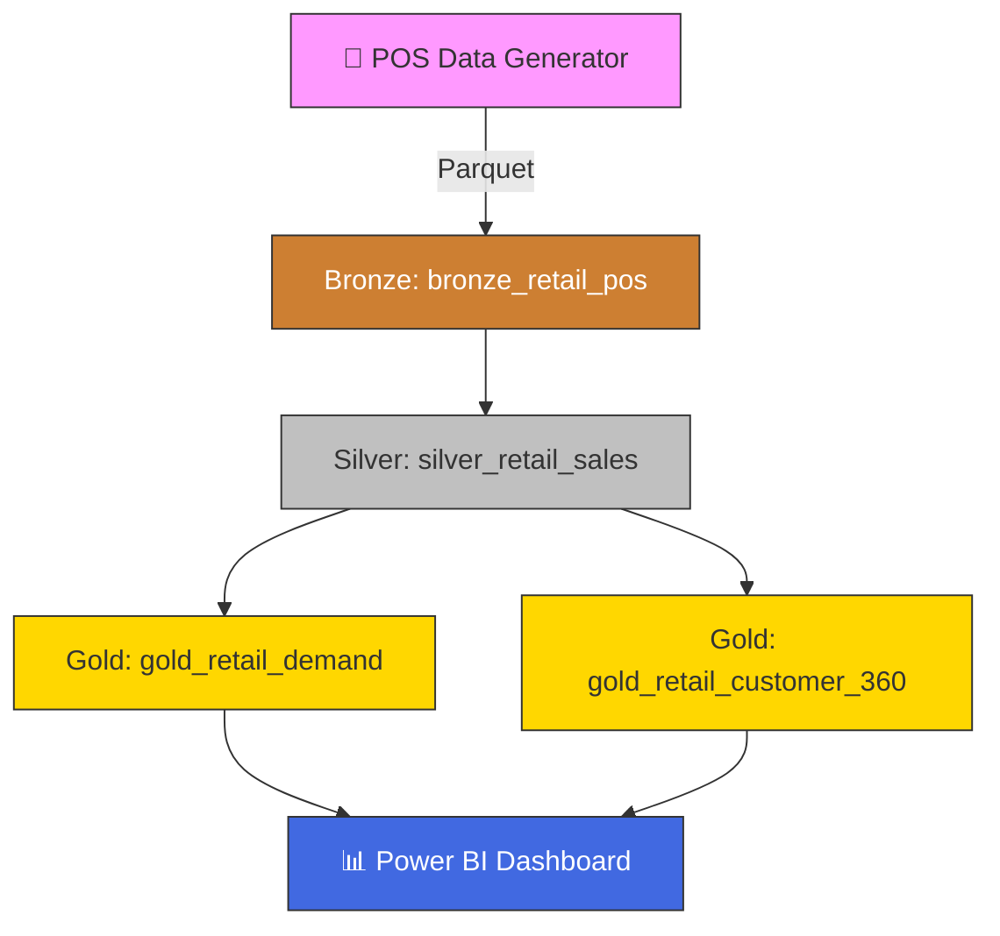

# 🛒 Tutorial 49: Retail & CPG — Demand Forecasting and Customer Analytics

> **Difficulty:** Advanced
> **Duration:** 90 minutes
> **Prerequisites:** Fabric workspace with F64 capacity, Lakehouse, Eventhouse


---

## 📋 Overview

In this tutorial you will build an end-to-end retail analytics solution on Microsoft Fabric for a **450-store omnichannel retailer**. You will:

1. Generate synthetic POS transaction data (PCI-DSS compliant — no real PANs)
2. Ingest into a Bronze lakehouse with schema enforcement
3. Cleanse, deduplicate, and enrich in Silver
4. Build demand-forecast features and a Customer 360 (RFM + CLV) in Gold
5. Explore results with SQL and Power BI Direct Lake

## 🏗️ Architecture



## 📦 What You'll Build

| Layer | Table | Description |
|-------|-------|-------------|
| **Bronze** | `bronze_retail_pos` | Raw POS transactions with metadata |
| **Silver** | `silver_retail_sales` | Deduped, validated, enriched sales |
| **Gold** | `gold_retail_demand` | SKU-Store-Day aggregates + rolling features |
| **Gold** | `gold_retail_customer_360` | RFM scores, CLV tiers, segments |

---

## 🔧 Prerequisites

- [ ] Microsoft Fabric workspace (F64 or trial capacity)
- [ ] Three Lakehouses created: `lh_bronze`, `lh_silver`, `lh_gold`
- [ ] Python environment with `numpy`, `pandas`, `faker`, `tqdm`
- [ ] Eventhouse (optional, for real-time inventory queries)

---

## 📝 Step 1: Generate Synthetic POS Data

### 1.1 Install Dependencies

```bash
pip install numpy pandas faker tqdm pyarrow
```

### 1.2 Generate Data

```python
from data_generation.generators.retail.sales_generator import RetailSalesGenerator

gen = RetailSalesGenerator(
    seed=42,
    num_stores=450,
    num_skus=5000,
    num_customers=50000,
)

# Generate 100K transactions
df = gen.generate(num_records=100_000)
print(f"Generated {len(df):,} records")
print(df.head())

# Save to Parquet for Fabric upload
gen.to_parquet(df, "output/bronze_retail_pos.parquet")
```

### 1.3 Verify Data Quality

```python
# PCI-DSS: confirm no raw PANs
assert not df["card_token"].str.match(r"^\d{13,19}$").any(), "PAN leak!"

# Check distributions
print(df["category"].value_counts(normalize=True))
print(f"Unique stores: {df['store_id'].nunique()}")
print(f"Loyalty rate: {df['loyalty_id'].notna().mean():.1%}")
```

> ✅ **Checkpoint:** You should have a Parquet file with ~100K rows, no raw card numbers, and ~75% loyalty linkage rate.

---

## 📝 Step 2: Upload to Fabric

### 2.1 Upload Parquet File

1. Open your `lh_bronze` Lakehouse in the Fabric portal
2. Click **Get data → Upload files**
3. Navigate to `output/bronze_retail_pos.parquet`
4. Upload to `Files/output/`

### 2.2 Verify Upload

```sql
-- In Lakehouse SQL endpoint
SELECT COUNT(*) FROM bronze_retail_pos;
-- Expected: ~100,000
```

> ✅ **Checkpoint:** File visible in the Lakehouse Files section.

---

## 📝 Step 3: Bronze Ingestion

### 3.1 Import Notebook

1. In your workspace, click **Import notebook**
2. Select `notebooks/bronze/53_retail_pos.py`
3. Attach the notebook to `lh_bronze`

### 3.2 Run the Notebook

Execute all cells. The notebook will:

- Read the Parquet file with explicit schema enforcement
- Validate non-null `txn_id`, `store_id`, `sku`
- Check for PCI-DSS compliance (no raw PAN)
- Append to `bronze_retail_pos` Delta table with ingestion metadata

### 3.3 Verify

```sql
SELECT
    COUNT(*) AS total_rows,
    COUNT(DISTINCT txn_id) AS unique_txns,
    MIN(txn_timestamp) AS earliest,
    MAX(txn_timestamp) AS latest
FROM lh_bronze.bronze_retail_pos;
```

> ✅ **Checkpoint:** Bronze table populated, all quality checks passed, zero PAN violations.

---

## 📝 Step 4: Silver Transformation

### 4.1 Import & Run Notebook

1. Import `notebooks/silver/53_retail_cleansed.py`
2. Attach to `lh_silver` (with access to `lh_bronze`)
3. Run all cells

### 4.2 What Happens

| Step | Transformation |
|------|---------------|
| Deduplication | Remove duplicate `txn_id` (keep latest) |
| Validation | Filter `qty > 0` and `unit_price > 0`; quarantine bad rows |
| Returns | Flag returns with `is_return = true` |
| Enrichment | Join product master (cost) and store master (city, state) |
| Margin | Calculate `gross_margin = line_total - (qty × product_cost)` |
| PCI-DSS | Drop `card_token` column (not needed for analytics) |

### 4.3 Verify

```sql
SELECT
    category,
    COUNT(*) AS txns,
    ROUND(SUM(line_total), 2) AS revenue,
    SUM(CASE WHEN is_return THEN 1 ELSE 0 END) AS returns
FROM lh_silver.silver_retail_sales
GROUP BY category
ORDER BY revenue DESC;
```

> ✅ **Checkpoint:** Silver table has fewer rows than bronze (dedup + quarantine), no `card_token` column.

---

## 📝 Step 5: Gold — Demand Features & Customer 360

### 5.1 Import & Run Notebook

1. Import `notebooks/gold/53_retail_demand_forecast.py`
2. Attach to `lh_gold` (with access to `lh_silver`)
3. Run all cells

### 5.2 Demand Forecast Features

The notebook creates `gold_retail_demand` with:

| Feature | Description |
|---------|-------------|
| `daily_qty` | Total units sold per SKU-Store-Day |
| `daily_revenue` | Total revenue per SKU-Store-Day |
| `sales_ma_7d` | 7-day moving average of daily_qty |
| `sales_ma_14d` | 14-day moving average |
| `sales_ma_28d` | 28-day moving average |
| `seasonal_index` | Ratio of current qty to 28-day average |
| `day_of_week` | Calendar feature (1=Sun .. 7=Sat) |
| `week_of_year` | Calendar feature |

### 5.3 Customer 360

The notebook creates `gold_retail_customer_360` with:

| Metric | Description |
|--------|-------------|
| `recency_days` | Days since last purchase |
| `frequency` | Number of distinct transactions |
| `monetary` | Total spend |
| `r_score` / `f_score` / `m_score` | Quintile scores (1-5) |
| `rfm_segment` | Champions, Loyal, New, At Risk, Hibernating |
| `clv_12m` | 12-month projected CLV |
| `clv_tier` | Platinum / Gold / Silver / Bronze |

### 5.4 Verify

```sql
-- Demand features
SELECT category, region,
    COUNT(*) AS records,
    ROUND(AVG(sales_ma_7d), 1) AS avg_ma7
FROM lh_gold.gold_retail_demand
GROUP BY category, region
ORDER BY avg_ma7 DESC
LIMIT 10;

-- Customer 360
SELECT rfm_segment, clv_tier,
    COUNT(*) AS customers,
    ROUND(AVG(clv_12m), 2) AS avg_clv
FROM lh_gold.gold_retail_customer_360
GROUP BY rfm_segment, clv_tier
ORDER BY avg_clv DESC;
```

> ✅ **Checkpoint:** Both gold tables populated. Champions segment has highest CLV.

---

## 📝 Step 6: Power BI Dashboard (Optional)

### 6.1 Create a Semantic Model

1. In `lh_gold`, click **New semantic model**
2. Select `gold_retail_demand` and `gold_retail_customer_360`
3. Create a Direct Lake connection

### 6.2 Suggested Visuals

| Visual | Data |
|--------|------|
| **Line chart** | Daily qty by category over time |
| **Heat map** | Seasonal index by day-of-week × month |
| **Bar chart** | Revenue by region and store format |
| **Donut chart** | Customer distribution by RFM segment |
| **KPI cards** | Total revenue, avg CLV, stockout rate |

### 6.3 Row-Level Security

Apply RLS so regional managers only see their region:

```dax
[Region] = LOOKUPVALUE(
    UserRegion[Region],
    UserRegion[UPN], USERPRINCIPALNAME()
)
```

> ✅ **Checkpoint:** Dashboard renders with Direct Lake (no import needed).

---

## 📝 Step 7: Run Unit Tests

```bash
cd validation/unit_tests
pytest retail/test_sales_generator.py -v
```

Expected output:

```
test_generate_sales .............. PASSED
test_qty_positive ................ PASSED
test_price_positive .............. PASSED
test_category_valid .............. PASSED
test_loyalty_id_format ........... PASSED
test_reproducibility ............. PASSED
```

> ✅ **Checkpoint:** All 6 tests pass.

---

## 🎯 Summary

| What You Did | Result |
|-------------|--------|
| Generated PCI-DSS compliant POS data | No raw PANs in the lakehouse |
| Built Bronze → Silver → Gold pipeline | Deduped, validated, enriched |
| Created demand forecast features | SKU-Store-Day with rolling averages |
| Built Customer 360 | RFM + CLV + segments for 12M loyalty members |
| Connected Power BI with Direct Lake | Sub-second dashboards, no import |

## 🔗 Related Resources

- [Retail Demand Forecasting Use Case](../../use-cases/retail-demand-forecasting.md)
- [Medallion Architecture Deep Dive](../../best-practices/medallion-architecture-deep-dive.md)
- [Direct Lake](../../features/direct-lake.md)
- [PCI-DSS & Network Security](../../best-practices/network-security.md)

## ⏭️ Next Steps

- Add weather data join for improved forecast accuracy
- Implement promotion lift measurement with causal inference
- Set up Eventstream for real-time POS ingestion
- Build vendor scorecard in supply chain gold layer

---

*Tutorial 49 — Retail & CPG Vertical*
*Last Updated: 2026-04-27*
