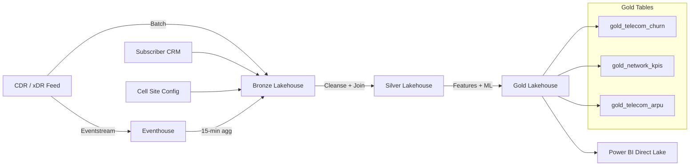

# :satellite: Tutorial 52: Telecom Churn Prediction & Network Quality Analytics


Build a complete telecom analytics platform on Microsoft Fabric for a regional wireless
carrier with 3.5M subscribers and 8,000 cell sites. This tutorial covers churn
prediction, network quality monitoring, and revenue assurance with CPNI compliance.

---

## :dart: Learning Objectives

By the end of this tutorial you will:

1. Generate realistic CDR, subscriber, and cell site data
2. Build a medallion pipeline (Bronze -> Silver -> Gold) for telecom
3. Enrich CDRs with subscriber profiles and cell site metadata
4. Train a churn propensity model using Spark ML
5. Compute network quality KPIs by cell, sector, and hour
6. Implement CPNI compliance controls (access, consent, audit)

---

## :world_map: Architecture Overview



---

## :building_construction: Prerequisites

| Requirement | Details |
|-------------|---------|
| Microsoft Fabric workspace | F64 SKU or trial capacity |
| Lakehouses | `lh_bronze`, `lh_silver`, `lh_gold` created |
| Python environment | Python 3.10+, `pip install numpy pandas faker tqdm` |
| Fabric notebooks | Import capability enabled |
| CPNI training | Analyst team trained on CPNI obligations |

---

## :one: Step 1: Generate Sample Data

### 1.1 Install Dependencies

```bash
cd data_generation
pip install -r requirements.txt
```

### 1.2 Generate CDR Data

```bash
python -m data_generation.generators.telecom.cdr_generator
```

This produces:
- **5,000 CDR records** with voice, SMS, and data sessions
- **1,000 subscriber profiles** with plan types and churn flags (~3% churn)
- **200 cell sites** (600 sectors) with coordinates and technology type

### 1.3 Verify Output

```python
import pandas as pd

df = pd.read_parquet("data_generation/output/telecom_cdr_sample.parquet")
print(f"Records: {len(df):,}")
print(f"Call types: {df['call_type'].value_counts().to_dict()}")
print(f"Date range: {df['start_dt'].min()} to {df['start_dt'].max()}")
```

**Expected output:**
```
Records: 5,000
Call types: {'data': ~3000, 'voice': ~1250, 'sms': ~750}
Date range: [30 days of data]
```

:white_check_mark: **Checkpoint:** You should see ~60% data, ~25% voice, ~15% SMS distribution.

---

## :two: Step 2: Upload Data to Fabric

### 2.1 Upload to Lakehouse

1. Open your **lh_bronze** lakehouse in Fabric
2. Navigate to **Files > output**
3. Upload `telecom_cdr_sample.parquet`

### 2.2 Create Reference Tables

Upload subscriber and cell site reference data. You can generate these separately:

```python
from data_generation.generators.telecom.cdr_generator import TelecomCDRGenerator

gen = TelecomCDRGenerator(seed=42, num_subscribers=1000, num_cell_sites=200)
gen.get_subscriber_df().to_parquet("subscribers.parquet", index=False)
gen.get_cell_site_df().to_parquet("cell_sites.parquet", index=False)
```

Upload both files to `lh_bronze/Files/output/`.

:white_check_mark: **Checkpoint:** Three parquet files visible in lh_bronze/Files/output/.

---

## :three: Step 3: Bronze Ingestion

### 3.1 Import Notebook

Import `notebooks/bronze/56_telecom_cdr.py` into your Fabric workspace.

### 3.2 Configure and Run

1. Attach to your **lh_bronze** lakehouse
2. Verify `SOURCE_PATH` matches your upload location
3. Run all cells

### 3.3 Verify Bronze Table

```sql
SELECT call_type, COUNT(*) as cnt
FROM lh_bronze.bronze_telecom_cdr
GROUP BY call_type
ORDER BY cnt DESC
```

**Expected:**

| call_type | cnt |
|-----------|-----|
| data | ~3,000 |
| voice | ~1,250 |
| sms | ~750 |

:white_check_mark: **Checkpoint:** `bronze_telecom_cdr` table created with all records.

---

## :four: Step 4: Silver Enrichment

### 4.1 Import and Run

Import `notebooks/silver/56_telecom_enriched.py` and attach to both `lh_bronze`
(source) and `lh_silver` (target) lakehouses.

### 4.2 What Happens

The Silver notebook performs:

1. **Deduplication** -- removes duplicate CDRs by `cdr_id`
2. **Validation** -- filters records where voice/data duration <= 0
3. **Enrichment** -- joins with subscriber profiles (plan, tenure, churn flag) and
   cell sites (coordinates, technology)
4. **Quality metrics** -- calculates throughput (Mbps) and data volume (MB)
5. **Daily aggregation** -- per-subscriber daily usage summaries

### 4.3 Verify Silver Tables

```sql
-- Enriched CDRs
SELECT subscriber_id, plan_type, call_type, throughput_mbps
FROM lh_silver.silver_telecom_usage
LIMIT 10

-- Daily aggregates
SELECT subscriber_id, call_date, voice_calls, data_volume_mb
FROM lh_silver.silver_telecom_daily_usage
ORDER BY call_date DESC
LIMIT 10
```

:white_check_mark: **Checkpoint:** Both `silver_telecom_usage` and `silver_telecom_daily_usage` created.

---

## :five: Step 5: Gold Analytics

### 5.1 Import and Run

Import `notebooks/gold/56_telecom_churn.py` and attach to `lh_silver` and `lh_gold`.

### 5.2 Churn Propensity Scores

The notebook trains a Gradient Boosted Tree classifier on subscriber features:

| Feature | Description |
|---------|-------------|
| tenure_months | Months since activation |
| monthly_charge | Plan price |
| total_voice_calls | Total calls in period |
| total_sms_count | SMS messages sent |
| data_usage_gb | Total data consumed |
| arpu | Estimated monthly revenue |
| mean_throughput_mbps | Average download speed |
| distinct_active_days | Days with any activity |
| voice_minutes | Total voice minutes |

**Risk tiers:**
- :red_circle: **High (>0.7):** Immediate retention intervention
- :orange_circle: **Medium (0.4-0.7):** Targeted offer via SMS/app
- :green_circle: **Low (<0.4):** Standard engagement

### 5.3 Network KPIs

The network KPI table aggregates per cell/sector/hour:
- Dropped call rate (%)
- Average throughput (Mbps)
- Total data volume (MB)
- Unique subscriber count

### 5.4 Verify Gold Tables

```sql
-- Churn scores by risk tier
SELECT risk_tier, COUNT(*) as subscribers, AVG(churn_propensity) as avg_score
FROM lh_gold.gold_telecom_churn
GROUP BY risk_tier

-- Worst cells by dropped call rate
SELECT cell_id, sector, dropped_call_rate, voice_attempts
FROM lh_gold.gold_network_kpis
WHERE voice_attempts > 10
ORDER BY dropped_call_rate DESC
LIMIT 10

-- ARPU by plan
SELECT * FROM lh_gold.gold_telecom_arpu
```

:white_check_mark: **Checkpoint:** All three Gold tables created with meaningful data.

---

## :six: Step 6: CPNI Compliance Controls

### 6.1 Access Control

Configure workspace RBAC to restrict CPNI-containing tables:

| Table | Access Level | Roles |
|-------|-------------|-------|
| bronze_telecom_cdr | Restricted | Data Engineers, CPNI Authorised |
| silver_telecom_usage | Restricted | Data Engineers, CPNI Authorised |
| gold_telecom_churn | Broader | Analysts, Marketing (no PII) |
| gold_network_kpis | Broader | NOC, Network Planning |

### 6.2 Consent Enforcement

The `cpni_consent` flag on subscriber profiles controls data usage:

```sql
-- Only use CDRs from consented subscribers for marketing analytics
SELECT s.*
FROM silver_telecom_usage s
JOIN bronze_telecom_subscribers b ON s.subscriber_id = b.subscriber_id
WHERE b.cpni_consent = true
```

### 6.3 Audit Trail

Enable SQL audit logs on all lakehouses. Review access patterns monthly:

```kql
FabricAuditLogs
| where TableName contains "telecom"
| where Operation in ("SELECT", "EXPORT")
| summarize AccessCount = count() by UserPrincipal, TableName, bin(Timestamp, 1h)
| where AccessCount > 100
| order by AccessCount desc
```

:white_check_mark: **Checkpoint:** RBAC configured, consent queries tested, audit logging enabled.

---

## :seven: Step 7: Power BI Dashboard

### 7.1 Create Direct Lake Semantic Model

Connect to the Gold lakehouse and add:
- `gold_telecom_churn`
- `gold_network_kpis`
- `gold_telecom_arpu`

### 7.2 Suggested Report Pages

1. **Churn Command Centre** -- risk tier donut, propensity histogram, top-risk subscriber list
2. **Network Health** -- cell site map with DCR overlay, throughput trends, worst-cell table
3. **Revenue Dashboard** -- ARPU by segment bar chart, usage trends, plan distribution

### 7.3 Key DAX Measures

```dax
Churn Rate =
DIVIDE(
    COUNTROWS(FILTER(gold_telecom_churn, gold_telecom_churn[label] = 1)),
    COUNTROWS(gold_telecom_churn)
)

Avg ARPU =
AVERAGE(gold_telecom_churn[arpu])

High Risk Subscribers =
COUNTROWS(FILTER(gold_telecom_churn, gold_telecom_churn[risk_tier] = "high"))
```

:white_check_mark: **Checkpoint:** Direct Lake model created, at least one report page rendering.

---

## :test_tube: Validation

Run the unit tests to verify the data generator:

```bash
pytest validation/unit_tests/telecom/test_cdr_generator.py -v
```

Expected: **6 tests passed**.

---

## :books: Summary

| Component | File | Output |
|-----------|------|--------|
| Data Generator | `data_generation/generators/telecom/cdr_generator.py` | CDRs, subscribers, cell sites |
| Bronze Notebook | `notebooks/bronze/56_telecom_cdr.py` | `bronze_telecom_cdr` |
| Silver Notebook | `notebooks/silver/56_telecom_enriched.py` | `silver_telecom_usage`, `silver_telecom_daily_usage` |
| Gold Notebook | `notebooks/gold/56_telecom_churn.py` | `gold_telecom_churn`, `gold_network_kpis`, `gold_telecom_arpu` |
| Unit Tests | `validation/unit_tests/telecom/test_cdr_generator.py` | 6 passing tests |
| Use Case Doc | `docs/use-cases/telecom-churn-network.md` | Architecture + compliance reference |

---

## :link: Related Resources

- [CPNI Rules (47 CFR 64)](https://www.ecfr.gov/current/title-47/chapter-I/subchapter-B/part-64/subpart-U)
- [Microsoft Fabric Real-Time Intelligence](https://learn.microsoft.com/fabric/real-time-intelligence/)
- [Spark ML GBTClassifier](https://spark.apache.org/docs/latest/ml-classification-regression.html#gradient-boosted-tree-classifier)
- [Tutorial 01: Casino Slot Telemetry](../01-bronze-layer/README.md) (similar medallion pattern)

---

**Next:** [Tutorial 53 >>](../53-pharma/README.md)
