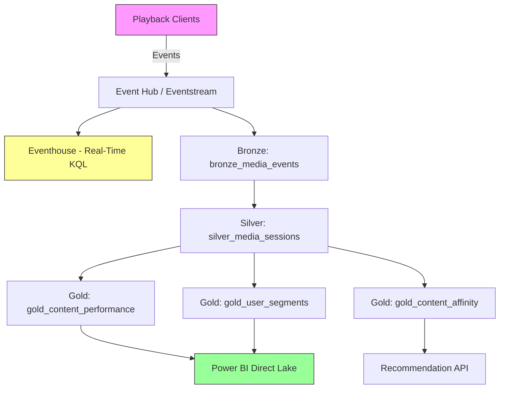
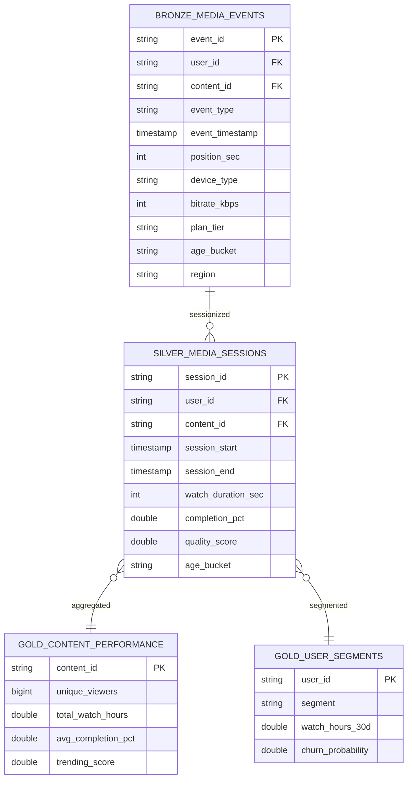

# 🎬 Tutorial 54: Media & Entertainment Audience Analytics


Build a complete audience analytics pipeline for a streaming media platform on Microsoft Fabric. You will ingest 2B+ playback events per day through the medallion architecture, sessionize viewing behavior, build content performance dashboards, and produce user engagement segments for churn prediction and content recommendations.

---

## 📋 Prerequisites

- Microsoft Fabric workspace with F64 (or higher) capacity
- Lakehouse items: `lh_bronze`, `lh_silver`, `lh_gold`
- Python 3.10+ with `numpy`, `pandas`, `faker` installed locally (for data generation)
- Basic familiarity with PySpark and Delta Lake

## 🎯 Learning Objectives

By the end of this tutorial you will be able to:

1. Generate realistic streaming playback events with COPPA-compliant age gating
2. Ingest raw events into a Bronze Delta table with quality checks
3. Sessionize events in the Silver layer with bot filtering and heartbeat dedup
4. Build Gold-layer content performance KPIs and user engagement segments
5. Query real-time engagement metrics with KQL in Eventhouse
6. Understand COPPA and GDPR compliance patterns in media analytics

## 🏗️ Architecture



## 📊 Data Model



---

## 🚀 Step-by-Step Instructions

### Step 1: Generate Sample Data

Generate playback events locally using the media event generator.

```python
from data_generation.generators.media.event_generator import MediaEventGenerator

gen = MediaEventGenerator(seed=42)
df = gen.generate(num_records=50000)
gen.to_parquet(df, "output/bronze_media_events.parquet")

print(f"Generated {len(df):,} events")
print(f"Event types: {df['event_type'].value_counts().to_dict()}")
print(f"Age buckets: {df['age_bucket'].value_counts().to_dict()}")
```

**✅ Verification:** You should see ~50,000 events with five event types (play, pause, seek, stop, heartbeat) and three age buckets (child ~12%, teen ~15%, adult ~73%).

### Step 2: Upload to Fabric Lakehouse

Upload the generated Parquet file to your Bronze lakehouse.

1. Open your Fabric workspace
2. Navigate to `lh_bronze` → **Files** → **output/**
3. Upload `bronze_media_events.parquet`

**✅ Verification:** The file appears under `Files/output/` in the lakehouse explorer.

### Step 3: Run Bronze Notebook

Import and run `notebooks/bronze/58_media_events.py`.

1. In Fabric, select **Import notebook**
2. Upload `58_media_events.py`
3. Attach to your lakehouse and run all cells

**Expected Output:**
- Schema with 14 columns printed
- All critical field null checks show PASS
- Event type and device distribution tables displayed

**✅ Verification:**
```sql
SELECT count(*) FROM lh_bronze.bronze_media_events
-- Should return ~50,000 rows
```

### Step 4: Run Silver Notebook

Import and run `notebooks/silver/58_media_sessions.py`.

1. Import `58_media_sessions.py`
2. Run all cells

**Key Transformations:**
- Heartbeat deduplication removes ~10-15% of events
- Sessionization groups events by user+content with 30-min gap
- Bot filter removes sessions < 5 seconds or > 24 hours

**✅ Verification:**
```sql
SELECT
    count(*) as total_sessions,
    count(distinct user_id) as unique_users,
    avg(completion_pct) as avg_completion,
    avg(quality_score) as avg_quality
FROM lh_silver.silver_media_sessions
```

### Step 5: Run Gold Notebook

Import and run `notebooks/gold/58_media_recommendations.py`.

1. Import `58_media_recommendations.py`
2. Run all cells

**Three output tables are created:**

| Table | Purpose |
|-------|---------|
| `gold_content_performance` | Per-content KPIs with trending score |
| `gold_user_segments` | User engagement segments (power/casual/at-risk/dormant) |
| `gold_content_affinity` | User-content affinity for recommendations |

**✅ Verification:**
```sql
-- Check segment distribution
SELECT segment, count(*) as users, avg(churn_probability) as avg_churn
FROM lh_gold.gold_user_segments
GROUP BY segment
ORDER BY segment
```

Expected segments: power (~15%), casual (~45%), at_risk (~30%), dormant (~10%).

### Step 6: Explore Content Performance

Query the top trending content:

```sql
SELECT content_id, unique_viewers, total_watch_hours,
       round(avg_completion_pct, 2) as completion,
       round(trending_score, 1) as trending
FROM lh_gold.gold_content_performance
ORDER BY trending_score DESC
LIMIT 10
```

### Step 7: Real-Time KQL Queries (Optional)

If you have an Eventhouse configured with the Eventstream, run these KQL queries:

**Live Concurrent Viewers:**
```kql
PlaybackEvents
| where EventTimestamp > ago(5m)
| where EventType in ("play", "heartbeat")
| summarize ConcurrentViewers = dcount(UserId) by bin(EventTimestamp, 1m)
| render timechart
```

**Buffering Alert:**
```kql
PlaybackEvents
| where EventTimestamp > ago(10m)
| where EventType == "buffering"
| summarize BufferEvents = count(), AffectedUsers = dcount(UserId) by Region
| where BufferEvents > 100
```

**✅ Verification:** Charts render with real-time data points updating every minute.

---

## 🔒 Compliance Notes

### COPPA

| Requirement | Implementation |
|-------------|----------------|
| Age-gated profiles | `age_bucket` field on every event; child = under 13 |
| Data minimization | Child events exclude seek granularity, device fingerprints |
| No behavioral ads | AVOD child profiles use contextual targeting only |
| Parental access | Erasure/export via self-service portal |
| Retention limit | Child data: 30 days (vs. 90 days adult) |

### GDPR

| Right | Implementation |
|-------|----------------|
| Consent | Granular opt-in for analytics, personalization, advertising |
| Erasure | DELETE by user_id across Bronze/Silver/Gold + Eventhouse purge |
| Portability | JSON export of viewing history and preferences |
| Pseudonymization | user_id is pseudonymized; PII mapping stored externally |

---

## 🧹 Cleanup

To remove tutorial resources:

```sql
DROP TABLE IF EXISTS lh_bronze.bronze_media_events;
DROP TABLE IF EXISTS lh_silver.silver_media_sessions;
DROP TABLE IF EXISTS lh_gold.gold_content_performance;
DROP TABLE IF EXISTS lh_gold.gold_user_segments;
DROP TABLE IF EXISTS lh_gold.gold_content_affinity;
```

---

## 📚 Related Resources

- [Use Case: Media Audience Analytics](../../use-cases/media-audience-analytics.md)
- [Tutorial 00: Environment Setup](../00-environment-setup/README.md)
- [Tutorial 04: Real-Time Analytics](../04-real-time-analytics/README.md)
- [Fabric Eventstream Docs](https://learn.microsoft.com/en-us/fabric/real-time-intelligence/event-streams/overview)
- [COPPA Rule (FTC)](https://www.ftc.gov/legal-library/browse/rules/childrens-online-privacy-protection-rule-coppa)
- [GDPR Right to Erasure](https://gdpr-info.eu/art-17-gdpr/)

---

## ✅ Progress Tracker

| Step | Task | Status |
|------|------|--------|
| 1 | Generate sample data | ⬜ |
| 2 | Upload to Fabric | ⬜ |
| 3 | Run Bronze notebook | ⬜ |
| 4 | Run Silver notebook | ⬜ |
| 5 | Run Gold notebook | ⬜ |
| 6 | Explore content performance | ⬜ |
| 7 | Real-time KQL queries | ⬜ |

---

**Next Tutorial:** [Tutorial 55 →](../index.md)
