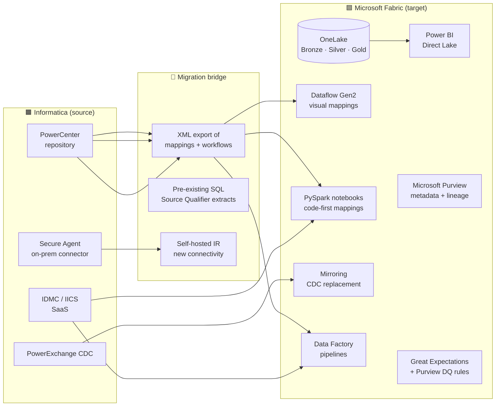

[Home](../../index.md) > [Tutorials](../) > Informatica to Fabric Migration

# 🟧 Tutorial 56: Informatica → Microsoft Fabric Migration

> **Last Updated**: 2026-05-21 | **Status**: ✅ Final | **Maintainer**: Platform Team

<div align="center" markdown>


</div>

---

|  |  |
|---|---|
| **Difficulty** | ⭐⭐⭐⭐ Advanced |
| **Time** | ⏱️ 300-480 minutes (depends on mapping count) |
| **Focus** | Informatica PowerCenter / Intelligent Data Management Cloud (IDMC, formerly IICS) mappings and workflows → Fabric Data Factory pipelines, Dataflows Gen2, and PySpark notebooks |

---

!!! info "Third-party references — publicly sourced, good-faith comparison"
    This page references non-Microsoft products and services. That information is drawn from each vendor's **publicly available documentation** and is offered for honest, good-faith comparison only. This is a personal project written from a Microsoft Fabric and Azure perspective; it does **not** claim expertise in, or authority over, any third-party product, and nothing here is an official statement by, or endorsed by, those vendors. Capabilities, pricing, and features change often — always verify against the vendor's current official documentation. Where a third-party offering is the stronger choice, we say so plainly.

---

## 📋 Table of Contents

- [Overview](#-overview)
- [Why migrate](#-why-migrate)
- [Component mapping](#-component-mapping)
- [Reference architecture](#-reference-architecture)
- [Prerequisites](#-prerequisites)
- [Step-by-step migration](#-step-by-step-migration)
- [Mapping translation patterns](#-mapping-translation-patterns)
- [PowerExchange CDC migration](#-powerexchange-cdc-migration)
- [License and cost analysis](#-license-and-cost-analysis)
- [Validation checklist](#-validation-checklist)
- [Troubleshooting](#-troubleshooting)
- [References](#-references)

---

## 📖 Overview

Informatica is a long-established, widely deployed ETL/data-integration platform with deep connectivity, mature data-quality and MDM capabilities, and a large skills base — genuine strengths that any migration should account for. The descriptions of Informatica products here are based on Informatica's **publicly available documentation** (as of this page's date); always verify against Informatica's current official docs. The two main product lines for migration source are:

1. **PowerCenter** — the classic on-prem ETL platform (mappings, workflows, sessions, repositories).
2. **Intelligent Data Management Cloud (IDMC / formerly IICS)** — the SaaS successor with Data Integration, Data Quality, MDM, B2B Gateway, and more.

This tutorial covers migrations **from either product** **to Microsoft Fabric**. The target is a Fabric F-SKU running Data Factory pipelines, Dataflows Gen2, PySpark notebooks, Mirroring, and Purview governance.

> 📝 **Scope note:** Informatica also has CDC (PowerExchange CDC), MDM, and a Data Quality product. Each gets its own dedicated section below since the target mappings differ.

---

## 🎯 Why migrate

The table below maps common drivers for choosing Fabric to the Fabric capability that addresses them. It reflects Informatica behavior as described in Informatica's publicly available documentation; where Informatica is the better fit for a given need, stay on Informatica. This is a comparison from a Microsoft Fabric perspective, not an authoritative assessment of Informatica.

| Driver for considering Fabric | What Fabric offers |
|---|---|
| Prefer a single-capacity pricing model over per-mapping / per-IPU | Fabric F-SKU covers all workloads under one capacity |
| Prefer browser-based authoring to the PowerCenter thick client | Browser-based Dataflows Gen2 and Data Factory |
| Want native Git-based source control for artifacts | Fabric workspaces + Git integration native |
| Want custom transformations in open Python rather than Informatica-specific code | PySpark notebooks — any Python, any package |
| Consolidating CDC into the analytics platform | Fabric Mirroring (Azure SQL DB, Cosmos DB, Snowflake, Databricks) — included with capacity |
| Prefer integrated DQ over a separate product | Great Expectations / built-in Fabric DQ + Purview classification |
| Prefer integrated master-data patterns over a separate MDM product | Fabric IQ ontology + Data Activator + Translytical task flows |
| Deep Microsoft 365 / Entra integration is a priority | Native Entra ID, sensitivity labels, Defender |

---

## 🧭 Component mapping

The translation matrix below is based on Informatica's publicly documented component model (as of this page's date). Verify specifics against Informatica's current official documentation:

| Informatica component | Microsoft Fabric equivalent | Notes |
|---|---|---|
| **PowerCenter Mapping** | **Dataflow Gen2** (visual) or **Notebook** (PySpark) | Visual paradigm preserved in Dataflow Gen2; code-first via notebooks. |
| **PowerCenter Workflow** | **Fabric Data Factory pipeline** | Sequencing and orchestration. |
| **PowerCenter Session** | Pipeline activity wrapping a Dataflow Gen2 or notebook | One-to-one mental model. |
| **PowerCenter Repository** | Fabric workspace + Git integration | Source-control native. |
| **PowerCenter PowerExchange CDC** | **Fabric Mirroring** (preferred) or **Copy Job CDC** | See [PowerExchange CDC section](#-powerexchange-cdc-migration). |
| **PowerCenter Source Qualifier** | Dataflow Gen2 Source / `spark.read` | Same role. |
| **PowerCenter Aggregator** | Dataflow Gen2 Group-By or PySpark `groupBy().agg()` | Behavior preserved. |
| **PowerCenter Lookup (cached / un-cached)** | Dataflow Gen2 Merge step or PySpark `join` | Caching strategies map directly. |
| **PowerCenter Update Strategy** | Delta Lake `MERGE` | Use Delta MERGE INTO. |
| **PowerCenter Router / Filter** | Dataflow Gen2 Conditional Split or PySpark `filter` + `union` | One-to-one. |
| **PowerCenter Java / Python transformation** | PySpark UDF or **Fabric User Data Functions** | Most translations are mechanical. |
| **PowerCenter Stored Procedure transformation** | Pipeline Stored Procedure activity | Native. |
| **PowerCenter Sequence Generator** | Delta Lake identity columns / `monotonically_increasing_id` | Identity columns are recommended. |
| **PowerCenter Joiner** | PySpark / Dataflow Gen2 Join | Behavior preserved. |
| **PowerCenter Sorter** | `orderBy` / Dataflow Gen2 Sort | One-to-one. |
| **IDMC Cloud Application Integration (CAI)** | Power Automate + Logic Apps | When CAI is doing API orchestration. |
| **IDMC Mass Ingestion** | Fabric Copy Job + Mirroring | Bulk + CDC together. |
| **IDMC Data Quality (DQ rules)** | **Great Expectations** suites + Purview rules | See [validation framework](../../validation/README.md). |
| **Informatica MDM** | **Fabric IQ** ontology + Data Activator triggers | Master entity management via the ontology layer. |
| **Informatica Metadata Manager / EDC** | **Microsoft Purview** | Lineage, catalog, glossary all in Purview. |
| **Secure Agent (IDMC)** | **Self-hosted Integration Runtime (SHIR)** | For on-prem source connectivity. See [Tutorial 23](../23-shir-data-gateways/README.md). |

---

## 🏗️ Reference architecture



---

## 📋 Prerequisites

- ✅ Fabric F64 capacity with workspace identity ([Tutorial 00](../00-environment-setup/README.md))
- ✅ Self-hosted IR installed if any source is on-prem ([Tutorial 23](../23-shir-data-gateways/README.md))
- ✅ Read-only access to the Informatica repository (PowerCenter) or IDMC org (IICS)
- ✅ XML export of all mappings and workflows from PowerCenter (`pmrep` command-line tool)
- ✅ Migration plan from [Tutorial 13](../13-migration-planning/README.md) signed off

---

## 🚀 Step-by-step migration

### Step 1 — Inventory the Informatica estate

For PowerCenter, the `pmrep` CLI exports the full repository:

```bash
# Export all workflows from a folder
pmrep connect -r MY_REPO -d MY_DOMAIN -n admin -x <password>
pmrep listobjects -o workflow -f MY_FOLDER > workflows.txt
pmrep listobjects -o mapping  -f MY_FOLDER > mappings.txt
pmrep listobjects -o session  -f MY_FOLDER > sessions.txt

# Export to XML for analysis
pmrep objectexport -n MY_FOLDER -m -u workflows.xml
```

For IDMC, export via the Asset Management API:

```bash
curl -X POST "https://${POD}.informaticacloud.com/saas/api/v2/user/login" \
  -d '{"username":"…","password":"…"}' > login.json

SID=$(jq -r .icSessionId login.json)

curl -H "icSessionId: $SID" \
  "https://${POD}.informaticacloud.com/saas/api/v2/objects?type=mapping" \
  > idmc_mappings.json
```

Save the export — it drives the wave plan.

### Step 2 — Bucket mappings by complexity

For each mapping, rate:

| Rating | Criteria | Target | Effort |
|---|---|---|---|
| **Simple** | Source Qualifier → Filter → Aggregator → Target | Dataflow Gen2 (visual) | ~30 min |
| **Medium** | + Lookups, Joiners, Routers, Update Strategy | Dataflow Gen2 or notebook | ~1-2 hr |
| **Complex** | + Java/Python transformation, stored procs, custom SQL overrides | PySpark notebook | ~3-6 hr |
| **Very Complex** | Custom function libraries, dynamic schemas, pmcmd-orchestrated workflows | PySpark notebook + Pipeline + UDF | ~1-2 days |

### Step 3 — Pick a translation strategy per mapping

Three strategies, by mapping shape:

#### 3a. Visual: Dataflow Gen2 (preferred for simple/medium)

Use when the mapping is dominantly Source → Transform → Sink. Dataflow Gen2 has a Mapping Editor very similar to PowerCenter's, with Power Query M behind the scenes.

#### 3b. Code: PySpark notebook (preferred for complex)

Use when you have Java/Python transformations, dynamic schemas, or custom SQL overrides. The PySpark equivalent is usually shorter than the original Informatica mapping.

#### 3c. SQL: Fabric Warehouse stored proc

Use when the mapping is basically `INSERT INTO target SELECT ... FROM source` and the source is already in Fabric Warehouse.

### Step 4 — Land source data in Bronze

For each Informatica source, decide:

| Source type | Target ingestion in Fabric |
|---|---|
| Azure SQL / Cosmos / PostgreSQL | **Mirroring** (zero ETL, sub-second freshness) |
| On-prem SQL Server | SHIR + Copy Job, or Mirroring (preview) |
| Salesforce / Workday / ServiceNow | Data Factory built-in connector |
| Flat files (FTP / SFTP / S3) | Copy Job with SHIR (on-prem) or shortcut (cloud) |
| Mainframe / DB2 | DB2 connector + Copy Job — see [Tutorial 25](../25-ibm-db2-source/README.md) |
| Kafka / Event streams | Eventstreams + Eventhouse — see [Tutorial 26](../26-multi-source-streaming/README.md) |

### Step 5 — Port mappings (wave by wave)

Convert each mapping to its Fabric equivalent. See [Mapping translation patterns](#-mapping-translation-patterns) below for line-by-line examples.

### Step 6 — Re-orchestrate workflows as Fabric pipelines

Each PowerCenter workflow / IDMC taskflow becomes a Fabric Data Factory pipeline. Sessions become Dataflow Gen2 / notebook activities. Decision tasks become If Condition activities. Event-wait tasks become Wait activities or webhook-triggered pipelines.

### Step 7 — Migrate Data Quality rules

Informatica DQ rules → Great Expectations suites. Pattern:

```python
# Great Expectations suite mirroring an Informatica DQ rule
import great_expectations as ge

df = spark.read.table("lh_silver.silver_customer")
ge_df = ge.from_spark(df)

# Original Informatica rule: "customer_id must be unique"
ge_df.expect_column_values_to_be_unique("customer_id")

# Original: "email must match regex"
ge_df.expect_column_values_to_match_regex("email", r"[^@]+@[^@]+\.[^@]+")
```

Purview classification rules pick up the rest (PII detection, glossary mapping).

### Step 8 — Cutover

1. Run Informatica and Fabric in parallel for one full load cycle.
2. Reconcile row counts and key sums for every target table.
3. Repoint downstream consumers (Power BI, ML, external apps).
4. Disable the Informatica session schedule.
5. Archive the Informatica repository XML to `lh_archive`.
6. Cancel the Informatica subscription at renewal.

---

## 🧩 Mapping translation patterns

Concrete pattern-by-pattern translation between Informatica transformations and Fabric equivalents.

### Lookup (cached) → PySpark broadcast join

**Informatica:** Lookup transformation with the "Cache" option enabled.

**Fabric (PySpark):**

```python
from pyspark.sql.functions import broadcast

dim_customer = spark.read.table("lh_silver.dim_customer")     # small
fact_sales   = spark.read.table("lh_silver.fact_sales")        # large

joined = fact_sales.join(broadcast(dim_customer), "customer_id", "left")
```

### Update Strategy (DD_UPDATE / DD_INSERT) → Delta MERGE

**Informatica:** Update Strategy transformation with `IIF(condition, DD_UPDATE, DD_INSERT)`.

**Fabric (PySpark SQL):**

```python
spark.sql("""
  MERGE INTO lh_silver.silver_customer t
  USING staging_customer s
    ON t.customer_id = s.customer_id
  WHEN MATCHED THEN UPDATE SET *
  WHEN NOT MATCHED THEN INSERT *
""")
```

### Aggregator → groupBy().agg()

**Informatica:** Aggregator with `SUM(amount)` grouped by `customer_id`.

**Fabric:**

```python
from pyspark.sql.functions import sum as _sum

result = df.groupBy("customer_id").agg(_sum("amount").alias("total_amount"))
```

### Router → multi-branch filter + union

**Informatica:** Router with 3 output groups (Active, Inactive, Pending).

**Fabric:**

```python
active   = df.filter(df.status == "ACTIVE")
inactive = df.filter(df.status == "INACTIVE")
pending  = df.filter(df.status == "PENDING")

# Write each to its own target
active.write.saveAsTable("lh_silver.silver_active_cust")
inactive.write.saveAsTable("lh_silver.silver_inactive_cust")
pending.write.saveAsTable("lh_silver.silver_pending_cust")
```

### Sequence Generator → Delta identity column

**Informatica:** Sequence Generator with a Reusable shared sequence.

**Fabric (Delta Lake):**

```sql
CREATE TABLE lh_silver.silver_customer (
  customer_sk BIGINT GENERATED ALWAYS AS IDENTITY,
  customer_id STRING,
  -- other columns
) USING delta;
```

### Stored Procedure transformation → Pipeline Stored Proc activity

Drop into a Fabric Warehouse stored procedure activity. Pass parameters via pipeline expressions.

---

## 🔄 PowerExchange CDC migration

PowerExchange CDC is one of Informatica's most-licensed components. The Fabric equivalents:

| Source DB | Fabric replacement |
|---|---|
| **Azure SQL DB / SQL MI** | Fabric Mirroring (GA, free with capacity) |
| **Cosmos DB** | Fabric Mirroring (GA) |
| **Snowflake** | Fabric Mirroring (GA) |
| **PostgreSQL / MySQL** | Fabric Mirroring (Preview) or Eventstreams + Debezium |
| **Oracle** | Currently no native Mirroring — use Eventstreams + Debezium connector, or Copy Job with CDC tracking |
| **DB2 z/OS / LUW** | Copy Job with CDC tracking (see [Tutorial 25](../25-ibm-db2-source/README.md)) |
| **Mainframe (VSAM / IMS)** | SHIR + custom Copy Job, or partner connector |
| **SAP HANA / ECC** | SAP Datasphere connector or Fivetran |

For each PowerExchange CDC instance:

1. Identify the source DB type.
2. Pick the Fabric pattern from the table above.
3. Stand up the equivalent in parallel.
4. Reconcile CDC events for 24-48 hours.
5. Cut over by disabling the PowerExchange capture.

See [Mirroring](../../features/mirroring.md) for the configuration details.

---

## 💰 License and cost analysis

Cost outcomes vary widely by estate, contract terms, and workload mix, so treat any figures here as illustrative only — build your own model from your actual Informatica contract and a measured Fabric capacity sizing. Some organizations see meaningful steady-state savings; others, depending on their licensing and usage, see less. Note too that the migration year often costs more than simply continuing on Informatica because both platforms run in parallel — plan for it.

Informatica licensing is negotiated per-customer and is not generally published; the ranges below are rough, illustrative placeholders only and are **not** sourced from Informatica's official pricing. Replace them with your own contracted numbers before making any decision.

| Cost line | Informatica steady-state (illustrative only) | Fabric steady-state |
|---|---|---|
| Platform license | Varies by contract | F64 capacity (covers all workloads) — see Azure pricing |
| Per-mapping IPU (IDMC) | Varies by usage | Included |
| PowerExchange CDC license | Varies by source count | Included with capacity |
| Data Quality license | Varies by contract | Included (Great Expectations + Purview) |
| MDM license | Varies by contract | Included (Fabric IQ + Translytical) |
| Hardware / hosting | Applies to on-prem PowerCenter | None (SaaS) |

Migration year additional costs:

- Parallel run: 6 months at 2× compute
- Migration partner (if used): $500K-$2M for a medium estate
- Internal labor: 2-4 engineers × 6 months × loaded cost

---

## ✅ Validation checklist

- [ ] Every Informatica source connected via the Fabric equivalent
- [ ] Every mapping ported (Dataflow Gen2, notebook, or pipeline activity)
- [ ] Every workflow re-orchestrated as a Fabric pipeline
- [ ] PowerExchange CDC replaced by Mirroring or equivalent
- [ ] DQ rules ported to Great Expectations / Purview
- [ ] MDM (if any) rebuilt in Fabric IQ
- [ ] Row counts and key sums reconcile between platforms (≤ 0.5% drift)
- [ ] Downstream consumers (PBI, ML, APIs) repointed
- [ ] Final repository XML archived to `lh_archive`
- [ ] Informatica subscriptions cancelled at renewal

---

## 🛠️ Troubleshooting

| Symptom | Likely cause | Fix |
|---|---|---|
| Dataflow Gen2 mapping diverges from PowerCenter result | Different default handling of NULLs in joins | Add explicit `is_null` checks; Power Query treats NULL ≠ NULL by default, PowerCenter does the opposite |
| PySpark UDF translation 10× slower than the Informatica Java transformation | Per-row Python serialization | Rewrite as pandas UDF or native Spark expressions |
| PowerExchange CDC sequence gaps after cutover | Replicas drifted during parallel run | Re-bootstrap the Mirror from a snapshot, then resume CDC |
| Pipeline activity stuck "Queued" for hours | Capacity at workload-isolation cap | Add a dedicated workload pool or scale capacity |
| Lookup-cached transformation misses on Fabric | Source data type coerced to string vs. int | Cast keys explicitly in the join condition |

---

## 📚 References

- [Tutorial 13 — Migration Planning](../13-migration-planning/README.md)
- [Tutorial 23 — SHIR & Data Gateways](../23-shir-data-gateways/README.md)
- [Tutorial 25 — IBM DB2 Source](../25-ibm-db2-source/README.md)
- [Tutorial 26 — Multi-Source Streaming](../26-multi-source-streaming/README.md)
- [Mirroring](../../features/mirroring.md)
- [Copy Job CDC](../../features/copy-job-cdc.md)
- [Dataflow Gen2](../../features/dataflow-gen2.md)
- [Best practices — Migration patterns](../../best-practices/migration-patterns.md)
- [Validation framework](../../validation/README.md)
- [Fabric IQ](../../features/fabric-iq.md) — MDM replacement
- [Purview](../../best-practices/data-governance-deep-dive.md) — metadata manager replacement

---

> **Navigation:** [⬅️ 55 — Palantir → Fabric](../55-palantir-to-fabric/README.md) | [Tutorials Home](../) | [Migration Planning ➡️](../13-migration-planning/README.md)
