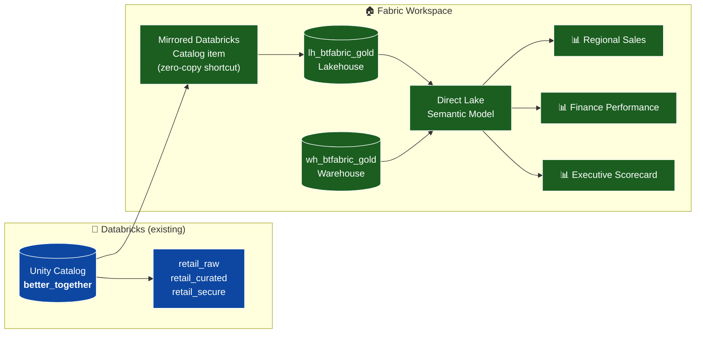

# 🤝 Tutorial 57: Databricks Better Together with Fabric

> **Last Updated**: 2026-05-28 | **Version**: 1.0
> **Status**: ✅ Final | **Maintainer**: Documentation Team

> **🏠 [Home](../../README.md)** › **📖 [Tutorials](../index.md)** › **🤝 Databricks Better Together**

---

<div align="center" markdown>


</div>

---

!!! info "Third-party references — publicly sourced, good-faith comparison"
    This page references non-Microsoft products and services. That information is drawn from each vendor's **publicly available documentation** and is offered for honest, good-faith comparison only. This is a personal project written from a Microsoft Fabric and Azure perspective; it does **not** claim expertise in, or authority over, any third-party product, and nothing here is an official statement by, or endorsed by, those vendors. Capabilities, pricing, and features change often — always verify against the vendor's current official documentation. Where a third-party offering is the stronger choice, we say so plainly.

## 🤝 Tutorial 57: Databricks Better Together — Mirroring, Security, and the Defense-in-Depth Story

| | |
|---|---|
| **Difficulty** | ⭐⭐⭐⭐ Advanced |
| **Time** | ⏱️ 3–4 hours (longer if you also build the Power BI reports) |
| **Focus** | Cross-platform integration + multi-layer security |

| Navigation | |
|---|---|
| ⬅️ **Previous** | [56 — Informatica → Fabric](../56-informatica-to-fabric/README.md) |
| ➡️ **Next**     | _(end of tutorial set — see [Notebook Guides](../../notebooks/README.md))_ |

---

## 📖 Overview

This is **not** another "migrate from Databricks to Fabric" tutorial — that's
already in [tutorial 42](../42-databricks-to-fabric/README.md). This tutorial
covers the *opposite* posture: you want to **keep both** platforms, with
Databricks owning Unity-Catalog–governed transformation and Fabric owning
analytics + BI on the same data, **without copying anything**.

You'll learn how to:

- 🔄 Register a **Databricks mirror** in all three configurations (full /
  inclusion list / exclusion list).
- 🧭 Use the new **Hitchhiker's Guide to Fabric** notebooks as a connectivity
  reference for ADLS / S3 / GCS / on-prem / Snowflake / etc.
- 🛡️ Apply **defense-in-depth security** across all eight Fabric layers,
  with one notebook that automates the lot.
- 📊 Publish a Direct Lake semantic model with **three RLS roles** and
  build three Power BI reports demonstrating progressively stricter access.

---

## 🎯 Learning Objectives

By the end you will be able to:

- [ ] Choose between the four "Databricks ↔ Fabric" integration shapes.
- [ ] Register a Mirrored Azure Databricks Catalog item programmatically.
- [ ] Configure OneLake RLS + CLS (Preview) against a mirrored item.
- [ ] Explain when to use OneLake security vs Warehouse security vs
      semantic-model security.
- [ ] Avoid the Direct Lake → DirectQuery fallback trap.
- [ ] Automate every defense-in-depth layer from a single notebook.

---

## 🗺️ Architecture



The mirror is **shortcut-backed** — no data is copied. The semantic model is
**Direct Lake** — no import, no DAX→SQL translation as long as the Warehouse
RLS/CLS trap is avoided (see [defense-in-depth doc](../../best-practices/security/onelake-defense-in-depth.md)).

---

## 📋 Prerequisites

- [ ] Completed [Tutorial 00 — Environment Setup](../00-environment-setup/README.md).
- [ ] Completed [Tutorial 08 — Database Mirroring](../08-database-mirroring/README.md) (background only).
- [ ] **Azure Databricks** workspace, Premium SKU, with **Unity Catalog enabled** and a metastore you can `CREATE CATALOG` on.
- [ ] **Fabric** workspace on F-SKU or trial.
- [ ] Ability to create Entra ID groups (you'll need delegated `Group.ReadWrite.All` or an SP with `Group.Create`).
- [ ] Azure Key Vault for storing the Databricks connection ID + SP client secret.

> 💡 You **do not** need to deploy a fresh Databricks workspace — the included
> Bicep gates the workspace module behind `deployDatabricks = false` by
> default. See [infra/main.bicep](infra/main.bicep).

---

## 🧭 Tutorial map

```
00. Generate sample data on the host
01. Deploy Azure scaffolding (Key Vault + landing storage; DBW optional)
02. Set up Databricks Unity Catalog estate (notebooks/setup/00)
03. Load sample data into UC                (notebooks/setup/01)
04. Register the Fabric mirror — Pattern A (notebooks/mirroring/01)
05. Register the Fabric mirror — Patterns B & C (notebooks/mirroring/02)
06. Query the mirror from Spark, T-SQL, sempy (notebooks/mirroring/03)
07. Compare with shortcuts / Iceberg / Open Mirroring (04)
08. Build the Gold star schema             (notebooks/gold/01)
09. Publish the Direct Lake semantic model  (semantic-model/)
10. Run the defense-in-depth automation     (notebooks/security/01)
11. Build the three Power BI reports        (semantic-model/README.md)
12. Validate using the test plan            (TEST_PLAN.md)
```

---

## 🚀 Step 1 — Generate sample data

```bash
# from the repo root
python tutorials/57-databricks-better-together/scripts/generate_sample_data.py
```

Outputs land in `sample-data/57-better-together/`:

- `retail/` — five parquet files (customers, products, orders, order_lines, returns)
- `personas/` — `users.csv` + `groups.csv` for the security automation later

Now upload `retail/` to a Databricks UC volume of your choice; we recommend
`/Volumes/better_together/retail_raw/landing/retail/`.

## 🏗️ Step 2 — Deploy Azure scaffolding

```bash
az login --use-device-code --tenant <your-tenant-id>
az account set --subscription <your-subscription-id>

az deployment sub create \
  --location eastus2 \
  --template-file tutorials/57-databricks-better-together/infra/main.bicep \
  --parameters tutorials/57-databricks-better-together/infra/dev.bicepparam
```

> 💡 **Run `--what-if` first** to confirm the blast radius:
> ```bash
> az deployment sub what-if --location eastus2 \
>   --template-file tutorials/57-databricks-better-together/infra/main.bicep \
>   --parameters tutorials/57-databricks-better-together/infra/dev.bicepparam
> ```

The dev parameter file uses `deployDatabricks = false`. Set it to `true`
**only** if you don't already have a Premium DBW workspace.

## 🧱 Step 3 — Unity Catalog estate

Open `notebooks/setup/00_create_unity_catalog.py` in your Databricks workspace
and run it on a UC-enabled cluster. Creates:

- Catalog: `better_together`
- Schemas: `retail_raw`, `retail_curated`, `retail_secure`
- Volume: `retail_raw.landing`

## 📥 Step 4 — Load sample data

Run `notebooks/setup/01_load_sample_data.py` — populates the five raw tables
and creates two **dynamic views** in `retail_secure` that filter by region
via `is_account_group_member()`. These are the same views the inclusion-list
mirror will surface in Fabric.

## 🔄 Step 5 — Register the Databricks mirror in Fabric

Three notebooks, run in order from a Fabric notebook:

| File | Pattern | Outcome |
|---|---|---|
| `notebooks/mirroring/01_register_full_catalog_mirror.py` | Full catalog | All schemas + tables surfaced. |
| `notebooks/mirroring/02_register_partial_mirror.py` | Inclusion **and** exclusion list | Two more mirror items for comparison. |
| `notebooks/mirroring/03_query_mirror_from_spark.py` | (no register) | Read the mirror from Spark, T-SQL, sempy. |
| `notebooks/mirroring/04_compare_mirror_vs_shortcut_vs_iceberg.py` | (reference) | Side-by-side decision matrix. |

> ⚠️ Per Microsoft's publicly documented mirroring behavior, Unity Catalog row
> filters / column masks are **not** carried through the mirror — you re-author
> security in Fabric. That's exactly what Step 8 does. (Verify against the
> current Databricks and Fabric docs, as both evolve.)

## 🏗️ Step 6 — Gold star schema

`notebooks/gold/01_gold_star_schema.py` builds:

- `dim_region`, `dim_customer` (PII-stripped), `dim_product`, `dim_date`
- `fact_sales` (order-line grain), `fact_returns` (same grain)

…all as Delta tables in `lh_btfabric_gold`.

## 📐 Step 7 — Publish the semantic model

Open `semantic-model/model.tmdl` in Power BI Desktop (March 2026+) →
**File → Open report** → select the parent folder. Save as a `.pbip` project,
then publish to your Fabric workspace.

See [`semantic-model/README.md`](semantic-model/README.md) for the three
reports + the fixed-identity refresh pattern.

## 🛡️ Step 8 — Apply defense-in-depth

Run `notebooks/security/01_apply_defense_in_depth.py` from a Fabric notebook
with sufficient permissions (Graph `Group.ReadWrite.All`, Fabric workspace
Admin, Lakehouse OneLake-security writer, Warehouse `db_owner`).

The notebook is **idempotent** — safe to re-run; existing groups/roles/
assignments are detected and skipped.

It configures:

1. Entra ID groups for every persona (Microsoft Graph)
2. Fabric workspace role assignments
3. OneLake security roles — RLS (GA) + CLS (Preview)
4. Warehouse RLS + DDM
5. Fixed identity instructions for semantic model refresh
6. The `rls_user_region_map` Delta table that powers the dynamic role

See [`docs/best-practices/security/onelake-defense-in-depth.md`](../../best-practices/security/onelake-defense-in-depth.md) for
the conceptual model + the OneLake-vs-everything comparison.

## ✅ Step 9 — Validate

Walk the [TEST_PLAN.md](TEST_PLAN.md) checklist. Every step has expected
output you can verify before declaring victory.

---

## 🧠 Big ideas

1. **"Databricks mirroring" is catalog-shaped, not table-shaped.**
   Pick *full / inclusion / exclusion* posture per workspace, not per table.

2. **Mirror data is zero-copy.** No replication delay, no storage cost
   beyond the free-mirror entitlement.

3. **UC security does NOT survive the mirror.** Re-author in Fabric.

4. **OneLake security is the only cross-engine layer.** RLS GA, CLS Preview.

5. **Warehouse RLS/CLS triggers Direct Lake → DirectQuery fallback.** If
   you want Direct Lake performance, push enforcement to OneLake.

6. **SPNs cannot be RLS/OLS members.** Use Fixed Identity for refresh.

7. **`notebookutils` is the 2026 namespace.** `mssparkutils` still works but
   is deprecated; `dbutils` does not exist in Fabric.

---

## 🗂️ Files in this tutorial

```
tutorials/57-databricks-better-together/
  README.md                  ← you are here
  TEST_PLAN.md               ← end-to-end manual test checklist
  infra/
    main.bicep               ← subscription-scope orchestrator
    dev.bicepparam           ← dev environment parameters
  notebooks/
    setup/
      00_create_unity_catalog.py
      01_load_sample_data.py
    mirroring/
      01_register_full_catalog_mirror.py
      02_register_partial_mirror.py
      03_query_mirror_from_spark.py
      04_compare_mirror_vs_shortcut_vs_iceberg.py
    gold/
      01_gold_star_schema.py
    security/
      01_apply_defense_in_depth.py
  semantic-model/
    model.tmdl
    README.md
  scripts/
    generate_sample_data.py
```

Companion files outside this directory:

- `docs/best-practices/security/onelake-defense-in-depth.md` — defense map
- `notebooks/hitchhikers-guide/` — six persona-based cheat-sheet notebooks
- `data_generation/generators/better_together/` — sample-data generators
- `infra/modules/databricks/databricks-workspace.bicep` — DBW module
- `infra/modules/security/key-vault.bicep` — Key Vault module

## 📓 Open the notebooks

> The docs site renders this page, not the `.py` notebooks. The links below
> open each notebook's source on GitHub — download/copy it, then import into
> your workspace (Databricks for setup, Fabric for mirroring/gold/security).

| Notebook | Runs in | Purpose |
|---|---|---|
| [`setup/00_create_unity_catalog.py`](https://github.com/fgarofalo56/Supercharge_Microsoft_Fabric/blob/main/tutorials/57-databricks-better-together/notebooks/setup/00_create_unity_catalog.py) | Databricks | UC catalog + schemas + volume |
| [`setup/01_load_sample_data.py`](https://github.com/fgarofalo56/Supercharge_Microsoft_Fabric/blob/main/tutorials/57-databricks-better-together/notebooks/setup/01_load_sample_data.py) | Databricks | Load 5 Delta tables + secure views |
| [`mirroring/01_register_full_catalog_mirror.py`](https://github.com/fgarofalo56/Supercharge_Microsoft_Fabric/blob/main/tutorials/57-databricks-better-together/notebooks/mirroring/01_register_full_catalog_mirror.py) | Fabric | Full catalog mirror (REST) |
| [`mirroring/02_register_partial_mirror.py`](https://github.com/fgarofalo56/Supercharge_Microsoft_Fabric/blob/main/tutorials/57-databricks-better-together/notebooks/mirroring/02_register_partial_mirror.py) | Fabric | Inclusion + exclusion-list mirrors |
| [`mirroring/03_query_mirror_from_spark.py`](https://github.com/fgarofalo56/Supercharge_Microsoft_Fabric/blob/main/tutorials/57-databricks-better-together/notebooks/mirroring/03_query_mirror_from_spark.py) | Fabric | Read the mirror (Spark / T-SQL / sempy) |
| [`mirroring/04_compare_mirror_vs_shortcut_vs_iceberg.py`](https://github.com/fgarofalo56/Supercharge_Microsoft_Fabric/blob/main/tutorials/57-databricks-better-together/notebooks/mirroring/04_compare_mirror_vs_shortcut_vs_iceberg.py) | Fabric | Decision matrix |
| [`gold/01_gold_star_schema.py`](https://github.com/fgarofalo56/Supercharge_Microsoft_Fabric/blob/main/tutorials/57-databricks-better-together/notebooks/gold/01_gold_star_schema.py) | Fabric | Direct-Lake star schema from the mirror |
| [`security/01_apply_defense_in_depth.py`](https://github.com/fgarofalo56/Supercharge_Microsoft_Fabric/blob/main/tutorials/57-databricks-better-together/notebooks/security/01_apply_defense_in_depth.py) | Fabric | Entra groups, OneLake RLS/CLS, Warehouse RLS/DDM |
