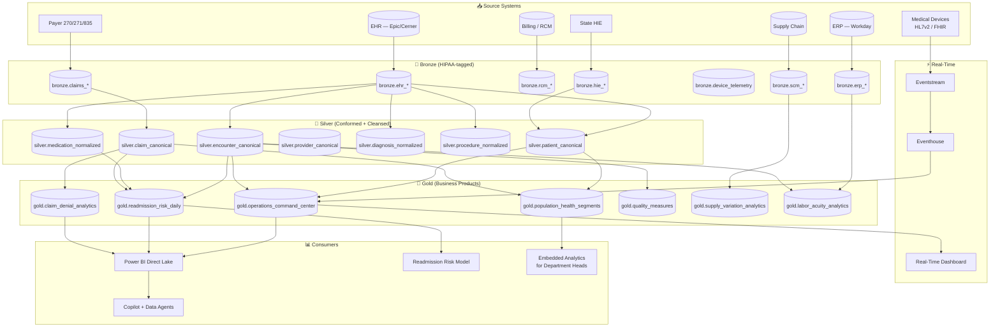

# Commercial Healthcare Operations Analytics

> **Anchor Use Case for Phase 14 Wave 6 — Commercial Industry Verticals**
> Leveraging Microsoft Fabric to optimize hospital operations, claims processing, readmission reduction, and population health management for commercial healthcare delivery systems while maintaining strict HIPAA + HITRUST compliance.

---

## Executive Summary

Commercial healthcare delivery in the United States operates at the intersection of clinical care, regulatory compliance, financial pressure, and operational complexity. A 350-bed regional health system processes more than 30,000 inpatient admissions annually, generates 1.2 million ambulatory encounters, files 2.4 million claims, and manages a 1,400-clinician workforce — while operating on margins frequently below 3%. Hospital systems that fail to optimize operations face catastrophic financial consequences: readmissions alone generate over $2 billion annually in CMS penalties, and operational inefficiencies in supply chain, staffing, and length-of-stay routinely exceed 8% of total expense.

Microsoft Fabric provides the unified analytics platform commercial healthcare needs to bring together the clinical (EHR), administrative (registration, scheduling), revenue cycle (charges, claims, remittance), supply chain (materials, pharmacy), and population (claims, social determinants) data that historically lives in 30+ disconnected systems. This anchor use case demonstrates how a representative commercial health system implements:

- **Real-time hospital operations command center** consolidating ED throughput, inpatient occupancy, OR utilization, and discharge planning into a single executive view that updates every 30 seconds during operating hours
- **CMS readmission risk model** scoring every admitted patient daily, integrating clinical signals, prior-utilization patterns, and social determinants to flag those at high risk for the 30-day all-cause readmission penalty programs (HRRP, BPCI, Medicare Advantage value-based contracts)
- **Claims denial analytics** that detect payer-specific denial patterns, drive proactive remediation, and reduce write-offs that average 6-9% of charges in unmanaged organizations
- **Population health stratification** classifying enrolled lives across rising-risk, chronic, and complex-care cohorts to deploy care management, post-acute partnerships, and hospital-at-home interventions cost-effectively
- **Supply and labor analytics** quantifying clinical supply variation, OR block utilization, and staffing-to-acuity ratios to surface the 5-15% efficiency gains routinely available to data-driven operators

The architecture is built on a HIPAA-compliant medallion lakehouse, with Workspace Identity for service-to-service authentication, customer-managed keys for encryption, OneLake Security with row-level filters for clinical access controls, immutable audit trails for HIPAA Privacy Rule attestation, and a DSAR cascade pattern (per the Wave 5 GDPR/HIPAA right-to-deletion documentation) that handles patient-rights requests across Bronze, Silver, Gold, and downstream consumer surfaces.

---

## Industry Context & Business Problem

### The Operational Reality of Commercial Healthcare

A modern community-based health system runs the most complex enterprise IT environment outside of a global investment bank — and on a fraction of the technology budget. A 350-bed system typically operates:

- 1 EHR (Epic, Cerner/Oracle Health, MEDITECH, or Allscripts) holding 8-15 TB of structured clinical data
- 1 ERP (Workday, Oracle, Infor, PeopleSoft) for finance and HR
- 1 billing/revenue-cycle system (often the EHR's billing module, or a vendor like SSI, Change Healthcare, R1)
- 1 supply chain management platform (Workday, Oracle Cerner, Lawson)
- 1-3 clinical communication systems (Vocera, Epic Secure Chat, Microsoft Teams)
- 5-10 ancillary systems (PACS, lab, pharmacy, dietary, transport, environmental services)
- 10-30 niche clinical applications (cardiology, oncology, ambulatory specialty, behavioral health)
- Real-time monitoring streams from medical devices (telemetry, vital signs, ventilators, infusion pumps)
- External feeds (state HIE, payer eligibility, e-prescribing networks, public health reporting)

These systems were never designed to be analyzed together. Reporting is fragmented across 4-12 BI tools (Tableau, Crystal Reports, Power BI, native EHR dashboards, vendor-supplied analytics). Critical decisions — a CFO trying to understand denial trends, a CMO investigating a quality outlier, a CNO planning unit staffing — require pulling data from 4-7 sources, manually reconciling differences, and building one-off Excel models that age out within hours.

### The Five Operational Domains This Use Case Addresses

| Domain | Business Question | Data Sources Joined | Decision Cadence |
|--------|------------------|---------------------|------------------|
| **Throughput & Capacity** | Where will the bottleneck be in 4 hours? | EHR ADT + OR scheduling + ED tracker + telemetry | Continuous (30s-5min) |
| **Quality & Safety** | Which admitted patient is at greatest risk for an avoidable adverse event? | EHR clinical + prior utilization + meds + labs | Daily |
| **Revenue Cycle Integrity** | Where are we losing money to denials and underpayments? | Claims (837/835) + EHR charge capture + payer contracts | Weekly + per-claim |
| **Population Health** | Of our 80,000 attributed lives, who needs care management this month? | Claims + EHR longitudinal + SDOH + risk scores | Monthly |
| **Resource Optimization** | Where is supply spend or labor staffing out of band with peers? | ERP + EHR scheduling + benchmark feeds | Weekly + budget cycle |

### Why Today's Architectures Fail

The status quo in commercial healthcare analytics is some combination of:

1. **EHR-vendor analytics packages** — strong on clinical data the EHR owns, but weak on cross-vendor data, slow to evolve, and frequently behind on modern formats (still bulk-exporting CSVs in 2026)
2. **Enterprise data warehouse (EDW)** — typically a 15-year-old SQL Server or Teradata platform with stale ETL pipelines and a backlog of 200+ unfulfilled report requests
3. **Department-level BI** — point solutions that solved one problem (e.g., OR utilization) but never integrate with the rest of the organization
4. **Manual reconciliation** — Excel macros, Access databases, and tribal knowledge held by a small number of analytics power users

The result: analytics outputs that are **stale, mistrusted, and uncomposable**. A new analytical question routinely takes 8-16 weeks to answer.

Microsoft Fabric reframes the problem: ingest each system once into Bronze, conform once to canonical entities in Silver, build governed business products in Gold, and let every consumer (Power BI, Copilot, Data Agents, ML models, embedded analytics) query the same trusted source. This use case demonstrates the pattern at production scale.

---

## Regulatory & Compliance Context

Commercial healthcare operates under one of the most demanding regulatory frameworks of any industry. Every architectural decision in this use case is informed by compliance requirements.

### Primary Regulatory Frameworks

| Regulation | Scope | Implementation |
|------------|-------|----------------|
| **HIPAA Privacy Rule** (45 CFR §164.500) | All PHI use and disclosure | Minimum necessary access, auditable disclosures, BAA with all sub-processors |
| **HIPAA Security Rule** (45 CFR §164.302) | ePHI safeguards | CMK encryption, MFA, audit logs, contingency plan, risk assessment annually |
| **HIPAA Breach Notification** (45 CFR §164.400) | Reporting obligations | 60-day notification to affected individuals; 60-day to HHS for ≥500 people; immediate escalation pathway |
| **HITECH** (42 USC §17932) | Enforcement amplification | Tiered penalties up to $1.9M per violation category; willful neglect = mandatory penalty |
| **42 CFR Part 2** | Substance use disorder records | Heightened consent; segregated storage; redisclosure prohibition |
| **CMS Conditions of Participation** | Hospital operations | QAPI program, infection control, medical staff governance, specific reporting |
| **CMS Quality Programs** | Reimbursement | HRRP, HACRP, VBP, BPCI, Promoting Interoperability — all data-driven |
| **The Joint Commission** | Accreditation | Sentinel event reporting, ORYX measures, performance improvement |
| **State medical privacy laws** | Varies by state | Frequently more restrictive than HIPAA (e.g., California, New York, Texas) |
| **OCR HIPAA enforcement** | Audits + investigations | Risk analyses, BAAs, incident response plan all auditable |

### Voluntary Frameworks Increasingly Required by Commercial Payers

| Framework | Use |
|-----------|-----|
| **HITRUST CSF** | Comprehensive security certification preferred by major payers and large employers |
| **NIST Cybersecurity Framework 2.0** | Federal-aligned cybersecurity baseline |
| **SOC 2 Type II** | Increasingly required for cloud-based clinical and revenue cycle vendors |
| **Stark Law / Anti-Kickback Statute** | Operational analytics that compute physician compensation must respect fair-market-value safe harbors |
| **340B Drug Pricing Program** | If applicable, separate analytics segregation to prevent diversion |

### HIPAA Privacy Rule — The Key Architectural Principle

Every PHI access must be:

- **Authorized** — minimum necessary for the role's job function
- **Audited** — who, what, when, why captured immutably
- **Disclosable** — patient can request an accounting of disclosures going back 6 years (some states longer)
- **Revocable** — patient can request restriction or deletion (in defined circumstances)

This drives the architecture toward:

- Workspace separation by function (clinical operations workspace ≠ population health workspace ≠ research workspace)
- OneLake Security with role-driven row-level filters keyed to patient-encounter-clinician relationships
- Immutable audit trails (per Wave 5 audit-trail-immutability doc) retained for 6 years minimum
- A DSAR/right-of-access workflow that cascades across all medallion layers (per Wave 5 GDPR-deletion doc, with HIPAA-specific timing of 30-day initial response, 60-day extension)

### Compliance Mappings to This Architecture

| Compliance Requirement | Architectural Implementation |
|------------------------|------------------------------|
| HIPAA §164.312(a)(1) — Access controls | Workspace Identity + Entra Conditional Access + OneLake Security row filters |
| HIPAA §164.312(b) — Audit controls | Workspace Monitoring + Log Analytics + immutable WORM storage; 6-year retention |
| HIPAA §164.312(c) — Integrity | Delta Lake transactional guarantees + hash-chain on audit log per Wave 5 |
| HIPAA §164.312(d) — Person/Entity authentication | Entra ID + MFA + risk-based Conditional Access |
| HIPAA §164.312(e) — Transmission security | TLS 1.2+ for all data in transit; Private Endpoints for internal traffic |
| HIPAA §164.308(a)(1) — Security management process | Risk analysis annually + STRIDE threat model per Wave 5 |
| HIPAA §164.308(a)(7) — Contingency plan | Multi-region failover runbook per Wave 1 + RTO 4hr/RPO 30min for clinical workloads |
| HIPAA §164.510(b) — Notice of Privacy Practices | DSAR runbook integration per Wave 5 compliance template |
| HRRP measure data submission | Annual readmission rate calculation pipeline → CMS HQR submission |
| 42 CFR Part 2 segregation | SUD-flagged records routed to a separate sub-lakehouse with stricter access controls |

---

## Reference Architecture



---

## Data Sources & Schemas

### Sources at a 350-Bed Regional Health System

| Source | Volume | Cadence | Primary Use | Compliance Tier |
|--------|--------|---------|-------------|-----------------|
| Epic Clarity / Caboodle | 8-12 TB | Daily refresh | All clinical, scheduling, ADT | PHI (highest) |
| Workday Finance + HR | 200 GB | Hourly | Cost center reporting, labor analytics | Confidential |
| SSI / Change Healthcare 837/835 | 800 GB | Per-claim batch | Claims submission and remittance | PHI |
| Workday SCM | 300 GB | Daily | Supply, pharmacy, OR materials | Confidential |
| Telemetry / device feeds | 50 GB/day streaming | Continuous | ED throughput, vital signs, alerting | PHI (live waveform) |
| State HIE (e.g., HEALTHIX, CRISP) | 10 GB/day | Real-time + daily batch | External care episodes | PHI |
| Payer eligibility (270/271) | 20 GB/day | Per-encounter | Coverage verification | PHI |
| Surescripts e-prescribing | 5 GB/day | Continuous | Medication reconciliation | PHI |
| EJSCREEN, ACS, BRFSS | 2 GB | Annual refresh | SDOH context | Public |
| Internal incident reporting | 10 GB | Daily | Patient safety, near-misses | Confidential / Privileged |

### Canonical Silver Schemas

**`silver.patient_canonical`** (Type 2 SCD per Wave 3 SCD-patterns doc)

```
patient_sk            BIGINT      -- surrogate key
patient_id            STRING      -- master MDM ID (deterministic across sources)
mrn                   STRING      -- medical record number (system-of-record)
first_name_hash       STRING      -- one-way hash for privacy in non-clinical contexts
last_name_hash        STRING
dob                   DATE
sex_legal             STRING
sex_at_birth          STRING      -- new HIPAA gender identity standard
gender_identity       STRING      -- self-reported
race_primary          STRING      -- OMB categories
ethnicity             STRING
preferred_language    STRING
zip3                  STRING      -- de-identified location
deceased_flag         BOOLEAN
deceased_date         DATE
effective_from        TIMESTAMP
effective_to          TIMESTAMP
is_current            BOOLEAN
hipaa_disclosure_log  ARRAY<STRING>   -- audit reference back to disclosure log
```

**`silver.encounter_canonical`**

```
encounter_id          STRING      -- globally unique (source-system + native ID)
patient_id            STRING      -- FK to patient_canonical
encounter_class       STRING      -- inpatient/outpatient/emergency/observation/preventive
admission_ts          TIMESTAMP
discharge_ts          TIMESTAMP
los_days              DECIMAL(8,2)
admission_source      STRING      -- ED, transfer, elective
admission_type        STRING      -- emergent, urgent, elective
discharge_disposition STRING
attending_provider_id STRING
admitting_dx          STRING      -- ICD-10
principal_dx          STRING
drg                   STRING
unit                  STRING      -- nursing unit
room_bed              STRING
attending_specialty   STRING
icu_hours             DECIMAL(8,2)
ventilator_hours      DECIMAL(8,2)
financial_class       STRING      -- Medicare, Medicaid, Commercial, Self-Pay
total_charges         DECIMAL(18,2)
expected_payment      DECIMAL(18,2)
actual_payment        DECIMAL(18,2)
```

**`silver.claim_canonical`** (837 + 835 reconciled)

```
claim_id              STRING
patient_id            STRING
encounter_id          STRING      -- nullable for some claim types
claim_type            STRING      -- institutional, professional, dental, vision, pharmacy
billed_dt             DATE
paid_dt               DATE
status                STRING      -- submitted, pending, paid, denied, partially-paid
total_billed          DECIMAL(18,2)
total_allowed         DECIMAL(18,2)
total_paid            DECIMAL(18,2)
total_patient_responsibility DECIMAL(18,2)
payer_id              STRING
plan_id               STRING
subscriber_id_hash    STRING
denial_codes          ARRAY<STRING>   -- 277 / 835 reason codes
appeal_status         STRING
service_date_from     DATE
service_date_to       DATE
billing_provider_id   STRING
service_lines         INT
```

### Synthetic Generator

The companion synthetic data generator (`data_generation/generators/healthcare/hospital_operations_generator.py`) produces:

- 50,000 patients with realistic demographic distributions (race, ethnicity, age)
- 3-year encounter history per patient (1-15 encounters; tail-skewed)
- Realistic comorbidity bundles (diabetes + CKD + CHF cluster; COPD + smoker; etc.)
- Claims tied to encounters with realistic denial rates by payer (Medicare ~5%; commercial ~12%; Medicaid ~18% denial rates)
- Readmission patterns with risk-factor-correlated probabilities
- All PII hashed; only de-identified fields retained for non-clinical workspaces

---

## Medallion Implementation

### Bronze Layer

```
notebooks/bronze/50_healthcare_admissions.py
```

Pattern:
- Ingest Epic Clarity ADT extract (daily file or CDC stream via Mirroring) into Delta append-only
- Schema-on-read at ingestion (capture even mismatched fields for forensic replay)
- Row-level lineage: `_bronze_load_id`, `_source_file`, `_arrival_ts`
- HIPAA tagging: every column carrying PHI flagged via Purview sensitivity label
- Append-only — no deletes ever in Bronze (hard requirement for HIPAA audit reconstruction)

### Silver Layer

```
notebooks/silver/50_healthcare_cleansed.py
```

Pattern:
- Conform to `silver.patient_canonical`, `silver.encounter_canonical`, `silver.claim_canonical`
- Apply MDM rules (per Wave 3 MDM doc) to deduplicate patient records across sources (Epic + state HIE + payer eligibility may have 3 different "John Smith" records that match probabilistically)
- Apply data contract validation (per Wave 3 data-contracts doc) — reject contract violations to DLQ
- Standardize medical vocabularies: ICD-10-CM (diagnoses), CPT/HCPCS (procedures), RxNorm (meds), LOINC (labs)
- 42 CFR Part 2 segregation: encounters with SUD diagnosis or treatment routed to separate sub-lakehouse with stricter access

### Gold Layer

```
notebooks/gold/50_healthcare_kpis.py
```

Pattern:
- Calculate operational KPIs: case mix index, length-of-stay observed/expected, readmission rate, mortality observed/expected, patient experience scores
- Build readmission risk feature store (per Wave 2 feature-store doc) feeding the daily ML model
- Compute claim denial analytics: denial rate by payer × CARC code, root-cause categorization, recovery potential
- Population health segmentation: rising-risk, chronic, complex-care, transition-of-care cohorts
- Supply variation analytics: physician-level cost variation for the same procedure
- Labor acuity analytics: nurse-to-patient ratio vs acuity score, agency labor consumption

---

## Real-Time Operations Command Center

The 30-second-refresh executive dashboard combines:

- **ED throughput**: arrivals, triage queue depth, time-to-bed, time-to-doc, time-to-disposition
- **Inpatient occupancy**: census by unit, expected discharges next 4h, expected admissions from ED
- **OR utilization**: turnover, prime-time utilization, day-of-surgery cancellations
- **Discharge planning**: discharges projected next 24h, post-acute placement status, discharge barriers

Implementation pattern:

- Eventstream ingests HL7v2 ADT messages and Epic real-time ADT API
- Eventhouse (per Wave 9 / Wave 7 features) materializes 5-minute rolling windows
- Real-Time Dashboard via KQL queries
- Data Activator alerts trigger on capacity thresholds (e.g., census > 95% → page house supervisor)

---

## ML Components

### Readmission Risk Model

**Task**: predict 30-day all-cause readmission risk for any inpatient admission.

**Approach**: Gradient-boosted trees (LightGBM) using:
- Prior 12-month utilization features (ED visits, admissions, observation stays)
- Index admission clinical features (DRG, LOS, comorbidities, labs at discharge)
- Medication features (high-risk drug count, polypharmacy index, recent changes)
- SDOH features (zip-level food access, environmental justice index, housing stability proxies)
- Visit-time features (day of week, season, capacity at discharge)

**Training**: Daily incremental retrain via the MLOps anchor pattern (Wave 2 feature 2.9), with full validation gates including a fairness audit (Wave 2 RAI doc) by race, sex, and primary insurance.

**Deployment**: Daily batch scoring of all currently-admitted patients; high-risk scores flagged for the case management team via Power BI.

### Denial Prediction Model

**Task**: at the point of charge capture, predict probability that the resulting claim will be denied.

**Approach**: Catboost with payer + service-line + provider + diagnosis combination features, trained on 18 months of denial history per Wave 2 feature store.

---

## Power BI Semantic Model

The Gold layer publishes through a Direct Lake semantic model with:

- Star schema (fact_encounter, fact_claim, fact_quality_measure, dim_patient_sensitive vs dim_patient_deidentified, dim_provider, dim_payer, dim_date, dim_facility)
- Row-level security (RLS) bound to Entra ID groups: clinical-care-team-X sees only patients on unit X; revenue-cycle sees claims for assigned payer; population-health sees attributed lives only
- 100+ DAX measures pre-built for common operational questions
- Embedded into clinical operations Teams channels for unit-leader self-service

---

## Cost Estimate

For a 350-bed system, ~30,000 admissions/year, ~2.4M claims/year:

| Component | Sizing | Monthly Cost |
|-----------|--------|--------------|
| Fabric F128 (steady-state, 24×7 clinical operations) | 128 CU | $11,500 |
| Fabric F256 burst capacity for monthly close | +128 CU × 5 days | $1,900 |
| OneLake storage | 25 TB | $625 |
| Log Analytics workspace (6yr HIPAA retention) | 50 GB/day, 5yr archive | $4,200 |
| Workspace Monitoring Eventhouse | 10 GB/day | $850 |
| Azure OpenAI (Copilot, ML inference) | 50M tokens/mo | $750 |
| Egress (de minimis with OneLake) | — | $50 |
| **Total Fabric platform** | | **~$19,900/month** |

Compare to typical legacy state: a single EDW + 4 BI tools + clinical analytics package routinely exceeds $40,000/month while delivering 30% of the analytical surface.

### ROI Drivers (typical for a 350-bed system)

| Driver | Conservative Annual Value |
|--------|--------------------------|
| Readmission penalty avoidance (HRRP) | $1.2M |
| Denial recovery (1pp denial rate reduction) | $2.8M |
| Length-of-stay reduction (0.1d average) | $1.5M |
| Supply standardization | $900K |
| Labor optimization (agency reduction) | $700K |
| Population health risk-adjusted shared savings | $1.5M |
| **Total annual value** | **~$8.6M** |

ROI: ~36× the platform cost in year 1, before counting strategic benefits.

---

## Production Checklist

- [ ] BAA with Microsoft executed and on file
- [ ] Workspace Identity for all service-to-service auth
- [ ] CMK enabled with HSM-backed Azure Key Vault
- [ ] Conditional Access requires MFA + compliant device for clinical workspace access
- [ ] OneLake Security row filters tested for clinical/non-clinical separation
- [ ] 42 CFR Part 2 sub-lakehouse provisioned with stricter access
- [ ] Audit log immutability configured (6+ year retention)
- [ ] STRIDE threat model completed and signed off (Wave 5)
- [ ] DSAR runbook adapted for HIPAA right-of-access (30/60-day timing)
- [ ] DR drill executed with RTO 4h/RPO 30min targets
- [ ] HRRP measure submission pipeline tested against CMS HQR
- [ ] Readmission risk model passed fairness audit (Wave 2 RAI)
- [ ] OCR audit-readiness review completed
- [ ] HITRUST CSF gap assessment scheduled
- [ ] Annual HIPAA risk analysis updated to include Fabric architecture
- [ ] Sub-processor list updated (Microsoft Azure carve-out documented)
- [ ] Quality leader has access to drill-down on every Gold KPI
- [ ] Revenue Integrity team trained on denial analytics dashboard
- [ ] Care management team using daily readmission risk export
- [ ] Power BI RLS validated by sample-based attestation per quarter
- [ ] Postmortem template tailored for clinical-impact incidents
- [ ] On-call rotation includes after-hours pager for clinical operations command center

---

## Published References

### Industry & Regulatory
- HHS HIPAA Privacy & Security Rules (45 CFR Parts 160, 164)
- CMS Hospital Readmissions Reduction Program (HRRP) measure specifications
- CMS Value-Based Purchasing (VBP) Hospital Inpatient Quality Reporting
- HITRUST CSF v11 (current control catalog)
- The Joint Commission Sentinel Event Policy
- ONC Cures Act Final Rule (information blocking, FHIR API requirements)

### Microsoft + Healthcare
- [Microsoft Cloud for Healthcare](https://learn.microsoft.com/industry/healthcare/)
- [Azure Health Data Services (FHIR/DICOM)](https://learn.microsoft.com/azure/healthcare-apis/)
- [Microsoft HIPAA Compliance Documentation](https://learn.microsoft.com/compliance/regulatory/offering-hipaa-hitech)
- [Fabric in Healthcare Reference Architecture](https://learn.microsoft.com/fabric/) (general Fabric docs apply)

### Cross-References Within This Repo

| Topic | Location |
|-------|----------|
| Medallion architecture deep dive | `docs/best-practices/medallion-architecture-deep-dive.md` |
| MDM (golden patient record) | `docs/best-practices/data-management/master-data-management.md` |
| Data contracts | `docs/best-practices/data-management/data-contracts.md` |
| SCD Type 2 (patient changes over time) | `docs/best-practices/data-management/scd-patterns.md` |
| Late-arriving data | `docs/best-practices/data-management/late-arriving-data.md` |
| MLOps for production ML | `docs/best-practices/mlops-fabric-production.md` |
| Drift detection | `docs/best-practices/model-monitoring-drift-detection.md` |
| Feature store on OneLake | `docs/best-practices/feature-store-onelake.md` |
| Responsible AI (fairness audits) | `docs/best-practices/responsible-ai-framework.md` |
| HIPAA-relevant security frameworks | `docs/best-practices/security/soc2-type2-readiness.md`, `docs/best-practices/security/iso27001-mapping.md` |
| Right-of-access cascade (DSAR pattern) | `docs/best-practices/security/gdpr-right-to-deletion.md` |
| Compliance template for DSAR | `docs/compliance-templates/dsar-runbook.md` |
| STRIDE threat model | `docs/best-practices/security/threat-model-stride.md` |
| Zero-trust blueprint | `docs/best-practices/security/zero-trust-blueprint.md` |
| Audit immutability | `docs/best-practices/security/audit-trail-immutability.md` |
| SLO/SLI for clinical operations | `docs/best-practices/operations/slo-sli-fabric.md` |
| Incident response (clinical-impact tier) | `docs/runbooks/incident-response-template.md` |
| Capacity throttling response | `docs/runbooks/capacity-throttling-response.md` |
| Multi-region failover (RTO 4h / RPO 30min) | `docs/runbooks/multi-region-failover.md` |
| Companion tutorial | `tutorials/46-commercial-healthcare/README.md` |
| Synthetic generator | `data_generation/generators/healthcare/hospital_operations_generator.py` |
| Bronze notebook | `notebooks/bronze/50_healthcare_admissions.py` |
| Silver notebook | `notebooks/silver/50_healthcare_cleansed.py` |
| Gold notebook | `notebooks/gold/50_healthcare_kpis.py` |
| Generator unit tests | `validation/unit_tests/healthcare/test_hospital_generator.py` |

---

[⬆️ Back to Top](#commercial-healthcare-operations-analytics) | [📚 Use Cases Index](index.md) | [🏠 Home](../index.md)
