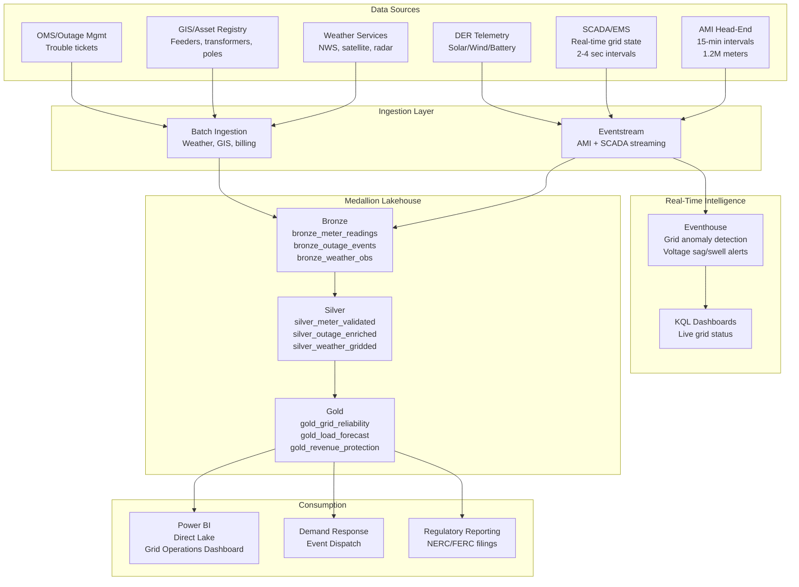
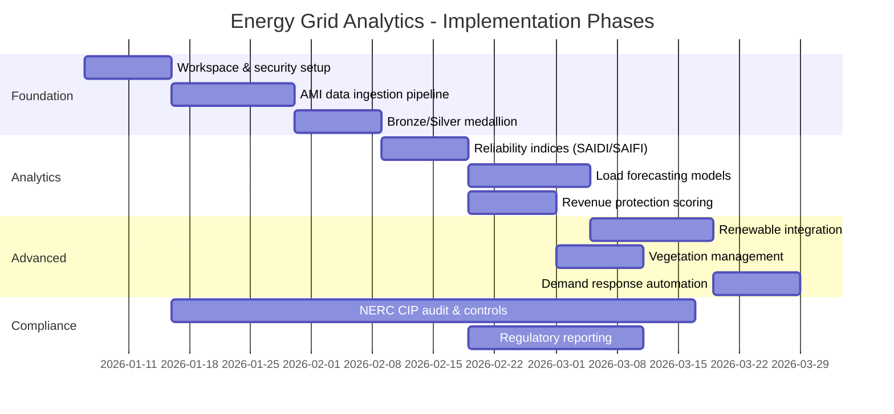

# Energy & Utilities: Smart Grid Analytics

> **Last Updated**: 2026-04-27 | **Version**: 1.0
> **Status**: Phase 14 - Commercial Verticals | **Vertical**: Energy & Utilities
> **Compliance**: NERC CIP v7 | **Regulation**: FERC Order 2222, IEEE 1547

---

<div align="center" markdown>


</div>

---

## Executive Summary

A regional electric utility serves **1.2 million smart meters** across a mixed-generation territory (natural gas, solar, wind) with a **15 GW peak demand**. The Advanced Metering Infrastructure (AMI) generates **15-minute interval readings** producing approximately **35 billion readings per year**. Microsoft Fabric provides the unified analytics platform to transform this telemetry into actionable grid intelligence -- from real-time outage detection to day-ahead load forecasting and renewable integration optimization.

### Business Outcomes

| Metric | Before Fabric | After Fabric | Impact |
|--------|--------------|--------------|--------|
| SAIDI (avg outage minutes) | 142 min | 98 min | -31% |
| Outage detection time | 8-12 min | < 90 sec | -87% |
| Load forecast accuracy (day-ahead) | 91% | 96.5% | +5.5pp |
| Revenue protection (theft detection) | $4.2M/yr loss | $1.1M/yr loss | -74% |
| Demand response participation | 18% | 34% | +89% |
| Renewable curtailment | 6.8% | 3.2% | -53% |

**Estimated Monthly Cost**: ~$20,000 (F64 SKU)
**Annual ROI**: $12-18M from outage reduction, demand response savings, and revenue protection

---

## Architecture Overview



---

## Data Model

### Bronze Layer

#### `bronze_meter_readings`

Raw AMI interval data as received from the head-end system.

| Column | Type | Description |
|--------|------|-------------|
| `meter_id` | STRING | AMI meter identifier (e.g., `MTR-00345921`) |
| `reading_timestamp` | TIMESTAMP | Interval end time (UTC, 15-min aligned) |
| `kwh_delivered` | DOUBLE | Energy delivered to customer (kWh) |
| `kwh_received` | DOUBLE | Energy received from customer -- net metering (kWh) |
| `voltage_a` | DOUBLE | Phase A voltage (volts) |
| `voltage_b` | DOUBLE | Phase B voltage (volts, null for 120V service) |
| `voltage_c` | DOUBLE | Phase C voltage (volts, null for single-phase) |
| `power_factor` | DOUBLE | Power factor (0.0-1.0) |
| `demand_kw` | DOUBLE | Demand in kW for the interval |
| `tamper_flag` | BOOLEAN | Meter tamper detection flag |
| `read_quality` | STRING | Quality code: `ACTUAL`, `ESTIMATED`, `MISSING` |
| `_ingested_at` | TIMESTAMP | Fabric ingestion timestamp |
| `_source` | STRING | Source system identifier |
| `_batch_id` | STRING | Ingestion batch ID |

**Volume**: ~115M records/day (1.2M meters x 96 intervals)
**Partition**: `year/month/day`

#### `bronze_outage_events`

| Column | Type | Description |
|--------|------|-------------|
| `event_id` | STRING | Unique outage event ID |
| `feeder_id` | STRING | Distribution feeder identifier |
| `substation_id` | STRING | Substation identifier |
| `district` | STRING | Operating district |
| `start_datetime` | TIMESTAMP | Outage start time |
| `restore_datetime` | TIMESTAMP | Power restoration time |
| `duration_minutes` | DOUBLE | Outage duration |
| `cause_code` | STRING | IEEE 1366 cause code |
| `cause_description` | STRING | Human-readable cause |
| `customers_affected` | INT | Number of customers interrupted |
| `equipment_failed` | STRING | Failed equipment type |
| `weather_related` | BOOLEAN | Weather-related flag |
| `major_event` | BOOLEAN | Major Event Day (MED) flag per IEEE 1366 |

#### `bronze_weather_observations`

| Column | Type | Description |
|--------|------|-------------|
| `station_id` | STRING | NWS weather station |
| `observation_time` | TIMESTAMP | Observation timestamp |
| `temperature_f` | DOUBLE | Temperature (Fahrenheit) |
| `wind_speed_mph` | DOUBLE | Wind speed |
| `wind_gust_mph` | DOUBLE | Wind gust |
| `precipitation_in` | DOUBLE | Precipitation (inches) |
| `humidity_pct` | DOUBLE | Relative humidity |
| `pressure_mb` | DOUBLE | Barometric pressure |
| `weather_condition` | STRING | Condition category |

### Silver Layer

#### `silver_meter_validated`

Cleansed and validated meter readings with quality enforcement.

| Column | Type | Description |
|--------|------|-------------|
| `meter_id` | STRING | Meter identifier |
| `reading_timestamp` | TIMESTAMP | Interval timestamp |
| `kwh_delivered` | DOUBLE | Validated kWh delivered |
| `kwh_received` | DOUBLE | Validated kWh received |
| `voltage_avg` | DOUBLE | Average voltage across phases |
| `voltage_valid` | BOOLEAN | Within ANSI C84.1 Range A (114-126V @ 120V) |
| `power_factor` | DOUBLE | Power factor |
| `demand_kw` | DOUBLE | Demand kW |
| `read_quality` | STRING | Quality code after validation |
| `tamper_score` | DOUBLE | Theft/tamper probability (0-1) |
| `gap_interpolated` | BOOLEAN | Whether this reading was interpolated |
| `daily_kwh` | DOUBLE | Rolling daily consumption |
| `monthly_kwh` | DOUBLE | Rolling monthly consumption |
| `rate_class` | STRING | Customer rate class |
| `premise_type` | STRING | Residential / Commercial / Industrial |

**Validation Rules**:
- Voltage range: 108-132V for 120V service (ANSI C84.1 Range B extreme)
- kWh must be non-negative
- Intervals must be 15-min aligned
- Gap detection: flag intervals > 15 min apart
- Tamper detection: sudden zero readings, reverse flow anomalies, bypass patterns

#### `silver_outage_enriched`

| Column | Type | Description |
|--------|------|-------------|
| `event_id` | STRING | Outage event ID |
| `feeder_id` | STRING | Feeder ID |
| `district` | STRING | District |
| `duration_minutes` | DOUBLE | Duration |
| `customers_affected` | INT | Customers impacted |
| `cause_category` | STRING | Normalized cause (Weather/Equipment/Vegetation/Animal/Other) |
| `cmi` | DOUBLE | Customer Minutes Interrupted |
| `weather_temp_f` | DOUBLE | Temperature at time of outage |
| `weather_wind_mph` | DOUBLE | Wind speed at time of outage |
| `weather_precip_in` | DOUBLE | Precipitation at time of outage |
| `vegetation_correlated` | BOOLEAN | Correlated with vegetation contact |

### Gold Layer

#### `gold_grid_reliability`

IEEE 1366 reliability indices aggregated by feeder, district, and time period.

| Column | Type | Description |
|--------|------|-------------|
| `period` | STRING | Aggregation period (daily/monthly/quarterly/annual) |
| `period_start` | DATE | Period start date |
| `district` | STRING | Operating district |
| `feeder_id` | STRING | Feeder (null for district-level) |
| `saidi` | DOUBLE | System Average Interruption Duration Index (min) |
| `saifi` | DOUBLE | System Average Interruption Frequency Index |
| `caidi` | DOUBLE | Customer Average Interruption Duration Index (min) |
| `asai` | DOUBLE | Average Service Availability Index |
| `maifi` | DOUBLE | Momentary Average Interruption Frequency Index |
| `customers_served` | INT | Total customers in scope |
| `total_cmi` | DOUBLE | Total Customer Minutes Interrupted |
| `outage_count` | INT | Number of sustained interruptions |
| `med_threshold` | DOUBLE | Major Event Day threshold (2.5 Beta) |
| `excluding_med` | BOOLEAN | Whether MED events are excluded |

**Key Formulas**:
- `SAIDI = SUM(Customer Minutes Interrupted) / Total Customers Served`
- `SAIFI = SUM(Customers Interrupted) / Total Customers Served`
- `CAIDI = SAIDI / SAIFI`
- `ASAI = 1 - (SAIDI / Total Minutes in Period)`

#### `gold_load_forecast`

| Column | Type | Description |
|--------|------|-------------|
| `forecast_datetime` | TIMESTAMP | Forecasted interval |
| `forecast_horizon` | STRING | `hour_ahead`, `day_ahead`, `week_ahead` |
| `district` | STRING | Operating district |
| `predicted_mw` | DOUBLE | Predicted demand (MW) |
| `lower_bound_mw` | DOUBLE | 95% confidence lower bound |
| `upper_bound_mw` | DOUBLE | 95% confidence upper bound |
| `temperature_f` | DOUBLE | Forecast temperature |
| `solar_generation_mw` | DOUBLE | Expected solar generation |
| `wind_generation_mw` | DOUBLE | Expected wind generation |
| `net_load_mw` | DOUBLE | Net load (demand - renewables) |
| `peak_flag` | BOOLEAN | Expected peak period |
| `dr_eligible_mw` | DOUBLE | Demand response capacity available |

#### `gold_revenue_protection`

| Column | Type | Description |
|--------|------|-------------|
| `meter_id` | STRING | Meter identifier |
| `analysis_date` | DATE | Analysis date |
| `theft_score` | DOUBLE | Theft probability (0-1) |
| `anomaly_type` | STRING | Type of anomaly detected |
| `estimated_loss_kwh` | DOUBLE | Estimated energy theft (kWh) |
| `estimated_loss_usd` | DOUBLE | Estimated revenue loss ($) |
| `priority` | STRING | Investigation priority (HIGH/MEDIUM/LOW) |
| `last_field_visit` | DATE | Last physical meter inspection |

---

## Use Cases

### 1. Smart Meter Analytics & AMI Data Management

**Challenge**: Processing 35 billion readings/year with quality validation, gap interpolation, and tamper detection at scale.

**Fabric Solution**:
- **Eventstream** ingests 15-min AMI reads from the head-end via Event Hub
- **Bronze** stores raw reads with full fidelity
- **Silver** applies ANSI C84.1 voltage validation, gap interpolation, tamper scoring
- **Gold** aggregates to daily/monthly billing determinants

**KQL for Real-Time Voltage Monitoring**:
```kql
MeterReadings
| where reading_timestamp > ago(1h)
| where voltage_a < 108 or voltage_a > 132
| summarize ViolationCount = count(),
            AvgVoltage = avg(voltage_a),
            AffectedMeters = dcount(meter_id)
    by bin(reading_timestamp, 5m), feeder_id
| where ViolationCount > 10
| order by ViolationCount desc
```

### 2. Grid Reliability (SAIDI/SAIFI/CAIDI)

**Challenge**: Calculating IEEE 1366 reliability indices across 200+ feeders with Major Event Day exclusion.

**Fabric Solution**:
- Outage events flow from OMS into bronze, enriched with weather in silver
- Gold computes reliability indices at feeder, district, and system levels
- Power BI Direct Lake dashboard shows real-time reliability trends

**DAX for Reliability Dashboard**:
```dax
SAIDI Current Year =
VAR _TotalCMI = SUM(gold_grid_reliability[total_cmi])
VAR _TotalCustomers = SUM(gold_grid_reliability[customers_served])
RETURN
    DIVIDE(_TotalCMI, _TotalCustomers, 0)
```

### 3. Demand Response Optimization

**Challenge**: Identifying and dispatching demand response resources during peak events to avoid capacity purchases.

**Fabric Solution**:
- Day-ahead load forecast identifies potential peak exceedance
- Customer segmentation scores DR eligibility by rate class and historical response
- Automated dispatch recommendations with MW reduction targets

### 4. Renewable Integration & Curtailment Reduction

**Challenge**: Balancing intermittent solar (4.2 GW installed) and wind (2.1 GW) generation with grid stability requirements.

**Fabric Solution**:
- Combine DER telemetry with weather forecasts for generation prediction
- Identify curtailment patterns and recommend battery storage dispatch
- Track renewable portfolio standard (RPS) compliance

### 5. Vegetation Management

**Challenge**: Correlating outage data with weather, satellite imagery, and vegetation growth cycles to prioritize tree trimming.

**Fabric Solution**:
- Outage cause analysis identifies vegetation-related interruptions
- Weather correlation (wind + precipitation) highlights vulnerable feeders
- Predictive model prioritizes trimming routes by outage risk

### 6. Revenue Protection (Theft Detection)

**Challenge**: Identifying energy theft patterns across 1.2M meters, including meter bypass, magnetic interference, and billing anomalies.

**Fabric Solution**:
- Silver layer calculates tamper scores using consumption pattern analysis
- Gold layer ranks meters by theft probability for field investigation
- Estimated annual recovery: $3.1M

---

## NERC CIP Compliance

### Critical Infrastructure Protection Requirements

Microsoft Fabric deployment for BES (Bulk Electric System) data must comply with NERC CIP standards:

| Standard | Requirement | Fabric Implementation |
|----------|-------------|----------------------|
| **CIP-002** | BES Cyber System Categorization | Classify Fabric workspace assets by impact level |
| **CIP-003** | Security Management Controls | Workspace RBAC, sensitivity labels, audit policies |
| **CIP-004** | Personnel & Training | Azure AD PIM for elevated access, training logs |
| **CIP-005** | Electronic Security Perimeter | Private endpoints, VNet integration, IP allowlists |
| **CIP-007** | System Security Management | Patch management via Fabric SaaS, endpoint protection |
| **CIP-009** | Recovery Plans | BCDR with geo-redundant OneLake, Fabric mirroring |
| **CIP-011** | Information Protection | Purview sensitivity labels, CMK encryption |
| **CIP-013** | Supply Chain Risk Mgmt | Azure compliance certifications, vendor assessments |

### Electronic Security Perimeter (ESP) Configuration

```bicep
// BES Cyber System isolation via private endpoints
resource fabricEndpoint 'Microsoft.Network/privateEndpoints@2023-09-01' = {
  name: 'pe-fabric-bes'
  location: location
  properties: {
    privateLinkServiceConnections: [
      {
        name: 'fabric-bes-connection'
        properties: {
          privateLinkServiceId: fabricCapacity.id
          groupIds: ['fabric']
        }
      }
    ]
    subnet: {
      id: besSubnetId  // Dedicated BES subnet
    }
  }
}
```

### Audit Log Requirements (CIP-007-7 R5)

All access to BES cyber system data must be logged and retained for minimum 3 years:

```kql
// NERC CIP audit trail query
FabricAuditLogs
| where TimeGenerated > ago(90d)
| where WorkspaceName contains "BES" or WorkspaceName contains "GRID"
| where Operation in ("ReadData", "WriteData", "DeleteData", "ModifyPermission")
| project TimeGenerated, UserPrincipalName, Operation,
          ItemName, WorkspaceName, ClientIP
| order by TimeGenerated desc
```

### Data Classification

| Data Category | CIP Classification | Handling |
|--------------|-------------------|----------|
| AMI meter reads | Low BES Impact | Standard encryption, workspace isolation |
| SCADA telemetry | Medium/High BES Impact | ESP, restricted access, enhanced audit |
| Grid topology | BES Cyber System Info | BCSI protection, need-to-know access |
| Customer PII | Non-BES, PII regulated | Purview labels, masking in silver layer |

---

## Implementation Timeline



---

## Cost Model

### Monthly Fabric Costs (F64 SKU)

| Component | CU Consumption | Monthly Cost |
|-----------|---------------|--------------|
| AMI batch ingestion (115M rows/day) | 12 CU-hours/day | $4,800 |
| Eventstream (real-time AMI + SCADA) | 8 CU-hours/day | $3,200 |
| Eventhouse (grid anomaly detection) | 4 CU-hours/day | $1,600 |
| Silver validation pipelines | 6 CU-hours/day | $2,400 |
| Gold aggregation & ML | 8 CU-hours/day | $3,200 |
| Power BI Direct Lake | 10 CU-hours/day | $4,000 |
| OneLake storage (Delta, ~2TB/month) | — | $800 |
| **Total** | | **~$20,000** |

### ROI Analysis

| Benefit Category | Annual Value |
|-----------------|-------------|
| Outage reduction (31% SAIDI improvement) | $6.2M |
| Demand response savings (avoided capacity) | $3.8M |
| Revenue protection (theft detection) | $3.1M |
| Renewable curtailment reduction | $1.4M |
| Vegetation management optimization | $0.9M |
| **Total Annual Benefit** | **$15.4M** |
| **Annual Fabric Cost** | **$240K** |
| **Net ROI** | **$15.2M (63:1)** |

---

## Power BI Dashboard

### Grid Operations Command Center

**Page 1: System Overview**
- System-wide SAIDI/SAIFI gauges with YTD vs target
- Real-time generation mix (gas/solar/wind/battery)
- Active outages map with customer count
- Current demand vs forecast vs capacity

**Page 2: Reliability Analytics**
- SAIDI/SAIFI trend by month (3-year history)
- Worst-performing feeders ranked by CMI
- Outage cause Pareto chart
- Major Event Day timeline

**Page 3: Demand & Forecasting**
- Day-ahead load forecast with confidence bands
- Peak demand heatmap (hour x day-of-week)
- Demand response event history and MW reduction achieved
- Temperature-load scatter with regression

**Page 4: Revenue Protection**
- Theft detection scores distribution
- High-priority investigation queue
- Estimated loss by district
- Field visit outcomes tracking

**Page 5: Renewable Performance**
- Solar/wind generation vs forecast
- Curtailment events timeline
- Battery storage dispatch optimization
- RPS compliance tracker

---

## References

- [IEEE 1366 - Electric Power Distribution Reliability Indices](https://standards.ieee.org/standard/1366-2012.html)
- [ANSI C84.1 - Electric Power Systems and Equipment Voltage Ratings](https://www.nema.org/standards/view/ansi-c84-1)
- [NERC CIP Standards](https://www.nerc.com/pa/Stand/Pages/CIPStandards.aspx)
- [FERC Order 2222 - DER Participation](https://www.ferc.gov/media/ferc-order-no-2222)
- [Microsoft Fabric Real-Time Intelligence](https://learn.microsoft.com/en-us/fabric/real-time-intelligence/)
- [Eventstream for IoT Ingestion](https://learn.microsoft.com/en-us/fabric/real-time-intelligence/event-streams/)

---

> **Next**: [Tutorial 51 - Energy & Utilities](../tutorials/51-energy-utilities/README.md) |
> **Related**: [Real-Time Intelligence](../features/real-time-intelligence.md) | [Medallion Architecture](../best-practices/medallion-architecture-deep-dive.md)
