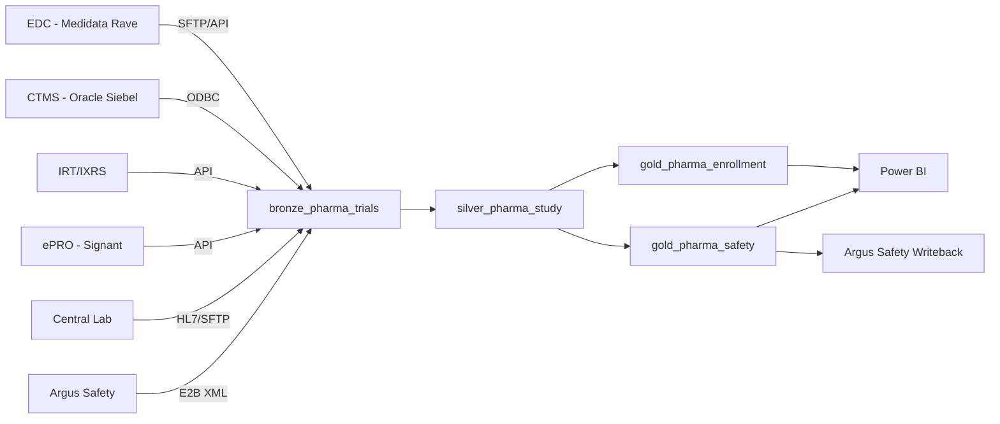

# Pharma & Life Sciences: Clinical Trial Analytics on Microsoft Fabric

<div align="center" markdown>


</div>

---

## Executive Summary

A top-20 global pharmaceutical company managing **45 active clinical trials** across
**8 therapeutic areas** with **12,000 enrolled subjects** deploys Microsoft Fabric as
its unified analytics platform for clinical data integration, safety signal
detection, and regulatory reporting. The platform consolidates data from six
operational systems (EDC, CTMS, IRT, ePRO, lab, and safety databases) into a
single governed lakehouse, enabling near-real-time enrollment dashboards and
automated safety signal surveillance while maintaining full **21 CFR Part 11** and
**GxP** compliance.

**Estimated cost:** ~$30,000/month (Fabric F64 + Purview + supporting services)
**Primary ROI drivers:** Accelerated enrollment timelines (~18% improvement),
faster safety signal detection (from 14 days to <48 hours), and reduced manual
reconciliation effort (~2,400 analyst-hours/year saved).

---

## Company Profile

| Attribute | Value |
|-----------|-------|
| Industry | Pharmaceutical / Biopharmaceutical |
| Revenue | $18B annual |
| Active Trials | 45 (Phase I: 8, Phase II: 14, Phase III: 18, Phase IV: 5) |
| Enrolled Subjects | 12,000 across 320 sites in 28 countries |
| Therapeutic Areas | Oncology, Immunology, Neuroscience, Cardiovascular, Rare Disease, Metabolic, Respiratory, Infectious Disease |
| Regulatory Bodies | FDA, EMA, PMDA, NMPA, Health Canada |
| Key Compliance | 21 CFR Part 11, ICH E6(R2) GCP, GxP, GDPR, HIPAA |

---

## Architecture

### System Landscape

```
                    ┌─────────────────────────────────────────────┐
                    │           SOURCE SYSTEMS                     │
                    │                                              │
                    │  ┌────────┐ ┌────────┐ ┌────────┐          │
                    │  │  EDC   │ │  CTMS  │ │  IRT   │          │
                    │  │(Medidata│ │(Oracle │ │(IXRS)  │          │
                    │  │ Rave)  │ │ Siebel)│ │        │          │
                    │  └───┬────┘ └───┬────┘ └───┬────┘          │
                    │      │          │          │                 │
                    │  ┌───┴────┐ ┌───┴────┐ ┌───┴────┐          │
                    │  │  ePRO  │ │  Lab   │ │ Safety │          │
                    │  │(Signant│ │(Quest/ │ │(Argus  │          │
                    │  │ Health)│ │ LabCorp│ │ Safety)│          │
                    │  └───┬────┘ └───┬────┘ └───┬────┘          │
                    └──────┼──────────┼──────────┼────────────────┘
                           │          │          │
                    ┌──────▼──────────▼──────────▼────────────────┐
                    │         MICROSOFT FABRIC F64                 │
                    │                                              │
                    │  ┌──────────────────────────────────────┐   │
                    │  │     BRONZE: bronze_pharma_trials      │   │
                    │  │  Raw EDC, CTMS, IRT, ePRO, Lab, AE   │   │
                    │  │  Append-only, audit-trail preserved   │   │
                    │  └──────────────┬───────────────────────┘   │
                    │                 │                             │
                    │  ┌──────────────▼───────────────────────┐   │
                    │  │     SILVER: silver_pharma_study       │   │
                    │  │  SDTM-aligned domains (DM, AE, VS)   │   │
                    │  │  MedDRA coded, visit-window checked   │   │
                    │  │  Protocol deviations flagged          │   │
                    │  └──────┬────────────────┬──────────────┘   │
                    │         │                │                    │
                    │  ┌──────▼──────┐  ┌──────▼──────────────┐   │
                    │  │    GOLD:    │  │       GOLD:          │   │
                    │  │gold_pharma_ │  │  gold_pharma_        │   │
                    │  │enrollment   │  │  safety              │   │
                    │  │             │  │                       │   │
                    │  │• Enrollment │  │• Disproportionality  │   │
                    │  │  curves     │  │  analysis (PRR/ROR)  │   │
                    │  │• Site rank  │  │• SAE timeline KPIs   │   │
                    │  │• Screen     │  │• CIOMS compliance    │   │
                    │  │  failure %  │  │• MedDRA SOC treemap  │   │
                    │  └─────────────┘  └──────────────────────┘   │
                    │                                              │
                    │  ┌──────────────────────────────────────┐   │
                    │  │     POWER BI (Direct Lake)            │   │
                    │  │  Trial Command Center Dashboard       │   │
                    │  └──────────────────────────────────────┘   │
                    └──────────────────────────────────────────────┘
```

### Data Flow



---

## Clinical Trial Data Integration

### Source Systems and Data Volumes

| System | Data Type | Daily Volume | Refresh Cadence |
|--------|-----------|-------------|-----------------|
| EDC (Medidata Rave) | CRF data, queries, audit trail | ~45K records | Every 4 hours |
| CTMS (Oracle Siebel) | Site milestones, payments, monitoring | ~8K records | Daily |
| IRT/IXRS | Randomization, drug supply, kits | ~3K records | Near-real-time |
| ePRO (Signant Health) | Patient-reported outcomes | ~12K records | Daily |
| Central Lab (Quest/LabCorp) | Lab results, reference ranges | ~25K records | Twice daily |
| Argus Safety | AEs, SAEs, SUSARs, CIOMS/MedWatch | ~2K records | Near-real-time |

### Bronze Layer: Raw Ingestion

All source data lands in `bronze_pharma_trials` with:
- Original payloads preserved (XML, CSV, JSON, HL7)
- Append-only Delta Lake tables
- Source system metadata (`_source_system`, `_extract_timestamp`)
- Immutable audit trail for 21 CFR Part 11 compliance
- No transformations - raw fidelity maintained

### Silver Layer: SDTM-Aligned Transformations

The silver layer (`silver_pharma_study`) applies CDISC SDTM-like domain mappings:

| SDTM Domain | Description | Key Transformations |
|-------------|-------------|---------------------|
| DM (Demographics) | Subject demographics | Standardize race/ethnicity codes, calculate age |
| AE (Adverse Events) | Adverse event records | MedDRA coding (PT, SOC), duration calculation |
| VS (Vital Signs) | Vital sign measurements | Unit standardization, baseline flagging |
| LB (Lab Results) | Laboratory results | Reference range evaluation, LOINC mapping |
| DS (Disposition) | Subject status changes | Protocol milestone tracking |
| EX (Exposure) | Drug exposure records | Dose normalization, compliance calculation |

Additional silver transformations:
- **Visit window compliance:** Flag visits outside protocol-defined windows (+-3 days)
- **Protocol deviation detection:** Automated flagging of inclusion/exclusion violations
- **Data quality scoring:** Completeness, consistency, and conformance metrics per CRF page
- **MedDRA coding validation:** Verify PT-to-SOC hierarchy consistency

### Gold Layer: Analytics and KPIs

#### Enrollment KPIs (`gold_pharma_enrollment`)

| KPI | Description | Target |
|-----|-------------|--------|
| Enrollment Velocity | Subjects/site/month | >= 2.5 |
| Screen Failure Rate | Screened but not randomized | < 25% |
| Enrollment Curve Deviation | Actual vs. planned cumulative | Within 10% |
| Site Activation Lag | IRB approval to first patient in | < 45 days |
| Randomization Balance | Arm allocation ratio compliance | Within 5% of target |
| Geographic Diversity Index | Regional enrollment distribution | Per protocol target |

#### Safety Signal KPIs (`gold_pharma_safety`)

| KPI | Description | Threshold |
|-----|-------------|-----------|
| PRR (Proportional Reporting Ratio) | Disproportionality signal | > 2.0 |
| ROR (Reporting Odds Ratio) | Signal strength metric | > 2.0 + lower CI > 1 |
| SAE Reporting Compliance | Days from awareness to CIOMS | <= 15 calendar days |
| SUSAR Notification | Unexpected serious ADR reporting | <= 7 days (fatal), <= 15 days (other) |
| AE Incidence by SOC | System organ class distribution | vs. known safety profile |
| Drug-Related AE Rate | Possibly/probably related AEs | Trend monitoring |

---

## Patient Recruitment Optimization

### Site Performance Analytics

The platform ranks all 320 clinical sites across a composite score:

```
Site Score = 0.30 × Enrollment_Rate
           + 0.25 × Data_Quality_Score
           + 0.20 × Query_Resolution_Time
           + 0.15 × Protocol_Compliance
           + 0.10 × Retention_Rate
```

**Actionable outputs:**
- Bottom-quartile site identification for targeted monitoring visits
- Predictive enrollment completion dates per study using Bayesian forecasting
- Country-level enrollment heat maps for regulatory submission planning
- Site-to-site patient demographic comparison for population representativeness

### Enrollment Velocity Tracking

Real-time enrollment curves compare actual vs. planned recruitment:
- **Green zone:** Within 10% of planned trajectory
- **Yellow zone:** 10-25% behind plan, triggers recruitment boost actions
- **Red zone:** >25% behind plan, triggers protocol amendment consideration

---

## Safety Signal Detection

### MedDRA Coding and Hierarchy

All adverse events are coded using MedDRA (Medical Dictionary for Regulatory
Activities) version 26.1:

```
Level               Example
─────               ───────
SOC (System Organ)  Gastrointestinal disorders
HLGT                Gastrointestinal signs and symptoms
HLT                 Nausea and vomiting symptoms
PT (Preferred Term) Nausea
LLT (Lowest Level)  Nausea, intermittent
```

### Disproportionality Analysis

The gold safety layer computes signal detection metrics:

- **PRR (Proportional Reporting Ratio):** Compares the proportion of a specific AE
  for the study drug vs. comparator/background rate
- **ROR (Reporting Odds Ratio):** Odds ratio with 95% confidence interval
- **EBGM (Empirical Bayesian Geometric Mean):** Multi-item gamma-Poisson shrinker
  for rare events

Signals exceeding thresholds trigger automated alerts to the Drug Safety team
and are queued for pharmacovigilance review.

### CIOMS Reporting Timelines

| Event Type | Regulatory Deadline | Fabric Alert Trigger |
|-----------|--------------------|--------------------|
| Fatal/Life-threatening SUSAR | 7 calendar days | Day 0 (immediate) |
| Other Serious SUSAR | 15 calendar days | Day 1 |
| Serious Adverse Event (SAE) | 24 hours to sponsor | 4 hours post-entry |
| Periodic Safety Update (PSUR/PBRER) | Per agreed schedule | 30 days before due |

---

## Real-World Evidence (RWE)

### Label Expansion Use Case

Fabric ingests de-identified claims and EHR data to support post-approval studies:

| Data Source | Records | Purpose |
|------------|---------|---------|
| Medical claims (Optum) | 12M patients | Treatment patterns, outcomes |
| EHR extracts (Flatiron) | 3.2M oncology patients | Progression-free survival |
| Prescription claims | 8M fills/year | Adherence, switching patterns |
| Patient registries | 45K rare disease patients | Natural history benchmarking |

RWE analytics support:
- Comparative effectiveness vs. standard of care
- Safety surveillance in broader populations
- Health economic outcomes (HEOR) for payer submissions
- Pediatric extrapolation studies

---

## Drug Supply Chain

### Serialization and Track & Trace

Fabric tracks drug supply from manufacturer to clinical site:

| Stage | Data Points | Compliance |
|-------|------------|------------|
| Manufacturing | Batch/lot, expiry, release testing | GMP |
| Packaging | Serialization (DSCSA), aggregation | FDA DSCSA |
| Cold Chain | Temperature excursions, IoT sensors | GDP |
| Distribution | Chain of custody, shipment status | Track & Trace |
| Site Receipt | Kit reconciliation, inventory levels | ICH GCP |
| Returns/Destruction | Accountability logs | 21 CFR 312.62 |

### Temperature Excursion Monitoring

IoT sensors on clinical supply shipments stream temperature data through
Fabric Eventstreams. KQL queries in Eventhouse detect excursions:

```kql
ColdChainTelemetry
| where Temperature > MaxThreshold or Temperature < MinThreshold
| summarize ExcursionDuration = sum(IntervalMinutes) by ShipmentId, BatchLot
| where ExcursionDuration > AllowedExcursionMinutes
| project ShipmentId, BatchLot, ExcursionDuration, Alert = "QUARANTINE"
```

---

## 21 CFR Part 11 Compliance

### Electronic Signatures

All data modifications in Fabric are governed by Part 11 requirements:

| Requirement | Implementation |
|-------------|---------------|
| Unique user identification | Entra ID with MFA, mapped to Fabric workspace roles |
| Signature manifestation | Audit log captures user principal name, timestamp, action |
| Signature linking | Delta Lake transaction log binds signature to data version |
| Authority checks | Workspace roles enforce separation of duties (data entry vs. approval) |

### Audit Trails

- **Delta Lake time travel:** Every transaction is versioned; `DESCRIBE HISTORY` provides full audit trail
- **Purview lineage:** End-to-end data lineage from source system to gold KPI
- **Immutable bronze:** Append-only ingestion preserves original records
- **SQL audit logs:** All workspace queries logged and retained for inspection period

### Validated Systems

| Validation Aspect | Approach |
|-------------------|----------|
| IQ (Installation Qualification) | Bicep IaC with deterministic deployment |
| OQ (Operational Qualification) | Automated test suite (pytest + Great Expectations) |
| PQ (Performance Qualification) | End-to-end pipeline validation with known test data |
| Change Control | Git-based CI/CD with approval gates |
| Periodic Review | Quarterly validation review with deviation tracking |

### Part 11 Compliant Storage

- Delta Lake provides ACID transactions and immutable versioning
- OneLake encryption at rest (AES-256) and in transit (TLS 1.2+)
- Customer-managed keys (CMK) for sensitive clinical data
- Data retention policies aligned with ICH E6 (25 years post-study)
- Geographic data residency controls per regulatory jurisdiction

---

## GxP Computerized System Validation

### ALCOA+ Principles

| Principle | Fabric Implementation |
|-----------|----------------------|
| **A**ttributable | Entra ID user mapping on every transaction |
| **L**egible | Standardized schemas, Purview business glossary |
| **C**ontemporaneous | Timestamps from source system preserved in bronze |
| **O**riginal | Append-only bronze layer maintains original records |
| **A**ccurate | Schema enforcement, Great Expectations validation |
| **+Complete** | Null checks, completeness scores per CRF page |
| **+Consistent** | Cross-domain referential integrity checks |
| **+Enduring** | Delta Lake with 25-year retention policy |
| **+Available** | OneLake with geo-redundant storage, BCDR plan |

### CSV (Computerized System Validation) Approach

```
┌─────────────────────────────────────────────┐
│         GAMP 5 Category 5                   │
│         (Custom Application)                │
│                                             │
│  ┌─────────┐  ┌─────────┐  ┌─────────┐    │
│  │   URS   │  │   FS    │  │   DS    │    │
│  │  User   │→ │Functional│→ │ Design  │    │
│  │  Req    │  │  Spec   │  │  Spec   │    │
│  └────┬────┘  └────┬────┘  └────┬────┘    │
│       │            │            │           │
│       ▼            ▼            ▼           │
│  ┌─────────┐  ┌─────────┐  ┌─────────┐    │
│  │   PQ    │  │   OQ    │  │   IQ    │    │
│  │Performnc│← │Operatnl │← │Install  │    │
│  │  Qual   │  │  Qual   │  │  Qual   │    │
│  └─────────┘  └─────────┘  └─────────┘    │
│                                             │
│  Traceability Matrix links URS → Tests     │
└─────────────────────────────────────────────┘
```

---

## Cost Analysis

### Monthly Cost Breakdown

| Component | Monthly Cost | Notes |
|-----------|-------------|-------|
| Fabric F64 Capacity | $16,320 | Reserved pricing, auto-pause evenings |
| Purview Governance | $3,500 | Data catalog, lineage, sensitivity labels |
| Entra ID P2 | $1,200 | MFA, conditional access, PIM |
| Azure Key Vault | $800 | CMK, secrets management |
| Eventstreams (cold chain IoT) | $2,100 | ~5M events/day |
| Monitoring + Alerting | $1,080 | Log Analytics, alert rules |
| DR / Geo-redundancy | $3,500 | Secondary region warm standby |
| Support (Unified) | $1,500 | Microsoft Unified Support allocation |
| **Total** | **~$30,000** | |

### ROI Calculation

| Benefit | Annual Value | Basis |
|---------|-------------|-------|
| Accelerated enrollment | $4.2M | 18% faster × $52K/day delay cost |
| Safety signal speed | $2.8M | Avoid 1 late-detected safety issue/year |
| Manual reconciliation savings | $1.4M | 2,400 analyst-hours × $580/hr loaded |
| Regulatory query reduction | $0.9M | 35% fewer FDA queries on data quality |
| Site performance optimization | $0.7M | 12% improvement in bottom-quartile sites |
| **Total Annual Benefit** | **~$10M** | |
| **Platform Annual Cost** | **~$360K** | |
| **ROI** | **~27:1** | |

---

## Implementation Timeline

| Phase | Duration | Deliverables |
|-------|----------|-------------|
| 1. Foundation | Weeks 1-4 | Fabric provisioning, Purview setup, IQ/OQ |
| 2. Bronze Integration | Weeks 5-8 | EDC, CTMS, Lab connectors; audit trail validation |
| 3. Silver SDTM | Weeks 9-12 | SDTM domain mappings, MedDRA coding pipeline |
| 4. Gold Analytics | Weeks 13-16 | Enrollment dashboards, safety signal detection |
| 5. Validation | Weeks 17-20 | PQ execution, CSV documentation, Part 11 assessment |
| 6. Go-Live | Week 21 | Production cutover, hypercare period |

---

## Key Risks and Mitigations

| Risk | Impact | Mitigation |
|------|--------|-----------|
| 21 CFR Part 11 audit finding | High | Pre-deployment Part 11 gap assessment with QA |
| Source system API changes | Medium | Schema evolution with Delta Lake merge |
| Cross-border data transfer (GDPR) | High | Data residency controls, pseudonymization |
| Validation documentation gaps | Medium | Automated traceability matrix from CI/CD |
| Safety signal false positives | Low | Statistical thresholds + manual PV review gate |

---

## Power BI Dashboard: Trial Command Center

### Page 1: Enrollment Overview
- Enrollment curve (actual vs. planned) with confidence bands
- Screen failure funnel by study and site
- Geographic enrollment heat map
- Site activation timeline (Gantt)

### Page 2: Safety Surveillance
- AE incidence by MedDRA SOC (treemap)
- Signal detection scorecard (PRR, ROR)
- SAE reporting compliance gauge (% within CIOMS timelines)
- Drug-related AE trend (line chart by study month)

### Page 3: Site Performance
- Composite site score ranking (bar chart)
- Query resolution time distribution
- Data quality completeness matrix
- Protocol deviation rate by site tier

### Page 4: Drug Supply
- Cold chain temperature timeline
- Kit inventory by site (stock-out risk)
- Shipment status tracker
- Batch expiry calendar

---

## References

1. FDA 21 CFR Part 11 - Electronic Records; Electronic Signatures
2. ICH E6(R2) - Good Clinical Practice
3. GAMP 5 - A Risk-Based Approach to Compliant GxP Computerized Systems
4. ICH E2B(R3) - Electronic Transmission of Individual Case Safety Reports
5. CDISC SDTM Implementation Guide v3.4
6. MedDRA Version 26.1 Introductory Guide
7. FDA Drug Supply Chain Security Act (DSCSA)
8. Microsoft Fabric Documentation - OneLake Security and Compliance
9. ISPE GAMP Good Practice Guide: Data Integrity
10. ICH E8(R1) - General Considerations for Clinical Studies

---

*Last Updated: 2026-04-27*
*Industry Vertical: Pharma & Life Sciences*
*Compliance Frameworks: 21 CFR Part 11, GxP, ICH GCP, GDPR, DSCSA*
