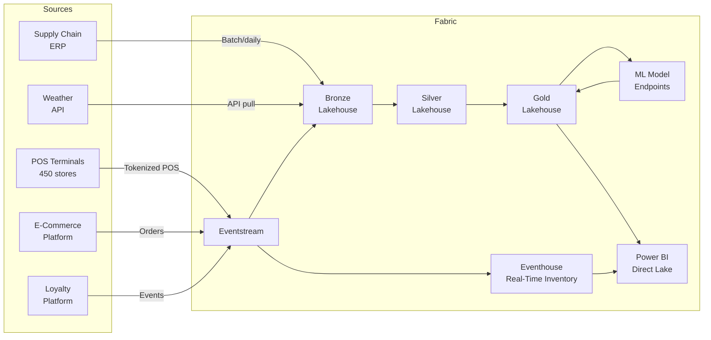

# 🛒 Retail & CPG: Demand Forecasting and Customer Analytics on Microsoft Fabric

> **Industry:** Retail / Consumer Packaged Goods
> **Compliance:** PCI-DSS v4.0
> **Fabric SKU:** F64 (P1 equivalent)
> **Estimated Cost:** ~$22,000/month


---

## Executive Summary

A mid-market omnichannel retailer with **450 stores**, **$2.8B annual revenue**, and **12 million loyalty members** leverages Microsoft Fabric to unify point-of-sale streams, demand forecasting, inventory optimization, and customer analytics into a single lakehouse platform. The solution replaces a patchwork of legacy data warehouses, standalone forecasting tools, and siloed CRM systems with a cohesive medallion architecture powered by Delta Lake, Eventstream, and Direct Lake.

### Key Business Outcomes

| Metric | Before Fabric | After Fabric | Impact |
|--------|---------------|--------------|--------|
| Forecast accuracy (WMAPE) | 38% | 18% | -20pp |
| Stockout rate | 8.2% | 3.1% | -62% |
| Markdown waste | $42M/yr | $28M/yr | -$14M |
| Promotion ROI visibility | Manual, 2 weeks | Automated, next-day | 10x faster |
| Customer 360 refresh | Weekly batch | Near-real-time | Continuous |
| Time-to-insight for merchants | 3–5 days | < 4 hours | 18x faster |

**Estimated annual ROI:** $18–24M from markdown reduction, stockout avoidance, and promotion optimization.

---

## 1. Business Context

### 1.1 Company Profile

| Attribute | Value |
|-----------|-------|
| Revenue | $2.8B annually |
| Stores | 450 (big-box, express, online) |
| SKUs | 85,000 active |
| Daily POS transactions | ~4.2M |
| Loyalty members | 12M |
| Regions | 6 US regions |
| Distribution centers | 8 |

### 1.2 Pain Points

1. **Fragmented demand signals** — POS, e-commerce, loyalty, and weather data live in separate systems with no unified view.
2. **Forecast lag** — Legacy batch forecasting runs weekly; merchants need daily SKU-store-level predictions for replenishment.
3. **Markdown inefficiency** — Without granular sell-through curves, buyers mark down too early or too late, eroding margin.
4. **Customer blindness** — CRM captures transactions but lacks real-time behavioral signals; next-best-offer models are stale.
5. **Promotion black box** — Marketing spends $180M/yr on promotions with limited incrementality measurement.
6. **Supply chain opacity** — No consolidated view of vendor lead times, fill rates, or DC throughput.

### 1.3 Compliance Requirements (PCI-DSS v4.0)

| Requirement | Implementation |
|-------------|----------------|
| **Req 3.4** — Render PAN unreadable | Tokenize card numbers at POS ingestion; only token + last-4 stored |
| **Req 3.5** — Protect cryptographic keys | Azure Key Vault with HSM-backed keys |
| **Req 7.1** — Limit access by business need | Fabric workspace RBAC; row-level security on gold tables |
| **Req 8.3** — MFA for admin access | Entra ID Conditional Access enforced |
| **Req 10.2** — Audit logging | Fabric audit logs → Eventhouse for real-time alerting |
| **Req 12.3** — Risk assessment | Quarterly PCI scope review documented |

> **Critical rule:** No Primary Account Number (PAN) enters the analytics lakehouse. All card data is tokenized at the edge (POS terminal or payment gateway) before streaming to Fabric.

---

## 2. Solution Architecture

### 2.1 High-Level Data Flow



### 2.2 Eventstream Configuration

| Stream | Source | Volume | Retention |
|--------|--------|--------|-----------|
| `es-pos-transactions` | POS via Event Hub | ~50K events/min peak | 7 days |
| `es-ecommerce-orders` | Webhook → Event Hub | ~2K events/min | 7 days |
| `es-loyalty-events` | CDC from loyalty DB | ~500 events/min | 3 days |

### 2.3 Eventhouse (Real-Time Inventory)

The Eventhouse provides sub-second inventory position queries for store associates and the e-commerce platform:

```kql
// Real-time inventory position by store-SKU
InventoryEvents
| where EventTime > ago(1h)
| summarize
    LastQtyOnHand = arg_max(EventTime, QtyOnHand),
    TotalSold = sumif(Qty, EventType == "SALE"),
    TotalReceived = sumif(Qty, EventType == "RECEIPT")
    by StoreId, SKU
| extend AvailableToPromise = LastQtyOnHand - TotalSold + TotalReceived
| where AvailableToPromise < 10
| order by AvailableToPromise asc
```

### 2.4 Medallion Lakehouse Layers

#### Bronze (`lh_bronze`)

| Table | Source | Grain | Volume |
|-------|--------|-------|--------|
| `bronze_pos_transactions` | POS Eventstream | 1 row per line item | ~4.2M/day |
| `bronze_ecommerce_orders` | E-commerce webhook | 1 row per order line | ~120K/day |
| `bronze_loyalty_events` | Loyalty CDC | 1 row per event | ~500K/day |
| `bronze_product_master` | ERP batch | 1 row per SKU | 85K (full refresh weekly) |
| `bronze_store_master` | ERP batch | 1 row per store | 450 (full refresh weekly) |
| `bronze_weather_daily` | Weather API | 1 row per store-day | 450/day |

#### Silver (`lh_silver`)

| Table | Logic | Grain |
|-------|-------|-------|
| `silver_retail_sales` | Deduplicated, validated, enriched with product/store dims | 1 row per txn line |
| `silver_customer_profile` | Merged loyalty + POS, PII masked | 1 row per customer |
| `silver_inventory_daily` | End-of-day snapshot from Eventhouse | 1 row per store-SKU-day |

#### Gold (`lh_gold`)

| Table | Logic | Grain | Refresh |
|-------|-------|-------|---------|
| `gold_retail_demand` | Daily aggregated sales + forecast features | SKU-store-day | Daily |
| `gold_retail_customer_360` | RFM scores, CLV, segments, next-best-offer | Customer | Daily |
| `gold_promotion_lift` | Causal impact per promotion-SKU | Promo-SKU | Post-campaign |
| `gold_supply_chain_kpi` | Vendor fill rate, lead time, DC throughput | Vendor-day | Daily |

---

## 3. Demand Forecasting

### 3.1 Feature Engineering

The demand model operates at **SKU × Store × Day** granularity (~38M combinations for active items):

| Feature Category | Examples |
|-----------------|----------|
| **Lag features** | sales_lag_1d, sales_lag_7d, sales_lag_28d |
| **Rolling stats** | sales_ma_7d, sales_ma_28d, sales_std_7d |
| **Seasonal indices** | day_of_week_idx, week_of_year_idx, holiday_flag |
| **Price signals** | current_price, discount_pct, competitor_price_ratio |
| **Promotion flags** | is_promoted, promo_type, promo_week_number |
| **Weather** | temp_max, precip_flag, severe_weather_flag |
| **Store attributes** | store_format, region, sqft, traffic_index |

### 3.2 Model Architecture

```
Daily sales (SKU-Store-Day)
    ├── Base forecast: LightGBM ensemble (7/14/28-day horizons)
    ├── Seasonal adjustment: Fourier terms + holiday calendar
    ├── Promotion uplift: Separate causal model (Double ML)
    └── Safety stock: Quantile regression (P95) for inventory planning
```

- **Training cadence:** Weekly retrain on 2 years of history
- **Serving:** Batch scoring via Fabric ML Model Endpoints; results written to `gold_retail_demand`
- **Evaluation:** WMAPE < 20% target; monitored via Power BI dashboard

### 3.3 Inventory Optimization

The forecast feeds downstream inventory decisions:

| Metric | Formula | Use |
|--------|---------|-----|
| **Safety stock** | `z_score × σ_demand × √lead_time` | Buffer against uncertainty |
| **Reorder point** | `avg_daily_demand × lead_time + safety_stock` | Trigger replenishment |
| **Economic order qty** | `√(2 × demand × order_cost / holding_cost)` | Optimal order size |
| **Markdown timing** | Sell-through curve < 60% at week 6 → markdown | Margin protection |

---

## 4. Customer 360 & Loyalty Analytics

### 4.1 RFM Scoring

```python
# RFM calculation in gold layer
rfm = (
    silver_sales
    .groupBy("customer_id")
    .agg(
        datediff(current_date(), max("txn_date")).alias("recency_days"),
        countDistinct("txn_id").alias("frequency"),
        sum("line_total").alias("monetary")
    )
)

# Score 1-5 using quintiles
for metric in ["recency_days", "frequency", "monetary"]:
    rfm = rfm.withColumn(
        f"{metric}_score",
        ntile(5).over(Window.orderBy(col(metric)))
    )
```

### 4.2 Customer Lifetime Value (CLV)

- **Model:** BG/NBD for purchase frequency × Gamma-Gamma for monetary value
- **Horizon:** 12-month forward-looking CLV
- **Segments:** Platinum (top 5%), Gold (5–20%), Silver (20–50%), Bronze (50–80%), At-Risk (bottom 20%)

### 4.3 Next-Best-Offer

| Signal | Weight | Source |
|--------|--------|--------|
| Purchase history (category affinity) | 40% | `silver_retail_sales` |
| CLV tier | 20% | `gold_retail_customer_360` |
| Promotion response history | 20% | `gold_promotion_lift` |
| Seasonal relevance | 10% | Calendar |
| Inventory position | 10% | `silver_inventory_daily` |

---

## 5. Promotion Lift Measurement

### 5.1 Methodology

Each promotion is evaluated for **true incrementality** using causal inference:

1. **Test vs. Control:** Matched-store design (propensity score matching)
2. **Causal Impact:** Bayesian structural time-series model
3. **Cannibalization:** Cross-elasticity matrix within category
4. **Halo effect:** Basket analysis for promoted vs. non-promoted items in same trip

### 5.2 Promotion KPIs

| KPI | Definition |
|-----|-----------|
| **Incremental units** | Units sold above baseline forecast |
| **Lift %** | (Promo sales − baseline) / baseline × 100 |
| **Cost per incremental unit** | Total promo cost / incremental units |
| **Margin impact** | Incremental revenue − (discount cost + cannibalization) |
| **Payback period** | Days until promoted SKU returns to baseline velocity |

---

## 6. Supply Chain Visibility

### 6.1 Vendor Scorecard

| Metric | Target | Source |
|--------|--------|--------|
| Fill rate | ≥ 97% | PO receipts vs. orders |
| On-time delivery | ≥ 95% | Receipt date vs. requested date |
| Lead time variability | CV < 0.15 | Historical lead time distribution |
| Quality defect rate | < 0.5% | Returns tagged as defective |

### 6.2 Distribution Center Throughput

```kql
// DC throughput monitoring
DCOperations
| where Timestamp > ago(24h)
| summarize
    UnitsReceived = sumif(Units, OperationType == "INBOUND"),
    UnitsShipped = sumif(Units, OperationType == "OUTBOUND"),
    AvgPickTime = avg(PickDurationMinutes)
    by DCId, bin(Timestamp, 1h)
| extend Utilization = round(100.0 * UnitsShipped / Capacity, 1)
```

---

## 7. Power BI Dashboards

### 7.1 Dashboard Suite

| Dashboard | Audience | Refresh | Connection |
|-----------|----------|---------|------------|
| **Demand Command Center** | Merchandising VPs | Every 15 min | Direct Lake |
| **Store Inventory Pulse** | Store managers | Real-time | Eventhouse + Direct Lake |
| **Customer Insights** | Marketing | Daily | Direct Lake |
| **Promotion Effectiveness** | Category managers | Post-campaign | Direct Lake |
| **Supply Chain Ops** | Supply chain team | Hourly | Direct Lake |

### 7.2 Row-Level Security

```dax
// RLS filter: Regional managers see only their region
[Region] = USERPRINCIPALNAME_REGION_LOOKUP()

// Store managers see only their store
[StoreId] = LOOKUPVALUE(
    StoreAccess[StoreId],
    StoreAccess[UserPrincipalName], USERPRINCIPALNAME()
)
```

---

## 8. PCI-DSS Implementation Details

### 8.1 Tokenization Flow

```
POS Terminal → Payment Gateway (tokenizes PAN) → Event Hub → Fabric
                                                      ↓
                                              Only token + last4
                                              enter the lakehouse
```

### 8.2 Data Classification

| Field | Classification | Handling |
|-------|---------------|----------|
| `card_token` | Sensitive | Stored, never reversed in Fabric |
| `card_last4` | Internal | Display only, masked in exports |
| `loyalty_id` | Internal | Pseudonymized in gold layer |
| `customer_name` | PII | Hashed in silver, excluded from gold |
| `email` | PII | Hashed in silver, excluded from gold |
| `txn_amount` | Business | Available for analytics |

### 8.3 Audit Trail

All access to PCI-scoped tables is logged via Fabric audit logs routed to Eventhouse:

```kql
FabricAuditLogs
| where Timestamp > ago(24h)
| where TableName has "pos" or TableName has "card"
| summarize AccessCount = count() by UserId, TableName, Operation
| where AccessCount > 100
| order by AccessCount desc
```

---

## 9. Cost Model

### 9.1 Monthly Fabric Cost Breakdown

| Component | Configuration | Est. Cost/Month |
|-----------|--------------|-----------------|
| Fabric F64 capacity | Shared with other workloads | $8,200 |
| Eventstream (POS + e-com) | ~50K events/min peak | $3,100 |
| Eventhouse | 500GB hot, 30-day retention | $2,800 |
| OneLake storage | ~12TB Delta Lake | $1,400 |
| ML Model Endpoints | 2 endpoints, auto-scale | $2,200 |
| Power BI Premium per-user | 25 report builders | $2,500 |
| Azure Key Vault (HSM) | Tokenization keys | $400 |
| Monitoring & logging | Eventhouse audit | $600 |
| **Total** | | **~$21,200** |

### 9.2 ROI Calculation

| Benefit | Annual Value |
|---------|-------------|
| Markdown reduction (33%) | $14.0M |
| Stockout avoidance (62% reduction) | $5.2M |
| Promotion optimization (15% efficiency gain) | $2.7M |
| Labor savings (analyst productivity) | $1.1M |
| **Total annual benefit** | **$23.0M** |
| **Total annual cost** | **$254K** |
| **Net ROI** | **~90:1** |

---

## 10. Implementation Roadmap

| Phase | Duration | Deliverables |
|-------|----------|-------------|
| **Phase 1:** Foundation | 4 weeks | Eventstream ingestion, bronze layer, store/product dims |
| **Phase 2:** Silver + Gold | 3 weeks | Cleansed sales, customer profiles, daily aggregates |
| **Phase 3:** Forecasting | 4 weeks | Feature engineering, LightGBM training, batch scoring |
| **Phase 4:** Customer 360 | 3 weeks | RFM, CLV, segmentation, next-best-offer |
| **Phase 5:** Dashboards | 2 weeks | 5 Power BI dashboards with RLS |
| **Phase 6:** Promotion analytics | 3 weeks | Causal impact framework, cannibalization model |
| **Phase 7:** Supply chain | 2 weeks | Vendor scorecard, DC throughput monitoring |

**Total:** ~21 weeks (5 months) from kickoff to production.

---

## 11. Notebooks Reference

| Notebook | Layer | Purpose |
|----------|-------|---------|
| `53_retail_pos.py` | Bronze | Ingest POS transactions |
| `53_retail_cleansed.py` | Silver | Deduplicate, validate, enrich |
| `53_retail_demand_forecast.py` | Gold | Demand features, RFM, CLV |

---

## 12. Related Resources

- [Tutorial 49: Retail/CPG End-to-End](../../tutorials/49-retail-cpg/README.md)
- [Direct Lake Best Practices](../features/direct-lake.md)
- [Medallion Architecture Deep Dive](../best-practices/medallion-architecture-deep-dive.md)
- [PCI-DSS Tokenization Patterns](../best-practices/network-security.md)
- [Capacity Planning](../best-practices/capacity-planning-cost-optimization.md)
- [Real-Time Intelligence](../features/real-time-intelligence.md)

---

*Last Updated: 2026-04-27*
*Author: Fabric POC Team*
*Compliance Review: PCI-DSS v4.0 scope validated*
