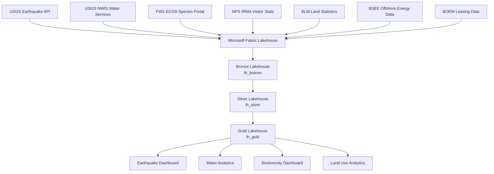

# 🏔️ Federal DOI (Department of the Interior) Expansion

> **[Home](../../README.md)** | **[Future Expansions](../README.md)** | **[EPA](../federal-epa/)** | **[DOT/FAA](../federal-dot-faa/)**

---

<div align="center">


**Planned Release: Q4 2026**

</div>

---

## Overview

This expansion adapts the Microsoft Fabric architecture for Department of the Interior agencies, addressing natural resource management, earth science data, and federal land stewardship. DOI manages approximately 500 million acres of federal land and oversees USGS, BLM, FWS, NPS, BSEE, and BOEM — making it one of the largest sources of open geospatial, seismic, hydrological, and ecological data in the US government.

```
+------------------+     +------------------+     +------------------+
|   DATA SOURCES   |     |   FABRIC LAYERS  |     |    ANALYTICS     |
+------------------+     +------------------+     +------------------+
|                  |     |                  |     |                  |
| USGS Earthquake  | --> | Bronze: Raw GeoJSON --> Earthquake Alerts |
| USGS NWIS Water  |     | Silver: Validated  |    Flood Prediction  |
| FWS ECOS Species |     | Gold: Aggregated   |    Species Tracking  |
| BLM Land Records |     |                  |     Land Use Analysis |
| NPS Visitor Stats|     | + FOIA Controls  |     | + Park Analytics |
|                  |     | + ESA Compliance |     | + Resource Mgmt  |
+------------------+     +------------------+     +------------------+
```

---

## Target Audience

| Audience | Use Case |
|----------|----------|
| Geologists / Seismologists | Earthquake monitoring and seismic hazard analysis |
| Hydrologists | Streamflow, groundwater, and flood modeling |
| Wildlife Biologists | Endangered species tracking and habitat analysis |
| Land Managers | Federal land use planning and parcel management |
| Park Administrators | Visitor statistics, resource allocation, and planning |

---

## Data Domains

| Domain | Source Agency | Compliance | Bronze Table |
|--------|--------------|------------|--------------|
| Earthquakes | USGS | FOIA | `bronze_doi_earthquakes` |
| Water Resources | USGS NWIS | FOIA | `bronze_doi_water_data` |
| Wildlife / Species | FWS ECOS | FOIA, ESA | `bronze_doi_species_data` |
| Land Use | BLM | FOIA | `bronze_doi_land_parcels` |

---

## Medallion Architecture

### Earthquake Pipeline

```
bronze_doi_earthquakes  -->  silver_doi_seismic_enriched  -->  gold_doi_earthquake_dashboard
```

### Water Resources Pipeline

```
bronze_doi_water_data  -->  silver_doi_hydro_validated  -->  gold_doi_water_analytics
```

### Wildlife / Species Pipeline

```
bronze_doi_species_data  -->  silver_doi_species_enriched  -->  gold_doi_biodiversity_dashboard
```

### Land Use Pipeline

```
bronze_doi_land_parcels  -->  silver_doi_land_classified  -->  gold_doi_land_analytics
```

---

## Open Datasets

| Dataset | URL | Format | Auth | Update Cadence | Approx. Size |
|---------|-----|--------|------|---------------|--------------|
| USGS Earthquake API | https://earthquake.usgs.gov/fdsnws/event/1/ | GeoJSON / CSV | None | Real-time | ~10 GB historical |
| USGS NWIS (Water) | https://waterservices.usgs.gov/nwis/ | JSON / CSV | None | 15-min intervals | 1.5M+ monitoring sites |
| FWS ECOS (Species) | https://ecos.fws.gov/ecp/ | CSV / JSON | None | Periodic | ~500 MB |
| NPS Visitor Statistics | https://irma.nps.gov/Stats/ | CSV / Excel | None | Annual | ~100 MB |
| USGS National Map | https://apps.nationalmap.gov/services/ | GeoJSON / SHP | None | Continuous | TB-scale |
| BLM Land Statistics | https://www.blm.gov/about/data | CSV / SHP | None | Periodic | ~5 GB |

---

## Real-Time Integration

| Source | Latency | Protocol | Notes |
|--------|---------|----------|-------|
| USGS Earthquake API | Minutes after event | REST/GeoJSON feed | Global coverage, M1.0+ events |
| USGS NWIS | 15-minute intervals | REST/JSON | 1.5M+ stream gauges and wells across the US |

Both sources are ingested via Fabric Eventstreams, with Eventhouses (KQL) providing sub-second query response for operational dashboards.

---

## Sub-Agency Architecture



---

## Sample Use Cases

### Earthquake Early Warning

Near-real-time seismic event ingestion and alerting for emergency management.

```
+------------------+     +------------------+     +------------------+
|  USGS Feed       |     |  Enrichment      |     |  Alerting        |
+------------------+     +------------------+     +------------------+
| Magnitude        |     | Depth classify   |     | Push alerts      |
| Coordinates      | --> | Region lookup    | --> | Email/SMS notify |
| Depth            |     | Population zone  |     | Dashboard update |
| Time / Phase     |     | Aftershock model |     | Archive for audit|
+------------------+     +------------------+     +------------------+
```

### Flood Prediction

Combine NWIS streamflow with precipitation forecasts to model flood risk.

| Metric | Description | Frequency |
|--------|-------------|-----------|
| Streamflow (cfs) | Real-time river discharge at gauge stations | 15 minutes |
| Stage Height (ft) | Water surface elevation vs. flood stage | 15 minutes |
| Groundwater Depth | Depth to water table in aquifer wells | Daily |
| Drought Index | PDSI / SPI drought classification | Weekly |

### Additional Use Cases

- **Species Tracking**: Endangered and threatened species distribution mapped against development projects
- **Land Use Analysis**: Federal vs. state vs. private parcel overlap, grazing permit management
- **Park Visitor Analytics**: Visitation trends, seasonal forecasting, and resource planning for NPS units
- **Offshore Energy Oversight**: BSEE/BOEM production and leasing data integrated with compliance reporting

---

## Compliance Requirements

| Framework | Scope | Key Controls |
|-----------|-------|--------------|
| **FOIA** | All federal agency data | Public disclosure, request tracking, redaction workflows |
| **Endangered Species Act (ESA)** | FWS species records | Section 7 consultation, habitat critical area flags |
| **National Environmental Policy Act (NEPA)** | Land use and impact data | Environmental review, cumulative impact analysis |
| **Privacy Act** | Any personnel or contractor records | Access controls, audit logging, data minimization |

---

## Planned Tutorials

| # | Tutorial | Description | Duration |
|---|----------|-------------|----------|
| 01 | DOI Environment Setup | Fabric workspace for geospatial and scientific workloads | 2 hrs |
| 02 | Earthquake Bronze Layer | USGS GeoJSON ingestion, schema enforcement | 2 hrs |
| 03 | Water Resources Bronze Layer | NWIS REST ingestion, 15-minute interval processing | 3 hrs |
| 04 | Species & Land Silver Layer | Enrichment, ESA flag logic, BLM parcel joins | 3 hrs |
| 05 | Real-Time Seismic Eventstream | Earthquake feed via Fabric Eventstreams + KQL | 2 hrs |
| 06 | Geospatial Gold Layer | Spatial aggregations, park/parcel analytics | 2 hrs |
| 07 | DOI Compliance Reporting | FOIA, ESA, NEPA automated report generation | 2 hrs |

---

## Prerequisites

| Requirement | Description |
|-------------|-------------|
| Fabric F64 Capacity | Minimum capacity for geospatial and real-time workloads |
| Eventhouse / KQL Database | For real-time seismic and hydrological event processing |
| Geospatial Libraries | GeoPandas, Shapely in Spark runtime for spatial joins |
| FOIA Documentation | Data handling and disclosure policies for federal datasets |

---

## Timeline

| Phase | Activity | Target |
|-------|----------|--------|
| Planning | Requirements gathering, sub-agency API assessment | Q2 2026 |
| Development | Notebooks, pipelines, geospatial data models | Q3 2026 |
| Testing | UAT, FOIA compliance validation, performance testing | Q4 2026 |
| Release | Documentation, training materials, public tutorials | Q4 2026 |

---

## Contributions Welcome

> **We welcome contributions from earth scientists, conservationists, and federal data practitioners!**

If you have expertise in:
- USGS / BLM / FWS data systems and APIs
- Geospatial analysis and GIS workflows in Fabric
- FOIA and ESA compliance implementation
- Hydrological or seismic data modeling

Please see our [Contributing Guide](../../CONTRIBUTING.md) to get involved.

---

## Related Resources

| Resource | Description |
|----------|-------------|
| [Casino/Gaming POC](../../README.md) | Current implementation (reference architecture) |
| [EPA Expansion](../federal-epa/README.md) | Environmental compliance and air/water quality patterns |
| [DOT/FAA Expansion](../federal-dot-faa/README.md) | Transportation and aviation safety patterns |
| [Tribal Healthcare Expansion](../tribal-healthcare/README.md) | Sovereign nation and healthcare patterns |

---

<div align="center">


**[Back to Top](#️-federal-doi-department-of-the-interior-expansion)** | **[Main README](../../README.md)**

</div>
