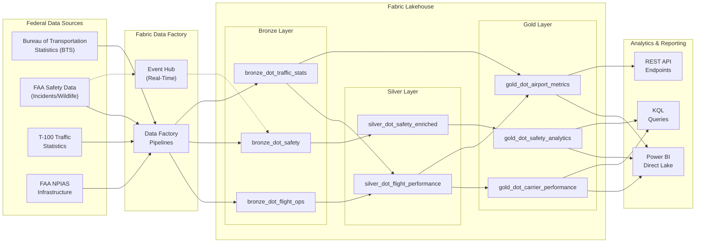

# DOT/FAA Aviation & Transportation Analytics on Microsoft Fabric

> **[Home](../../README.md)** | **[Future Expansions](../README.md)** | **[Healthcare](../tribal-healthcare/)** | **[Retail](../retail-ecommerce/)**

---

<div align="center">


**U.S. Department of Transportation & Federal Aviation Administration**
**Aviation Safety, Flight Performance, and Airport Analytics**

</div>

---

## Overview

This module provides a complete implementation for ingesting, transforming, and analyzing U.S. Department of Transportation (DOT) and Federal Aviation Administration (FAA) data using Microsoft Fabric. It covers four core data domains -- flight operations, safety incidents, traffic statistics, and airport infrastructure -- and produces analytics-ready Gold tables optimized for Power BI Direct Lake dashboards.

The implementation follows the medallion architecture (Bronze, Silver, Gold) and aligns record schemas with real BTS On-Time Performance, FAA Incident Data System, and T-100 Domestic Segment datasets so that generated records can be joined with publicly available federal data for POC demonstrations.

Key capabilities:

- On-time performance tracking across 20 major U.S. carriers and 30 airports
- Safety incident analysis including bird strikes, runway incursions, turbulence events, and mechanical failures
- Airport utilization metrics with passenger volumes, operations counts, and cargo tonnage
- Cross-source correlation linking safety incidents to their corresponding flight records
- Data quality scoring at every layer with configurable validation rules
- FedRAMP-aligned deployment patterns for GCC and GCC-High environments

---

## Data Domains

| Domain | Description | Source System Analog | Update Frequency | Record Volume |
|--------|-------------|---------------------|------------------|---------------|
| **Flight Operations** | Scheduled and actual departure times, delays, cancellations, diversions | BTS On-Time Performance | Daily | High (~10K/day) |
| **Safety Incidents** | Runway incursions, bird strikes, turbulence, mechanical issues with severity ratings | FAA Incident Data System | As reported | Low (~50/day) |
| **Traffic Statistics** | Passenger counts, carrier operations, and airport-level aggregate metrics | T-100 Domestic Segment | Monthly | Medium (~5K/month) |
| **Infrastructure** | Airport categories, runway conditions, surface status, and facility metadata | FAA NPIAS / AIP | Quarterly | Low (~500/quarter) |

---

## Architecture

### Data Flow Diagram



### Deployment Environment

```
+-------------------------------------+
|   Azure Government Cloud            |
|   (GCC / GCC-High)                  |
+-------------------------------------+
|                                     |
|   +-----------------------------+   |
|   | Microsoft Fabric (F64 SKU)  |   |
|   | FedRAMP Moderate Authorized |   |
|   +-----------------------------+   |
|           |           |             |
|   +-------v---+  +----v--------+   |
|   | Lakehouse |  | Eventhouse  |   |
|   | (Delta)   |  | (KQL/ADX)   |   |
|   +-----------+  +-------------+   |
|           |           |             |
|   +-------v-----------v--------+   |
|   | Power BI (Direct Lake)     |   |
|   +-----------------------------+   |
|                                     |
+-------------------------------------+
```

---

## Data Sources

### Bureau of Transportation Statistics (BTS)

| Dataset | URL | Format | API Key | Notes |
|---------|-----|--------|---------|-------|
| On-Time Performance | `https://transtats.bts.gov/DL_SelectFields.aspx?gnoession_VarName=OTP` | CSV, ZIP | No | Monthly on-time data for reporting carriers; includes delay causes |
| T-100 Domestic Segment | `https://transtats.bts.gov/DL_SelectFields.aspx?gnoession_VarName=T_T100D_SEGMENT_ALL_CARRIER` | CSV | No | Monthly passenger/cargo volumes by carrier and airport pair |
| Airline On-Time Statistics | `https://www.transtats.bts.gov/OT_Delay/OT_DelayCause1.asp` | HTML, CSV | No | Summary delay cause statistics by carrier |

### FAA Safety Data

| Dataset | URL | Format | API Key | Notes |
|---------|-----|--------|---------|-------|
| Wildlife Strike Database | `https://wildlife.faa.gov/` | CSV, Excel | No | 300K+ strike reports since 1990; includes species, damage, conditions |
| Incident Data System | `https://www.asias.faa.gov/apex/f?p=100:1` | CSV | Registration | Voluntary safety reports from pilots, controllers, mechanics |
| Accident & Incident Data (NTSB) | `https://data.ntsb.gov/avdata` | CSV | No | Accidents and incidents investigated by NTSB |
| Airport Master Record (5010) | `https://adip.faa.gov/agis/public/` | CSV | No | 19,000+ airports with facility, runway, and ownership details |

### Airport Activity Statistics

| Dataset | URL | Format | API Key | Notes |
|---------|-----|--------|---------|-------|
| FAA Air Traffic Activity Data (ATADS) | `https://aspm.faa.gov/opsnet/sys/Tracon.asp` | CSV | FAA access | Tower operations at towered airports |
| FAA NPIAS | `https://www.faa.gov/airports/planning_capacity/npias` | PDF, CSV | No | National Plan of Integrated Airport Systems; hub classification |
| ACI-NA Traffic Data | `https://airportscouncil.org/intelligence/traffic-data/` | PDF | Membership | North American airport traffic summaries |

### Public Open Data Portals

| Portal | URL | Content |
|--------|-----|---------|
| data.gov | `https://catalog.data.gov/dataset?tags=aviation` | Federal aviation datasets |
| BTS Data Library | `https://www.transtats.bts.gov/databases.asp` | Full BTS dataset catalog |
| FAA Data & Research | `https://www.faa.gov/data_research` | Safety, activity, and certification data |

---

## Schema Overview

All fields are defined in `data_generation/schemas/federal/dot_faa_schema.json`. The schema represents a union of all four data domains; fields not applicable to a specific domain are set to null.

### Required Fields

| Field | Type | Description |
|-------|------|-------------|
| `record_id` | `string (UUID)` | Unique identifier for the record |
| `data_domain` | `enum` | One of: `flight_operations`, `safety_incident`, `traffic_statistics`, `infrastructure` |
| `carrier_code` | `string` | Two-letter IATA airline designator (e.g., AA, DL, UA) |
| `carrier_name` | `string` | Full airline or carrier name |
| `origin_airport` | `string` | Three-letter IATA airport code for origin |
| `destination_airport` | `string` | Three-letter IATA airport code for destination |
| `departure_date` | `date` | Scheduled departure date (ISO 8601) |
| `faa_region` | `enum` | FAA regional office: AAL, ACE, AEA, AGL, ANE, ANM, ASO, ASW, AWP |
| `report_year` | `integer` | Calendar year (2000-2030) |
| `report_month` | `integer` | Calendar month (1-12) |
| `load_time` | `datetime` | Timestamp when loaded into Fabric lakehouse |

### Flight Operations Fields

| Field | Type | Description |
|-------|------|-------------|
| `flight_number` | `string` | Carrier-assigned flight number |
| `scheduled_departure` | `string` | Scheduled departure time (HH:MM, 24-hour) |
| `actual_departure` | `string` | Actual departure time (HH:MM, 24-hour) |
| `delay_minutes` | `integer` | Total departure delay in minutes; 0 = on-time |
| `delay_cause` | `enum` | BTS delay cause: `carrier`, `weather`, `nas`, `security`, `late_aircraft`, `none` |
| `cancelled` | `boolean` | Whether the flight was cancelled |
| `diverted` | `boolean` | Whether the flight was diverted |

### Aircraft Fields

| Field | Type | Description |
|-------|------|-------------|
| `aircraft_type` | `string` | Aircraft type designator (e.g., B737, A320, E175) |
| `tail_number` | `string` | US aircraft registration / tail number (e.g., N12345) |
| `passengers` | `integer` | Number of passengers on board or transported |

### Safety Incident Fields

| Field | Type | Description |
|-------|------|-------------|
| `incident_type` | `enum` | Type: `runway_incursion`, `bird_strike`, `turbulence`, `mechanical`, `fuel_issue`, `medical`, `security_threat`, `near_miss` |
| `incident_severity` | `enum` | Severity: `minor`, `moderate`, `serious`, `critical` |

### Airport & Weather Fields

| Field | Type | Description |
|-------|------|-------------|
| `airport_category` | `enum` | FAA NPIAS hub classification: `large_hub`, `medium_hub`, `small_hub`, `non_hub`, `general_aviation` |
| `runway_id` | `string` | Runway designator (e.g., 09L/27R) |
| `visibility_miles` | `number` | Prevailing visibility in statute miles (0-10) |
| `wind_speed_knots` | `integer` | Surface wind speed in knots (0-50) |

### Metadata Fields

| Field | Type | Description |
|-------|------|-------------|
| `_ingested_at` | `datetime` | Timestamp when ingested into lakehouse |
| `_source` | `string` | Source system identifier (e.g., `bts_ontime_api`, `faa_incident_api`) |
| `_batch_id` | `string` | Batch run identifier for lineage and reprocessing traceability |

---

## Generator Details

The `DOTFAAGenerator` class (`data_generation/generators/federal/dot_faa_generator.py`) inherits from `BaseGenerator` and produces synthetic records across all four domains.

### Capabilities

| Feature | Detail |
|---------|--------|
| **Class** | `DOTFAAGenerator` |
| **Inheritance** | `BaseGenerator` |
| **Domains** | `flight_operations`, `safety_incident`, `traffic_statistics`, `infrastructure` |
| **Carriers** | 20 major U.S. airlines with weighted distribution (majors get more traffic) |
| **Airports** | 30 major U.S. airports with IATA codes, FAA regions, and hub categories |
| **Aircraft** | 14 aircraft types (B737, A320, E175, CRJ-900, etc.) with passenger capacity ranges |
| **Reproducibility** | Configurable random seed for deterministic output |
| **Date Range** | Configurable `start_date` and `end_date` for temporal control |

### Domain-Specific Behavior

| Domain | On-Time Rate | Cancellation | Diversion | Delay Distribution |
|--------|-------------|--------------|-----------|-------------------|
| `flight_operations` | 65% | 5% | 1% (non-cancelled) | Exponential (scale=30 min, cap=600 min) |
| `safety_incident` | N/A | N/A | 15% (higher for incidents) | N/A |
| `traffic_statistics` | N/A | N/A | N/A | N/A (aggregate monthly) |
| `infrastructure` | N/A | N/A | N/A | N/A (facility records) |

### Incident Distribution

| Incident Type | Weight | Severity | Weight |
|---------------|--------|----------|--------|
| Bird Strike | 30% | Minor | 50% |
| Turbulence | 25% | Moderate | 30% |
| Mechanical | 20% | Serious | 15% |
| Runway Incursion | 8% | Critical | 5% |
| Fuel Issue | 6% | | |
| Medical | 5% | | |
| Security Threat | 3% | | |
| Near Miss | 3% | | |

### Usage

```python
from data_generation.generators.federal.dot_faa_generator import DOTFAAGenerator

gen = DOTFAAGenerator(seed=42)

# Single record
flight = gen.generate_record(domain="flight_operations")
incident = gen.generate_record(domain="safety_incident")

# Batch generation
flights = gen.generate_batch(count=10000, domain="flight_operations")
incidents = gen.generate_batch(count=500, domain="safety_incident")
traffic = gen.generate_batch(count=2000, domain="traffic_statistics")
infra = gen.generate_batch(count=200, domain="infrastructure")
```

---

## Medallion Tables

### Bronze Layer

Raw ingestion with minimal transformation. All tables are append-only, partitioned by `_load_date`, and written in Delta Lake format.

| Table | Source Domain | Key Fields | Partition |
|-------|-------------|------------|-----------|
| `bronze_dot_flight_ops` | Flight Operations | flight_id, flight_number, carrier_code, origin_airport, destination_airport, scheduled_departure, actual_departure, departure_delay_minutes, delay_cause, cancelled, diverted, aircraft_type, tail_number | `_load_date` |
| `bronze_dot_safety` | Safety Incidents | incident_id, incident_date, incident_type, severity, airport_code, carrier_code, phase_of_flight, injury_count, fatality_count, damage_level, weather_condition, investigation_status | `_load_date` |
| `bronze_dot_traffic_stats` | Traffic Statistics | record_id, airport_code, airport_name, report_month, domestic_departures, international_departures, total_passengers, total_cargo_tons, airport_category, state_code | `_load_date` |

Ingestion metadata added at Bronze: `_ingested_at`, `_source_file`, `_batch_id`, `_domain`.

### Silver Layer

Cleansed, validated, and enriched data with cross-source correlation and data quality scoring.

| Table | Source | Key Transformations |
|-------|--------|-------------------|
| `silver_dot_flight_performance` | `bronze_dot_flight_ops` | IATA airport code validation, delay categorization (ON_TIME / DELAYED / SEVERELY_DELAYED / CANCELLED / DIVERTED), carrier name standardization across 12 major carriers, FAA region name enrichment, on-time performance rate calculation per carrier, route derivation, data quality score (0-100) with flag array |
| `silver_dot_safety_enriched` | `bronze_dot_safety` joined with `silver_dot_flight_performance` | Cross-source correlation linking incidents to flight records on flight_number + date, FAA region name enrichment, severity normalization, injury/fatality coalesce, data quality score (0-100) |

Delay thresholds: on-time <= 14 minutes, severely delayed >= 60 minutes.

Silver metadata added: `_dq_score`, `_dq_flags`, `_silver_timestamp`, `_batch_id`.

### Gold Layer

Business aggregations optimized for Power BI Direct Lake connectivity. All tables are Z-Ordered for query performance.

| Table | Description | Key Metrics | Partition | Z-Order |
|-------|-------------|------------|-----------|---------|
| `gold_dot_carrier_performance` | Monthly carrier on-time performance | on_time_rate, cancellation_rate, diversion_rate, severe_delay_rate, completion_factor, avg_departure_delay_min, avg_arrival_delay_min, delay cause breakdown (carrier/weather/NAS/security/late_aircraft), performance_tier (EXCELLENT/GOOD/FAIR/POOR), monthly_otp_rank | `report_year` | `carrier_code, report_period` |
| `gold_dot_safety_analytics` | Monthly incident rates and severity trends | total_incidents, fatal/serious/minor incident counts, total_injuries, total_fatalities, bird_strikes, runway_incursions, turbulence_events, mechanical_failures, incident_rate_per_100k, fatal_rate_per_100k, incident_mom_change, severity_trend (INCREASING/STABLE/DECREASING) | `incident_year` | `incident_period` |
| `gold_dot_airport_metrics` | Airport utilization, performance, and safety | total_passengers, avg_monthly_passengers, total_operations, total_cargo_tons, international_pct, passengers_per_operation, airport_otp_rate, carriers_serving, routes_served, safety_incidents, bird_strikes, safety_incident_rate_per_10k_ops, passenger_volume_rank, operations_rank, airport_size_tier | (none) | `airport_code` |

---

## FedRAMP Compliance

### Microsoft Fabric Government Cloud

| Environment | FedRAMP Level | Data Classification | Availability |
|-------------|--------------|-------------------|--------------|
| Fabric on Azure Commercial | N/A | Unclassified / public data only | GA |
| Fabric on Azure Government (GCC) | FedRAMP Moderate | CUI, FOUO, SBU | GA |
| Fabric on Azure Government (GCC-High) | FedRAMP High | CUI, ITAR, EAR, CJIS | Limited GA |

### FISMA Compliance Mapping

| NIST 800-53 Family | Control ID | Implementation in Fabric |
|-------------------|-----------|------------------------|
| Access Control | AC-2, AC-3, AC-6 | Azure AD Conditional Access, RBAC, Row-Level Security |
| Audit & Accountability | AU-2, AU-3, AU-6 | Fabric Activity Logs, Azure Monitor, SIEM integration |
| Configuration Management | CM-2, CM-6, CM-8 | Bicep IaC, Azure Policy, asset inventory |
| Identification & Auth | IA-2, IA-5, IA-8 | MFA via Azure AD, PIV/CAC support in GCC-High |
| System & Comms Protection | SC-8, SC-12, SC-28 | TLS 1.3 in transit, AES-256 at rest, BYOK |
| System & Info Integrity | SI-2, SI-3, SI-4 | Microsoft Defender, Purview DLP, Threat Detection |

### Security Architecture for DOT/FAA Data

| Layer | Controls |
|-------|----------|
| Network | Private endpoints, NSGs, Azure Firewall, no public internet exposure |
| Identity | Azure AD with Conditional Access, MFA enforced, PIV/CAC for GCC-High |
| Data at Rest | AES-256, customer-managed keys (CMK) for Delta Lake storage |
| Data in Transit | TLS 1.3 for all connections including Direct Lake |
| Application | Workspace-level RBAC, object-level permissions, row-level security in Power BI |
| Audit | Comprehensive activity logging, 90-day retention (configurable to 365+), SIEM export |
| Governance | Microsoft Purview for sensitivity labeling, lineage tracking, data classification |

### Data Sensitivity Classification

| Data Category | Sensitivity | Handling |
|---------------|------------|---------|
| On-Time Performance | Public | BTS releases monthly; no restrictions |
| T-100 Traffic Statistics | Public | BTS releases monthly; no restrictions |
| Wildlife Strike Reports | Public (anonymized) | FAA releases with PII removed |
| Safety Incident Reports | Sensitive / FOUO | De-identified for public use; raw data is FOUO |
| Infrastructure Details | Mixed | Public NPIAS data; security-sensitive details restricted |

---

## Planned Notebooks

Three Fabric-importable notebooks implement the full medallion pipeline. All use Databricks notebook source format with `COMMAND` separators.

| Notebook | Layer | Path | Description |
|----------|-------|------|-------------|
| `08_bronze_dot_faa` | Bronze | `notebooks/bronze/08_bronze_dot_faa.py` | Multi-domain ingestion from landing zone; schema enforcement per domain; Parquet-first with CSV fallback; append-only Delta writes partitioned by `_load_date`; row count validation against minimum thresholds |
| `08_silver_dot_faa` | Silver | `notebooks/silver/08_silver_dot_faa.py` | IATA code validation, delay categorization, carrier name standardization, cross-source correlation (flights to safety incidents), on-time performance rate calculation, FAA region enrichment, data quality scoring, Z-Order optimization |
| `08_gold_dot_faa_analytics` | Gold | `notebooks/gold/08_gold_dot_faa_analytics.py` | Carrier performance aggregation (monthly), route delay analysis (top-10 worst routes), incident rate per 100K departures, severity trend analysis (MoM), bird strike frequency by airport, airport utilization and ranking, Direct Lake optimization |

### Notebook Execution Order

```
08_bronze_dot_faa.py
        |
        v
08_silver_dot_faa.py
        |
        v
08_gold_dot_faa_analytics.py
        |
        v
Power BI Direct Lake Refresh
```

### Table Flow

```
Landing Zone (CSV/Parquet)
    |
    +---> bronze_dot_flight_ops ----+
    |                               |---> silver_dot_flight_performance --+--> gold_dot_carrier_performance
    +---> bronze_dot_safety --------+---> silver_dot_safety_enriched -----+--> gold_dot_safety_analytics
    |                                                                     |
    +---> bronze_dot_traffic_stats ---------------------------------------+--> gold_dot_airport_metrics
```

---

## Planned Tutorial

### Tutorial 31: DOT/FAA Transportation Analytics on Microsoft Fabric

| Attribute | Detail |
|-----------|--------|
| **Tutorial Number** | 31 |
| **Title** | Federal DOT/FAA Aviation Analytics: FedRAMP Deployment, Public Dataset Integration, and Agency Reporting |
| **Estimated Duration** | 3-4 hours |
| **Prerequisites** | Microsoft Fabric workspace (F64 SKU), basic PySpark knowledge, familiarity with medallion architecture |

**Planned Sections:**

1. **Environment Setup** -- Configuring a Fabric workspace for federal DOT/FAA data; GCC/GCC-High considerations for FedRAMP deployments
2. **Data Generation** -- Using `DOTFAAGenerator` to produce synthetic flight operations, safety incidents, traffic statistics, and infrastructure records
3. **Bronze Ingestion** -- Running `08_bronze_dot_faa` to ingest multi-domain data into Delta tables with schema enforcement and batch lineage
4. **Silver Transformation** -- Running `08_silver_dot_faa` for IATA validation, delay categorization, carrier standardization, cross-source correlation, and data quality scoring
5. **Gold Analytics** -- Running `08_gold_dot_faa_analytics` to produce carrier performance, safety analytics, and airport metrics tables
6. **Power BI Dashboard** -- Connecting Direct Lake to gold tables; building carrier performance scorecards, safety trend dashboards, and airport utilization reports
7. **Real Public Data Integration** -- Downloading BTS On-Time Performance data from `transtats.bts.gov` and joining with generated records to demonstrate POC-to-production transition
8. **FedRAMP Compliance Checklist** -- Mapping NIST 800-53 controls to Fabric features; documenting security posture for ATO packages
9. **Verification & Validation** -- Row count checks, data quality score distribution, KPI validation against known BTS benchmarks

---

## Implementation Timeline

### Phase 1: Foundation (Weeks 1-2)

| Task | Deliverable | Status |
|------|------------|--------|
| Schema definition | `dot_faa_schema.json` | Complete |
| Data generator | `DOTFAAGenerator` with 4 domains | Complete |
| Dataset configuration | `federal_datasets.yaml` DOT/FAA entries | Complete |
| README expansion | This document | Complete |

### Phase 2: Notebooks (Weeks 3-4)

| Task | Deliverable | Status |
|------|------------|--------|
| Bronze notebook | `08_bronze_dot_faa.py` | Complete |
| Silver notebook | `08_silver_dot_faa.py` | Complete |
| Gold notebook | `08_gold_dot_faa_analytics.py` | Complete |
| Unit tests | `validation/unit_tests/federal/test_dot_faa_generator.py` | Planned |

### Phase 3: Tutorial & Dashboard (Weeks 5-6)

| Task | Deliverable | Status |
|------|------------|--------|
| Tutorial 31 | `tutorials/31-dot-faa-transportation-analytics.md` | Planned |
| Power BI template | `dashboards/dot_faa_analytics.pbit` | Planned |
| KQL queries | `notebooks/kql/dot_faa_realtime.kql` | Planned |
| Integration test | End-to-end pipeline validation | Planned |

### Phase 4: Compliance & Hardening (Weeks 7-8)

| Task | Deliverable | Status |
|------|------------|--------|
| FedRAMP control mapping | NIST 800-53 to Fabric feature matrix | Planned |
| Security documentation | SSP appendix for DOT/FAA module | Planned |
| GCC deployment guide | Azure Government deployment steps | Planned |
| Performance tuning | Z-Order, partition optimization, Direct Lake tuning | Planned |

---

## Carrier & Airport Reference

### Carriers (20)

The generator includes weighted distributions so major carriers produce proportionally more records than regionals. Top carriers by weight:

| Code | Carrier | Weight | Code | Carrier | Weight |
|------|---------|--------|------|---------|--------|
| AA | American Airlines | 14% | OO | SkyWest Airlines | 4% |
| DL | Delta Air Lines | 13% | HA | Hawaiian Airlines | 3% |
| UA | United Airlines | 12% | G4 | Allegiant Air | 3% |
| WN | Southwest Airlines | 12% | YX | Republic Airways | 3% |
| B6 | JetBlue Airways | 6% | 9E | Endeavor Air | 3% |
| AS | Alaska Airlines | 5% | SY | Sun Country Airlines | 2% |
| NK | Spirit Airlines | 5% | MX | Breeze Airways | 2% |
| F9 | Frontier Airlines | 4% | + 6 more regionals | 9% total |

### Airports (30)

21 large-hub and 9 medium-hub airports across all 9 FAA regions. Top airports by traffic volume:

| Code | Airport | Region | Code | Airport | Region |
|------|---------|--------|------|---------|--------|
| ATL | Hartsfield-Jackson Atlanta | ASO | CLT | Charlotte Douglas | ASO |
| ORD | Chicago O'Hare | AGL | EWR | Newark Liberty | AEA |
| DFW | Dallas/Fort Worth | ASW | MSP | Minneapolis-Saint Paul | AGL |
| DEN | Denver Intl | ANM | DTW | Detroit Metropolitan | AGL |
| LAX | Los Angeles Intl | AWP | BOS | Boston Logan | ANE |
| JFK | John F. Kennedy | AEA | BWI | Baltimore/Washington | AEA |
| SFO | San Francisco | AWP | DCA | Reagan Washington | AEA |
| SEA | Seattle-Tacoma | ANM | SLC | Salt Lake City | ANM |
| MCO | Orlando Intl | ASO | BNA | Nashville Intl | ASO |
| MIA | Miami Intl | ASO | + 11 more airports | various |

Full carrier and airport lists with weights are defined in `dot_faa_generator.py`.

### FAA Regions

| Code | Region Name | Weight |
|------|------------|--------|
| ASO | Southern | 18% |
| AEA | Eastern | 16% |
| ASW | Southwest | 14% |
| AWP | Western-Pacific | 14% |
| AGL | Great Lakes | 12% |
| ANM | Northwest Mountain | 10% |
| ANE | New England | 8% |
| ACE | Central | 6% |
| AAL | Alaskan | 2% |

---

## Contributions Welcome

> **We welcome contributions from federal employees, contractors, and aviation domain experts!**

If you have expertise in:
- BTS On-Time Performance data or T-100 traffic statistics
- FAA safety reporting (ASRS, wildlife strikes, NTSB investigations)
- Federal cloud deployments (GCC, GCC-High, FedRAMP ATO packages)
- Aviation analytics or airport operations
- Microsoft Fabric in government environments

Please see our [Contributing Guide](../../CONTRIBUTING.md) to get involved.

---

## Related Resources

| Resource | Description |
|----------|-------------|
| [Casino/Gaming POC](../../README.md) | Reference architecture for the primary POC |
| [Healthcare Expansion](../tribal-healthcare/README.md) | HIPAA-compliant tribal healthcare patterns |
| [Federal Datasets Config](../../data_generation/config/federal_datasets.yaml) | Complete registry of federal open data sources |
| [DOT/FAA Schema](../../data_generation/schemas/federal/dot_faa_schema.json) | JSON Schema for all DOT/FAA record fields |
| [DOT/FAA Generator](../../data_generation/generators/federal/dot_faa_generator.py) | Python data generator source code |
| [Azure Government](https://azure.microsoft.com/en-us/global-infrastructure/government/) | GCC/GCC-High documentation |
| [BTS Data Library](https://www.transtats.bts.gov/databases.asp) | Bureau of Transportation Statistics datasets |
| [FAA Data & Research](https://www.faa.gov/data_research) | FAA safety, activity, and certification data |

---

<div align="center">


**[Back to Top](#dotfaa-aviation--transportation-analytics-on-microsoft-fabric)** | **[Main README](../../README.md)**

</div>
