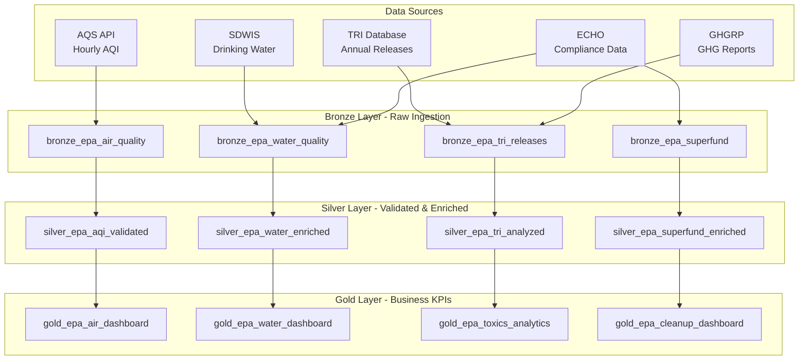

# 🌿 Federal EPA (Environmental Protection Agency) Expansion

> **[Home](../../README.md)** | **[Future Expansions](../README.md)** | **[NOAA](../federal-noaa/)** | **[DOI](../federal-doi/)**

---

<div align="center">


**Planned Release: Q3 2026**

</div>

---

## Overview

This expansion adapts the Microsoft Fabric architecture for Environmental Protection Agency (EPA) workloads, enabling environmental scientists and compliance officers to monitor air and water quality, track toxic chemical releases, and manage Superfund site remediation progress at scale.

```
+------------------+     +------------------+     +------------------+
|   DATA SOURCES   |     |   FABRIC LAYERS  |     |    ANALYTICS     |
+------------------+     +------------------+     +------------------+
|                  |     |                  |     |                  |
| AQS API          | --> | Bronze: Raw Env  | --> | AQI Dashboard    |
| ECHO/SDWIS       |     | Silver: Validated|     | Water Quality    |
| TRI Database     |     | Gold: KPIs       |     | Toxics Analytics |
| Superfund Data   |     |                  |     |                  |
| GHGRP Reports    |     | + FOIA Controls  |     | + Compliance Trkr|
|                  |     | + Data Lineage   |     | + Cleanup Progress|
+------------------+     +------------------+     +------------------+
```

---

## Target Audience

| Audience | Use Case |
|----------|----------|
| Environmental Scientists | Air and water quality research and analysis |
| Air Quality Analysts | AQI monitoring and pollution source attribution |
| Water Quality Managers | Drinking water safety and watershed management |
| Compliance Officers | Enforcement tracking and regulatory reporting |
| Public Health Officials | Environmental health risk assessment and communication |

---

## Data Domains

| Domain | Bronze Table | Compliance | Description |
|--------|-------------|------------|-------------|
| Air Quality (AQI) | `bronze_epa_air_quality` | FOIA, CAA | Pollutant measurements from 4,000+ monitoring stations |
| Water Quality | `bronze_epa_water_quality` | FOIA, CWA | Drinking water and surface water quality data |
| Toxic Releases (TRI) | `bronze_epa_tri_releases` | FOIA, EPCRA | Annual toxic chemical release and transfer reporting |
| Superfund Sites | `bronze_epa_superfund` | FOIA, CERCLA | Contaminated site inventory and cleanup status |

---

## Medallion Architecture

### Air Quality Pipeline

```
bronze_epa_air_quality  -->  silver_epa_aqi_validated  -->  gold_epa_air_dashboard
```

### Water Quality Pipeline

```
bronze_epa_water_quality  -->  silver_epa_water_enriched  -->  gold_epa_water_dashboard
```

### Toxic Releases Pipeline

```
bronze_epa_tri_releases  -->  silver_epa_tri_analyzed  -->  gold_epa_toxics_analytics
```

### Superfund Pipeline

```
bronze_epa_superfund  -->  silver_epa_superfund_enriched  -->  gold_epa_cleanup_dashboard
```

---

## Open Datasets

| Dataset | URL | Format | Auth | Volume | Update Frequency |
|---------|-----|--------|------|--------|-----------------|
| **AQS API** | [aqs.epa.gov/data/api](https://aqs.epa.gov/data/api) | JSON | API key | ~50GB+ | Real-time hourly |
| **TRI Database** | [epa.gov/toxics-release-inventory-tri-program](https://www.epa.gov/toxics-release-inventory-tri-program) | CSV | None | ~5GB | Annual |
| **ECHO** | [echo.epa.gov](https://echo.epa.gov/) | JSON/CSV | None | ~10GB | Continuous |
| **SDWIS** | Safe Drinking Water Information System | CSV | None | ~2GB | Quarterly |
| **GHGRP** | Greenhouse Gas Reporting Program | CSV/Excel | None | ~1GB | Annual |

> **4,000+ monitoring stations** covered by the AQS API. The TRI database contains **4M+ records** of chemical release and transfer data going back to 1987.

---

## Real-Time Capabilities

The AQS API provides hourly AQI readings for all criteria pollutants, enabling near-real-time environmental monitoring dashboards:

| Pollutant | Parameter Code | Health Standard | Averaging Period |
|-----------|---------------|-----------------|-----------------|
| PM2.5 | 88101 | 12 µg/m³ (annual) | 24-hour / Annual |
| PM10 | 81102 | 150 µg/m³ | 24-hour |
| Ozone | 44201 | 0.070 ppm | 8-hour |
| Carbon Monoxide (CO) | 42101 | 9 ppm | 8-hour |
| Sulfur Dioxide (SO2) | 42401 | 75 ppb | 1-hour |
| Nitrogen Dioxide (NO2) | 42602 | 100 ppb | 1-hour |

---

## Architecture Diagram



---

## Sample Use Cases

### AQI Monitoring Dashboard

Real-time and historical air quality index across all monitoring stations with health advisory alerts.

```
+------------------+     +------------------+     +------------------+
|  Station Data    |     |   AQI Calc       |     |   Dashboard      |
+------------------+     +------------------+     +------------------+
| PM2.5, PM10      |     | Breakpoint Tbl   |     | National Map     |
| Ozone, CO        | --> | Sub-Index Calc   | --> | County Rollups   | --> ALERTS
| SO2, NO2         |     | Category (Good-  |     | Trend Charts     |
| Station Metadata |     |   Hazardous)     |     | Health Advisories|
+------------------+     +------------------+     +------------------+
```

### Toxic Release Trend Analysis

Multi-year TRI trend analysis by chemical, industry sector, and geography.

| Dimension | Description | Granularity |
|-----------|-------------|-------------|
| Chemical Trends | Year-over-year release volume by chemical | Annual |
| Facility Profiles | Top emitters by state and industry | Annual |
| Geographic Heat Maps | Release density by watershed and county | Annual |
| Transfer vs. Release | On-site vs. off-site disposal breakdown | Annual |

### Additional Use Cases

- **Compliance Tracking**: ECHO enforcement actions, violations, and penalty history by facility
- **Superfund Cleanup Progress**: Remediation milestones, cost tracking, and completion status per site
- **Greenhouse Gas Trends**: Sector-level GHG emissions reporting and reduction target tracking
- **Drinking Water Safety**: SDWIS violation tracking and public notification monitoring

---

## Compliance Framework

| Framework | Scope | Key Controls |
|-----------|-------|--------------|
| **FOIA** | Freedom of Information Act | Public data access, redaction of protected information |
| **Clean Air Act (CAA)** | Air quality standards and emissions | NAAQS compliance, attainment status tracking |
| **Clean Water Act (CWA)** | Water quality standards and discharge | Permit compliance, effluent limit monitoring |
| **EPCRA** | Emergency Planning and Community Right-to-Know Act | TRI annual reporting, threshold tracking |
| **CERCLA** | Comprehensive Environmental Response (Superfund) | Site status, responsible party tracking, cleanup milestones |

---

## Planned Tutorials

| # | Tutorial | Description | Duration |
|---|----------|-------------|----------|
| 01 | EPA Environment Setup | Fabric workspace with EPA data connections | 2 hrs |
| 02 | Air Quality Bronze Layer | AQS API ingestion, schema enforcement | 3 hrs |
| 03 | AQI Silver Processing | Breakpoint calculations, health category logic | 3 hrs |
| 04 | Water Quality Pipeline | SDWIS + ECHO integration and enrichment | 2 hrs |
| 05 | TRI Analytics | Toxic release trend analysis and visualization | 2 hrs |
| 06 | Superfund Dashboard | Site status, cleanup progress, cost tracking | 2 hrs |
| 07 | Real-Time AQI Alerts | Eventstream-based health advisory notifications | 2 hrs |

---

## Prerequisites

| Requirement | Description |
|-------------|-------------|
| EPA AQS API Key | Free registration at aqs.epa.gov/data/api/signup |
| Fabric Capacity | F64 SKU or equivalent for full dataset processing |
| Network Access | Outbound access to EPA public APIs and data portals |
| Data Storage | Minimum 100GB lakehouse capacity for all domains |

---

## Timeline

| Phase | Activity | Target |
|-------|----------|--------|
| Planning | Requirements gathering, API exploration, architecture design | Q1 2026 |
| Development | Generators, notebooks, pipelines, data models | Q2 2026 |
| Testing | UAT, data quality validation, compliance review | Q3 2026 |
| Release | Documentation, tutorial content, training materials | Q3 2026 |

---

## Contributions Welcome

> **We welcome contributions from environmental scientists, data engineers, and public health professionals!**

If you have expertise in:
- EPA data systems and APIs
- Air and water quality analytics
- Environmental compliance reporting
- Superfund remediation workflows

Please see our [Contributing Guide](../../CONTRIBUTING.md) to get involved.

---

## Related Resources

| Resource | Description |
|----------|-------------|
| [Casino/Gaming POC](../../README.md) | Current implementation (reference architecture) |
| [NOAA Expansion](../federal-noaa/README.md) | Weather and climate data patterns |
| [DOI Expansion](../federal-doi/README.md) | Natural resources and lands data patterns |
| [Federal USDA Expansion](../federal-usda/README.md) | Agricultural data patterns |

---

<div align="center">


**[Back to Top](#-federal-epa-environmental-protection-agency-expansion)** | **[Main README](../../README.md)**

</div>
