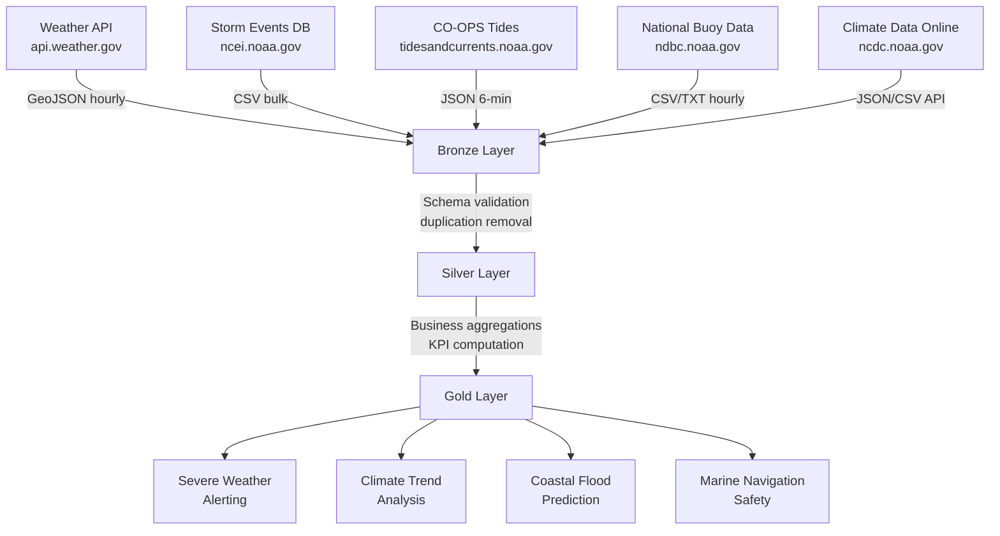

# 🌊 Federal NOAA (National Oceanic and Atmospheric Administration) Expansion

> **[Home](../../README.md)** | **[Future Expansions](../README.md)** | **[SBA](../federal-sba/)** | **[EPA](../federal-epa/)**

---

<div align="center">


**Planned Release: Q4 2026**

</div>

---

## Overview

This expansion adapts the Microsoft Fabric architecture for NOAA-scale environmental and atmospheric data. NOAA monitors weather, ocean conditions, and the atmosphere, producing billions of environmental observations daily from satellites, buoys, weather stations, and radar networks worldwide.

```
+------------------+     +------------------+     +------------------+
|   DATA SOURCES   |     |   FABRIC LAYERS  |     |    ANALYTICS     |
+------------------+     +------------------+     +------------------+
|                  |     |                  |     |                  |
| Weather API      | --> | Bronze: Raw Obs  | --> | Weather Alerts   |
| Storm Events DB  |     | Silver: Cleansed |     | Climate Trends   |
| CO-OPS Tides     |     | Gold: Analytics  |     | Storm Dashboards |
| National Buoys   |     |                  |     |                  |
| Climate Data     |     | + FOIA Controls  |     | + Flood Predict  |
|                  |     | + Lineage        |     | + Marine Safety  |
+------------------+     +------------------+     +------------------+
```

---

## Target Audience

| Audience | Use Case |
|----------|----------|
| Meteorologists | Operational weather forecasting and model validation |
| Emergency Managers | Severe weather alerting and disaster preparedness |
| Climate Researchers | Long-term trend analysis and climate modeling |
| Marine Biologists | Ocean condition monitoring and ecosystem analysis |
| Agricultural Planners | Crop yield forecasting and drought risk assessment |

---

## Data Domains

| Domain | Bronze Table | Compliance |
|--------|--------------|------------|
| Weather Observations | `bronze_noaa_weather_obs` | FOIA |
| Storm Events | `bronze_noaa_storm_events` | FOIA |
| Ocean/Tide Data | `bronze_noaa_tide_data` | FOIA |
| Climate Normals | `bronze_noaa_climate_normals` | FOIA |

---

## Medallion Architecture

### Weather Observations Pipeline

```
bronze_noaa_weather_obs --> silver_noaa_weather_cleansed --> gold_noaa_weather_analytics
```

### Storm Events Pipeline

```
bronze_noaa_storm_events --> silver_noaa_storms_enriched --> gold_noaa_storm_dashboard
```

### Ocean/Tide Data Pipeline

```
bronze_noaa_tide_data --> silver_noaa_tide_validated --> gold_noaa_ocean_analytics
```

### Climate Normals Pipeline

```
bronze_noaa_climate_normals --> silver_noaa_climate_processed --> gold_noaa_climate_trends
```

---

## Open Datasets

| Dataset | URL | Format | Auth | Volume | Notes |
|---------|-----|--------|------|--------|-------|
| Weather API | https://api.weather.gov | GeoJSON | No key | Real-time hourly | User-Agent header required |
| Storm Events DB | https://www.ncdc.noaa.gov/stormevents/ | CSV | No key | 2M+ events, ~2GB | Bulk at ncei.noaa.gov |
| Climate Data Online | https://www.ncdc.noaa.gov/cdo-web/webservices/v2 | JSON/CSV | API key | Billions of records | Free registration |
| CO-OPS Tides | https://api.tidesandcurrents.noaa.gov/api/prod/datagetter | JSON/CSV | No key | Real-time 6-min | 200+ tide stations |
| National Buoy Data | https://www.ndbc.noaa.gov/data/ | CSV/TXT | No key | Real-time hourly | 1000+ buoys worldwide |

---

## Real-Time Capabilities

| Source | Update Frequency | Latency | Coverage |
|--------|-----------------|---------|----------|
| Weather API (api.weather.gov) | Hourly | < 5 min | Continental US + territories |
| CO-OPS Tides | Every 6 minutes | < 2 min | 200+ coastal stations |
| National Buoy Data | Hourly | < 15 min | Global ocean coverage |
| Earthquake/Tsunami Alerts | Near real-time | < 1 min | Pacific and Atlantic basins |

---

## Architecture Flow



---

## Sample Use Cases

### Severe Weather Alerting

Real-time ingestion of Weather API feeds combined with storm event history to trigger proactive alerts for emergency managers.

```
+------------------+     +------------------+     +------------------+
|  Weather API     |     |   Storm History  |     |   Alert Engine   |
+------------------+     +------------------+     +------------------+
| Current Obs      |     | Severity Codes   |     | Push Notify      |
| Forecast Zones   | --> | Impact Data      | --> | Geo-fence Rules  | --> ALERT DASHBOARD
| Watches/Warnings |     | Historical Paths |     | Escalation Logic |
| Radar Composites |     | Damage Reports   |     | Multi-channel    |
+------------------+     +------------------+     +------------------+
```

### Climate Trend Analysis

Long-term analysis using Climate Data Online billions-record archive to identify regional trend deviations from 30-year normals.

| Metric | Description | Frequency |
|--------|-------------|-----------|
| Temperature Anomaly | Deviation from 30-year normal | Monthly |
| Precipitation Deficit | Drought index calculation | Weekly |
| Extreme Event Count | Frequency of threshold exceedances | Annually |
| Sea Level Change | Tidal gauge trend over decades | Quarterly |

### Additional Use Cases

- **Coastal Flood Prediction**: Combine tide data, storm surge models, and sea level trends for inundation risk mapping
- **Marine Navigation Safety**: Real-time buoy and tide data merged into vessel routing dashboards
- **Agricultural Planning**: Seasonal climate outlooks fused with crop model inputs for yield forecasting
- **Renewable Energy Siting**: Wind speed and solar radiation analysis for energy infrastructure planning

---

## Compliance Requirements

| Framework | Scope | Key Controls |
|-----------|-------|--------------|
| **FOIA** | Federal data transparency | Public release obligations, exemption handling |
| **NOAA Data Policy** | Open data mandate | Attribution requirements, redistribution terms |
| **Section 508** | Accessibility | Accessible dashboard and report design |
| **FedRAMP** | Cloud hosting | Authorized cloud services for federal data |

---

## Planned Tutorials

| # | Tutorial | Description | Duration |
|---|----------|-------------|----------|
| 01 | NOAA Environment Setup | Fabric workspace with federal data controls | 2 hrs |
| 02 | Weather Observations Bronze Layer | Real-time GeoJSON ingestion pipeline | 3 hrs |
| 03 | Storm Events Silver Layer | Data enrichment and severity classification | 3 hrs |
| 04 | Climate Analytics Gold Layer | 30-year normals and anomaly detection | 2 hrs |
| 05 | Real-Time Tide and Buoy Streaming | Eventstream integration for 6-minute feeds | 3 hrs |
| 06 | NOAA Environmental Dashboard | Power BI Direct Lake weather analytics | 2 hrs |
| 07 | FOIA Compliance Reporting | Automated public data release workflows | 1.5 hrs |

---

## Prerequisites

| Requirement | Description |
|-------------|-------------|
| NOAA API Registration | Free CDO API key from ncdc.noaa.gov for climate data |
| Fabric Capacity | F64 SKU or equivalent for large-volume climate datasets |
| Network Access | Outbound access to api.weather.gov and ncei.noaa.gov |
| Storage Planning | ~2GB+ for Storm Events bulk load; climate archive can reach TBs |

---

## Timeline

| Phase | Activity | Target |
|-------|----------|--------|
| Planning | Requirements gathering, API evaluation, architecture design | Q2 2026 |
| Development | Notebooks, pipelines, streaming connectors, data models | Q3 2026 |
| Testing | UAT, FOIA compliance validation, performance benchmarking | Q4 2026 |
| Release | Documentation, tutorial publishing, training materials | Q4 2026 |

---

## Contributions Welcome

> **We welcome contributions from NOAA partners, meteorologists, and environmental data scientists!**

If you have expertise in:
- NOAA API integration and data formats
- Atmospheric or oceanographic data processing
- Climate data quality and normalization
- Geospatial environmental analytics

Please see our [Contributing Guide](../../CONTRIBUTING.md) to get involved.

---

## Related Resources

| Resource | Description |
|----------|-------------|
| [Casino/Gaming POC](../../README.md) | Current implementation (reference architecture) |
| [Federal SBA Expansion](../federal-sba/README.md) | Small business federal data patterns |
| [Federal EPA Expansion](../federal-epa/README.md) | Environmental compliance data patterns |
| [Federal DOI Expansion](../federal-doi/README.md) | Interior Department land and resource data |

---

<div align="center">


**[Back to Top](#-federal-noaa-national-oceanic-and-atmospheric-administration-expansion)** | **[Main README](../../README.md)**

</div>
