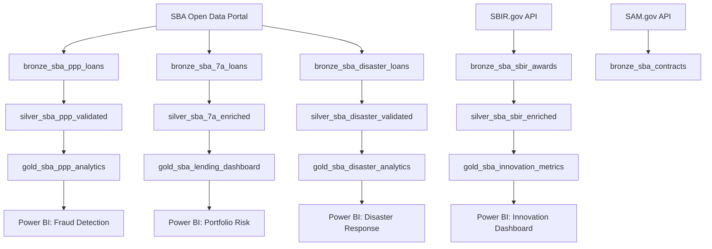

# 💼 Federal SBA (Small Business Administration) Expansion

> **[Home](../../README.md)** | **[Future Expansions](../README.md)** | **[USDA](../federal-usda/)** | **[NOAA](../federal-noaa/)**

---

<div align="center">


**Planned Release: Q3 2026**

</div>

---

## Overview

This expansion adapts the Microsoft Fabric architecture for the Small Business Administration (SBA), addressing federal lending programs, disaster assistance, and innovation funding. The SBA supports America's small businesses through lending, contracting, counseling, and disaster relief — generating rich datasets that enable portfolio risk analysis, fraud detection, and economic impact measurement.

```
+------------------+     +------------------+     +------------------+
|   DATA SOURCES   |     |   FABRIC LAYERS  |     |    ANALYTICS     |
+------------------+     +------------------+     +------------------+
|                  |     |                  |     |                  |
| PPP Loan Data    | --> | Bronze: Raw FOIA | --> | Fraud Detection  |
| 7(a)/504 Loans   |     | Silver: Validated|     | Portfolio Risk   |
| Disaster Loans   |     | Gold: KPIs       |     | Disaster Impact  |
| SBIR/STTR Awards |     |                  |     |                  |
| SAM.gov Contracts|     | + FOIA Controls  |     | + Innovation     |
|                  |     | + Privacy Act    |     | + Econ Metrics   |
+------------------+     +------------------+     +------------------+
```

---

## Target Audience

| Audience | Use Case |
|----------|----------|
| Loan Officers | Portfolio management and risk assessment |
| Small Business Analysts | Economic impact and program effectiveness |
| Disaster Assistance Coordinators | Disaster loan tracking and recovery metrics |
| SBIR Program Managers | Innovation funding performance and outcomes |
| Federal Contracting Officers | Small business contracting compliance |

---

## Data Domains

| Domain | Bronze Table | Compliance |
|--------|--------------|------------|
| PPP Loans | `bronze_sba_ppp_loans` | FOIA |
| 7(a) Loans | `bronze_sba_7a_loans` | FOIA |
| Disaster Loans | `bronze_sba_disaster_loans` | FOIA, Privacy Act |
| SBIR/STTR Awards | `bronze_sba_sbir_awards` | FOIA |

---

## Medallion Architecture

### PPP Loans

```
bronze_sba_ppp_loans --> silver_sba_ppp_validated --> gold_sba_ppp_analytics
```

### 7(a) Loans

```
bronze_sba_7a_loans --> silver_sba_7a_enriched --> gold_sba_lending_dashboard
```

### Disaster Loans

```
bronze_sba_disaster_loans --> silver_sba_disaster_validated --> gold_sba_disaster_analytics
```

### SBIR/STTR Awards

```
bronze_sba_sbir_awards --> silver_sba_sbir_enriched --> gold_sba_innovation_metrics
```

---

## Open Datasets

| Dataset | URL | Format | Auth | Size |
|---------|-----|--------|------|------|
| PPP Loan Data | [data.sba.gov/dataset/ppp-foia](https://data.sba.gov/dataset/ppp-foia) | CSV | No key | 11.8M loans ~10GB |
| 7(a)/504 Loans | [data.sba.gov/dataset/7-a-504-foia](https://data.sba.gov/dataset/7-a-504-foia) | CSV | No key | ~5GB |
| SBIR/STTR | [sbir.gov/api](https://www.sbir.gov/api) | JSON/CSV | No key | ~500MB |
| SAM.gov | [api.sam.gov](https://api.sam.gov) | JSON | API key | ~2GB |

---

## Architecture Diagram



---

## Use Cases

### PPP Fraud Detection

Identify anomalous patterns in Paycheck Protection Program loan data using statistical outlier detection and network analysis.

```
+------------------+     +------------------+     +------------------+
|  Loan Attributes |     |   Risk Signals   |     |   Outcomes       |
+------------------+     +------------------+     +------------------+
| Business Name    |     | Duplicate EIN    |     | Fraud Flags      |
| EIN              | --> | Amt vs Employees | --> | SAR Referrals    |
| Loan Amount      |     | Duplicate Address|     | Recovery Metrics |
| Employee Count   |     | Velocity Checks  |     | Portfolio Score  |
+------------------+     +------------------+     +------------------+
```

### Loan Portfolio Analysis

Track 7(a) and 504 loan performance across industries, geographies, and lender types.

| Metric | Description | Frequency |
|--------|-------------|-----------|
| Default Rate | % loans in default by cohort | Monthly |
| Approval Rate | Approval % by demographic | Quarterly |
| Job Creation | Estimated jobs supported | Annually |
| Geographic Distribution | Loans per capita by county | Quarterly |

### Disaster Response Analytics

Monitor disaster loan application velocity, approval timelines, and recovery impact.

| Metric | Description | Frequency |
|--------|-------------|-----------|
| Application Volume | Submissions per day per disaster | Daily |
| Processing Time | Days from application to decision | Weekly |
| Disbursement Rate | % approved loans fully disbursed | Monthly |
| Recovery Index | Economic recovery score by region | Quarterly |

### Innovation Metrics

Measure SBIR/STTR program effectiveness, commercialization rates, and technology investment trends.

- **Phase Progression**: Track companies advancing from Phase I to Phase II to Phase III
- **Commercialization**: Revenue generated from SBIR-funded technologies
- **Agency Comparison**: Award patterns and focus areas across federal agencies
- **Geographic Clustering**: Innovation hotspots and emerging tech hubs

---

## Compliance

| Framework | Scope | Key Controls |
|-----------|-------|--------------|
| **FOIA** | Freedom of Information Act disclosure | Public release standards, redaction rules |
| **Privacy Act** | Individual borrower PII protection | Access controls, data minimization |
| **Small Business Act** | Program integrity requirements | Eligibility validation, size standards |

---

## Planned Tutorials

| # | Tutorial | Description | Duration |
|---|----------|-------------|----------|
| 01 | SBA Environment Setup | Fabric workspace with FOIA data controls | 2 hrs |
| 02 | PPP Loan Bronze Layer | Bulk CSV ingestion, schema enforcement | 3 hrs |
| 03 | Lending Silver Layer | Validation, enrichment, geo-coding | 3 hrs |
| 04 | Fraud Detection Gold Layer | Anomaly scoring, network analysis | 3 hrs |
| 05 | Disaster Loan Analytics | Real-time application tracking | 2 hrs |
| 06 | Innovation Metrics Dashboard | SBIR/STTR KPIs and trend analysis | 2 hrs |

---

## Prerequisites

| Requirement | Description |
|-------------|-------------|
| SBA Data Access | FOIA data downloaded from data.sba.gov |
| SAM.gov API Key | Required for contracting data integration |
| Fabric Capacity | F64 SKU configured for large CSV ingestion |
| Storage | Minimum 25GB for full historical datasets |

---

## Timeline

| Phase | Activity | Target |
|-------|----------|--------|
| Planning | Requirements gathering, dataset profiling | Q1 2026 |
| Development | Notebooks, pipelines, data models | Q2 2026 |
| Testing | UAT, compliance validation, fraud model tuning | Q3 2026 |
| Release | Documentation, training materials | Q3 2026 |

---

## Contributions Welcome

> **We welcome contributions from federal lending analysts and small business researchers!**

If you have expertise in:
- SBA lending programs and regulations
- FOIA compliance implementation
- Fraud detection for government programs
- Small business economic analytics

Please see our [Contributing Guide](../../CONTRIBUTING.md) to get involved.

---

## Related Resources

| Resource | Description |
|----------|-------------|
| [Casino/Gaming POC](../../README.md) | Current implementation (reference architecture) |
| [USDA Expansion](../federal-usda/README.md) | Agricultural federal data patterns |
| [NOAA Expansion](../federal-noaa/README.md) | Environmental and climate data patterns |
| [Tribal Healthcare Expansion](../tribal-healthcare/README.md) | Healthcare compliance patterns |

---

<div align="center">


**[Back to Top](#-federal-sba-small-business-administration-expansion)** | **[Main README](../../README.md)**

</div>
