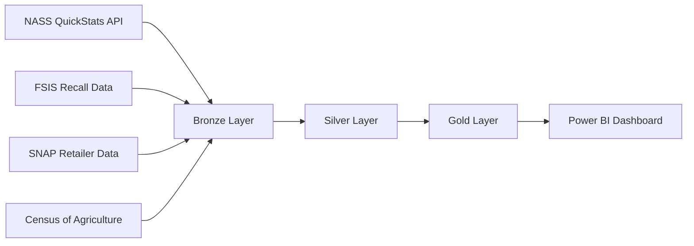

# 🌾 Federal USDA (Department of Agriculture) Expansion

> **[Home](../../README.md)** | **[Future Expansions](../README.md)** | **[Tribal Healthcare](../tribal-healthcare/)** | **[DOT/FAA](../federal-dot-faa/)**

---

<div align="center">


**Planned Release: Q4 2026**

</div>

---

## Overview

This expansion adapts the Microsoft Fabric architecture for USDA federal agency workloads, addressing unique requirements around agricultural data pipelines, food safety compliance, nutrition program oversight, and rural development analytics. The USDA's mission spans agriculture, food safety, nutrition assistance, and rural economic development — each requiring distinct medallion architecture patterns and compliance controls under FOIA and the Privacy Act.

```
+------------------+     +------------------+     +------------------+
|   DATA SOURCES   |     |   FABRIC LAYERS  |     |    ANALYTICS     |
+------------------+     +------------------+     +------------------+
|                  |     |                  |     |                  |
| NASS QuickStats  | --> | Bronze: Raw Data | --> | Crop Forecasting |
| FSIS Recalls     |     | Silver: Cleansed |     | Food Safety KPIs |
| SNAP Retailers   |     | Gold: Aggregates |     | SNAP Coverage    |
| Census of Ag     |     |                  |     |                  |
| Farm Payments    |     | + FOIA Controls  |     | + Subsidy Audit  |
|                  |     | + Privacy Act    |     | + Rural Dev KPIs |
+------------------+     +------------------+     +------------------+
```

---

## Target Audience

| Audience | Use Case |
|----------|----------|
| Agricultural Analysts | Crop production forecasting and market trend analysis |
| Food Safety Inspectors | Recall tracking, inspection outcome analysis |
| SNAP Program Managers | Retailer eligibility, benefit utilization oversight |
| Farm Subsidy Auditors | Payment reconciliation, eligibility verification |
| Rural Development Officers | Grant disbursement tracking, economic impact metrics |

---

## Data Domains

| Domain | Description | Compliance | Bronze Table |
|--------|-------------|------------|--------------|
| Crop Production | NASS survey data on planted/harvested acres and yields | FOIA | `bronze_usda_crop_production` |
| Food Safety / Inspections | FSIS recall and enforcement records | FOIA, FSIS | `bronze_usda_food_inspections` |
| SNAP / Nutrition | Authorized retailer locations and benefit data | Privacy Act | `bronze_usda_snap_retailers` |
| Farm Subsidies | FSA payment records by producer and program | FOIA | `bronze_usda_farm_payments` |

---

## Medallion Architecture

| Domain | Bronze | Silver | Gold |
|--------|--------|--------|------|
| Crop Production | `bronze_usda_crop_production` | `silver_usda_crop_cleansed` | `gold_usda_crop_analytics` |
| Food Safety | `bronze_usda_food_inspections` | `silver_usda_inspections_enriched` | `gold_usda_food_safety_dashboard` |
| SNAP / Nutrition | `bronze_usda_snap_retailers` | `silver_usda_snap_validated` | `gold_usda_nutrition_metrics` |
| Farm Subsidies | `bronze_usda_farm_payments` | `silver_usda_payments_reconciled` | `gold_usda_subsidy_analysis` |

---

## Open Datasets Catalog

| Dataset | URL | Format | Auth | Description | Size |
|---------|-----|--------|------|-------------|------|
| NASS QuickStats API | https://quickstats.nass.usda.gov/api | JSON / CSV | API key required | Crop, livestock, and economics surveys | ~50 GB |
| FSIS Recall Data | https://www.fsis.usda.gov/recalls | CSV / JSON | No key required | Food safety recall and enforcement records | ~50 MB |
| SNAP Retailer Locator | ArcGIS Hub dataset | CSV / GeoJSON | No key required | 250K+ authorized SNAP retail locations | ~500 MB |
| Census of Agriculture | https://www.nass.usda.gov/AgCensus/ | CSV / PDF | No key required | Comprehensive 5-year agricultural census | ~2 GB |

---

## Architecture Diagram



---

## Real-Time Capabilities

NASS provides periodic bulk data exports (daily, weekly, and annual releases) rather than a streaming API. True real-time ingestion is not applicable to crop statistics. However, the following near-real-time patterns are feasible:

| Pattern | Source | Cadence | Implementation |
|---------|--------|---------|----------------|
| Recall Alert Polling | FSIS RSS / JSON feed | Hourly | Eventstream HTTP poller |
| SNAP Retailer Updates | ArcGIS Hub delta export | Daily | ADF incremental copy |
| NASS Crop Reports | NASS scheduled releases | Weekly / Annual | Fabric Data Pipeline trigger |

---

## Integration Points

```
+-------------------+
|  NASS QuickStats  |----+
|  API              |    |
+-------------------+    |
                         |    +------------------+
+-------------------+    +--> |                  |
|  FSIS Web         |-------> |  Microsoft       |
|  Services         |    +--> |  Fabric          |
+-------------------+    |    |  Lakehouse       |
                         |    |                  |
+-------------------+    |    +------------------+
|  ArcGIS Hub       |----+              |
|  (SNAP Retailers) |                   v
+-------------------+         +------------------+
                              | Power BI Direct   |
+-------------------+         | Lake Semantic     |
|  Census of        |-------> | Model             |
|  Agriculture      |         +------------------+
+-------------------+
```

---

## Planned Tutorials

| # | Tutorial | Description | Duration |
|---|----------|-------------|----------|
| 01 | USDA Environment Setup | Fabric workspace with FOIA-aware controls | 2 hrs |
| 02 | Crop Production Bronze Layer | Ingesting NASS QuickStats API data at scale | 3 hrs |
| 03 | Food Safety Silver Layer | FSIS enrichment, recall classification, deduplication | 3 hrs |
| 04 | SNAP Retailer Gold Layer | Geospatial analytics, coverage gap identification | 2 hrs |
| 05 | Farm Subsidy Reconciliation | Payment audit trail, eligibility cross-reference | 2 hrs |
| 06 | Agriculture Analytics Dashboard | Crop forecasts, food safety KPIs, SNAP coverage maps | 2 hrs |

---

## Compliance

| Framework | Scope | Key Controls |
|-----------|-------|--------------|
| **FOIA** | Public records disclosure requirements | Redaction workflows, request tracking, audit logs |
| **Privacy Act** | PII in SNAP and farm payment records | Access controls, data minimization, consent tracking |
| **USDA Data Sharing Policies** | Inter-agency and public data sharing | Licensing compliance, attribution, embargo windows |
| **FISMA** | Federal system security baseline | NIST 800-53 controls, continuous monitoring |

---

## Use Cases with KPIs

### Crop Production Forecasting

Yield trend analysis against historical benchmarks for commodity price modeling.

| KPI | Description | Frequency |
|-----|-------------|-----------|
| Planted Acres (by commodity) | National and state-level acreage surveys | Weekly (in-season) |
| Yield per Harvested Acre | Bushels/cwt per acre vs. 5-year average | Monthly |
| Production Estimate Variance | Forecast vs. actuals at season close | Annual |
| Price Received Index | Producer price vs. NASS benchmark | Monthly |

### Food Safety Dashboard

Near-real-time visibility into FSIS recalls and enforcement actions.

```
+------------------+     +------------------+     +------------------+
|  Recall Records  |     |  Classification  |     |  Risk Scoring    |
+------------------+     +------------------+     +------------------+
| Establishment ID |     | Class I / II /   |     | Volume Affected  |
| Product Name     | --> | III Severity     | --> | Geographic Spread| --> DASHBOARD
| Recall Date      |     | Pathogen Type    |     | Trend Alerts     |
| Pounds Recalled  |     | Root Cause       |     | Open / Closed    |
+------------------+     +------------------+     +------------------+
```

### Additional Use Cases

- **SNAP Coverage Analysis**: Identify food desert areas with insufficient authorized retailer density
- **Subsidy Audit Trail**: End-to-end reconciliation of FSA farm program payments by producer
- **Rural Development Metrics**: Grant disbursement velocity and economic impact by county
- **Census of Agriculture Longitudinal**: 5-year trend analysis on farm size, ownership, and revenue

---

## Prerequisites

| Requirement | Description |
|-------------|-------------|
| NASS API Key | Register at https://quickstats.nass.usda.gov/api for free API key |
| Fabric F64 Capacity | Minimum F64 SKU for Bronze-to-Gold pipeline workloads |
| FOIA Handling Process | Documented workflow for redaction and public records requests |
| ArcGIS Hub Access | Public ArcGIS Hub account for SNAP GeoJSON exports |

---

## Timeline

| Phase | Activity | Target |
|-------|----------|--------|
| Planning | Requirements gathering, USDA data API evaluation | Q2 2026 |
| Development | Notebooks, pipelines, data models, KQL functions | Q3 2026 |
| Testing | UAT, FOIA compliance validation, security audit | Q4 2026 |
| Release | Documentation, tutorial publication, training materials | Q4 2026 |

---

## Contributions Welcome

> **We welcome contributions from agricultural analysts, federal data engineers, and USDA agency partners!**

If you have expertise in:
- NASS QuickStats API integration
- FSIS food safety data systems
- SNAP program administration
- Farm Service Agency payment systems
- Rural development analytics

Please see our [Contributing Guide](../../CONTRIBUTING.md) to get involved.

---

## Related Resources

| Resource | Description |
|----------|-------------|
| [Casino/Gaming POC](../../README.md) | Current implementation (reference architecture) |
| [Tribal Healthcare Expansion](../tribal-healthcare/README.md) | Sovereign nation healthcare patterns |
| [DOT/FAA Expansion](../federal-dot-faa/README.md) | Transportation and aviation agency patterns |
| [Federal SBA Expansion](../federal-sba/README.md) | Small business administration patterns |
| [Federal NOAA Expansion](../federal-noaa/README.md) | Environmental and weather data patterns |

---

<div align="center">


**[Back to Top](#-federal-usda-department-of-agriculture-expansion)** | **[Main README](../../README.md)**

</div>
