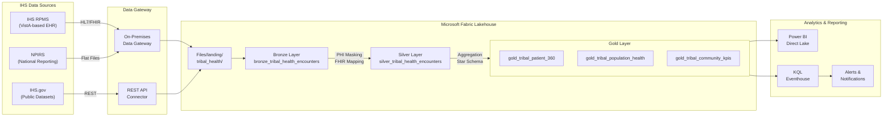
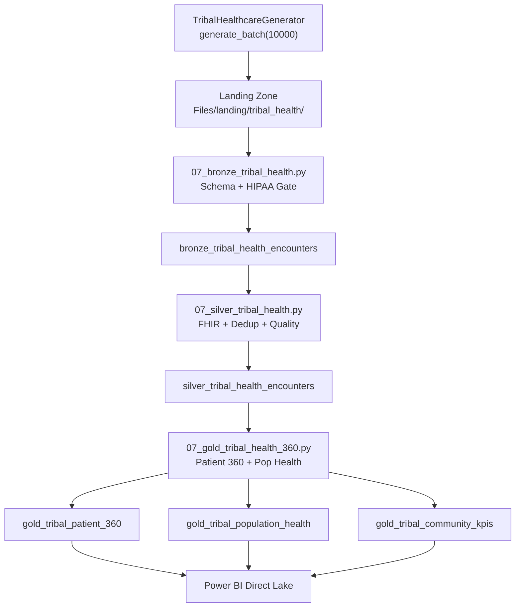

# Tribal/Sovereign Nation Healthcare Analytics on Microsoft Fabric

> **[Home](../../README.md)** | **[Future Expansions](../README.md)** | **[Federal Gov](../federal-dot-faa/)** | **[Retail](../retail-ecommerce/)**

---

<div align="center">


</div>

---

## Overview

This expansion implements a full Indian Health Service (IHS) healthcare analytics platform on Microsoft Fabric, covering encounter-level clinical data across outpatient, inpatient, emergency, telehealth, dental, behavioral health, pharmacy, and laboratory domains. The platform ingests data from IHS's Resource and Patient Management System (RPMS) and the National Patient Information Reporting System (NPIRS), applies HIPAA-compliant PHI masking and FHIR standardization in the Silver layer, and produces Patient 360, population health, and community KPI analytics in the Gold layer.

The data generator produces records weighted toward the health disparities documented in IHS epidemiological data: Type 2 diabetes at 15-17% prevalence, respiratory infections at 12-14%, cardiovascular conditions at 10-12%, and behavioral health encounters at 10-12%. Records span 20 IHS facilities across all 12 IHS Area Offices and represent 30 federally recognized tribes.

---

## Target Audience

| Audience | Use Case |
|----------|----------|
| Tribal Health Departments | Population health management, resource planning |
| IHS Area Offices | Cross-facility reporting, service unit performance |
| Native American Healthcare Facilities | Clinical operations, quality measures |
| Tribal Epidemiology Centers | Disease surveillance, outbreak detection |
| Community Health Representatives | Outreach tracking, prevention analytics |
| IHS Partner Organizations | Compliance reporting, GPRA/GPRAMA measures |

---

## Data Domains

| Domain | Description | Compliance | Encounter Types | Bronze Table |
|--------|-------------|------------|-----------------|--------------|
| **Encounters** | Outpatient, inpatient, emergency, and telehealth visits with ICD-10 diagnoses and CPT procedures | HIPAA | outpatient, inpatient, emergency, telehealth | `bronze_tribal_health_encounters` |
| **Pharmacy** | Prescription dispensing, medication tracking with NDC codes across 20 common medications | HIPAA, DEA | pharmacy | `bronze_tribal_health_encounters` |
| **Laboratory** | Test orders and results with 15 panel types, abnormal flag detection, and reference ranges | HIPAA, CLIA | laboratory | `bronze_tribal_health_encounters` |
| **Behavioral Health** | Mental health and substance use disorder encounters with enhanced consent tracking | HIPAA, 42 CFR Part 2 | behavioral_health | `bronze_tribal_health_encounters` |
| **Dental** | Oral health encounters with ADA procedure codes (D-codes) and dental-specific diagnoses | HIPAA | dental | `bronze_tribal_health_encounters` |

All encounter types are stored in a unified encounter table with the `encounter_type` field distinguishing domain. Pharmacy and laboratory encounters carry domain-specific nullable fields (medication_name, medication_ndc, lab_test_name, lab_result_value, etc.) that are populated only for their respective encounter types (plus a probability-based fill for co-occurring encounters).

---

## Architecture

### End-to-End Data Flow



### Lakehouse Organization

```
lh_bronze/
  Tables/
    bronze_tribal_health_encounters     -- Raw ingested encounters (Delta)
  Files/
    landing/tribal_health/              -- CSV/Parquet staging area
    audit/tribal_health/                -- Ingestion audit logs

lh_silver/
  Tables/
    silver_tribal_health_encounters     -- Cleansed, FHIR-aligned (Delta)

lh_gold/
  Tables/
    gold_tribal_patient_360             -- Patient encounter history + meds + labs
    gold_tribal_population_health       -- Population metrics by service unit
    gold_tribal_community_kpis          -- KPIs by area office
```

---

## Data Sources

### IHS Resource and Patient Management System (RPMS)

RPMS is the primary electronic health record system used by IHS and tribal health facilities. Built on the VA's VistA platform, RPMS manages clinical, administrative, and financial data across IHS's direct-service facilities.

| Attribute | Detail |
|-----------|--------|
| **System** | RPMS (VistA-based) |
| **Data Format** | HL7v2, FHIR R4 (emerging), flat file extracts |
| **Connectivity** | On-premises Data Gateway with encrypted tunnel |
| **Frequency** | Daily batch extract (overnight), near-real-time for alerts |
| **Key Data** | Encounters, diagnoses (ICD-10), procedures (CPT), medications, lab results |

### National Patient Information Reporting System (NPIRS)

NPIRS aggregates data from RPMS installations across all IHS facilities for national-level reporting, quality measurement, and epidemiological analysis.

| Attribute | Detail |
|-----------|--------|
| **System** | NPIRS National Data Warehouse |
| **Data Format** | Fixed-width flat files, aggregate CSV |
| **Connectivity** | Secure file transfer (SFTP) to Fabric landing zone |
| **Frequency** | Monthly aggregate extracts |
| **Key Data** | Encounter summaries, GPRA measures, utilization statistics |

### IHS.gov Public Datasets

Publicly available datasets from IHS that supplement facility-level data with national benchmarks and demographic context.

| Dataset | URL | Use Case |
|---------|-----|----------|
| IHS Facilities Directory | https://www.ihs.gov/locations/ | Facility reference data |
| IHS Area Profiles | https://www.ihs.gov/aboutihs/thisisihs/ | Area office demographics |
| GPRA Performance Reports | https://www.ihs.gov/crs/ | Quality measure benchmarks |
| IHS Disparities Data | https://www.ihs.gov/newsroom/factsheets/ | Epidemiological weighting |

---

## Schema Overview

All encounter records conform to the schema defined in `data_generation/schemas/federal/tribal_health_schema.json`. The following table lists every field, its type, constraints, and description.

### Required Fields

| Field | Type | Constraints | Description |
|-------|------|-------------|-------------|
| `record_id` | string (UUID) | UUID v4 format | Unique encounter record identifier |
| `patient_id` | string | Pattern: `PAT-[A-Z0-9]{8}` | De-identified patient identifier |
| `facility_id` | string | e.g., `IHS-NAV-001` | IHS facility code |
| `facility_name` | string | -- | Name of the IHS or tribal health center |
| `encounter_type` | string | Enum: outpatient, inpatient, emergency, telehealth, dental, behavioral_health, pharmacy, laboratory | Type of healthcare encounter |
| `encounter_date` | datetime | ISO 8601 | Date and time of encounter |
| `icd10_code` | string | Pattern: `[A-Z][0-9]{2}(.[0-9A-Z]{1,4})?` | ICD-10 diagnosis code |
| `icd10_description` | string | -- | Human-readable diagnosis description |
| `tribal_affiliation` | string | 30 federally recognized tribes | Patient's tribal affiliation |
| `service_unit` | string | -- | IHS Service Unit administering the facility |
| `area_office` | string | Enum: 12 IHS Area Offices | IHS Area Office |
| `age_group` | string | Enum: 0-4, 5-14, 15-24, 25-44, 45-64, 65+ | Patient age group bracket |
| `gender` | string | Enum: M, F, X | Patient gender |
| `insurance_type` | string | Enum: IHS_CONTRACT, MEDICAID, MEDICARE, PRIVATE, UNINSURED, VA | Primary insurance type |
| `hipaa_consent` | boolean | Always `true` for generated data | HIPAA consent obtained |
| `phi_masked` | boolean | Always `true` for generated data | PHI has been masked |
| `load_time` | datetime | ISO 8601 | Record load/generation timestamp |

### Optional Fields

| Field | Type | Constraints | Description |
|-------|------|-------------|-------------|
| `cpt_code` | string or null | Pattern: `[0-9]{5}` | CPT procedure code (present ~75% of records) |
| `cpt_description` | string or null | -- | CPT procedure description |
| `provider_id` | string or null | Pattern: `[0-9]{10}` (NPI) | Provider National Provider Identifier (present ~85%) |
| `provider_type` | string or null | Enum: physician, nurse_practitioner, physician_assistant, dentist, pharmacist, psychologist, social_worker, community_health_rep | Provider role |
| `medication_name` | string or null | -- | Prescribed or dispensed medication name |
| `medication_ndc` | string or null | Pattern: `[0-9]{5}-[0-9]{4}-[0-9]{2}` | National Drug Code (NDC) |
| `lab_test_name` | string or null | -- | Laboratory test name |
| `lab_result_value` | number or null | -- | Numeric lab result value |
| `lab_result_unit` | string or null | -- | Lab result unit of measurement |
| `lab_abnormal_flag` | string or null | Enum: N, L, H, LL, HH | Abnormal flag (Normal, Low, High, Critically Low, Critically High) |

---

## Generator Details

### TribalHealthcareGenerator

**Location:** `data_generation/generators/federal/tribal_healthcare_generator.py`
**Base Class:** `BaseGenerator`
**Schema:** `data_generation/schemas/federal/tribal_health_schema.json`

The `TribalHealthcareGenerator` class produces synthetic IHS encounter data with epidemiologically weighted distributions reflecting documented Native American and Alaska Native health disparities.

### Key Capabilities

| Feature | Detail |
|---------|--------|
| **Facility Coverage** | 20 IHS facilities across 12 Area Offices |
| **Tribal Representation** | 30 federally recognized tribes with population-proportional weighting |
| **Diagnosis Weighting** | 25 ICD-10 codes weighted toward AI/AN health disparities |
| **Procedure Codes** | 18 CPT codes including ADA dental codes (D-codes) |
| **Medications** | 20 common prescriptions for prevalent conditions (diabetes, hypertension, behavioral health) |
| **Lab Panels** | 15 laboratory tests with normal/abnormal reference ranges |
| **Provider Types** | 8 provider categories including Community Health Representatives |
| **Insurance Distribution** | Age-adjusted insurance type (Medicare bias for 65+, Medicaid bias for pediatric) |

### Epidemiological Weighting

The generator applies the following diagnosis distributions based on IHS epidemiological data:

| Category | Weight | ICD-10 Codes |
|----------|--------|--------------|
| Type 2 Diabetes | 17% | E11.9, E11.65, E11.22, E11.40, E11.311 |
| Respiratory | 14% | J06.9, J45.20, J45.40 |
| Cardiovascular | 12% | I10, E78.5, I25.10 |
| Behavioral Health | 12% | F32.1, F32.9, F10.20, F10.10 |
| Metabolic/Obesity | 10% | E66.01, E66.9 |
| Musculoskeletal | 10% | M54.5, M54.2, M25.50 |
| Gastrointestinal | 8% | K21.0, K58.9 |
| Genitourinary | 7% | N39.0 |
| Dental | 6% | K02.9 |
| Pregnancy-related | 4% | O24.11 |

### Usage

```python
from data_generation.generators.federal.tribal_healthcare_generator import (
    TribalHealthcareGenerator,
)
from datetime import datetime

# Initialize with seed for reproducibility
gen = TribalHealthcareGenerator(
    seed=42,
    start_date=datetime(2024, 1, 1),
    end_date=datetime(2024, 12, 31),
)

# Generate a single record
record = gen.generate_record()

# Generate a batch as a pandas DataFrame
df = gen.generate_batch(count=10_000)
```

### Encounter Type Distribution

| Encounter Type | Weight | Notes |
|----------------|--------|-------|
| Outpatient | 35% | Highest volume, primary care visits |
| Dental | 12% | Oral health, ADA D-codes |
| Pharmacy | 12% | Medication dispensing, NDC codes populated |
| Emergency | 10% | Emergency department visits |
| Inpatient | 8% | Hospital admissions |
| Behavioral Health | 8% | Mental health and substance use (42 CFR Part 2) |
| Laboratory | 8% | Lab panels, abnormal flag detection |
| Telehealth | 7% | Remote visits, growing post-COVID |

---

## Medallion Layer Tables

### Bronze: `bronze_tribal_health_encounters`

**Notebook:** [`notebooks/bronze/07_bronze_tribal_health.py`](../../notebooks/bronze/07_bronze_tribal_health.py)

Raw encounter data ingested from the landing zone with minimal transformation. The Bronze layer enforces structural integrity and HIPAA compliance gates before allowing data to persist.

| Aspect | Detail |
|--------|--------|
| **Source** | `Files/landing/tribal_health/` (CSV/Parquet) |
| **Format** | Delta Lake, append-only |
| **Partitioning** | `encounter_date` (year/month) |
| **Schema Enforcement** | Full schema validation against `tribal_health_schema.json` |
| **HIPAA Gate** | Records rejected if `hipaa_consent != true` or `phi_masked != true` |
| **Audit Logging** | Every ingestion batch logged with record counts, timestamps, and rejection reasons |
| **Retention** | 7 years (HIPAA retention requirement) |

### Silver: `silver_tribal_health_encounters`

**Notebook:** [`notebooks/silver/07_silver_tribal_health.py`](../../notebooks/silver/07_silver_tribal_health.py)

Cleansed, validated, and FHIR-aligned encounter data. The Silver layer applies PHI masking verification, maps encounters to FHIR resource types, validates ICD-10 codes, and deduplicates records.

| Aspect | Detail |
|--------|--------|
| **Source** | `bronze_tribal_health_encounters` |
| **Format** | Delta Lake, merge (upsert) |
| **Deduplication** | Composite key: `patient_id` + `encounter_date` + `icd10_code` |
| **FHIR Mapping** | Encounter type mapped to FHIR R4 Encounter resource structure |
| **PHI Masking** | Verification that `patient_id` is hashed, no raw SSN/DOB present |
| **Data Quality** | Null rate checks, valid enum validation, date range verification |
| **Standardization** | Facility name normalization, area office alignment, insurance code cleanup |

### Gold: `gold_tribal_patient_360`

**Notebook:** [`notebooks/gold/07_gold_tribal_health_360.py`](../../notebooks/gold/07_gold_tribal_health_360.py)

Complete patient encounter history aggregated into a single-row-per-patient view with diagnosis summaries, medication lists, lab result trends, and utilization metrics.

| Metric | Aggregation |
|--------|-------------|
| Total Encounters | Count by encounter type |
| Diagnosis History | Distinct ICD-10 codes with frequency |
| Medication List | Current and historical medications |
| Lab Trends | Most recent values with abnormal flags |
| Provider Utilization | Unique providers, visit frequency |
| Insurance History | Primary insurance type over time |
| Last Encounter | Most recent visit date and type |

### Gold: `gold_tribal_population_health`

Population health metrics aggregated by IHS Service Unit, enabling cross-facility comparison and resource allocation analysis.

| Metric | Granularity | Calculation |
|--------|-------------|-------------|
| Diabetes Prevalence | Service Unit | Count of E11.* diagnoses / total unique patients |
| Behavioral Health Utilization | Service Unit | Behavioral health encounters / total encounters |
| ED Visit Rate | Service Unit | Emergency encounters per 1,000 patients |
| Provider Ratio | Service Unit | Unique providers / unique patients |
| Insurance Coverage | Service Unit | Distribution across IHS_CONTRACT, MEDICAID, MEDICARE, PRIVATE, UNINSURED, VA |

### Gold: `gold_tribal_community_kpis`

Community health KPIs aggregated by IHS Area Office for executive dashboards and GPRA/GPRAMA reporting.

| KPI | Description |
|-----|-------------|
| Diabetes Screening Rate | % of patients 18+ with HbA1c in past 12 months |
| Immunization Coverage | Estimated childhood and adult vaccination rates |
| Chronic Disease Burden | Top 5 chronic conditions by prevalence |
| Telehealth Adoption | % of encounters delivered via telehealth |
| Access to Care | Average encounters per patient per year |

---

## HIPAA Compliance

### PHI Masking

All Protected Health Information is masked before data enters the Fabric Lakehouse. The generator produces only de-identified data; the pipeline validates this at every layer.

| PHI Element | Masking Approach |
|-------------|-----------------|
| Patient Name | Not generated; replaced with `patient_id` (PAT-XXXXXXXX) |
| Date of Birth | Replaced with `age_group` bracket |
| Social Security Number | Not generated; never present in pipeline |
| Address | Not generated; facility-level geography only |
| Phone/Email | Not generated |
| Medical Record Number | Replaced with hashed `patient_id` |
| Provider Name | Replaced with `provider_id` (NPI format) |

### Consent Tracking

| Control | Implementation |
|---------|----------------|
| HIPAA Consent Flag | `hipaa_consent` boolean field on every record |
| Bronze Gate | Records with `hipaa_consent=false` are rejected at ingestion |
| Consent Audit | All consent flag changes logged with timestamp and actor |
| Withdrawal Support | Patient consent withdrawal triggers data purge workflow |

### Audit Logging

| Event | Logged Fields |
|-------|---------------|
| Data Ingestion | batch_id, record_count, rejected_count, timestamp, source_file |
| Data Access | user_id, table_name, query_type, row_count, timestamp |
| PHI Access Attempt | user_id, field_name, access_result (granted/denied), timestamp |
| Data Export | user_id, destination, record_count, approval_id, timestamp |
| Schema Change | change_type, field_name, old_value, new_value, timestamp |

### Encryption Requirements

| Layer | Encryption |
|-------|------------|
| At Rest | Azure Storage Service Encryption (SSE) with Microsoft-managed keys (or CMK for sovereign control) |
| In Transit | TLS 1.2+ for all data movement |
| Backup | Encrypted backups with geo-redundancy within tribal jurisdiction |
| Key Management | Azure Key Vault with RBAC access policies |

### 42 CFR Part 2 (Substance Use Disorder Records)

Behavioral health encounters with substance use disorder diagnoses (ICD-10 codes F10.x - F19.x) receive additional protections under 42 CFR Part 2:

| Requirement | Implementation |
|-------------|----------------|
| Enhanced Consent | Separate, specific written consent required for SUD records |
| Restricted Disclosure | SUD records excluded from general data sharing agreements |
| Re-disclosure Notice | All SUD data tagged with prohibition-on-re-disclosure flag |
| Segregated Access | Row-level security (RLS) in Power BI restricts SUD data to authorized behavioral health staff |
| Audit Trail | Enhanced audit logging for all SUD record access |
| Break-the-Glass | Emergency override requires supervisor approval and is logged |

---

## Planned Notebooks

The tribal healthcare pipeline uses three Fabric-importable notebooks that follow the medallion architecture pattern established in the casino/gaming POC.

| Notebook | Path | Purpose |
|----------|------|---------|
| **07 Bronze Tribal Health** | [`notebooks/bronze/07_bronze_tribal_health.py`](../../notebooks/bronze/07_bronze_tribal_health.py) | Raw data ingestion from landing zone with HIPAA gate validation, schema enforcement, and audit logging |
| **07 Silver Tribal Health** | [`notebooks/silver/07_silver_tribal_health.py`](../../notebooks/silver/07_silver_tribal_health.py) | PHI masking verification, FHIR R4 encounter mapping, ICD-10 validation, deduplication, and data quality checks |
| **07 Gold Tribal Health 360** | [`notebooks/gold/07_gold_tribal_health_360.py`](../../notebooks/gold/07_gold_tribal_health_360.py) | Patient 360 view, population health metrics by service unit, and community KPIs by area office |

### Notebook Pipeline Orchestration



---

## Planned Tutorial

### Tutorial 30: Tribal Healthcare Analytics on Microsoft Fabric

**Status:** Planned (Phase 7, Wave 4)
**Estimated Duration:** 4-5 hours
**Prerequisites:** Completed tutorials 1-3 (Fabric fundamentals, Lakehouse, medallion architecture)

| Section | Content | Duration |
|---------|---------|----------|
| 30.1 | Environment setup: HIPAA workspace configuration, sensitivity labels | 30 min |
| 30.2 | Data generation: Run TribalHealthcareGenerator, inspect schema | 30 min |
| 30.3 | Bronze ingestion: Upload to landing zone, run 07_bronze notebook, verify HIPAA gate | 45 min |
| 30.4 | Silver transformation: FHIR mapping, deduplication, data quality validation | 45 min |
| 30.5 | Gold analytics: Build Patient 360, population health views, community KPIs | 45 min |
| 30.6 | Power BI dashboard: Direct Lake connection, RLS configuration for 42 CFR Part 2 | 45 min |
| 30.7 | Compliance verification: Audit log review, PHI masking validation, consent tracking | 30 min |

---

## Implementation Timeline

### Phase 1: Foundation (Weeks 1-2)

| Task | Deliverable | Status |
|------|-------------|--------|
| Schema design | `tribal_health_schema.json` | Complete |
| Data generator | `TribalHealthcareGenerator` class | Complete |
| Epidemiological weighting | ICD-10 codes weighted toward AI/AN disparities | Complete |
| Facility reference data | 20 IHS facilities, 12 Area Offices | Complete |

### Phase 2: Notebooks (Weeks 3-4)

| Task | Deliverable | Status |
|------|-------------|--------|
| Bronze notebook | `07_bronze_tribal_health.py` with HIPAA gate | Complete |
| Silver notebook | `07_silver_tribal_health.py` with FHIR mapping | Complete |
| Gold notebook | `07_gold_tribal_health_360.py` with Patient 360 | Complete |
| Unit tests | Validation suite for generator and notebooks | In Progress |

### Phase 3: Compliance and Security (Weeks 5-6)

| Task | Deliverable | Status |
|------|-------------|--------|
| HIPAA audit logging | Ingestion and access audit trail implementation | Planned |
| 42 CFR Part 2 controls | SUD record segregation and enhanced consent | Planned |
| Row-level security | Power BI RLS for behavioral health data | Planned |
| Encryption validation | At-rest and in-transit encryption verification | Planned |

### Phase 4: Tutorial and Documentation (Weeks 7-8)

| Task | Deliverable | Status |
|------|-------------|--------|
| Tutorial 30 | Step-by-step tribal healthcare analytics guide | Planned |
| Power BI dashboard | Sample dashboard with Direct Lake and RLS | Planned |
| Compliance checklist | HIPAA/42 CFR Part 2 verification template | Planned |
| Architecture documentation | Final architecture diagrams and data dictionary | Planned |

---

## Compliance Standards

### HIPAA (Health Insurance Portability and Accountability Act)

| Rule | Requirement | Implementation |
|------|-------------|----------------|
| **Privacy Rule** | Minimum necessary standard for PHI access | Role-based access control (RBAC) on all Lakehouse tables; row-level security in Power BI |
| **Security Rule** | Administrative, physical, and technical safeguards | Microsoft Entra ID authentication, conditional access policies, Fabric workspace isolation |
| **Breach Notification** | 60-day notification for breaches affecting 500+ individuals | Automated alerting via Microsoft Sentinel integration |
| **Transaction Standards** | Standard code sets (ICD-10, CPT, NDC) | All encounter records use validated ICD-10, CPT, and NDC codes |
| **Retention** | 6-year minimum retention for HIPAA records | Delta Lake time travel with 7-year retention policy |

### 42 CFR Part 2 (Confidentiality of Substance Use Disorder Patient Records)

| Requirement | Implementation |
|-------------|----------------|
| Written patient consent for any SUD record disclosure | Consent tracking table linked to `patient_id`; records gated at Silver layer |
| Prohibition on re-disclosure | Re-disclosure flag on all SUD-related records; downstream consumers receive notice |
| Court-ordered disclosures require specific procedures | Break-the-glass workflow with supervisor approval and audit trail |
| Applies to federally assisted SUD treatment programs | All behavioral health encounters with F10.x-F19.x codes treated as 42 CFR Part 2 |
| Qualified Service Organization Agreements (QSOAs) | Microsoft BAA + QSOA addendum for Fabric as data processor |

### IHS Policy and Tribal Sovereignty

| Requirement | Implementation |
|-------------|----------------|
| **Data Sovereignty** | Data stored within Azure regions subject to tribal jurisdiction preferences; no cross-border replication without tribal council approval |
| **Tribal Governance** | Data access policies set by tribal health board; Fabric workspace admin delegated to tribal IT |
| **GPRA/GPRAMA Reporting** | Gold layer KPIs aligned with IHS Government Performance and Results Act measures |
| **Indian Self-Determination Act (P.L. 93-638)** | Architecture supports self-governance compacts where tribes operate their own health programs |
| **Cross-Tribal Data Sharing** | Data sharing agreements formalized per tribe; row-level security isolates tribal data by `tribal_affiliation` |
| **IRB Requirements** | Any research use of aggregated data requires tribal IRB approval; separate consent pathway |

---

## IHS Facilities Reference

The generator includes 20 IHS health centers and hospitals spanning all 12 Area Offices. Facility IDs follow the pattern `IHS-{AREA}-{SEQ}` (e.g., `IHS-NAV-001` for Shiprock Northern Navajo Medical Center). See the full facility list in [`tribal_healthcare_generator.py`](../../data_generation/generators/federal/tribal_healthcare_generator.py).

---

## Prerequisites

| Requirement | Description |
|-------------|-------------|
| **HIPAA BAA** | Business Associate Agreement executed between tribal organization and Microsoft |
| **42 CFR Part 2 QSOA** | Qualified Service Organization Agreement addendum for SUD data processing |
| **Tribal Data Agreements** | Data governance and sharing agreements approved by tribal council |
| **Fabric F64 Capacity** | Fabric capacity configured for healthcare workloads with appropriate SKU |
| **Sensitivity Labels** | Microsoft Purview sensitivity labels configured for PHI classification |
| **Security Configuration** | Conditional access policies, MFA, and network controls for HIPAA compliance |
| **Python Environment** | Python 3.10+ with numpy and pandas for running the data generator |

---

## Contributions Welcome

> **We welcome contributions from tribal healthcare organizations, IHS partners, and healthcare data engineers.**

If you have expertise in:
- Tribal healthcare systems and IHS RPMS
- HIPAA and 42 CFR Part 2 compliance implementation
- FHIR R4 resource mapping for Native American healthcare
- Population health analytics and health equity metrics
- Tribal data sovereignty and governance

Please see our [Contributing Guide](../../CONTRIBUTING.md) to get involved.

---

## Related Resources

| Resource | Description |
|----------|-------------|
| [Casino/Gaming POC](../../README.md) | Reference architecture for the medallion pattern |
| [Federal Government Expansion](../federal-dot-faa/README.md) | Government agency analytics patterns |
| [TribalHealthcareGenerator](../../data_generation/generators/federal/tribal_healthcare_generator.py) | Data generator source code |
| [Tribal Health Schema](../../data_generation/schemas/federal/tribal_health_schema.json) | JSON Schema for encounter records |
| [IHS Official Site](https://www.ihs.gov/) | Indian Health Service public resources |
| [HIPAA Security Rule](https://www.hhs.gov/hipaa/for-professionals/security/) | HHS HIPAA Security Rule guidance |
| [42 CFR Part 2 Final Rule](https://www.federalregister.gov/documents/2024/02/16/2024-02544/confidentiality-of-substance-use-disorder-sud-patient-records) | 2024 Final Rule updates |

---

<div align="center">


**[Back to Top](#tribalsovereign-nation-healthcare-analytics-on-microsoft-fabric)** | **[Main README](../../README.md)**

</div>
