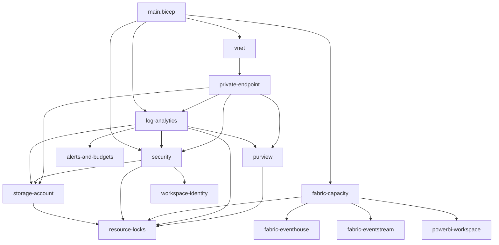

# Bicep Module Index

> **[Home](../../README.md)** | **[Main Bicep](../main.bicep)** | **[Environments](../environments/)** | **[Docs](../../docs/)**

Complete reference for all Bicep IaC modules in this POC. Each module is self-contained, parameterized, and designed for composition via `main.bicep`.

> **Last Updated**: 2026-04-27 | **Modules**: 14 | **Categories**: 7

---

## Table of Contents

- [Architecture Overview](#architecture-overview)
- [Module Index](#module-index)
- [Category: Fabric](#category-fabric)
- [Category: Security](#category-security)
- [Category: Storage](#category-storage)
- [Category: Monitoring](#category-monitoring)
- [Category: Networking](#category-networking)
- [Category: Governance](#category-governance)
- [Category: Analytics](#category-analytics)
- [Deployment Examples](#deployment-examples)
- [Module Dependency Graph](#module-dependency-graph)

---

## Architecture Overview

```
main.bicep (orchestrator)
  |
  +-- fabric/fabric-capacity.bicep        Fabric F64 capacity
  +-- fabric/fabric-eventhouse.bicep       ADX cluster (Eventhouse backing)
  +-- fabric/fabric-eventstream.bicep      Event Hubs namespace (Eventstream backing)
  |
  +-- security/security.bicep             Key Vault + Managed Identity
  +-- security/workspace-identity.bicep   Workspace Identity (MI for Fabric)
  +-- security/resource-locks.bicep       CanNotDelete locks on critical resources
  |
  +-- storage/storage-account.bicep       ADLS Gen2 landing zone
  |
  +-- monitoring/log-analytics.bicep      Log Analytics workspace
  +-- monitoring/alerts-and-budgets.bicep CU alerts + budget alerts
  |
  +-- networking/vnet.bicep               VNet + subnets + NSGs
  +-- networking/private-endpoint.bicep   Shared PE module (reusable)
  |
  +-- governance/purview.bicep            Microsoft Purview account
  |
  +-- analytics/powerbi-workspace.bicep   Power BI Embedded capacity
```

---

## Module Index

| Module | Category | Purpose | Key Parameters | Feature Doc |
|---|---|---|---|---|
| `fabric/fabric-capacity.bicep` | Fabric | Fabric capacity (F2-F2048) | `capacityName`, `skuName`, `adminEmail` | -- |
| `fabric/fabric-eventhouse.bicep` | Fabric | ADX cluster backing Eventhouse | `eventHouseName`, `fabricCapacityId`, `databaseNames` | [Eventhouse Vector DB](../../docs/features/eventhouse-vector-database.md) |
| `fabric/fabric-eventstream.bicep` | Fabric | Event Hubs namespace backing Eventstream | `eventStreamName`, `fabricCapacityId`, `consumerGroups` | [RTI](../../docs/features/real-time-intelligence.md) |
| `security/security.bicep` | Security | Key Vault + User-Assigned Managed Identity | `keyVaultName`, `managedIdentityName`, `enablePrivateEndpoints`, `skuName` | [CMK](../../docs/best-practices/customer-managed-keys.md) |
| `security/workspace-identity.bicep` | Security | Workspace-scoped managed identity | `projectPrefix`, `environment`, `enableKeyVaultAccess` | [OneLake Security](../../docs/features/onelake-security.md) |
| `security/resource-locks.bicep` | Security | CanNotDelete locks on critical resources | `keyVaultName`, `storageAccountName`, `fabricCapacityName`, `logAnalyticsName`, `purviewAccountName` | -- |
| `storage/storage-account.bicep` | Storage | ADLS Gen2 for landing zone | `storageAccountName`, `enablePrivateEndpoint`, `enableCmk` | [Data Sharing](../../docs/best-practices/data-sharing-federation.md) |
| `monitoring/log-analytics.bicep` | Monitoring | Centralized Log Analytics workspace | `name`, `retentionInDays`, `dailyQuotaGb`, `enablePrivateEndpoints` | [Observability](../../docs/best-practices/monitoring-observability.md) |
| `monitoring/alerts-and-budgets.bicep` | Monitoring | CU utilization alerts + budget alerts | `logAnalyticsWorkspaceId`, `enableCapacityAlerts` | [Cost Optimization](../../docs/best-practices/capacity-planning-cost-optimization.md) |
| `networking/vnet.bicep` | Networking | VNet with subnets for private endpoints | `vnetName`, `addressSpace` | [Network Security](../../docs/best-practices/network-security.md) |
| `networking/private-endpoint.bicep` | Networking | Reusable PE with DNS zone + link | `name`, `subnetId`, `privateLinkServiceId`, `groupIds`, `dnsZoneNames` | [Network Security](../../docs/best-practices/network-security.md) |
| `governance/purview.bicep` | Governance | Microsoft Purview account | `purviewAccountName`, `managedIdentityPrincipalId`, `enablePrivateEndpoint` | [Data Governance](../../docs/best-practices/data-governance-deep-dive.md) |
| `analytics/powerbi-workspace.bicep` | Analytics | Power BI Embedded capacity | `workspaceName`, `fabricCapacityId`, `adminMembers` | [Direct Lake](../../docs/features/direct-lake.md) |

---

## Category: Fabric

### fabric-capacity.bicep

Deploys a Microsoft Fabric capacity with the specified SKU.

**Parameters:**

| Parameter | Type | Required | Default | Description |
|-----------|------|----------|---------|-------------|
| `capacityName` | string | Yes | -- | Name of the Fabric capacity |
| `location` | string | Yes | -- | Azure region for deployment |
| `skuName` | string | No | `F64` | SKU: F2, F4, F8, F16, F32, F64, F128, F256, F512, F1024, F2048 |
| `adminEmail` | string | Yes | -- | Admin email for capacity management |
| `tags` | object | No | `{}` | Resource tags |

**Outputs:** `capacityId`, `capacityName`

---

### fabric-eventhouse.bicep

Deploys an Azure Data Explorer (Kusto) cluster that mirrors the Eventhouse analytical capability. Since Eventhouse is a workspace-level artifact without a dedicated ARM resource type, this module provisions the backing ADX compute.

**Parameters:**

| Parameter | Type | Required | Default | Description |
|-----------|------|----------|---------|-------------|
| `eventHouseName` | string | Yes | -- | ADX cluster name |
| `fabricCapacityId` | string | Yes | -- | Associated Fabric capacity resource ID |
| `location` | string | Yes | -- | Azure region |
| `databaseNames` | array | No | `['CasinoFloorMonitoring', 'PlayerAnalytics', 'ComplianceRealTime', 'SlotTelemetry']` | KQL databases to create |

---

### fabric-eventstream.bicep

Deploys an Azure Event Hubs namespace that powers Eventstream ingestion. Integrates with Fabric Eventstream as a custom input source.

**Parameters:**

| Parameter | Type | Required | Default | Description |
|-----------|------|----------|---------|-------------|
| `eventStreamName` | string | Yes | -- | Event Hubs namespace name |
| `fabricCapacityId` | string | Yes | -- | Associated Fabric capacity resource ID |
| `location` | string | Yes | -- | Azure region |
| `consumerGroups` | array | No | `['bronze-ingestion', 'silver-transform', 'monitoring']` | Consumer groups for downstream processing |

---

## Category: Security

### security.bicep

Deploys Azure Key Vault and a User-Assigned Managed Identity for the POC. Supports private endpoints and HSM-backed keys (premium SKU for PCI-DSS/FedRAMP).

**Parameters:**

| Parameter | Type | Required | Default | Description |
|-----------|------|----------|---------|-------------|
| `keyVaultName` | string | Yes | -- | Key Vault name |
| `managedIdentityName` | string | Yes | -- | Managed Identity name |
| `location` | string | Yes | -- | Azure region |
| `logAnalyticsWorkspaceId` | string | Yes | -- | Log Analytics workspace for diagnostics |
| `enablePrivateEndpoints` | bool | No | `false` | Enable private endpoint |
| `privateEndpointSubnetId` | string | No | `''` | Subnet for PE |
| `skuName` | string | No | `'standard'` | `standard` or `premium` (HSM-backed) |
| `tags` | object | No | `{}` | Resource tags |

**Outputs:** `keyVaultId`, `managedIdentityPrincipalId`, `managedIdentityClientId`

---

### workspace-identity.bicep

Deploys a user-assigned managed identity scoped for Fabric workspace identity scenarios. Enables credential-free auth to Azure resources (Key Vault, Storage, Purview).

**Parameters:**

| Parameter | Type | Required | Default | Description |
|-----------|------|----------|---------|-------------|
| `location` | string | Yes | -- | Azure region |
| `projectPrefix` | string | Yes | -- | Project prefix (3-10 chars) for naming |
| `environment` | string | Yes | -- | `dev`, `staging`, or `prod` |
| `tags` | object | No | `{}` | Resource tags |
| `enableKeyVaultAccess` | bool | No | -- | Auto-assign Key Vault Secrets User role |

**Outputs:** `identityId`, `identityPrincipalId`, `identityClientId`

---

### resource-locks.bicep

Deploys CanNotDelete locks on critical infrastructure resources to prevent accidental deletion.

**Parameters:**

| Parameter | Type | Required | Default | Description |
|-----------|------|----------|---------|-------------|
| `keyVaultName` | string | Yes | -- | Key Vault to lock |
| `storageAccountName` | string | Yes | -- | Storage account to lock |
| `fabricCapacityName` | string | Yes | -- | Fabric capacity to lock |
| `logAnalyticsName` | string | Yes | -- | Log Analytics to lock |
| `purviewAccountName` | string | Yes | -- | Purview account to lock |

---

## Category: Storage

### storage-account.bicep

Deploys an ADLS Gen2 storage account for the landing zone. Supports private endpoints, CMK encryption, and RBAC assignment for the managed identity.

**Parameters:**

| Parameter | Type | Required | Default | Description |
|-----------|------|----------|---------|-------------|
| `storageAccountName` | string | Yes | -- | Storage account name |
| `location` | string | Yes | -- | Azure region |
| `logAnalyticsWorkspaceId` | string | Yes | -- | Log Analytics for diagnostics |
| `managedIdentityPrincipalId` | string | Yes | -- | MI principal for RBAC |
| `enablePrivateEndpoint` | bool | No | `false` | Enable private endpoint |
| `privateEndpointSubnetId` | string | No | `''` | Subnet for PE |
| `enableCmk` | bool | No | `false` | Enable customer-managed key encryption |
| `tags` | object | No | `{}` | Resource tags |

**Outputs:** `storageAccountId`, `storageAccountName`, `primaryEndpoint`

---

## Category: Monitoring

### log-analytics.bicep

Deploys a Log Analytics workspace for centralized monitoring. HIPAA/NIGC MICS workloads should set retention >= 2190 days (6 years).

**Parameters:**

| Parameter | Type | Required | Default | Description |
|-----------|------|----------|---------|-------------|
| `name` | string | Yes | -- | Workspace name |
| `location` | string | Yes | -- | Azure region |
| `retentionInDays` | int | No | `90` | Retention: 30-4383 days |
| `enablePrivateEndpoints` | bool | No | `false` | Restrict public access |
| `dailyQuotaGb` | int | No | `10` | Daily ingestion cap (0 = unlimited) |
| `tags` | object | No | `{}` | Resource tags |

**Outputs:** `workspaceId`, `customerId`

---

### alerts-and-budgets.bicep

Deploys Azure Monitor alert rules for capacity utilization and budget alerts for cost governance.

**Parameters:**

| Parameter | Type | Required | Default | Description |
|-----------|------|----------|---------|-------------|
| `location` | string | No | `resourceGroup().location` | Azure region |
| `logAnalyticsWorkspaceId` | string | Yes | -- | Log Analytics for alert queries |
| `enableCapacityAlerts` | bool | No | `true` | Enable CU utilization alerts |

---

## Category: Networking

### vnet.bicep

Deploys a Virtual Network with subnets and NSGs for private endpoint isolation.

**Parameters:**

| Parameter | Type | Required | Default | Description |
|-----------|------|----------|---------|-------------|
| `vnetName` | string | Yes | -- | VNet name |
| `location` | string | Yes | -- | Azure region |
| `addressSpace` | string | No | `'10.0.0.0/16'` | VNet CIDR |
| `tags` | object | No | `{}` | Resource tags |

**Outputs:** `vnetId`, `privateEndpointSubnetId`

---

### private-endpoint.bicep

Reusable module that creates a private endpoint with DNS zone, VNet link, and DNS zone group. Called by other modules that support private endpoints.

**Parameters:**

| Parameter | Type | Required | Default | Description |
|-----------|------|----------|---------|-------------|
| `name` | string | Yes | -- | Private endpoint name |
| `location` | string | Yes | -- | Azure region |
| `tags` | object | No | `{}` | Resource tags |
| `subnetId` | string | Yes | -- | Target subnet resource ID |
| `privateLinkServiceId` | string | Yes | -- | Target service resource ID |
| `groupIds` | array | Yes | -- | PL group IDs (e.g., `['vault']`, `['blob']`) |
| `dnsZoneNames` | array | Yes | -- | DNS zones (e.g., `['privatelink.vaultcore.azure.net']`) |

---

## Category: Governance

### purview.bicep

Deploys a Microsoft Purview account for data governance, lineage tracking, and data catalog.

**Parameters:**

| Parameter | Type | Required | Default | Description |
|-----------|------|----------|---------|-------------|
| `purviewAccountName` | string | Yes | -- | Purview account name (globally unique) |
| `location` | string | Yes | -- | Azure region |
| `managedIdentityPrincipalId` | string | Yes | -- | MI principal for RBAC |
| `logAnalyticsWorkspaceId` | string | Yes | -- | Log Analytics for diagnostics |
| `enablePrivateEndpoint` | bool | No | `false` | Enable private endpoint |
| `privateEndpointSubnetId` | string | No | `''` | Subnet for PE |
| `tags` | object | No | `{}` | Resource tags |

**Outputs:** `purviewAccountId`, `purviewAccountName`

---

## Category: Analytics

### powerbi-workspace.bicep

Deploys a Power BI Embedded capacity that backs Fabric workspaces. Workspace creation and content deployment are handled via the Power BI REST API post-deployment.

**Parameters:**

| Parameter | Type | Required | Default | Description |
|-----------|------|----------|---------|-------------|
| `workspaceName` | string | Yes | -- | PBI Embedded capacity name |
| `fabricCapacityId` | string | Yes | -- | Associated Fabric capacity |
| `location` | string | Yes | -- | Azure region |
| `adminMembers` | array | No | `[]` | Admin UPNs for workspace |

---

## Deployment Examples

### Full POC Deployment (dev)

```bash
# What-if analysis
az deployment sub what-if --location eastus2 \
  --template-file infra/main.bicep \
  --parameters infra/environments/dev/dev.bicepparam

# Deploy
az deployment sub create --location eastus2 \
  --template-file infra/main.bicep \
  --parameters infra/environments/dev/dev.bicepparam
```

### Single Module Deployment

```bash
# Deploy just the Fabric capacity
az deployment group create \
  --resource-group rg-fabric-poc-dev \
  --template-file infra/modules/fabric/fabric-capacity.bicep \
  --parameters capacityName=fabric-poc-dev skuName=F64 adminEmail=admin@contoso.com location=eastus2
```

### Compliance-Enhanced Deployment

```bash
# Deploy with CMK, private endpoints, and extended retention
az deployment sub create --location eastus2 \
  --template-file infra/main.bicep \
  --parameters infra/environments/prod/prod.bicepparam \
  # prod.bicepparam sets:
  #   enableCmk = true
  #   enablePrivateEndpoints = true
  #   logRetentionDays = 2190  (6 years for HIPAA)
  #   keyVaultSku = 'premium'  (HSM-backed for PCI-DSS)
```

---

## Module Dependency Graph



---

## Related Resources

| Resource | Description |
|----------|-------------|
| [main.bicep](../main.bicep) | Root orchestration template |
| [Deployment Guide](../../docs/DEPLOYMENT.md) | Full deployment instructions |
| [Architecture](../../docs/ARCHITECTURE.md) | System architecture overview |
| [Cost Estimation](../../docs/COST_ESTIMATION.md) | SKU sizing and cost projections |
| [Network Security](../../docs/best-practices/network-security.md) | Private endpoint patterns |
| [CMK](../../docs/best-practices/customer-managed-keys.md) | Customer-managed key configuration |
| [CI/CD](../../docs/best-practices/fabric-cicd-deployment.md) | Automated deployment patterns |

---

[Back to Top](#bicep-module-index) | [Main README](../../README.md)
