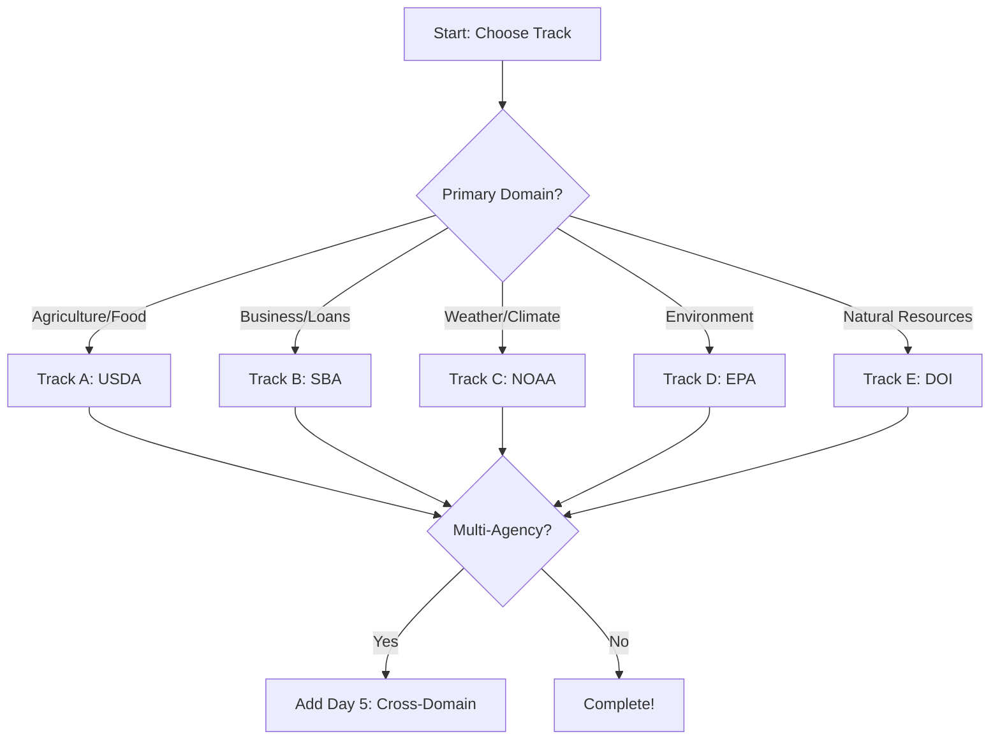

[Home](../docs/index.md) > [POC Agenda](./) > Federal Agency Tracks

# 🏛️ Federal Agency POC Workshop Tracks

> **Last Updated**: 2026-04-15 | **Version**: 2.0
> **Status**: ✅ Final | **Maintainer**: Documentation Team

---

> 🏠 Home > 📆 POC Agenda > 🏛️ Federal Agency Tracks

---

## 📋 Overview

These supplemental workshop tracks extend the base 3-day Casino/Gaming POC to cover **federal agency analytics** use cases. Each track can be run as a standalone 1-day workshop or integrated into the existing 3-day agenda as Day 4-5 extensions.

Each federal track follows the same proven medallion architecture pattern (Bronze → Silver → Gold → Power BI) but applies it to real government open datasets.

---

## 📊 Track Options

| Track | Agency | Duration | Difficulty | Data Sources |
|:------|:-------|:---------|:-----------|:-------------|
| 🌾 Track A | USDA - Agriculture | 4-5 hours | Intermediate | NASS QuickStats API, FSIS Recalls |
| 💼 Track B | SBA - Small Business | 4-5 hours | Intermediate | PPP Loans, 7(a)/504 Lending |
| 🌊 Track C | NOAA - Weather & Climate | 5-6 hours | Advanced | Weather API, Storm Events, CDO |
| 🏭 Track D | EPA - Environment | 5-6 hours | Advanced | AQS API, TRI, ECHO, SDWIS |
| 🏔️ Track E | DOI - Natural Resources | 5-6 hours | Advanced | USGS Earthquakes, NWIS, NPS Stats |

---

## 🌾 Track A: USDA Agriculture Analytics

### Prerequisites
- Completed Day 1 (Bronze/Silver fundamentals)
- Python environment with generators installed

### Agenda

| Time | Activity | Resources |
|:-----|:---------|:----------|
| 09:00-09:30 | **USDA Data Landscape** - NASS, FSIS, SNAP overview | Tutorial 32 |
| 09:30-10:00 | **Data Source Setup** - Choose synthetic generator OR open data download | `usda_generator.py`, `usda_download.py` |
| 10:00-10:15 | Break | |
| 10:15-11:15 | **Bronze Ingestion** - Crop production & food safety | `12_bronze_usda.py` |
| 11:15-12:15 | **Silver Transformation** - Validation, DQ scoring, dedup | `12_silver_usda.py` |
| 12:15-13:15 | Lunch | |
| 13:15-14:15 | **Gold Analytics** - Crop rankings, food safety index, executive summary | `12_gold_usda_analytics.py` |
| 14:15-14:30 | Break | |
| 14:30-15:30 | **Power BI Dashboard** - Direct Lake, crop maps, recall treemap | Tutorial 32 Step 5 |
| 15:30-16:00 | **Data Quality & Governance** - GE suites, Purview classification | Tutorial 32 Steps 6-7 |

### Key Deliverables
- [ ] 2 Bronze Delta tables (crop production, food safety)
- [ ] 2 Silver validated tables with DQ scores
- [ ] 4 Gold analytics tables
- [ ] Power BI dashboard with crop analysis and recall monitoring
- [ ] Great Expectations validation suite

---

## 💼 Track B: SBA Small Business Analytics

### Agenda

| Time | Activity | Resources |
|:-----|:---------|:----------|
| 09:00-09:30 | **SBA Loan Programs Overview** - PPP, 7(a), 504, SBIR | Tutorial 33 |
| 09:30-10:00 | **Data Source Setup** - Generator or PPP/7a CSV downloads | `sba_generator.py`, `sba_download.py` |
| 10:00-10:15 | Break | |
| 10:15-11:15 | **Bronze Ingestion** - PPP loans & 7(a)/504 lending data | `13_bronze_sba.py` |
| 11:15-12:15 | **Silver Transformation** - NAICS validation, loan status standardization | `13_silver_sba.py` |
| 12:15-13:15 | Lunch | |
| 13:15-14:15 | **Gold Analytics** - Loan portfolio, economic impact, lender scorecards | `13_gold_sba_analytics.py` |
| 14:15-14:30 | Break | |
| 14:30-15:30 | **Power BI Dashboard** - Loan distribution map, sector analysis | Tutorial 33 Step 5 |
| 15:30-16:00 | **Governance & PII** - Business owner data protection | Tutorial 33 Steps 6-7 |

### Key Deliverables
- [ ] 2 Bronze Delta tables (PPP loans, 7a/504 loans)
- [ ] 2 Silver validated tables
- [ ] 3 Gold analytics tables (portfolio, economic impact, lender scorecard)
- [ ] Power BI economic impact dashboard

---

## 🌊 Track C: NOAA Weather & Climate Analytics

### Agenda

| Time | Activity | Resources |
|:-----|:---------|:----------|
| 09:00-09:30 | **NOAA Data Ecosystem** - Weather API, Storm DB, CDO, CO-OPS | Tutorial 34 |
| 09:30-10:00 | **Data Source Setup** - Generator or real API downloads | `noaa_generator.py`, `noaa_download.py` |
| 10:00-10:15 | Break | |
| 10:15-11:30 | **Bronze Ingestion** - Weather obs, storm events, climate data | `14_bronze_noaa.py` |
| 11:30-12:30 | **Silver Transformation** - Unit standardization, damage parsing | `14_silver_noaa.py` |
| 12:30-13:30 | Lunch | |
| 13:30-14:30 | **Gold Analytics** - Storm impact, climate trends, severe weather risk | `14_gold_noaa_analytics.py` |
| 14:30-14:45 | Break | |
| 14:45-15:30 | **Real-Time Weather** - Eventstream setup for live observations | Tutorial 34 RT section |
| 15:30-16:15 | **Power BI Dashboard** - Storm choropleth, temperature trends | Tutorial 34 Step 5 |
| 16:15-16:45 | **Data Quality & Wrap-up** | |

### Key Deliverables
- [ ] 3 Bronze Delta tables (weather, storms, climate)
- [ ] 3 Silver validated tables with DQ scores
- [ ] 4 Gold analytics tables (weather summary, storm impact, climate trends, severe weather risk)
- [ ] Real-time weather observation pipeline (optional)
- [ ] Power BI severe weather dashboard

---

## 🏭 Track D: EPA Environmental Analytics

### Agenda

| Time | Activity | Resources |
|:-----|:---------|:----------|
| 09:00-09:30 | **EPA Data Overview** - AQS, TRI, ECHO, SDWIS, GHGRP | Tutorial 35 |
| 09:30-10:00 | **Data Source Setup** - Generator or EPA API downloads | `epa_generator.py`, `epa_download.py` |
| 10:00-10:15 | Break | |
| 10:15-11:30 | **Bronze Ingestion** - Air quality, toxic releases, water quality | `15_bronze_epa.py` |
| 11:30-12:30 | **Silver Transformation** - AQI classification, CAS validation | `15_silver_epa.py` |
| 12:30-13:30 | Lunch | |
| 13:30-14:30 | **Gold Analytics** - AQI index, facility risk, water compliance, env scorecard | `15_gold_epa_analytics.py` |
| 14:30-14:45 | Break | |
| 14:45-15:30 | **Real-Time AQI** - Eventhouse for live air quality monitoring | Tutorial 35 KQL section |
| 15:30-16:15 | **Power BI Dashboard** - Air quality heat map, TRI facility map | Tutorial 35 Step 5 |
| 16:15-16:45 | **Environmental Justice Analysis** | |

### Key Deliverables
- [ ] 3 Bronze Delta tables (air quality, toxic releases, water quality)
- [ ] 3 Silver validated tables
- [ ] 4 Gold analytics tables (AQI, facility risk, water compliance, environmental scorecard)
- [ ] Power BI environmental health dashboard

---

## 🏔️ Track E: DOI Natural Resources Analytics

### Agenda

| Time | Activity | Resources |
|:-----|:---------|:----------|
| 09:00-09:30 | **DOI Agency Overview** - USGS, BLM, FWS, NPS | Tutorial 36 |
| 09:30-10:00 | **Data Source Setup** - Generator or USGS/NPS API downloads | `doi_generator.py`, `doi_download.py` |
| 10:00-10:15 | Break | |
| 10:15-11:30 | **Bronze Ingestion** - Earthquakes, water data, park visitation | `16_bronze_doi.py` |
| 11:30-12:30 | **Silver Transformation** - Magnitude validation, coordinate enrichment | `16_silver_doi.py` |
| 12:30-13:30 | Lunch | |
| 13:30-14:30 | **Gold Analytics** - Seismic risk, water resources, park performance | `16_gold_doi_analytics.py` |
| 14:30-14:45 | Break | |
| 14:45-15:30 | **Real-Time Earthquakes** - USGS real-time event streaming | Tutorial 36 RT section |
| 15:30-16:15 | **Power BI Dashboard** - Earthquake map, park visitor trends | Tutorial 36 Step 5 |
| 16:15-16:45 | **Geospatial & Wrap-up** | |

### Key Deliverables
- [ ] 3 Bronze Delta tables (earthquakes, water data, park visitation)
- [ ] 3 Silver validated tables
- [ ] 4 Gold analytics tables (seismic risk, water resources, park performance, natural resources dashboard)
- [ ] Real-time earthquake monitoring pipeline (optional)
- [ ] Power BI natural resources dashboard

---

## 🌐 Multi-Agency Cross-Domain Workshop (Day 5)

For organizations managing data across multiple agencies, an optional Day 5 covers:

| Time | Activity |
|:-----|:---------|
| 09:00-10:00 | **Data Mesh Architecture** - Domain workspaces, OneLake shortcuts |
| 10:00-11:00 | **Cross-Domain Gold Layer** - Executive dashboards spanning all agencies |
| 11:00-12:00 | **Federated Governance** - Purview policies, classification taxonomy |
| 12:00-13:00 | Lunch |
| 13:00-14:00 | **Error Handling & Monitoring** - Production error table, Data Activator alerts |
| 14:00-15:00 | **Performance Optimization** - Copy parallelism, Spark tuning, Direct Lake |
| 15:00-16:00 | **New Fabric Features** - Fabric IQ, AI Copilot, RTI advanced patterns |
| 16:00-16:30 | **Wrap-up & Next Steps** |

---

## 🧭 Choosing Your Track

---

## 🔄 Data Source Flexibility

Each track supports two data source options:

| Option | When to Use | Setup Time | Data Freshness |
|:-------|:-----------|:-----------|:---------------|
| **Synthetic Generator** | No internet, quick setup, deterministic testing | 5 min | Simulated |
| **Open Data Download** | Real-world demos, actual patterns, client presentations | 15-30 min | Real (latest available) |

Both options produce parquet files with identical schemas, so all notebooks work with either source.

---

## 📖 Related Documents

| Document | Description |
|:---------|:-----------|
| [3-Day Base Agenda](./README.md) | Core Casino/Gaming workshop |
| [Tutorials](../tutorials/README.md) | Step-by-step tutorial guides |
| [Best Practices](../docs/best-practices/README.md) | Architecture and governance best practices |
| [Demo Runbook](./DEMO_RUNBOOK.md) | Live demo presenter guide |

---

[⬆️ Back to Top](#-federal-agency-poc-workshop-tracks) | [📚 POC Agenda](./) | [🏠 Home](../docs/index.md)

