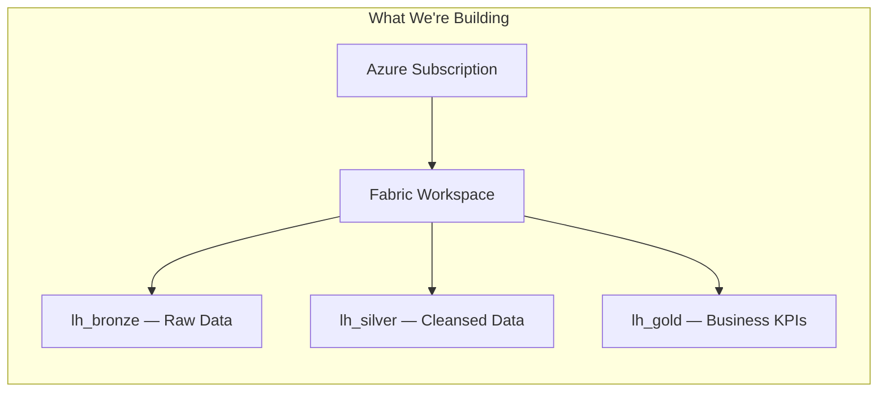
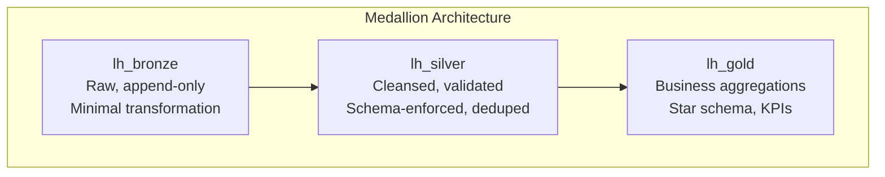

# ⚙️ Tutorial 00: Environment Setup

> **Last Updated**: 2026-04-15 | **Version**: 2.0
> **Status**: ✅ Final | **Maintainer**: Documentation Team

> 🏠 **[Home](../../README.md)** > 📖 **[Tutorials](../README.md)** > ⚙️ **Environment Setup**

---

<div align="center">


</div>

---

> For the 5-minute version, see [docs/QUICK_START.md](../../docs/QUICK_START.md).

## 📖 Overview

This tutorial walks you through setting up the complete Microsoft Fabric environment for the Casino/Gaming POC. By the end you will have a workspace, three Lakehouses following the medallion architecture, and a verified Spark environment ready for data ingestion.



---

## 🎯 Learning Objectives

By the end of this tutorial you will be able to:

- Verify your Fabric capacity is running and ready
- Create and configure a Fabric workspace
- Create three Lakehouses for the medallion architecture
- Understand why Bronze / Silver / Gold layers exist
- Run a test notebook and confirm Spark connectivity
- Set up local development tools for data generation

---

## 📋 Prerequisites

Before starting, confirm you have:

| Requirement | How to Get It |
|-------------|---------------|
| Azure subscription with Fabric enabled | [Sign up for Azure](https://azure.microsoft.com/free/) |
| Fabric capacity (F64 recommended, F2 minimum) | [Start a free 60-day trial](https://learn.microsoft.com/fabric/get-started/fabric-trial) |
| Access to [app.fabric.microsoft.com](https://app.fabric.microsoft.com) | Sign in with your Microsoft Entra ID account |
| Python 3.10+ *(optional, for local data generation)* | [Download from python.org](https://www.python.org/downloads/) |
| Azure CLI *(optional, for Bicep deployment)* | [Install Azure CLI](https://learn.microsoft.com/cli/azure/install-azure-cli) |
| VS Code *(optional, for editing notebooks locally)* | [Download VS Code](https://code.visualstudio.com/Download) |

---

## 🛠️ Step 1: Verify Fabric Capacity

Your Fabric capacity must be **Running** before any notebooks or data processing will work. A paused or deallocated capacity will silently prevent everything downstream.

### Check capacity state

1. Open the [Azure Portal](https://portal.azure.com)
2. Search for **Microsoft Fabric** and open your capacity resource
3. Check the **Status** field on the overview blade:

| Status | Meaning | Action |
|--------|---------|--------|
| **Running** | Ready to use | Proceed to Step 2 |
| **Paused** | Manually paused to save cost | Click **Resume** — takes 1-2 minutes |
| **Deallocated** | Stopped by Azure | Click **Resume** — may take 2-3 minutes |
| **Not found** | No capacity provisioned | Deploy via Bicep (see [QUICK_START.md](../../docs/QUICK_START.md) Step 2) or start a trial |

### Verify from the Fabric portal

1. Open [app.fabric.microsoft.com](https://app.fabric.microsoft.com)
2. Click **Settings** (gear icon, top right) > **Admin portal**
3. Navigate to **Capacity settings**
4. Confirm your capacity appears and shows **Active**

> If you don't have Admin portal access, ask your tenant admin to confirm capacity status, or check the Azure Portal method above which only requires Contributor access on the capacity resource.

**Checkpoint:** Capacity status is **Running / Active**.

---

## 🛠️ Step 2: Create Workspace

1. In the Fabric portal left navigation, click **Workspaces**
2. Click **+ New workspace**
3. Configure:

| Setting | Value |
|---------|-------|
| **Name** | `casino-fabric-poc` |
| **Description** | Casino/Gaming Fabric POC — Medallion Architecture |
| **License mode** | Fabric capacity |
| **Capacity** | Select your Fabric capacity from the dropdown |

4. Click **Apply**

### Configure workspace settings

After the workspace is created:

1. Open workspace settings (click the three dots **...** next to the workspace name > **Workspace settings**)
2. Under **General**, set the contact list to include your team
3. Under **License info**, confirm **Fabric capacity** is selected

> Pin the workspace to your favorites (star icon) for quick access from the home page.

**Checkpoint:** `casino-fabric-poc` appears in your Workspaces list with a diamond/capacity badge.

---

## 🛠️ Step 3: Create Lakehouses

The medallion architecture uses three layers to progressively refine data. Each layer gets its own Lakehouse:



| Layer | Lakehouse Name | What Goes Here | Example Tables |
|-------|----------------|----------------|----------------|
| **Bronze** | `lh_bronze` | Raw data exactly as received. Append-only, no business logic. | `bronze_slot_telemetry`, `bronze_player_profile` |
| **Silver** | `lh_silver` | Cleansed and validated data. Nulls handled, duplicates removed, schemas enforced. | `silver_slot_cleansed`, `silver_player_master` |
| **Gold** | `lh_gold` | Business-ready aggregations. Star schema tables, KPIs, compliance reports. | `gold_slot_performance`, `gold_revenue_daily` |

### Create each Lakehouse

For each of the three Lakehouses:

1. In the `casino-fabric-poc` workspace, click **+ New** > **Lakehouse**
2. Enter the name (`lh_bronze`, then `lh_silver`, then `lh_gold`)
3. Click **Create**

### Verify

Your workspace item list should now show:

```
casino-fabric-poc/
  lh_bronze
  lh_silver
  lh_gold
```

Each Lakehouse will have empty **Tables** and **Files** folders — that's expected at this point.

**Checkpoint:** All three Lakehouses appear in the workspace.

---

## 🛠️ Step 4: Connect External Storage (Path A Only)

> **🔀 Which path are you on?**
>
> | | **Path A — Production-Aligned** | **Path B — Quickstart** |
> |---|---|---|
> | **Prereq** | Deploy `infra/main.bicep` first | Fabric capacity + workspace only |
> | **Data location** | ADLS Gen2 → OneLake shortcut | Upload directly to OneLake |
> | **Source path in notebooks** | `Files/landing_zone/...` | `Files/raw/...` |
> | **Cost** | ~$1-3/day (Purview + Storage + KV + LAW) | Fabric capacity only |
> | **Best for** | Production patterns, governance, security tutorials | Learning medallion flow fast |
>
> **Path B users:** Skip this step entirely — proceed to [Step 5](#-step-5-configure-workspace-access). Upload your generated data directly to `lh_bronze/Files/raw/<source>/` via the Fabric UI.
>
> **Path A users:** Complete this step to connect your Bicep-provisioned ADLS storage.

If you deployed the ADLS Gen2 storage account via Bicep, connect it as a shortcut to avoid copying data.

1. Open `lh_bronze` in the workspace
2. In the **Explorer** pane, right-click on **Files**
3. Select **New shortcut** > **Azure Data Lake Storage Gen2**
4. Enter your ADLS DFS endpoint URL and authenticate with your organizational account
5. Browse to the `landing` container
6. Name the shortcut `landing_zone` and click **Create**

> Shortcuts let you query external data in place without copying it into OneLake, saving storage cost and keeping data in sync.

**Checkpoint:** The `landing_zone` shortcut appears under **Files** in `lh_bronze`, and you can browse its contents.

---

## 🛠️ Step 5: Configure Workspace Access

1. Open workspace settings > **Access**
2. Add team members with appropriate roles:

| Role | Who | Permissions |
|------|-----|-------------|
| **Admin** | Workspace owners | Full control including delete |
| **Member** | Data engineers | Edit all items |
| **Contributor** | Developers | Create and edit own items |
| **Viewer** | Business users, analysts | Read only |

> Be careful with Admin — Admins can delete the entire workspace and all its contents.

---

## 🛠️ Step 6: Install Local Tools (Optional)

For local data generation and development, set up Python:

### Python environment setup

Run these commands in a terminal from the **repo root** (`Suppercharge_Microsoft_Fabric/`):

```bash
# Create virtual environment
python -m venv .venv

# Activate — Windows
.venv\Scripts\activate

# Activate — macOS / Linux
source .venv/bin/activate

# Install project dependencies
pip install -r requirements.txt
```

### Verify installation

```bash
# Should print without errors
python -c "import pandas; import pyspark; print('Dependencies OK')"
```

> All `python` and `pip` commands in this tutorial series assume you have activated the virtual environment first.

---

## ✅ Step 7: Verify the Environment

### Run a test notebook in Fabric

This test writes and reads a Delta table to confirm Spark and Lakehouse connectivity.

1. In the `casino-fabric-poc` workspace, click **+ New** > **Notebook**
2. In the notebook's **Lakehouse explorer** (left panel), click **Add** and attach **`lh_bronze`**
3. Paste this code into the first cell and click the **Run** button:

```python
# ---- Run this in a Fabric Notebook (attached to lh_bronze) ----

# Create test data
data = [("environment", "ready"), ("setup", "complete")]
df = spark.createDataFrame(data, ["key", "value"])

# Write to Bronze Lakehouse as a Delta table
df.write.format("delta").mode("overwrite").save("Tables/test_connection")

# Read it back to confirm round-trip works
df_check = spark.read.format("delta").load("Tables/test_connection")
print(f"Row count: {df_check.count()}")  # Should print: Row count: 2
display(df_check)

print("Environment verified successfully.")
```

> **First-time execution takes 2-3 minutes** while Fabric provisions a Spark cluster (cold start). Subsequent cell runs in the same session are fast.

4. After the cell succeeds, verify `test_connection` appears under **Tables** in the Lakehouse explorer (you may need to click the refresh icon)
5. Clean up by running this in a second cell:

```python
# ---- Run this in a Fabric Notebook ----
spark.sql("DROP TABLE IF EXISTS test_connection")
print("Test table cleaned up.")
```

**Checkpoint:** The test cell printed `Row count: 2` and the table appeared in the explorer.

---

## ✅ Validation Checklist

Before proceeding to Tutorial 01, confirm every item:

- [ ] Fabric capacity is **Running / Active**
- [ ] Workspace `casino-fabric-poc` exists with Fabric capacity assigned
- [ ] Lakehouse `lh_bronze` created
- [ ] Lakehouse `lh_silver` created
- [ ] Lakehouse `lh_gold` created
- [ ] Test notebook executed successfully (Row count: 2)
- [ ] Test table cleaned up
- [ ] *(Optional)* ADLS shortcut `landing_zone` working
- [ ] *(Optional)* Local Python environment with dependencies installed

---

## 🔧 Troubleshooting

### Workspace and Capacity

| Error / Symptom | Cause | Fix |
|-----------------|-------|-----|
| "Fabric is not enabled for your tenant" | Tenant admin hasn't enabled Fabric | Contact your Microsoft Entra tenant admin to enable Fabric in the admin portal |
| "No capacity available" when creating workspace | No Fabric capacity provisioned or trial not started | Start a [Fabric trial](https://learn.microsoft.com/fabric/get-started/fabric-trial) or deploy capacity via Bicep |
| Workspace shows no capacity badge | Workspace not assigned to a Fabric capacity | Open workspace settings > License info > select your Fabric capacity |

### Notebooks and Spark

| Error / Symptom | Cause | Fix |
|-----------------|-------|-----|
| Cell hangs for 5+ minutes on first run | Spark cold start taking longer than usual | Wait up to 3 minutes. If it exceeds 5, cancel the cell and click **Run** again — the cluster may have failed to provision |
| `AnalysisException: Table not found` | Notebook is attached to the wrong Lakehouse or no Lakehouse attached | Click the Lakehouse icon in the notebook sidebar, verify `lh_bronze` is attached. Remove and re-add if needed |
| `TokenExpired` or authentication errors | Fabric session token expired (after ~1 hour of inactivity) | Refresh the browser tab and re-run the cell. Your work is saved automatically |
| `OutOfMemoryError` or `SparkException: Job aborted` | Data too large for current capacity | Reduce data volume or upgrade from F2 to a larger SKU |
| `Capacity is suspended` or notebook won't start | Fabric capacity is paused in Azure Portal | Go to Azure Portal > your Fabric capacity > click **Resume** (1-2 minutes) |

### Local Development

| Error / Symptom | Cause | Fix |
|-----------------|-------|-----|
| `ModuleNotFoundError: No module named 'pandas'` | Virtual environment not activated | Run `.venv\Scripts\activate` (Windows) or `source .venv/bin/activate` (macOS/Linux) before `pip install` |
| `python: command not found` | Python not on PATH | Install Python from [python.org](https://www.python.org/downloads/) and ensure "Add to PATH" is checked |
| `docker compose` not recognized | Using deprecated `docker-compose` binary | Install Docker Desktop 4.x+ which includes the `docker compose` v2 plugin |

> **Pro Tip:** If Spark startup fails repeatedly, try detaching and reattaching the Lakehouse to the notebook — this forces a fresh cluster provisioning.

---

## 🎉 Summary

You have successfully:

- Verified your Fabric capacity is running
- Created the `casino-fabric-poc` workspace
- Set up the medallion architecture with `lh_bronze`, `lh_silver`, and `lh_gold`
- Confirmed Spark connectivity with a test notebook
- *(Optional)* Connected external ADLS storage and set up local dev tools

Your environment is ready for data ingestion.

---

## 📚 Resources

- [Microsoft Fabric Documentation](https://learn.microsoft.com/fabric/)
- [Lakehouse Overview](https://learn.microsoft.com/fabric/data-engineering/lakehouse-overview)
- [Workspace Management](https://learn.microsoft.com/fabric/get-started/workspaces)
- [OneLake Shortcuts](https://learn.microsoft.com/fabric/onelake/onelake-shortcuts)
- [How to Use Notebooks](https://learn.microsoft.com/fabric/data-engineering/how-to-use-notebook)

---

## 🧭 Navigation

| Previous | Up | Next |
|----------|-----|------|
| N/A — this is the first tutorial | [Tutorials Index](../README.md) | [Tutorial 01: Bronze Layer](../01-bronze-layer/README.md) |

---

[⬆️ Back to Top](#-tutorial-00-environment-setup) | [📚 Tutorials](../) | [🏠 Home](../../docs/index.md)
