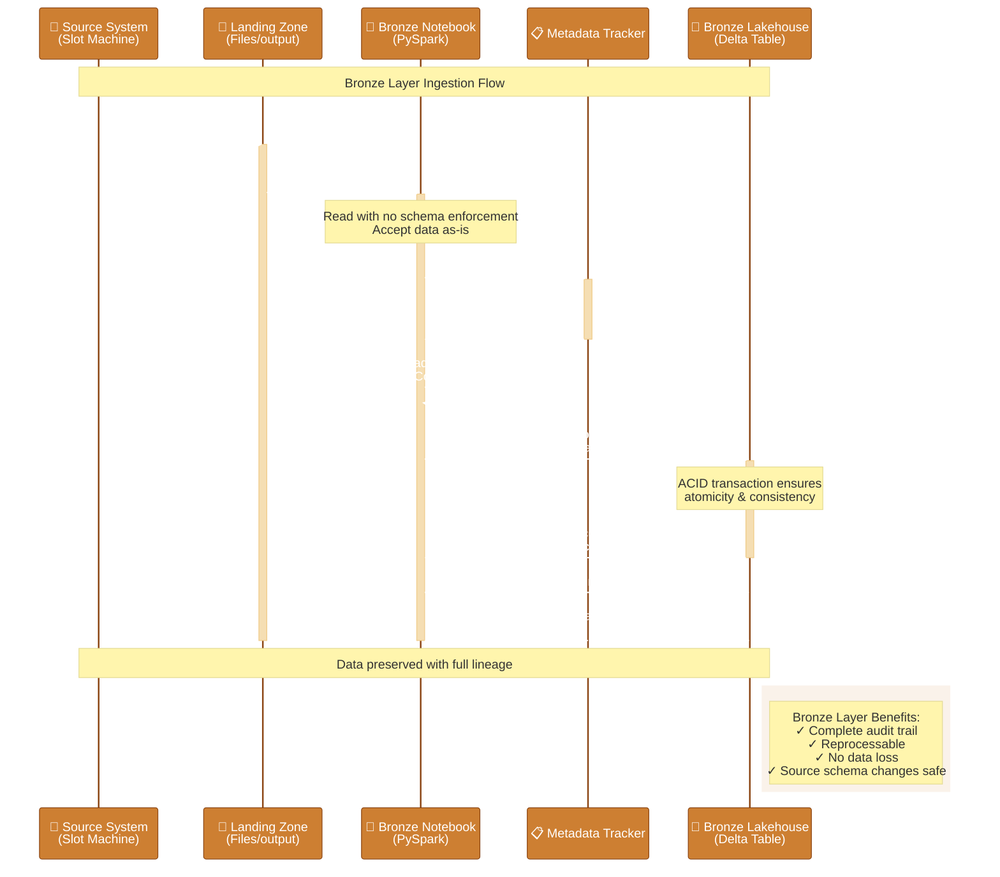
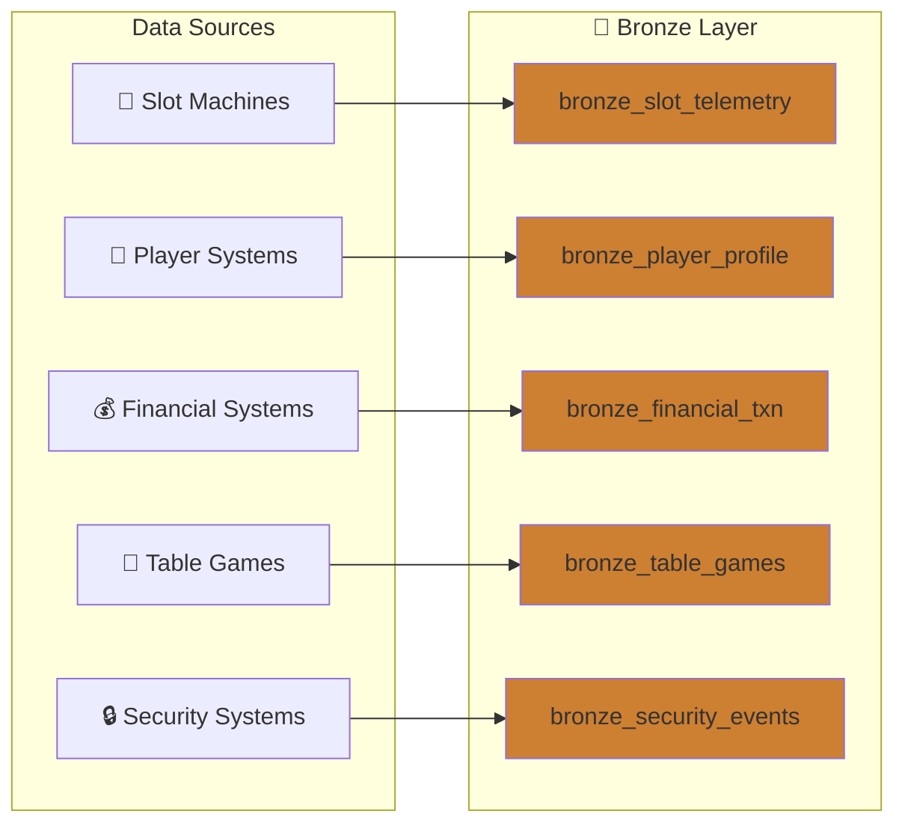
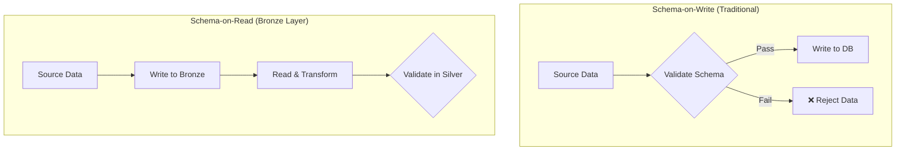

# 🥉 Tutorial 01: Bronze Layer

> **Last Updated**: 2026-04-15 | **Version**: 2.0
> **Status**: ✅ Final | **Maintainer**: Documentation Team

> **🏠 [Home](https://github.com/fgarofalo56/Suppercharge_Microsoft_Fabric/blob/main/README.md)** > **📖 [Tutorials](../index.md)** > **🥉 Bronze Layer**

---

<div align="center" markdown>


</div>

---

## 🎓 Tutorial 01: Bronze Layer - Raw Data Ingestion

| | |
|---|---|
| **Difficulty** | ⭐ Beginner |
| **Time** | ⏱️ 45-60 minutes |
| **Layer** | 🥉 Bronze (Raw Data) |
| **Prerequisites** | Tutorial 00 completed |

---

### 📍 Progress Tracker

<div align="center" markdown>

<table>
<thead>
<tr>
<th align="center" width="10%">Tutorial</th>
<th align="left" width="45%">Name</th>
<th align="center" width="15%">Status</th>
<th align="center" width="15%">Duration</th>
<th align="center" width="15%">Difficulty</th>
</tr>
</thead>
<tbody>
<tr>
<td align="center">00</td>
<td><a href="../00-environment-setup/">⚙️ Environment Setup</a></td>
<td align="center"></td>
<td align="center">45-60 min</td>
<td align="center">⭐ Beginner</td>
</tr>
<tr style="background-color: #e8f5e9;">
<td align="center"><strong>01</strong></td>
<td><strong>👉 <a href="../01-bronze-layer/">🥉 Bronze Layer</a></strong></td>
<td align="center"></td>
<td align="center">60-90 min</td>
<td align="center">⭐ Beginner</td>
</tr>
<tr>
<td align="center">02</td>
<td><a href="../02-silver-layer/">🥈 Silver Layer</a></td>
<td align="center"></td>
<td align="center">60-90 min</td>
<td align="center">⭐⭐ Intermediate</td>
</tr>
<tr>
<td align="center">03</td>
<td><a href="../03-gold-layer/">🥇 Gold Layer</a></td>
<td align="center"></td>
<td align="center">90-120 min</td>
<td align="center">⭐⭐ Intermediate</td>
</tr>
<tr>
<td align="center">04</td>
<td><a href="../04-real-time-analytics/">⚡ Real-Time Analytics</a></td>
<td align="center"></td>
<td align="center">90-120 min</td>
<td align="center">⭐⭐⭐ Advanced</td>
</tr>
<tr>
<td align="center">05</td>
<td><a href="../05-direct-lake-powerbi/">📊 Direct Lake & Power BI</a></td>
<td align="center"></td>
<td align="center">60-90 min</td>
<td align="center">⭐⭐ Intermediate</td>
</tr>
<tr>
<td align="center">06</td>
<td><a href="../06-data-pipelines/">🔄 Data Pipelines</a></td>
<td align="center"></td>
<td align="center">60-90 min</td>
<td align="center">⭐⭐ Intermediate</td>
</tr>
<tr>
<td align="center">07</td>
<td><a href="../07-governance-purview/">🛡️ Governance & Purview</a></td>
<td align="center"></td>
<td align="center">60-90 min</td>
<td align="center">⭐⭐ Intermediate</td>
</tr>
<tr>
<td align="center">08</td>
<td><a href="../08-database-mirroring/">🔄 Database Mirroring</a></td>
<td align="center"></td>
<td align="center">60-90 min</td>
<td align="center">⭐⭐ Intermediate</td>
</tr>
<tr>
<td align="center">09</td>
<td><a href="../09-advanced-ai-ml/">🤖 Advanced AI/ML</a></td>
<td align="center"></td>
<td align="center">90-120 min</td>
<td align="center">⭐⭐⭐ Advanced</td>
</tr>
</tbody>
</table>

<p><em>💡 Tip: Click any tutorial name to jump directly to it</em></p>

</div>

---

| Navigation | |
|---|---|
| **Previous** | [⬅️ 00-Environment Setup](../00-environment-setup/README.md) |
| **Next** | [02-Silver Layer](../02-silver-layer/README.md) ➡️ |

---

## 📖 Overview

This tutorial covers implementing the Bronze layer of the medallion architecture - raw data ingestion with minimal transformation. The Bronze layer is the foundation that preserves all source data in its original form, ensuring data lineage and enabling reprocessing when needed.

---

## 📊 Visual Overview

The following sequence diagram illustrates the Bronze layer data ingestion flow, showing how raw data from source systems is captured with full metadata tracking for lineage and audit purposes.



**Key Concepts:**
- **Schema-on-Read**: Data is accepted as-is without validation at ingestion time
- **Metadata Tracking**: Every record includes ingestion timestamp, source file, and batch ID for complete lineage
- **Append-Only**: Data is never updated or deleted, maintaining full history
- **ACID Compliance**: Delta Lake guarantees atomic, consistent, isolated, and durable writes

---



---

## 🎯 Learning Objectives

By the end of this tutorial, you will be able to:

- [ ] Understand Bronze layer principles and schema-on-read
- [ ] Ingest slot machine telemetry data
- [ ] Ingest player profile data
- [ ] Ingest financial transaction data
- [ ] Implement metadata tracking columns for data lineage
- [ ] Configure Delta Lake tables with proper options

---

## 🥉 Bronze Layer Principles

The Bronze layer is the foundation of the medallion architecture. Understanding these principles is critical for building a robust data platform.


*Source: [Lakehouse End-to-End Scenario in Microsoft Fabric](https://learn.microsoft.com/en-us/fabric/data-engineering/tutorial-lakehouse-introduction)*

| Principle | Description | Why It Matters |
|-----------|-------------|----------------|
| **Raw Data** | Store data as-is from source systems | Enables reprocessing if business logic changes |
| **Append-Only** | Never update or delete; always append | Maintains complete audit trail |
| **Full Fidelity** | Preserve all source fields | No data loss, even for unused fields |
| **Metadata** | Track ingestion time, source, batch | Enables lineage and debugging |
| **Schema-on-Read** | Minimal schema enforcement at ingestion | Reduces ingestion failures |

> ℹ️ **Note:** The Bronze layer is often called the "raw" or "landing" layer. Its purpose is to capture everything exactly as received from source systems.

### Schema-on-Read Explained

Unlike traditional databases that enforce schema at write time (schema-on-write), the Bronze layer uses schema-on-read:



**Benefits of Schema-on-Read:**
- No data loss from validation failures
- Source schema changes don't break ingestion
- Can reprocess data with new transformations
- Faster ingestion (no validation overhead)

---

## 📋 Prerequisites

Before starting, ensure you have:

- [ ] Completed [Tutorial 00: Environment Setup](../00-environment-setup/README.md)
- [ ] Generated sample data (see `data_generation/` folder in repo)
- [ ] Access to `lh_bronze` Lakehouse

> ⚠️ **Warning:** If you haven't generated sample data yet, do so before continuing. The notebooks in this tutorial expect data files to exist.

---

## 🛠️ Step 1: Upload Sample Data

### Option A: Generate and Upload via Fabric UI

1. Generate sample data locally:
   ```bash
   cd data_generation
   python generate.py --all --days 30 --output ./output
   ```

2. In Fabric, open `lh_bronze`
3. In **Files** section, click **Upload** > **Upload folder**
4. Upload the `output` folder


*The Lakehouse explorer shows files and folders with context menu options. Source: [How to use notebooks](https://learn.microsoft.com/en-us/fabric/data-engineering/how-to-use-notebook)*

### Option B: Use Shortcut to ADLS

If you configured ADLS shortcut in Tutorial 00:
1. Copy generated files to your ADLS landing zone
2. Files will be accessible via the shortcut

### Expected Files

After upload, your Files section should contain:

```
Files/
├── output/
│   ├── bronze_slot_telemetry.parquet
│   ├── bronze_player_profile.parquet
│   ├── bronze_financial_txn.parquet
│   ├── bronze_table_games.parquet
│   ├── bronze_security_events.parquet
│   └── bronze_compliance.parquet
```


*The content area displays file and folder details including size and timestamps. Source: [Explore lakehouse in notebook](https://learn.microsoft.com/en-us/fabric/data-engineering/lakehouse-notebook-explore)*

> ℹ️ **Note:** File names may vary based on your data generation configuration. Adjust the notebook paths accordingly.

---

## 🛠️ Step 2: Slot Machine Telemetry Ingestion

This is our primary data source - high-volume telemetry from slot machines on the casino floor.

### Create the Notebook

1. In `lh_bronze`, click **Open notebook** > **New notebook**
2. Name it: `01_bronze_slot_telemetry`

### Understanding the Data

Slot machine telemetry includes:
- Machine events (spins, wins, errors)
- Performance metrics
- Player session data
- Timestamps for each event

### Notebook Code

```python
# Cell 1: Configuration
# =====================
# 🥉 Bronze Layer - Slot Machine Telemetry Ingestion
# This notebook ingests raw slot machine telemetry data

from pyspark.sql import SparkSession
from pyspark.sql.functions import current_timestamp, lit, input_file_name
from pyspark.sql.types import *
from datetime import datetime

# Configuration
# Path B (Quickstart): Files/raw/slot_telemetry/bronze_slot_telemetry.parquet
# Path A (Production): Files/landing_zone/slot_telemetry/bronze_slot_telemetry.parquet
SOURCE_PATH = "Files/output/bronze_slot_telemetry.parquet"
TARGET_TABLE = "bronze_slot_telemetry"
BATCH_ID = datetime.now().strftime("%Y%m%d_%H%M%S")

print(f"🥉 Bronze Layer Ingestion")
print(f"   Source: {SOURCE_PATH}")
print(f"   Target: {TARGET_TABLE}")
print(f"   Batch:  {BATCH_ID}")
```

```python
# Cell 2: Read Source Data
# ========================

# Read parquet file - schema-on-read means we accept whatever schema exists
df_raw = spark.read.parquet(SOURCE_PATH)

print(f"📊 Source Statistics:")
print(f"   Records: {df_raw.count():,}")
print(f"   Columns: {len(df_raw.columns)}")
print(f"\n📋 Source Schema:")
df_raw.printSchema()
```

```python
# Cell 3: Add Metadata Columns
# ============================
# These columns enable data lineage and debugging

df_bronze = df_raw \
    .withColumn("_bronze_ingested_at", current_timestamp()) \
    .withColumn("_bronze_source_file", input_file_name()) \
    .withColumn("_bronze_batch_id", lit(BATCH_ID))

print("✅ Added metadata columns:")
print(f"   • _bronze_ingested_at  - When the data was ingested")
print(f"   • _bronze_source_file  - Source file path for lineage")
print(f"   • _bronze_batch_id     - Batch identifier: {BATCH_ID}")
```

> ℹ️ **Note:** The `_bronze_` prefix clearly identifies metadata columns added during Bronze layer processing. This convention helps distinguish system columns from source data.

```python
# Cell 4: Write to Delta Table
# ============================
# Using append mode - Bronze layer is append-only

df_bronze.write \
    .format("delta") \
    .mode("append") \
    .option("mergeSchema", "true") \
    .saveAsTable(TARGET_TABLE)

print(f"✅ Successfully wrote {df_bronze.count():,} records to {TARGET_TABLE}")
```

```python
# Cell 5: Verify Ingestion
# ========================

# Read back and verify
df_verify = spark.table(TARGET_TABLE)

print(f"\n📊 Table Statistics:")
print(f"   Total records: {df_verify.count():,}")
print(f"   Columns: {len(df_verify.columns)}")

# Show sample with key columns
print(f"\n📋 Sample Records:")
df_verify.select(
    "event_id", "machine_id", "event_type",
    "event_timestamp", "_bronze_ingested_at"
).show(5, truncate=False)
```

```python
# Cell 6: Table Metadata & History
# ================================
# Delta Lake automatically tracks all changes

from delta.tables import DeltaTable

delta_table = DeltaTable.forName(spark, TARGET_TABLE)

print("📜 Delta Table History:")
delta_table.history(5).select(
    "version", "timestamp", "operation", "operationMetrics"
).show(truncate=False)
```

### Run the Notebook

1. Click **Run all** to execute all cells
2. Verify the table appears in the **Tables** section of `lh_bronze`
3. Check the row count matches expected


*Pin a lakehouse as default to see Tables and Files in the explorer. Source: [Explore lakehouse in notebook](https://learn.microsoft.com/en-us/fabric/data-engineering/lakehouse-notebook-explore)*

---

## 🛠️ Step 3: Player Profile Ingestion

Player profile data contains customer information - handle with care as it may contain PII.

### Create Notebook

Create notebook: `02_bronze_player_profile`

```python
# Cell 1: Configuration
# =====================
# 🥉 Bronze Layer - Player Profile Ingestion

from pyspark.sql.functions import current_timestamp, lit, input_file_name
from datetime import datetime

SOURCE_PATH = "Files/output/bronze_player_profile.parquet"
TARGET_TABLE = "bronze_player_profile"
BATCH_ID = datetime.now().strftime("%Y%m%d_%H%M%S")

print(f"🥉 Bronze Layer - Player Profile Ingestion")
print(f"   Batch ID: {BATCH_ID}")
```

```python
# Cell 2: Read and Add Metadata
# =============================

df_raw = spark.read.parquet(SOURCE_PATH)
print(f"📊 Source records: {df_raw.count():,}")

# Add metadata columns
df_bronze = df_raw \
    .withColumn("_bronze_ingested_at", current_timestamp()) \
    .withColumn("_bronze_source_file", input_file_name()) \
    .withColumn("_bronze_batch_id", lit(BATCH_ID))
```

```python
# Cell 3: Write to Delta Table
# ============================

df_bronze.write \
    .format("delta") \
    .mode("append") \
    .option("mergeSchema", "true") \
    .saveAsTable(TARGET_TABLE)

print(f"✅ Wrote {df_bronze.count():,} player records to {TARGET_TABLE}")
```

> ⚠️ **Warning:** Player profile data may contain PII (names, addresses, etc.). Ensure proper access controls are in place and data handling complies with regulations.

---

## 🛠️ Step 4: Financial Transaction Ingestion

Financial transactions require special attention for audit compliance.

### Create Notebook

Create notebook: `03_bronze_financial_txn`

```python
# Cell 1: Configuration
# =====================
# 🥉 Bronze Layer - Financial Transaction Ingestion
# Note: Financial data requires strict audit trail

from pyspark.sql.functions import current_timestamp, lit, input_file_name
from datetime import datetime

SOURCE_PATH = "Files/output/bronze_financial_txn.parquet"
TARGET_TABLE = "bronze_financial_txn"
BATCH_ID = datetime.now().strftime("%Y%m%d_%H%M%S")
```

```python
# Cell 2: Read Source Data
# ========================

df_raw = spark.read.parquet(SOURCE_PATH)
print(f"📊 Source records: {df_raw.count():,}")
print(f"📋 Columns: {df_raw.columns}")
```

```python
# Cell 3: Add Metadata
# ====================

df_bronze = df_raw \
    .withColumn("_bronze_ingested_at", current_timestamp()) \
    .withColumn("_bronze_source_file", input_file_name()) \
    .withColumn("_bronze_batch_id", lit(BATCH_ID))
```

```python
# Cell 4: Write to Table
# ======================

df_bronze.write \
    .format("delta") \
    .mode("append") \
    .saveAsTable(TARGET_TABLE)

print(f"✅ Wrote {df_bronze.count():,} financial transactions")
```

> ℹ️ **Note:** Delta Lake's ACID transactions ensure financial data is never partially written. This is critical for audit compliance.

---

## 🛠️ Step 5: Ingest Remaining Data

Repeat the pattern for the remaining data sources:

| Notebook | Source File | Target Table |
|----------|-------------|--------------|
| `04_bronze_table_games` | `bronze_table_games.parquet` | `bronze_table_games` |
| `05_bronze_security_events` | `bronze_security_events.parquet` | `bronze_security_events` |
| `06_bronze_compliance` | `bronze_compliance.parquet` | `bronze_compliance` |

Each notebook follows the same pattern:
1. Read source file (schema-on-read)
2. Add metadata columns (`_bronze_*`)
3. Write to Delta table (append mode)
4. Verify counts

### Template for Additional Tables

```python
# 🥉 Bronze Layer Ingestion Template
# ==================================

from pyspark.sql.functions import current_timestamp, lit, input_file_name
from datetime import datetime

# Configuration - UPDATE THESE VALUES
SOURCE_PATH = "Files/output/bronze_TABLE_NAME.parquet"
TARGET_TABLE = "bronze_TABLE_NAME"
BATCH_ID = datetime.now().strftime("%Y%m%d_%H%M%S")

# Read source
df_raw = spark.read.parquet(SOURCE_PATH)
print(f"📊 Source records: {df_raw.count():,}")

# Add metadata
df_bronze = df_raw \
    .withColumn("_bronze_ingested_at", current_timestamp()) \
    .withColumn("_bronze_source_file", input_file_name()) \
    .withColumn("_bronze_batch_id", lit(BATCH_ID))

# Write to Delta
df_bronze.write \
    .format("delta") \
    .mode("append") \
    .option("mergeSchema", "true") \
    .saveAsTable(TARGET_TABLE)

print(f"✅ Wrote {df_bronze.count():,} records to {TARGET_TABLE}")
```

---

## 🛠️ Step 6: Create Bronze Layer Verification

### Create Verification Notebook

Create notebook: `99_bronze_verification`

```python
# 🥉 Bronze Layer Verification
# ============================
# Run this notebook to verify all Bronze tables are populated

tables = [
    "bronze_slot_telemetry",
    "bronze_player_profile",
    "bronze_financial_txn",
    "bronze_table_games",
    "bronze_security_events",
    "bronze_compliance"
]

print("=" * 70)
print("🥉 BRONZE LAYER VERIFICATION REPORT")
print("=" * 70)

total_records = 0
results = []

for table in tables:
    try:
        count = spark.table(table).count()
        total_records += count
        status = "✅"
        message = f"{count:>12,} records"
    except Exception as e:
        status = "❌"
        message = f"Error: {str(e)[:30]}"
        count = 0

    results.append((status, table, message))
    print(f"{status} {table:35} {message}")

print("-" * 70)
print(f"   {'TOTAL':35} {total_records:>12,} records")
print("=" * 70)

# Summary
passed = sum(1 for r in results if r[0] == "✅")
failed = len(results) - passed

if failed == 0:
    print("\n🎉 All Bronze tables verified successfully!")
else:
    print(f"\n⚠️  {failed} table(s) need attention.")
```

### Expected Output

```
======================================================================
🥉 BRONZE LAYER VERIFICATION REPORT
======================================================================
✅ bronze_slot_telemetry                    1,000,000 records
✅ bronze_player_profile                       50,000 records
✅ bronze_financial_txn                       250,000 records
✅ bronze_table_games                         100,000 records
✅ bronze_security_events                      75,000 records
✅ bronze_compliance                           25,000 records
----------------------------------------------------------------------
   TOTAL                                    1,500,000 records
======================================================================

🎉 All Bronze tables verified successfully!
```

---

## ✅ Validation Checklist

Before moving to the next tutorial, verify:

- [ ] **All Bronze Tables Created** - 6 tables exist in `lh_bronze`
- [ ] **Data Loaded Successfully** - Row counts match expected source data
- [ ] **Metadata Columns Present** - All tables have `_bronze_*` columns
- [ ] **Delta Format Verified** - Can view table history for all tables
- [ ] **Schema-on-Read Working** - No schema enforcement errors during ingestion
- [ ] **Verification Script Passes** - `99_bronze_verification` notebook shows all green

<details>
<summary>🔍 How to verify each item</summary>

### All Bronze Tables Created
```python
# List all tables in Bronze lakehouse
tables = spark.sql("SHOW TABLES IN lh_bronze").collect()
table_names = [row.tableName for row in tables]

expected_tables = [
    "bronze_slot_telemetry",
    "bronze_player_profile",
    "bronze_financial_txn",
    "bronze_table_games",
    "bronze_security_events",
    "bronze_compliance"
]

for table in expected_tables:
    status = "✅" if table in table_names else "❌"
    print(f"{status} {table}")
```

### Data Loaded Successfully
```python
# Check row counts for each table
for table in expected_tables:
    count = spark.table(f"lh_bronze.{table}").count()
    print(f"{table}: {count:,} rows")
```

### Metadata Columns Present
```python
# Verify metadata columns exist
table = "bronze_slot_telemetry"
columns = spark.table(f"lh_bronze.{table}").columns

required_metadata = ["_bronze_ingested_at", "_bronze_source_file", "_bronze_batch_id"]
for col in required_metadata:
    status = "✅" if col in columns else "❌"
    print(f"{status} {col}")
```

### Delta Format Verified
```python
# Check Delta table history
from delta.tables import DeltaTable

table_name = "lh_bronze.bronze_slot_telemetry"
delta_table = DeltaTable.forName(spark, table_name)

print("📜 Table History (last 5 versions):")
delta_table.history(5).select("version", "timestamp", "operation", "operationMetrics").show(truncate=False)
```

### Schema Validation
```python
# Ensure no NULL values in critical columns
df = spark.table("lh_bronze.bronze_slot_telemetry")

# Check metadata columns are never null
print("Checking metadata columns for nulls...")
df.select([
    sum(when(col("_bronze_ingested_at").isNull(), 1).otherwise(0)).alias("null_ingested_at"),
    sum(when(col("_bronze_batch_id").isNull(), 1).otherwise(0)).alias("null_batch_id")
]).show()
```

### Run Verification Script
```python
# Execute the verification notebook
# Should output:
# ✅ bronze_slot_telemetry - 1,000,000 records
# ✅ bronze_player_profile - 50,000 records
# ... etc
```

</details>

---

## 📘 Best Practices

### Schema Evolution

Enable schema evolution for changing source schemas:

```python
df.write \
    .option("mergeSchema", "true") \
    .saveAsTable(table_name)
```

> ℹ️ **Note:** `mergeSchema` allows new columns to be added automatically. This is especially useful when source systems add fields over time.

### Partitioning for Large Tables

For large tables (millions of rows), consider partitioning:

```python
df.write \
    .partitionBy("event_date") \
    .format("delta") \
    .saveAsTable(table_name)
```

**When to partition:**
- Tables > 1 million rows
- Queries frequently filter by the partition column
- Data naturally partitions by date or category

### Table Optimization

After ingestion, optimize tables for better query performance:

```python
# Compact small files
spark.sql(f"OPTIMIZE {table_name}")

# Remove old files (default 7-day retention)
spark.sql(f"VACUUM {table_name}")
```

> ⚠️ **Warning:** VACUUM removes old files. Ensure no long-running queries are accessing old versions before running.

### Data Quality Considerations

While Bronze layer doesn't enforce quality, you should still:

1. **Log anomalies** - Record unexpected nulls, formats
2. **Track row counts** - Compare source vs. ingested
3. **Monitor batch sizes** - Alert on unusual volumes
4. **Check file timestamps** - Detect late-arriving data

---

## 🔧 Troubleshooting

### File Not Found

| Symptom | Cause | Solution |
|---------|-------|----------|
| `Path does not exist` | Wrong file path | Check Files section in Lakehouse |
| `No such file` | Upload incomplete | Re-upload the data files |
| `Permission denied` | Access issue | Verify Lakehouse permissions |

### Schema Mismatch

| Symptom | Cause | Solution |
|---------|-------|----------|
| `Schema mismatch` | Source schema changed | Use `mergeSchema` option |
| `Column not found` | Different column names | Check source file schema |
| `Type mismatch` | Data type differences | Let Bronze ingest as-is, fix in Silver |

### Performance Issues

| Symptom | Cause | Solution |
|---------|-------|----------|
| Slow ingestion | Large file size | Consider partitioning |
| Out of memory | Too much data | Reduce batch size |
| Spark timeouts | Capacity issues | Check capacity CU utilization |

---

## 🎉 Summary

Congratulations! You have successfully:

- ✅ Understood Bronze layer principles and schema-on-read concepts
- ✅ Ingested raw slot machine telemetry into the Bronze layer
- ✅ Created player profile and financial transaction tables
- ✅ Implemented metadata tracking columns for data lineage
- ✅ Verified the Bronze layer is ready for transformation

The Bronze layer now contains all raw data from source systems, preserved in its original form with full lineage tracking.

---

## ➡️ Next Steps

Continue to **[Tutorial 02: Silver Layer](../02-silver-layer/README.md)** to learn how to cleanse, validate, and transform Bronze data into the Silver layer.

---

## 📚 Resources

- [Delta Lake in Fabric](https://learn.microsoft.com/fabric/data-engineering/delta-lake)
- [Lakehouse Tables](https://learn.microsoft.com/fabric/data-engineering/lakehouse-overview)
- [PySpark DataFrame API](https://spark.apache.org/docs/latest/api/python/)
- [Medallion Architecture](https://learn.microsoft.com/azure/databricks/lakehouse/medallion)

---

## 🧭 Navigation

| Previous | Up | Next |
|----------|-----|------|
| [⬅️ 00-Environment Setup](../00-environment-setup/README.md) | [📖 Tutorials Index](../index.md) | [02-Silver Layer](../02-silver-layer/README.md) ➡️ |

---

> 💬 **Questions or issues?** Open an issue in the [GitHub repository](https://github.com/frgarofa/Suppercharge_Microsoft_Fabric/issues).

---

[⬆️ Back to Top](#-tutorial-01-bronze-layer) | [📚 Tutorials](../) | [🏠 Home](../../index.md)
