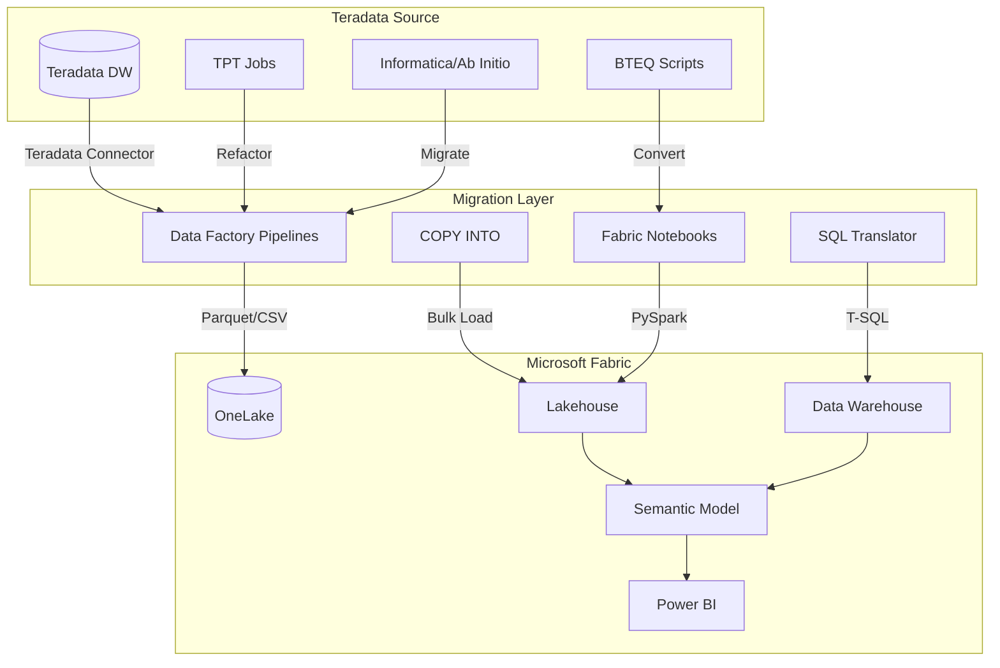
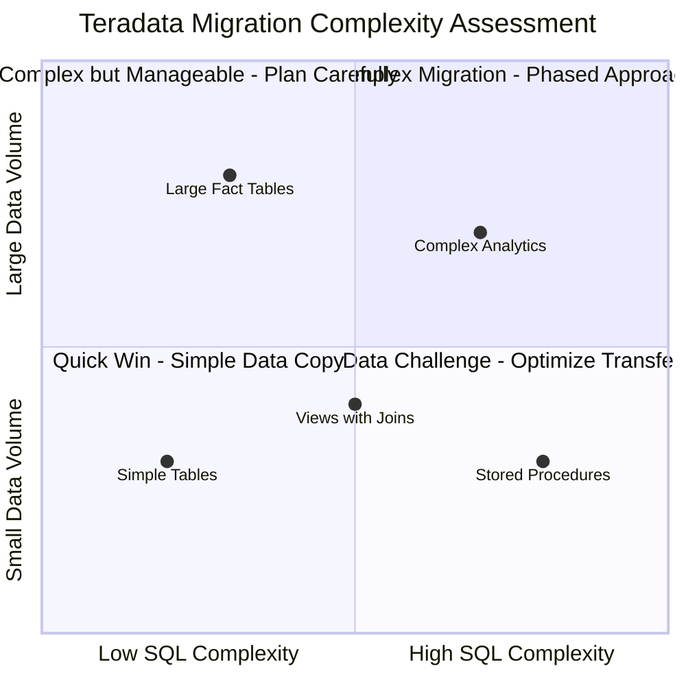
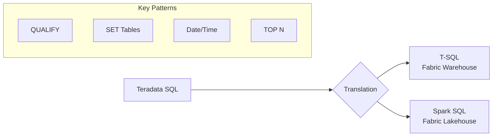
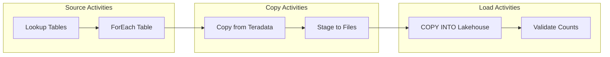
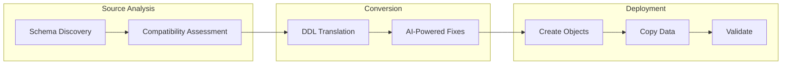
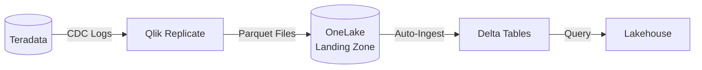
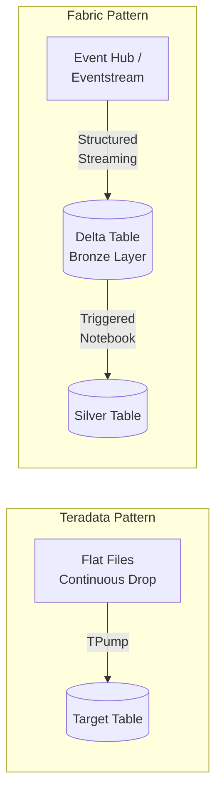
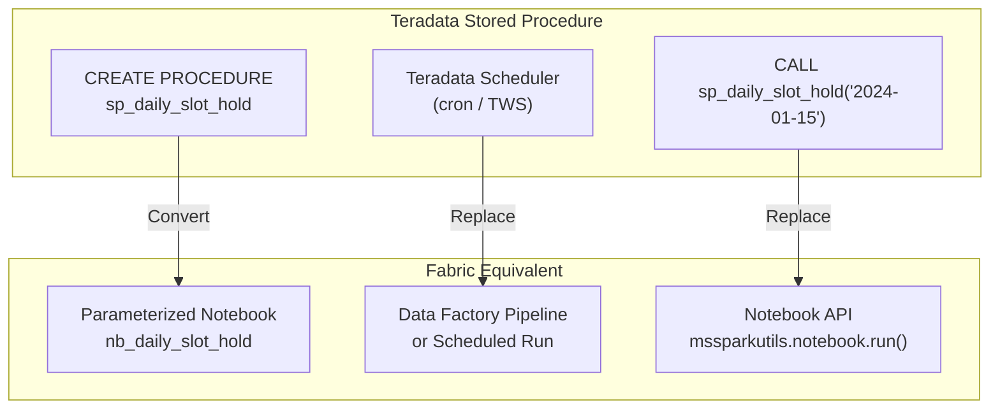

# 🔄 Tutorial 10: Teradata to Microsoft Fabric Migration

> **Last Updated**: 2026-04-15 | **Version**: 2.0
> **Status**: ✅ Final | **Maintainer**: Documentation Team

<div align="center">


</div>

> 🏠 **[Home](../../README.md)** > 📖 **[Tutorials](../README.md)** > 🔄 **Teradata Migration**

---

## 🔄 Tutorial 10: Teradata to Microsoft Fabric Migration

| | |
|---|---|
| **Difficulty** | ⭐⭐⭐ Advanced |
| **Time** | ⏱️ 120-180 minutes |
| **Focus** | Data Migration & Modernization |

---

### 📊 Progress Tracker

```
┌────────┬────────┬────────┬────────┬────────┬────────┬────────┬────────┬────────┬────────┬────────┬────────┐
│   00   │   01   │   02   │   03   │   04   │   05   │   06   │   07   │   08   │   09   │   10   │   11   │
│ SETUP  │ BRONZE │ SILVER │  GOLD  │  RT    │  PBI   │ PIPES  │  GOV   │ MIRROR │  AI/ML │TERADATA│  SAS   │
├────────┼────────┼────────┼────────┼────────┼────────┼────────┼────────┼────────┼────────┼────────┼────────┤
│   ✅   │   ✅   │   ✅   │   ✅   │   ✅   │   ✅   │   ✅   │   ✅   │   ✅   │   ✅   │  🔵   │   ⬚   │
└────────┴────────┴────────┴────────┴────────┴────────┴────────┴────────┴────────┴────────┴────────┴────────┘
                                                                                              ▲
                                                                                         YOU ARE HERE
```

| Navigation | |
|---|---|
| ⬅️ **Previous** | [09-Advanced AI/ML](../09-advanced-ai-ml/README.md) |
| ➡️ **Next** | [11-SAS Connectivity](../11-sas-connectivity/README.md) |

---

## 📖 Overview

This tutorial provides a comprehensive guide for migrating from **Teradata** data warehouse to **Microsoft Fabric**. You will learn migration strategies, SQL translation patterns, ETL conversion techniques, and best practices for a successful data warehouse modernization.

Teradata has been a leading enterprise data warehouse platform for decades. Microsoft Fabric provides a unified analytics platform that can serve as a modern replacement, offering:
- **Unified Data Lake** with OneLake and Delta Lake format
- **Lakehouse architecture** combining the best of data lakes and warehouses
- **Integrated analytics** from ingestion to Power BI reporting
- **Pay-per-use pricing** with capacity-based or consumption models

---

## 🎯 Learning Objectives

By the end of this tutorial, you will be able to:

- [ ] Understand Teradata to Fabric migration architecture
- [ ] Assess your Teradata workload for migration readiness
- [ ] Configure Teradata connectivity in Fabric Data Factory
- [ ] Translate Teradata SQL to Fabric T-SQL/Spark
- [ ] Migrate data using pipelines and COPY INTO
- [ ] Convert BTEQ scripts to Fabric notebooks
- [ ] Use Microsoft Migration Assistant for schema conversion
- [ ] Validate migrated data for accuracy
- [ ] Implement ongoing synchronization patterns
- [ ] Convert advanced BTEQ patterns (MultiLoad, TPump, error handling)
- [ ] Benchmark and optimize query performance after migration
- [ ] Map Teradata data types to Fabric Warehouse and Lakehouse types
- [ ] Migrate Teradata stored procedures to parameterized notebooks

---

## 🏗️ Migration Architecture Overview



### Migration Approaches

| Approach | Description | Best For |
|----------|-------------|----------|
| **Lift and Shift** | Direct data copy with minimal changes | Quick migrations, testing |
| **Refactor** | Modernize SQL and processes | Long-term value, optimization |
| **Replatform** | Use Fabric-native features | Maximum Fabric benefits |
| **Hybrid** | Keep some data in Teradata | Phased migration |

---

## 📋 Prerequisites

Before starting this tutorial, ensure you have:

- [ ] Completed [Tutorial 00: Environment Setup](../00-environment-setup/README.md)
- [ ] Completed [Tutorials 01-03: Medallion Architecture](../01-bronze-layer/README.md)
- [ ] Fabric workspace with F64+ capacity (recommended for large migrations)
- [ ] Access to source Teradata environment
- [ ] Teradata user with SELECT privileges on migration scope
- [ ] Network connectivity between Fabric and Teradata (VPN/ExpressRoute for on-premises)
- [ ] [Teradata JDBC Driver](https://downloads.teradata.com/download/connectivity/jdbc-driver) (for custom tooling)

> 💡 **Tip:** For testing without a Teradata instance, you can use sample Teradata DDL scripts and synthetic data to practice SQL translation patterns.

---

## 🛠️ Step 1: Assess Your Teradata Environment

### 1.1 Inventory Assessment

Create a comprehensive inventory of objects to migrate:

```sql
-- Teradata: List all databases and sizes
SELECT
    DatabaseName,
    SUM(CurrentPerm) / 1024 / 1024 / 1024 AS SizeGB,
    COUNT(DISTINCT TableName) AS TableCount
FROM DBC.TableSizeV
WHERE DatabaseName NOT IN ('DBC', 'SYSLIB', 'SYSSPATIAL', 'TD_SYSFNLIB')
GROUP BY DatabaseName
ORDER BY SizeGB DESC;

-- List all tables with row counts
SELECT
    DatabaseName,
    TableName,
    TableKind,
    RowCount,
    CurrentPerm / 1024 / 1024 AS SizeMB
FROM DBC.TablesV t
LEFT JOIN DBC.TableSizeV s
    ON t.DatabaseName = s.DatabaseName
    AND t.TableName = s.TableName
WHERE t.DatabaseName = 'YOUR_DATABASE'
ORDER BY SizeMB DESC;
```

### 1.2 Identify Migration Complexity

| Complexity Factor | Assessment Query | Impact |
|-------------------|------------------|--------|
| **SET Tables** | Count tables using SET (unique rows only) | Requires DISTINCT handling |
| **MULTISET Tables** | Count MULTISET tables | Direct migration |
| **Primary Index** | Identify PI columns | Rethink distribution |
| **Partitioning** | Check partition expressions | Map to Fabric partitioning |
| **Stored Procedures** | Count procedures and UDFs | Manual conversion |
| **Views** | Catalog view dependencies | SQL translation |
| **BTEQ Scripts** | Inventory automation scripts | Notebook conversion |

```sql
-- Count SET vs MULTISET tables
SELECT
    TableKind,
    CASE WHEN TableKind = 'T' THEN 'Standard Table'
         WHEN TableKind = 'O' THEN 'SET Table (No Duplicates)'
         WHEN TableKind = 'V' THEN 'View'
         ELSE 'Other' END AS TableType,
    COUNT(*) AS TableCount
FROM DBC.TablesV
WHERE DatabaseName = 'YOUR_DATABASE'
GROUP BY TableKind;

-- List stored procedures
SELECT
    DatabaseName,
    ProcedureName,
    CreateTimeStamp
FROM DBC.ProceduresV
WHERE DatabaseName = 'YOUR_DATABASE';
```

### 1.3 Complexity Scoring Matrix



---

## 🛠️ Step 2: Configure Teradata Connectivity in Fabric

### 2.1 Create Teradata Connection in Data Factory


*Source: [Create your first pipeline in Data Factory](https://learn.microsoft.com/en-us/fabric/data-factory/create-first-pipeline-with-sample-data)*

1. Open your Fabric workspace
2. Navigate to **Data Factory** > **Manage** > **Linked Services**
3. Click **+ New** > **Teradata**

### 2.2 Connection Configuration

| Setting | Description | Example |
|---------|-------------|---------|
| **Name** | Descriptive connection name | `ls_teradata_casino_dw` |
| **Server** | Teradata server hostname | `teradata.casino.com` |
| **Database** | Default database | `CASINO_DW` |
| **Authentication** | Auth method | `Basic` or `LDAP` |
| **Username** | Service account | `fabric_migration_user` |
| **Password** | Azure Key Vault reference | `@Microsoft.KeyVault(...)` |

### 2.3 Connection String Options

```json
{
    "name": "ls_teradata_casino_dw",
    "properties": {
        "type": "Teradata",
        "typeProperties": {
            "server": "teradata.casino.com",
            "authenticationType": "Basic",
            "username": "fabric_migration_user",
            "password": {
                "type": "AzureKeyVaultSecret",
                "store": {
                    "referenceName": "ls_keyvault",
                    "type": "LinkedServiceReference"
                },
                "secretName": "teradata-password"
            }
        },
        "connectVia": {
            "referenceName": "SelfHostedIR",
            "type": "IntegrationRuntimeReference"
        }
    }
}
```

> ⚠️ **Warning:** For on-premises Teradata, you must configure a Self-Hosted Integration Runtime. Install on a Windows server with network access to both Teradata and Azure.

### 2.4 Test Connection

```python
# Fabric Notebook: Test Teradata connectivity via Data Factory
from notebookutils import mssparkutils

# Test connection using Data Factory linked service
connection_result = mssparkutils.data.connect(
    linkedService="ls_teradata_casino_dw"
)
print(f"Connection Status: {connection_result}")
```

---

## 🛠️ Step 3: SQL Translation - Teradata to Fabric

### 3.1 Key SQL Differences

Teradata SQL is an ANSI SQL dialect with Teradata-specific extensions. Fabric supports T-SQL (for Warehouse) and Spark SQL (for Lakehouse).



### 3.2 QUALIFY Clause Translation

Teradata's `QUALIFY` clause filters window function results. Fabric requires a CTE approach.

**Teradata (Original):**
```sql
-- Get latest record per player using QUALIFY
SELECT
    player_id,
    session_timestamp,
    total_spend,
    loyalty_tier
FROM casino.player_sessions
QUALIFY ROW_NUMBER() OVER (
    PARTITION BY player_id
    ORDER BY session_timestamp DESC
) = 1;
```

**Fabric T-SQL (Converted):**
```sql
-- Use CTE with ROW_NUMBER and filter in WHERE
WITH ranked_sessions AS (
    SELECT
        player_id,
        session_timestamp,
        total_spend,
        loyalty_tier,
        ROW_NUMBER() OVER (
            PARTITION BY player_id
            ORDER BY session_timestamp DESC
        ) AS rn
    FROM casino.player_sessions
)
SELECT
    player_id,
    session_timestamp,
    total_spend,
    loyalty_tier
FROM ranked_sessions
WHERE rn = 1;
```

**Fabric Spark SQL (Alternative):**
```python
from pyspark.sql.functions import row_number, desc
from pyspark.sql.window import Window

df = spark.table("casino.player_sessions")

window_spec = Window.partitionBy("player_id").orderBy(desc("session_timestamp"))

df_latest = df.withColumn("rn", row_number().over(window_spec)) \
    .filter("rn = 1") \
    .drop("rn")
```

### 3.3 SET Table Migration (Duplicate Handling)

Teradata SET tables automatically eliminate duplicate rows. Fabric requires explicit handling.

**Teradata (Original):**
```sql
-- SET table - duplicates automatically rejected
CREATE SET TABLE casino.slot_events (
    event_id INTEGER,
    machine_id VARCHAR(50),
    event_type VARCHAR(20),
    event_timestamp TIMESTAMP
) PRIMARY INDEX (event_id);
```

**Fabric Options:**

**Option A: Add UNIQUE constraint (Warehouse)**
```sql
-- Fabric Warehouse with unique constraint
CREATE TABLE casino.slot_events (
    event_id INT NOT NULL,
    machine_id VARCHAR(50),
    event_type VARCHAR(20),
    event_timestamp DATETIME2,
    CONSTRAINT PK_slot_events PRIMARY KEY NONCLUSTERED (event_id)
);
```

**Option B: Deduplicate in pipeline/notebook (Lakehouse)**
```python
# PySpark: Remove duplicates during ingestion
df = spark.read.parquet("Files/raw/slot_events/")

# Remove exact duplicates
df_deduped = df.dropDuplicates()

# Or remove duplicates by key
df_deduped = df.dropDuplicates(["event_id"])

df_deduped.write.mode("overwrite").saveAsTable("casino.slot_events")
```

### 3.4 Date and Time Function Translation

| Teradata | Fabric T-SQL | Fabric Spark SQL |
|----------|--------------|------------------|
| `CURRENT_DATE` | `CAST(GETDATE() AS DATE)` | `current_date()` |
| `CURRENT_TIMESTAMP` | `GETDATE()` | `current_timestamp()` |
| `DATE '2024-01-15'` | `CAST('2024-01-15' AS DATE)` | `to_date('2024-01-15')` |
| `ADD_MONTHS(date, n)` | `DATEADD(MONTH, n, date)` | `add_months(date, n)` |
| `date + INTERVAL '7' DAY` | `DATEADD(DAY, 7, date)` | `date_add(date, 7)` |
| `EXTRACT(MONTH FROM date)` | `MONTH(date)` | `month(date)` |
| `date1 - date2` (days) | `DATEDIFF(DAY, date2, date1)` | `datediff(date1, date2)` |

### 3.5 TOP N and SAMPLE Translation

**Teradata (Original):**
```sql
-- Top 100 players by spend
SELECT TOP 100 WITH TIES
    player_id,
    SUM(total_spend) AS lifetime_spend
FROM casino.player_transactions
GROUP BY player_id
ORDER BY lifetime_spend DESC;

-- Random 1% sample
SELECT * FROM casino.large_table SAMPLE 0.01;
```

**Fabric T-SQL (Converted):**
```sql
-- TOP 100 WITH TIES equivalent using RANK
WITH ranked AS (
    SELECT
        player_id,
        SUM(total_spend) AS lifetime_spend,
        RANK() OVER (ORDER BY SUM(total_spend) DESC) AS rnk
    FROM casino.player_transactions
    GROUP BY player_id
)
SELECT player_id, lifetime_spend
FROM ranked
WHERE rnk <= 100;

-- TABLESAMPLE for random sampling
SELECT * FROM casino.large_table
TABLESAMPLE (1 PERCENT);
```

**Fabric Spark (Converted):**
```python
# Top 100 with ties
from pyspark.sql.functions import sum, rank
from pyspark.sql.window import Window

df = spark.table("casino.player_transactions")
df_agg = df.groupBy("player_id").agg(sum("total_spend").alias("lifetime_spend"))
window = Window.orderBy(desc("lifetime_spend"))
df_ranked = df_agg.withColumn("rnk", rank().over(window))
df_top = df_ranked.filter("rnk <= 100").drop("rnk")

# Random sample
df_sample = spark.table("casino.large_table").sample(0.01)
```

### 3.6 Common Function Mappings

| Teradata Function | Fabric T-SQL | Fabric Spark SQL |
|-------------------|--------------|------------------|
| `NVL(a, b)` | `ISNULL(a, b)` or `COALESCE(a, b)` | `coalesce(a, b)` |
| `NULLIFZERO(x)` | `NULLIF(x, 0)` | `nullif(x, 0)` |
| `ZEROIFNULL(x)` | `ISNULL(x, 0)` | `coalesce(x, 0)` |
| `TRIM(x)` | `TRIM(x)` | `trim(x)` |
| `SUBSTR(s, start, len)` | `SUBSTRING(s, start, len)` | `substring(s, start, len)` |
| `INDEX(s, pattern)` | `CHARINDEX(pattern, s)` | `locate(pattern, s)` |
| `OREPLACE(s, old, new)` | `REPLACE(s, old, new)` | `replace(s, old, new)` |
| `CAST(x AS FORMAT 'YYYY-MM-DD')` | `FORMAT(x, 'yyyy-MM-dd')` | `date_format(x, 'yyyy-MM-dd')` |

---

## 🛠️ Step 4: Migrate Data Using Data Factory Pipelines

### 4.1 Create Migration Pipeline


*Source: [Copy activity in Data Factory](https://learn.microsoft.com/en-us/fabric/data-factory/copy-data-activity)*



### 4.2 Pipeline JSON Definition

```json
{
    "name": "pl_teradata_migration_full",
    "properties": {
        "activities": [
            {
                "name": "Get Tables to Migrate",
                "type": "Lookup",
                "typeProperties": {
                    "source": {
                        "type": "TeradataSource",
                        "query": "SELECT DatabaseName, TableName FROM DBC.TablesV WHERE DatabaseName = 'CASINO_DW' AND TableKind = 'T'"
                    },
                    "dataset": {
                        "referenceName": "ds_teradata_query",
                        "type": "DatasetReference"
                    },
                    "firstRowOnly": false
                }
            },
            {
                "name": "ForEach Table",
                "type": "ForEach",
                "typeProperties": {
                    "items": {
                        "value": "@activity('Get Tables to Migrate').output.value",
                        "type": "Expression"
                    },
                    "isSequential": false,
                    "batchCount": 4,
                    "activities": [
                        {
                            "name": "Copy Table to Lakehouse",
                            "type": "Copy",
                            "typeProperties": {
                                "source": {
                                    "type": "TeradataSource",
                                    "query": {
                                        "value": "SELECT * FROM @{item().DatabaseName}.@{item().TableName}",
                                        "type": "Expression"
                                    }
                                },
                                "sink": {
                                    "type": "ParquetSink",
                                    "storeSettings": {
                                        "type": "AzureBlobFSWriteSettings"
                                    }
                                }
                            }
                        }
                    ]
                }
            }
        ]
    }
}
```

### 4.3 Incremental Migration Pattern

For large tables, use watermark-based incremental loads:

```python
# Fabric Notebook: Incremental Teradata Migration
from pyspark.sql import SparkSession
from pyspark.sql.functions import max as spark_max
from datetime import datetime

# Configuration
teradata_table = "CASINO_DW.SLOT_TRANSACTIONS"
fabric_table = "bronze.slot_transactions"
watermark_column = "transaction_timestamp"

# Get current watermark from Fabric
try:
    current_watermark = spark.table(fabric_table) \
        .select(spark_max(watermark_column)) \
        .collect()[0][0]
except:
    current_watermark = datetime(2020, 1, 1)  # Default start

print(f"Current watermark: {current_watermark}")

# Read incremental data from Teradata
query = f"""
SELECT * FROM {teradata_table}
WHERE {watermark_column} > TIMESTAMP '{current_watermark}'
ORDER BY {watermark_column}
"""

# Use JDBC connection (requires Teradata JDBC driver)
df_incremental = spark.read \
    .format("jdbc") \
    .option("url", "jdbc:teradata://teradata.casino.com/CASINO_DW") \
    .option("dbtable", f"({query}) AS subq") \
    .option("user", mssparkutils.credentials.getSecret("keyvault", "teradata-user")) \
    .option("password", mssparkutils.credentials.getSecret("keyvault", "teradata-password")) \
    .option("driver", "com.teradata.jdbc.TeraDriver") \
    .load()

# Append to Fabric table
row_count = df_incremental.count()
print(f"Rows to migrate: {row_count}")

if row_count > 0:
    df_incremental.write.mode("append").saveAsTable(fabric_table)
    print(f"Successfully migrated {row_count} rows")
```

### 4.4 Large Table Migration with Partitioning

```python
# Fabric Notebook: Partitioned Large Table Migration
from pyspark.sql.functions import col, year, month

# Configuration
teradata_table = "CASINO_DW.SLOT_TRANSACTIONS_HISTORY"
fabric_table = "bronze.slot_transactions_history"
partition_column = "transaction_date"

# Read with partition pruning
df = spark.read \
    .format("jdbc") \
    .option("url", "jdbc:teradata://teradata.casino.com/CASINO_DW") \
    .option("dbtable", teradata_table) \
    .option("user", dbutils.secrets.get("keyvault", "teradata-user")) \
    .option("password", dbutils.secrets.get("keyvault", "teradata-password")) \
    .option("partitionColumn", partition_column) \
    .option("lowerBound", "2020-01-01") \
    .option("upperBound", "2024-12-31") \
    .option("numPartitions", 48) \
    .option("fetchsize", 100000) \
    .load()

# Write with Fabric partitioning
df.write \
    .mode("overwrite") \
    .partitionBy("transaction_year", "transaction_month") \
    .format("delta") \
    .saveAsTable(fabric_table)

# Optimize the table
spark.sql(f"OPTIMIZE {fabric_table}")
```

---

## 🛠️ Step 5: Convert BTEQ Scripts to Fabric Notebooks

### 5.1 BTEQ to Notebook Mapping

| BTEQ Command | Fabric Notebook Equivalent |
|--------------|---------------------------|
| `.LOGON` | Spark JDBC connection or linked service |
| `.SET` variables | Notebook parameters or Python variables |
| `.EXPORT` | `df.write.csv()` or `df.write.parquet()` |
| `.IMPORT` | `spark.read.csv()` or COPY INTO |
| `.RUN FILE` | `%run` magic or modular notebooks |
| `.IF` / `.THEN` / `.ELSE` | Python if/else statements |
| `.REPEAT` | Python for loops |
| SQL statements | `spark.sql()` or DataFrame API |

### 5.2 BTEQ Script Conversion Example

**Original BTEQ Script:**
```sql
.LOGON teradata.casino.com/fabric_user,password
.SET WIDTH 65531

-- Daily slot summary extraction
SELECT
    CAST(transaction_date AS DATE) AS report_date,
    machine_id,
    COUNT(*) AS spin_count,
    SUM(coin_in) AS total_coin_in,
    SUM(coin_out) AS total_coin_out
FROM CASINO_DW.SLOT_TRANSACTIONS
WHERE transaction_date = CURRENT_DATE - 1
GROUP BY 1, 2
ORDER BY total_coin_in DESC;

.EXPORT DATA FILE=/data/exports/daily_slots.csv
SELECT * FROM tmp_daily_slots;

.LOGOFF
```

**Converted Fabric Notebook:**
```python
# Cell 1: Configuration
# ====================
from datetime import datetime, timedelta
from pyspark.sql.functions import col, count, sum as spark_sum

# Parameters
report_date = (datetime.now() - timedelta(days=1)).strftime('%Y-%m-%d')
export_path = f"Files/exports/daily_slots_{report_date}.csv"

print(f"Processing report for: {report_date}")

# Cell 2: Read Source Data
# ========================
# Option A: Read from already-migrated Lakehouse table
df_transactions = spark.table("bronze.slot_transactions")

# Option B: Read directly from Teradata (if still connected)
# df_transactions = spark.read.format("jdbc").option(...).load()

# Cell 3: Transform - Daily Slot Summary
# ======================================
df_daily_summary = df_transactions \
    .filter(col("transaction_date") == report_date) \
    .groupBy("machine_id") \
    .agg(
        count("*").alias("spin_count"),
        spark_sum("coin_in").alias("total_coin_in"),
        spark_sum("coin_out").alias("total_coin_out")
    ) \
    .withColumn("report_date", lit(report_date)) \
    .orderBy(col("total_coin_in").desc())

# Cell 4: Export to CSV
# =====================
df_daily_summary.coalesce(1) \
    .write \
    .mode("overwrite") \
    .option("header", "true") \
    .csv(export_path)

print(f"Exported {df_daily_summary.count()} rows to {export_path}")

# Cell 5: Save to Silver Layer
# ============================
df_daily_summary.write \
    .mode("append") \
    .saveAsTable("silver.daily_slot_summary")
```

### 5.3 BTEQ Export/Import Pattern Conversion

**BTEQ FastLoad Pattern:**
```sql
.LOGTABLE CASINO_DW.FL_LOG;
.LOGON teradata.casino.com/user,pwd;
.BEGIN LOADING CASINO_DW.LARGE_TABLE;

DEFINE
    col1 (VARCHAR(50)),
    col2 (INTEGER),
    col3 (DECIMAL(18,2))
FILE=/data/import/large_file.csv;

INSERT INTO CASINO_DW.LARGE_TABLE VALUES (:col1, :col2, :col3);

.END LOADING;
.LOGOFF;
```

**Fabric COPY INTO Equivalent:**
```sql
-- Fabric Warehouse: COPY INTO for high-performance bulk load
COPY INTO casino.large_table
FROM 'https://onelake.dfs.fabric.microsoft.com/workspace/lakehouse/Files/import/large_file.csv'
WITH (
    FILE_TYPE = 'CSV',
    FIRSTROW = 2,
    FIELDTERMINATOR = ',',
    ROWTERMINATOR = '\n',
    ENCODING = 'UTF8',
    MAXERRORS = 0
);
```

---

## 🛠️ Step 6: Use Microsoft Migration Assistant

### 6.1 Fabric Migration Assistant Overview


*Source: [Migration assistant for Fabric data warehouse](https://learn.microsoft.com/en-us/fabric/data-warehouse/migration-assistant)*

The **Fabric Migration Assistant** is a native tool for automating schema and data migration.



### 6.2 Supported Migration Sources

| Source | Native Support | Notes |
|--------|---------------|-------|
| **Azure Synapse Dedicated SQL Pool** | ✅ Full support | Schema + Data |
| **SQL Server** | ✅ Full support | OLAP workloads |
| **Teradata** | 🔶 Via third-party | See partner tools |
| **Snowflake** | 🔶 Via connectors | Data Factory |
| **Oracle** | 🔶 Via third-party | Partner solutions |

### 6.3 Third-Party Migration Tools for Teradata

#### Datometry (Network-Level Translation)

Datometry provides real-time SQL translation at the network layer, allowing Teradata applications to run on Fabric without code changes.

| Feature | Capability |
|---------|------------|
| **SQL Translation** | Automatic Teradata-to-T-SQL conversion |
| **Application Compatibility** | Existing apps work without modification |
| **Performance** | Query optimization for Fabric |
| **Migration Speed** | Up to 90% faster migrations |

#### Raven (Datametica/Onix)

Raven automates code conversion for SQL, ETL, and stored procedures.

| Feature | Capability |
|---------|------------|
| **SQL Conversion** | Teradata to Spark SQL / T-SQL |
| **ETL Migration** | Informatica/Ab Initio to Data Factory |
| **Stored Procedures** | Convert to notebooks/procedures |
| **Validation** | Automated testing framework |

#### X2X Suite (Travinto)

| Tool | Purpose |
|------|---------|
| **X2XConverter** | Automated code conversion |
| **X2XAnalyzer** | Assess migration complexity |
| **X2XValidator** | Post-migration validation |

---

## 🛠️ Step 7: Validate Migrated Data


*Source: [What is a lakehouse in Microsoft Fabric?](https://learn.microsoft.com/en-us/fabric/data-engineering/lakehouse-overview)*

### 7.1 Row Count Validation

```python
# Fabric Notebook: Row Count Validation
from pyspark.sql import SparkSession
import pandas as pd

# Tables to validate
validation_tables = [
    ("CASINO_DW.SLOT_TRANSACTIONS", "bronze.slot_transactions"),
    ("CASINO_DW.PLAYER_SESSIONS", "bronze.player_sessions"),
    ("CASINO_DW.CAGE_OPERATIONS", "bronze.cage_operations"),
]

results = []

for teradata_table, fabric_table in validation_tables:
    # Get Fabric count
    fabric_count = spark.table(fabric_table).count()

    # Get Teradata count (via JDBC)
    teradata_count_df = spark.read \
        .format("jdbc") \
        .option("url", "jdbc:teradata://teradata.casino.com/CASINO_DW") \
        .option("query", f"SELECT COUNT(*) AS cnt FROM {teradata_table}") \
        .load()
    teradata_count = teradata_count_df.collect()[0]["cnt"]

    # Calculate difference
    diff = abs(teradata_count - fabric_count)
    diff_pct = (diff / teradata_count * 100) if teradata_count > 0 else 0
    status = "✅ PASS" if diff_pct < 0.01 else "❌ FAIL"

    results.append({
        "Source Table": teradata_table,
        "Target Table": fabric_table,
        "Source Count": teradata_count,
        "Target Count": fabric_count,
        "Difference": diff,
        "Diff %": f"{diff_pct:.4f}%",
        "Status": status
    })

# Display results
df_results = pd.DataFrame(results)
display(df_results)
```

### 7.2 Data Checksum Validation

```python
# Fabric Notebook: Checksum Validation
from pyspark.sql.functions import sum as spark_sum, count, md5, concat_ws

def calculate_table_checksum(df, key_columns, numeric_columns):
    """Calculate a checksum for data validation."""
    return df.agg(
        count("*").alias("row_count"),
        *[spark_sum(col).alias(f"sum_{col}") for col in numeric_columns]
    ).collect()[0]

# Compare slot_transactions
df_fabric = spark.table("bronze.slot_transactions")
fabric_checksum = calculate_table_checksum(
    df_fabric,
    key_columns=["transaction_id"],
    numeric_columns=["coin_in", "coin_out", "jackpot_contribution"]
)

print("Fabric Checksum:")
print(f"  Row Count: {fabric_checksum['row_count']:,}")
print(f"  Sum Coin In: ${fabric_checksum['sum_coin_in']:,.2f}")
print(f"  Sum Coin Out: ${fabric_checksum['sum_coin_out']:,.2f}")

# Compare against Teradata (run equivalent query on source)
```

### 7.3 Sample Data Comparison

```python
# Fabric Notebook: Sample Row Comparison
from pyspark.sql.functions import col

# Get sample records from Fabric
df_fabric_sample = spark.table("bronze.slot_transactions") \
    .filter(col("transaction_date") == "2024-01-15") \
    .limit(100) \
    .toPandas()

# Get same sample from Teradata
query = """
SELECT * FROM CASINO_DW.SLOT_TRANSACTIONS
WHERE transaction_date = DATE '2024-01-15'
SAMPLE 100
"""
df_teradata_sample = spark.read.format("jdbc") \
    .option("query", query) \
    .load() \
    .toPandas()

# Compare schemas
print("Schema Comparison:")
print(f"Fabric columns: {list(df_fabric_sample.columns)}")
print(f"Teradata columns: {list(df_teradata_sample.columns)}")

# Merge and compare (on key column)
comparison = df_fabric_sample.merge(
    df_teradata_sample,
    on="transaction_id",
    how="outer",
    suffixes=("_fabric", "_teradata"),
    indicator=True
)

print(f"\nMatching records: {len(comparison[comparison['_merge'] == 'both'])}")
print(f"Fabric only: {len(comparison[comparison['_merge'] == 'left_only'])}")
print(f"Teradata only: {len(comparison[comparison['_merge'] == 'right_only'])}")
```

---

## 🛠️ Step 8: Ongoing Synchronization Options

### 8.1 Synchronization Patterns

| Pattern | Latency | Use Case | Implementation |
|---------|---------|----------|----------------|
| **One-time Migration** | N/A | Cutover | Data Factory full copy |
| **Daily Batch** | 24 hours | Reporting | Scheduled pipeline |
| **Hourly Incremental** | 1 hour | Near real-time | Watermark-based |
| **Real-time CDC** | Minutes | Live analytics | Open Mirroring + Qlik |

### 8.2 Open Mirroring with Qlik Replicate

For real-time Teradata replication to Fabric:



**Configuration Steps:**
1. Install Qlik Replicate with Teradata source connector
2. Configure OneLake as target (Open Mirroring landing zone)
3. Map Teradata schemas to Fabric tables
4. Enable CDC capture on Teradata tables
5. Start replication task

> 💡 **Tip:** Qlik Replicate supports 40+ heterogeneous sources including Teradata, providing a unified CDC solution for complex environments.

---

## 🛠️ Step 9: Advanced BTEQ Conversion Scripts

Step 5 covered basic BTEQ-to-notebook conversion. This section tackles three advanced Teradata loading patterns frequently found in casino data warehouses: MultiLoad merges, TPump continuous feeds, and error-handling scripts.

### 9.1 MultiLoad Pattern → Delta Lake MERGE

Teradata MultiLoad performs upsert operations against large tables. The Fabric equivalent uses Delta Lake `MERGE INTO` inside a notebook.

**Original BTEQ MultiLoad Script:**
```sql
.LOGTABLE CASINO_DW.ML_LOG;
.LOGON teradata.casino.com/etl_user,password;

.BEGIN MLOAD TABLES CASINO_DW.PLAYER_LOYALTY_ACCOUNTS;

-- Apply table (staging)
.LAYOUT player_update;
.FIELD player_id      * VARCHAR(20);
.FIELD loyalty_points * INTEGER;
.FIELD tier_status    * VARCHAR(10);
.FIELD last_visit     * TIMESTAMP;

.DML LABEL upd_existing;
UPDATE CASINO_DW.PLAYER_LOYALTY_ACCOUNTS
SET loyalty_points = :loyalty_points,
    tier_status    = :tier_status,
    last_visit     = :last_visit
WHERE player_id = :player_id;

.DML LABEL ins_new;
INSERT INTO CASINO_DW.PLAYER_LOYALTY_ACCOUNTS
VALUES (:player_id, :loyalty_points, :tier_status, :last_visit);

.IMPORT INFILE /data/feeds/loyalty_daily_update.csv
LAYOUT player_update
APPLY upd_existing
APPLY ins_new;

.END MLOAD;
.LOGOFF;
```

**Converted Fabric Notebook (Delta Lake MERGE):**
```python
# Cell 1: Configuration
# ====================
from pyspark.sql.functions import col, current_timestamp
from delta.tables import DeltaTable

staging_path = "Files/feeds/loyalty_daily_update.csv"
target_table = "silver.player_loyalty_accounts"

# Cell 2: Read staging data (replaces .IMPORT INFILE)
# ====================================================
df_updates = spark.read \
    .option("header", "true") \
    .option("inferSchema", "true") \
    .csv(staging_path) \
    .withColumn("_loaded_at", current_timestamp())

print(f"Staging records to merge: {df_updates.count():,}")

# Cell 3: Delta Lake MERGE (replaces MultiLoad DML)
# ==================================================
target = DeltaTable.forName(spark, target_table)

target.alias("tgt").merge(
    df_updates.alias("src"),
    "tgt.player_id = src.player_id"
).whenMatchedUpdate(set={
    "loyalty_points": "src.loyalty_points",
    "tier_status":    "src.tier_status",
    "last_visit":     "src.last_visit",
    "_loaded_at":     "src._loaded_at"
}).whenNotMatchedInsert(values={
    "player_id":      "src.player_id",
    "loyalty_points": "src.loyalty_points",
    "tier_status":    "src.tier_status",
    "last_visit":     "src.last_visit",
    "_loaded_at":     "src._loaded_at"
}).execute()

# Cell 4: Post-merge validation (replaces .LOGTABLE check)
# =========================================================
history = spark.sql(f"DESCRIBE HISTORY {target_table} LIMIT 1").collect()[0]
print(f"Operation: {history['operation']}")
print(f"Rows updated: {history['operationMetrics']['numTargetRowsUpdated']}")
print(f"Rows inserted: {history['operationMetrics']['numTargetRowsInserted']}")
```

### 9.2 TPump (Continuous Load) → Eventstreams + Structured Streaming

Teradata TPump provides continuous micro-batch loading for near-real-time data. The Fabric equivalent combines Eventstreams with Spark Structured Streaming.



**Original BTEQ TPump Script:**
```sql
.LOGON teradata.casino.com/etl_user,password;

.BEGIN LOAD SESSIONS 4
    TENACITY 4
    SLEEP 60
    PACK 2000;

.LAYOUT slot_events;
.FIELD machine_id     * VARCHAR(20);
.FIELD event_type     * VARCHAR(30);
.FIELD event_ts       * TIMESTAMP;
.FIELD coin_in        * DECIMAL(12,2);
.FIELD coin_out       * DECIMAL(12,2);

.DML LABEL ins_slot_event;
INSERT INTO CASINO_DW.SLOT_EVENTS_RT
VALUES (:machine_id, :event_type, :event_ts, :coin_in, :coin_out);

.IMPORT INFILE /data/realtime/slot_feed_*.csv
LAYOUT slot_events
APPLY ins_slot_event;

.END LOAD;
.LOGOFF;
```

**Converted Fabric Notebook (Structured Streaming):**
```python
# Cell 1: Configuration
# ====================
from pyspark.sql.functions import col, from_json, current_timestamp
from pyspark.sql.types import (
    StructType, StructField, StringType, TimestampType, DecimalType
)

# Eventstream connection (replaces TPump INFILE)
eh_connection_string = mssparkutils.credentials.getSecret(
    "keyvault", "slot-events-eventhub-conn"
)
target_table = "bronze.slot_events_rt"
checkpoint_path = "Files/_checkpoints/slot_events_rt"

# Cell 2: Define schema (replaces .LAYOUT)
# =========================================
slot_event_schema = StructType([
    StructField("machine_id", StringType(), False),
    StructField("event_type", StringType(), False),
    StructField("event_ts", TimestampType(), False),
    StructField("coin_in", DecimalType(12, 2), True),
    StructField("coin_out", DecimalType(12, 2), True)
])

# Cell 3: Structured Streaming (replaces TPump continuous load)
# =============================================================
df_stream = spark.readStream \
    .format("eventhubs") \
    .option("eventhubs.connectionString",
            sc._jvm.org.apache.spark.eventhubs.EventHubsUtils
            .encrypt(eh_connection_string)) \
    .option("eventhubs.startingPosition",
            '{"offset":"-1","seqNo":-1,"enqueuedTime":null,"isInclusive":true}') \
    .load()

# Parse JSON payload into typed columns
df_parsed = df_stream \
    .select(from_json(col("body").cast("string"), slot_event_schema).alias("data")) \
    .select("data.*") \
    .withColumn("_ingest_ts", current_timestamp())

# Cell 4: Write to Delta Lake (replaces INSERT DML)
# ==================================================
# Micro-batch append mirrors TPump SLEEP/PACK cadence
query = df_parsed.writeStream \
    .format("delta") \
    .outputMode("append") \
    .option("checkpointLocation", checkpoint_path) \
    .trigger(processingTime="60 seconds") \
    .toTable(target_table)

print(f"Streaming query started: {query.id}")
print(f"Processing every 60 seconds (equivalent to TPump SLEEP 60)")
```

### 9.3 BTEQ Error Handling (.IF ACTIVITYCOUNT) → Python try/except

Teradata BTEQ uses `.IF ACTIVITYCOUNT` and `.IF ERRORCODE` for flow control. The Fabric equivalent uses Python exception handling with explicit row count validation.

**Original BTEQ Script with Error Handling:**
```sql
.LOGON teradata.casino.com/etl_user,password;

-- Step 1: Load daily cage transactions into staging
DELETE FROM CASINO_DW.STG_CAGE_TRANSACTIONS;

.IF ERRORCODE <> 0 THEN .GOTO ERROR_EXIT;

INSERT INTO CASINO_DW.STG_CAGE_TRANSACTIONS
SELECT * FROM CASINO_DW.CAGE_TRANSACTIONS_RAW
WHERE transaction_date = CURRENT_DATE - 1;

.IF ACTIVITYCOUNT = 0 THEN .GOTO NO_DATA_EXIT;

-- Step 2: Apply CTR flagging (>$10,000)
UPDATE CASINO_DW.STG_CAGE_TRANSACTIONS
SET ctr_flag = 'Y'
WHERE transaction_amount >= 10000;

.IF ERRORCODE <> 0 THEN .GOTO ERROR_EXIT;

-- Step 3: Move to production
INSERT INTO CASINO_DW.CAGE_TRANSACTIONS_DAILY
SELECT * FROM CASINO_DW.STG_CAGE_TRANSACTIONS;

.IF ACTIVITYCOUNT <> (SELECT COUNT(*) FROM CASINO_DW.STG_CAGE_TRANSACTIONS)
THEN .GOTO COUNT_MISMATCH;

.LOGOFF;
.QUIT 0;

.LABEL ERROR_EXIT;
.LOGOFF;
.QUIT 8;

.LABEL NO_DATA_EXIT;
.LOGOFF;
.QUIT 4;

.LABEL COUNT_MISMATCH;
.LOGOFF;
.QUIT 12;
```

**Converted Fabric Notebook (Python try/except):**
```python
# Cell 1: Configuration
# ====================
from pyspark.sql.functions import col, lit, current_timestamp, when
from datetime import datetime, timedelta
import sys

report_date = (datetime.now() - timedelta(days=1)).strftime("%Y-%m-%d")
staging_table = "bronze.stg_cage_transactions"
target_table = "silver.cage_transactions_daily"
ctr_threshold = 10000

exit_code = 0  # Mirrors .QUIT return codes

# Cell 2: Step 1 - Load staging (replaces DELETE + INSERT + .IF ACTIVITYCOUNT)
# =============================================================================
try:
    # Clear staging (replaces DELETE FROM)
    spark.sql(f"TRUNCATE TABLE {staging_table}")

    # Load from raw
    df_raw = spark.table("bronze.cage_transactions_raw") \
        .filter(col("transaction_date") == report_date)

    staging_count = df_raw.count()

    if staging_count == 0:
        print(f"WARNING: No data found for {report_date}")
        exit_code = 4  # Mirrors .QUIT 4 (NO_DATA_EXIT)
        dbutils.notebook.exit(f"NO_DATA|exit_code={exit_code}")

    df_raw.write.mode("overwrite").saveAsTable(staging_table)
    print(f"Step 1 PASS: {staging_count:,} rows loaded to staging")

except Exception as e:
    print(f"Step 1 FAIL: {str(e)}")
    exit_code = 8  # Mirrors .QUIT 8 (ERROR_EXIT)
    raise

# Cell 3: Step 2 - CTR flagging (replaces UPDATE + .IF ERRORCODE)
# ================================================================
try:
    spark.sql(f"""
        UPDATE {staging_table}
        SET ctr_flag = 'Y'
        WHERE transaction_amount >= {ctr_threshold}
    """)

    ctr_count = spark.table(staging_table) \
        .filter(col("ctr_flag") == "Y").count()
    print(f"Step 2 PASS: {ctr_count:,} transactions flagged for CTR")

except Exception as e:
    print(f"Step 2 FAIL: {str(e)}")
    exit_code = 8
    raise

# Cell 4: Step 3 - Move to production (replaces INSERT + .IF ACTIVITYCOUNT check)
# =================================================================================
try:
    df_staging = spark.table(staging_table)
    pre_count = df_staging.count()

    df_staging.write.mode("append").saveAsTable(target_table)

    # Validate row count (replaces .IF ACTIVITYCOUNT <> SELECT COUNT)
    post_count = spark.table(target_table) \
        .filter(col("transaction_date") == report_date).count()

    if post_count != pre_count:
        print(f"Step 3 FAIL: Count mismatch - staging={pre_count:,}, target={post_count:,}")
        exit_code = 12  # Mirrors .QUIT 12 (COUNT_MISMATCH)
        raise ValueError(f"Row count mismatch: {pre_count} vs {post_count}")

    print(f"Step 3 PASS: {post_count:,} rows written to {target_table}")
    print(f"Pipeline completed successfully (exit_code={exit_code})")

except ValueError:
    raise
except Exception as e:
    print(f"Step 3 FAIL: {str(e)}")
    exit_code = 8
    raise
```

> 💡 **Tip:** Map BTEQ exit codes to notebook exit values so downstream pipeline activities can branch on success/failure just as legacy BTEQ schedulers did.

---

## 🛠️ Step 10: Performance Benchmarks

After migrating from Teradata to Microsoft Fabric, validating query performance is critical. This section provides benchmark patterns and optimization strategies for common casino analytics queries.

### 10.1 Query Performance Comparison

The following table shows representative benchmarks for a 500 million-row `slot_transactions` fact table. Teradata numbers assume a 10-node system; Fabric numbers use an F64 capacity with V-ORDER enabled.

| Query Pattern | Example | Teradata (10-node) | Fabric Lakehouse (F64) | Fabric Warehouse (F64) | Notes |
|---------------|---------|--------------------:|----------------------:|----------------------:|-------|
| **Point lookup (indexed)** | Single transaction by ID | 0.3 s | 0.8 s | 0.4 s | Teradata PI advantage; Fabric improves with Z-ORDER |
| **Full scan + aggregation** | Daily revenue across all machines | 12 s | 9 s | 11 s | Fabric columnar + V-ORDER excels |
| **Complex join + window** | Player lifetime value with ranking | 45 s | 28 s | 35 s | Spark scales well with window functions |
| **QUALIFY-equivalent** | Latest session per player | 18 s | 14 s | 16 s | CTE approach in Fabric is efficient |
| **Time-series rollup** | Hourly coin-in aggregation, 90 days | 22 s | 10 s | 15 s | Delta Lake partition pruning is very effective |
| **Ad-hoc with LIKE** | Search player notes by keyword | 8 s | 6 s | 5 s | Fabric predicate pushdown on string columns |

> ⚠️ **Note:** Actual performance varies with data distribution, cluster load, and query complexity. Always benchmark with your own data.

### 10.2 Benchmark Query Examples

**Point Lookup:**
```sql
-- Fabric Warehouse: Single transaction lookup
SELECT transaction_id, machine_id, coin_in, coin_out, transaction_timestamp
FROM casino.slot_transactions
WHERE transaction_id = 'TXN-2024-00438271';
```

**Full Scan + Aggregation:**
```sql
-- Fabric Warehouse: Daily revenue summary
SELECT
    CAST(transaction_timestamp AS DATE) AS report_date,
    COUNT(*) AS total_spins,
    SUM(coin_in) AS total_coin_in,
    SUM(coin_out) AS total_coin_out,
    SUM(coin_in) - SUM(coin_out) AS net_revenue
FROM casino.slot_transactions
WHERE transaction_timestamp >= DATEADD(DAY, -30, GETDATE())
GROUP BY CAST(transaction_timestamp AS DATE)
ORDER BY report_date;
```

**Complex Join + Window Function:**
```python
# Fabric Spark: Player lifetime value with tier ranking
from pyspark.sql.functions import sum as spark_sum, count, datediff, \
    current_date, dense_rank, col
from pyspark.sql.window import Window

df_players = spark.table("silver.player_profiles")
df_txns = spark.table("silver.slot_transactions")

df_ltv = df_txns.groupBy("player_id").agg(
    spark_sum("coin_in").alias("lifetime_coin_in"),
    spark_sum("coin_out").alias("lifetime_coin_out"),
    count("*").alias("total_sessions"),
    spark_sum(col("coin_in") - col("coin_out")).alias("lifetime_net_revenue")
)

# Rank players by net revenue (replaces Teradata QUALIFY with DENSE_RANK)
window_spec = Window.orderBy(col("lifetime_net_revenue").desc())
df_ranked = df_ltv.withColumn("revenue_rank", dense_rank().over(window_spec))

df_result = df_ranked.join(df_players, "player_id") \
    .select("player_id", "player_name", "loyalty_tier",
            "lifetime_coin_in", "lifetime_net_revenue", "revenue_rank")

display(df_result.filter("revenue_rank <= 100"))
```

**Time-Series Rollup:**
```sql
-- Fabric Warehouse: Hourly coin-in rollup for floor monitoring
SELECT
    CAST(transaction_timestamp AS DATE) AS txn_date,
    DATEPART(HOUR, transaction_timestamp) AS txn_hour,
    zone_id,
    COUNT(*) AS spin_count,
    SUM(coin_in) AS hourly_coin_in,
    AVG(coin_in) AS avg_bet_size
FROM casino.slot_transactions
WHERE transaction_timestamp >= DATEADD(DAY, -90, GETDATE())
GROUP BY
    CAST(transaction_timestamp AS DATE),
    DATEPART(HOUR, transaction_timestamp),
    zone_id
ORDER BY txn_date, txn_hour, zone_id;
```

### 10.3 Optimization Recommendations

| Optimization | When to Use | Fabric Command | Impact |
|-------------|-------------|----------------|--------|
| **Z-ORDER** | Point lookups and filtered scans on known columns | `OPTIMIZE table ZORDER BY (col)` | 2-10x faster lookups |
| **Partition pruning** | Date-partitioned fact tables with time-range filters | Partition by `transaction_year`, `transaction_month` | Skips irrelevant files entirely |
| **Predicate pushdown** | Filters pushed to storage layer before read | Automatic with Delta Lake; ensure filters are in WHERE | Reduces I/O dramatically |
| **V-ORDER** | Direct Lake semantic models over large tables | Enabled by default in Fabric; verify with table properties | Optimal for Power BI scans |
| **OPTIMIZE (bin-compaction)** | After heavy append workloads (post-migration) | `OPTIMIZE table` | Reduces small file overhead |
| **Caching** | Repeated interactive queries on same dataset | `spark.catalog.cacheTable("table")` | Near-instant repeated queries |

**Apply Z-ORDER after migration:**
```sql
-- Optimize the slot_transactions table for common query patterns
OPTIMIZE casino.slot_transactions
ZORDER BY (machine_id, transaction_timestamp);

-- Verify optimization
DESCRIBE DETAIL casino.slot_transactions;
```

**V-ORDER for Direct Lake:**

V-ORDER is a write-time optimization that sorts data within Parquet row groups for maximum scan performance in Direct Lake mode. Fabric applies V-ORDER by default, but you can verify and force rewrite if migrated data was loaded without it.

```python
# Force V-ORDER rewrite on a migrated table
df = spark.table("gold.daily_slot_summary")
df.write \
    .mode("overwrite") \
    .option("vorder", "true") \
    .format("delta") \
    .saveAsTable("gold.daily_slot_summary")

print("V-ORDER rewrite complete - Direct Lake scans optimized")
```

---

## 🛠️ Step 11: Data Type Mapping Reference

When converting Teradata DDL to Fabric, data type mapping is one of the most error-prone steps. This reference covers every common Teradata type and its Fabric equivalents.

### 11.1 Numeric Types

| Teradata Type | Range / Precision | Fabric Warehouse (T-SQL) | Fabric Lakehouse (Spark) | Notes |
|--------------|-------------------|--------------------------|--------------------------|-------|
| `BYTEINT` | -128 to 127 | `TINYINT` | `ByteType` | T-SQL TINYINT is unsigned (0-255); add CHECK constraint if negative values exist |
| `SMALLINT` | -32,768 to 32,767 | `SMALLINT` | `ShortType` | Direct mapping |
| `INTEGER` | -2.1B to 2.1B | `INT` | `IntegerType` | Direct mapping |
| `BIGINT` | -9.2E18 to 9.2E18 | `BIGINT` | `LongType` | Direct mapping |
| `DECIMAL(p,s)` / `NUMERIC(p,s)` | Up to (38,38) | `DECIMAL(p,s)` | `DecimalType(p,s)` | Direct mapping; always preserve precision for financial amounts (coin_in, coin_out) |
| `FLOAT` / `REAL` | ~15 significant digits | `FLOAT` | `DoubleType` | Avoid for financial data; use DECIMAL instead |
| `NUMBER` | Flexible precision | `DECIMAL(38,18)` | `DecimalType(38,18)` | Teradata NUMBER has variable precision; choose an explicit scale for Fabric |

### 11.2 Character Types

| Teradata Type | Description | Fabric Warehouse (T-SQL) | Fabric Lakehouse (Spark) | Notes |
|--------------|-------------|--------------------------|--------------------------|-------|
| `CHAR(n)` | Fixed-length, up to 64,000 | `CHAR(n)` (max 8,000) | `StringType` | If n > 8,000 use `VARCHAR(MAX)` in Warehouse |
| `VARCHAR(n)` | Variable-length, up to 64,000 | `VARCHAR(n)` (max 8,000) | `StringType` | If n > 8,000 use `VARCHAR(MAX)` |
| `CLOB` | Up to 2 GB text | `VARCHAR(MAX)` | `StringType` | Verify string length fits within Spark limits |
| `GRAPHIC(n)` | Fixed-length Unicode | `NCHAR(n)` | `StringType` | Spark StringType is always UTF-8 |
| `VARGRAPHIC(n)` | Variable-length Unicode | `NVARCHAR(n)` | `StringType` | Use NVARCHAR for multilingual player names |

### 11.3 Date and Time Types

| Teradata Type | Format / Range | Fabric Warehouse (T-SQL) | Fabric Lakehouse (Spark) | Notes |
|--------------|----------------|--------------------------|--------------------------|-------|
| `DATE` | YYYY-MM-DD | `DATE` | `DateType` | Direct mapping |
| `TIME` | HH:MI:SS.ssssss | `TIME` | `StringType` (no native TIME) | Store as string or convert to TIMESTAMP in Spark |
| `TIMESTAMP` | Date + Time, microsecond | `DATETIME2(6)` | `TimestampType` | Use DATETIME2 not DATETIME to preserve microsecond precision |
| `TIMESTAMP WITH TIME ZONE` | Timestamp + TZ | `DATETIMEOFFSET` | `TimestampType` (UTC) | Spark stores UTC; add separate TZ column if offset needed |
| `INTERVAL YEAR` | Year span | `INT` (year count) | `IntegerType` | No direct interval type; store as integer count |
| `INTERVAL DAY TO SECOND` | Day-second span | `INT` (total seconds) | `LongType` | Convert to seconds for calculations |

### 11.4 Special / Complex Types

| Teradata Type | Description | Fabric Warehouse (T-SQL) | Fabric Lakehouse (Spark) | Notes |
|--------------|-------------|--------------------------|--------------------------|-------|
| `PERIOD(DATE)` | Date range (begin, end) | Two columns: `start_date DATE`, `end_date DATE` | Two columns: `DateType` | Teradata PERIOD has no Fabric equivalent; split into two columns |
| `PERIOD(TIMESTAMP)` | Timestamp range | Two columns: `start_ts DATETIME2`, `end_ts DATETIME2` | Two columns: `TimestampType` | Same splitting pattern |
| `ARRAY` | Ordered collection | `VARCHAR(MAX)` (JSON) | `ArrayType(elementType)` | Serialize as JSON in Warehouse; use native ArrayType in Spark |
| `JSON` / `JSON(n)` | JSON document | `VARCHAR(MAX)` + `ISJSON()` | `StringType` (parse with `from_json`) | Fabric Warehouse has JSON functions; Spark has full JSON support |
| `BLOB` | Binary large object up to 2 GB | `VARBINARY(MAX)` | `BinaryType` | Store externally in OneLake Files for objects > 100 MB |
| `XML` | XML document | `VARCHAR(MAX)` | `StringType` | Parse with T-SQL XML methods or Spark `xpath` functions |

### 11.5 Conversion Gotchas

> ⚠️ **Critical items to watch for during casino data migration:**

1. **BYTEINT signedness** - Teradata BYTEINT is signed (-128 to 127); T-SQL TINYINT is unsigned (0 to 255). If your Teradata column stores negative values (e.g., adjustment codes), use SMALLINT in Fabric instead.

2. **TIMESTAMP precision** - Teradata TIMESTAMP stores up to 6 fractional digits. Use `DATETIME2(6)` in Fabric Warehouse, not `DATETIME` (which only has 3.33 ms precision).

3. **PERIOD splitting** - Teradata PERIOD types (used for player comp validity ranges, promotional periods) have no Fabric equivalent. Always split into two explicit columns and add a CHECK constraint: `end_date >= start_date`.

4. **NUMBER without precision** - Teradata `NUMBER` without explicit precision is flexible. Fabric requires explicit precision. Audit your data to determine max scale, then use `DECIMAL(38, n)`.

5. **Character set differences** - Teradata GRAPHIC/VARGRAPHIC types use fixed double-byte encoding. Fabric NVARCHAR uses UTF-16. Character counts may differ; test string lengths post-migration.

6. **NULL semantics in SET tables** - Teradata SET tables treat rows with NULLs as potential duplicates differently than Fabric. After migration, verify deduplication logic handles NULLs correctly.

```python
# Utility: Auto-detect and report type mapping issues post-migration
from pyspark.sql.functions import col, min as spark_min, max as spark_max

def audit_type_mapping(table_name, checks):
    """Run type-mapping audit checks on a migrated table."""
    df = spark.table(table_name)
    print(f"Type Mapping Audit: {table_name}")
    print("=" * 60)

    for col_name, expected_type, check_fn in checks:
        actual_type = str(df.schema[col_name].dataType)
        type_ok = expected_type in actual_type
        range_result = check_fn(df, col_name) if check_fn else "N/A"
        status = "PASS" if type_ok else "FAIL"
        print(f"  [{status}] {col_name}: {actual_type} "
              f"(expected {expected_type}) | Range: {range_result}")

# Example: Audit slot_transactions
def check_range(df, col_name):
    row = df.select(spark_min(col(col_name)), spark_max(col(col_name))).collect()[0]
    return f"[{row[0]} .. {row[1]}]"

audit_type_mapping("bronze.slot_transactions", [
    ("coin_in",               "Decimal", check_range),
    ("coin_out",              "Decimal", check_range),
    ("transaction_timestamp", "Timestamp", check_range),
    ("machine_id",            "String", None),
])
```

---

## 🛠️ Step 12: Stored Procedure Migration

Teradata stored procedures encapsulate business logic that runs inside the database engine. In Fabric, these become parameterized notebooks or Warehouse stored procedures. This section demonstrates the conversion pattern for casino-specific business logic.

### 12.1 Migration Strategy



### 12.2 Stored Procedure Conversion Example

The following Teradata stored procedure calculates daily slot hold percentages per machine and zone, then writes results to a summary table.

**Original Teradata Stored Procedure:**
```sql
REPLACE PROCEDURE CASINO_DW.sp_daily_slot_hold (
    IN p_report_date DATE,
    OUT p_machines_processed INTEGER,
    OUT p_status VARCHAR(20)
)
BEGIN
    DECLARE v_row_count INTEGER DEFAULT 0;
    DECLARE v_error_msg VARCHAR(200);

    -- Handler for SQL exceptions (SQLCODE/SQLSTATE)
    DECLARE EXIT HANDLER FOR SQLEXCEPTION
    BEGIN
        SET p_status = 'FAILED';
        INSERT INTO CASINO_DW.ETL_ERROR_LOG
        VALUES (CURRENT_TIMESTAMP, 'sp_daily_slot_hold',
                SQLSTATE, SQLCODE, v_error_msg);
    END;

    -- Step 1: Clear staging for the target date
    DELETE FROM CASINO_DW.STG_SLOT_HOLD
    WHERE report_date = p_report_date;

    -- Step 2: Calculate hold percentage per machine
    INSERT INTO CASINO_DW.STG_SLOT_HOLD
    SELECT
        p_report_date AS report_date,
        t.machine_id,
        m.zone_id,
        m.denomination,
        SUM(t.coin_in) AS total_coin_in,
        SUM(t.coin_out) AS total_coin_out,
        CASE WHEN SUM(t.coin_in) > 0
             THEN (SUM(t.coin_in) - SUM(t.coin_out)) / SUM(t.coin_in) * 100
             ELSE 0
        END AS hold_percentage
    FROM CASINO_DW.SLOT_TRANSACTIONS t
    JOIN CASINO_DW.MACHINE_MASTER m ON t.machine_id = m.machine_id
    WHERE CAST(t.transaction_timestamp AS DATE) = p_report_date
    GROUP BY t.machine_id, m.zone_id, m.denomination;

    -- Capture row count (ACTIVITY_COUNT equivalent)
    SET v_row_count = ACTIVITY_COUNT;
    SET p_machines_processed = v_row_count;

    -- Step 3: Dynamic SQL - merge into production table
    EXECUTE IMMEDIATE
        'INSERT INTO CASINO_DW.DAILY_SLOT_HOLD '
        || 'SELECT * FROM CASINO_DW.STG_SLOT_HOLD '
        || 'WHERE report_date = ''' || CAST(p_report_date AS VARCHAR(10)) || '''';

    SET p_status = 'SUCCESS';

    -- Log completion
    INSERT INTO CASINO_DW.ETL_AUDIT_LOG
    VALUES (CURRENT_TIMESTAMP, 'sp_daily_slot_hold',
            p_report_date, v_row_count, p_status);
END;

-- Invocation
CALL CASINO_DW.sp_daily_slot_hold(DATE '2024-01-15', ?, ?);
```

**Converted Fabric Notebook (`nb_daily_slot_hold`):**
```python
# Cell 1: Parameters (replaces IN/OUT procedure parameters)
# ==========================================================
# These are notebook parameters - configurable via pipeline or API
p_report_date = "2024-01-15"   # IN parameter
# OUT values returned via dbutils.notebook.exit()

# Cell 2: Imports and Setup
# =========================
from pyspark.sql.functions import (
    col, sum as spark_sum, when, lit, current_timestamp, count
)
from datetime import datetime
import json

staging_table = "silver.stg_slot_hold"
target_table = "gold.daily_slot_hold"
audit_table = "bronze.etl_audit_log"
error_table = "bronze.etl_error_log"

machines_processed = 0
status = "PENDING"

# Cell 3: Step 1 - Clear staging (replaces DELETE FROM)
# =====================================================
try:
    spark.sql(f"""
        DELETE FROM {staging_table}
        WHERE report_date = '{p_report_date}'
    """)
    print(f"Staging cleared for {p_report_date}")

except Exception as e:
    # Replaces DECLARE EXIT HANDLER FOR SQLEXCEPTION
    status = "FAILED"
    spark.sql(f"""
        INSERT INTO {error_table}
        VALUES (current_timestamp(), 'nb_daily_slot_hold',
                'SPARK_ERROR', -1, '{str(e)[:200]}')
    """)
    raise

# Cell 4: Step 2 - Calculate hold percentage (replaces INSERT..SELECT)
# =====================================================================
try:
    df_transactions = spark.table("silver.slot_transactions")
    df_machines = spark.table("silver.machine_master")

    df_hold = df_transactions \
        .filter(col("transaction_date") == p_report_date) \
        .join(df_machines, "machine_id") \
        .groupBy("machine_id", "zone_id", "denomination") \
        .agg(
            spark_sum("coin_in").alias("total_coin_in"),
            spark_sum("coin_out").alias("total_coin_out")
        ) \
        .withColumn("hold_percentage",
            when(col("total_coin_in") > 0,
                 (col("total_coin_in") - col("total_coin_out"))
                 / col("total_coin_in") * 100
            ).otherwise(0)
        ) \
        .withColumn("report_date", lit(p_report_date))

    # Write to staging
    df_hold.write.mode("append").saveAsTable(staging_table)

    # Capture row count (replaces ACTIVITY_COUNT)
    machines_processed = df_hold.count()
    print(f"Hold calculated for {machines_processed:,} machines")

except Exception as e:
    status = "FAILED"
    spark.sql(f"""
        INSERT INTO {error_table}
        VALUES (current_timestamp(), 'nb_daily_slot_hold',
                'SPARK_ERROR', -1, '{str(e)[:200]}')
    """)
    raise

# Cell 5: Step 3 - Merge into production (replaces EXECUTE IMMEDIATE)
# ====================================================================
try:
    # Dynamic SQL equivalent using spark.sql with f-string
    # (replaces EXECUTE IMMEDIATE || concatenation)
    spark.sql(f"""
        INSERT INTO {target_table}
        SELECT * FROM {staging_table}
        WHERE report_date = '{p_report_date}'
    """)

    status = "SUCCESS"

except Exception as e:
    status = "FAILED"
    spark.sql(f"""
        INSERT INTO {error_table}
        VALUES (current_timestamp(), 'nb_daily_slot_hold',
                'SPARK_ERROR', -1, '{str(e)[:200]}')
    """)
    raise

# Cell 6: Audit log and return (replaces ETL_AUDIT_LOG insert + OUT params)
# ==========================================================================
spark.sql(f"""
    INSERT INTO {audit_table}
    VALUES (current_timestamp(), 'nb_daily_slot_hold',
            '{p_report_date}', {machines_processed}, '{status}')
""")

# Return OUT parameters as JSON (replaces procedure OUT params)
result = json.dumps({
    "machines_processed": machines_processed,
    "status": status,
    "report_date": p_report_date
})
print(f"Procedure complete: {result}")
dbutils.notebook.exit(result)
```

### 12.3 CALL Statement → Notebook Scheduling

| Teradata Pattern | Fabric Equivalent | Implementation |
|-----------------|-------------------|----------------|
| `CALL sp_name(params)` | `mssparkutils.notebook.run()` | Inline from another notebook |
| Teradata Scheduler / TWS | Data Factory Pipeline Schedule | Trigger → Notebook Activity |
| BTEQ `.RUN FILE sp_call.bteq` | Pipeline with Notebook Activity | Parameterized pipeline |
| Chained CALL statements | Pipeline with sequential activities | Notebook activities in series |

**Invoke from another notebook (replaces CALL):**
```python
# Replaces: CALL CASINO_DW.sp_daily_slot_hold(DATE '2024-01-15', ?, ?);
result_json = mssparkutils.notebook.run(
    "nb_daily_slot_hold",
    timeout_seconds=600,
    arguments={"p_report_date": "2024-01-15"}
)

result = json.loads(result_json)
print(f"Machines processed: {result['machines_processed']}")
print(f"Status: {result['status']}")
```

**Invoke from a Data Factory pipeline (replaces Teradata Scheduler):**
```json
{
    "name": "Run Daily Slot Hold",
    "type": "TridentNotebook",
    "typeProperties": {
        "notebookId": "nb_daily_slot_hold",
        "parameters": {
            "p_report_date": {
                "value": {
                    "value": "@formatDateTime(adddays(utcnow(), -1), 'yyyy-MM-dd')",
                    "type": "Expression"
                },
                "type": "string"
            }
        }
    }
}
```

### 12.4 Error Handling Reference

| Teradata Construct | Fabric Equivalent | Notes |
|-------------------|-------------------|-------|
| `SQLCODE` | Python exception type | `except AnalysisException`, `except Py4JJavaError` |
| `SQLSTATE` | Exception message parsing | Extract state from `str(exception)` |
| `DECLARE EXIT HANDLER` | `try/except` block | Wraps each logical step |
| `ACTIVITY_COUNT` | `df.count()` after write | Explicit count call required |
| `EXECUTE IMMEDIATE` | `spark.sql(f"...")` | F-strings replace string concatenation |
| `SET variable = expr` | Python assignment | `variable = expr` |
| Procedure OUT params | `dbutils.notebook.exit(json)` | Return JSON for structured results |

> 💡 **Tip:** When migrating complex stored procedures with multiple OUT parameters, use `dbutils.notebook.exit()` with a JSON payload. The calling pipeline or notebook can parse the JSON to make branching decisions, replicating the control flow that BTEQ scripts achieved with `.IF` and return codes.

---

## ✅ Validation Checklist

Before considering migration complete, verify:

- [ ] **Schema Migrated** - All tables, views, and indexes recreated
- [ ] **Data Migrated** - Row counts match within acceptable tolerance
- [ ] **Checksums Validated** - Numeric column sums match
- [ ] **SQL Translated** - All queries tested and functional
- [ ] **ETL Converted** - BTEQ/TPT scripts converted to notebooks/pipelines
- [ ] **Performance Tested** - Key queries meet SLA requirements
- [ ] **Reports Validated** - Business reports produce correct results
- [ ] **Sync Established** - Ongoing synchronization (if required) working

<details>
<summary>🔍 Final Validation Queries</summary>

### Comprehensive Validation Script

```python
# Fabric Notebook: Final Migration Validation

import pandas as pd
from datetime import datetime

validation_report = {
    "Migration ID": f"MIG-{datetime.now().strftime('%Y%m%d-%H%M')}",
    "Source": "Teradata CASINO_DW",
    "Target": "Fabric casino-fabric-poc",
    "Validation Date": datetime.now().isoformat(),
    "Results": []
}

# 1. Table count validation
tables = spark.catalog.listTables("bronze")
validation_report["Results"].append({
    "Check": "Tables Created",
    "Expected": 15,  # Update with your expected count
    "Actual": len(tables),
    "Status": "✅ PASS" if len(tables) >= 15 else "❌ FAIL"
})

# 2. Total row count
total_rows = sum([spark.table(f"bronze.{t.name}").count() for t in tables])
validation_report["Results"].append({
    "Check": "Total Rows Migrated",
    "Expected": "> 1,000,000",
    "Actual": f"{total_rows:,}",
    "Status": "✅ PASS" if total_rows > 1000000 else "⚠️ REVIEW"
})

# 3. Key table validation
key_tables = ["slot_transactions", "player_sessions", "cage_operations"]
for table in key_tables:
    count = spark.table(f"bronze.{table}").count()
    validation_report["Results"].append({
        "Check": f"{table} Row Count",
        "Expected": "> 0",
        "Actual": f"{count:,}",
        "Status": "✅ PASS" if count > 0 else "❌ FAIL"
    })

# 4. Schema validation
df_slots = spark.table("bronze.slot_transactions")
required_columns = ["transaction_id", "machine_id", "coin_in", "coin_out", "transaction_timestamp"]
missing = [c for c in required_columns if c not in df_slots.columns]
validation_report["Results"].append({
    "Check": "Schema Completeness",
    "Expected": "All required columns present",
    "Actual": f"Missing: {missing}" if missing else "All present",
    "Status": "✅ PASS" if not missing else "❌ FAIL"
})

# Display report
print("=" * 60)
print(f"MIGRATION VALIDATION REPORT - {validation_report['Migration ID']}")
print("=" * 60)
print(f"Source: {validation_report['Source']}")
print(f"Target: {validation_report['Target']}")
print(f"Date: {validation_report['Validation Date']}")
print("-" * 60)

for result in validation_report["Results"]:
    print(f"{result['Status']} {result['Check']}")
    print(f"   Expected: {result['Expected']}")
    print(f"   Actual: {result['Actual']}")
    print()

# Overall status
all_passed = all("PASS" in r["Status"] for r in validation_report["Results"])
print("=" * 60)
print(f"OVERALL STATUS: {'✅ MIGRATION VALIDATED' if all_passed else '❌ ISSUES FOUND'}")
print("=" * 60)
```

</details>

---

## 🔧 Troubleshooting

### Common Issues

| Issue | Cause | Resolution |
|-------|-------|------------|
| **Connection timeout** | Firewall blocking | Configure VNet/ExpressRoute |
| **Authentication failed** | Wrong credentials | Verify Teradata user/password |
| **Out of memory** | Large table without partitioning | Add partition options to JDBC read |
| **SQL syntax error** | Untranslated Teradata syntax | Review SQL translation patterns |
| **Data type mismatch** | Incompatible types | Add explicit CAST operations |
| **Slow data transfer** | Single-threaded copy | Enable parallel copy in pipeline |
| **QUALIFY not supported** | Teradata-specific syntax | Convert to CTE with ROW_NUMBER |

### Performance Optimization

```python
# Optimized JDBC read settings for large tables
df = spark.read \
    .format("jdbc") \
    .option("url", jdbc_url) \
    .option("dbtable", table_name) \
    .option("partitionColumn", "date_column") \
    .option("lowerBound", "2020-01-01") \
    .option("upperBound", "2024-12-31") \
    .option("numPartitions", 48) \
    .option("fetchsize", 100000) \
    .option("batchsize", 100000) \
    .load()
```

---

## 📚 Best Practices

1. **Start with Assessment** - Thoroughly analyze Teradata workload before migration
2. **Prioritize by Complexity** - Migrate simple tables first, complex ones later
3. **Test SQL Translation** - Validate all translated SQL against known results
4. **Use Incremental Loads** - For large tables, use watermark-based incremental migration
5. **Parallelize Transfers** - Use Data Factory's parallel copy capabilities
6. **Validate Continuously** - Check row counts and checksums at each stage
7. **Document Mappings** - Maintain a translation guide for SQL and schemas
8. **Plan for Rollback** - Keep Teradata running until migration is validated
9. **Train Teams** - Ensure analysts and engineers learn Fabric-native patterns
10. **Optimize After Migration** - Use OPTIMIZE and Z-ORDER on Delta tables

---

## 🎉 Summary

Congratulations! You have completed the Teradata to Microsoft Fabric migration tutorial. You have learned to:

- ✅ Assess Teradata environments for migration readiness
- ✅ Configure Teradata connectivity in Fabric Data Factory
- ✅ Translate Teradata SQL to Fabric T-SQL and Spark SQL
- ✅ Migrate data using pipelines with incremental patterns
- ✅ Convert BTEQ scripts to Fabric notebooks
- ✅ Validate migrated data for accuracy
- ✅ Understand ongoing synchronization options
- ✅ Convert advanced BTEQ patterns (MultiLoad, TPump, error handling)
- ✅ Benchmark query performance and apply Fabric optimizations
- ✅ Map Teradata data types accurately to Fabric equivalents
- ✅ Migrate stored procedures to parameterized Fabric notebooks

---

## ➡️ Next Steps

Continue to **[Tutorial 11: SAS Connectivity](../11-sas-connectivity/README.md)** to learn how to connect SAS to Microsoft Fabric using OLEDB and ODBC connectors.

---

## 📁 Included Resources

This tutorial includes the following supplementary files:

| Resource | Description |
|----------|-------------|
| [`scripts/teradata_migration_utils.py`](./scripts/teradata_migration_utils.py) | Python utilities for migration |
| [`scripts/sql_translation_templates.sql`](./scripts/sql_translation_templates.sql) | SQL translation examples |
| [`scripts/sample_teradata_ddl.sql`](./scripts/sample_teradata_ddl.sql) | Sample Teradata schema for practice |
| [`templates/migration_assessment.md`](./templates/migration_assessment.md) | Assessment template |
| [`templates/migration_checklist.md`](./templates/migration_checklist.md) | Migration checklist |
| [`diagrams/migration-architecture.md`](./diagrams/migration-architecture.md) | Architecture diagrams |

---

## 📚 Additional Resources

- [Microsoft Fabric Migration Guide](https://learn.microsoft.com/en-us/fabric/fundamentals/migration)
- [Teradata Database Connector](https://learn.microsoft.com/en-us/fabric/data-factory/connector-teradata-database)
- [Fabric Migration Assistant](https://learn.microsoft.com/en-us/fabric/data-warehouse/migration-assistant)
- [Teradata SQL to Fabric T-SQL Differences](https://millansanchez.medium.com/this-second-article-explores-the-fundamental-differences-between-teradata-sql-with-bteq-and-07a35413550e)
- [Data Migration ETL for Teradata](https://learn.microsoft.com/en-us/azure/synapse-analytics/migration-guides/teradata/2-etl-load-migration-considerations)
- [Third-Party Migration Tools](https://learn.microsoft.com/en-us/azure/synapse-analytics/migration-guides/teradata/6-microsoft-third-party-migration-tools)
- [Teradata AI Unlimited in Fabric](https://www.teradata.com/press-releases/2024/teradata-ai-unlimited-in-microsoft-fabric)

---

## 🧭 Navigation

| ⬅️ Previous | ⬆️ Up | ➡️ Next |
|------------|------|--------|
| [09-Advanced AI/ML](../09-advanced-ai-ml/README.md) | [Tutorials Index](../README.md) | [11-SAS Connectivity](../11-sas-connectivity/README.md) |

---

> 💬 **Questions or issues?** Open an issue in the [GitHub repository](https://github.com/frgarofa/Suppercharge_Microsoft_Fabric/issues).

---

[⬆️ Back to Top](#-tutorial-10-teradata-to-microsoft-fabric-migration) | [📚 Tutorials](../) | [🏠 Home](../../docs/index.md)
