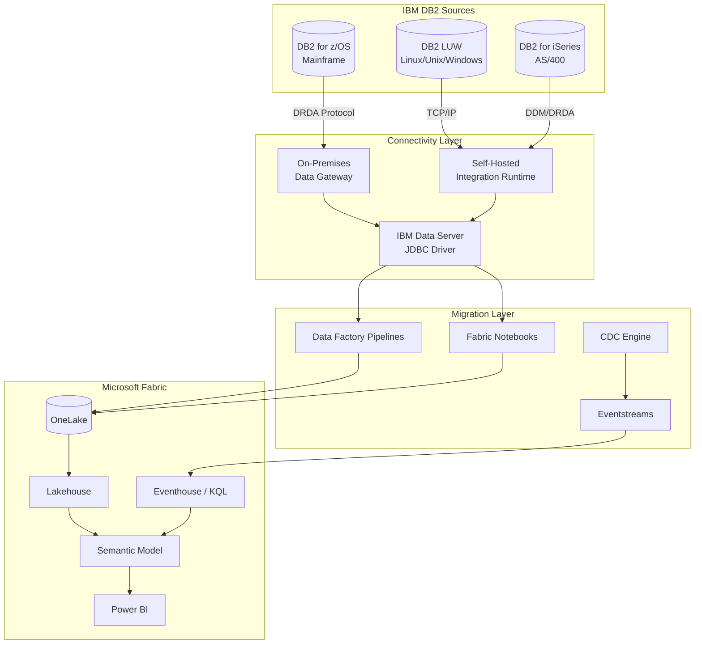
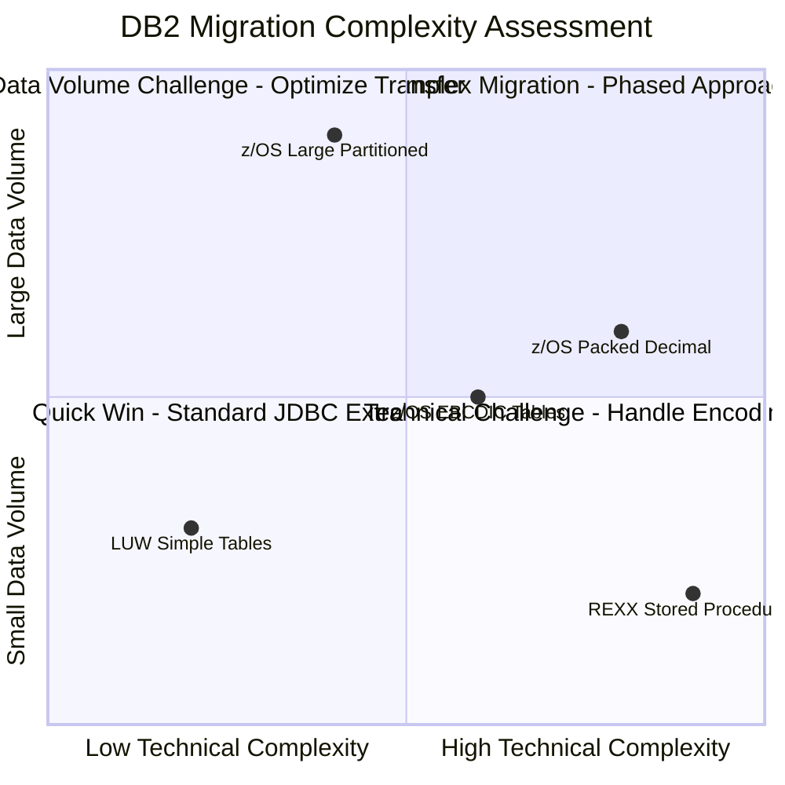
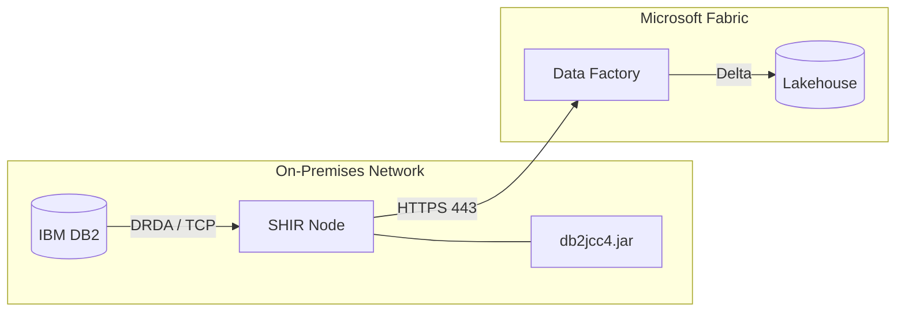
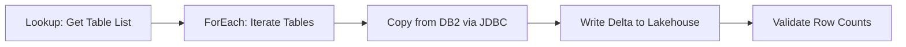
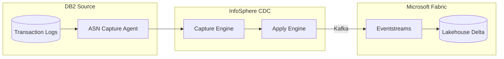
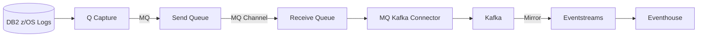
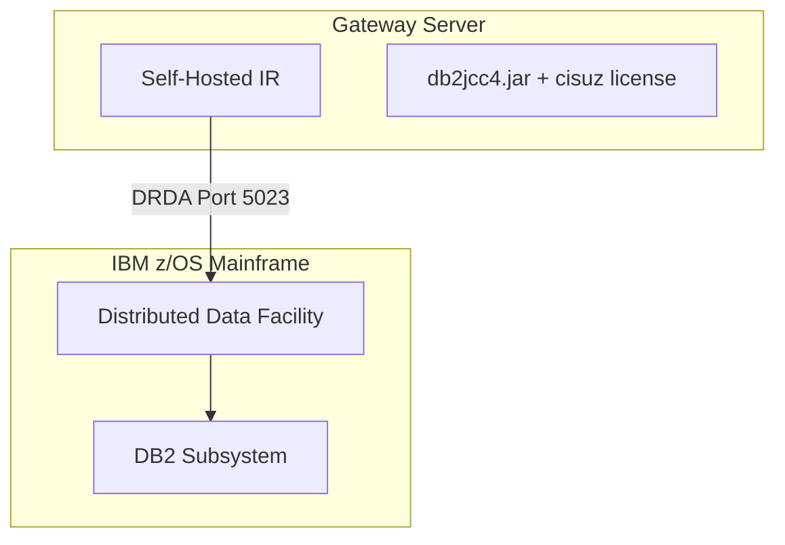
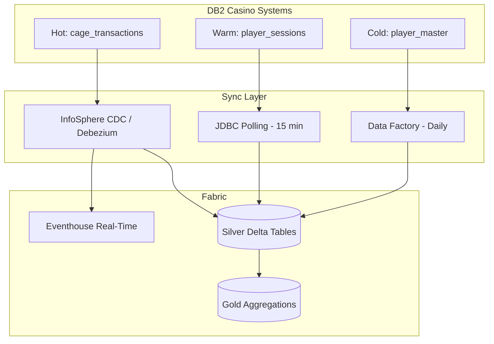

[Home](../../index.md) > [Tutorials](../) > IBM DB2 Source

# 🏢 Tutorial 25: IBM DB2 as a Source for Microsoft Fabric

> **Last Updated**: 2026-04-15 | **Version**: 2.0
> **Status**: ✅ Final | **Maintainer**: Documentation Team

<div align="center" markdown>


</div>

---

## 🏢 Tutorial 25: IBM DB2 as a Source for Microsoft Fabric

| | |
|---|---|
| **Difficulty** | ⭐⭐⭐ Advanced |
| **Time** | :clock1: 150-210 minutes |
| **Focus** | Mainframe & Legacy Data Migration |

---

### :bar_chart: Progress Tracker

```
┌────────┬────────┬────────┬────────┬────────┬────────┬────────┬────────┬────────┬────────┬────────┬────────┬────────┬────────┐
│   00   │   01   │   02   │   03   │   04   │   05   │   06   │   07   │   08   │   09   │   10   │   11   │   12   │   13   │
│ SETUP  │ BRONZE │ SILVER │  GOLD  │  RT    │  PBI   │ PIPES  │  GOV   │ MIRROR │  AI/ML │TERADATA│  SAS   │ CI/CD  │ MIGPLN │
├────────┼────────┼────────┼────────┼────────┼────────┼────────┼────────┼────────┼────────┼────────┼────────┼────────┼────────┤
│   ✅   │   ✅   │   ✅   │   ✅   │   ✅   │   ✅   │   ✅   │   ✅   │   ✅   │   ✅   │   ✅   │   ✅   │   ✅   │   ✅   │
└────────┴────────┴────────┴────────┴────────┴────────┴────────┴────────┴────────┴────────┴────────┴────────┴────────┴────────┘

┌────────┬────────┬────────┬────────┬────────┬────────┬────────┬────────┬────────┬────────┬────────┬────────┬────────┬────────┐
│   14   │   15   │   16   │   17   │   18   │   19   │   20   │   21   │   22   │   23   │   24   │   25   │   26   │   ...  │
│SECNET  │ COST   │  PERF  │ MONALR │ SHARE  │COPILOT │ WKBEST │GEOARCG │NETCONN │SHIRGW  │SNOWFLK │IBM DB2 │STREAM  │        │
├────────┼────────┼────────┼────────┼────────┼────────┼────────┼────────┼────────┼────────┼────────┼────────┼────────┼────────┤
│   ✅   │   ✅   │   ✅   │   ✅   │   ✅   │   ✅   │   ✅   │   ✅   │   ✅   │   ✅   │   ✅   │  🔵   │   ⬚   │   ⬚   │
└────────┴────────┴────────┴────────┴────────┴────────┴────────┴────────┴────────┴────────┴────────┴────────┴────────┴────────┘
                                                                                                      ▲
                                                                                                 YOU ARE HERE
```

| Navigation | |
|---|---|
| :arrow_left: **Previous** | [24-Snowflake to Fabric](../24-snowflake-to-fabric/README.md) |
| ➡️ **Next** | [26-Multi-Source Streaming](../26-multi-source-streaming/README.md) |

---

## 📖 Overview

This tutorial provides a comprehensive guide for connecting **IBM DB2** as a data source for **Microsoft Fabric**. Many casino and gaming organizations run core systems --- cage transaction processing, player tracking, regulatory reporting --- on DB2 mainframes that have been in production for decades.

IBM DB2 comes in three primary variants, each with distinct connectivity considerations:

| DB2 Variant | Platform | Typical Casino Use Case |
|---|---|---|
| **DB2 for z/OS** | IBM Mainframe (z14/z15/z16) | Core cage operations, compliance reporting, mainframe player history |
| **DB2 LUW** | Linux, Unix, Windows | Departmental analytics, mid-tier player databases, marketing |
| **DB2 for iSeries** | IBM Power Systems (AS/400) | Property management, legacy loyalty systems, back-office accounting |

Microsoft Fabric provides a unified analytics platform that can ingest from all three DB2 variants, offering unified OneLake storage, real-time intelligence, lakehouse architecture, and integrated governance through Microsoft Purview for NIGC MICS compliance lineage.

---

## 🎯 Learning Objectives

By the end of this tutorial, you will be able to:

- [ ] Assess IBM DB2 environments across z/OS, LUW, and iSeries variants
- [ ] Configure DB2 connectivity using Data Gateway and Self-Hosted Integration Runtime
- [ ] Map DB2 data types to Fabric T-SQL and Spark types (including EBCDIC and packed decimal)
- [ ] Translate DB2 SQL patterns to Fabric-native equivalents
- [ ] Build Data Factory pipelines with DB2 source connectors
- [ ] Implement CDC patterns using InfoSphere CDC, Q Replication, and Debezium
- [ ] Handle z/OS-specific challenges (DRDA, EBCDIC, packed decimal)
- [ ] Validate migrated data for row counts, checksums, and character encoding integrity

---

## 🏗️ Migration Architecture Overview



### Migration Approaches

| Approach | Description | Best For | Latency |
|----------|-------------|----------|---------|
| **Batch Extract** | Scheduled full/incremental JDBC reads | Historical data, large tables | Hours |
| **Real-Time CDC** | InfoSphere CDC or Debezium capture | Live cage transactions, slot telemetry | Seconds-Minutes |
| **Hybrid** | CDC for hot tables, batch for cold | Mixed workloads | Varies |
| **Q Replication** | DB2 native replication to Kafka/Eventstreams | z/OS environments with MQ infrastructure | Seconds |

---

## 📋 Prerequisites

- [ ] Completed [Tutorial 00: Environment Setup](../00-environment-setup/README.md)
- [ ] Completed [Tutorials 01-03: Medallion Architecture](../01-bronze-layer/README.md)
- [ ] Completed [Tutorial 23: SHIR & Data Gateways](../23-shir-data-gateways/README.md) (recommended)
- [ ] Fabric workspace with F64+ capacity
- [ ] Access to source IBM DB2 environment (z/OS, LUW, or iSeries)
- [ ] DB2 user with SELECT privileges on target schemas
- [ ] Network connectivity between Fabric and DB2 (VPN/ExpressRoute)
- [ ] [IBM Data Server Driver for JDBC](https://www.ibm.com/support/pages/db2-jdbc-driver-versions-and-downloads) (`db2jcc4.jar`)
- [ ] On-premises Data Gateway or Self-Hosted Integration Runtime installed

> 💡 **Tip:** For testing without a live DB2 instance, use the sample DDL scripts and synthetic data to practice SQL translation patterns.

---

## 🛠️ Step 1: Assess Your DB2 Environment

### 1.1 z/OS System Catalog Queries

```sql
-- DB2 z/OS: List tables with row counts and encoding
SELECT
    CREATOR AS SCHEMA_NAME, NAME AS TABLE_NAME, TYPE,
    COLCOUNT AS COLUMN_COUNT, CARDF AS ESTIMATED_ROWS, ENCODING_SCHEME
FROM SYSIBM.SYSTABLES
WHERE CREATOR = 'CASINO' AND TYPE = 'T'
ORDER BY CARDF DESC;

-- DB2 z/OS: Column details for a table
SELECT
    TBNAME AS TABLE_NAME, NAME AS COLUMN_NAME, COLNO,
    COLTYPE AS DATA_TYPE, LENGTH, SCALE, NULLS, CCSID
FROM SYSIBM.SYSCOLUMNS
WHERE TBCREATOR = 'CASINO' AND TBNAME = 'CAGE_TRANSACTIONS'
ORDER BY COLNO;
```

### 1.2 LUW System Catalog Queries

```sql
-- DB2 LUW: List tables with size estimates
SELECT
    T.TABSCHEMA, T.TABNAME, T.CARD AS ESTIMATED_ROWS,
    T.NPAGES * TS.PAGESIZE / 1024 / 1024 AS SIZE_MB, T.COLCOUNT
FROM SYSCAT.TABLES T
JOIN SYSCAT.TABLESPACES TS ON T.TBSPACEID = TS.TBSPACEID
WHERE T.TABSCHEMA = 'CASINO' AND T.TYPE = 'T'
ORDER BY SIZE_MB DESC;

-- DB2 LUW: Column details
SELECT TABNAME, COLNAME, COLNO, TYPENAME, LENGTH, SCALE, NULLS, CODEPAGE
FROM SYSCAT.COLUMNS
WHERE TABSCHEMA = 'CASINO' AND TABNAME = 'PLAYER_HISTORY'
ORDER BY COLNO;
```

### 1.3 iSeries (AS/400) Catalog Queries

```sql
-- DB2 iSeries: Table details
SELECT TABLE_SCHEMA, TABLE_NAME, TABLE_TEXT AS DESCRIPTION,
       NUMBER_ROWS, DATA_SIZE / 1024 / 1024 AS SIZE_MB
FROM QSYS2.SYSTABLESTAT
WHERE TABLE_SCHEMA = 'CASINOLIB'
ORDER BY DATA_SIZE DESC;
```

### 1.4 Complexity Factors

| Factor | Assessment | Impact | Mitigation |
|---|---|---|---|
| **EBCDIC Encoding** | z/OS CCSID 37/500 | Character conversion required | PySpark EBCDIC decoder |
| **Packed Decimal (COMP-3)** | z/OS financial data | Binary-to-decimal conversion | Custom UDF |
| **REXX Stored Procedures** | z/OS business logic | No direct equivalent | Rewrite as Python/Spark |
| **GRAPHIC/VARGRAPHIC** | DBCS double-byte fields | Type mapping to NVARCHAR | Explicit CAST |
| **ROWID Columns** | DB2-generated identifiers | Not portable | Map to BIGINT surrogate |
| **TIMESTAMP(12)** | Extended precision | Precision loss | Truncate to TIMESTAMP(6) |
| **Temporal Tables** | System/business-time | Redesign versioning | Map to Delta time travel |



---

## 🛠️ Step 2: Configure DB2 Connectivity

### 2.1 On-Premises Data Gateway


*Source: [What is an on-premises data gateway?](https://learn.microsoft.com/en-us/data-integration/gateway/service-gateway-onprem)*

1. Download the [On-premises Data Gateway](https://learn.microsoft.com/en-us/data-integration/gateway/service-gateway-install) on a Windows server with DB2 network access
2. Sign in with your Microsoft Entra account and register with your Fabric tenant
3. Install the IBM Data Server Driver for JDBC on the gateway machine

### 2.2 Self-Hosted Integration Runtime



Install SHIR, register with the authentication key, then place `db2jcc4.jar` in the SHIR `lib` directory.

### 2.3 JDBC Driver Components

| Component | File | Purpose |
|---|---|---|
| **JDBC Driver** | `db2jcc4.jar` | Type 4 pure Java driver |
| **z/OS + iSeries License** | `db2jcc_license_cisuz.jar` | **Required** for z/OS and iSeries |
| **LUW License** | `db2jcc_license_cu.jar` | Required for LUW |

> ⚠️ **Important:** Without `db2jcc_license_cisuz.jar`, z/OS and iSeries connections fail with `SQL1598N` licensing errors.

### 2.4 Connection String Formats

**DB2 for z/OS:**
```
jdbc:db2://mainframe.casino.com:5023/DSNDB2Z:currentSchema=CASINO;sslConnection=true;
```

**DB2 LUW:**
```
jdbc:db2://db2server.casino.com:50000/CASINODB:currentSchema=CASINO;sslConnection=true;
```

**DB2 for iSeries:**
```
jdbc:as400://as400.casino.com/CASINOLIB;translate binary=true;prompt=false;
```

### 2.5 SSL/TLS Configuration

```bash
# Import DB2 server certificate into a trust store
keytool -importcert -alias db2_server -file db2_server_cert.cer \
    -keystore db2_truststore.jks -storepass changeit -noprompt
```

### 2.6 Test Connection Notebook

```python
# Fabric Notebook: Test IBM DB2 Connectivity
from notebookutils import mssparkutils

db2_host = mssparkutils.credentials.getSecret("keyvault", "db2-host")
db2_port = mssparkutils.credentials.getSecret("keyvault", "db2-port")
db2_database = mssparkutils.credentials.getSecret("keyvault", "db2-database")
db2_user = mssparkutils.credentials.getSecret("keyvault", "db2-user")
db2_password = mssparkutils.credentials.getSecret("keyvault", "db2-password")

jdbc_url = f"jdbc:db2://{db2_host}:{db2_port}/{db2_database}:currentSchema=CASINO;"

df_test = spark.read.format("jdbc") \
    .option("url", jdbc_url) \
    .option("query", "SELECT CURRENT TIMESTAMP AS TEST_TS FROM SYSIBM.SYSDUMMY1") \
    .option("user", db2_user).option("password", db2_password) \
    .option("driver", "com.ibm.db2.jcc.DB2Driver") \
    .load()

print(f"Connection successful! DB2 time: {df_test.collect()[0]['TEST_TS']}")
```

---

## 🛠️ Step 3: Data Type Mapping

### 3.1 DB2 to Fabric Type Reference

| DB2 Data Type | Fabric T-SQL | Spark / Delta | Notes |
|---|---|---|---|
| `SMALLINT` | `SMALLINT` | `ShortType` | Direct |
| `INTEGER` | `INT` | `IntegerType` | Direct |
| `BIGINT` | `BIGINT` | `LongType` | Direct |
| `DECIMAL(p,s)` | `DECIMAL(p,s)` | `DecimalType(p,s)` | Direct |
| `DECFLOAT(16)` | `DECIMAL(34,6)` | `DecimalType(34,6)` | Approximate |
| `REAL` / `DOUBLE` | `REAL` / `FLOAT` | `FloatType` / `DoubleType` | Direct |
| `CHAR(n)` / `VARCHAR(n)` | `CHAR(n)` / `VARCHAR(n)` | `StringType` | EBCDIC conversion for z/OS |
| `GRAPHIC(n)` | `NCHAR(n)` | `StringType` | DBCS double-byte |
| `VARGRAPHIC(n)` | `NVARCHAR(n)` | `StringType` | DBCS double-byte |
| `CLOB` / `BLOB` | `VARCHAR(MAX)` / `VARBINARY(MAX)` | `StringType` / `BinaryType` | Size limits differ |
| `DATE` / `TIME` | `DATE` / `TIME` | `DateType` / `StringType` | Spark has no TIME type |
| `TIMESTAMP` | `DATETIME2(6)` | `TimestampType` | Default 6-digit precision |
| `TIMESTAMP(12)` | `DATETIME2(7)` | `TimestampType` | Truncated to 7/6 digits |
| `ROWID` | `BIGINT` | `LongType` | Map to surrogate key |
| `XML` | `VARCHAR(MAX)` | `StringType` | Parse with XPath |

### 3.2 EBCDIC to UTF-8 Conversion

```python
# EBCDIC decoder UDF for z/OS binary character fields
from pyspark.sql.functions import udf
from pyspark.sql.types import StringType

def ebcdic_to_utf8(binary_data, ccsid=37):
    if binary_data is None:
        return None
    try:
        return binary_data.decode(f'cp{ccsid:03d}').strip()
    except (UnicodeDecodeError, AttributeError):
        return None

ebcdic_udf = udf(lambda x: ebcdic_to_utf8(x), StringType())

# Usage: df.withColumn("player_name", ebcdic_udf("player_name_raw"))
```

### 3.3 Packed Decimal (COMP-3) Handling

```python
# Packed decimal converter for z/OS financial data
from pyspark.sql.functions import udf
from pyspark.sql.types import DecimalType

def unpack_decimal(packed_bytes, scale=2):
    """Convert COMP-3 packed decimal to Python float.
    Format: each byte = 2 BCD digits, last nibble = sign (C=+, D=-)"""
    if packed_bytes is None:
        return None
    result = 0
    for i, byte in enumerate(packed_bytes):
        high, low = (byte >> 4) & 0x0F, byte & 0x0F
        if i < len(packed_bytes) - 1:
            result = result * 100 + high * 10 + low
        else:
            result = result * 10 + high
            if low == 0x0D:
                result = -result
    return result / (10 ** scale)

packed_udf = udf(lambda x: unpack_decimal(x, 2), DecimalType(15, 2))

# Usage: df.withColumn("amount", packed_udf("txn_amt_comp3"))
```

### 3.4 TIMESTAMP(12) Precision

```python
from pyspark.sql.functions import col, substring, to_timestamp

# DB2 TIMESTAMP(12) arrives as "2024-01-15-14.30.45.123456789012"
# Truncate to microseconds (6 digits) for Spark TimestampType
df = df_raw.withColumn(
    "event_timestamp",
    to_timestamp(substring(col("db2_ts_str"), 1, 26), "yyyy-MM-dd-HH.mm.ss.SSSSSS")
)
```

---

## 🛠️ Step 4: SQL Translation Patterns

### 4.1 FETCH FIRST N ROWS

| | DB2 | Fabric T-SQL | Spark SQL |
|---|---|---|---|
| **Syntax** | `FETCH FIRST 50 ROWS ONLY` | `TOP 50` | `LIMIT 50` |

```sql
-- DB2: Top cage transactions
SELECT transaction_id, player_id, transaction_amount
FROM CASINO.CAGE_TRANSACTIONS
WHERE transaction_date = CURRENT DATE
ORDER BY transaction_amount DESC
FETCH FIRST 50 ROWS ONLY;

-- Fabric T-SQL equivalent
SELECT TOP 50 transaction_id, player_id, transaction_amount
FROM casino.cage_transactions
WHERE transaction_date = CAST(GETDATE() AS DATE)
ORDER BY transaction_amount DESC;
```

### 4.2 WITH UR (Uncommitted Read)

```sql
-- DB2: Reporting query with uncommitted read to avoid locks
SELECT cage_id, SUM(cash_in) AS total_cash_in, COUNT(*) AS txn_count
FROM CASINO.CAGE_TRANSACTIONS
WHERE shift_date = CURRENT DATE - 1 DAY
GROUP BY cage_id WITH UR;

-- Fabric T-SQL: SET isolation or NOLOCK hint
SELECT cage_id, SUM(cash_in) AS total_cash_in, COUNT(*) AS txn_count
FROM casino.cage_transactions WITH (NOLOCK)
WHERE shift_date = DATEADD(DAY, -1, CAST(GETDATE() AS DATE))
GROUP BY cage_id;
```

> 💡 **Note:** In Spark/Delta Lake, MVCC handles concurrency automatically --- no isolation hint needed.

### 4.3 Date/Time Functions

| DB2 | Fabric T-SQL | Spark SQL |
|---|---|---|
| `CURRENT TIMESTAMP` | `GETDATE()` | `current_timestamp()` |
| `CURRENT DATE` | `CAST(GETDATE() AS DATE)` | `current_date()` |
| `CURRENT DATE - 7 DAYS` | `DATEADD(DAY, -7, CAST(GETDATE() AS DATE))` | `date_sub(current_date(), 7)` |
| `DAYS(date)` | `DATEDIFF(DAY, '0001-01-01', date)` | `datediff(date, '0001-01-01')` |

### 4.4 Concatenation Operator (||)

```sql
-- DB2: String concatenation with || operator
SELECT player_id,
    first_name || ' ' || last_name AS display_name,
    'CTR-' || CHAR(YEAR(txn_date)) || '-' || LPAD(CHAR(ctr_seq), 6, '0') AS ctr_ref
FROM CASINO.PLAYER_MASTER WHERE loyalty_tier = 'DIAMOND';

-- Fabric T-SQL: CONCAT function
SELECT player_id,
    CONCAT(first_name, ' ', last_name) AS display_name,
    CONCAT('CTR-', YEAR(txn_date), '-', RIGHT('000000' + CAST(ctr_seq AS VARCHAR), 6)) AS ctr_ref
FROM casino.player_master WHERE loyalty_tier = 'DIAMOND';
```

### 4.5 Common Function Mappings

| DB2 Function | Fabric T-SQL | Spark SQL |
|---|---|---|
| `VALUE(a, b)` | `ISNULL(a, b)` | `coalesce(a, b)` |
| `STRIP(x)` | `TRIM(x)` | `trim(x)` |
| `SUBSTR(s, p, n)` | `SUBSTRING(s, p, n)` | `substring(s, p, n)` |
| `LOCATE(pat, s)` / `POSSTR(s, pat)` | `CHARINDEX(pat, s)` | `locate(pat, s)` |
| `LENGTH(s)` | `LEN(s)` | `length(s)` |
| `CHAR(n)` | `CAST(n AS VARCHAR)` | `cast(n as string)` |
| `DIGITS(n)` | `RIGHT('00..0' + CAST(n AS VARCHAR), len)` | `lpad(cast(n as string), len, '0')` |
| `HEX(x)` | `CONVERT(VARCHAR, x, 2)` | `hex(x)` |
| `RAISE_ERROR(state, msg)` | `THROW 50000, msg, 1` | `raise Exception(msg)` |

### 4.6 Stored Procedure Conversion

DB2 stored procedures (especially REXX on z/OS) convert to Fabric notebooks:

```python
# Fabric Notebook: CTR Threshold Check (replaces DB2 CASINO.CHECK_CTR_THRESHOLD)
from pyspark.sql.functions import col, sum as spark_sum, when, lit, current_date

CTR_THRESHOLD = 10000.00

df_daily = spark.table("silver.cage_transactions") \
    .filter((col("transaction_date") == current_date()) &
            (col("transaction_type").isin("CASH_IN", "CHIP_PURCHASE"))) \
    .groupBy("player_id", "transaction_date") \
    .agg(spark_sum("transaction_amount").alias("total_amount")) \
    .withColumn("ctr_required", when(col("total_amount") >= CTR_THRESHOLD, lit("Y")).otherwise(lit("N")))

# Write CTR candidates to Gold layer
df_daily.filter(col("ctr_required") == "Y") \
    .write.mode("append").saveAsTable("gold.ctr_candidates")
```

---

## 🛠️ Step 5: Batch Data Migration

### 5.1 Data Factory Pipeline Architecture


*Source: [Copy activity in Data Factory](https://learn.microsoft.com/en-us/fabric/data-factory/copy-data-activity)*



### 5.2 Pipeline JSON Definition

```json
{
    "name": "pl_db2_migration_casino",
    "properties": {
        "activities": [
            {
                "name": "Get DB2 Tables",
                "type": "Lookup",
                "typeProperties": {
                    "source": {
                        "type": "Db2Source",
                        "query": "SELECT TABNAME AS TABLE_NAME, CARD AS ROW_COUNT FROM SYSCAT.TABLES WHERE TABSCHEMA = 'CASINO' AND TYPE = 'T'"
                    },
                    "firstRowOnly": false
                }
            },
            {
                "name": "ForEach Table",
                "type": "ForEach",
                "typeProperties": {
                    "items": "@activity('Get DB2 Tables').output.value",
                    "batchCount": 4,
                    "activities": [
                        {
                            "name": "Copy to Lakehouse",
                            "type": "Copy",
                            "typeProperties": {
                                "source": {
                                    "type": "Db2Source",
                                    "query": "SELECT * FROM CASINO.@{item().TABLE_NAME}"
                                },
                                "sink": { "type": "LakehouseTableSink", "tableActionOption": "Overwrite" }
                            }
                        }
                    ]
                }
            }
        ]
    }
}
```

### 5.3 JDBC Read with Partitioning

```python
# Fabric Notebook: Partitioned large table extract from DB2
jdbc_url = "jdbc:db2://db2server.casino.com:50000/CASINODB:currentSchema=CASINO;"

df = spark.read.format("jdbc") \
    .option("url", jdbc_url) \
    .option("dbtable", "CASINO.CAGE_TRANSACTIONS") \
    .option("user", db2_user).option("password", db2_password) \
    .option("driver", "com.ibm.db2.jcc.DB2Driver") \
    .option("partitionColumn", "TRANSACTION_DATE") \
    .option("lowerBound", "2020-01-01") \
    .option("upperBound", "2025-01-01") \
    .option("numPartitions", 48) \
    .option("fetchsize", 50000) \
    .load()

# Lowercase columns (DB2 returns uppercase)
for c in df.columns:
    df = df.withColumnRenamed(c, c.lower())

df.write.mode("overwrite").format("delta").saveAsTable("bronze.db2_cage_transactions")
spark.sql("OPTIMIZE bronze.db2_cage_transactions")
```

### 5.4 Handling NULL Indicators and Code Pages

```python
# DB2 z/OS batch exports may include NULL indicator columns
from pyspark.sql.functions import col, when, lit

null_indicators = {"txn_amount": "txn_amount_ni", "player_id": "player_id_ni"}

for data_col, null_col in null_indicators.items():
    if null_col in df_raw.columns:
        df_raw = df_raw.withColumn(
            data_col, when(col(null_col) == -1, lit(None)).otherwise(col(data_col))
        ).drop(null_col)
```

---

## 🛠️ Step 6: CDC Patterns for DB2

### 6.1 InfoSphere CDC (ASN Capture)



**Key ASN Tables:**

| Table | Purpose |
|---|---|
| `IBMSNAP_REGISTER` | Source tables registered for capture |
| `IBMSNAP_PRUNCNTL` | Pruning control for change tables |
| `IBMSNAP_SUBS_SET` | Subscription set definitions |

```sql
-- Check registered CDC tables
SELECT SOURCE_OWNER, SOURCE_TABLE, CD_TABLE, CCD_CONDENSED
FROM ASN.IBMSNAP_REGISTER WHERE SOURCE_OWNER = 'CASINO';
```

### 6.2 CDC via JDBC Polling

```python
# Watermark-based polling for environments without InfoSphere CDC
from delta.tables import DeltaTable
from datetime import datetime

target_table = "silver.cage_transactions"
watermark_col = "last_modified_ts"

# Get current watermark
wm = spark.table(target_table).select(spark_max(watermark_col)).collect()[0][0] or datetime(2020,1,1)

# Read changes
query = f"SELECT * FROM CASINO.CAGE_TRANSACTIONS WHERE {watermark_col} > TIMESTAMP('{wm}') FETCH FIRST 500000 ROWS ONLY"
df_changes = spark.read.format("jdbc") \
    .option("url", jdbc_url).option("query", query) \
    .option("user", db2_user).option("password", db2_password) \
    .option("driver", "com.ibm.db2.jcc.DB2Driver").load()

# Merge into target
if df_changes.count() > 0 and spark.catalog.tableExists(target_table):
    DeltaTable.forName(spark, target_table).alias("t") \
        .merge(df_changes.alias("s"), "t.transaction_id = s.TRANSACTION_ID") \
        .whenMatchedUpdateAll().whenNotMatchedInsertAll().execute()
```

### 6.3 Q Replication to Kafka to Eventstreams



### 6.4 Debezium DB2 Connector

[Debezium](https://debezium.io/documentation/reference/stable/connectors/db2.html) provides open-source CDC for DB2 LUW via ASN capture tables.

```json
{
    "name": "db2-casino-connector",
    "config": {
        "connector.class": "io.debezium.connector.db2.Db2Connector",
        "database.hostname": "db2server.casino.com",
        "database.port": "50000",
        "database.dbname": "CASINODB",
        "database.cdcschema": "ASNCDC",
        "topic.prefix": "casino.db2",
        "table.include.list": "CASINO.CAGE_TRANSACTIONS,CASINO.PLAYER_SESSIONS,CASINO.SLOT_TELEMETRY"
    }
}
```

> 💡 **Note:** Debezium for DB2 polls ASN change data capture tables --- it requires the ASN capture agent to be configured on the DB2 LUW instance.

---

## 🛠️ Step 7: z/OS Specific Patterns

### 7.1 DRDA Protocol and Subsystem Access



| Parameter | Description | Typical Value |
|---|---|---|
| **DDF Port** | Distributed Data Facility port | `5023` |
| **Location Name** | DB2 subsystem location | `DB2Z_PROD` |
| **Package Collection** | Bound package schema | `NULLID` |
| **Security** | Auth mechanism | `ENCRYPTED_USER_AND_DATA_SECURITY` |

### 7.2 BIND PACKAGE Requirements

```sql
-- Run on z/OS by DBA to bind JDBC packages
BIND PACKAGE(NULLID) MEMBER(SYSSH200) ACTION(REPLACE)
    ISOLATION(CS) DYNAMICRULES(RUN) ENCODING(EBCDIC) OWNER(FABRIC_USER);
```

### 7.3 Comprehensive EBCDIC + Packed Decimal Processing

```python
# Fabric Notebook: Process z/OS cage transaction extract
EBCDIC_PAGES = {37: 'cp037', 500: 'cp500', 1047: 'cp1047', 1140: 'cp1140'}

def create_ebcdic_decoder(ccsid=37):
    encoding = EBCDIC_PAGES.get(ccsid, 'cp037')
    def decode(data):
        if data is None: return None
        try: return data.decode(encoding).strip()
        except: return f"[DECODE_ERROR:CCSID{ccsid}]"
    return udf(decode, StringType())

ebcdic_037 = create_ebcdic_decoder(37)

df_processed = spark.table("bronze.db2_zos_cage_raw") \
    .withColumn("player_name", ebcdic_037(col("player_name_raw"))) \
    .withColumn("cage_location", ebcdic_037(col("cage_loc_raw"))) \
    .withColumn("transaction_amount", packed_udf(col("txn_amt_comp3"))) \
    .drop("player_name_raw", "cage_loc_raw", "txn_amt_comp3")

df_processed.write.mode("overwrite").saveAsTable("silver.cage_transactions_zos")
```

---

## 🛠️ Step 8: Ongoing Synchronization

### 8.1 Strategy by Table Type

| Category | Example | Strategy | Frequency |
|---|---|---|---|
| **High-frequency** | `cage_transactions`, `slot_telemetry` | Real-time CDC | Continuous |
| **Session data** | `player_sessions`, `table_events` | JDBC polling | Every 15 min |
| **Reference/dimension** | `player_master`, `machine_catalog` | Batch pipeline | Daily |
| **Historical** | `transaction_history` | One-time + incremental | Weekly |
| **Compliance** | `ctr_filings`, `sar_reports` | Batch with audit | Daily |

### 8.2 Hybrid Approach



---

## 🛠️ Step 9: Validate Migrated Data

### 9.1 Row Count Comparison

```python
# Row count validation across DB2 and Fabric
validation_tables = [
    ("CASINO.CAGE_TRANSACTIONS", "bronze.db2_cage_transactions"),
    ("CASINO.PLAYER_SESSIONS", "bronze.db2_player_sessions"),
    ("CASINO.PLAYER_MASTER", "bronze.db2_player_master"),
]
results = []
for db2_tbl, fabric_tbl in validation_tables:
    fabric_count = spark.table(fabric_tbl).count()
    db2_count = spark.read.format("jdbc") \
        .option("url", jdbc_url).option("query", f"SELECT COUNT(*) AS CNT FROM {db2_tbl}") \
        .option("user", db2_user).option("password", db2_password) \
        .option("driver", "com.ibm.db2.jcc.DB2Driver").load().collect()[0]["CNT"]
    diff_pct = abs(db2_count - fabric_count) / db2_count * 100 if db2_count > 0 else 0
    results.append({"DB2": db2_tbl, "Fabric": fabric_tbl,
        "DB2 Count": db2_count, "Fabric Count": fabric_count,
        "Diff%": f"{diff_pct:.4f}%", "Status": "PASS" if diff_pct < 0.01 else "FAIL"})
display(pd.DataFrame(results))
```

### 9.2 Checksum Validation

```python
from pyspark.sql.functions import sum as spark_sum, count, avg

checksums = spark.table("bronze.db2_cage_transactions").agg(
    count("*").alias("rows"),
    spark_sum("transaction_amount").alias("sum_amount"),
    avg("transaction_amount").alias("avg_amount")
).collect()[0]

print(f"Rows: {checksums['rows']:,}  Sum: ${checksums['sum_amount']:,.2f}  Avg: ${checksums['avg_amount']:,.2f}")
# Compare against: SELECT COUNT(*), SUM(TRANSACTION_AMOUNT), AVG(TRANSACTION_AMOUNT) FROM CASINO.CAGE_TRANSACTIONS
```

### 9.3 EBCDIC / UTF-8 Character Validation

```python
from pyspark.sql.functions import col, when, lit

df = spark.table("silver.player_master")
total = df.count()
bad = df.filter(
    col("first_name").contains("\uFFFD") | col("last_name").contains("\uFFFD")
).count()

print(f"Total: {total:,}  Encoding issues: {bad:,} ({bad/total*100:.2f}%)")
print(f"Status: {'PASS' if bad == 0 else 'REVIEW'}")
```

---

## 🔧 Troubleshooting

| Issue | Cause | Resolution |
|---|---|---|
| **`SQL1598N` License error** | Missing `db2jcc_license_cisuz.jar` | Place license JAR alongside `db2jcc4.jar` in SHIR lib |
| **`SQLCODE -204` Object not found** | Wrong schema/table name (case-sensitive z/OS) | Verify with `SYSIBM.SYSTABLES` catalog |
| **`SQLCODE -551` No privilege** | User lacks SELECT | `GRANT SELECT ON CASINO.table TO fabric_user` |
| **`SQLCODE -30081` Comm error** | Firewall blocking DRDA port | Open port 5023 (z/OS) or 50000 (LUW) |
| **`SQLCODE -30082` Security error** | Auth failure or SSL mismatch | Verify credentials and trust store |
| **`SQLCODE -20528` Package not bound** | JDBC packages missing | Run BIND PACKAGE or enable auto-bind |
| **Connection timeout** | Network latency or wrong port | Increase `loginTimeout` in JDBC URL |
| **Out of memory in Spark** | Large table without partitioning | Add `partitionColumn`, `numPartitions` |
| **Garbled characters** | EBCDIC not decoded | Use `cp037` decoder; verify `translate binary=true` for iSeries |
| **Decimal precision loss** | DECFLOAT mapped to DOUBLE | Use DECIMAL(38,n) for financial amounts |
| **Slow JDBC reads** | Single-threaded fetch | Increase `fetchsize` (50000+) and `numPartitions` |
| **iSeries record locking** | AS/400 file-level locks | Add `block size=512;block criteria=2` to JDBC URL |

---

## 📚 Best Practices

1. **Assess all three DB2 variants independently** --- z/OS, LUW, and iSeries have different catalogs, protocols, and encoding challenges.
2. **Install the correct JDBC license JARs** --- `db2jcc_license_cisuz.jar` is mandatory for z/OS and iSeries; missing it causes cryptic errors.
3. **Handle EBCDIC conversion at ingestion** --- Convert all z/OS character data to UTF-8 during Bronze layer load.
4. **Convert packed decimal fields explicitly** --- Use known precision and scale from the COBOL copybook, never rely on automatic inference.
5. **Partition JDBC reads for large tables** --- Tables over 1M rows should use `partitionColumn` and `numPartitions` for parallel extract.
6. **Use CDC for high-frequency tables** --- Cage transactions and slot telemetry benefit from real-time CDC; batch is fine for reference tables.
7. **Validate sort order after migration** --- EBCDIC and UTF-8 have different sort orders; re-validate ORDER BY logic.
8. **Keep DB2 running during validation** --- Row count and checksum comparisons require concurrent access to source and target.
9. **Coordinate with the z/OS DBA** --- BIND PACKAGE, GRANTs, DDF config, and ASN capture setup require mainframe authority.
10. **Document all type mappings** --- Maintain a living reference of DB2-to-Fabric mappings including CCSID values and packed decimal layouts.

---

## 🎉 Summary

Congratulations! You have completed the IBM DB2 as a Source for Microsoft Fabric tutorial. You have learned to:

- ✅ Assess DB2 environments across z/OS, LUW, and iSeries using system catalog queries
- ✅ Configure DB2 connectivity through Data Gateway and Self-Hosted Integration Runtime
- ✅ Map DB2 data types to Fabric, including GRAPHIC, DECFLOAT, and ROWID
- ✅ Translate DB2 SQL patterns (FETCH FIRST, WITH UR, || concatenation) to Fabric equivalents
- ✅ Build Data Factory pipelines and PySpark notebooks for batch migration
- ✅ Implement CDC using InfoSphere CDC, Q Replication, and Debezium
- ✅ Handle z/OS-specific challenges: EBCDIC encoding, packed decimal, DRDA protocol
- ✅ Validate migrated data for row counts, checksums, and character encoding integrity

---

## ➡️ Next Steps

Continue to **[Tutorial 26: Multi-Source Real-Time Intelligence](../26-multi-source-streaming/README.md)** to learn how to combine multiple data sources --- including DB2 CDC streams --- into a unified real-time analytics pipeline in Microsoft Fabric.

---

## 📁 Included Resources

| Resource | Description |
|---|---|
| [`scripts/db2_migration_utils.py`](https://github.com/fgarofalo56/Suppercharge_Microsoft_Fabric/tree/main/tutorials/25-ibm-db2-source) | Python utilities (EBCDIC, packed decimal converters) |
| [`scripts/db2_type_mapping.sql`](https://github.com/fgarofalo56/Suppercharge_Microsoft_Fabric/tree/main/tutorials/25-ibm-db2-source) | Complete type mapping reference |
| [`scripts/db2_sql_translation.sql`](https://github.com/fgarofalo56/Suppercharge_Microsoft_Fabric/tree/main/tutorials/25-ibm-db2-source) | SQL translation examples |
| [`scripts/db2_catalog_queries.sql`](https://github.com/fgarofalo56/Suppercharge_Microsoft_Fabric/tree/main/tutorials/25-ibm-db2-source) | System catalog queries for all variants |
| [`templates/db2_migration_checklist.md`](https://github.com/fgarofalo56/Suppercharge_Microsoft_Fabric/tree/main/tutorials/25-ibm-db2-source) | Migration checklist |

---

## 📚 Additional Resources

- [IBM DB2 Connector - Fabric Data Factory](https://learn.microsoft.com/en-us/fabric/data-factory/connector-ibm-db2-database)
- [On-premises Data Gateway](https://learn.microsoft.com/en-us/data-integration/gateway/service-gateway-onprem)
- [Self-Hosted Integration Runtime](https://learn.microsoft.com/en-us/fabric/data-factory/create-self-hosted-integration-runtime)
- [IBM Data Server Driver for JDBC](https://www.ibm.com/support/pages/db2-jdbc-driver-versions-and-downloads)
- [Debezium DB2 Connector](https://debezium.io/documentation/reference/stable/connectors/db2.html)
- [IBM InfoSphere CDC](https://www.ibm.com/docs/en/idr/11.4.0)
- [DB2 for z/OS SQL Reference](https://www.ibm.com/docs/en/db2-for-zos/13)

---

## 🧭 Navigation

| :arrow_left: Previous | :arrow_up: Up | ➡️ Next |
|------------|------|--------|
| [24-Snowflake to Fabric](../24-snowflake-to-fabric/README.md) | [Tutorials Index](../index.md) | [26-Multi-Source Streaming](../26-multi-source-streaming/README.md) |

---

> :speech_balloon: **Questions or issues?** Open an issue in the [GitHub repository](https://github.com/frgarofa/Suppercharge_Microsoft_Fabric/issues).

---

[⬆️ Back to Top](#-tutorial-25-ibm-db2-as-a-source-for-microsoft-fabric) | [📚 Tutorials](../) | [🏠 Home](../../index.md)
