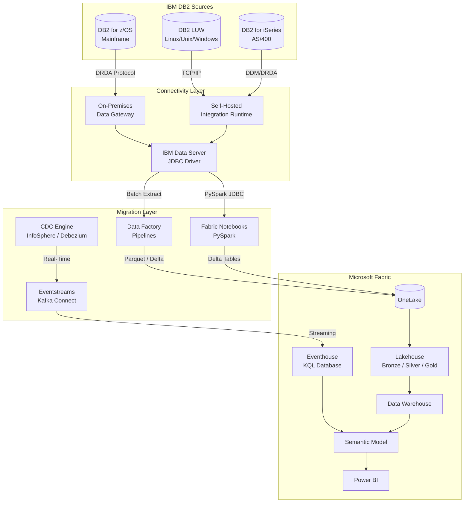
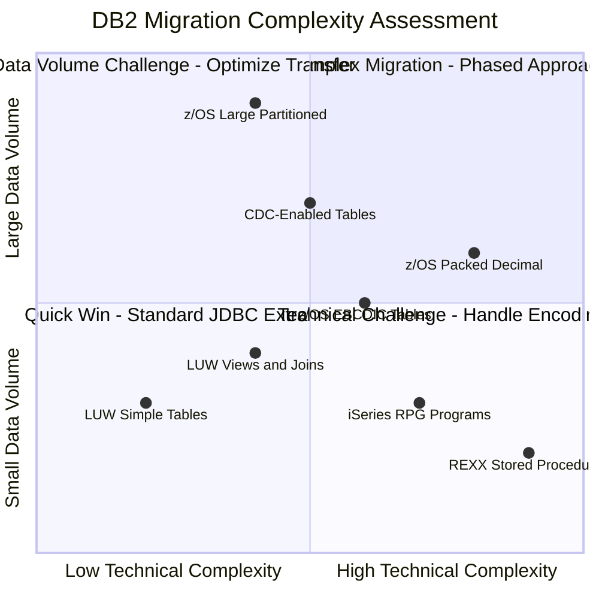
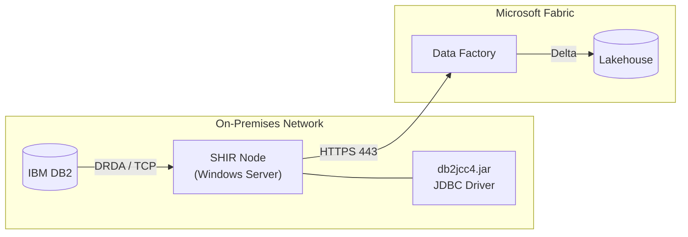
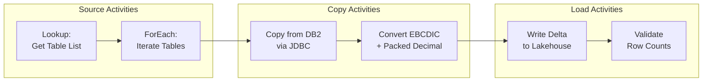
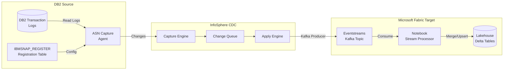
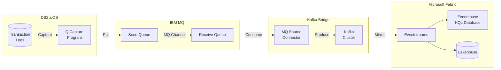
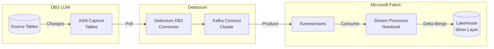
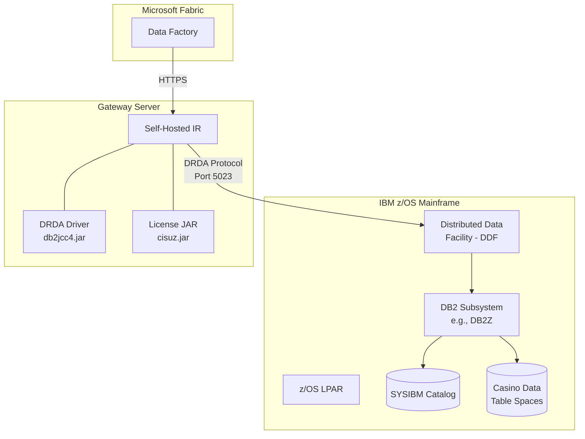
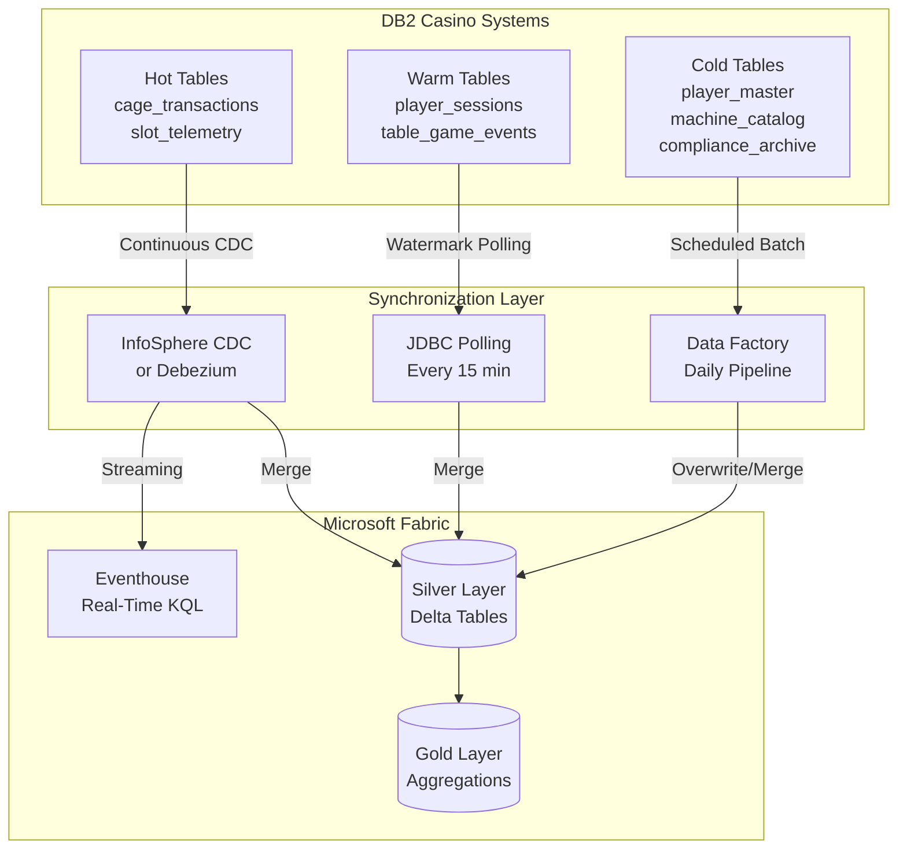

# 🏢 Tutorial 25: IBM DB2 as a Source for Microsoft Fabric

<div align="center">


</div>

> :house: **[Home](../../index.md)** > :book: **[Tutorials](../index.md)** > :office: **IBM DB2 Source**

---

## :office: Tutorial 25: IBM DB2 as a Source for Microsoft Fabric

| | |
|---|---|
| **Difficulty** | :star::star::star: Advanced |
| **Time** | :clock1: 150-210 minutes |
| **Focus** | Mainframe & Legacy Data Migration |

---

### :bar_chart: Progress Tracker

```
┌────────┬────────┬────────┬────────┬────────┬────────┬────────┬────────┬────────┬────────┬────────┬────────┬────────┬────────┐
│   00   │   01   │   02   │   03   │   04   │   05   │   06   │   07   │   08   │   09   │   10   │   11   │   12   │   13   │
│ SETUP  │ BRONZE │ SILVER │  GOLD  │  RT    │  PBI   │ PIPES  │  GOV   │ MIRROR │  AI/ML │TERADATA│  SAS   │ CI/CD  │ MIGPLN │
├────────┼────────┼────────┼────────┼────────┼────────┼────────┼────────┼────────┼────────┼────────┼────────┼────────┼────────┤
│   ✅   │   ✅   │   ✅   │   ✅   │   ✅   │   ✅   │   ✅   │   ✅   │   ✅   │   ✅   │   ✅   │   ✅   │   ✅   │   ✅   │
└────────┴────────┴────────┴────────┴────────┴────────┴────────┴────────┴────────┴────────┴────────┴────────┴────────┴────────┘

┌────────┬────────┬────────┬────────┬────────┬────────┬────────┬────────┬────────┬────────┬────────┬────────┬────────┬────────┐
│   14   │   15   │   16   │   17   │   18   │   19   │   20   │   21   │   22   │   23   │   24   │   25   │   26   │   ...  │
│SECNET  │ COST   │  PERF  │ MONALR │ SHARE  │COPILOT │ WKBEST │GEOARCG │NETCONN │SHIRGW  │SNOWFLK │IBM DB2 │STREAM  │        │
├────────┼────────┼────────┼────────┼────────┼────────┼────────┼────────┼────────┼────────┼────────┼────────┼────────┼────────┤
│   ✅   │   ✅   │   ✅   │   ✅   │   ✅   │   ✅   │   ✅   │   ✅   │   ✅   │   ✅   │   ✅   │  🔵   │   ⬚   │   ⬚   │
└────────┴────────┴────────┴────────┴────────┴────────┴────────┴────────┴────────┴────────┴────────┴────────┴────────┴────────┘
                                                                                                      ▲
                                                                                                 YOU ARE HERE
```

| Navigation | |
|---|---|
| :arrow_left: **Previous** | [24-Snowflake to Fabric](../24-snowflake-to-fabric/README.md) |
| :arrow_right: **Next** | [26-Multi-Source Streaming](../26-multi-source-streaming/README.md) |

---

## :book: Overview

This tutorial provides a comprehensive guide for connecting **IBM DB2** as a data source for **Microsoft Fabric**. IBM DB2 remains one of the most widely deployed database platforms in enterprise environments, particularly in industries with legacy mainframe operations. Many casino and gaming organizations run core systems --- cage transaction processing, player tracking, regulatory reporting --- on DB2 for z/OS mainframes that have been in production for decades.

IBM DB2 comes in three primary variants, each with distinct connectivity considerations:

| DB2 Variant | Platform | Typical Casino/Gaming Use Case |
|---|---|---|
| **DB2 for z/OS** | IBM Mainframe (z14, z15, z16) | Core cage operations, compliance reporting, mainframe player history |
| **DB2 LUW** | Linux, Unix, Windows | Departmental analytics, mid-tier player databases, marketing systems |
| **DB2 for iSeries (AS/400)** | IBM Power Systems (AS/400) | Property management, legacy loyalty systems, back-office accounting |

Microsoft Fabric provides a modern unified analytics platform that can ingest from all three DB2 variants, offering:

- **Unified Data Lake** with OneLake and Delta Lake format for consolidating mainframe data
- **Real-Time Intelligence** for streaming casino floor events alongside batch DB2 extracts
- **Lakehouse architecture** eliminating the need for separate staging databases
- **Integrated governance** through Microsoft Purview for NIGC MICS compliance lineage

---

## :dart: Learning Objectives

By the end of this tutorial, you will be able to:

- [ ] Assess IBM DB2 environments across z/OS, LUW, and iSeries variants
- [ ] Configure DB2 connectivity using Data Gateway and Self-Hosted Integration Runtime
- [ ] Map DB2 data types to Fabric T-SQL and Spark types (including EBCDIC and packed decimal)
- [ ] Translate DB2 SQL patterns to Fabric-native equivalents
- [ ] Build Data Factory pipelines with DB2 source connectors
- [ ] Implement CDC patterns using InfoSphere CDC, Q Replication, and Debezium
- [ ] Handle z/OS-specific challenges (DRDA, EBCDIC, packed decimal)
- [ ] Establish ongoing synchronization between DB2 and Fabric
- [ ] Validate migrated data for accuracy and character encoding integrity

---

## :building_construction: Migration Architecture Overview



### Migration Approaches

| Approach | Description | Best For | Latency |
|----------|-------------|----------|---------|
| **Batch Extract** | Scheduled full/incremental JDBC reads | Historical data, large tables | Hours |
| **Real-Time CDC** | InfoSphere CDC or Debezium capture | Live cage transactions, slot telemetry | Seconds-Minutes |
| **Hybrid** | CDC for hot tables, batch for cold | Mixed workloads | Varies |
| **Q Replication** | DB2 native replication to Kafka/Eventstreams | z/OS environments with Q infrastructure | Seconds |

---

## :clipboard: Prerequisites

Before starting this tutorial, ensure you have:

- [ ] Completed [Tutorial 00: Environment Setup](../00-environment-setup/README.md)
- [ ] Completed [Tutorials 01-03: Medallion Architecture](../01-bronze-layer/README.md)
- [ ] Completed [Tutorial 23: SHIR & Data Gateways](../23-shir-data-gateways/README.md) (recommended)
- [ ] Fabric workspace with F64+ capacity
- [ ] Access to source IBM DB2 environment (z/OS, LUW, or iSeries)
- [ ] DB2 user with SELECT privileges on target schemas
- [ ] Network connectivity between Fabric and DB2 (VPN, ExpressRoute, or public endpoint)
- [ ] [IBM Data Server Driver for JDBC and SQLJ](https://www.ibm.com/support/pages/db2-jdbc-driver-versions-and-downloads) (`db2jcc4.jar`)
- [ ] On-premises Data Gateway or Self-Hosted Integration Runtime installed

> :bulb: **Tip:** For testing without a live DB2 instance, you can use the sample DDL scripts and synthetic data generators included in this tutorial to practice SQL translation and pipeline patterns.

---

## :hammer_and_wrench: Step 1: Assess Your DB2 Environment

### 1.1 DB2 for z/OS Inventory Assessment

On z/OS mainframes, the system catalog lives in the `SYSIBM` schema. Use these queries to inventory the objects targeted for migration.

```sql
-- DB2 z/OS: List all table spaces and their sizes
SELECT
    DBNAME AS DATABASE_NAME,
    NAME AS TABLESPACE_NAME,
    NACTIVE AS ACTIVE_PAGES,
    NACTIVE * 4096 / 1024 / 1024 AS SIZE_MB,
    PGSIZE AS PAGE_SIZE
FROM SYSIBM.SYSTABLESPACE
WHERE DBNAME NOT IN ('DSNDB01', 'DSNDB06')
ORDER BY SIZE_MB DESC;

-- DB2 z/OS: List all tables with row counts
SELECT
    CREATOR AS SCHEMA_NAME,
    NAME AS TABLE_NAME,
    TYPE,
    COLCOUNT AS COLUMN_COUNT,
    CARDF AS ESTIMATED_ROWS,
    EDPROC AS EDIT_PROCEDURE,
    ENCODING_SCHEME
FROM SYSIBM.SYSTABLES
WHERE CREATOR = 'CASINO'
  AND TYPE = 'T'
ORDER BY CARDF DESC;

-- DB2 z/OS: Column details for a specific table
SELECT
    TBCREATOR AS SCHEMA_NAME,
    TBNAME AS TABLE_NAME,
    NAME AS COLUMN_NAME,
    COLNO AS ORDINAL_POSITION,
    COLTYPE AS DATA_TYPE,
    LENGTH,
    SCALE,
    NULLS,
    DEFAULT,
    CCSID
FROM SYSIBM.SYSCOLUMNS
WHERE TBCREATOR = 'CASINO'
  AND TBNAME = 'CAGE_TRANSACTIONS'
ORDER BY COLNO;
```

### 1.2 DB2 LUW Inventory Assessment

On DB2 LUW (Linux/Unix/Windows), the catalog views use the `SYSCAT` schema.

```sql
-- DB2 LUW: List all schemas and table counts
SELECT
    TABSCHEMA AS SCHEMA_NAME,
    COUNT(*) AS TABLE_COUNT,
    SUM(CARD) AS TOTAL_ROWS
FROM SYSCAT.TABLES
WHERE TYPE = 'T'
  AND TABSCHEMA NOT LIKE 'SYS%'
GROUP BY TABSCHEMA
ORDER BY TOTAL_ROWS DESC;

-- DB2 LUW: List tables with size estimates
SELECT
    T.TABSCHEMA AS SCHEMA_NAME,
    T.TABNAME AS TABLE_NAME,
    T.CARD AS ESTIMATED_ROWS,
    T.NPAGES AS DATA_PAGES,
    T.NPAGES * TS.PAGESIZE / 1024 / 1024 AS SIZE_MB,
    T.COLCOUNT AS COLUMN_COUNT
FROM SYSCAT.TABLES T
JOIN SYSCAT.TABLESPACES TS
    ON T.TBSPACEID = TS.TBSPACEID
WHERE T.TABSCHEMA = 'CASINO'
  AND T.TYPE = 'T'
ORDER BY SIZE_MB DESC;

-- DB2 LUW: Column details
SELECT
    TABSCHEMA,
    TABNAME,
    COLNAME,
    COLNO,
    TYPENAME,
    LENGTH,
    SCALE,
    NULLS,
    CODEPAGE
FROM SYSCAT.COLUMNS
WHERE TABSCHEMA = 'CASINO'
  AND TABNAME = 'PLAYER_HISTORY'
ORDER BY COLNO;
```

### 1.3 DB2 for iSeries (AS/400) Inventory

On iSeries, the catalog is accessed through the `QSYS2` library.

```sql
-- DB2 iSeries: List libraries (schemas) with table counts
SELECT
    TABLE_SCHEMA AS LIBRARY_NAME,
    COUNT(*) AS TABLE_COUNT
FROM QSYS2.SYSTABLES
WHERE TABLE_TYPE = 'BASE TABLE'
  AND TABLE_SCHEMA NOT LIKE 'Q%'
GROUP BY TABLE_SCHEMA
ORDER BY TABLE_COUNT DESC;

-- DB2 iSeries: Table details
SELECT
    TABLE_SCHEMA,
    TABLE_NAME,
    TABLE_TEXT AS DESCRIPTION,
    NUMBER_ROWS,
    DATA_SIZE / 1024 / 1024 AS SIZE_MB
FROM QSYS2.SYSTABLESTAT
WHERE TABLE_SCHEMA = 'CASINOLIB'
ORDER BY DATA_SIZE DESC;
```

### 1.4 Complexity Scoring Matrix

Assess migration complexity based on DB2-specific factors:

| Complexity Factor | Assessment | Impact | Mitigation |
|---|---|---|---|
| **EBCDIC Encoding** | z/OS tables with CCSID 37/500 | Character conversion required | PySpark EBCDIC decoder |
| **Packed Decimal (COMP-3)** | Common in z/OS financial data | Binary-to-decimal conversion | Custom UDF in PySpark |
| **REXX Stored Procedures** | z/OS REXX-based business logic | No direct equivalent | Rewrite as Python/Spark |
| **GRAPHIC/VARGRAPHIC** | DBCS double-byte character fields | Type mapping to NVARCHAR | Explicit CAST during extract |
| **ROWID Columns** | DB2-generated row identifiers | Not portable | Map to BIGINT surrogate |
| **TIMESTAMP(12)** | Extended precision timestamps | Precision loss in some targets | Truncate to TIMESTAMP(6) |
| **Partitioned Table Spaces** | z/OS range-partitioned data | Align extraction parallelism | Partition-aware JDBC reads |
| **Temporal Tables** | System-time or business-time | Redesign versioning strategy | Map to Delta Lake time travel |



---

## :hammer_and_wrench: Step 2: Configure DB2 Connectivity

### 2.1 On-Premises Data Gateway Installation


*Source: [What is an on-premises data gateway?](https://learn.microsoft.com/en-us/data-integration/gateway/service-gateway-onprem)*

For DB2 connectivity through Fabric Data Factory, install and configure a Data Gateway:

1. Download the [On-premises Data Gateway](https://learn.microsoft.com/en-us/data-integration/gateway/service-gateway-install) on a Windows server with network access to DB2
2. Sign in with your Microsoft Entra (Azure AD) account
3. Register the gateway with your Fabric tenant
4. Install the IBM Data Server Driver for JDBC and SQLJ on the gateway machine

### 2.2 Self-Hosted Integration Runtime Setup

For more control over the connectivity layer, use a Self-Hosted Integration Runtime (SHIR):


*Source: [Self-Hosted Integration Runtime in Data Factory](https://learn.microsoft.com/en-us/fabric/data-factory/create-self-hosted-integration-runtime)*



**SHIR Installation Steps:**

1. In Fabric Data Factory, go to **Manage** > **Integration Runtimes** > **+ New**
2. Select **Self-Hosted** and copy the authentication key
3. On the gateway server, install the SHIR software
4. Register using the authentication key
5. Place `db2jcc4.jar` in the SHIR `lib` directory (typically `C:\Program Files\Microsoft Integration Runtime\<version>\Shared\`)

### 2.3 IBM JDBC Driver Configuration

Download and install the IBM Data Server Driver for JDBC and SQLJ:

| Component | File | Purpose |
|---|---|---|
| **JDBC Driver** | `db2jcc4.jar` | Type 4 JDBC driver (pure Java, no native libraries) |
| **License File** | `db2jcc_license_cisuz.jar` | License for z/OS and iSeries connectivity |
| **License File** | `db2jcc_license_cu.jar` | License for LUW connectivity |

> :warning: **Important:** The `db2jcc_license_cisuz.jar` file is **required** for connecting to DB2 for z/OS and iSeries. Without it, connections will fail with `SQL1598N` licensing errors.

### 2.4 Connection String Formats

Connection strings differ significantly across DB2 variants:

**DB2 for z/OS:**
```
jdbc:db2://mainframe.casino.com:5023/DSNDB2Z:currentSchema=CASINO;sslConnection=true;sslTrustStoreLocation=/path/to/truststore.jks;sslTrustStorePassword={password};
```

**DB2 LUW:**
```
jdbc:db2://db2server.casino.com:50000/CASINODB:currentSchema=CASINO;sslConnection=true;
```

**DB2 for iSeries (AS/400):**
```
jdbc:as400://as400.casino.com/CASINOLIB;translate binary=true;prompt=false;
```

### 2.5 Connection Configuration in Data Factory

| Setting | z/OS Value | LUW Value | iSeries Value |
|---|---|---|---|
| **Name** | `ls_db2_zos_casino` | `ls_db2_luw_casino` | `ls_db2_iseries_casino` |
| **Server** | `mainframe.casino.com` | `db2server.casino.com` | `as400.casino.com` |
| **Port** | `5023` (DRDA) | `50000` | `8471` |
| **Database** | `DSNDB2Z` | `CASINODB` | `CASINOLIB` |
| **Authentication** | Basic | Basic or Kerberos | Basic |
| **Encryption** | SSL/TLS required | SSL/TLS recommended | SSL/TLS recommended |
| **Schema** | `CASINO` | `CASINO` | `CASINOLIB` |

### 2.6 SSL/TLS Configuration

For production environments, always use encrypted connections:

```bash
# Generate a trust store with the DB2 server certificate
keytool -importcert \
    -alias db2_server \
    -file db2_server_cert.cer \
    -keystore db2_truststore.jks \
    -storepass changeit \
    -noprompt

# Verify the certificate was added
keytool -list -keystore db2_truststore.jks -storepass changeit
```

### 2.7 Test Connection Notebook

```python
# Fabric Notebook: Test IBM DB2 Connectivity
# ============================================
from pyspark.sql import SparkSession
from notebookutils import mssparkutils

# Configuration
db2_variant = "zos"  # Options: "zos", "luw", "iseries"

# Connection parameters (from Key Vault)
db2_host = mssparkutils.credentials.getSecret("keyvault", "db2-host")
db2_port = mssparkutils.credentials.getSecret("keyvault", "db2-port")
db2_database = mssparkutils.credentials.getSecret("keyvault", "db2-database")
db2_user = mssparkutils.credentials.getSecret("keyvault", "db2-user")
db2_password = mssparkutils.credentials.getSecret("keyvault", "db2-password")

# Build JDBC URL based on variant
if db2_variant == "zos":
    jdbc_url = f"jdbc:db2://{db2_host}:{db2_port}/{db2_database}:currentSchema=CASINO;"
    driver_class = "com.ibm.db2.jcc.DB2Driver"
elif db2_variant == "iseries":
    jdbc_url = f"jdbc:as400://{db2_host}/{db2_database};translate binary=true;"
    driver_class = "com.ibm.as400.access.AS400JDBCDriver"
else:  # luw
    jdbc_url = f"jdbc:db2://{db2_host}:{db2_port}/{db2_database}:currentSchema=CASINO;"
    driver_class = "com.ibm.db2.jcc.DB2Driver"

# Test connection with a simple query
try:
    df_test = spark.read \
        .format("jdbc") \
        .option("url", jdbc_url) \
        .option("query", "SELECT CURRENT TIMESTAMP AS TEST_TS FROM SYSIBM.SYSDUMMY1") \
        .option("user", db2_user) \
        .option("password", db2_password) \
        .option("driver", driver_class) \
        .load()

    result = df_test.collect()[0]["TEST_TS"]
    print(f"Connection successful! DB2 server time: {result}")
except Exception as e:
    print(f"Connection failed: {str(e)}")
    raise
```

---

## :hammer_and_wrench: Step 3: Data Type Mapping

### 3.1 DB2 to Fabric Type Mapping Reference

Understanding data type mappings is critical for accurate migration. DB2 types differ across variants and require careful translation.

| DB2 Data Type | Fabric T-SQL | Spark / Delta Lake | Notes |
|---|---|---|---|
| `SMALLINT` | `SMALLINT` | `ShortType` | Direct mapping |
| `INTEGER` | `INT` | `IntegerType` | Direct mapping |
| `BIGINT` | `BIGINT` | `LongType` | Direct mapping |
| `DECIMAL(p,s)` | `DECIMAL(p,s)` | `DecimalType(p,s)` | Direct mapping |
| `DECFLOAT(16)` | `DECIMAL(34,6)` | `DecimalType(34,6)` | Approximate; precision may vary |
| `DECFLOAT(34)` | `DECIMAL(38,6)` | `DecimalType(38,6)` | Max precision 38 in Spark |
| `REAL` | `REAL` | `FloatType` | Direct mapping |
| `DOUBLE` | `FLOAT` | `DoubleType` | Direct mapping |
| `CHAR(n)` | `CHAR(n)` | `StringType` | EBCDIC conversion for z/OS |
| `VARCHAR(n)` | `VARCHAR(n)` | `StringType` | EBCDIC conversion for z/OS |
| `GRAPHIC(n)` | `NCHAR(n)` | `StringType` | DBCS double-byte characters |
| `VARGRAPHIC(n)` | `NVARCHAR(n)` | `StringType` | DBCS double-byte characters |
| `CLOB` | `VARCHAR(MAX)` | `StringType` | Size limit differences |
| `BLOB` | `VARBINARY(MAX)` | `BinaryType` | Large binary objects |
| `DATE` | `DATE` | `DateType` | Direct mapping |
| `TIME` | `TIME` | `StringType` | Spark has no native TIME type |
| `TIMESTAMP` | `DATETIME2(6)` | `TimestampType` | Default 6-digit precision |
| `TIMESTAMP(12)` | `DATETIME2(7)` | `TimestampType` | Truncated to 7 digits (T-SQL) or 6 (Spark) |
| `ROWID` | `BIGINT` | `LongType` | Map to surrogate key |
| `XML` | `VARCHAR(MAX)` | `StringType` | Parse as string, process with XPath |

### 3.2 EBCDIC to UTF-8 Conversion

DB2 for z/OS stores character data in EBCDIC encoding (CCSID 37 for US English, CCSID 500 for international). Fabric requires UTF-8.

```python
# Fabric Notebook: EBCDIC to UTF-8 Conversion Utility
# =====================================================

# The JDBC driver handles most EBCDIC-to-UTF-8 conversion automatically.
# However, BLOB/binary fields containing EBCDIC text need manual conversion.

import codecs
from pyspark.sql.functions import udf
from pyspark.sql.types import StringType

# EBCDIC Code Page 037 (US/Canada) decoder
def ebcdic_to_utf8(binary_data):
    """Convert EBCDIC (CP037) binary data to UTF-8 string."""
    if binary_data is None:
        return None
    try:
        return binary_data.decode('cp037').strip()
    except (UnicodeDecodeError, AttributeError):
        return None

# Register as Spark UDF
ebcdic_to_utf8_udf = udf(ebcdic_to_utf8, StringType())

# Usage example: Convert EBCDIC player name from binary column
df_raw = spark.table("bronze.db2_cage_transactions_raw")

df_converted = df_raw.withColumn(
    "player_name_utf8",
    ebcdic_to_utf8_udf("player_name_ebcdic")
)

display(df_converted.select("player_id", "player_name_ebcdic", "player_name_utf8").limit(10))
```

### 3.3 Packed Decimal (COMP-3) Handling

Packed decimal is a common mainframe encoding for numeric data. When extracted as binary, it requires conversion.

```python
# Fabric Notebook: Packed Decimal Conversion
# ============================================

from pyspark.sql.functions import udf
from pyspark.sql.types import DecimalType
from decimal import Decimal

def unpack_decimal(packed_bytes, scale=2):
    """
    Convert packed decimal (COMP-3) bytes to Python Decimal.

    Packed decimal format:
    - Each byte holds two digits (high nibble, low nibble)
    - Last nibble is the sign (C=positive, D=negative, F=unsigned)
    - Example: 12345.67 with scale 2 = bytes 0x01 0x23 0x45 0x67 0x0C
    """
    if packed_bytes is None:
        return None
    try:
        digits = []
        for byte in packed_bytes:
            high = (byte >> 4) & 0x0F
            low = byte & 0x0F
            digits.append(high)
            digits.append(low)

        # Last digit is the sign indicator
        sign_nibble = digits.pop()
        is_negative = sign_nibble == 0x0D

        # Build the number
        number_str = ''.join(str(d) for d in digits)

        # Apply scale
        if scale > 0:
            integer_part = number_str[:-scale] or '0'
            decimal_part = number_str[-scale:]
            number_str = f"{integer_part}.{decimal_part}"

        result = Decimal(number_str)
        return -result if is_negative else result
    except Exception:
        return None

# Register as UDF with appropriate precision
unpack_decimal_udf = udf(lambda x: unpack_decimal(x, 2), DecimalType(18, 2))

# Usage: Convert packed decimal cage transaction amounts
df_raw = spark.table("bronze.db2_cage_transactions_binary")

df_converted = df_raw \
    .withColumn("transaction_amount", unpack_decimal_udf("txn_amt_packed")) \
    .withColumn("chip_count_value", unpack_decimal_udf("chip_cnt_packed"))

display(df_converted.select(
    "transaction_id", "transaction_amount", "chip_count_value"
).limit(10))
```

### 3.4 TIMESTAMP(12) Precision Mapping

DB2 for z/OS supports timestamps with up to 12-digit fractional second precision. Fabric and Spark handle this differently.

```python
# Fabric Notebook: High-Precision Timestamp Handling
# ====================================================

from pyspark.sql.functions import col, substring, to_timestamp, concat, lit

# DB2 TIMESTAMP(12) comes through JDBC as a string with full precision
# Example: "2024-01-15-14.30.45.123456789012"

# Option A: Truncate to microseconds (6 digits) - recommended
df = df_raw.withColumn(
    "event_timestamp",
    to_timestamp(
        substring(col("db2_timestamp_str"), 1, 26),
        "yyyy-MM-dd-HH.mm.ss.SSSSSS"
    )
)

# Option B: Preserve full precision as string for audit
df = df_raw.withColumn(
    "event_timestamp", to_timestamp(col("db2_timestamp_str").substr(1, 26), "yyyy-MM-dd-HH.mm.ss.SSSSSS")
).withColumn(
    "event_timestamp_full", col("db2_timestamp_str")  # Keep original as string
)
```

---

## :hammer_and_wrench: Step 4: SQL Translation Patterns

### 4.1 Key SQL Differences

DB2 SQL is an ANSI SQL dialect with IBM-specific extensions. Fabric supports T-SQL (for Warehouse) and Spark SQL (for Lakehouse).

```mermaid
flowchart LR
    DB2[DB2 SQL] --> TRANS{Translation}
    TRANS --> TSQL[T-SQL<br/>Fabric Warehouse]
    TRANS --> SPARK[Spark SQL<br/>Fabric Lakehouse]

    subgraph Patterns["Key Translation Patterns"]
        FETCH[FETCH FIRST N ROWS]
        UR[WITH UR]
        TS[CURRENT TIMESTAMP]
        PIPE[Concatenation ||]
        SP[Stored Procedures]
    end
```

### 4.2 FETCH FIRST N ROWS Translation

**DB2 (Original):**
```sql
-- DB2: Get top 50 cage transactions by amount
SELECT
    transaction_id,
    player_id,
    transaction_amount,
    transaction_timestamp
FROM CASINO.CAGE_TRANSACTIONS
WHERE transaction_date = CURRENT DATE
ORDER BY transaction_amount DESC
FETCH FIRST 50 ROWS ONLY;
```

**Fabric T-SQL (Converted):**
```sql
-- Fabric T-SQL: TOP N equivalent
SELECT TOP 50
    transaction_id,
    player_id,
    transaction_amount,
    transaction_timestamp
FROM casino.cage_transactions
WHERE transaction_date = CAST(GETDATE() AS DATE)
ORDER BY transaction_amount DESC;
```

**Fabric Spark SQL (Converted):**
```sql
-- Fabric Spark SQL: LIMIT equivalent
SELECT
    transaction_id,
    player_id,
    transaction_amount,
    transaction_timestamp
FROM casino.cage_transactions
WHERE transaction_date = current_date()
ORDER BY transaction_amount DESC
LIMIT 50;
```

### 4.3 WITH UR (Uncommitted Read) Translation

DB2's `WITH UR` (Uncommitted Read) isolation level is commonly used for reporting queries to avoid lock contention.

**DB2 (Original):**
```sql
-- DB2: Daily cage summary with uncommitted read for performance
SELECT
    cage_id,
    shift_date,
    SUM(cash_in) AS total_cash_in,
    SUM(cash_out) AS total_cash_out,
    SUM(chip_purchase) AS total_chip_purchase,
    COUNT(*) AS transaction_count
FROM CASINO.CAGE_TRANSACTIONS
WHERE shift_date = CURRENT DATE - 1 DAY
GROUP BY cage_id, shift_date
WITH UR;
```

**Fabric T-SQL (Converted):**
```sql
-- Fabric T-SQL: READ UNCOMMITTED equivalent
SET TRANSACTION ISOLATION LEVEL READ UNCOMMITTED;

SELECT
    cage_id,
    shift_date,
    SUM(cash_in) AS total_cash_in,
    SUM(cash_out) AS total_cash_out,
    SUM(chip_purchase) AS total_chip_purchase,
    COUNT(*) AS transaction_count
FROM casino.cage_transactions
WHERE shift_date = DATEADD(DAY, -1, CAST(GETDATE() AS DATE))
GROUP BY cage_id, shift_date;

-- Or use NOLOCK hint (table level)
SELECT
    cage_id,
    shift_date,
    SUM(cash_in) AS total_cash_in
FROM casino.cage_transactions WITH (NOLOCK)
WHERE shift_date = DATEADD(DAY, -1, CAST(GETDATE() AS DATE))
GROUP BY cage_id, shift_date;
```

**Fabric Spark (Converted):**
```python
# Spark: No explicit isolation level needed --- Delta Lake handles this
# with MVCC (Multi-Version Concurrency Control)
from pyspark.sql.functions import col, sum as spark_sum, count, current_date, date_sub

df = spark.table("casino.cage_transactions") \
    .filter(col("shift_date") == date_sub(current_date(), 1)) \
    .groupBy("cage_id", "shift_date") \
    .agg(
        spark_sum("cash_in").alias("total_cash_in"),
        spark_sum("cash_out").alias("total_cash_out"),
        spark_sum("chip_purchase").alias("total_chip_purchase"),
        count("*").alias("transaction_count")
    )
```

### 4.4 CURRENT TIMESTAMP / DATE Translation

| DB2 Expression | Fabric T-SQL | Spark SQL |
|---|---|---|
| `CURRENT TIMESTAMP` | `GETDATE()` or `SYSDATETIME()` | `current_timestamp()` |
| `CURRENT DATE` | `CAST(GETDATE() AS DATE)` | `current_date()` |
| `CURRENT TIME` | `CAST(GETDATE() AS TIME)` | `date_format(current_timestamp(), 'HH:mm:ss')` |
| `CURRENT DATE - 7 DAYS` | `DATEADD(DAY, -7, CAST(GETDATE() AS DATE))` | `date_sub(current_date(), 7)` |
| `CURRENT TIMESTAMP + 1 HOUR` | `DATEADD(HOUR, 1, GETDATE())` | `current_timestamp() + INTERVAL 1 HOUR` |
| `DAYS(date)` | `DATEDIFF(DAY, '0001-01-01', date)` | `datediff(date, '0001-01-01')` |
| `MIDNIGHT_SECONDS(ts)` | `DATEDIFF(SECOND, CAST(ts AS DATE), ts)` | `hour(ts)*3600 + minute(ts)*60 + second(ts)` |

### 4.5 Concatenation Operator Translation

DB2 uses the `||` operator for string concatenation, which differs from T-SQL.

**DB2 (Original):**
```sql
-- DB2: Build player display name and compliance reference
SELECT
    player_id,
    first_name || ' ' || last_name AS display_name,
    'CTR-' || CHAR(YEAR(transaction_date)) || '-' || LPAD(CHAR(ctr_sequence), 6, '0') AS ctr_reference,
    CASINO.MASK_SSN(ssn) AS masked_ssn
FROM CASINO.PLAYER_MASTER
WHERE loyalty_tier IN ('PLATINUM', 'DIAMOND');
```

**Fabric T-SQL (Converted):**
```sql
-- Fabric T-SQL: CONCAT or + operator
SELECT
    player_id,
    CONCAT(first_name, ' ', last_name) AS display_name,
    CONCAT('CTR-', YEAR(transaction_date), '-', RIGHT('000000' + CAST(ctr_sequence AS VARCHAR), 6)) AS ctr_reference,
    CONCAT('XXX-XX-', RIGHT(ssn, 4)) AS masked_ssn
FROM casino.player_master
WHERE loyalty_tier IN ('PLATINUM', 'DIAMOND');
```

**Fabric Spark (Converted):**
```python
from pyspark.sql.functions import concat, lit, lpad, col, year

df = spark.table("casino.player_master") \
    .filter(col("loyalty_tier").isin("PLATINUM", "DIAMOND")) \
    .withColumn("display_name", concat(col("first_name"), lit(" "), col("last_name"))) \
    .withColumn("ctr_reference",
        concat(lit("CTR-"), year("transaction_date"), lit("-"), lpad(col("ctr_sequence").cast("string"), 6, "0"))
    ) \
    .withColumn("masked_ssn", concat(lit("XXX-XX-"), col("ssn").substr(-4, 4)))
```

### 4.6 CASE Sensitivity Differences

DB2 for z/OS is **case-insensitive** for unquoted identifiers but **case-sensitive** for quoted identifiers. Fabric T-SQL follows SQL Server collation rules.

| Scenario | DB2 Behavior | Fabric T-SQL | Spark SQL |
|---|---|---|---|
| `SELECT col FROM TBL` | Case-insensitive lookup | Collation-dependent | Case-insensitive |
| `SELECT "Col" FROM "Tbl"` | Case-sensitive (exact match) | Case-sensitive `[Col]` | Backtick `` `Col` `` |
| `WHERE name = 'Smith'` | EBCDIC sort order | Collation-dependent | Case-sensitive by default |
| String comparison | EBCDIC collation (z/OS) | Unicode collation | Unicode (UTF-8) |

> :warning: **Important:** EBCDIC and ASCII/UTF-8 have different sort orders. Characters that sort in one order under EBCDIC may sort differently under UTF-8. Validate ORDER BY results for string columns after migration.

### 4.7 Stored Procedure Conversion Patterns

DB2 stored procedures (especially REXX on z/OS) have no direct Fabric equivalent. Convert to Fabric notebooks.

**DB2 Stored Procedure (Original):**
```sql
-- DB2: CTR threshold check stored procedure
CREATE PROCEDURE CASINO.CHECK_CTR_THRESHOLD (
    IN p_player_id INTEGER,
    IN p_transaction_date DATE,
    OUT p_ctr_required CHAR(1),
    OUT p_total_amount DECIMAL(15,2)
)
LANGUAGE SQL
BEGIN
    SELECT SUM(transaction_amount)
    INTO p_total_amount
    FROM CASINO.CAGE_TRANSACTIONS
    WHERE player_id = p_player_id
      AND transaction_date = p_transaction_date
      AND transaction_type IN ('CASH_IN', 'CHIP_PURCHASE');

    IF p_total_amount >= 10000.00 THEN
        SET p_ctr_required = 'Y';
    ELSE
        SET p_ctr_required = 'N';
    END IF;
END;
```

**Fabric Notebook (Converted):**
```python
# Fabric Notebook: CTR Threshold Check
# ======================================
from pyspark.sql.functions import col, sum as spark_sum, when, lit
from decimal import Decimal

CTR_THRESHOLD = Decimal("10000.00")

def check_ctr_threshold(player_id, transaction_date):
    """
    Check if a player's daily cage transactions exceed CTR threshold ($10,000).
    Equivalent to DB2 CASINO.CHECK_CTR_THRESHOLD stored procedure.
    """
    df_total = spark.table("silver.cage_transactions") \
        .filter(
            (col("player_id") == player_id) &
            (col("transaction_date") == transaction_date) &
            (col("transaction_type").isin("CASH_IN", "CHIP_PURCHASE"))
        ) \
        .agg(spark_sum("transaction_amount").alias("total_amount"))

    total_amount = df_total.collect()[0]["total_amount"] or Decimal("0.00")
    ctr_required = total_amount >= CTR_THRESHOLD

    return {
        "player_id": player_id,
        "transaction_date": str(transaction_date),
        "total_amount": float(total_amount),
        "ctr_required": ctr_required
    }

# Batch check: Flag all players needing CTR review
df_daily = spark.table("silver.cage_transactions") \
    .filter(col("transaction_date") == current_date()) \
    .filter(col("transaction_type").isin("CASH_IN", "CHIP_PURCHASE")) \
    .groupBy("player_id", "transaction_date") \
    .agg(spark_sum("transaction_amount").alias("total_amount")) \
    .withColumn("ctr_required", when(col("total_amount") >= 10000.00, lit("Y")).otherwise(lit("N")))

# Write CTR candidates to Gold layer
df_daily.filter(col("ctr_required") == "Y") \
    .write.mode("append").saveAsTable("gold.ctr_candidates")
```

### 4.8 Common Function Mappings

| DB2 Function | Fabric T-SQL | Spark SQL |
|---|---|---|
| `COALESCE(a, b)` | `COALESCE(a, b)` | `coalesce(a, b)` |
| `VALUE(a, b)` | `ISNULL(a, b)` | `coalesce(a, b)` |
| `NULLIF(a, b)` | `NULLIF(a, b)` | `nullif(a, b)` |
| `STRIP(x)` | `TRIM(x)` | `trim(x)` |
| `SUBSTR(s, p, n)` | `SUBSTRING(s, p, n)` | `substring(s, p, n)` |
| `LOCATE(pat, s)` | `CHARINDEX(pat, s)` | `locate(pat, s)` |
| `POSSTR(s, pat)` | `CHARINDEX(pat, s)` | `locate(pat, s)` |
| `LENGTH(s)` | `LEN(s)` | `length(s)` |
| `CHAR(n)` | `CAST(n AS VARCHAR)` | `cast(n as string)` |
| `INTEGER(s)` | `CAST(s AS INT)` | `cast(s as int)` |
| `DECIMAL(x, p, s)` | `CAST(x AS DECIMAL(p,s))` | `cast(x as decimal(p,s))` |
| `DIGITS(n)` | `RIGHT('0...0' + CAST(n AS VARCHAR), len)` | `lpad(cast(n as string), len, '0')` |
| `HEX(x)` | `CONVERT(VARCHAR, x, 2)` | `hex(x)` |
| `RAISE_ERROR(sqlstate, msg)` | `THROW 50000, msg, 1` | `raise Exception(msg)` |
| `IDENTITY_VAL_LOCAL()` | `SCOPE_IDENTITY()` | N/A (use `monotonically_increasing_id()`) |

---

## :hammer_and_wrench: Step 5: Batch Data Migration

### 5.1 Data Factory Pipeline with DB2 Source Connector


*Source: [Copy activity in Data Factory](https://learn.microsoft.com/en-us/fabric/data-factory/copy-data-activity)*



### 5.2 Pipeline JSON Definition

```json
{
    "name": "pl_db2_migration_casino",
    "properties": {
        "activities": [
            {
                "name": "Get DB2 Tables",
                "type": "Lookup",
                "typeProperties": {
                    "source": {
                        "type": "Db2Source",
                        "query": "SELECT TABNAME AS TABLE_NAME, CARD AS ROW_COUNT FROM SYSCAT.TABLES WHERE TABSCHEMA = 'CASINO' AND TYPE = 'T' ORDER BY CARD DESC"
                    },
                    "dataset": {
                        "referenceName": "ds_db2_casino",
                        "type": "DatasetReference"
                    },
                    "firstRowOnly": false
                }
            },
            {
                "name": "ForEach Table",
                "type": "ForEach",
                "dependsOn": [
                    {
                        "activity": "Get DB2 Tables",
                        "dependencyConditions": ["Succeeded"]
                    }
                ],
                "typeProperties": {
                    "items": {
                        "value": "@activity('Get DB2 Tables').output.value",
                        "type": "Expression"
                    },
                    "isSequential": false,
                    "batchCount": 4,
                    "activities": [
                        {
                            "name": "Copy Table to Lakehouse",
                            "type": "Copy",
                            "typeProperties": {
                                "source": {
                                    "type": "Db2Source",
                                    "query": {
                                        "value": "SELECT * FROM CASINO.@{item().TABLE_NAME}",
                                        "type": "Expression"
                                    }
                                },
                                "sink": {
                                    "type": "LakehouseTableSink",
                                    "tableActionOption": "Overwrite"
                                },
                                "enableStaging": false
                            },
                            "inputs": [
                                {
                                    "referenceName": "ds_db2_casino",
                                    "type": "DatasetReference"
                                }
                            ],
                            "outputs": [
                                {
                                    "referenceName": "ds_lakehouse_bronze",
                                    "type": "DatasetReference",
                                    "parameters": {
                                        "tableName": {
                                            "value": "bronze_db2_@{toLower(item().TABLE_NAME)}",
                                            "type": "Expression"
                                        }
                                    }
                                }
                            ]
                        }
                    ]
                }
            }
        ]
    }
}
```

### 5.3 JDBC Read with Partitioning for Large Tables

For large DB2 tables (millions of rows), use partition-based parallel reads:

```python
# Fabric Notebook: Partitioned Large Table Migration from DB2
# =============================================================
from pyspark.sql import SparkSession
from notebookutils import mssparkutils

# Connection configuration
jdbc_url = "jdbc:db2://db2server.casino.com:50000/CASINODB:currentSchema=CASINO;"
db2_user = mssparkutils.credentials.getSecret("keyvault", "db2-user")
db2_password = mssparkutils.credentials.getSecret("keyvault", "db2-password")

# Large table: CAGE_TRANSACTIONS (50M+ rows, partitioned by date)
table_name = "CASINO.CAGE_TRANSACTIONS"
fabric_table = "bronze.db2_cage_transactions"
partition_column = "TRANSACTION_DATE"

# Read with parallel partitions
df = spark.read \
    .format("jdbc") \
    .option("url", jdbc_url) \
    .option("dbtable", table_name) \
    .option("user", db2_user) \
    .option("password", db2_password) \
    .option("driver", "com.ibm.db2.jcc.DB2Driver") \
    .option("partitionColumn", partition_column) \
    .option("lowerBound", "2020-01-01") \
    .option("upperBound", "2025-01-01") \
    .option("numPartitions", 48) \
    .option("fetchsize", 50000) \
    .load()

# Rename columns to lowercase (DB2 returns uppercase by default)
for col_name in df.columns:
    df = df.withColumnRenamed(col_name, col_name.lower())

# Write to Lakehouse as Delta
row_count = df.count()
print(f"Migrating {row_count:,} rows from {table_name}")

df.write \
    .mode("overwrite") \
    .format("delta") \
    .saveAsTable(fabric_table)

# Optimize the table
spark.sql(f"OPTIMIZE {fabric_table}")
print(f"Successfully migrated and optimized {fabric_table}")
```

### 5.4 Handling NULL Indicators

DB2 for z/OS uses explicit NULL indicators in some export formats. Handle these during ingestion:

```python
# Fabric Notebook: Handle DB2 NULL Indicators
# =============================================

from pyspark.sql.functions import col, when, lit

# DB2 null indicators: -1 means NULL, 0 means NOT NULL
# Some batch exports include these as separate columns

df_raw = spark.read.parquet("Files/raw/db2_export/cage_transactions/")

# Map null indicator columns back to actual NULLs
null_indicator_columns = {
    "txn_amount": "txn_amount_ni",
    "player_id": "player_id_ni",
    "cage_id": "cage_id_ni"
}

for data_col, null_col in null_indicator_columns.items():
    if null_col in df_raw.columns:
        df_raw = df_raw.withColumn(
            data_col,
            when(col(null_col) == -1, lit(None)).otherwise(col(data_col))
        ).drop(null_col)

df_raw.write.mode("overwrite").saveAsTable("bronze.db2_cage_transactions")
```

### 5.5 Code Page (EBCDIC) Handling in Batch Exports

When receiving flat-file exports from z/OS (via FTP or Connect:Direct), handle encoding explicitly:

```python
# Fabric Notebook: Read z/OS Flat File Exports
# ==============================================

from pyspark.sql.types import StructType, StructField, StringType, DecimalType, DateType

# Define schema matching the COBOL copybook layout
cage_schema = StructType([
    StructField("transaction_id", StringType(), False),
    StructField("player_id", StringType(), True),
    StructField("cage_id", StringType(), True),
    StructField("transaction_type", StringType(), True),
    StructField("transaction_amount", StringType(), True),  # Read as string, convert later
    StructField("transaction_date", StringType(), True),
    StructField("shift_code", StringType(), True),
    StructField("cashier_id", StringType(), True)
])

# Read fixed-width EBCDIC file (already converted to ASCII via FTP ASCII mode)
df_flat = spark.read \
    .option("encoding", "UTF-8") \
    .option("header", "false") \
    .schema(cage_schema) \
    .csv("Files/raw/db2_exports/cage_txns_20240115.dat")

# Convert types
from pyspark.sql.functions import col, to_date, trim

df_typed = df_flat \
    .withColumn("transaction_id", trim(col("transaction_id")).cast("bigint")) \
    .withColumn("player_id", trim(col("player_id")).cast("integer")) \
    .withColumn("cage_id", trim(col("cage_id"))) \
    .withColumn("transaction_amount", trim(col("transaction_amount")).cast("decimal(15,2)")) \
    .withColumn("transaction_date", to_date(trim(col("transaction_date")), "yyyy-MM-dd"))

df_typed.write.mode("append").saveAsTable("bronze.db2_cage_transactions")
print(f"Loaded {df_typed.count():,} records from flat file export")
```

---

## :hammer_and_wrench: Step 6: CDC Patterns for DB2

### 6.1 InfoSphere CDC (ASN Capture) Architecture

IBM InfoSphere CDC (formerly DataMirror) captures changes from DB2 transaction logs and delivers them to targets. This is the most mature CDC solution for DB2.



**Key InfoSphere CDC Tables:**

| ASN Table | Purpose | Key Columns |
|---|---|---|
| `IBMSNAP_REGISTER` | Registers source tables for capture | `SOURCE_OWNER`, `SOURCE_TABLE`, `CD_OWNER`, `CD_TABLE` |
| `IBMSNAP_PRUNCNTL` | Pruning control for change tables | `SOURCE_OWNER`, `SOURCE_TABLE`, `SYNCHPOINT` |
| `IBMSNAP_SUBS_SET` | Subscription set definitions | `SET_NAME`, `APPLY_QUAL`, `STATUS` |
| `IBMSNAP_SUBS_MEMBR` | Subscription members (table pairs) | `SET_NAME`, `SOURCE_TABLE`, `TARGET_TABLE` |

```sql
-- DB2: Check registered CDC tables
SELECT
    SOURCE_OWNER,
    SOURCE_TABLE,
    CD_OWNER,
    CD_TABLE,
    CHG_UPD_TO_DEL_INS,
    CCD_CONDENSED
FROM ASN.IBMSNAP_REGISTER
WHERE SOURCE_OWNER = 'CASINO'
ORDER BY SOURCE_TABLE;

-- DB2: Check subscription status
SELECT
    SET_NAME,
    APPLY_QUAL,
    STATUS,
    LASTRUN,
    SYNCHPOINT
FROM ASN.IBMSNAP_SUBS_SET
WHERE APPLY_QUAL = 'FABRIC_CDC';
```

### 6.2 CDC via JDBC Polling Pattern

For environments without InfoSphere CDC, use a watermark-based polling approach:

```python
# Fabric Notebook: DB2 CDC via JDBC Polling
# ===========================================
from pyspark.sql import SparkSession
from pyspark.sql.functions import col, max as spark_max, current_timestamp, lit
from delta.tables import DeltaTable
from datetime import datetime

# Configuration
jdbc_url = "jdbc:db2://db2server.casino.com:50000/CASINODB:currentSchema=CASINO;"
db2_user = mssparkutils.credentials.getSecret("keyvault", "db2-user")
db2_password = mssparkutils.credentials.getSecret("keyvault", "db2-password")

source_table = "CASINO.CAGE_TRANSACTIONS"
target_table = "silver.cage_transactions"
watermark_col = "last_modified_ts"

# Step 1: Get current watermark from target
try:
    current_watermark = spark.table(target_table) \
        .select(spark_max(watermark_col)) \
        .collect()[0][0]
    if current_watermark is None:
        current_watermark = datetime(2020, 1, 1)
except Exception:
    current_watermark = datetime(2020, 1, 1)

print(f"Polling changes since: {current_watermark}")

# Step 2: Read incremental changes from DB2
query = f"""
SELECT * FROM {source_table}
WHERE {watermark_col} > TIMESTAMP('{current_watermark}')
ORDER BY {watermark_col}
FETCH FIRST 500000 ROWS ONLY
"""

df_changes = spark.read \
    .format("jdbc") \
    .option("url", jdbc_url) \
    .option("query", query) \
    .option("user", db2_user) \
    .option("password", db2_password) \
    .option("driver", "com.ibm.db2.jcc.DB2Driver") \
    .load()

# Lowercase column names
for c in df_changes.columns:
    df_changes = df_changes.withColumnRenamed(c, c.lower())

change_count = df_changes.count()
print(f"Found {change_count:,} changed records")

# Step 3: Merge into target (upsert)
if change_count > 0:
    if spark.catalog.tableExists(target_table):
        delta_table = DeltaTable.forName(spark, target_table)
        delta_table.alias("target") \
            .merge(
                df_changes.alias("source"),
                "target.transaction_id = source.transaction_id"
            ) \
            .whenMatchedUpdateAll() \
            .whenNotMatchedInsertAll() \
            .execute()
        print(f"Merged {change_count:,} records into {target_table}")
    else:
        df_changes.write.mode("overwrite").saveAsTable(target_table)
        print(f"Created {target_table} with {change_count:,} records")
```

### 6.3 Q Replication to Kafka to Eventstreams

DB2 Q Replication uses IBM MQ to replicate changes. This can be bridged to Kafka/Eventstreams.



### 6.4 Debezium DB2 Connector

[Debezium](https://debezium.io/documentation/reference/stable/connectors/db2.html) provides an open-source CDC connector for DB2 LUW. It reads the DB2 transaction log and produces change events to Kafka.



**Debezium DB2 Connector Configuration:**

```json
{
    "name": "db2-casino-connector",
    "config": {
        "connector.class": "io.debezium.connector.db2.Db2Connector",
        "database.hostname": "db2server.casino.com",
        "database.port": "50000",
        "database.user": "debezium_user",
        "database.password": "${file:/secrets/db2-password}",
        "database.dbname": "CASINODB",
        "database.cdcschema": "ASNCDC",
        "topic.prefix": "casino.db2",
        "table.include.list": "CASINO.CAGE_TRANSACTIONS,CASINO.PLAYER_SESSIONS,CASINO.SLOT_TELEMETRY",
        "schema.history.internal.kafka.bootstrap.servers": "kafka:9092",
        "schema.history.internal.kafka.topic": "schema-changes.casino",
        "transforms": "route",
        "transforms.route.type": "org.apache.kafka.connect.transforms.RegexRouter",
        "transforms.route.regex": "casino.db2.CASINO.(.*)",
        "transforms.route.replacement": "fabric-cdc-$1"
    }
}
```

> :bulb: **Note:** Debezium for DB2 requires the ASN capture agent to be configured on the DB2 LUW instance. It does not read the transaction log directly --- it polls the ASN change data capture tables that DB2's built-in SQL replication populates.

---

## :hammer_and_wrench: Step 7: z/OS Specific Patterns

### 7.1 DB2 for z/OS Subsystem Access

Connecting to DB2 for z/OS involves the Distributed Relational Database Architecture (DRDA) protocol. The JDBC driver communicates over DRDA to the DB2 subsystem.



### 7.2 DRDA Protocol Configuration

| Parameter | Description | Typical Value |
|---|---|---|
| **DDF Port** | Distributed Data Facility listening port | `5023` |
| **Location Name** | DB2 subsystem location alias | `DB2Z_PROD` |
| **Package Collection** | Schema for bound packages | `NULLID` or custom |
| **BIND** | Package binding requirement | `DYNAMICRULES(RUN)` |
| **Security** | Authentication mechanism | `ENCRYPTED_USER_AND_DATA_SECURITY` |

### 7.3 BIND PACKAGE Requirements

Before executing dynamic SQL from JDBC, packages must be bound in the DB2 subsystem:

```sql
-- Run on z/OS to bind JDBC packages
-- (typically done by the DBA)
BIND PACKAGE(NULLID)
    MEMBER(SYSSH200)
    ACTION(REPLACE)
    ISOLATION(CS)
    DYNAMICRULES(RUN)
    ENCODING(EBCDIC)
    OWNER(FABRIC_USER);
```

> :warning: **Note:** The JDBC driver will attempt automatic binding on first connection if the user has BINDADD authority. In production, coordinate with your z/OS DBA to pre-bind packages.

### 7.4 Handling EBCDIC Data in PySpark

```python
# Fabric Notebook: Comprehensive EBCDIC Handling for z/OS Data
# ==============================================================

import struct
from pyspark.sql.functions import udf, col, when, trim
from pyspark.sql.types import StringType, DecimalType, StructType, StructField

# ---- EBCDIC Code Page Converters ----

# Common z/OS code pages
EBCDIC_CODE_PAGES = {
    37: 'cp037',     # USA / Canada
    500: 'cp500',    # International (Latin-1)
    1047: 'cp1047',  # Open Systems Latin-1
    1140: 'cp1140',  # USA / Canada with Euro
    1148: 'cp1148',  # International with Euro
}

def create_ebcdic_decoder(ccsid=37):
    """Create an EBCDIC decoder UDF for a specific code page."""
    encoding = EBCDIC_CODE_PAGES.get(ccsid, 'cp037')

    def decode(binary_data):
        if binary_data is None:
            return None
        try:
            if isinstance(binary_data, bytes):
                return binary_data.decode(encoding).strip()
            elif isinstance(binary_data, str):
                return binary_data.strip()
            return str(binary_data).strip()
        except (UnicodeDecodeError, AttributeError):
            return f"[DECODE_ERROR:CCSID{ccsid}]"

    return udf(decode, StringType())

# ---- Packed Decimal Converter ----

def packed_to_decimal(packed_bytes, precision, scale):
    """Convert z/OS packed decimal (COMP-3) to Python float."""
    if packed_bytes is None:
        return None
    try:
        result = 0
        for i, byte in enumerate(packed_bytes):
            high_nibble = (byte >> 4) & 0x0F
            low_nibble = byte & 0x0F
            if i < len(packed_bytes) - 1:
                result = result * 100 + high_nibble * 10 + low_nibble
            else:
                result = result * 10 + high_nibble
                # Low nibble is sign: C/A/F = positive, D/B = negative
                if low_nibble in (0x0D, 0x0B):
                    result = -result
        return result / (10 ** scale)
    except Exception:
        return None

# Register UDFs
ebcdic_decode_037 = create_ebcdic_decoder(37)   # US/Canada
ebcdic_decode_500 = create_ebcdic_decoder(500)   # International
packed_decimal_udf = udf(lambda x: packed_to_decimal(x, 15, 2), DecimalType(15, 2))

# ---- Example: Process z/OS Cage Transaction Extract ----

df_zos = spark.table("bronze.db2_zos_cage_raw")

df_processed = df_zos \
    .withColumn("player_name", ebcdic_decode_037(col("player_name_raw"))) \
    .withColumn("cage_location", ebcdic_decode_037(col("cage_loc_raw"))) \
    .withColumn("transaction_amount", packed_decimal_udf(col("txn_amt_comp3"))) \
    .withColumn("chip_value", packed_decimal_udf(col("chip_val_comp3"))) \
    .drop("player_name_raw", "cage_loc_raw", "txn_amt_comp3", "chip_val_comp3")

display(df_processed.limit(20))

# Write to Silver layer
df_processed.write.mode("overwrite").saveAsTable("silver.cage_transactions_zos")
print(f"Processed {df_processed.count():,} z/OS cage transaction records")
```

### 7.5 Packed Decimal Conversion Utility

For reusable packed decimal handling across notebooks, create a shared utility:

```python
# Fabric Notebook: Packed Decimal Utility Library
# =================================================
# Save this as a reusable notebook and call with %run

from pyspark.sql.functions import udf
from pyspark.sql.types import DecimalType

class PackedDecimalConverter:
    """
    Utility for converting IBM mainframe packed decimal (COMP-3) fields.

    Packed decimal format:
    - Each byte stores 2 digits (BCD encoding)
    - Last nibble is sign (C/A/F=positive, D/B=negative)
    - Example: +12345 = 0x01 0x23 0x45 0x0C

    Common in DB2 z/OS for financial data:
    - Transaction amounts
    - Chip counts
    - W-2G thresholds
    - CTR amounts
    """

    @staticmethod
    def unpack(packed_bytes, scale=2):
        """Convert packed decimal bytes to Python Decimal."""
        if packed_bytes is None or len(packed_bytes) == 0:
            return None

        result = 0
        for i, byte_val in enumerate(packed_bytes):
            if isinstance(byte_val, int):
                b = byte_val
            else:
                b = ord(byte_val)

            high = (b >> 4) & 0x0F
            low = b & 0x0F

            if i < len(packed_bytes) - 1:
                result = result * 100 + high * 10 + low
            else:
                result = result * 10 + high
                if low in (0x0D, 0x0B):
                    result = -result

        return result / (10 ** scale)

    @staticmethod
    def create_udf(precision=15, scale=2):
        """Create a PySpark UDF for packed decimal conversion."""
        def convert(packed_bytes):
            return PackedDecimalConverter.unpack(packed_bytes, scale)
        return udf(convert, DecimalType(precision, scale))

# Pre-built UDFs for common casino financial fields
udf_amount_15_2 = PackedDecimalConverter.create_udf(15, 2)   # Standard amount
udf_amount_18_2 = PackedDecimalConverter.create_udf(18, 2)   # Large amount
udf_count_9_0 = PackedDecimalConverter.create_udf(9, 0)      # Integer count
```

---

## :hammer_and_wrench: Step 8: Ongoing Synchronization

### 8.1 Synchronization Strategy by Table Type

| Table Category | Example | Strategy | Frequency | Method |
|---|---|---|---|---|
| **High-frequency transactions** | `cage_transactions`, `slot_telemetry` | Real-time CDC | Continuous | InfoSphere CDC / Debezium |
| **Session/event data** | `player_sessions`, `table_game_events` | Near real-time | Every 5-15 min | JDBC polling with watermark |
| **Reference/dimension** | `player_master`, `machine_catalog` | Scheduled batch | Daily / Hourly | Data Factory pipeline |
| **Historical/archive** | `transaction_history`, `audit_log` | One-time + incremental | Weekly | Partitioned JDBC read |
| **Compliance** | `ctr_filings`, `sar_reports` | Batch with audit | Daily | Pipeline with validation |

### 8.2 Scheduled Batch Refresh Pattern

```python
# Fabric Notebook: Scheduled DB2 Refresh
# ========================================
# Schedule: Run every 4 hours via Data Factory orchestration

from pyspark.sql.functions import col, max as spark_max, lit, current_timestamp
from delta.tables import DeltaTable
from datetime import datetime

# Tables to sync with their watermark columns
sync_config = [
    {"source": "CASINO.PLAYER_MASTER", "target": "silver.player_master",
     "key": "player_id", "watermark": "last_updated_ts", "mode": "merge"},
    {"source": "CASINO.MACHINE_CATALOG", "target": "silver.machine_catalog",
     "key": "machine_id", "watermark": "last_modified_ts", "mode": "merge"},
    {"source": "CASINO.LOYALTY_TIERS", "target": "silver.loyalty_tiers",
     "key": "tier_code", "watermark": "effective_date", "mode": "overwrite"},
]

jdbc_url = "jdbc:db2://db2server.casino.com:50000/CASINODB:currentSchema=CASINO;"
db2_user = mssparkutils.credentials.getSecret("keyvault", "db2-user")
db2_password = mssparkutils.credentials.getSecret("keyvault", "db2-password")

sync_results = []

for config in sync_config:
    try:
        # Get watermark
        if spark.catalog.tableExists(config["target"]):
            wm = spark.table(config["target"]) \
                .select(spark_max(config["watermark"])).collect()[0][0]
        else:
            wm = datetime(2020, 1, 1)

        # Read changes from DB2
        query = f"""
        SELECT * FROM {config['source']}
        WHERE {config['watermark']} > TIMESTAMP('{wm}')
        """
        df = spark.read.format("jdbc") \
            .option("url", jdbc_url) \
            .option("query", query) \
            .option("user", db2_user) \
            .option("password", db2_password) \
            .option("driver", "com.ibm.db2.jcc.DB2Driver") \
            .load()

        # Lowercase columns
        for c in df.columns:
            df = df.withColumnRenamed(c, c.lower())

        row_count = df.count()

        if row_count > 0:
            if config["mode"] == "merge" and spark.catalog.tableExists(config["target"]):
                delta_tbl = DeltaTable.forName(spark, config["target"])
                delta_tbl.alias("t").merge(
                    df.alias("s"),
                    f"t.{config['key']} = s.{config['key']}"
                ).whenMatchedUpdateAll().whenNotMatchedInsertAll().execute()
            else:
                write_mode = "overwrite" if config["mode"] == "overwrite" else "append"
                df.write.mode(write_mode).saveAsTable(config["target"])

        sync_results.append({
            "table": config["source"],
            "rows_synced": row_count,
            "status": "SUCCESS"
        })
        print(f"Synced {row_count:,} rows for {config['source']}")

    except Exception as e:
        sync_results.append({
            "table": config["source"],
            "rows_synced": 0,
            "status": f"FAILED: {str(e)}"
        })
        print(f"FAILED to sync {config['source']}: {str(e)}")

# Log sync results
import pandas as pd
display(pd.DataFrame(sync_results))
```

### 8.3 Hybrid Approach: CDC + Batch

For environments with mixed requirements, combine CDC for hot tables with batch for cold tables:



---

## :hammer_and_wrench: Step 9: Validate Migrated Data

### 9.1 Row Count Comparison

```python
# Fabric Notebook: DB2 to Fabric Row Count Validation
# =====================================================
import pandas as pd
from pyspark.sql import SparkSession

jdbc_url = "jdbc:db2://db2server.casino.com:50000/CASINODB:currentSchema=CASINO;"
db2_user = mssparkutils.credentials.getSecret("keyvault", "db2-user")
db2_password = mssparkutils.credentials.getSecret("keyvault", "db2-password")

# Tables to validate
validation_tables = [
    ("CASINO.CAGE_TRANSACTIONS", "bronze.db2_cage_transactions"),
    ("CASINO.PLAYER_SESSIONS", "bronze.db2_player_sessions"),
    ("CASINO.SLOT_TELEMETRY", "bronze.db2_slot_telemetry"),
    ("CASINO.PLAYER_MASTER", "bronze.db2_player_master"),
    ("CASINO.MACHINE_CATALOG", "bronze.db2_machine_catalog"),
]

results = []

for db2_table, fabric_table in validation_tables:
    # Get Fabric count
    fabric_count = spark.table(fabric_table).count()

    # Get DB2 count via JDBC
    db2_count_df = spark.read \
        .format("jdbc") \
        .option("url", jdbc_url) \
        .option("query", f"SELECT COUNT(*) AS CNT FROM {db2_table}") \
        .option("user", db2_user) \
        .option("password", db2_password) \
        .option("driver", "com.ibm.db2.jcc.DB2Driver") \
        .load()
    db2_count = db2_count_df.collect()[0]["CNT"]

    diff = abs(db2_count - fabric_count)
    diff_pct = (diff / db2_count * 100) if db2_count > 0 else 0
    status = "PASS" if diff_pct < 0.01 else "FAIL"

    results.append({
        "DB2 Table": db2_table,
        "Fabric Table": fabric_table,
        "DB2 Count": f"{db2_count:,}",
        "Fabric Count": f"{fabric_count:,}",
        "Difference": f"{diff:,}",
        "Diff %": f"{diff_pct:.4f}%",
        "Status": status
    })

df_results = pd.DataFrame(results)
display(df_results)
```

### 9.2 Checksum Validation

```python
# Fabric Notebook: Numeric Checksum Validation
# ==============================================
from pyspark.sql.functions import sum as spark_sum, count, avg, min as spark_min, max as spark_max

def compute_checksums(df, numeric_columns):
    """Compute aggregate checksums for data validation."""
    agg_exprs = [count("*").alias("row_count")]
    for col_name in numeric_columns:
        agg_exprs.extend([
            spark_sum(col_name).alias(f"sum_{col_name}"),
            avg(col_name).alias(f"avg_{col_name}"),
            spark_min(col_name).alias(f"min_{col_name}"),
            spark_max(col_name).alias(f"max_{col_name}"),
        ])
    return df.agg(*agg_exprs).collect()[0]

# Compute Fabric checksums
df_fabric = spark.table("bronze.db2_cage_transactions")
fabric_checksums = compute_checksums(
    df_fabric,
    ["transaction_amount", "chip_count", "cash_equivalent"]
)

print("Fabric Checksums:")
print(f"  Row Count:       {fabric_checksums['row_count']:,}")
print(f"  Sum Amount:      ${fabric_checksums['sum_transaction_amount']:,.2f}")
print(f"  Avg Amount:      ${fabric_checksums['avg_transaction_amount']:,.2f}")
print(f"  Min Amount:      ${fabric_checksums['min_transaction_amount']:,.2f}")
print(f"  Max Amount:      ${fabric_checksums['max_transaction_amount']:,.2f}")
print()
print("Compare these against equivalent DB2 queries:")
print(f"""
SELECT
    COUNT(*) AS ROW_COUNT,
    SUM(TRANSACTION_AMOUNT) AS SUM_AMOUNT,
    AVG(TRANSACTION_AMOUNT) AS AVG_AMOUNT,
    MIN(TRANSACTION_AMOUNT) AS MIN_AMOUNT,
    MAX(TRANSACTION_AMOUNT) AS MAX_AMOUNT
FROM CASINO.CAGE_TRANSACTIONS;
""")
```

### 9.3 EBCDIC / UTF-8 Character Validation

After converting EBCDIC data to UTF-8, validate that special characters survived the conversion:

```python
# Fabric Notebook: Character Encoding Validation
# ================================================
from pyspark.sql.functions import col, regexp_extract, length, when, lit

df = spark.table("silver.player_master")

# Check for encoding artifacts
df_validation = df.select(
    "player_id",
    "first_name",
    "last_name",
    "address_line_1"
).withColumn(
    "has_replacement_char",
    when(
        col("first_name").contains("\uFFFD") |
        col("last_name").contains("\uFFFD") |
        col("address_line_1").contains("\uFFFD"),
        lit("YES")
    ).otherwise(lit("NO"))
).withColumn(
    "has_decode_error",
    when(
        col("first_name").contains("[DECODE_ERROR") |
        col("last_name").contains("[DECODE_ERROR"),
        lit("YES")
    ).otherwise(lit("NO"))
)

# Count issues
total = df_validation.count()
replacement_chars = df_validation.filter(col("has_replacement_char") == "YES").count()
decode_errors = df_validation.filter(col("has_decode_error") == "YES").count()

print(f"Character Encoding Validation Report")
print(f"{'=' * 45}")
print(f"Total records:        {total:,}")
print(f"Replacement chars:    {replacement_chars:,} ({replacement_chars/total*100:.2f}%)")
print(f"Decode errors:        {decode_errors:,} ({decode_errors/total*100:.2f}%)")
print(f"Clean records:        {total - replacement_chars - decode_errors:,}")
print()

status = "PASS" if (replacement_chars + decode_errors) == 0 else "REVIEW"
print(f"Status: {status}")

if replacement_chars > 0 or decode_errors > 0:
    print("\nSample problematic records:")
    display(df_validation.filter(
        (col("has_replacement_char") == "YES") | (col("has_decode_error") == "YES")
    ).limit(10))
```

---

## :wrench: Troubleshooting

### Common DB2 Connectivity Issues

| Issue | Cause | Resolution |
|---|---|---|
| **`SQL1598N` License error** | Missing `db2jcc_license_cisuz.jar` for z/OS | Place license JAR alongside `db2jcc4.jar` in SHIR lib directory |
| **`SQLCODE -204` Object not found** | Wrong schema or table name (case-sensitive on z/OS) | Verify schema with `SYSIBM.SYSTABLES` catalog query |
| **`SQLCODE -551` No privilege** | User lacks SELECT on target table | Grant `SELECT ON CASINO.table TO fabric_user` |
| **`SQLCODE -30081` Communication error** | Firewall blocking DRDA port | Open port 5023 (z/OS) or 50000 (LUW) through firewall |
| **`SQLCODE -30082` Security error** | Authentication failure or SSL mismatch | Verify credentials; check SSL/TLS trust store configuration |
| **`SQLCODE -20528` Package not bound** | JDBC packages not bound in DB2 | Run BIND PACKAGE on z/OS or enable auto-bind |
| **`SQLCODE -443` EBCDIC conversion** | Code page mismatch during conversion | Specify correct CCSID in connection properties |
| **Connection timeout after 30s** | Network latency or wrong port | Increase `loginTimeout` and `commandTimeout` in JDBC URL |
| **Out of memory in Spark** | Large table read without partitioning | Add `partitionColumn`, `numPartitions` options to JDBC read |
| **Garbled characters** | EBCDIC not converted to UTF-8 | Use `cp037` or appropriate code page decoder; verify `translate binary=true` for iSeries |
| **Decimal precision loss** | DECFLOAT mapped to DOUBLE | Use DECIMAL(38,n) instead of DOUBLE for financial amounts |
| **Slow JDBC reads** | Single-threaded fetch | Increase `fetchsize` (50000+) and use `numPartitions` for parallel reads |
| **iSeries record-level locking** | AS/400 file-level locks | Add `block size=512;block criteria=2` to iSeries JDBC URL |

### Performance Optimization

```python
# Optimized JDBC read settings for large DB2 tables
df = spark.read \
    .format("jdbc") \
    .option("url", jdbc_url) \
    .option("dbtable", "CASINO.CAGE_TRANSACTIONS") \
    .option("user", db2_user) \
    .option("password", db2_password) \
    .option("driver", "com.ibm.db2.jcc.DB2Driver") \
    .option("partitionColumn", "TRANSACTION_DATE") \
    .option("lowerBound", "2020-01-01") \
    .option("upperBound", "2025-01-01") \
    .option("numPartitions", 48) \
    .option("fetchsize", 100000) \
    .option("queryTimeout", 3600) \
    .option("loginTimeout", 60) \
    .load()
```

---

## :books: Best Practices

1. **Assess all three DB2 variants independently** --- z/OS, LUW, and iSeries have different catalogs, connectivity protocols, and encoding challenges. Do not assume a single approach works across variants.

2. **Install the correct JDBC license JARs** --- The `db2jcc_license_cisuz.jar` is mandatory for z/OS and iSeries connections. Missing it causes cryptic `SQL1598N` errors that waste hours of debugging.

3. **Handle EBCDIC conversion at ingestion** --- Convert all z/OS character data from EBCDIC to UTF-8 during the Bronze layer load. Never store EBCDIC-encoded data in Fabric tables; downstream consumers expect UTF-8.

4. **Convert packed decimal fields explicitly** --- Do not rely on automatic type inference for COMP-3 packed decimal fields. Use the `PackedDecimalConverter` utility with known precision and scale from the COBOL copybook.

5. **Partition JDBC reads for large tables** --- Any table over 1 million rows should use `partitionColumn`, `numPartitions`, `lowerBound`, and `upperBound` options to parallelize the extract. Date columns work best as partition keys.

6. **Use CDC for high-frequency tables** --- Cage transactions, slot telemetry, and other high-write tables benefit from real-time CDC. Reserve batch extracts for reference/dimension tables that change infrequently.

7. **Validate sort order after migration** --- EBCDIC sort order differs from UTF-8. Queries with `ORDER BY` on string columns may return different row sequences. Re-validate any business logic that depends on sort order.

8. **Keep DB2 running during validation** --- Maintain read access to the DB2 source throughout the migration validation period. Row count and checksum comparisons require concurrent access to both source and target.

9. **Coordinate with the z/OS DBA** --- BIND PACKAGE, GRANT privileges, DDF configuration, and ASN capture setup all require z/OS system authority. Engage the mainframe DBA early in the migration planning.

10. **Document all type mappings** --- Maintain a living document of DB2-to-Fabric type mappings for your specific schema. Include CCSID values, packed decimal layouts, and any custom conversion logic for future reference.

---

## :tada: Summary

Congratulations! You have completed the IBM DB2 as a Source for Microsoft Fabric tutorial. You have learned to:

- :white_check_mark: Assess DB2 environments across z/OS, LUW, and iSeries using system catalog queries
- :white_check_mark: Configure DB2 connectivity through Data Gateway and Self-Hosted Integration Runtime
- :white_check_mark: Map DB2 data types to Fabric, including GRAPHIC, DECFLOAT, and ROWID
- :white_check_mark: Translate DB2 SQL patterns (FETCH FIRST, WITH UR, || concatenation) to Fabric equivalents
- :white_check_mark: Build Data Factory pipelines and PySpark notebooks for batch migration
- :white_check_mark: Implement CDC using InfoSphere CDC, Q Replication, and Debezium
- :white_check_mark: Handle z/OS-specific challenges: EBCDIC encoding, packed decimal, DRDA protocol
- :white_check_mark: Establish ongoing synchronization with hybrid CDC + batch patterns
- :white_check_mark: Validate migrated data for row counts, checksums, and character encoding integrity

---

## :arrow_right: Next Steps

Continue to **[Tutorial 26: Multi-Source Real-Time Intelligence](../26-multi-source-streaming/README.md)** to learn how to combine multiple data sources --- including DB2 CDC streams --- into a unified real-time analytics pipeline in Microsoft Fabric.

---

## :file_folder: Included Resources

This tutorial includes the following supplementary files:

| Resource | Description |
|---|---|
| [`scripts/db2_migration_utils.py`](./scripts/db2_migration_utils.py) | Python utilities for DB2 migration (EBCDIC, packed decimal) |
| [`scripts/db2_type_mapping.sql`](./scripts/db2_type_mapping.sql) | Complete DB2-to-Fabric type mapping reference |
| [`scripts/db2_sql_translation.sql`](./scripts/db2_sql_translation.sql) | SQL translation examples (DB2 to T-SQL and Spark) |
| [`scripts/db2_catalog_queries.sql`](./scripts/db2_catalog_queries.sql) | System catalog assessment queries for all three variants |
| [`templates/db2_migration_checklist.md`](./templates/db2_migration_checklist.md) | DB2-specific migration checklist |
| [`diagrams/db2-architecture.md`](./diagrams/db2-architecture.md) | Architecture diagrams for DB2-to-Fabric patterns |

---

## :books: Additional Resources

- [IBM DB2 Connector - Microsoft Fabric Data Factory](https://learn.microsoft.com/en-us/fabric/data-factory/connector-ibm-db2-database)
- [On-premises Data Gateway Documentation](https://learn.microsoft.com/en-us/data-integration/gateway/service-gateway-onprem)
- [Self-Hosted Integration Runtime](https://learn.microsoft.com/en-us/fabric/data-factory/create-self-hosted-integration-runtime)
- [IBM Data Server Driver for JDBC Downloads](https://www.ibm.com/support/pages/db2-jdbc-driver-versions-and-downloads)
- [Debezium DB2 Connector](https://debezium.io/documentation/reference/stable/connectors/db2.html)
- [IBM InfoSphere CDC Documentation](https://www.ibm.com/docs/en/idr/11.4.0)
- [DB2 for z/OS SQL Reference](https://www.ibm.com/docs/en/db2-for-zos/13)
- [DRDA Protocol Overview](https://www.ibm.com/docs/en/db2/11.5?topic=drda-distributed-relational-database-architecture)
- [EBCDIC Code Page Reference](https://www.ibm.com/docs/en/db2-for-zos/13?topic=unicode-ebcdic-ccsids)

---

## :compass: Navigation

| :arrow_left: Previous | :arrow_up: Up | :arrow_right: Next |
|------------|------|--------|
| [24-Snowflake to Fabric](../24-snowflake-to-fabric/README.md) | [Tutorials Index](../index.md) | [26-Multi-Source Streaming](../26-multi-source-streaming/README.md) |

---

> :speech_balloon: **Questions or issues?** Open an issue in the [GitHub repository](https://github.com/frgarofa/Suppercharge_Microsoft_Fabric/issues).
