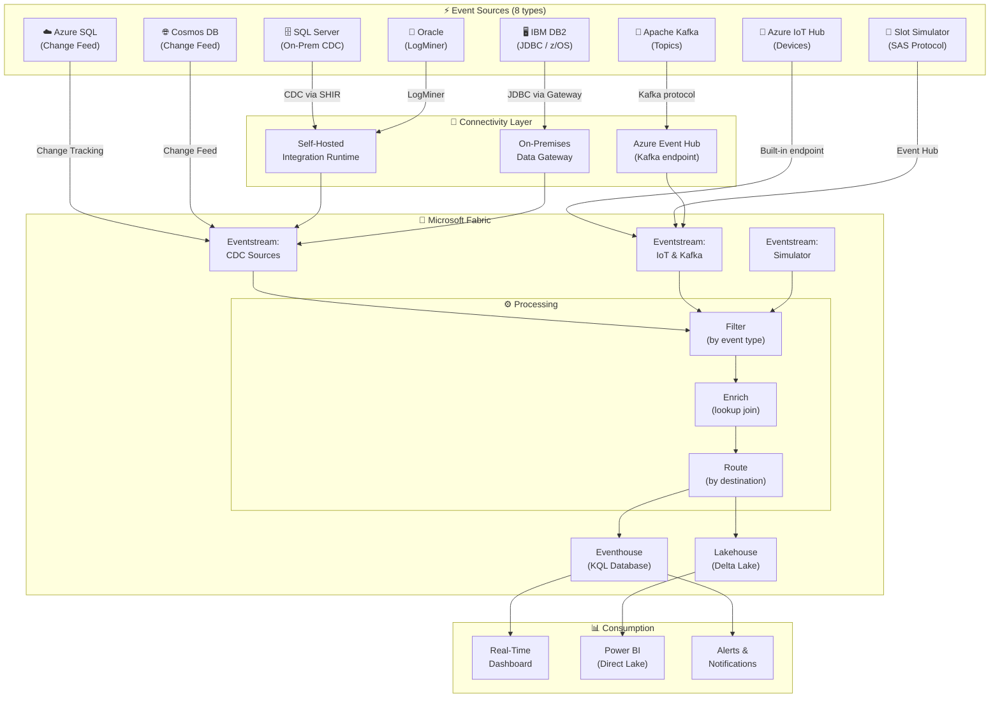
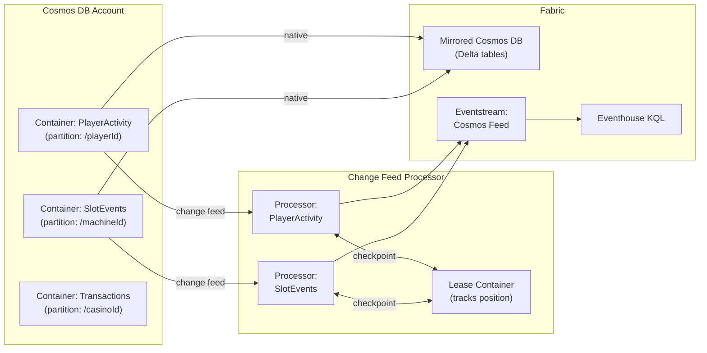
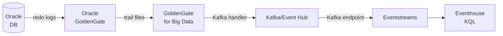

# 🌊 Tutorial 26: Multi-Source Real-Time Intelligence in Microsoft Fabric

<div align="center">


</div>

> 🏠 **[Home](../../README.md)** > 📖 **[Tutorials](../README.md)** > 🌊 **Multi-Source RTI**

---

## 🌊 Tutorial 26: Multi-Source Real-Time Intelligence

| | |
|---|---|
| **Difficulty** | ⭐⭐⭐ Advanced |
| **Time** | ⏱️ 180 minutes |
| **Focus** | Real-Time Intelligence & Event Streaming |

---

### 📊 Progress Tracker

```
┌──────┬──────┬──────┬──────┬──────┬──────┬──────┬──────┬──────┬──────┬──────┬──────┬──────┬──────┐
│  00  │  01  │  02  │  03  │  04  │  05  │  06  │  07  │  08  │  09  │  10  │  11  │  12  │  13  │
│SETUP │BRNZE │SILVR │ GOLD │  RT  │ PBI  │PIPES │ GOV  │MIRRR │AI/ML │TDATA │ SAS  │CICD  │MIGR  │
├──────┼──────┼──────┼──────┼──────┼──────┼──────┼──────┼──────┼──────┼──────┼──────┼──────┼──────┤
│  ✅  │  ✅  │  ✅  │  ✅  │  ✅  │  ✅  │  ✅  │  ✅  │  ✅  │  ✅  │  ✅  │  ✅  │  ✅  │  ✅  │
└──────┴──────┴──────┴──────┴──────┴──────┴──────┴──────┴──────┴──────┴──────┴──────┴──────┴──────┘

┌──────┬──────┬──────┬──────┬──────┬──────┬──────┬──────┬──────┬──────┬──────┬──────┬──────┐
│  14  │  15  │  16  │  17  │  18  │  19  │  20  │  21  │  22  │  23  │  24  │  25  │  26  │
│ SEC  │ COST │PERF  │ MON  │SHARE │COPLT │WKBST │ GEO  │ NET  │SHIR  │ SNW  │ DB2  │MULTI │
├──────┼──────┼──────┼──────┼──────┼──────┼──────┼──────┼──────┼──────┼──────┼──────┼──────┤
│  ✅  │  ✅  │  ✅  │  ✅  │  ✅  │  ✅  │  ✅  │  ✅  │  ✅  │  ✅  │  ✅  │  ✅  │  🔵  │
└──────┴──────┴──────┴──────┴──────┴──────┴──────┴──────┴──────┴──────┴──────┴──────┴──────┘
                                                                                          ▲
                                                                                   YOU ARE HERE
```

| Navigation | |
|---|---|
| ⬅️ **Previous** | [25-IBM DB2 Source](../25-ibm-db2-source/README.md) |
| ➡️ **Next** | [27-Video Security Analytics](../27-video-security-analytics/README.md) |

---

## 📖 Overview

Modern casino and gaming operations generate event data from **eight or more simultaneous sources** — slot machines on the floor, player tracking in loyalty systems, cage transactions in legacy mainframes, IoT sensors in HVAC and security, and real-time analytics feeds from multiple database platforms. No single source tells the complete operational story.

This tutorial teaches you how to build a **unified, multi-source Real-Time Intelligence (RTI)** pipeline in Microsoft Fabric that ingests, correlates, and surfaces insights from all eight source types simultaneously. You will configure source connectors, build Eventstreams topologies, write KQL windowed queries, and produce a live operational dashboard — giving casino operations a single, sub-second view across the entire floor.

**Why multi-source RTI matters for casino operations:**

- A slot machine jackpot must be cross-referenced with the loyalty system (was a card inserted?) and the surveillance system (which camera angle?) in under 60 seconds.
- Regulatory compliance (CTR, SAR, W-2G) requires correlating cage transactions with player activity in real time.
- Fraud detection depends on matching table game chip purchases against player card swipes across multiple legacy databases.
- Floor operations cannot act on a single data silo — they need a unified view from slot CDCs, IoT telemetry, Oracle cage systems, DB2 player history, and Kafka alert topics simultaneously.

Fabric's **Eventstreams** and **Eventhouse (KQL)** are purpose-built for this unified ingestion model. This tutorial puts all eight sources together in one cohesive architecture.

---

## 🏗️ Architecture Diagram



---

## 🎯 Learning Objectives

By the end of this tutorial, you will be able to:

- [ ] Explain the multi-source RTI architecture and when each connector type applies
- [ ] Enable SQL Server CDC and route changes through Eventstreams via SHIR
- [ ] Configure Azure SQL Change Feed with Fabric Mirroring for native integration
- [ ] Set up Cosmos DB Change Feed Processor with multi-partition handling
- [ ] Connect IBM DB2 (LUW and z/OS) via JDBC and an On-Premises Data Gateway
- [ ] Configure Oracle LogMiner CDC and the GoldenGate-to-Kafka path
- [ ] Publish and consume Kafka topics through the Eventstreams Kafka endpoint
- [ ] Route Azure IoT Hub device messages into Eventstreams for real-time ingestion
- [ ] Run the SAS protocol slot machine simulator and tune event throughput
- [ ] Write KQL tumbling, hopping, and sliding window queries for real-time aggregation
- [ ] Correlate multi-source streams by `machine_id` and `player_id` in KQL
- [ ] Build a live Real-Time Dashboard in Fabric for casino floor operations

---

## 📋 Prerequisites

Before starting this tutorial, ensure you have:

- [ ] Completed [Tutorial 00: Environment Setup](../00-environment-setup/README.md)
- [ ] Completed [Tutorial 04: Real-Time Analytics](../04-real-time-analytics/README.md)
- [ ] Completed [Tutorial 23: SHIR and Data Gateways](../23-shir-data-gateways/README.md)
- [ ] Fabric workspace with F64+ capacity (RTI requires sustained CU allocation)
- [ ] Azure Event Hub namespace (Standard tier or higher) for Kafka endpoint
- [ ] Azure IoT Hub (S1 tier minimum, 2 units recommended for 500 simulated devices)
- [ ] Access to at least two source databases for hands-on steps (SQL Server and Azure SQL are the easiest to provision)
- [ ] Self-Hosted Integration Runtime (SHIR) installed on a Windows Server with network reach to on-premises sources
- [ ] On-Premises Data Gateway installed (for IBM DB2)
- [ ] Python 3.10+ for the slot machine simulator

> **Note:** You can complete the Kafka, IoT Hub, and Simulator sections without on-premises infrastructure. SQL Server CDC requires a SHIR-accessible SQL Server instance. IBM DB2 and Oracle sections include read-only labs if you do not have those databases.

---

## 🔌 Source Connectors — At a Glance

| # | Source | Connector Type | Gateway Required | Typical Latency | Peak Throughput |
|---|--------|---------------|-----------------|-----------------|-----------------|
| 1 | SQL Server (on-prem) | Debezium / SHIR | SHIR | 2–10 seconds | 10,000+ events/sec |
| 2 | Azure SQL Database | Native (Mirroring) | None | Sub-second | 5,000+ events/sec |
| 3 | Cosmos DB | Change Feed Processor | None | Sub-second | Scales with RUs |
| 4 | IBM DB2 (LUW/z/OS) | JDBC via Gateway | On-Prem Data Gateway | 5–30 seconds | 1,000–5,000 events/sec |
| 5 | Oracle Database | LogMiner / GoldenGate | SHIR | Seconds (LM), sub-sec (GG) | 5,000–20,000 events/sec |
| 6 | Apache Kafka | Native Kafka endpoint | None | Sub-second | 100,000+ events/sec |
| 7 | Azure IoT Hub | Built-in Event Hub endpoint | None | Sub-second | Tier-dependent |
| 8 | Slot Machine Simulator | Python → Event Hub | None | Sub-second | 50–500 events/sec |

---

## 🛠️ Step 1: SQL Server CDC via Debezium and SHIR

### 1.1 Enable CDC on SQL Server

Connect to the source SQL Server as `sysadmin` and enable CDC at the database and table level:

```sql
-- Enable CDC on the database
USE CasinoDB;
GO
EXEC sys.sp_cdc_enable_db;
GO

-- Verify CDC is enabled
SELECT name, is_cdc_enabled
FROM sys.databases
WHERE name = 'CasinoDB';

-- Enable CDC on individual tables
EXEC sys.sp_cdc_enable_table
    @source_schema = N'dbo',
    @source_name   = N'SlotTransactions',
    @role_name     = NULL,
    @supports_net_changes = 1;

EXEC sys.sp_cdc_enable_table
    @source_schema = N'dbo',
    @source_name   = N'PlayerSessions',
    @role_name     = NULL,
    @supports_net_changes = 1;

-- Confirm CDC capture instances
SELECT source_schema, source_table, capture_instance, supports_net_changes
FROM cdc.change_tables;
```

> **Warning:** SQL Server Agent must be running for CDC capture jobs to execute. Verify with `SELECT status_desc FROM sys.dm_server_services WHERE servicename LIKE '%Agent%'`.

### 1.2 Verify Change Table Population

```sql
-- Check that changes are being captured
-- (Insert a test row first, then query)
INSERT INTO dbo.SlotTransactions (machine_id, coin_in, coin_out, event_time)
VALUES ('SM-0001', 5.00, 0.00, GETDATE());

-- Query CDC change table
SELECT
    __$operation,   -- 1=delete, 2=insert, 3=before-update, 4=after-update
    __$start_lsn,
    machine_id,
    coin_in,
    coin_out,
    event_time
FROM cdc.dbo_SlotTransactions_CT
ORDER BY __$start_lsn DESC;
```

### 1.3 Configure Eventstreams with SQL Server Source

In the Fabric portal:

1. Navigate to your workspace and select **New** > **Eventstream**
2. Name it `es_cdc_sql_server`
3. Click **Add source** > **SQL Server CDC**
4. Fill in the connection settings:

| Setting | Value |
|---------|-------|
| **Connection name** | `conn_casino_sqlserver` |
| **Server** | `<sqlserver-host>` |
| **Database** | `CasinoDB` |
| **Tables** | `dbo.SlotTransactions, dbo.PlayerSessions` |
| **Integration Runtime** | Select your SHIR |

5. Add a **Destination** > **Eventhouse** and map to `kql_casino_rti` database, table `SlotCDC`

> **Note:** The SHIR must be online and able to reach both the SQL Server port (1433) and the Fabric service endpoints. Verify network path with `Test-NetConnection <sqlserver-host> -Port 1433` from the SHIR host.

---

## 🛠️ Step 2: Azure SQL Change Feed and Fabric Mirroring

### 2.1 Enable Change Tracking on Azure SQL

```sql
-- Enable Change Tracking on the database
ALTER DATABASE CasinoOnline
SET CHANGE_TRACKING = ON
(CHANGE_RETENTION = 7 DAYS, AUTO_CLEANUP = ON);

-- Enable tracking on individual tables
ALTER TABLE dbo.Orders
ENABLE CHANGE_TRACKING WITH (TRACK_COLUMNS_UPDATED = ON);

ALTER TABLE dbo.CustomerActivity
ENABLE CHANGE_TRACKING WITH (TRACK_COLUMNS_UPDATED = ON);

-- Verify
SELECT DB_NAME(database_id) AS database_name, is_change_tracking_on
FROM sys.change_tracking_databases;
```

### 2.2 Configure Fabric Mirroring (Recommended Path)

Fabric Mirroring for Azure SQL provides near-zero-latency replication without a SHIR. This is the preferred path over manual pipeline polling.

1. In the Fabric portal, select **New** > **Mirrored Azure SQL Database**
2. Name it `mirror_casino_azure_sql`
3. Click **Configure connection** and enter Azure SQL credentials
4. Under **Tables**, select the tables to mirror:
   - `dbo.Orders`
   - `dbo.CustomerActivity`
   - `dbo.Products`
5. Click **Mirror database** — initial snapshot starts immediately

```python
# Fabric Notebook: Verify mirroring replication lag
from pyspark.sql.functions import current_timestamp, col, unix_timestamp

df = spark.table("mirror_casino_azure_sql.dbo_CustomerActivity")

# Check freshness (last_modified should be within seconds of now)
df.select(
    col("customer_id"),
    col("last_modified"),
    (unix_timestamp(current_timestamp()) - unix_timestamp(col("last_modified"))).alias("lag_seconds")
).orderBy("lag_seconds", ascending=False).show(10)
```

### 2.3 Route Mirrored Data into Eventstreams

For scenarios requiring real-time event routing (filters, enrichment, fan-out), create an Eventstream that reads the mirrored Delta table via OneLake:

```python
# Fabric Notebook: Stream mirrored table changes using Delta table streaming
from pyspark.sql.types import StructType, StructField, StringType, TimestampType, DecimalType

# Read as streaming Delta source (micro-batch)
df_stream = spark.readStream \
    .format("delta") \
    .option("readChangeFeed", "true") \
    .option("startingVersion", 0) \
    .table("mirror_casino_azure_sql.dbo_CustomerActivity")

# Write changes to Eventhouse via Kafka endpoint
df_stream.writeStream \
    .format("kafka") \
    .option("kafka.bootstrap.servers", "<eventhouse-kafka-endpoint>:9093") \
    .option("kafka.security.protocol", "SASL_SSL") \
    .option("kafka.sasl.mechanism", "PLAIN") \
    .option("kafka.sasl.jaas.config",
            "org.apache.kafka.common.security.plain.PlainLoginModule required "
            "username='$ConnectionString' password='<eventhub-connection-string>';") \
    .option("topic", "azure-sql-customer-activity") \
    .option("checkpointLocation", "Files/checkpoints/azure_sql_stream") \
    .start()
```

---

## 🛠️ Step 3: Cosmos DB Change Feed with Multi-Partition Handling

### 3.1 Understanding Cosmos DB Change Feed

The Cosmos DB Change Feed emits every insert and update (not deletes by default) in partition-key order. Fabric Mirroring for Cosmos DB natively consumes this feed — no code required for the baseline path.



### 3.2 Enable Fabric Mirroring for Cosmos DB

1. **Fabric portal** > **New** > **Mirrored Azure Cosmos DB**
2. Select your Cosmos DB account and database `CasinoOperations`
3. Choose containers: `PlayerActivity`, `SlotEvents`, `Transactions`
4. Click **Mirror** — continuous replication begins

> **Note:** Cosmos DB Mirroring supports the NoSQL API (formerly SQL API). MongoDB API requires the custom Change Feed Processor path below.

### 3.3 Custom Change Feed Processor (for MongoDB API or Fine-Grained Routing)

```python
# Azure Function or Fabric Notebook: Custom Change Feed Processor
import asyncio
from azure.cosmos.aio import CosmosClient
from azure.cosmos.partition_key import PartitionKey
import json

COSMOS_ENDPOINT = "https://casino-cosmos.documents.azure.com:443/"
COSMOS_KEY = mssparkutils.credentials.getSecret("casino-kv", "cosmos-key")
DATABASE_NAME = "CasinoOperations"
CONTAINER_NAME = "SlotEvents"
LEASE_CONTAINER = "leases"

async def process_changes(docs, context):
    """Process a batch of change feed documents."""
    for doc in docs:
        # Route high-value events to priority stream
        if doc.get("coin_in", 0) > 100:
            await send_to_event_hub(doc, topic="casino.high-value-slots")
        else:
            await send_to_event_hub(doc, topic="casino.slot-events")

async def send_to_event_hub(event: dict, topic: str):
    """Send event to Event Hub / Eventstreams Kafka endpoint."""
    from azure.eventhub.aio import EventHubProducerClient
    from azure.eventhub import EventData

    producer = EventHubProducerClient.from_connection_string(
        conn_str=mssparkutils.credentials.getSecret("casino-kv", "eventhub-conn"),
        eventhub_name=topic
    )
    async with producer:
        batch = await producer.create_batch()
        batch.add(EventData(json.dumps(event)))
        await producer.send_batch(batch)
```

### 3.4 Handling Multi-Partition Change Feed at Scale

```python
# PySpark: Read Cosmos DB Change Feed with parallel partition processing
# Uses the Cosmos DB Spark Connector (3.x)
df_cosmos_stream = spark.readStream \
    .format("cosmos.oltp.changeFeed") \
    .option("spark.synapse.linkedService", "cosmos_casino_operations") \
    .option("spark.cosmos.container", "SlotEvents") \
    .option("spark.cosmos.changeFeed.mode", "Incremental") \
    .option("spark.cosmos.changeFeed.startFrom", "Beginning") \
    .option("spark.cosmos.read.partitioning.strategy", "Restrictive") \
    .load()

# Write to Eventhouse via Kafka endpoint
df_cosmos_stream \
    .selectExpr("CAST(id AS STRING) AS key", "to_json(struct(*)) AS value") \
    .writeStream \
    .format("kafka") \
    .option("kafka.bootstrap.servers", "<eventhouse-kafka>:9093") \
    .option("topic", "casino.cosmos-slot-events") \
    .option("checkpointLocation", "Files/checkpoints/cosmos_slots") \
    .start()
```

---

## 🛠️ Step 4: IBM DB2 CDC via JDBC and On-Premises Data Gateway

### 4.1 Gateway Setup and DB2 JDBC Driver

1. Download the IBM DB2 JDBC driver (`db2jcc4.jar`) from [IBM Fix Central](https://www.ibm.com/support/fixcentral/)
2. Place it in the On-Premises Data Gateway custom connectors folder: `C:\Program Files\On-premises data gateway\Microsoft.PowerBI.DataMovement.Pipeline.GatewayCore.dll` (alongside the gateway runtime)
3. Restart the gateway service

> **Warning:** IBM does not allow redistribution of its JDBC driver. Each installation requires a valid IBM entitlement. Ensure your organization has the appropriate IBM license before downloading.

### 4.2 DB2 LUW: Configure ASN Replication Tables

```sql
-- On IBM DB2 LUW (Linux/Unix/Windows) as db2admin
-- Enable SQL replication capture
CALL SYSPROC.ADMIN_CMD('db2look -d CASINODB -e -o schema.sql');

-- Create replication control tables (run ASN scripts)
-- db2 -td@ -f /opt/ibm/db2/V11.5/misc/asnctlw.sql

-- Enable capture for a table
CREATE TABLE DB2ADMIN.IBMSNAP_REGISTER (
    SOURCE_OWNER  VARCHAR(30),
    SOURCE_TABLE  VARCHAR(128),
    SOURCE_VIEW_QUAL SMALLINT,
    -- ... (full ASN schema abbreviated)
    PRIMARY KEY (SOURCE_OWNER, SOURCE_TABLE, SOURCE_VIEW_QUAL)
);
```

### 4.3 DB2 z/OS Considerations (Mainframe)

| Consideration | Detail |
|---------------|--------|
| **Character encoding** | EBCDIC on z/OS requires UTF-8 conversion in JDBC (`charsetName=UTF-8`) |
| **Packed decimal** | DB2 `DECIMAL` maps to Java `BigDecimal`; use `DecimalType` in Spark |
| **Subsystem access** | JDBC connects to a DB2 location (not a database name): `jdbc:db2://mfhost:446/CASINO` |
| **CDC mechanism** | IIDR (InfoSphere Data Replication) or Classic CDC from Precisely |
| **Security** | RACF authorization required for the gateway service account |

### 4.4 Data Factory Pipeline: DB2 to Lakehouse

```json
{
    "name": "pl_db2_incremental_casino",
    "activities": [
        {
            "name": "Copy DB2 Legacy Transactions",
            "type": "Copy",
            "typeProperties": {
                "source": {
                    "type": "Db2Source",
                    "query": "SELECT * FROM CASINO.LEGACY_TRANSACTIONS WHERE UPDATED_AT > ? ORDER BY UPDATED_AT",
                    "partitionOption": "None"
                },
                "sink": {
                    "type": "LakehouseTableSink",
                    "tableActionOption": "MergeSchema",
                    "partitionOption": "None"
                }
            },
            "inputs": [{"referenceName": "ds_db2_casino", "type": "DatasetReference"}],
            "outputs": [{"referenceName": "ds_lakehouse_bronze_db2", "type": "DatasetReference"}]
        }
    ]
}
```

```python
# Fabric Notebook: Read DB2 via JDBC (with gateway-resolved connection)
df_db2 = spark.read \
    .format("jdbc") \
    .option("url", "jdbc:db2://<db2-host>:50000/CASINODB") \
    .option("dbtable", "(SELECT * FROM CASINO.LEGACY_TRANSACTIONS WHERE UPDATED_AT > '2024-01-01') AS legacy") \
    .option("driver", "com.ibm.db2.jcc.DB2Driver") \
    .option("user", mssparkutils.credentials.getSecret("casino-kv", "db2-user")) \
    .option("password", mssparkutils.credentials.getSecret("casino-kv", "db2-password")) \
    .option("numPartitions", 8) \
    .option("partitionColumn", "TRANSACTION_ID") \
    .option("lowerBound", "1") \
    .option("upperBound", "10000000") \
    .option("fetchsize", "50000") \
    .load()

df_db2.write \
    .mode("append") \
    .format("delta") \
    .saveAsTable("bronze_db2_legacy_transactions")

print(f"Loaded {df_db2.count():,} rows from DB2")
```

---

## 🛠️ Step 5: Oracle CDC via LogMiner and GoldenGate

### 5.1 Prepare Oracle for LogMiner CDC

```sql
-- Connect as SYSDBA
-- Step 1: Enable ARCHIVELOG mode (requires restart)
SHUTDOWN IMMEDIATE;
STARTUP MOUNT;
ALTER DATABASE ARCHIVELOG;
ALTER DATABASE OPEN;

-- Step 2: Enable supplemental logging
ALTER DATABASE ADD SUPPLEMENTAL LOG DATA;
ALTER DATABASE ADD SUPPLEMENTAL LOG DATA (ALL) COLUMNS;

-- Step 3: Create a dedicated CDC user
CREATE USER fabric_cdc IDENTIFIED BY "SecureP@ss123";
GRANT CREATE SESSION TO fabric_cdc;
GRANT SELECT ANY TABLE TO fabric_cdc;
GRANT LOGMINING TO fabric_cdc;
GRANT SELECT ON V_$LOGMNR_CONTENTS TO fabric_cdc;
GRANT SELECT ON V_$ARCHIVED_LOG TO fabric_cdc;
GRANT EXECUTE ON DBMS_LOGMNR TO fabric_cdc;
GRANT EXECUTE ON DBMS_LOGMNR_D TO fabric_cdc;

-- Step 4: Verify archivelog status
SELECT LOG_MODE FROM V$DATABASE;
-- Expected: ARCHIVELOG
```

### 5.2 Two Oracle CDC Paths

**Path A: LogMiner (lower cost, higher latency)**

```python
# Fabric Notebook: Oracle LogMiner via Debezium Connector
# Run as Kafka Connect worker pointed at Eventstreams Kafka endpoint

debezium_config = {
    "name": "oracle-cdc-casino",
    "config": {
        "connector.class": "io.debezium.connector.oracle.OracleConnector",
        "database.hostname": "<oracle-host>",
        "database.port": "1521",
        "database.user": "fabric_cdc",
        "database.password": "SecureP@ss123",
        "database.dbname": "CASINODB",
        "database.pdb.name": "CASINO_PDB",
        "table.include.list": "CASINO.SLOT_TRANSACTIONS,CASINO.CAGE_OPERATIONS",
        "database.history.kafka.bootstrap.servers": "<eventstream-kafka>:9093",
        "database.history.kafka.topic": "oracle-schema-history",
        "transforms": "route",
        "transforms.route.type": "org.apache.kafka.connect.transforms.ReplaceField$Value",
        "key.converter": "org.apache.kafka.connect.json.JsonConverter",
        "value.converter": "org.apache.kafka.connect.json.JsonConverter"
    }
}

import json, requests
response = requests.post(
    "http://kafka-connect-host:8083/connectors",
    headers={"Content-Type": "application/json"},
    data=json.dumps(debezium_config)
)
print(response.status_code, response.json())
```

**Path B: GoldenGate (sub-second, enterprise scale)**



GoldenGate for Big Data's Kafka Handler writes directly to Event Hub (Kafka-compatible):

```properties
# GoldenGate for Big Data: Kafka Handler config (kafkahandler.props)
gg.handlerlist=kafkahandler
gg.handler.kafkahandler.type=kafka
gg.handler.kafkahandler.kafkaProducerConfigFile=kafkaproducer.properties
gg.handler.kafkahandler.topicMappingTemplate=${schemaName}.${tableName}
gg.handler.kafkahandler.keyMappingTemplate=${primaryKeys}
gg.handler.kafkahandler.format=json
gg.handler.kafkahandler.mode=op
goldengate.userexit.writers=javawriter
javawriter.stats.display=TRUE
```

```properties
# kafkaproducer.properties — point to Eventstreams Kafka endpoint
bootstrap.servers=<your-eventhub-namespace>.servicebus.windows.net:9093
security.protocol=SASL_SSL
sasl.mechanism=PLAIN
sasl.jaas.config=org.apache.kafka.common.security.plain.PlainLoginModule required \
  username="$ConnectionString" \
  password="Endpoint=sb://<namespace>.servicebus.windows.net/;SharedAccessKeyName=RootManageSharedAccessKey;SharedAccessKey=<key>";
```

---

## 🛠️ Step 6: Kafka Integration via Eventstreams Native Endpoint

### 6.1 Eventstreams Kafka Endpoint

Eventstreams exposes a Kafka-compatible endpoint — existing Kafka producers send events to it without code changes.

```python
# Python producer: Send to Eventstreams Kafka endpoint
from confluent_kafka import Producer
import json, uuid
from datetime import datetime, timezone

KAFKA_CONFIG = {
    "bootstrap.servers": "<your-fabric-workspace>.servicebus.windows.net:9093",
    "security.protocol": "SASL_SSL",
    "sasl.mechanisms": "PLAIN",
    "sasl.username": "$ConnectionString",
    "sasl.password": "Endpoint=sb://<namespace>.servicebus.windows.net/;SharedAccessKeyName=send;SharedAccessKey=<key>="
}

producer = Producer(KAFKA_CONFIG)

def send_slot_event(machine_id: str, coin_in: float, coin_out: float) -> None:
    event = {
        "event_id": str(uuid.uuid4()),
        "machine_id": machine_id,
        "coin_in": coin_in,
        "coin_out": coin_out,
        "timestamp": datetime.now(timezone.utc).isoformat(),
        "source": "kafka_floor_system"
    }
    producer.produce(
        topic="casino.slot-events",
        key=machine_id,
        value=json.dumps(event).encode("utf-8"),
        callback=lambda err, msg: print(f"Delivered to {msg.topic()}:{msg.partition()}" if not err else f"Error: {err}")
    )

# Simulate floor events
for i in range(1000):
    send_slot_event(f"SM-{i % 500:04d}", round(i * 0.25, 2), round(i * 0.20, 2))

producer.flush()
```

### 6.2 Schema Registry Integration

For Avro-serialized events with schema validation:

```python
# Confluent Schema Registry + Avro serializer
from confluent_kafka.schema_registry import SchemaRegistryClient
from confluent_kafka.schema_registry.avro import AvroSerializer
from confluent_kafka.serialization import SerializationContext, MessageField

SLOT_EVENT_SCHEMA = """
{
  "type": "record",
  "name": "SlotEvent",
  "namespace": "com.casino.events",
  "fields": [
    {"name": "event_id",    "type": "string"},
    {"name": "machine_id",  "type": "string"},
    {"name": "coin_in",     "type": "double"},
    {"name": "coin_out",    "type": "double"},
    {"name": "timestamp",   "type": "string"},
    {"name": "game_id",     "type": ["null", "string"], "default": null}
  ]
}
"""

schema_registry_client = SchemaRegistryClient({"url": "https://casino-schema-registry:8081"})
avro_serializer = AvroSerializer(
    schema_registry_client=schema_registry_client,
    schema_str=SLOT_EVENT_SCHEMA
)

# Use avro_serializer as the value_serializer in your producer
```

### 6.3 Eventstreams: Add Kafka Source

1. Create an Eventstream named `es_kafka_floor`
2. **Add source** > **Custom App** > copy the Kafka connection string
3. Configure your existing Kafka producers to use this endpoint
4. Add a **Destination** > **Eventhouse** > table `KafkaSlotEvents`

---

## 🛠️ Step 7: Azure IoT Hub Device Ingestion

### 7.1 IoT Hub: Device Provisioning

```python
# Azure CLI: Create IoT Hub and register device types
# (Run in Azure Cloud Shell or locally with az CLI)

# Create IoT Hub
az iot hub create \
    --name casino-iot-hub \
    --resource-group casino-rg \
    --sku S1 \
    --unit 2

# Register a slot machine device
az iot hub device-identity create \
    --hub-name casino-iot-hub \
    --device-id SM-0001 \
    --auth-method shared_private_key

# Get device connection string
az iot hub device-identity connection-string show \
    --hub-name casino-iot-hub \
    --device-id SM-0001 \
    --output tsv
```

### 7.2 IoT Device Telemetry Payload

```python
# Device-side Python code (runs on casino floor controller)
from azure.iot.device import IoTHubDeviceClient, Message
import json, time, random
from datetime import datetime, timezone

DEVICE_CONNECTION_STRING = "HostName=casino-iot-hub.azure-devices.net;DeviceId=SM-0001;SharedAccessKey=<key>"

client = IoTHubDeviceClient.create_from_connection_string(DEVICE_CONNECTION_STRING)
client.connect()

def send_telemetry(machine_id: str, denomination: float) -> None:
    payload = {
        "machine_id": machine_id,
        "denomination": denomination,
        "coin_in": round(random.uniform(0.25, 500.0), 2),
        "coin_out": round(random.uniform(0.0, 450.0), 2),
        "games_played": random.randint(1, 50),
        "jackpot_triggered": random.random() < 0.001,
        "door_open": False,
        "status": "operational",
        "timestamp": datetime.now(timezone.utc).isoformat()
    }
    message = Message(json.dumps(payload))
    message.content_type = "application/json"
    message.content_encoding = "utf-8"
    client.send_message(message)

# Send telemetry every 5 seconds
while True:
    send_telemetry("SM-0001", 0.25)
    time.sleep(5)
```

### 7.3 Route IoT Hub to Eventstreams

1. In the Fabric portal, open your Eventstream (`es_iot_hub`)
2. **Add source** > **Azure IoT Hub**
3. Configure:

| Setting | Value |
|---------|-------|
| **IoT Hub** | `casino-iot-hub` |
| **Consumer group** | `fabric-rti` (create dedicated group) |
| **Shared access policy** | `iothubowner` (read-only recommended in production) |

4. Add transformation: **Manage Fields** — project `machine_id`, `coin_in`, `coin_out`, `timestamp`
5. Add destination: **Eventhouse** > table `IoTSlotTelemetry`

> **Note:** Create a dedicated consumer group for Fabric in IoT Hub: `az iot hub consumer-group create --hub-name casino-iot-hub --name fabric-rti`. Sharing the `$Default` group with other consumers causes missed events.

---

## 🛠️ Step 8: Slot Machine Simulator (SAS Protocol)

### 8.1 SAS Protocol Overview

The **Slot Accounting System (SAS)** protocol is the industry standard for slot machine telemetry. It defines over 100 message types covering meters, events, and configuration data. This simulator generates realistic SAS-formatted events and publishes them to Event Hub.

### 8.2 Run the Simulator

```bash
# Install dependencies
pip install azure-eventhub faker python-dateutil

# Run the simulator (from repo root)
python data_generation/generators/streaming/iot_device_simulator.py \
    --num-machines 500 \
    --events-per-second 100 \
    --destination eventhub \
    --connection-string "Endpoint=sb://casino-eh.servicebus.windows.net/;SharedAccessKeyName=send;SharedAccessKey=<key>=" \
    --eventhub-name casino-slot-simulator \
    --duration-minutes 60
```

### 8.3 Simulator Configuration

```python
# data_generation/generators/streaming/simulator_config.py
from dataclasses import dataclass
from typing import Literal

@dataclass
class SimulatorConfig:
    num_machines: int = 500
    events_per_second: int = 100
    destination: Literal["eventhub", "iothub", "kafka", "stdout"] = "eventhub"
    connection_string: str = ""
    eventhub_name: str = "casino-slot-simulator"
    duration_minutes: int = 60

    # SAS event distribution (% of total events)
    spin_result_pct: float = 0.70      # 70% spin results
    meter_read_pct: float = 0.10       # 10% meter reads
    coin_in_pct: float = 0.08          # 8% coin-in events
    coin_out_pct: float = 0.07         # 7% coin-out events
    jackpot_pct: float = 0.001         # 0.1% jackpots
    door_event_pct: float = 0.005      # 0.5% door events
    tilt_pct: float = 0.002            # 0.2% tilts
    power_event_pct: float = 0.043     # remaining

    # Casino floor configuration
    denominations: list = None

    def __post_init__(self):
        self.denominations = [0.01, 0.05, 0.25, 1.00, 5.00, 25.00, 100.00]
```

### 8.4 Throughput Tuning

| Target Events/sec | Batch Size | Parallel Senders | Event Hub Partitions |
|-------------------|------------|------------------|----------------------|
| 100 | 50 | 2 | 4 |
| 500 | 100 | 5 | 8 |
| 2,000 | 200 | 10 | 16 |
| 10,000 | 500 | 20 | 32 |

```python
# Optimized batch sender for high throughput
from azure.eventhub.aio import EventHubProducerClient
from azure.eventhub import EventData
import asyncio, json

async def send_batch(producer: EventHubProducerClient, events: list[dict]) -> None:
    """Send a batch of events — maximizes throughput by filling batch to limit."""
    batch = await producer.create_batch()
    for event in events:
        try:
            batch.add(EventData(json.dumps(event)))
        except ValueError:
            # Batch full — send and start new batch
            await producer.send_batch(batch)
            batch = await producer.create_batch()
            batch.add(EventData(json.dumps(event)))
    if len(batch) > 0:
        await producer.send_batch(batch)
```

---

## ⚙️ Event Processing Patterns

### 9.1 KQL Windowed Aggregations

Eventhouse processes all eight streams through a unified KQL database. Three window types cover the common casino analytics use cases:

**Tumbling Window — 5-minute coin-in totals:**

```kql
// Tumbling window: fixed, non-overlapping 5-minute buckets
SlotCDC
| where EventType == "spin_result"
| summarize
    TotalCoinIn  = sum(CoinIn),
    TotalCoinOut = sum(CoinOut),
    SpinCount    = count(),
    MachineCount = dcount(MachineId)
  by bin(EventTime, 5m)
| order by EventTime desc
```

**Hopping Window — rolling 10-minute average with 1-minute hop:**

```kql
// Hopping window: overlapping windows (use series_stats for rolling)
SlotCDC
| where EventTime > ago(2h)
| make-series AvgCoinIn = avg(CoinIn) on EventTime from ago(2h) to now() step 1m
| mv-expand EventTime, AvgCoinIn
| extend RollingAvg = series_stats_dynamic(pack_array(AvgCoinIn))
```

**Sliding Window — jackpot anomaly detection (3+ jackpots on one machine in 10 minutes):**

```kql
// Sliding window: alert when same machine has 3+ jackpots within 10 minutes
let JackpotEvents = SlotCDC
    | where EventType == "jackpot"
    | project MachineId, EventTime, Amount;
JackpotEvents
| join kind=inner JackpotEvents on MachineId
| where abs(EventTime - EventTime1) <= 10m and EventTime1 > EventTime
| summarize JackpotCount = count() by MachineId, bin(EventTime, 10m)
| where JackpotCount >= 3
| project MachineId, WindowStart = EventTime, JackpotCount
| order by JackpotCount desc
```

### 9.2 Handling Late-Arriving Events

```kql
// Use ingestion_time() for ordering — event_time for business logic
// This handles clock skew from on-premises sources (DB2, Oracle)
SlotCDC
| extend IngestionDelay = ingestion_time() - EventTime
| where IngestionDelay < 5m   // Discard events older than 5 minutes
| summarize count() by MachineId, bin(EventTime, 1m)
```

### 9.3 Deduplication Across Sources

The same transaction may arrive from SQL Server CDC and Cosmos DB simultaneously:

```kql
// Deduplicate by EventId + SourceSystem within a 5-minute window
SlotCDC
| summarize arg_min(IngestionTime, *) by EventId, SourceSystem
| where IngestionTime > ago(5m)
```

---

## 🔗 Multi-Source Stream Correlation

### 10.1 Correlate Slot CDC with IoT Telemetry

```kql
// Join SlotCDC (database changes) with IoT telemetry (sensor readings)
// Match by machine_id within a 30-second time window
let WindowSeconds = 30;
SlotCDC
| where EventTime > ago(1h)
| join kind=inner (
    IoTSlotTelemetry
    | where Timestamp > ago(1h)
) on $left.MachineId == $right.machine_id
| where abs(EventTime - Timestamp) <= WindowSeconds * 1s
| project
    MachineId,
    CDCEventType  = EventType,
    CDCCoinIn     = CoinIn,
    IoTCoinIn     = coin_in,
    CoinInDelta   = abs(CoinIn - coin_in),
    CDCTime       = EventTime,
    IoTTime       = Timestamp
| where CoinInDelta > 1.0  // Flag discrepancies > $1
| order by CoinInDelta desc
```

### 10.2 Correlate Player Activity Across All Sources

```kql
// Unified player view: CDC (loyalty DB) + Cosmos DB (activity) + Kafka (alerts)
let PlayerCDC = SlotCDC
    | where isnotempty(PlayerId)
    | summarize CDCTransactions = count(), CDCCoinIn = sum(CoinIn) by PlayerId, bin(EventTime, 15m);

let CosmosActivity = CosmosPlayerActivity
    | summarize CosmosEvents = count() by PlayerId = tostring(playerId), bin(Timestamp, 15m);

let KafkaAlerts = KafkaSlotEvents
    | where EventType == "security_alert"
    | summarize AlertCount = count() by PlayerId, bin(EventTime, 15m);

PlayerCDC
| join kind=leftouter CosmosActivity on PlayerId, $left.EventTime == $right.Timestamp
| join kind=leftouter KafkaAlerts    on PlayerId, $left.EventTime == $right.EventTime
| project
    PlayerId,
    WindowStart     = EventTime,
    CDCTransactions,
    CDCCoinIn,
    CosmosEvents    = coalesce(CosmosEvents, 0),
    AlertCount      = coalesce(AlertCount, 0)
| where AlertCount > 0 or CDCCoinIn > 5000  // Flag high-value or alerted players
| order by CDCCoinIn desc
```

---

## 📊 Real-Time Dashboard

### 11.1 KQL Queries for Live Tiles

Add these as tiles to a Fabric Real-Time Dashboard connected to your Eventhouse:

**Floor Overview — current CU utilization by source:**

```kql
// Event volume by source in last 5 minutes
union
    (SlotCDC            | where ingestion_time() > ago(5m) | extend Source = "SQL Server CDC"),
    (IoTSlotTelemetry   | where ingestion_time() > ago(5m) | extend Source = "IoT Hub"),
    (KafkaSlotEvents    | where ingestion_time() > ago(5m) | extend Source = "Kafka"),
    (CosmosPlayerActivity | where ingestion_time() > ago(5m) | extend Source = "Cosmos DB")
| summarize EventCount = count() by Source
| order by EventCount desc
```

**Top 10 Active Machines — coin-in last 15 minutes:**

```kql
SlotCDC
| where EventTime > ago(15m) and EventType == "spin_result"
| summarize
    CoinIn    = sum(CoinIn),
    SpinCount = count()
  by MachineId
| top 10 by CoinIn desc
| project MachineId, CoinIn, SpinCount, HoldPct = round((CoinIn - sum(CoinOut)) / CoinIn * 100, 1)
```

**Jackpot Alert Feed — last 30 minutes:**

```kql
SlotCDC
| where EventTime > ago(30m) and EventType == "jackpot"
| project EventTime, MachineId, PlayerId, Amount = CoinOut
| order by EventTime desc
| take 20
```

**Regulatory Watch — transactions approaching CTR threshold ($10,000):**

```kql
// Cosmos DB transactions: flag players approaching CTR threshold
CosmosPlayerActivity
| where Timestamp > ago(24h)
| summarize DailyTotal = sum(todouble(amount)) by tostring(playerId)
| where DailyTotal between (8000.0 .. 10000.0)
| project PlayerId = playerId, DailyTotal, CTRRisk = "HIGH"
| order by DailyTotal desc
```

---

## ✅ Validation Checklist

Before considering the multi-source RTI pipeline production-ready, verify:

- [ ] **SQL Server CDC** - Change table populated; Eventstream receiving events within 10 seconds of insert
- [ ] **Azure SQL Mirroring** - Replication lag under 5 seconds; no schema drift errors
- [ ] **Cosmos DB Change Feed** - All partitions processing; lease container updated per partition
- [ ] **IBM DB2 JDBC** - Gateway healthy; incremental load pulling new rows; EBCDIC encoding correct
- [ ] **Oracle LogMiner** - Supplemental logging confirmed; archived logs accessible; no LogMiner gaps
- [ ] **Kafka Endpoint** - Topic offsets advancing; consumer group `fabric-rti` tracking correctly
- [ ] **IoT Hub** - Device twin reported properties current; dedicated consumer group active
- [ ] **Slot Simulator** - Events flowing at target rate; Event Hub backlog ≤ 1 minute
- [ ] **KQL Tables** - All 8 source tables receiving data; `ingestion_time()` within expected lag
- [ ] **Multi-Source Join** - Correlation query returns results without fan-out (check row counts)
- [ ] **Dashboard** - All tiles refreshing; alert queries returning expected rows

---

## 🔧 Troubleshooting

| Issue | Likely Cause | Resolution |
|-------|-------------|------------|
| SQL Server CDC events stop after hours | SQL Server Agent restarted | Restart agent; CDC jobs restart automatically |
| Azure SQL Mirroring stuck in "Initializing" | Firewall rule missing | Add Fabric service tag to Azure SQL firewall |
| Cosmos DB lease container conflicts | Multiple processors sharing same lease | Use unique `LeaseContainerPrefix` per processor |
| DB2 JDBC timeout | Gateway node unreachable | Check gateway service on-prem; test port 50000 |
| Oracle LogMiner `ORA-01291: missing logfile` | Archived log purged before mining | Reduce archive log retention or increase mining frequency |
| Kafka consumer lag growing | Eventstreams partition count too low | Increase Eventstream parallelism or add CU capacity |
| IoT Hub events missing | Consumer group exhausted (max 5) | Delete unused consumer groups; use dedicated group per consumer |
| Simulator throughput below target | Event Hub throttling (S1 limit) | Upgrade to S2 or increase partition count |
| KQL join producing Cartesian product | Many-to-many join on non-unique key | Add time window predicate or `arg_min` dedup before join |
| Late events exceeding watermark | On-prem source clock skew or batch delay | Extend watermark to 15m; use `ingestion_time()` for windowing |

---

## 📐 Best Practices

**Source Configuration**

1. Always create a dedicated service account per source — do not reuse admin credentials for CDC connections.
2. For on-premises sources, install SHIR and On-Premises Data Gateway on separate Windows Server VMs to isolate workloads.
3. Enable SQL Server CDC only on tables that require real-time tracking — CDC generates log activity that impacts source database performance.

**Eventstreams Design**

4. Use one Eventstream per logical group of sources (CDC sources, IoT sources, simulator) rather than one giant stream — this isolates failures and simplifies debugging.
5. Add a **Manage Fields** transformation in each Eventstream to project only required columns before writing to Eventhouse — this reduces storage and query cost.
6. Set appropriate consumer group names everywhere — `$Default` is shared and causes event loss in multi-consumer scenarios.

**KQL / Eventhouse**

7. Pre-create target tables with explicit schemas in Eventhouse rather than relying on auto-create — schema inference from JSON can produce suboptimal column types.
8. Use `ingestion_time()` for windowing when source event timestamps are unreliable (common with DB2 and Oracle batch pulls).
9. Add a `SourceSystem` string column to every table (populated in the Eventstream transformation) so multi-source union queries can filter by origin without table-per-source proliferation.

**Operations**

10. Monitor Eventstream metrics (events/second, ingestion lag, error count) in the Fabric Monitoring Hub — set alerts at 2x normal ingestion lag.
11. For Oracle and DB2 sources, schedule a daily validation notebook that compares CDC row counts against source table counts to detect missed events.
12. Document the Event Hub consumer groups in your runbook — a common outage cause is a new team member creating an extra consumer group and exhausting the limit.

---

## 🎉 Summary and Next Steps

Congratulations — you have built a production-pattern multi-source RTI architecture in Microsoft Fabric. Across this tutorial you:

- Enabled CDC on SQL Server and Oracle, configured Change Tracking on Azure SQL, and wired Cosmos DB Change Feed
- Connected IBM DB2 (including z/OS considerations) and Oracle via JDBC and GoldenGate respectively
- Routed Kafka topics directly into Eventstreams via the native Kafka endpoint
- Provisioned IoT Hub device ingestion with a dedicated consumer group
- Ran the SAS protocol slot machine simulator at configurable throughput
- Wrote KQL tumbling, hopping, and sliding window queries to aggregate and correlate the unified stream
- Built a real-time dashboard with regulatory compliance watch tiles

The unified view from all eight sources gives casino operations unprecedented situational awareness — from jackpot verification to CTR threshold monitoring to cross-source machine anomaly detection.

**Recommended next tutorials:**

- [Tutorial 27: Video Security Analytics](../27-video-security-analytics/README.md) — Add surveillance camera feeds to the RTI picture
- [Tutorial 04: Real-Time Analytics](../04-real-time-analytics/README.md) — Review foundational Eventhouse and KQL patterns
- [Tutorial 07: Governance and Purview](../07-governance-purview/README.md) — Apply data lineage tracking to multi-source pipelines

---

## 📁 Resources

| Resource | Description |
|----------|-------------|
| [`data_generation/config/streaming_sources.yaml`](../../data_generation/config/streaming_sources.yaml) | Full connector registry for all 8 sources |
| [`data_generation/generators/streaming/`](../../data_generation/generators/streaming/) | Slot machine IoT simulator implementation |
| [`validation/unit_tests/streaming/`](../../validation/unit_tests/streaming/) | Unit tests for streaming generators |

**External Documentation:**

- [Eventstreams in Microsoft Fabric](https://learn.microsoft.com/en-us/fabric/real-time-intelligence/event-streams/overview)
- [Eventhouse and KQL Database overview](https://learn.microsoft.com/en-us/fabric/real-time-intelligence/eventhouse)
- [Azure SQL Mirroring in Fabric](https://learn.microsoft.com/en-us/fabric/database/mirrored-database/azure-sql-database)
- [Cosmos DB Mirroring in Fabric](https://learn.microsoft.com/en-us/fabric/database/mirrored-database/azure-cosmos-db)
- [SQL Server CDC documentation](https://learn.microsoft.com/en-us/sql/relational-databases/track-changes/about-change-data-capture-sql-server)
- [Oracle GoldenGate for Big Data Kafka Handler](https://docs.oracle.com/en/middleware/goldengate/big-data/21.1/gadbd/using-kafka-handler.html)
- [Azure IoT Hub built-in Event Hub endpoint](https://learn.microsoft.com/en-us/azure/iot-hub/iot-hub-devguide-messages-read-builtin)
- [Debezium Oracle Connector](https://debezium.io/documentation/reference/stable/connectors/oracle.html)
- [SAS Protocol reference (IGT/Aristocrat)](https://www.gaming.nv.gov/modules/showdocument.aspx?documentid=12038)

---

## 🧭 Navigation

| ⬅️ Previous | ⬆️ Up | ➡️ Next |
|------------|------|--------|
| [25-IBM DB2 Source](../25-ibm-db2-source/README.md) | [Tutorials Index](../README.md) | [27-Video Security Analytics](../27-video-security-analytics/README.md) |

---

> 💬 **Questions or issues?** Open an issue in the [GitHub repository](https://github.com/frgarofa/Suppercharge_Microsoft_Fabric/issues).
