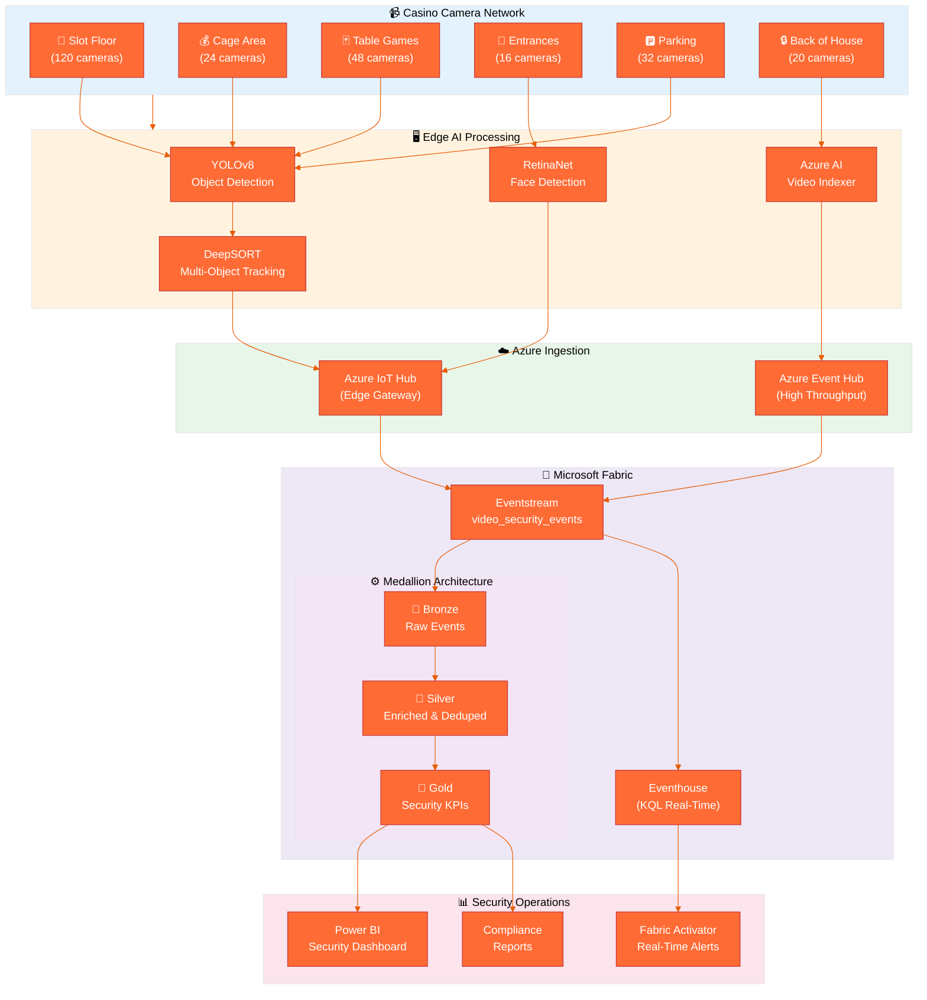
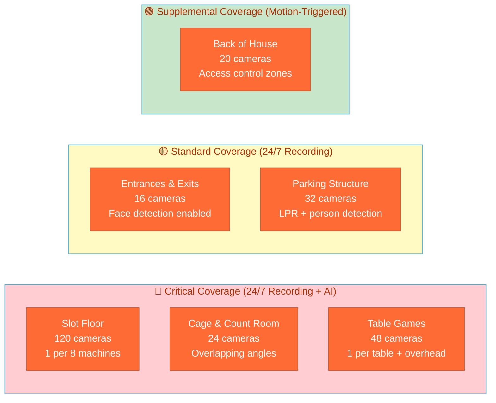
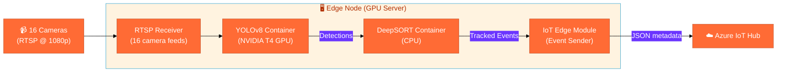
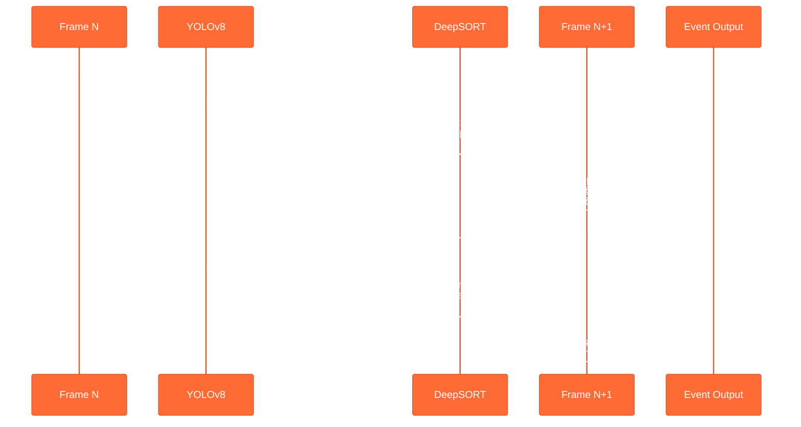

[Home](../../index.md) > [Tutorials](../) > Video Security Analytics

# 📹 Tutorial 27: Video Security Analytics

> **Last Updated**: 2026-04-15 | **Version**: 2.0
> **Status**: ✅ Final | **Maintainer**: Documentation Team

<div align="center">


</div>

---

## 📹 Tutorial 27: Video Security Analytics Pipeline

| | |
|---|---|
| **Difficulty** | ⭐⭐⭐ Advanced |
| **Time** | ⏱️ 120-150 minutes |
| **Focus** | AI Video Analytics, Real-Time Intelligence & Medallion Architecture |

---

### 📊 Progress Tracker

```
┌──────┬──────┬──────┬──────┬──────┬──────┬──────┬──────┬──────┬──────┬──────┬──────┬──────┬──────┐
│  00  │  01  │  02  │  03  │  04  │  05  │  06  │  07  │  08  │  09  │  10  │  11  │  12  │  13  │
│SETUP │BRNZE │SILVR │ GOLD │  RT  │ PBI  │PIPES │ GOV  │MIRRR │AI/ML │TDATA │ SAS  │CICD  │MIGR  │
├──────┼──────┼──────┼──────┼──────┼──────┼──────┼──────┼──────┼──────┼──────┼──────┼──────┼──────┤
│  ✅  │  ✅  │  ✅  │  ✅  │  ✅  │  ✅  │  ✅  │  ✅  │  ✅  │  ✅  │  ✅  │  ✅  │  ✅  │  ✅  │
└──────┴──────┴──────┴──────┴──────┴──────┴──────┴──────┴──────┴──────┴──────┴──────┴──────┴──────┘

┌──────┬──────┬──────┬──────┬──────┬──────┬──────┬──────┬──────┬──────┬──────┬──────┬──────┬──────┐
│  14  │  15  │  16  │  17  │  18  │  19  │  20  │  21  │  22  │  23  │  24  │  25  │  26  │  27  │
│ SEC  │ COST │PERF  │ MON  │SHARE │COPLT │WKBST │ GEO  │ NET  │SHIR  │ SNW  │ DB2  │MULTI │VIDEO │
├──────┼──────┼──────┼──────┼──────┼──────┼──────┼──────┼──────┼──────┼──────┼──────┼──────┼──────┤
│  ✅  │  ✅  │  ✅  │  ✅  │  ✅  │  ✅  │  ✅  │  ✅  │  ✅  │  ✅  │  ✅  │  ✅  │  ✅  │  🔵  │
└──────┴──────┴──────┴──────┴──────┴──────┴──────┴──────┴──────┴──────┴──────┴──────┴──────┴──────┘

┌──────┬──────┬──────┬──────┐
│  28  │  29  │  30  │  31  │
│PEOPLE│TRIBAL│DOT   │REGR  │
├──────┼──────┼──────┼──────┤
│  ○   │  ○   │  ○   │  ○   │
└──────┴──────┴──────┴──────┘
                              ▲
                       YOU ARE HERE (27)
```

| Navigation | |
|---|---|
| ⬅️ **Previous** | [26-Multi-Source Streaming](../26-multi-source-streaming/README.md) |
| ➡️ **Next** | [28-People Movement Analytics](../28-people-movement-analytics/README.md) |

---

## 📖 Overview

Casino surveillance operations process **thousands of camera feeds simultaneously** across slot floors, cage areas, table games, entrances, and parking structures. Traditional video monitoring depends on human operators watching dozens of screens — an approach that scales poorly, misses subtle patterns, and introduces fatigue-driven blind spots. AI-powered video analytics changes this equation by running computer vision inference at the edge, extracting structured event metadata from raw video streams, and routing that metadata into Microsoft Fabric for real-time correlation, historical analysis, and compliance reporting.

This tutorial teaches you how to build a **complete video security analytics pipeline** that starts at the camera lens and ends in a Power BI dashboard. You will design a camera network strategy for a casino floor, configure edge AI inference using YOLO and DeepSORT, detect security-relevant events (zone crossings, loitering, tailgating, crowd density anomalies), ingest the resulting event metadata through Fabric Eventstreams, process it through the Bronze-Silver-Gold medallion architecture, and visualize the output in a real-time security operations dashboard.

**Why video analytics matters for casino operations:**

- Surveillance departments are required by **NIGC MICS** (Minimum Internal Control Standards) to maintain camera coverage of all gaming areas, cage operations, and count rooms — AI analytics turns passive recordings into active monitoring.
- A **hand pay jackpot** ($1,200+ on slots) must be visually verified by surveillance within seconds — automated zone crossing and person tracking reduces verification time from minutes to sub-second.
- **Title 31 compliance** requires correlating player behavior with financial transactions — video metadata provides the behavioral layer that cage transaction data alone cannot.
- Detecting **chip theft**, **past-posting**, and **card marking** at table games requires pattern recognition across thousands of hours of footage — AI anomaly detection surfaces incidents that human operators miss.

> **📸 Note**: This tutorial contains screenshot placeholders with detailed descriptions of what should be captured. When running through this tutorial in your environment, capture your own screenshots at the indicated locations to document your implementation.

---

## 🏗️ Architecture Diagram



**Pipeline Summary:**

1. **Camera Network** — 260 IP cameras across 6 casino zones stream RTSP video to edge processing nodes
2. **Edge AI** — YOLO v8 detects objects, DeepSORT assigns persistent track IDs, RetinaNet handles face detection at entrances
3. **Azure Ingestion** — IoT Hub and Event Hub receive structured JSON event metadata (not raw video)
4. **Fabric Eventstream** — Routes events to both Eventhouse (real-time KQL) and Lakehouse (Delta Lake)
5. **Medallion Architecture** — Bronze (raw events) → Silver (enriched, deduplicated) → Gold (security KPIs)
6. **Security Operations** — Power BI dashboards, real-time alerts via Activator, and compliance reporting

---

## 🎯 Learning Objectives

By the end of this tutorial, you will be able to:

- [ ] Design a camera network placement strategy for casino surveillance zones
- [ ] Select appropriate AI models (YOLO, DeepSORT, RetinaNet) for different detection tasks
- [ ] Configure edge-to-cloud ingestion through Azure IoT Hub into Fabric Eventstreams
- [ ] Define Bronze layer schemas for raw video analytics events using Delta Lake
- [ ] Build Silver layer transformations that correlate, deduplicate, and enrich detection events
- [ ] Create Gold layer aggregations for security KPIs and incident pattern detection
- [ ] Write DAX measures for Power BI security operations dashboards
- [ ] Implement real-time alert rules for anomaly detection (loitering, tailgating, after-hours access)
- [ ] Build a casino floor heat map visualization from camera event density data
- [ ] Integrate video analytics metadata with existing slot telemetry and compliance pipelines

---

## 📋 Prerequisites

Before starting this tutorial, ensure you have:

- [ ] Completed [Tutorial 00: Environment Setup](../00-environment-setup/README.md)
- [ ] Completed [Tutorial 01: Bronze Layer](../01-bronze-layer/README.md)
- [ ] Completed [Tutorial 02: Silver Layer](../02-silver-layer/README.md)
- [ ] Completed [Tutorial 04: Real-Time Analytics](../04-real-time-analytics/README.md)
- [ ] Fabric workspace with Real-Time Intelligence capacity (F2 or higher)
- [ ] Familiarity with PySpark and Delta Lake patterns from prior tutorials
- [ ] (Optional) Azure IoT Hub instance for production integration

> **⚠️ Capacity Requirements**
>
> Video analytics event ingestion at scale (260 cameras, ~500 events/second) requires F64 or higher capacity for sustained throughput. For development and testing, F2 capacity with the included data generator is sufficient.

---

## 🛠️ Step 1: Camera Network Setup

A well-designed camera network is the foundation of casino video analytics. Camera placement must satisfy both regulatory requirements (NIGC MICS mandates) and operational analytics goals.

### 1.1 Casino Camera Placement Strategy

Casino surveillance follows a **layered coverage model**: every gaming area requires overlapping camera angles, while non-gaming areas use single-coverage with motion-triggered recording.



### 1.2 Camera Zone Configuration

The following table defines the camera placement for each casino zone, including the AI inference model assigned to each zone and the expected event throughput.

| Zone | Camera Count | Resolution | FPS | AI Model | Events/Min (est.) | Coverage Purpose |
|------|-------------|------------|-----|----------|-------------------|-----------------|
| `slot_floor_a` | 60 | 1080p | 30 | YOLOv8 + DeepSORT | ~120 | Player tracking, machine occupancy |
| `slot_floor_b` | 60 | 1080p | 30 | YOLOv8 + DeepSORT | ~120 | Player tracking, machine occupancy |
| `table_games` | 48 | 4K | 30 | YOLOv8 + DeepSORT | ~90 | Chip movement, dealer verification |
| `cage_area` | 24 | 4K | 30 | YOLOv8 + RetinaNet | ~45 | Cash handling, person identification |
| `entrance_main` | 8 | 1080p | 30 | RetinaNet + DeepSORT | ~60 | Face detection, person counting |
| `entrance_valet` | 8 | 1080p | 30 | RetinaNet + DeepSORT | ~40 | Face detection, vehicle detection |
| `parking_garage` | 32 | 1080p | 15 | YOLOv8 | ~30 | Vehicle/person detection, LPR |
| `elevator_lobby` | 4 | 1080p | 30 | DeepSORT | ~20 | Person tracking, dwell time |
| `restaurant` | 8 | 720p | 15 | YOLOv8 | ~15 | Crowd density |
| `hotel_lobby` | 8 | 1080p | 30 | DeepSORT | ~25 | Person flow, dwell time |
| `pool_area` | 4 | 1080p | 15 | YOLOv8 | ~10 | Safety monitoring |
| `convention_hall` | 4 | 1080p | 15 | YOLOv8 | ~10 | Crowd density |
| `back_of_house` | 16 | 720p | 15 | YOLOv8 | ~15 | Access control verification |
| `surveillance_room` | 4 | 720p | 15 | YOLOv8 | ~5 | Operator monitoring |

**Total: 260 cameras | ~605 events/minute peak | ~36,000 events/hour**

### 1.3 IP Camera Standards

All cameras in the network must comply with these standards for edge AI integration:

| Standard | Protocol | Purpose |
|----------|----------|---------|
| **ONVIF** (Profile S) | SOAP/HTTP | Device discovery, PTZ control, event subscription |
| **RTSP** | RTP/UDP | Real-time video streaming to edge inference nodes |
| **ONVIF** (Profile T) | SOAP/HTTP | Video streaming with H.265 support |
| **MQTT** | TCP/TLS | Camera health telemetry to IoT Hub |

> **💡 Why RTSP, not direct cloud streaming?**
>
> Raw video at 1080p/30fps consumes ~5 Mbps per camera. Streaming 260 cameras directly to the cloud would require 1.3 Gbps of sustained bandwidth. Instead, edge AI nodes process RTSP feeds locally and send only structured event metadata (typically 1-2 KB per event) to Azure, reducing bandwidth by 99.9%.

### 1.4 Azure IoT Edge Configuration

Each edge processing node runs as an **Azure IoT Edge** device, hosting containerized AI models that process RTSP feeds from assigned cameras.



**Edge node sizing guidance:**

| Cameras per Node | GPU Required | RAM | CPU Cores | Inference Latency |
|-----------------|-------------|-----|-----------|-------------------|
| 8 | NVIDIA T4 | 16 GB | 8 | ~30ms/frame |
| 16 | NVIDIA A2 | 32 GB | 16 | ~25ms/frame |
| 32 | NVIDIA A10 | 64 GB | 32 | ~20ms/frame |
| 64 | NVIDIA A100 | 128 GB | 64 | ~15ms/frame |

For 260 cameras at 1080p/30fps, plan for **8-10 edge nodes** with NVIDIA A10 GPUs (32 cameras each, with headroom for failover).


*Azure IoT Edge runtime architecture showing module containers. Source: [What is Azure IoT Edge](https://learn.microsoft.com/en-us/azure/iot-edge/about-iot-edge)*

---

## 🛠️ Step 2: AI Model Pipeline

The edge AI pipeline chains three specialized models: **object detection** identifies what is in each frame, **multi-object tracking** follows detected objects across frames, and **face detection** handles identity-sensitive use cases at controlled entry points.

### 2.1 Model Selection Guide

| Model | Task | Speed (FPS) | Accuracy (mAP) | Best For | License |
|-------|------|-------------|-----------------|----------|---------|
| **YOLOv8n** (Nano) | Object Detection | 180+ | 37.3% | High camera count, basic detection | AGPL-3.0 |
| **YOLOv8s** (Small) | Object Detection | 130+ | 44.9% | Balanced speed/accuracy | AGPL-3.0 |
| **YOLOv8m** (Medium) | Object Detection | 85+ | 50.2% | Casino floor (recommended) | AGPL-3.0 |
| **YOLOv8l** (Large) | Object Detection | 55+ | 52.9% | High-value zones (cage, table games) | AGPL-3.0 |
| **DeepSORT** | Multi-Object Tracking | N/A (runs on detections) | MOTA 75%+ | Persistent ID assignment across frames | GPL-2.0 |
| **ByteTrack** | Multi-Object Tracking | N/A (runs on detections) | MOTA 80%+ | High-density scenes (slot floors) | MIT |
| **RetinaNet** | Face Detection | 40+ | AP 91%+ | Entrance face detection | Apache 2.0 |
| **Azure AI Video Indexer** | Full Video Analysis | Real-time (preview) | N/A | Back-of-house comprehensive analysis | Commercial |

> **⚠️ License Consideration**
>
> YOLO v8 uses AGPL-3.0, which requires open-sourcing derivative works. For commercial casino deployments, consider Ultralytics Enterprise License or alternative models (NVIDIA TAO, Azure Custom Vision). DeepSORT uses GPL-2.0 with similar constraints — ByteTrack (MIT) is a license-friendly alternative.

### 2.2 YOLO v8 Object Detection

YOLO (You Only Look Once) processes each video frame in a single forward pass, making it ideal for real-time casino surveillance where sub-50ms inference is required.

**Casino-relevant detection classes:**

| Class | COCO ID | Casino Use Case |
|-------|---------|----------------|
| `person` | 0 | Player/staff tracking, crowd density |
| `handbag` | 26 | Abandoned object detection |
| `suitcase` | 28 | Suspicious luggage monitoring |
| `backpack` | 24 | Suspicious bag monitoring |
| `cell phone` | 67 | Phone usage at table games |
| `bottle` | 39 | Beverage tracking (responsible service) |
| `chair` | 56 | Slot seat occupancy |
| `car` | 2 | Parking lot vehicle detection |

### 2.3 DeepSORT Multi-Object Tracking

DeepSORT assigns **persistent tracking IDs** to each detected object across consecutive frames, enabling path reconstruction, dwell time calculation, and zone crossing detection.



### 2.4 Azure AI Video Indexer Integration

For back-of-house and comprehensive analysis scenarios, Azure AI Video Indexer provides turnkey capabilities without custom model training.

**Key Video Indexer capabilities for casino security:**

- **People detection and tracking** with unique visual embeddings (no biometric data stored)
- **Open vocabulary (OV) detection** — define custom detection targets like "chip tray" or "cash bundle" without retraining
- **Anomaly detection** with focus prompts (e.g., "focus on violent behavior" or "focus on unauthorized access")
- **Event summaries** for recorded footage review (up to 6-hour segments)


*Azure AI Video Indexer dashboard showing detected insights. Source: [What is Azure AI Video Indexer](https://learn.microsoft.com/en-us/azure/azure-video-indexer/video-indexer-overview)*

---

## 🛠️ Step 3: Event Detection Patterns

Each AI model produces structured **event metadata** — not raw video — that flows into the Fabric pipeline. This section defines the event types, their detection logic, and the PySpark processing code.

### 3.1 Event Type Taxonomy

| Event Type | Trigger | Alert Level | Typical Frequency |
|-----------|---------|-------------|-------------------|
| `object_detection` | Person, vehicle, or object detected in frame | INFO | ~350/min |
| `zone_crossing` | Tracked object crosses defined zone boundary | INFO | ~120/min |
| `crowd_density` | Zone occupancy exceeds threshold | WARNING | ~70/min |
| `loitering` | Person remains stationary >5 min in monitored zone | WARNING | ~40/min |
| `anomaly` | Unusual movement, restricted area access, after-hours | CRITICAL | ~15/min |
| `tailgating` | Two persons pass through access point on single credential | WARNING | ~10/min |
| `face_match` | Face detected at entrance matches watchlist | WARNING | ~5/min |
| `abandoned_object` | Object stationary >10 min with no associated person | CRITICAL | ~3/min |

### 3.2 Zone Crossing Detection Logic

Zone crossing events fire when DeepSORT tracking data shows a person's trajectory crossing from one defined casino zone into another.

```python
# Zone crossing detection logic (runs on edge AI node)
def detect_zone_crossing(
    track_id: str,
    current_position: tuple[int, int],
    zone_boundaries: dict[str, list[tuple[int, int]]],
    track_history: dict[str, str]
) -> dict | None:
    """
    Detect when a tracked object crosses from one casino zone to another.

    Args:
        track_id: DeepSORT persistent tracking ID
        current_position: (x, y) pixel coordinates in camera frame
        zone_boundaries: Polygon boundaries for each zone
        track_history: Previous zone assignment per track_id

    Returns:
        Zone crossing event dict, or None if no crossing occurred
    """
    from shapely.geometry import Point, Polygon
    from datetime import datetime, timezone

    point = Point(current_position)
    current_zone = None

    for zone_name, boundary_coords in zone_boundaries.items():
        if Polygon(boundary_coords).contains(point):
            current_zone = zone_name
            break

    if current_zone is None:
        return None

    previous_zone = track_history.get(track_id)
    if previous_zone and previous_zone != current_zone:
        track_history[track_id] = current_zone
        return {
            "event_type": "zone_crossing",
            "track_id": track_id,
            "zone_from": previous_zone,
            "zone_to": current_zone,
            "timestamp": datetime.now(timezone.utc).isoformat(),
            "confidence_score": 0.95,
            "alert_level": "INFO"
        }

    track_history[track_id] = current_zone
    return None
```

### 3.3 Anomaly Detection Patterns

| Anomaly Type | Detection Method | Threshold | Casino Scenario |
|-------------|-----------------|-----------|-----------------|
| `unusual_movement` | Trajectory deviation from learned patterns | >2 std deviations | Running on casino floor |
| `restricted_area` | Person detected in off-limits zone | Any detection | Unauthorized cage access |
| `after_hours` | Person detected outside operating hours | Time-based rule | Back-of-house after midnight |
| `speed_violation` | Track velocity exceeds zone limit | >5 mph indoor | Running through slot aisles |
| `direction_violation` | Movement against expected flow | Opposite to learned flow | Wrong-way entrance exit |
| `grouping` | Unusual clustering of persons | >8 people in 10m radius | Potential disturbance |

### 3.4 Crowd Density Monitoring

Crowd density is calculated per zone using object detection counts normalized by the zone's floor area:

```python
# Crowd density calculation (runs in Fabric Eventstream transformation)
def calculate_density_alert(
    zone: str,
    person_count: int,
    zone_capacity: dict[str, int]
) -> str:
    """Determine crowd density alert level based on zone capacity."""
    capacity = zone_capacity.get(zone, 100)
    occupancy_pct = (person_count / capacity) * 100

    if occupancy_pct >= 90:
        return "EMERGENCY"    # Evacuation threshold
    elif occupancy_pct >= 75:
        return "CRITICAL"     # Near capacity
    elif occupancy_pct >= 50:
        return "WARNING"      # Monitor closely
    else:
        return "INFO"         # Normal operations
```

### 3.5 Processing Video Events from Eventstreams

This PySpark code processes streaming video analytics events as they arrive in the Fabric Lakehouse via Eventstreams:

```python
# Fabric Notebook: Process Video Events from Eventstreams
# ============================================================

from pyspark.sql import SparkSession
from pyspark.sql.functions import (
    col, from_json, current_timestamp, when, lit,
    window, count, avg, max as spark_max, min as spark_min
)
from pyspark.sql.types import (
    StructType, StructField, StringType, DoubleType,
    IntegerType, TimestampType, MapType
)

spark = SparkSession.builder.getOrCreate()

# Define the video event schema (matches video_event_schema.json)
video_event_schema = StructType([
    StructField("event_id", StringType(), False),
    StructField("camera_id", StringType(), False),
    StructField("camera_location", StringType(), False),
    StructField("event_type", StringType(), False),
    StructField("timestamp", TimestampType(), False),
    StructField("confidence_score", DoubleType(), False),
    StructField("object_class", StringType(), True),
    StructField("object_count", IntegerType(), True),
    StructField("bounding_box", StructType([
        StructField("x", DoubleType()),
        StructField("y", DoubleType()),
        StructField("width", DoubleType()),
        StructField("height", DoubleType())
    ]), True),
    StructField("track_id", StringType(), True),
    StructField("zone_from", StringType(), True),
    StructField("zone_to", StringType(), True),
    StructField("dwell_time_seconds", DoubleType(), True),
    StructField("anomaly_type", StringType(), True),
    StructField("alert_level", StringType(), False),
    StructField("frame_number", IntegerType(), True),
    StructField("video_resolution", StringType(), True),
    StructField("fps", IntegerType(), True),
    StructField("model_name", StringType(), True),
    StructField("model_version", StringType(), True),
    StructField("metadata", MapType(StringType(), StringType()), True),
    StructField("load_time", TimestampType(), False)
])

# Read from Eventstream (streaming mode)
raw_events = (
    spark.readStream
    .format("delta")
    .option("readChangeFeed", "true")
    .table("eventstream_video_security_events")
)

# Parse and validate events
parsed_events = (
    raw_events
    .select(from_json(col("body").cast("string"), video_event_schema).alias("event"))
    .select("event.*")
    .withColumn("fabric_ingestion_time", current_timestamp())
    .filter(col("confidence_score") >= 0.5)  # Drop low-confidence detections
)

print(f"Schema validated. Streaming video events into Bronze layer...")
```

---

## 🛠️ Step 4: Bronze Layer Ingestion

The Bronze layer stores **raw video analytics events** exactly as received from edge AI nodes, with minimal transformation — only adding ingestion metadata.

### 4.1 Bronze Table Schema

The schema aligns with the project's [`video_event_schema.json`](https://github.com/fgarofalo56/Suppercharge_Microsoft_Fabric/blob/main/data_generation/schemas/analytics/video_event_schema.json):

```python
# Fabric Notebook: 01_bronze_video_security_events.py
# ============================================================
# Bronze Layer — Raw Video Analytics Event Ingestion
# ============================================================

from pyspark.sql import SparkSession
from pyspark.sql.functions import (
    col, current_timestamp, input_file_name, lit,
    year, month, dayofmonth, hour
)
from pyspark.sql.types import (
    StructType, StructField, StringType, DoubleType,
    IntegerType, TimestampType, MapType
)

spark = SparkSession.builder.getOrCreate()

# ------------------------------------------------------------
# Schema: matches data_generation/schemas/analytics/video_event_schema.json
# ------------------------------------------------------------
BRONZE_SCHEMA = StructType([
    StructField("event_id", StringType(), nullable=False),
    StructField("camera_id", StringType(), nullable=False),
    StructField("camera_location", StringType(), nullable=False),
    StructField("event_type", StringType(), nullable=False),
    StructField("timestamp", StringType(), nullable=False),
    StructField("confidence_score", DoubleType(), nullable=False),
    StructField("object_class", StringType(), nullable=True),
    StructField("object_count", IntegerType(), nullable=True),
    StructField("bounding_box", StructType([
        StructField("x", DoubleType()),
        StructField("y", DoubleType()),
        StructField("width", DoubleType()),
        StructField("height", DoubleType())
    ]), nullable=True),
    StructField("track_id", StringType(), nullable=True),
    StructField("zone_from", StringType(), nullable=True),
    StructField("zone_to", StringType(), nullable=True),
    StructField("dwell_time_seconds", DoubleType(), nullable=True),
    StructField("anomaly_type", StringType(), nullable=True),
    StructField("alert_level", StringType(), nullable=False),
    StructField("frame_number", IntegerType(), nullable=True),
    StructField("video_resolution", StringType(), nullable=True),
    StructField("fps", IntegerType(), nullable=True),
    StructField("model_name", StringType(), nullable=True),
    StructField("model_version", StringType(), nullable=True),
    StructField("metadata", MapType(StringType(), StringType()), nullable=True),
    StructField("load_time", StringType(), nullable=False)
])

# ------------------------------------------------------------
# Read raw events from Eventstream landing zone
# ------------------------------------------------------------
raw_video_events = (
    spark.read
    .format("json")
    .schema(BRONZE_SCHEMA)
    .load("Files/landing/video_security_events/")
)

# ------------------------------------------------------------
# Add Bronze layer metadata columns
# ------------------------------------------------------------
bronze_video_events = (
    raw_video_events
    .withColumn("_bronze_ingestion_time", current_timestamp())
    .withColumn("_bronze_source_file", input_file_name())
    .withColumn("_bronze_batch_id", lit("batch_001"))
    # Partition columns for query performance
    .withColumn("_year", year(col("timestamp").cast("timestamp")))
    .withColumn("_month", month(col("timestamp").cast("timestamp")))
    .withColumn("_day", dayofmonth(col("timestamp").cast("timestamp")))
    .withColumn("_hour", hour(col("timestamp").cast("timestamp")))
)

# ------------------------------------------------------------
# Write to Bronze Delta table (append-only, partitioned)
# ------------------------------------------------------------
(
    bronze_video_events.write
    .format("delta")
    .mode("append")
    .partitionBy("_year", "_month", "_day", "_hour")
    .saveAsTable("lh_bronze.bronze_video_security_events")
)

row_count = spark.table("lh_bronze.bronze_video_security_events").count()
print(f"Bronze video security events loaded: {row_count:,} records")
print(f"Partitioned by: _year / _month / _day / _hour")
```

### 4.2 Bronze Data Quality Checks

```python
# Quick validation after Bronze load
# ============================================================

bronze_df = spark.table("lh_bronze.bronze_video_security_events")

# Basic counts
print(f"Total records: {bronze_df.count():,}")
print(f"Distinct cameras: {bronze_df.select('camera_id').distinct().count()}")
print(f"Distinct zones: {bronze_df.select('camera_location').distinct().count()}")

# Event type distribution
bronze_df.groupBy("event_type").count().orderBy("count", ascending=False).show()

# Alert level distribution
bronze_df.groupBy("alert_level").count().orderBy("count", ascending=False).show()

# Null check on required fields
from pyspark.sql.functions import sum as spark_sum, when, col

null_checks = bronze_df.select(
    spark_sum(when(col("event_id").isNull(), 1).otherwise(0)).alias("null_event_id"),
    spark_sum(when(col("camera_id").isNull(), 1).otherwise(0)).alias("null_camera_id"),
    spark_sum(when(col("event_type").isNull(), 1).otherwise(0)).alias("null_event_type"),
    spark_sum(when(col("alert_level").isNull(), 1).otherwise(0)).alias("null_alert_level"),
)
null_checks.show()
```

---

## 🛠️ Step 5: Silver Layer Enrichment

The Silver layer transforms raw video analytics events into a **cleansed, deduplicated, and enriched** dataset suitable for analytics. Key transformations include alert correlation, track ID resolution, zone activity aggregation, and confidence filtering.

### 5.1 Alert Correlation and Deduplication

Multiple cameras may detect the same event (e.g., a person walking through overlapping camera fields of view). The Silver layer deduplicates these by matching `track_id` within a time window:

```python
# Fabric Notebook: 02_silver_video_security_events.py
# ============================================================
# Silver Layer — Enriched Video Security Analytics
# ============================================================

from pyspark.sql import SparkSession, Window
from pyspark.sql.functions import (
    col, to_timestamp, current_timestamp, lit, when,
    row_number, count, avg, max as spark_max, min as spark_min,
    sum as spark_sum, datediff, expr, concat_ws,
    first, last, collect_list, size, round as spark_round
)

spark = SparkSession.builder.getOrCreate()

# ------------------------------------------------------------
# Read from Bronze
# ------------------------------------------------------------
bronze_df = spark.table("lh_bronze.bronze_video_security_events")

# Cast timestamp string to proper TimestampType
bronze_df = bronze_df.withColumn(
    "event_timestamp", to_timestamp(col("timestamp"))
)

# ------------------------------------------------------------
# 5.1 Deduplication: same track_id within 5-second window
# Keep highest confidence detection per track per window
# ------------------------------------------------------------
dedup_window = Window.partitionBy(
    "track_id",
    "camera_location",
    # 5-second tumbling window
    (col("event_timestamp").cast("long") / 5).cast("long")
).orderBy(col("confidence_score").desc())

deduped_df = (
    bronze_df
    .filter(col("track_id").isNotNull())
    .withColumn("_dedup_rank", row_number().over(dedup_window))
    .filter(col("_dedup_rank") == 1)
    .drop("_dedup_rank")
)

# Events without track_id pass through without dedup
no_track_df = bronze_df.filter(col("track_id").isNull())

silver_base = deduped_df.unionByName(no_track_df, allowMissingColumns=True)

print(f"Bronze records: {bronze_df.count():,}")
print(f"After dedup: {silver_base.count():,}")
print(f"Duplicates removed: {bronze_df.count() - silver_base.count():,}")
```

### 5.2 Track ID Resolution and Enrichment

Enrich events with derived fields: zone display names, alert severity scores, and camera metadata:

```python
# ------------------------------------------------------------
# 5.2 Enrichment: zone names, severity scores, camera metadata
# ------------------------------------------------------------

# Zone display name mapping
zone_display_names = {
    "slot_floor_a": "Slot Floor - Section A",
    "slot_floor_b": "Slot Floor - Section B",
    "table_games": "Table Games Pit",
    "cage_area": "Cashier Cage",
    "entrance_main": "Main Entrance",
    "entrance_valet": "Valet Entrance",
    "parking_garage": "Parking Structure",
    "elevator_lobby": "Elevator Lobby",
    "restaurant": "Restaurant & Dining",
    "hotel_lobby": "Hotel Lobby",
    "pool_area": "Pool & Cabana",
    "convention_hall": "Convention Center",
    "back_of_house": "Back of House",
    "surveillance_room": "Surveillance Operations"
}

# Alert severity numeric score for sorting and aggregation
alert_severity_scores = {
    "INFO": 1,
    "WARNING": 2,
    "CRITICAL": 3,
    "EMERGENCY": 4
}

# Apply enrichments
from pyspark.sql.functions import create_map, coalesce

zone_map_expr = create_map(
    *[item for pair in zone_display_names.items() for item in (lit(pair[0]), lit(pair[1]))]
)

severity_map_expr = create_map(
    *[item for pair in alert_severity_scores.items() for item in (lit(pair[0]), lit(pair[1]))]
)

silver_enriched = (
    silver_base
    .withColumn("zone_display_name",
        coalesce(zone_map_expr[col("camera_location")], col("camera_location")))
    .withColumn("alert_severity_score",
        coalesce(severity_map_expr[col("alert_level")], lit(0)))
    .withColumn("is_high_priority",
        when(col("alert_level").isin("CRITICAL", "EMERGENCY"), True).otherwise(False))
    .withColumn("detection_hour", hour(col("event_timestamp")))
    .withColumn("detection_date", col("event_timestamp").cast("date"))
    .withColumn("_silver_processed_time", current_timestamp())
)

print(f"Enriched records: {silver_enriched.count():,}")
```

### 5.3 Zone Activity Aggregation

Pre-aggregate zone-level metrics for efficient dashboard queries:

```python
# ------------------------------------------------------------
# 5.3 Zone Activity Summary (pre-aggregated for dashboards)
# ------------------------------------------------------------

zone_activity = (
    silver_enriched
    .groupBy(
        "camera_location",
        "zone_display_name",
        "detection_date",
        "detection_hour"
    )
    .agg(
        count("*").alias("total_events"),
        spark_sum(when(col("event_type") == "object_detection", 1).otherwise(0))
            .alias("detection_count"),
        spark_sum(when(col("event_type") == "zone_crossing", 1).otherwise(0))
            .alias("zone_crossing_count"),
        spark_sum(when(col("event_type") == "anomaly", 1).otherwise(0))
            .alias("anomaly_count"),
        spark_sum(when(col("event_type") == "loitering", 1).otherwise(0))
            .alias("loitering_count"),
        spark_sum(when(col("event_type") == "crowd_density", 1).otherwise(0))
            .alias("crowd_density_count"),
        spark_sum(when(col("is_high_priority"), 1).otherwise(0))
            .alias("high_priority_count"),
        spark_round(avg("confidence_score"), 4).alias("avg_confidence"),
        spark_round(avg("dwell_time_seconds"), 2).alias("avg_dwell_time_sec"),
        spark_max("alert_severity_score").alias("max_severity_score")
    )
)

# ------------------------------------------------------------
# Write Silver tables
# ------------------------------------------------------------
(
    silver_enriched.write
    .format("delta")
    .mode("overwrite")
    .option("overwriteSchema", "true")
    .saveAsTable("lh_silver.silver_video_security_events")
)

(
    zone_activity.write
    .format("delta")
    .mode("overwrite")
    .option("overwriteSchema", "true")
    .saveAsTable("lh_silver.silver_video_zone_activity")
)

print(f"Silver video events: {silver_enriched.count():,}")
print(f"Silver zone activity: {zone_activity.count():,}")
```

---

## 🛠️ Step 6: Gold Layer Analytics

The Gold layer produces **business-ready security KPIs**, hot zone analysis, and incident pattern detection tables that Power BI consumes directly through Direct Lake.

### 6.1 Daily Security Dashboard KPIs

```python
# Fabric Notebook: 03_gold_video_security_kpis.py
# ============================================================
# Gold Layer — Security Analytics KPIs
# ============================================================

from pyspark.sql import SparkSession
from pyspark.sql.functions import (
    col, current_timestamp, count, sum as spark_sum, avg,
    max as spark_max, min as spark_min, when, lit, round as spark_round,
    datediff, current_date, countDistinct, expr, percent_rank
)
from pyspark.sql import Window

spark = SparkSession.builder.getOrCreate()

silver_events = spark.table("lh_silver.silver_video_security_events")

# ------------------------------------------------------------
# 6.1 Daily Security KPI Summary
# ------------------------------------------------------------
daily_kpis = (
    silver_events
    .groupBy("detection_date")
    .agg(
        count("*").alias("total_events"),
        countDistinct("camera_id").alias("active_cameras"),
        countDistinct("track_id").alias("unique_tracks"),

        # Event type breakdowns
        spark_sum(when(col("event_type") == "object_detection", 1).otherwise(0))
            .alias("detections"),
        spark_sum(when(col("event_type") == "zone_crossing", 1).otherwise(0))
            .alias("zone_crossings"),
        spark_sum(when(col("event_type") == "anomaly", 1).otherwise(0))
            .alias("anomalies"),
        spark_sum(when(col("event_type") == "loitering", 1).otherwise(0))
            .alias("loitering_events"),
        spark_sum(when(col("event_type") == "tailgating", 1).otherwise(0))
            .alias("tailgating_events"),
        spark_sum(when(col("event_type") == "abandoned_object", 1).otherwise(0))
            .alias("abandoned_objects"),
        spark_sum(when(col("event_type") == "crowd_density", 1).otherwise(0))
            .alias("crowd_density_alerts"),
        spark_sum(when(col("event_type") == "face_match", 1).otherwise(0))
            .alias("face_matches"),

        # Severity breakdowns
        spark_sum(when(col("alert_level") == "EMERGENCY", 1).otherwise(0))
            .alias("emergency_alerts"),
        spark_sum(when(col("alert_level") == "CRITICAL", 1).otherwise(0))
            .alias("critical_alerts"),
        spark_sum(when(col("alert_level") == "WARNING", 1).otherwise(0))
            .alias("warning_alerts"),

        # Quality metrics
        spark_round(avg("confidence_score"), 4).alias("avg_confidence"),
        spark_round(avg("dwell_time_seconds"), 2).alias("avg_dwell_time_sec"),
    )
    .withColumn("_gold_processed_time", current_timestamp())
)

(
    daily_kpis.write
    .format("delta")
    .mode("overwrite")
    .option("overwriteSchema", "true")
    .saveAsTable("lh_gold.gold_video_security_daily_kpis")
)

print(f"Daily KPI records: {daily_kpis.count():,}")
daily_kpis.orderBy("detection_date", ascending=False).show(5, truncate=False)
```

### 6.2 Hot Zone Analysis

Identify casino zones with the highest security activity relative to their baseline:

```python
# ------------------------------------------------------------
# 6.2 Hot Zone Analysis — zones with abnormal activity levels
# ------------------------------------------------------------

zone_baseline = (
    silver_events
    .groupBy("camera_location", "zone_display_name", "detection_date")
    .agg(
        count("*").alias("daily_events"),
        spark_sum(when(col("is_high_priority"), 1).otherwise(0))
            .alias("daily_high_priority"),
        countDistinct("track_id").alias("daily_unique_tracks"),
        spark_round(avg("dwell_time_seconds"), 2).alias("daily_avg_dwell"),
    )
)

# Calculate zone-level statistics for baseline comparison
zone_stats_window = Window.partitionBy("camera_location")

hot_zone_analysis = (
    zone_baseline
    .withColumn("zone_avg_events", avg("daily_events").over(zone_stats_window))
    .withColumn("zone_std_events", expr(
        "stddev(daily_events) OVER (PARTITION BY camera_location)"
    ))
    .withColumn("z_score",
        (col("daily_events") - col("zone_avg_events")) / col("zone_std_events"))
    .withColumn("is_hot_zone",
        when(col("z_score") > 2.0, True).otherwise(False))
    .withColumn("heat_level",
        when(col("z_score") > 3.0, "EXTREME")
        .when(col("z_score") > 2.0, "HIGH")
        .when(col("z_score") > 1.0, "ELEVATED")
        .when(col("z_score") > 0.0, "NORMAL")
        .otherwise("LOW"))
    .withColumn("_gold_processed_time", current_timestamp())
)

(
    hot_zone_analysis.write
    .format("delta")
    .mode("overwrite")
    .option("overwriteSchema", "true")
    .saveAsTable("lh_gold.gold_video_hot_zone_analysis")
)

print(f"Hot zone records: {hot_zone_analysis.count():,}")
hot_zone_analysis.filter(col("is_hot_zone")).show(10, truncate=False)
```

### 6.3 Incident Pattern Detection

Detect recurring security patterns — repeated anomalies at the same camera, escalating alert frequencies, or correlated events across zones:

```python
# ------------------------------------------------------------
# 6.3 Incident Pattern Detection
# ------------------------------------------------------------

# Cameras with recurring anomalies (3+ in 24 hours)
incident_patterns = (
    silver_events
    .filter(col("alert_level").isin("CRITICAL", "EMERGENCY"))
    .groupBy("camera_id", "camera_location", "zone_display_name", "detection_date")
    .agg(
        count("*").alias("incident_count"),
        collect_list("event_type").alias("event_types"),
        collect_list("anomaly_type").alias("anomaly_types"),
        spark_min("event_timestamp").alias("first_incident"),
        spark_max("event_timestamp").alias("last_incident"),
        spark_round(avg("confidence_score"), 4).alias("avg_confidence"),
    )
    .filter(col("incident_count") >= 3)
    .withColumn("incident_severity",
        when(col("incident_count") >= 10, "PATTERN_CRITICAL")
        .when(col("incident_count") >= 5, "PATTERN_HIGH")
        .otherwise("PATTERN_MODERATE"))
    .withColumn("_gold_processed_time", current_timestamp())
)

(
    incident_patterns.write
    .format("delta")
    .mode("overwrite")
    .option("overwriteSchema", "true")
    .saveAsTable("lh_gold.gold_video_incident_patterns")
)

print(f"Incident patterns detected: {incident_patterns.count():,}")
```

### 6.4 DAX Measures for Power BI

Add these DAX measures to your Power BI semantic model connected to the Gold layer tables via Direct Lake:

```dax
// ============================================================
// Video Security Analytics — DAX Measures
// ============================================================

// --- KPI Card Measures ---

Total Security Events =
    SUM(gold_video_security_daily_kpis[total_events])

Active Camera Count =
    MAX(gold_video_security_daily_kpis[active_cameras])

Critical Alert Count =
    SUM(gold_video_security_daily_kpis[critical_alerts])
        + SUM(gold_video_security_daily_kpis[emergency_alerts])

Anomaly Rate =
    DIVIDE(
        SUM(gold_video_security_daily_kpis[anomalies]),
        SUM(gold_video_security_daily_kpis[total_events]),
        0
    )

Average Confidence Score =
    AVERAGE(gold_video_security_daily_kpis[avg_confidence])

// --- Trend Measures ---

Events vs Prior Day =
    VAR CurrentDayEvents =
        CALCULATE(
            SUM(gold_video_security_daily_kpis[total_events]),
            LASTDATE(gold_video_security_daily_kpis[detection_date])
        )
    VAR PriorDayEvents =
        CALCULATE(
            SUM(gold_video_security_daily_kpis[total_events]),
            DATEADD(
                LASTDATE(gold_video_security_daily_kpis[detection_date]),
                -1, DAY
            )
        )
    RETURN
        DIVIDE(CurrentDayEvents - PriorDayEvents, PriorDayEvents, 0)

// --- Hot Zone Measures ---

Hot Zone Count =
    CALCULATE(
        DISTINCTCOUNT(gold_video_hot_zone_analysis[camera_location]),
        gold_video_hot_zone_analysis[is_hot_zone] = TRUE()
    )

Max Zone Heat Score =
    MAX(gold_video_hot_zone_analysis[z_score])

Zone Incident Density =
    DIVIDE(
        SUM(gold_video_hot_zone_analysis[daily_high_priority]),
        SUM(gold_video_hot_zone_analysis[daily_events]),
        0
    )

// --- Incident Pattern Measures ---

Active Incident Patterns =
    COUNTROWS(
        FILTER(
            gold_video_incident_patterns,
            gold_video_incident_patterns[incident_severity]
                IN {"PATTERN_CRITICAL", "PATTERN_HIGH"}
        )
    )

Cameras With Recurring Incidents =
    DISTINCTCOUNT(gold_video_incident_patterns[camera_id])

// --- Time Intelligence ---

Hourly Event Trend =
    CALCULATE(
        SUM(gold_video_security_daily_kpis[total_events]),
        DATESMTD(gold_video_security_daily_kpis[detection_date])
    )
```

---

## 🛠️ Step 7: Power BI Dashboard

Build a real-time security operations dashboard that gives surveillance operators a single-pane-of-glass view across the entire casino camera network.

### 7.1 Dashboard Layout

```
┌──────────────────────────────────────────────────────────────────────────────┐
│  📹 CASINO VIDEO SECURITY OPERATIONS CENTER          🔄 Refresh: 30s        │
├──────────┬──────────┬──────────┬──────────┬──────────┬───────────────────────┤
│  📹 260  │  🔍 45K  │  ⚠️ 127  │  🔴 12   │  👥 892  │  📊 99.2%            │
│ Cameras  │ Events   │ Warnings │ Critical │ Tracks   │ Confidence            │
│  Active  │ (Today)  │          │          │ (Active) │ (Avg)                 │
├──────────┴──────────┴──────────┴──────────┴──────────┴───────────────────────┤
│                                                                              │
│  🗺️ CASINO FLOOR HEAT MAP                                                   │
│  ┌─────────────────────────────────────────────────────────────────────┐     │
│  │  ┌──────────┐  ┌──────────┐  ┌──────────┐  ┌──────────┐          │     │
│  │  │Slot Fl A │  │Slot Fl B │  │Table     │  │ Cage     │          │     │
│  │  │ 🔴 HIGH  │  │ 🟡 MED   │  │Games     │  │ Area     │          │     │
│  │  │ 1,240    │  │  890     │  │ 🟠 ELEV  │  │ 🔴 HIGH  │          │     │
│  │  └──────────┘  └──────────┘  │  720     │  │  380     │          │     │
│  │                              └──────────┘  └──────────┘          │     │
│  │  ┌──────────┐  ┌──────────┐  ┌──────────┐                        │     │
│  │  │Entrance  │  │Parking   │  │Hotel     │                        │     │
│  │  │ 🟡 MED   │  │ 🟢 LOW   │  │Lobby     │                        │     │
│  │  │  450     │  │  180     │  │ 🟢 LOW   │                        │     │
│  │  └──────────┘  └──────────┘  │  150     │                        │     │
│  │                              └──────────┘                        │     │
│  └─────────────────────────────────────────────────────────────────────┘     │
│                                                                              │
├────────────────────────────────────┬─────────────────────────────────────────┤
│  🚨 REAL-TIME ALERT FEED           │  📈 EVENT TREND (Last 24 Hours)         │
│  ┌──────┬────────┬──────┬───────┐  │  ████████████████████████████████████  │
│  │ Time │ Zone   │ Type │ Level │  │  [Area chart: events by hour + zone]   │
│  ├──────┼────────┼──────┼───────┤  │                                        │
│  │14:32 │ Cage   │ Anom │🔴 CRIT│  │                                        │
│  │14:30 │ Slot A │ Loit │🟡 WARN│  │                                        │
│  │14:28 │ Entr   │ Tail │🟡 WARN│  │                                        │
│  │14:25 │ Table  │ Crowd│🟡 WARN│  │                                        │
│  │14:22 │ Cage   │ Anom │🔴 CRIT│  │                                        │
│  └──────┴────────┴──────┴───────┘  │                                        │
├────────────────────────────────────┼─────────────────────────────────────────┤
│  📹 CAMERA STATUS                   │  🔄 INCIDENT PATTERNS                  │
│  ┌─────────┬──────┬───────────┐    │  ┌────────┬──────┬──────┬──────────┐  │
│  │Camera   │Zone  │ Status    │    │  │Camera  │Count │Sev   │Pattern   │  │
│  ├─────────┼──────┼───────────┤    │  ├────────┼──────┼──────┼──────────┤  │
│  │CAM-0001 │Slot A│ 🟢 Online │    │  │CAM-0042│  7   │ HIGH │Loitering │  │
│  │CAM-0042 │Cage  │ ⚠️ Alert  │    │  │CAM-0105│  5   │ MOD  │Anomaly   │  │
│  │CAM-0105 │Table │ ⚠️ Alert  │    │  │CAM-0201│  4   │ MOD  │Tailgate  │  │
│  │CAM-0200 │Entr  │ 🟢 Online │    │  │CAM-0033│  3   │ MOD  │Crowd     │  │
│  └─────────┴──────┴───────────┘    │  └────────┴──────┴──────┴──────────┘  │
└────────────────────────────────────┴─────────────────────────────────────────┘
```

### 7.2 Casino Floor Heat Map

The heat map is the centerpiece of the security operations dashboard. It visualizes event density across casino zones using a color-coded floor plan.

**Building the heat map in Power BI:**

1. Create a **Filled Map** or **Custom Visual** (use the Synoptic Panel custom visual for floor plan overlays)
2. Data source: `gold_video_hot_zone_analysis`
3. Map zone names to floor plan regions
4. Color scale:
   - 🟢 **Green** (z-score < 1.0): Normal activity
   - 🟡 **Yellow** (z-score 1.0-2.0): Elevated activity
   - 🟠 **Orange** (z-score 2.0-3.0): High activity
   - 🔴 **Red** (z-score > 3.0): Extreme activity

> **💡 Synoptic Panel Visual**
>
> For casino floor plan overlays, use the [Synoptic Panel](https://appsource.microsoft.com/en-us/product/power-bi-visuals/WA104380873) custom visual from AppSource. Import your casino floor plan SVG, map each zone region to the `camera_location` field, and bind the color saturation to `z_score`.

### 7.3 Real-Time Alert Feed

Connect a **Table** visual directly to the Eventhouse via DirectQuery (not Direct Lake) for sub-second alert latency:

```kql
// KQL query for real-time alert feed
VideoSecurityEvents
| where ingestion_time() > ago(30m)
| where AlertLevel in ("CRITICAL", "EMERGENCY", "WARNING")
| project
    Time = format_datetime(EventTimestamp, 'HH:mm:ss'),
    Zone = CameraLocation,
    EventType,
    AlertLevel,
    Confidence = round(ConfidenceScore, 2),
    TrackId,
    AnomalyType
| order by EventTimestamp desc
| take 50
```

### 7.4 Camera Status Monitoring

```kql
// Camera heartbeat monitoring — flag cameras with no events in last 5 minutes
let ActiveCameras = VideoSecurityEvents
    | where ingestion_time() > ago(5m)
    | summarize LastEvent = max(EventTimestamp), EventCount = count() by CameraId, CameraLocation
    | extend Status = "Online";
let AllCameras = datatable(CameraId: string, CameraLocation: string)
    [/* populated from camera registry table */];
AllCameras
| join kind=leftouter ActiveCameras on CameraId
| extend
    Status = iff(isempty(LastEvent), "Offline", "Online"),
    MinutesSinceLastEvent = datetime_diff('minute', now(), LastEvent)
| extend StatusIcon = case(
    Status == "Offline", "Offline",
    MinutesSinceLastEvent > 2, "Degraded",
    "Online"
)
| order by StatusIcon asc, MinutesSinceLastEvent desc
```

### 7.5 Trend Analysis Charts

Build a **Line Chart** visual showing event counts over 24 hours, broken down by alert severity:

```kql
// Hourly event trend by severity
VideoSecurityEvents
| where EventTimestamp > ago(24h)
| summarize
    InfoCount     = countif(AlertLevel == "INFO"),
    WarningCount  = countif(AlertLevel == "WARNING"),
    CriticalCount = countif(AlertLevel in ("CRITICAL", "EMERGENCY"))
  by bin(EventTimestamp, 1h)
| order by EventTimestamp asc
| render timechart
```


*Example Real-Time Dashboard layout in Fabric. Source: [Create a Real-Time Dashboard](https://learn.microsoft.com/en-us/fabric/real-time-intelligence/dashboard-real-time-create)*

---

## 🔧 Troubleshooting

| Issue | Likely Cause | Resolution |
|-------|-------------|------------|
| Edge AI node not sending events | IoT Edge module stopped or disconnected | Check `iotedge list` on edge node; restart module with `iotedge restart <module>` |
| Events arriving in Eventstream but not in Lakehouse | Eventstream destination misconfigured | Verify Lakehouse destination mapping; check Eventstream data preview |
| High duplicate count in Silver layer | Overlapping camera FOV without proper dedup window | Increase dedup window from 5s to 10s; verify track_id consistency across cameras |
| Low confidence scores (<0.5) on detections | Camera resolution too low or poor lighting | Upgrade to 1080p minimum; add IR illumination for low-light zones |
| Bronze table partitions skewed | Uneven camera event distribution | Re-partition by `camera_location` + `_hour` instead of time-only |
| KQL queries timing out on Eventhouse | No time filter or querying cold cache | Always include `where ingestion_time() > ago(...)` filter; extend hot cache period |
| Power BI heat map not rendering zones | Zone names in data don't match SVG region IDs | Verify exact string match between `camera_location` values and Synoptic Panel region names |
| DeepSORT losing tracks frequently | Occlusion or camera angle too steep | Adjust max_age parameter in DeepSORT config; reposition camera for less occlusion |
| Eventstream backpressure during peak hours | Throughput exceeds CU capacity | Scale up Fabric capacity or add Eventstream parallelism (multiple streams per zone) |
| Face detection generating false positives | RetinaNet threshold too low | Increase confidence threshold from 0.5 to 0.7 for face_match events |

---

## 📐 Best Practices

1. **Send metadata, not video.** Edge AI should extract structured events and send only JSON metadata to Azure. Raw video stays on local NVR storage — never stream raw video to Fabric.

2. **Use separate Eventstreams per zone group.** Isolate slot floor cameras (high volume) from entrance cameras (lower volume but higher priority) into separate Eventstreams to prevent noisy-neighbor throughput issues.

3. **Filter at the edge.** Drop low-confidence detections (< 0.5) and routine heartbeat events at the edge node before they reach IoT Hub. This reduces ingestion cost by 30-50%.

4. **Partition Bronze tables by time and zone.** The combination of `_year/_month/_day/_hour` plus `camera_location` gives optimal query pruning for both time-range and zone-specific queries.

5. **Deduplicate in Silver, not Bronze.** Keep Bronze as a faithful record of all received events. Deduplication logic belongs in the Silver layer where you have full context for track_id resolution.

6. **Pre-aggregate for dashboards.** Power BI performs best when querying pre-aggregated Gold tables. Calculate hourly KPIs in the Gold layer rather than running real-time aggregations against millions of Bronze rows.

7. **Set realistic alert thresholds.** Start with conservative thresholds (fewer alerts) and tune downward. A dashboard generating 500 CRITICAL alerts/hour teaches operators to ignore alerts — defeating the purpose.

8. **Implement camera health monitoring.** If a camera stops sending events for 5+ minutes, generate an automatic maintenance alert. Camera outages create surveillance blind spots that are compliance violations under NIGC MICS.

9. **Retain Bronze data for compliance.** Casino surveillance footage retention requirements vary by jurisdiction (typically 7-30 days for video, 1 year for metadata). Configure Bronze Delta table retention to meet your state gaming commission requirements.

10. **Test with the data generator.** Use the included [`video_analytics_generator.py`](https://github.com/fgarofalo56/Suppercharge_Microsoft_Fabric/blob/main/data_generation/generators/analytics/video_analytics_generator.py) to produce realistic synthetic events for development and testing without requiring physical camera infrastructure.

---

## ✅ Validation Checklist

Before moving to the next tutorial, verify:

- [ ] **Camera network design** documented with zone assignments and AI model mapping
- [ ] **Bronze table** (`bronze_video_security_events`) populated with partitioned Delta data
- [ ] **Silver table** (`silver_video_security_events`) shows successful deduplication and enrichment
- [ ] **Zone activity table** (`silver_video_zone_activity`) contains hourly zone summaries
- [ ] **Gold KPI table** (`gold_video_security_daily_kpis`) produces daily security metrics
- [ ] **Hot zone analysis** (`gold_video_hot_zone_analysis`) identifies zones with elevated activity
- [ ] **Incident patterns** (`gold_video_incident_patterns`) detects recurring anomalies per camera
- [ ] **DAX measures** calculate correctly in Power BI semantic model
- [ ] **Heat map visualization** renders zone activity with correct color coding
- [ ] **Alert feed** shows real-time events from Eventhouse with sub-minute latency

<details>
<summary>🔍 Quick verification queries</summary>

```python
# Verify Bronze
bronze = spark.table("lh_bronze.bronze_video_security_events")
print(f"Bronze rows: {bronze.count():,}")
assert bronze.count() > 0, "Bronze table is empty"

# Verify Silver dedup effectiveness
silver = spark.table("lh_silver.silver_video_security_events")
dedup_ratio = 1 - (silver.count() / bronze.count())
print(f"Dedup ratio: {dedup_ratio:.1%}")

# Verify Gold KPIs
gold_kpis = spark.table("lh_gold.gold_video_security_daily_kpis")
gold_kpis.select("detection_date", "total_events", "critical_alerts", "anomalies").show()

# Verify Hot Zones
hot_zones = spark.table("lh_gold.gold_video_hot_zone_analysis")
print(f"Hot zones detected: {hot_zones.filter(col('is_hot_zone')).count()}")
```

</details>

---

## 🎉 Summary

Congratulations — you have built a complete video security analytics pipeline from casino cameras to Power BI dashboards. This tutorial covered:

- **Camera Network Design** — 260 cameras across 14 zones with AI model assignments optimized for each zone's surveillance requirements
- **Edge AI Pipeline** — YOLOv8 for object detection, DeepSORT for multi-object tracking, and RetinaNet for face detection, all running on Azure IoT Edge with GPU acceleration
- **Event Detection** — 8 event types (object detection, zone crossing, anomaly, loitering, tailgating, crowd density, face match, abandoned object) with configurable alert levels
- **Bronze Layer** — Raw event ingestion with schema enforcement and time-based partitioning
- **Silver Layer** — Deduplication by track_id within time windows, zone enrichment, and pre-aggregated activity summaries
- **Gold Layer** — Daily security KPIs, hot zone z-score analysis, and incident pattern detection
- **Power BI Dashboard** — Floor heat map, real-time alert feed, camera status monitoring, and trend analysis with DAX measures

The structured event metadata produced by this pipeline integrates directly with the slot telemetry pipeline from [Tutorial 04](../04-real-time-analytics/README.md) and the multi-source streaming architecture from [Tutorial 26](../26-multi-source-streaming/README.md), giving casino operations a unified security and operational intelligence platform.

---

## 🚀 Next Steps

Continue your learning journey:

- **Next Tutorial:** [Tutorial 28: People Movement Analytics](../28-people-movement-analytics/README.md) — Build foot traffic analysis, path reconstruction, and dwell time heat maps using the video tracking data from this tutorial
- **Related:** [Tutorial 04: Real-Time Analytics](../04-real-time-analytics/README.md) — Review Eventhouse and KQL patterns for real-time dashboards
- **Related:** [Tutorial 07: Governance and Purview](../07-governance-purview/README.md) — Apply data classification and lineage tracking to video analytics metadata (PII considerations for face detection data)
- **Related:** [Tutorial 26: Multi-Source Streaming](../26-multi-source-streaming/README.md) — Correlate video events with slot CDC, IoT telemetry, and cage transactions

---

## 📁 Resources

| Resource | Description |
|----------|-------------|
| [`data_generation/schemas/analytics/video_event_schema.json`](https://github.com/fgarofalo56/Suppercharge_Microsoft_Fabric/blob/main/data_generation/schemas/analytics/video_event_schema.json) | Video event JSON schema definition |
| [`data_generation/generators/analytics/video_analytics_generator.py`](https://github.com/fgarofalo56/Suppercharge_Microsoft_Fabric/blob/main/data_generation/generators/analytics/video_analytics_generator.py) | Synthetic video event generator |
| [`validation/unit_tests/analytics/test_video_analytics_generator.py`](https://github.com/fgarofalo56/Suppercharge_Microsoft_Fabric/blob/main/validation/unit_tests/analytics/test_video_analytics_generator.py) | Unit tests for video generator |

**External Documentation:**

- [Azure IoT Edge Overview](https://learn.microsoft.com/en-us/azure/iot-edge/about-iot-edge)
- [Azure AI Video Indexer](https://learn.microsoft.com/en-us/azure/azure-video-indexer/video-indexer-overview)
- [Ultralytics YOLOv8 Documentation](https://docs.ultralytics.com/)
- [DeepSORT Multi-Object Tracking](https://github.com/nwojke/deep_sort)
- [Fabric Eventstreams](https://learn.microsoft.com/en-us/fabric/real-time-intelligence/event-streams/overview)
- [Fabric Real-Time Dashboard](https://learn.microsoft.com/en-us/fabric/real-time-intelligence/dashboard-real-time-create)
- [Synoptic Panel Custom Visual](https://appsource.microsoft.com/en-us/product/power-bi-visuals/WA104380873)
- [NIGC MICS Standards](https://www.nigc.gov/compliance/minimum-internal-control-standards)

---

## 🧭 Navigation

| ⬅️ Previous | ⬆️ Up | ➡️ Next |
|------------|------|--------|
| [26-Multi-Source Streaming](../26-multi-source-streaming/README.md) | [Tutorials Index](../index.md) | [28-People Movement Analytics](../28-people-movement-analytics/README.md) |

---

> 💬 **Questions or issues?** Open an issue in the [GitHub repository](https://github.com/frgarofa/Suppercharge_Microsoft_Fabric/issues).

---

[⬆️ Back to Top](#-tutorial-27-video-security-analytics) | [📚 Tutorials](../) | [🏠 Home](../../index.md)
