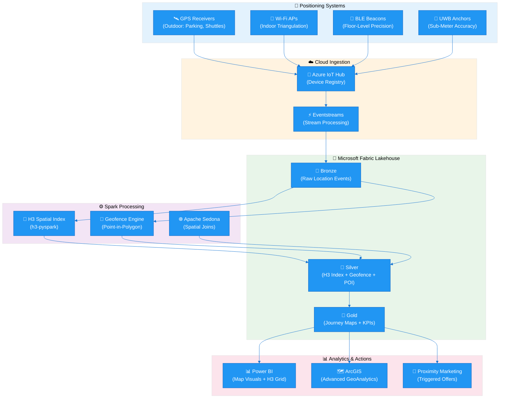
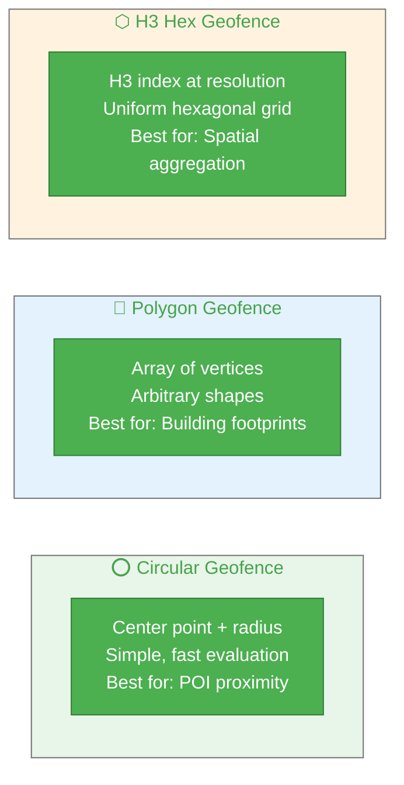
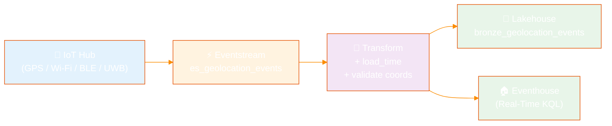

[Home](../../index.md) > [Tutorials](../) > Geolocation Analytics

# 📍 Tutorial 29: Geolocation Analytics

> **Last Updated**: 2026-04-15 | **Version**: 2.0
> **Status**: ✅ Final | **Maintainer**: Documentation Team

<div align="center">


</div>

---

## 📍 Tutorial 29: Geolocation Analytics

| | |
|---|---|
| **Difficulty** | ⭐⭐⭐ Advanced |
| **Time** | ⏱️ 120-150 minutes |
| **Focus** | Geospatial Analytics, H3 Indexing, Geofencing & Proximity Marketing |

---

### 📊 Progress Tracker

```
┌──────┬──────┬──────┬──────┬──────┬──────┬──────┬──────┬──────┬──────┬──────┬──────┬──────┬──────┐
│  00  │  01  │  02  │  03  │  04  │  05  │  06  │  07  │  08  │  09  │  10  │  11  │  12  │  13  │
│SETUP │BRNZE │SILVR │ GOLD │  RT  │ PBI  │PIPES │ GOV  │MIRRR │AI/ML │TDATA │ SAS  │CICD  │MIGR  │
├──────┼──────┼──────┼──────┼──────┼──────┼──────┼──────┼──────┼──────┼──────┼──────┼──────┼──────┤
│  ✅  │  ✅  │  ✅  │  ✅  │  ✅  │  ✅  │  ✅  │  ✅  │  ✅  │  ✅  │  ✅  │  ✅  │  ✅  │  ✅  │
└──────┴──────┴──────┴──────┴──────┴──────┴──────┴──────┴──────┴──────┴──────┴──────┴──────┴──────┘

┌──────┬──────┬──────┬──────┬──────┬──────┬──────┬──────┬──────┬──────┬──────┬──────┬──────┬──────┬──────┬──────┬──────┬──────┐
│  14  │  15  │  16  │  17  │  18  │  19  │  20  │  21  │  22  │  23  │  24  │  25  │  26  │  27  │  28  │  29  │  30  │  31  │
│ SEC  │ COST │PERF  │ MON  │SHARE │COPLT │WKBST │ GEO  │ NET  │SHIR  │ SNW  │ DB2  │MULTI │VIDEO │ MOVE │GEOLC │TRIBL │ DOT  │
├──────┼──────┼──────┼──────┼──────┼──────┼──────┼──────┼──────┼──────┼──────┼──────┼──────┼──────┼──────┼──────┼──────┼──────┤
│  ✅  │  ✅  │  ✅  │  ✅  │  ✅  │  ✅  │  ✅  │  ✅  │  ✅  │  ✅  │  ✅  │  ✅  │  ✅  │  ✅  │  ✅  │  🔵  │  ○   │  ○   │
└──────┴──────┴──────┴──────┴──────┴──────┴──────┴──────┴──────┴──────┴──────┴──────┴──────┴──────┴──────┴──────┴──────┴──────┘
                                                                                                          ▲
                                                                                                   YOU ARE HERE
```

| Navigation | |
|---|---|
| ⬅️ **Previous** | [28-People Movement Analytics](../28-people-movement-analytics/README.md) |
| ➡️ **Next** | [30-Tribal Healthcare Analytics](../30-tribal-healthcare/README.md) |

---

## 📖 Overview

Casino resorts span hundreds of thousands of square feet across gaming floors, hotel towers, parking structures, restaurants, pools, and entertainment venues. Understanding **where** patrons, employees, and assets are at any given moment transforms operations from reactive to predictive. This tutorial teaches you to build a complete geolocation analytics pipeline in Microsoft Fabric -- from GPS receivers and indoor positioning beacons through H3 spatial indexing and geofence-triggered marketing to real-time heat-map dashboards.

You will ingest location signals from multiple positioning systems (GPS, Wi-Fi, BLE, UWB), index them with Uber's H3 hexagonal spatial system for sub-second aggregation, evaluate geofence boundary crossings to trigger proximity offers, and surface patron journey intelligence through Power BI geospatial visuals. The architecture builds directly on [Tutorial 21: GeoAnalytics & ArcGIS](../21-geoanalytics-arcgis/README.md) by extending regional-scale market analytics to meter-level indoor positioning and real-time patron tracking.

> **💡 Why Geolocation Analytics?**
>
> - **Proximity marketing**: Push a steakhouse coupon when a Diamond loyalty patron walks past the restaurant entrance
> - **Journey optimization**: Identify that patrons who visit the sportsbook first spend 30% more at the casino bar
> - **Operational efficiency**: Track shuttle fleet positions, valet vehicle dwell times, and security patrol coverage
> - **Compliance**: Verify that minors detected in restricted gaming zones trigger immediate security dispatch


*Source: [Lakehouse Overview](https://learn.microsoft.com/en-us/fabric/data-engineering/lakehouse-overview)*

---

## 🎯 Learning Objectives

By the end of this tutorial, you will be able to:

- [ ] Compare positioning technologies (GPS, Wi-Fi, BLE, UWB) and select the right mix for casino resort operations
- [ ] Define geofence zones using circular, polygon, and H3 hex boundaries for casino floor regions
- [ ] Implement Uber H3 spatial indexing at resolutions 7-12 for casino-scale aggregation
- [ ] Ingest real-time location events through Fabric Eventstreams into a Bronze Delta table
- [ ] Process location data through Silver layer transformations including H3 computation, geofence evaluation, and speed/heading derivation
- [ ] Build Gold layer location intelligence with patron journey mapping, dwell time analysis, and revenue attribution by zone
- [ ] Create DAX measures for proximity-triggered marketing conversion rates and zone profitability
- [ ] Visualize geolocation data using Power BI map visuals, H3 hex grids, and patron journey animations
- [ ] Integrate with ArcGIS GeoAnalytics Engine for advanced spatial analysis (see Tutorial 21)
- [ ] Troubleshoot common geospatial data quality issues including GPS drift, indoor signal loss, and coordinate precision

---

## 🏗️ Architecture Diagram



| Component | Technology | Purpose |
|-----------|-----------|---------|
| **Positioning** | GPS / Wi-Fi / BLE / UWB | Capture device coordinates at varying precision levels |
| **Ingestion** | Azure IoT Hub + Eventstreams | Register devices, route location telemetry at scale |
| **Bronze** | Delta Lake (append-only) | Store raw location events with full fidelity |
| **Spatial Processing** | h3-pyspark, Apache Sedona | Compute hex indices, evaluate geofence boundaries, calculate proximity |
| **Silver** | Delta Lake (validated) | Enriched events with H3 index, geofence zone, nearest POI |
| **Gold** | Delta Lake (aggregated) | Patron journeys, zone dwell times, marketing conversion rates |
| **Visualization** | Power BI + ArcGIS | Heat maps, journey animations, geofence monitoring |

---

## 🛠️ Step 1: Positioning Systems for Casino Resort Operations

Understanding the strengths and limitations of each positioning technology is critical for designing a multi-layer location system that covers both the 200-acre resort exterior and the casino floor interior.

### 1.1 GPS -- Outdoor Tracking

GPS is the foundation for tracking assets and patrons in outdoor areas: parking garages, valet lanes, shuttle routes, pool decks, and golf courses.

```python
# GPS location event from a shuttle tracker
gps_event = {
    "event_id": "evt-gps-20240115-143022-001",
    "device_id": "SHUTTLE-NB-003",
    "device_type": "shuttle_tracker",
    "timestamp": "2024-01-15T14:30:22.000Z",
    "latitude": 36.1147,
    "longitude": -115.1728,
    "altitude_meters": 620.5,
    "accuracy_meters": 3.2,
    "speed_mps": 8.9,
    "heading_degrees": 275.0,
    "source_system": "gps",
    "battery_level": 87.0
}
```

> **💡 GPS Characteristics for Casino Use**
>
> - Accuracy: 3-5 meters in open sky, degrades near tall hotel towers
> - Update rate: 1 Hz typical for fleet tracking, 10 Hz for precision applications
> - Power draw: Moderate -- suitable for vehicle-mounted and wearable devices
> - Limitation: Signals do not penetrate indoor structures; requires handoff to indoor positioning

### 1.2 Wi-Fi Triangulation -- Indoor Positioning

Casino resorts already deploy hundreds of Wi-Fi access points for guest connectivity. Triangulation against these APs provides room-level indoor positioning without additional hardware.

```python
# Wi-Fi triangulated position from a patron's mobile app
wifi_event = {
    "event_id": "evt-wifi-20240115-143055-042",
    "device_id": "APP-PLY00045891",
    "device_type": "patron_app",
    "timestamp": "2024-01-15T14:30:55.000Z",
    "latitude": 36.1142,
    "longitude": -115.1735,
    "accuracy_meters": 8.0,
    "floor_level": 1,
    "indoor_zone": "SLOT_ZONE_B2",
    "source_system": "wifi_triangulation",
    "battery_level": 62.0
}
```

### 1.3 BLE Trilateration -- Precise Indoor Tracking

Bluetooth Low Energy beacons installed at known positions enable trilateration for 1-3 meter indoor accuracy. Ideal for gaming floor zone detection.

```python
# BLE position from an employee badge
ble_event = {
    "event_id": "evt-ble-20240115-143110-088",
    "device_id": "BADGE-EMP-00234",
    "device_type": "employee_badge",
    "timestamp": "2024-01-15T14:31:10.000Z",
    "latitude": 36.1143,
    "longitude": -115.1733,
    "accuracy_meters": 1.5,
    "floor_level": 1,
    "indoor_zone": "TABLE_PIT_3",
    "source_system": "ble_trilateration",
    "battery_level": 94.0
}
```

### 1.4 Ultra-Wideband (UWB) -- Sub-Meter Accuracy

UWB provides centimeter-level accuracy for high-value asset tracking: chip trays, cash carts, and VIP patron experiences.

```python
# UWB position from a chip tray asset tag
uwb_event = {
    "event_id": "evt-uwb-20240115-143122-005",
    "device_id": "ASSET-CHIPTRAY-0042",
    "device_type": "asset_tag",
    "timestamp": "2024-01-15T14:31:22.000Z",
    "latitude": 36.1143,
    "longitude": -115.1734,
    "accuracy_meters": 0.15,
    "floor_level": 1,
    "indoor_zone": "TABLE_PIT_3",
    "source_system": "uwb",
    "battery_level": 78.0
}
```

### 1.5 Hybrid Positioning

Production deployments combine multiple systems. A patron's mobile app might use GPS in the parking lot, switch to Wi-Fi when entering the lobby, and upgrade to BLE precision on the gaming floor.

```python
# Hybrid position event -- system selects best available fix
hybrid_event = {
    "event_id": "evt-hyb-20240115-143200-112",
    "device_id": "APP-PLY00045891",
    "device_type": "patron_app",
    "timestamp": "2024-01-15T14:32:00.000Z",
    "latitude": 36.1142,
    "longitude": -115.1735,
    "accuracy_meters": 2.0,
    "floor_level": 1,
    "indoor_zone": "SLOT_ZONE_B2",
    "source_system": "hybrid",
    "battery_level": 61.0
}
```

### 1.6 Positioning Technology Comparison

| Technology | Accuracy | Range | Cost per Unit | Battery Impact | Best For |
|-----------|----------|-------|---------------|----------------|----------|
| **GPS** | 3-5 m | Global (outdoor) | $15-50 | Moderate | Shuttles, valet, parking |
| **Wi-Fi** | 5-15 m | Building-wide | $0 (existing APs) | Low | Room-level indoor tracking |
| **BLE** | 1-3 m | 30-70 m per beacon | $5-25/beacon | Very Low | Gaming floor zones, POI proximity |
| **UWB** | 10-30 cm | 10-50 m per anchor | $50-150/anchor | Moderate | High-value asset tracking, VIP |
| **Hybrid** | 1-5 m | Seamless | Combined | Varies | End-to-end patron journey |

> **⚠️ Privacy Considerations**
>
> Location tracking requires explicit patron consent via the mobile app opt-in. All PII must be pseudonymized before analytics processing. See [Tutorial 07: Governance & Purview](../07-governance-purview/README.md) and [Tutorial 14: Security & Networking](../14-security-networking/README.md) for compliance requirements.

---

## 🛠️ Step 2: Geofence Configuration

Geofences define virtual boundaries around physical zones. When a tracked device crosses a geofence boundary, the system generates entry, exit, or dwell events that drive operational workflows and marketing triggers.

### 2.1 Casino Resort Geofence Zones

```python
# Geofence zone definitions for a Las Vegas casino resort
# Save as: data_generation/config/geofences.py

CASINO_GEOFENCES = [
    # ----- Gaming Floor -----
    {
        "geofence_id": "GF-MAIN-FLOOR",
        "geofence_name": "Main Casino Floor",
        "type": "polygon",
        "coordinates": [
            [36.1140, -115.1740], [36.1140, -115.1720],
            [36.1150, -115.1720], [36.1150, -115.1740]
        ],
        "floor_level": 1,
        "category": "gaming",
        "triggers": ["enter", "exit", "dwell"],
        "dwell_threshold_seconds": 300,
        "marketing_eligible": True
    },
    {
        "geofence_id": "GF-HIGH-LIMIT",
        "geofence_name": "High Limit Salon",
        "type": "circular",
        "center": [36.1145, -115.1730],
        "radius_meters": 25,
        "floor_level": 1,
        "category": "gaming_vip",
        "triggers": ["enter", "exit", "dwell"],
        "dwell_threshold_seconds": 120,
        "marketing_eligible": True
    },
    {
        "geofence_id": "GF-SPORTSBOOK",
        "geofence_name": "Sportsbook Lounge",
        "type": "polygon",
        "coordinates": [
            [36.1148, -115.1738], [36.1148, -115.1732],
            [36.1152, -115.1732], [36.1152, -115.1738]
        ],
        "floor_level": 1,
        "category": "gaming",
        "triggers": ["enter", "exit", "dwell"],
        "dwell_threshold_seconds": 600,
        "marketing_eligible": True
    },
    # ----- Hospitality -----
    {
        "geofence_id": "GF-BUFFET",
        "geofence_name": "Grand Buffet",
        "type": "circular",
        "center": [36.1143, -115.1725],
        "radius_meters": 30,
        "floor_level": 1,
        "category": "dining",
        "triggers": ["enter", "exit", "dwell"],
        "dwell_threshold_seconds": 900,
        "marketing_eligible": True
    },
    {
        "geofence_id": "GF-STEAKHOUSE",
        "geofence_name": "Prime Steakhouse",
        "type": "circular",
        "center": [36.1147, -115.1722],
        "radius_meters": 15,
        "floor_level": 1,
        "category": "dining",
        "triggers": ["enter", "dwell"],
        "dwell_threshold_seconds": 600,
        "marketing_eligible": True
    },
    # ----- Hotel -----
    {
        "geofence_id": "GF-HOTEL-LOBBY",
        "geofence_name": "Hotel Lobby",
        "type": "polygon",
        "coordinates": [
            [36.1155, -115.1735], [36.1155, -115.1725],
            [36.1160, -115.1725], [36.1160, -115.1735]
        ],
        "floor_level": 1,
        "category": "hotel",
        "triggers": ["enter", "exit"],
        "dwell_threshold_seconds": 180,
        "marketing_eligible": False
    },
    # ----- Outdoor -----
    {
        "geofence_id": "GF-POOL-DECK",
        "geofence_name": "Pool Deck & Cabanas",
        "type": "circular",
        "center": [36.1160, -115.1730],
        "radius_meters": 60,
        "floor_level": 0,
        "category": "amenity",
        "triggers": ["enter", "exit", "dwell"],
        "dwell_threshold_seconds": 1800,
        "marketing_eligible": True
    },
    {
        "geofence_id": "GF-PARKING-A",
        "geofence_name": "Parking Garage A",
        "type": "polygon",
        "coordinates": [
            [36.1130, -115.1745], [36.1130, -115.1735],
            [36.1138, -115.1735], [36.1138, -115.1745]
        ],
        "floor_level": 0,
        "category": "parking",
        "triggers": ["enter", "exit"],
        "dwell_threshold_seconds": 60,
        "marketing_eligible": False
    },
    {
        "geofence_id": "GF-VALET",
        "geofence_name": "Valet Drop-Off",
        "type": "circular",
        "center": [36.1152, -115.1740],
        "radius_meters": 20,
        "floor_level": 0,
        "category": "parking",
        "triggers": ["enter", "exit"],
        "dwell_threshold_seconds": 120,
        "marketing_eligible": False
    }
]
```

### 2.2 Geofence Types



### 2.3 Entry / Exit / Dwell Event Logic

```python
# Geofence event evaluation logic
# This runs in the Silver layer Spark job

from shapely.geometry import Point, Polygon
from shapely.ops import nearest_points

def evaluate_geofence(lat: float, lon: float, geofences: list) -> dict:
    """
    Evaluate which geofence zone a point falls within.
    Returns geofence_id, geofence_name, and event type.
    """
    point = Point(lon, lat)  # Shapely uses (x, y) = (lon, lat)

    for fence in geofences:
        if fence["type"] == "circular":
            center = Point(fence["center"][1], fence["center"][0])
            # Approximate: 1 degree lat ~111,320 meters
            radius_deg = fence["radius_meters"] / 111320.0
            if point.distance(center) <= radius_deg:
                return {
                    "geofence_id": fence["geofence_id"],
                    "geofence_name": fence["geofence_name"],
                    "category": fence["category"]
                }

        elif fence["type"] == "polygon":
            coords = [(c[1], c[0]) for c in fence["coordinates"]]
            polygon = Polygon(coords)
            if polygon.contains(point):
                return {
                    "geofence_id": fence["geofence_id"],
                    "geofence_name": fence["geofence_name"],
                    "category": fence["category"]
                }

    return {"geofence_id": None, "geofence_name": None, "category": None}
```

> **💡 Dwell Time Tracking**
>
> Dwell events fire when a device remains inside a geofence longer than the configured `dwell_threshold_seconds`. This is computed in the Silver layer by comparing the current event timestamp against the earliest entry timestamp for the same device/geofence pair within a session window.

---

## 🛠️ Step 3: H3 Spatial Indexing

Uber's [H3 hexagonal hierarchical spatial index](https://h3geo.org/) divides the earth's surface into a hierarchy of hexagonal cells. Hexagons are superior to square grids for spatial analytics because they have uniform adjacency (every neighbor shares an edge, not just a corner) and consistent distances from center to edge.

### 3.1 H3 Resolution Levels for Casino Scale

| Resolution | Hex Edge Length | Hex Area | Casino Use Case |
|-----------|----------------|----------|-----------------|
| **7** | ~1,220 m | ~5.16 km^2 | Regional market analysis (city-level) |
| **8** | ~461 m | ~0.74 km^2 | Resort campus footprint |
| **9** | ~174 m | ~0.105 km^2 | Building-level grouping |
| **10** | ~65 m | ~0.015 km^2 | Parking zones, outdoor areas |
| **11** | ~24 m | ~0.002 km^2 | Gaming floor sections |
| **12** | ~9 m | ~380 m^2 | Individual pit or slot bank |

For casino floor analytics, **resolution 10-11** provides the best balance of granularity and aggregation performance. Use resolution 12 only for high-density areas like table pits.

### 3.2 H3 Indexing with PySpark

```python
# Notebook: nb_geolocation_h3_indexing
# Compute H3 spatial indices for location events

# Install h3-pyspark in your Fabric environment
# %pip install h3-pyspark h3

import h3
from pyspark.sql.functions import udf, col, lit, struct
from pyspark.sql.types import StringType, ArrayType, DoubleType

# --- UDF: Convert lat/lon to H3 index ---
@udf(returnType=StringType())
def lat_lon_to_h3(lat, lon, resolution):
    """Convert latitude/longitude to H3 hexagonal index."""
    if lat is None or lon is None:
        return None
    try:
        return h3.latlng_to_cell(lat, lon, resolution)
    except Exception:
        return None

# --- UDF: Get H3 hex center coordinates ---
@udf(returnType=ArrayType(DoubleType()))
def h3_to_center(h3_index):
    """Get the center lat/lon of an H3 hex cell."""
    if h3_index is None:
        return None
    try:
        lat, lon = h3.cell_to_latlng(h3_index)
        return [lat, lon]
    except Exception:
        return None

# --- UDF: Get H3 hex boundary for visualization ---
@udf(returnType=ArrayType(ArrayType(DoubleType())))
def h3_to_boundary(h3_index):
    """Get the boundary vertices of an H3 hex cell."""
    if h3_index is None:
        return None
    try:
        boundary = h3.cell_to_boundary(h3_index)
        return [[lat, lon] for lat, lon in boundary]
    except Exception:
        return None

# --- Apply H3 indexing to location events ---
df_locations = spark.table("bronze_geolocation_events")

df_with_h3 = (
    df_locations
    .withColumn("h3_res10", lat_lon_to_h3(col("latitude"), col("longitude"), lit(10)))
    .withColumn("h3_res11", lat_lon_to_h3(col("latitude"), col("longitude"), lit(11)))
    .withColumn("h3_res12", lat_lon_to_h3(col("latitude"), col("longitude"), lit(12)))
)

display(df_with_h3.select(
    "event_id", "latitude", "longitude", "h3_res10", "h3_res11", "h3_res12"
).limit(10))
```

### 3.3 Spatial Aggregation with H3

```python
# Aggregate patron density by H3 hex cell
# This drives the heat-map visualization in Power BI

from pyspark.sql.functions import count, countDistinct, avg, sum as spark_sum

patron_density = (
    df_with_h3
    .filter(col("device_type") == "patron_app")
    .filter(col("timestamp") >= "2024-01-15T00:00:00Z")
    .groupBy("h3_res10")
    .agg(
        count("event_id").alias("event_count"),
        countDistinct("device_id").alias("unique_patrons"),
        avg("accuracy_meters").alias("avg_accuracy"),
        avg("speed_mps").alias("avg_speed_mps")
    )
    .withColumn("hex_center", h3_to_center(col("h3_res10")))
    .withColumn("hex_boundary", h3_to_boundary(col("h3_res10")))
)

display(patron_density.orderBy(col("unique_patrons").desc()).limit(20))
```

> **💡 H3 Performance Tip**
>
> H3 indices are 64-bit integers stored as 15-character hex strings. They support constant-time lookups, neighbor traversal, and parent/child resolution changes. Partition your Silver Delta tables by the coarsest resolution (e.g., `h3_res10`) for optimal query pruning.

---

## 🛠️ Step 4: Real-Time Ingestion via Eventstreams

Location devices emit high-frequency telemetry that must be ingested with sub-second latency. This step configures Azure IoT Hub as the device registry and Fabric Eventstreams as the streaming pipeline.

### 4.1 Event Schema

The ingestion schema matches the project's `geolocation_schema.json` (see `data_generation/schemas/analytics/geolocation_schema.json`):

```json
{
  "event_id": "evt-hyb-20240115-143200-112",
  "device_id": "APP-PLY00045891",
  "device_type": "patron_app",
  "timestamp": "2024-01-15T14:32:00.000Z",
  "latitude": 36.1142,
  "longitude": -115.1735,
  "altitude_meters": null,
  "accuracy_meters": 2.0,
  "speed_mps": 1.2,
  "heading_degrees": 180.0,
  "h3_index": null,
  "geofence_id": null,
  "geofence_name": null,
  "geofence_event": null,
  "geofence_dwell_seconds": null,
  "poi_name": null,
  "poi_distance_meters": null,
  "floor_level": 1,
  "indoor_zone": "SLOT_ZONE_B2",
  "proximity_trigger": null,
  "source_system": "hybrid",
  "battery_level": 61.0,
  "load_time": "2024-01-15T14:32:00.500Z"
}
```

### 4.2 Eventstream Configuration

1. In your Fabric workspace, click **+ New** > **Eventstream**
2. Name: `es_geolocation_events`
3. Add source: **Azure IoT Hub** (or **Custom App** for testing)
4. Add destination: **Lakehouse** > `lh_bronze` > Table: `bronze_geolocation_events`



### 4.3 Structured Streaming Ingestion (Alternative)

For batch-micro-batch ingestion from a file-based source, use PySpark Structured Streaming:

```python
# Notebook: nb_geolocation_stream_ingest
# Structured Streaming from IoT Hub via Event Hub-compatible endpoint

from pyspark.sql.types import (
    StructType, StructField, StringType, DoubleType,
    IntegerType, TimestampType
)
from pyspark.sql.functions import from_json, col, current_timestamp

# Schema matching geolocation_schema.json
location_schema = StructType([
    StructField("event_id", StringType(), False),
    StructField("device_id", StringType(), False),
    StructField("device_type", StringType(), False),
    StructField("timestamp", StringType(), False),
    StructField("latitude", DoubleType(), False),
    StructField("longitude", DoubleType(), False),
    StructField("altitude_meters", DoubleType(), True),
    StructField("accuracy_meters", DoubleType(), True),
    StructField("speed_mps", DoubleType(), True),
    StructField("heading_degrees", DoubleType(), True),
    StructField("h3_index", StringType(), True),
    StructField("geofence_id", StringType(), True),
    StructField("geofence_name", StringType(), True),
    StructField("geofence_event", StringType(), True),
    StructField("geofence_dwell_seconds", DoubleType(), True),
    StructField("poi_name", StringType(), True),
    StructField("poi_distance_meters", DoubleType(), True),
    StructField("floor_level", IntegerType(), True),
    StructField("indoor_zone", StringType(), True),
    StructField("proximity_trigger", StringType(), True),
    StructField("source_system", StringType(), False),
    StructField("battery_level", DoubleType(), True),
    StructField("load_time", StringType(), True)
])

# Read from Eventstream (Event Hub-compatible endpoint)
raw_stream = (
    spark.readStream
    .format("eventhubs")
    .options(**eh_conf)
    .load()
    .select(from_json(col("body").cast("string"), location_schema).alias("data"))
    .select("data.*")
    .withColumn("load_time", current_timestamp())
)

# Write to Bronze Delta table
(
    raw_stream.writeStream
    .format("delta")
    .outputMode("append")
    .option("checkpointLocation", "Files/checkpoints/geolocation_bronze")
    .toTable("bronze_geolocation_events")
)
```


*Source: [Create and manage an eventstream](https://learn.microsoft.com/en-us/fabric/real-time-intelligence/event-streams/create-manage-an-eventstream)*

---

## 🛠️ Step 5: Bronze Layer -- Raw Location Events

The Bronze layer stores all location events in their original form with minimal transformation. This preserves full fidelity for reprocessing and audit trails.

### 5.1 Bronze Ingestion Notebook

```python
# Notebook: nb_bronze_geolocation
# Ingest raw geolocation events into Bronze Delta table

from pyspark.sql.functions import (
    col, lit, current_timestamp, to_timestamp,
    year, month, dayofmonth, hour
)

# Read raw events (batch mode for initial/backfill load)
raw_df = spark.read.json("Files/raw/geolocation_events/*.json")

# Minimal transformations: type casting + partition columns
bronze_df = (
    raw_df
    .withColumn("event_timestamp", to_timestamp(col("timestamp")))
    .withColumn("load_timestamp", current_timestamp())
    .withColumn("year", year(col("event_timestamp")))
    .withColumn("month", month(col("event_timestamp")))
    .withColumn("day", dayofmonth(col("event_timestamp")))
    .withColumn("hour", hour(col("event_timestamp")))
)

# Write to Bronze Delta table (partitioned by date for query performance)
(
    bronze_df.write
    .format("delta")
    .mode("append")
    .partitionBy("year", "month", "day")
    .saveAsTable("bronze_geolocation_events")
)

record_count = spark.table("bronze_geolocation_events").count()
print(f"Bronze geolocation events: {record_count:,} records")
```

### 5.2 Bronze Table Validation

```python
# Quick validation of Bronze data quality
bronze = spark.table("bronze_geolocation_events")

# Coordinate range check
invalid_coords = bronze.filter(
    (col("latitude") < -90) | (col("latitude") > 90) |
    (col("longitude") < -180) | (col("longitude") > 180)
).count()

print(f"Invalid coordinates: {invalid_coords}")
assert invalid_coords == 0, "Found events with out-of-range coordinates"

# Device type distribution
bronze.groupBy("device_type").count().orderBy("count", ascending=False).show()

# Source system distribution
bronze.groupBy("source_system").count().orderBy("count", ascending=False).show()
```

---

## 🛠️ Step 6: Silver Layer -- Spatial Processing

The Silver layer enriches raw location events with H3 spatial indices, geofence evaluations, point-of-interest proximity calculations, and derived motion metrics (speed, heading). This is the most computationally intensive step and leverages PySpark with optional Apache Sedona for advanced spatial joins.

### 6.1 H3 Index Computation

```python
# Notebook: nb_silver_geolocation
# Silver layer: spatial enrichment pipeline

import h3
from pyspark.sql.functions import (
    udf, col, lag, lead, lit, when, coalesce,
    unix_timestamp, sqrt, pow as spark_pow, atan2, degrees,
    broadcast
)
from pyspark.sql.types import StringType, DoubleType
from pyspark.sql.window import Window

# ---- H3 Index UDFs ----
@udf(returnType=StringType())
def compute_h3(lat, lon, res):
    if lat is None or lon is None:
        return None
    try:
        return h3.latlng_to_cell(lat, lon, res)
    except Exception:
        return None

# Read Bronze data
bronze = spark.table("bronze_geolocation_events")

# Step 1: Compute H3 indices at multiple resolutions
silver_h3 = (
    bronze
    .withColumn("h3_res9", compute_h3(col("latitude"), col("longitude"), lit(9)))
    .withColumn("h3_res10", compute_h3(col("latitude"), col("longitude"), lit(10)))
    .withColumn("h3_res11", compute_h3(col("latitude"), col("longitude"), lit(11)))
)

print("H3 indexing complete")
```

### 6.2 Geofence Intersection Checks

```python
# Step 2: Evaluate geofence membership using broadcast join
# Load geofence definitions as a Spark DataFrame

from shapely.geometry import Point, Polygon

geofence_data = [
    ("GF-MAIN-FLOOR", "Main Casino Floor", "polygon",
     [[36.1140,-115.1740],[36.1140,-115.1720],[36.1150,-115.1720],[36.1150,-115.1740]],
     None, None, "gaming"),
    ("GF-HIGH-LIMIT", "High Limit Salon", "circular",
     None, [36.1145, -115.1730], 25.0, "gaming_vip"),
    ("GF-SPORTSBOOK", "Sportsbook Lounge", "polygon",
     [[36.1148,-115.1738],[36.1148,-115.1732],[36.1152,-115.1732],[36.1152,-115.1738]],
     None, None, "gaming"),
    ("GF-BUFFET", "Grand Buffet", "circular",
     None, [36.1143, -115.1725], 30.0, "dining"),
    ("GF-POOL-DECK", "Pool Deck & Cabanas", "circular",
     None, [36.1160, -115.1730], 60.0, "amenity"),
    ("GF-PARKING-A", "Parking Garage A", "polygon",
     [[36.1130,-115.1745],[36.1130,-115.1735],[36.1138,-115.1735],[36.1138,-115.1745]],
     None, None, "parking"),
]

@udf(returnType=StringType())
def match_geofence_id(lat, lon):
    """Match a coordinate to the first containing geofence."""
    if lat is None or lon is None:
        return None
    point = Point(lon, lat)
    for gf in geofence_data:
        gf_id, _, gf_type, coords, center, radius, _ = gf
        if gf_type == "circular" and center and radius:
            center_pt = Point(center[1], center[0])
            if point.distance(center_pt) <= radius / 111320.0:
                return gf_id
        elif gf_type == "polygon" and coords:
            poly = Polygon([(c[1], c[0]) for c in coords])
            if poly.contains(point):
                return gf_id
    return None

@udf(returnType=StringType())
def match_geofence_name(lat, lon):
    """Return the name of the matched geofence."""
    if lat is None or lon is None:
        return None
    point = Point(lon, lat)
    for gf in geofence_data:
        _, gf_name, gf_type, coords, center, radius, _ = gf
        if gf_type == "circular" and center and radius:
            center_pt = Point(center[1], center[0])
            if point.distance(center_pt) <= radius / 111320.0:
                return gf_name
        elif gf_type == "polygon" and coords:
            poly = Polygon([(c[1], c[0]) for c in coords])
            if poly.contains(point):
                return gf_name
    return None

# Apply geofence matching
silver_geo = (
    silver_h3
    .withColumn("matched_geofence_id", match_geofence_id(col("latitude"), col("longitude")))
    .withColumn("matched_geofence_name", match_geofence_name(col("latitude"), col("longitude")))
)

print("Geofence matching complete")
```

### 6.3 Point-of-Interest Proximity Calculation

```python
# Step 3: Calculate distance to nearest POI

POI_LIST = [
    ("POI-SLOTS-A", "Slot Zone A", 36.1142, -115.1733),
    ("POI-SLOTS-B", "Slot Zone B", 36.1144, -115.1728),
    ("POI-TABLE-PIT-1", "Table Pit 1", 36.1146, -115.1731),
    ("POI-TABLE-PIT-2", "Table Pit 2", 36.1148, -115.1729),
    ("POI-CASHIER", "Main Cashier", 36.1141, -115.1726),
    ("POI-BAR-CENTER", "Center Bar", 36.1145, -115.1730),
    ("POI-BUFFET-ENTRANCE", "Buffet Entrance", 36.1143, -115.1724),
    ("POI-STEAKHOUSE", "Prime Steakhouse", 36.1147, -115.1722),
    ("POI-VIP-LOUNGE", "VIP Lounge", 36.1149, -115.1735),
    ("POI-SPORTSBOOK", "Sportsbook Window", 36.1150, -115.1736),
]

@udf(returnType=StringType())
def nearest_poi_name(lat, lon):
    """Find the name of the nearest POI."""
    if lat is None or lon is None:
        return None
    min_dist = float("inf")
    nearest = None
    for _, name, plat, plon in POI_LIST:
        dist = ((lat - plat)**2 + (lon - plon)**2) ** 0.5
        if dist < min_dist:
            min_dist = dist
            nearest = name
    return nearest

@udf(returnType=DoubleType())
def nearest_poi_distance(lat, lon):
    """Calculate distance in meters to nearest POI."""
    if lat is None or lon is None:
        return None
    min_dist = float("inf")
    for _, _, plat, plon in POI_LIST:
        dlat = (lat - plat) * 111320
        dlon = (lon - plon) * 111320 * 0.833  # cos(36 deg) approx
        dist = (dlat**2 + dlon**2) ** 0.5
        if dist < min_dist:
            min_dist = dist
    return round(min_dist, 2)

silver_poi = (
    silver_geo
    .withColumn("nearest_poi", nearest_poi_name(col("latitude"), col("longitude")))
    .withColumn("poi_dist_meters", nearest_poi_distance(col("latitude"), col("longitude")))
)
```

### 6.4 Speed and Heading Derivation

```python
# Step 4: Derive speed and heading from consecutive location fixes

device_window = Window.partitionBy("device_id").orderBy("event_timestamp")

silver_motion = (
    silver_poi
    .withColumn("prev_lat", lag("latitude", 1).over(device_window))
    .withColumn("prev_lon", lag("longitude", 1).over(device_window))
    .withColumn("prev_ts", lag("event_timestamp", 1).over(device_window))
    .withColumn(
        "time_delta_sec",
        unix_timestamp(col("event_timestamp")) - unix_timestamp(col("prev_ts"))
    )
    .withColumn(
        "distance_meters",
        when(
            col("prev_lat").isNotNull(),
            sqrt(
                spark_pow((col("latitude") - col("prev_lat")) * 111320, 2) +
                spark_pow((col("longitude") - col("prev_lon")) * 111320 * 0.833, 2)
            )
        )
    )
    .withColumn(
        "derived_speed_mps",
        when(
            (col("time_delta_sec") > 0) & (col("distance_meters").isNotNull()),
            col("distance_meters") / col("time_delta_sec")
        )
    )
    .withColumn(
        "derived_heading_deg",
        when(
            col("prev_lat").isNotNull(),
            degrees(atan2(
                col("longitude") - col("prev_lon"),
                col("latitude") - col("prev_lat")
            ))
        )
    )
    .drop("prev_lat", "prev_lon", "prev_ts")
)
```

### 6.5 Apache Sedona Spatial Joins (Optional)

For complex spatial operations such as polygon-to-polygon intersections or buffer queries, Apache Sedona provides optimized distributed spatial joins.

```python
# Optional: Apache Sedona for advanced spatial joins
# %pip install apache-sedona

from sedona.spark import SedonaContext

sedona = SedonaContext.create(spark)

# Register location data as spatial DataFrame
sedona.sql("""
    CREATE OR REPLACE TEMP VIEW location_points AS
    SELECT *,
           ST_Point(CAST(longitude AS DECIMAL(10,6)),
                    CAST(latitude AS DECIMAL(10,6))) AS geom
    FROM silver_geolocation
""")

# Register geofence polygons
sedona.sql("""
    CREATE OR REPLACE TEMP VIEW geofence_polygons AS
    SELECT geofence_id, geofence_name, category,
           ST_GeomFromWKT(wkt_geometry) AS geom
    FROM geofence_definitions
""")

# Spatial join: find all points within each geofence
spatial_join_result = sedona.sql("""
    SELECT l.event_id, l.device_id, l.timestamp,
           g.geofence_id, g.geofence_name, g.category
    FROM location_points l
    JOIN geofence_polygons g
    ON ST_Contains(g.geom, l.geom)
""")

display(spatial_join_result.limit(20))
```

### 6.6 Write Silver Table

```python
# Write enriched data to Silver layer
final_silver = (
    silver_motion
    .select(
        "event_id", "device_id", "device_type", "event_timestamp",
        "latitude", "longitude", "accuracy_meters",
        "h3_res9", "h3_res10", "h3_res11",
        "matched_geofence_id", "matched_geofence_name",
        "nearest_poi", "poi_dist_meters",
        "speed_mps", "derived_speed_mps", "heading_degrees", "derived_heading_deg",
        "floor_level", "indoor_zone", "source_system",
        "battery_level", "load_timestamp",
        "distance_meters", "time_delta_sec",
        "year", "month", "day"
    )
)

(
    final_silver.write
    .format("delta")
    .mode("overwrite")
    .partitionBy("year", "month")
    .saveAsTable("silver_geolocation_events")
)

print(f"Silver geolocation events: {final_silver.count():,} records")
```

---

## 🛠️ Step 7: Gold Layer -- Location Intelligence

The Gold layer transforms enriched location data into business-ready analytics: patron journey maps, zone dwell time aggregations, route popularity rankings, proximity marketing conversion metrics, and revenue attribution by geofence zone.

### 7.1 Patron Journey Mapping

```python
# Notebook: nb_gold_geolocation
# Build patron journey sequences from Silver location events

from pyspark.sql.functions import (
    collect_list, struct, col, count, countDistinct,
    min as spark_min, max as spark_max, sum as spark_sum,
    avg, round as spark_round, datediff, when
)
from pyspark.sql.window import Window

silver = spark.table("silver_geolocation_events")

# Build ordered zone sequence per patron per day
journey_window = Window.partitionBy("device_id", "year", "month", "day").orderBy("event_timestamp")

patron_journeys = (
    silver
    .filter(col("device_type") == "patron_app")
    .filter(col("matched_geofence_name").isNotNull())
    .withColumn("zone_sequence_num", F.row_number().over(journey_window))
    .groupBy("device_id", "year", "month", "day")
    .agg(
        collect_list(
            struct("event_timestamp", "matched_geofence_name", "nearest_poi")
        ).alias("journey_steps"),
        countDistinct("matched_geofence_id").alias("zones_visited"),
        spark_min("event_timestamp").alias("journey_start"),
        spark_max("event_timestamp").alias("journey_end"),
        count("event_id").alias("total_location_pings")
    )
    .withColumn(
        "journey_duration_min",
        spark_round(
            (unix_timestamp(col("journey_end")) - unix_timestamp(col("journey_start"))) / 60, 1
        )
    )
)

(
    patron_journeys.write
    .format("delta")
    .mode("overwrite")
    .saveAsTable("gold_patron_journeys")
)

display(patron_journeys.orderBy(col("zones_visited").desc()).limit(10))
```

### 7.2 Zone Dwell Time Analysis

```python
# Aggregate dwell time by geofence zone
# A "dwell session" is a continuous period where a device stays in one zone

from pyspark.sql import functions as F

zone_dwell = (
    silver
    .filter(col("device_type") == "patron_app")
    .filter(col("matched_geofence_name").isNotNull())
    .groupBy("matched_geofence_id", "matched_geofence_name", "year", "month", "day")
    .agg(
        countDistinct("device_id").alias("unique_patrons"),
        count("event_id").alias("total_events"),
        spark_round(avg("time_delta_sec"), 1).alias("avg_ping_interval_sec"),
        # Approximate total dwell = sum of time deltas where device is in zone
        spark_round(spark_sum("time_delta_sec") / 60, 1).alias("total_dwell_minutes"),
        spark_round(avg("poi_dist_meters"), 1).alias("avg_poi_distance_m")
    )
    .withColumn(
        "avg_dwell_per_patron_min",
        spark_round(col("total_dwell_minutes") / col("unique_patrons"), 1)
    )
)

(
    zone_dwell.write
    .format("delta")
    .mode("overwrite")
    .saveAsTable("gold_zone_dwell_time")
)

display(zone_dwell.orderBy(col("unique_patrons").desc()))
```

### 7.3 Popular Route Analysis

```python
# Identify the most common zone-to-zone transitions
from pyspark.sql.functions import lead

route_window = Window.partitionBy("device_id", "year", "month", "day").orderBy("event_timestamp")

zone_transitions = (
    silver
    .filter(col("device_type") == "patron_app")
    .filter(col("matched_geofence_name").isNotNull())
    .withColumn("next_zone", lead("matched_geofence_name", 1).over(route_window))
    .filter(col("next_zone").isNotNull())
    .filter(col("matched_geofence_name") != col("next_zone"))  # Only transitions
    .groupBy("matched_geofence_name", "next_zone")
    .agg(
        count("event_id").alias("transition_count"),
        countDistinct("device_id").alias("unique_patrons")
    )
    .withColumnRenamed("matched_geofence_name", "from_zone")
    .withColumnRenamed("next_zone", "to_zone")
    .orderBy(col("transition_count").desc())
)

(
    zone_transitions.write
    .format("delta")
    .mode("overwrite")
    .saveAsTable("gold_zone_transitions")
)

display(zone_transitions.limit(20))
```

### 7.4 Proximity Marketing Metrics

```python
# Track proximity-triggered marketing events and conversion rates
proximity_marketing = (
    silver
    .filter(col("device_type") == "patron_app")
    .filter(col("nearest_poi").isNotNull())
    .filter(col("poi_dist_meters") <= 15.0)  # Within 15 meters of POI
    .groupBy("nearest_poi", "year", "month", "day")
    .agg(
        countDistinct("device_id").alias("patrons_in_proximity"),
        count("event_id").alias("proximity_events"),
        spark_round(avg("poi_dist_meters"), 1).alias("avg_distance_m")
    )
)

(
    proximity_marketing.write
    .format("delta")
    .mode("overwrite")
    .saveAsTable("gold_proximity_marketing")
)
```

### 7.5 Revenue Attribution by Location (Join with Gaming Data)

```python
# Join location data with gaming revenue for zone-level revenue attribution
# Requires gold_slot_performance or similar table from Tutorial 03

gaming_revenue = spark.table("gold_slot_performance")

zone_revenue = (
    silver
    .filter(col("device_type") == "patron_app")
    .filter(col("matched_geofence_name").isNotNull())
    .select("device_id", "matched_geofence_name", "event_timestamp", "year", "month", "day")
    .join(
        gaming_revenue.select("player_id", "total_coin_in", "net_win", "session_date"),
        (col("device_id") == col("player_id")) &
        (col("day") == col("session_date")),
        "inner"
    )
    .groupBy("matched_geofence_name", "year", "month")
    .agg(
        spark_sum("total_coin_in").alias("attributed_coin_in"),
        spark_sum("net_win").alias("attributed_net_win"),
        countDistinct("device_id").alias("attributed_patrons")
    )
)

(
    zone_revenue.write
    .format("delta")
    .mode("overwrite")
    .saveAsTable("gold_zone_revenue_attribution")
)
```

### 7.6 DAX Measures for Location Intelligence

```dax
// ---- Power BI DAX Measures for Geolocation Analytics ----

// Unique patrons in selected zone
Unique Patrons in Zone =
DISTINCTCOUNT(gold_zone_dwell_time[unique_patrons])

// Average dwell time per patron
Avg Dwell Time (min) =
AVERAGE(gold_zone_dwell_time[avg_dwell_per_patron_min])

// Proximity marketing conversion rate
// (patrons who visited POI after receiving proximity push / total pushes)
Proximity Conversion Rate =
DIVIDE(
    CALCULATE(
        DISTINCTCOUNT(gold_proximity_marketing[patrons_in_proximity]),
        gold_proximity_marketing[avg_distance_m] <= 5
    ),
    DISTINCTCOUNT(gold_proximity_marketing[patrons_in_proximity]),
    0
)

// Revenue per square meter (using H3 hex area)
Revenue per Hex Cell =
DIVIDE(
    SUM(gold_zone_revenue_attribution[attributed_coin_in]),
    DISTINCTCOUNT(silver_geolocation_events[h3_res11]),
    0
)

// Zone transition popularity score
Transition Score =
DIVIDE(
    SUM(gold_zone_transitions[transition_count]),
    CALCULATE(
        SUM(gold_zone_transitions[transition_count]),
        ALL(gold_zone_transitions[from_zone])
    ),
    0
)

// Hot zone indicator (above-average patron density)
Is Hot Zone =
VAR CurrentPatrons = SUM(gold_zone_dwell_time[unique_patrons])
VAR AvgPatrons = AVERAGE(gold_zone_dwell_time[unique_patrons])
RETURN
    IF(CurrentPatrons > AvgPatrons * 1.5, "Hot", "Normal")
```

---

## 🛠️ Step 8: Geospatial Visualization

### 8.1 Power BI Map Visuals

Configure Power BI with Direct Lake connection to visualize geolocation data on interactive maps.

1. **Open Power BI Desktop** and connect to your Fabric Lakehouse via Direct Lake
2. **Add an Azure Map Visual**:
   - Drag `latitude` to **Latitude**
   - Drag `longitude` to **Longitude**
   - Drag `unique_patrons` to **Size**
   - Drag `matched_geofence_name` to **Legend**


*Source: [Azure Maps Power BI visual](https://learn.microsoft.com/en-us/azure/azure-maps/power-bi-visual-get-started)*

### 8.2 H3 Hex Grid Overlay

Visualize patron density using H3 hexagonal grid cells for uniform spatial aggregation.

```python
# Generate GeoJSON for H3 hex grid visualization
import json
import h3

def h3_hex_to_geojson(h3_density_df):
    """Convert H3 density DataFrame to GeoJSON FeatureCollection."""
    features = []
    for row in h3_density_df.collect():
        h3_idx = row["h3_res10"]
        boundary = h3.cell_to_boundary(h3_idx)
        # GeoJSON uses [lon, lat] order and requires closed ring
        coords = [[lon, lat] for lat, lon in boundary]
        coords.append(coords[0])  # Close the polygon

        feature = {
            "type": "Feature",
            "geometry": {
                "type": "Polygon",
                "coordinates": [coords]
            },
            "properties": {
                "h3_index": h3_idx,
                "event_count": row["event_count"],
                "unique_patrons": row["unique_patrons"],
                "avg_speed": row["avg_speed_mps"]
            }
        }
        features.append(feature)

    return {"type": "FeatureCollection", "features": features}

# Create and save GeoJSON
density_df = spark.table("gold_zone_dwell_time")
# (Use the patron_density DataFrame from Step 3.3 for H3-level data)
# geojson = h3_hex_to_geojson(patron_density)
# Save to Files for Power BI Shape Map or custom visual
```

### 8.3 Patron Journey Animation

Build a time-series animation showing patron movement through casino zones over the course of a visit.

```dax
// Patron journey path -- use with Power BI Play Axis or Scatter Chart animation
Journey Sequence =
RANKX(
    FILTER(
        gold_patron_journeys,
        gold_patron_journeys[device_id] = SELECTEDVALUE(gold_patron_journeys[device_id])
    ),
    gold_patron_journeys[journey_start],
    ,
    ASC,
    Dense
)
```

**Dashboard Configuration:**
- Use a **Scatter Chart** with latitude/longitude on axes and a **Play Axis** slicer on timestamp
- Color by `matched_geofence_name` to show zone transitions
- Size by `dwell_time_min` to emphasize where patrons spend the most time

### 8.4 Geofence Monitoring Dashboard Layout

```
┌─────────────────────────────────────────────────────────────────────────┐
│  📍 GEOLOCATION ANALYTICS DASHBOARD              🔄 Auto-refresh: 30s  │
├──────────────┬──────────────┬──────────────┬───────────────────────────┤
│   👥          │   📍          │   ⏱️          │   🎯                      │
│   1,247      │   9           │   42 min     │   87                     │
│  Active      │  Zones       │  Avg Dwell   │  Proximity               │
│  Patrons     │  Occupied    │  Time        │  Triggers                │
├──────────────┴──────────────┴──────────────┴───────────────────────────┤
│              🗺️ CASINO FLOOR MAP (H3 Heat Grid)                        │
│  ┌─────────────────────────────────────────────────────────────────┐   │
│  │  ⬡ ⬡ ⬡ ⬡ ⬡    [H3 hex cells colored by patron density]       │   │
│  │  ⬡ ⬡ ⬡ ⬡ ⬡    Red = High density | Blue = Low density        │   │
│  │  ⬡ ⬡ ⬡ ⬡ ⬡    Click hex for zone details                     │   │
│  └─────────────────────────────────────────────────────────────────┘   │
├──────────────────────────────────┬──────────────────────────────────────┤
│  🔄 TOP ZONE TRANSITIONS         │  📊 DWELL TIME BY ZONE               │
│  ┌────────────┬─────────┬─────┐  │  Main Floor    ████████████ 45 min  │
│  │ From       │ To      │  #  │  │  Sportsbook    ████████ 32 min      │
│  ├────────────┼─────────┼─────┤  │  Buffet        ███████ 28 min       │
│  │ Parking A  │ Lobby   │ 342 │  │  High Limit    ██████ 24 min        │
│  │ Lobby      │ Floor   │ 298 │  │  Pool Deck     ████ 18 min          │
│  │ Floor      │ Buffet  │ 187 │  │  Bar           ███ 12 min           │
│  │ Sportsbook │ Bar     │ 156 │  │  Steakhouse    ██ 8 min             │
│  └────────────┴─────────┴─────┘  │  Lobby         █ 3 min              │
└──────────────────────────────────┴──────────────────────────────────────┘
```

### 8.5 ArcGIS GeoAnalytics Integration

For advanced spatial analysis beyond what Power BI map visuals offer, integrate with ArcGIS GeoAnalytics Engine. This is covered in detail in [Tutorial 21: GeoAnalytics & ArcGIS](../21-geoanalytics-arcgis/README.md).

Key ArcGIS capabilities that complement this tutorial:

| Capability | Use Case |
|-----------|----------|
| **Hot Spot Analysis (Getis-Ord Gi*)** | Statistically significant clusters of high/low patron activity |
| **Space-Time Pattern Mining** | Detect emerging trends in patron movement over weeks |
| **Network Analysis (Drive Time)** | Calculate shuttle route optimization |
| **Viewshed Analysis** | Verify security camera coverage against patron density |
| **Hexbin Aggregation** | Alternative to H3 using Esri's built-in hex binning |

```python
# Bridge to ArcGIS: Export Silver data for ArcGIS GeoAnalytics
from arcgis.features import GeoAccessor

silver_pdf = spark.table("silver_geolocation_events").limit(100000).toPandas()
silver_sdf = GeoAccessor.from_xy(silver_pdf, "longitude", "latitude")

# Publish as hosted Feature Layer for ArcGIS analysis
layer = silver_sdf.spatial.to_featurelayer(
    title="Casino Patron Locations - Fabric Silver",
    gis=gis,
    folder="Fabric Geolocation"
)
print(f"Published to ArcGIS: {layer.url}")
```

---

## 🔧 Troubleshooting

| Symptom | Likely Cause | Solution |
|---------|-------------|----------|
| H3 UDF returns `None` for valid coordinates | h3 library not installed in Spark environment | Run `%pip install h3` in notebook, restart session |
| GPS coordinates cluster at `(0, 0)` | Device sending default coords when no GPS fix | Filter out `(0, 0)` in Bronze validation; check device firmware |
| Indoor positions jump erratically | Wi-Fi triangulation multipath interference | Apply Kalman filter smoothing; increase BLE beacon density |
| Geofence events not firing | Geofence polygon winding order incorrect | Ensure counter-clockwise vertex ordering for Shapely |
| Dwell time calculation shows 0 for all zones | `time_delta_sec` is NULL due to single-event devices | Require minimum 2 events per device per session in Silver filter |
| H3 aggregation too coarse | Using resolution 7-8 for indoor analytics | Increase to resolution 11-12 for floor-level granularity |
| Eventstream high latency (> 5s) | IoT Hub partition count too low | Scale IoT Hub to S2/S3 tier; increase partition count to 32+ |
| Power BI map visual blank | Latitude/longitude columns not recognized | Ensure column data types are `Decimal Number`; set data category to `Latitude`/`Longitude` |
| Apache Sedona spatial join fails | Geometry column not registered | Verify `ST_Point` / `ST_GeomFromWKT` syntax; check Sedona version compatibility |
| Battery drain on patron devices | GPS polling frequency too high | Reduce GPS to 0.1 Hz outdoors; rely on BLE/Wi-Fi indoors |

---

## 📋 Best Practices

1. **Layer your positioning systems**: Use GPS for outdoor, Wi-Fi for coarse indoor, BLE for zone-level, and UWB only where sub-meter accuracy justifies the cost. Never rely on a single technology.

2. **Choose H3 resolution carefully**: Resolution 10 (65m edge) covers parking areas efficiently; resolution 11 (24m edge) maps well to gaming floor sections; resolution 12 (9m edge) isolates individual table pits. Using too-fine resolution wastes storage and slows aggregation.

3. **Partition Delta tables by time**: Geolocation data grows fast (50,000+ events/hour per resort). Partition Bronze and Silver by `year/month/day` and Gold by `year/month` for efficient time-range pruning.

4. **Apply coordinate validation early**: Filter out `(0, 0)`, out-of-range coordinates, and accuracy_meters > 100 in the Bronze-to-Silver transition. Bad coordinates propagate through every downstream calculation.

5. **Smooth noisy indoor positions**: Wi-Fi triangulation produces jittery coordinates. Apply exponential moving average or Kalman filtering in the Silver layer to reduce false geofence transitions.

6. **Respect patron privacy**: Hash or pseudonymize `device_id` values in Gold tables. Enforce row-level security so only authorized roles can see individual patron journeys. Store raw PII only in Bronze with restricted access.

7. **Broadcast small lookup tables**: Geofence definitions, POI lists, and zone mappings are small datasets. Use `broadcast()` joins in PySpark to avoid expensive shuffle operations.

8. **Monitor battery levels**: Track `battery_level` trends per device type. Devices below 20% produce unreliable location fixes. Alert operations when fleet battery levels drop.

9. **Use H3 for cross-dataset joins**: H3 indices provide a universal spatial key. Join geolocation events with gaming transactions, F&B orders, and loyalty check-ins using the same H3 resolution for consistent spatial attribution.

10. **Test geofences with known positions**: Before production deployment, walk test routes with a logging device and verify that geofence enter/exit events fire at the correct physical boundaries. Adjust polygon vertices and circular radii based on ground truth.

---

## ✅ Summary

Congratulations! You have built a complete geolocation analytics pipeline for casino resort operations in Microsoft Fabric.

### What You Accomplished

- ✅ Evaluated four positioning technologies (GPS, Wi-Fi, BLE, UWB) and their casino use cases
- ✅ Defined geofence zones with circular, polygon, and hexagonal boundaries
- ✅ Implemented Uber H3 spatial indexing at resolutions 9-12 for multi-scale aggregation
- ✅ Ingested real-time location events through Eventstreams into Bronze Delta tables
- ✅ Built Silver layer spatial processing with H3, geofence evaluation, POI proximity, and motion derivation
- ✅ Created Gold layer location intelligence including patron journeys, dwell time analysis, route popularity, and revenue attribution
- ✅ Developed DAX measures for proximity marketing conversion and zone profitability
- ✅ Designed geospatial dashboards with H3 hex grids and patron journey visualizations
- ✅ Connected to ArcGIS GeoAnalytics Engine for advanced spatial analysis

### Key Takeaways

| Concept | Key Point |
|---------|-----------|
| **H3 Spatial Index** | Hexagonal hierarchy provides uniform aggregation and constant-time lookups for geospatial analytics |
| **Geofencing** | Virtual boundaries transform raw coordinates into business events (entry, exit, dwell) |
| **Hybrid Positioning** | Combining GPS/Wi-Fi/BLE/UWB delivers seamless indoor-outdoor tracking |
| **Location Intelligence** | Patron journey mapping and zone revenue attribution drive marketing and operations decisions |
| **Privacy by Design** | Pseudonymize PII, enforce RLS, and require explicit opt-in for location tracking |

---

## 🚀 Next Steps

Continue your learning journey:

**Next Tutorial:** [Tutorial 30: Tribal Healthcare Analytics](../30-tribal-healthcare/README.md) -- Build healthcare analytics pipelines for tribal gaming operations including IHS integration, HIPAA compliance, and clinical data quality frameworks.

**Related Tutorials:**
- [Tutorial 21: GeoAnalytics & ArcGIS](../21-geoanalytics-arcgis/README.md) -- Advanced ArcGIS GeoAnalytics Engine integration for hot spot analysis and network routing
- [Tutorial 28: People Movement Analytics](../28-people-movement-analytics/README.md) -- Computer vision-based occupancy counting and flow analysis
- [Tutorial 04: Real-Time Analytics](../04-real-time-analytics/README.md) -- Eventstreams and Eventhouse fundamentals

---

## 📚 Resources

| Resource | Link |
|----------|------|
| Uber H3 Documentation | [h3geo.org](https://h3geo.org/) |
| Apache Sedona (GeoSpark) | [sedona.apache.org](https://sedona.apache.org/) |
| Azure Maps Power BI Visual | [Microsoft Learn](https://learn.microsoft.com/en-us/azure/azure-maps/power-bi-visual-get-started) |
| Fabric Eventstreams | [Microsoft Learn](https://learn.microsoft.com/en-us/fabric/real-time-intelligence/event-streams/create-manage-an-eventstream) |
| Fabric Lakehouse Overview | [Microsoft Learn](https://learn.microsoft.com/en-us/fabric/data-engineering/lakehouse-overview) |
| ArcGIS for Microsoft Fabric | [esri.com](https://www.esri.com/en-us/arcgis/products/arcgis-for-microsoft-fabric) |
| Azure IoT Hub Documentation | [Microsoft Learn](https://learn.microsoft.com/en-us/azure/iot-hub/) |
| Geolocation Schema Reference | `data_generation/schemas/analytics/geolocation_schema.json` |

---

## 🧭 Navigation

| Previous | Up | Next |
|:---------|:--:|-----:|
| [⬅️ 28-People Movement Analytics](../28-people-movement-analytics/README.md) | [📖 Tutorials Index](../index.md) | [30-Tribal Healthcare Analytics ➡️](../30-tribal-healthcare/README.md) |

---

<div align="center">

**Questions or issues?** Open an issue in the [GitHub repository](https://github.com/frgarofa/Suppercharge_Microsoft_Fabric/issues)

*Tutorial 29 of 31 in the Microsoft Fabric Casino POC Series*

</div>

---

[⬆️ Back to Top](#-tutorial-29-geolocation-analytics) | [📚 Tutorials](../) | [🏠 Home](../../index.md)
