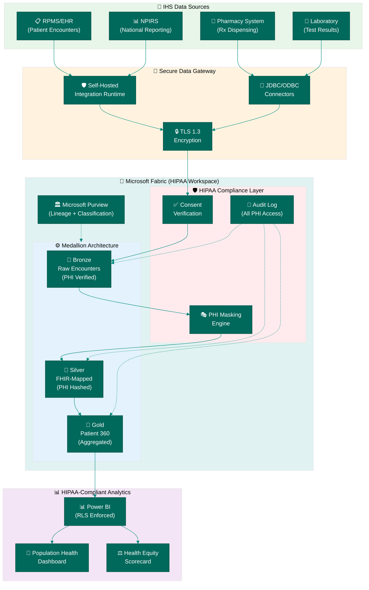
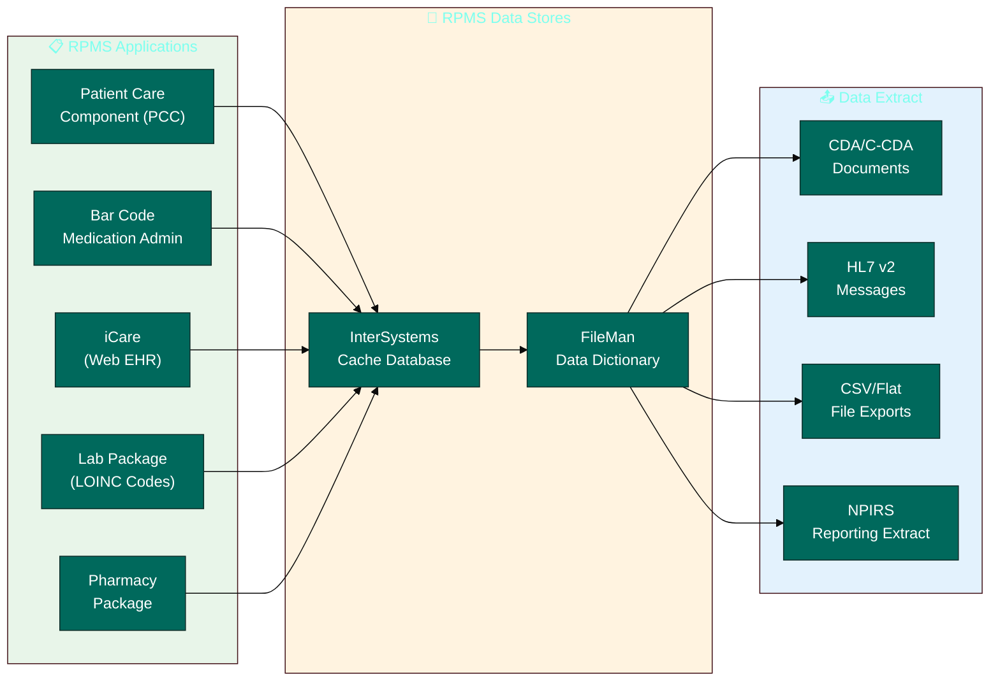

[Home](../../index.md) > [Tutorials](../) > Tribal Healthcare

# 🏥 Tutorial 30: Tribal Healthcare

> **Last Updated**: 2026-04-15 | **Version**: 2.0
> **Status**: ✅ Final | **Maintainer**: Documentation Team

<div align="center" markdown>


</div>

---

!!! info "Third-party references — publicly sourced, good-faith comparison"
    This page references non-Microsoft products and services. That information is drawn from each vendor's **publicly available documentation** and is offered for honest, good-faith comparison only. This is a personal project written from a Microsoft Fabric and Azure perspective; it does **not** claim expertise in, or authority over, any third-party product, and nothing here is an official statement by, or endorsed by, those vendors. Capabilities, pricing, and features change often — always verify against the vendor's current official documentation. Where a third-party offering is the stronger choice, we say so plainly.

---

## 🏥 Tutorial 30: Tribal Healthcare Analytics

| | |
|---|---|
| **Difficulty** | ⭐⭐⭐⭐ Expert |
| **Time** | ⏱️ 150-180 minutes |
| **Focus** | IHS Healthcare Analytics, HIPAA Compliance, Tribal Data Sovereignty & FHIR Standardization |

---

### 📊 Progress Tracker

```
┌──────┬──────┬──────┬──────┬──────┬──────┬──────┬──────┬──────┬──────┬──────┬──────┬──────┬──────┐
│  00  │  01  │  02  │  03  │  04  │  05  │  06  │  07  │  08  │  09  │  10  │  11  │  12  │  13  │
│SETUP │BRNZE │SILVR │ GOLD │  RT  │ PBI  │PIPES │ GOV  │MIRRR │AI/ML │TDATA │ SAS  │CICD  │MIGR  │
├──────┼──────┼──────┼──────┼──────┼──────┼──────┼──────┼──────┼──────┼──────┼──────┼──────┼──────┤
│  ✅  │  ✅  │  ✅  │  ✅  │  ✅  │  ✅  │  ✅  │  ✅  │  ✅  │  ✅  │  ✅  │  ✅  │  ✅  │  ✅  │
└──────┴──────┴──────┴──────┴──────┴──────┴──────┴──────┴──────┴──────┴──────┴──────┴──────┴──────┘

┌──────┬──────┬──────┬──────┬──────┬──────┬──────┬──────┬──────┬──────┬──────┬──────┬──────┬──────┬──────┬──────┬──────┬──────┐
│  14  │  15  │  16  │  17  │  18  │  19  │  20  │  21  │  22  │  23  │  24  │  25  │  26  │  27  │  28  │  29  │  30  │  31  │
│ SEC  │ COST │PERF  │ MON  │SHARE │COPLT │WKBST │ GEO  │ NET  │SHIR  │ SNW  │ DB2  │MULTI │VIDEO │ MOVE │GEOLC │TRIBL │ DOT  │
├──────┼──────┼──────┼──────┼──────┼──────┼──────┼──────┼──────┼──────┼──────┼──────┼──────┼──────┼──────┼──────┼──────┼──────┤
│  ✅  │  ✅  │  ✅  │  ✅  │  ✅  │  ✅  │  ✅  │  ✅  │  ✅  │  ✅  │  ✅  │  ✅  │  ✅  │  ✅  │  ✅  │  ✅  │  🔵  │  ○   │
└──────┴──────┴──────┴──────┴──────┴──────┴──────┴──────┴──────┴──────┴──────┴──────┴──────┴──────┴──────┴──────┴──────┴──────┘
                                                                                                          ▲
                                                                                                   YOU ARE HERE
```

| Navigation | |
|---|---|
| ⬅️ **Previous** | [29-Geolocation Analytics](../29-geolocation-analytics/README.md) |
| ➡️ **Next** | [31-Federal DOT/FAA Analytics](../31-federal-dot-faa/README.md) |

---

## 📖 Overview

American Indian and Alaska Native (AI/AN) communities face some of the most significant health disparities in the United States. The Indian Health Service (IHS) provides healthcare to approximately 2.6 million enrolled tribal members across 12 Area Offices and hundreds of facilities, yet IHS data systems -- many dating to the 1980s-era Resource and Patient Management System (RPMS) -- struggle to support the population health analytics, care coordination, and health equity measurement that modern healthcare demands.

This tutorial teaches you to build a **HIPAA-compliant healthcare analytics pipeline** in Microsoft Fabric that ingests IHS encounter data, enforces Protected Health Information (PHI) protections at every layer, maps clinical data to HL7 FHIR standards, and produces population health dashboards that reveal diabetes prevalence, behavioral health utilization, and community health indicators across IHS service units.

Unlike typical healthcare analytics tutorials, this one foregrounds **tribal data sovereignty** -- the principle that tribal nations retain inherent authority over their health data. Every architectural decision, from workspace isolation to row-level security to audit logging, reflects the reality that tribal health data carries cultural, legal, and political significance beyond HIPAA's minimum requirements.

> **⚠️ Tribal Data Sovereignty Notice**
>
> Tribal health data is governed not only by HIPAA but also by tribal law, the Indian Self-Determination and Education Assistance Act (ISDEAA), and individual tribal data governance codes. Before implementing any tribal health analytics system:
>
> - Obtain formal data governance approval from each tribal nation whose data you process
> - Consult with tribal epidemiology centers (TECs) for culturally appropriate analytics
> - Ensure data sharing agreements explicitly define permitted uses, retention periods, and deletion rights
> - Respect that some health data may be culturally sensitive beyond what HIPAA recognizes (e.g., traditional medicine encounters, sacred healing ceremonies)
> - Tribal nations may withdraw data access at any time -- your architecture must support clean data removal

> **💡 Why Tribal Healthcare Analytics on Fabric?**
>
> - **Unified platform**: Replace fragmented RPMS extracts, Excel spreadsheets, and Access databases with a single governed lakehouse
> - **HIPAA by design**: Fabric's workspace security, column-level masking, and row-level security enforce PHI protections natively
> - **Health equity measurement**: Quantify disparities in diabetes care, behavioral health access, and immunization coverage across service units
> - **FHIR interoperability**: Map legacy IHS encounter formats to HL7 FHIR R4 for interoperability with state HIEs and CMS
> - **Scalable governance**: Microsoft Purview integration provides lineage, classification, and access auditing across the entire pipeline

---

## 🎯 Learning Objectives

By the end of this tutorial, you will be able to:

- [ ] Configure a HIPAA-compliant Fabric workspace with PHI classification, encryption, and audit logging
- [ ] Implement row-level security (RLS) and column-level masking to protect patient data at the report layer
- [ ] Connect to IHS RPMS data sources through Self-Hosted Integration Runtime (SHIR) with JDBC
- [ ] Ingest tribal healthcare encounters into a Bronze Delta table with PHI consent verification and quarantine logic
- [ ] Transform Bronze data through Silver layer processing including patient ID hashing, FHIR resource mapping, ICD-10 validation, and deduplication
- [ ] Build Gold layer Patient 360 views with encounter timelines, diagnosis histories, medication adherence, and care complexity scoring
- [ ] Calculate population health metrics -- diabetes prevalence, behavioral health utilization, emergency department rates -- by IHS service unit
- [ ] Create DAX measures for a Power BI population health dashboard with RLS enforcement
- [ ] Design health equity visualizations including service utilization heat maps and community health indicator scorecards
- [ ] Apply tribal data sovereignty principles throughout the pipeline: consent-gated ingestion, data isolation, and sovereign deletion capability

---

## 🏗️ Architecture Diagram



| Component | Technology | Purpose |
|-----------|-----------|---------|
| **IHS Data Sources** | RPMS, NPIRS, Pharmacy, Lab | Source healthcare encounter and clinical data from IHS systems |
| **Secure Gateway** | SHIR + JDBC + TLS 1.3 | Encrypted connectivity from on-premises IHS systems to Fabric |
| **Consent Verification** | PySpark validation | Ensure `hipaa_consent=True` and `phi_masked=True` before any data enters Bronze |
| **Bronze** | Delta Lake (append-only) | Raw encounter records with full audit trail and HIPAA metadata |
| **Silver** | Delta Lake (validated) | FHIR-mapped, ICD-10 validated, patient ID hashed, deduplicated encounters |
| **Gold** | Delta Lake (aggregated) | Patient 360 views, population health metrics, community KPIs |
| **Purview** | Microsoft Purview | Data lineage, PHI sensitivity classification, access governance |
| **Power BI** | Direct Lake + RLS | Population health dashboards with row-level security enforcement |

---

## 📋 Prerequisites

Before starting this tutorial, ensure you have:

- [ ] Completed [Tutorial 00: Environment Setup](../00-environment-setup/README.md)
- [ ] Completed [Tutorial 01: Bronze Layer](../01-bronze-layer/README.md)
- [ ] Completed [Tutorial 02: Silver Layer](../02-silver-layer/README.md)
- [ ] Completed [Tutorial 03: Gold Layer](../03-gold-layer/README.md)
- [ ] Completed [Tutorial 05: Direct Lake & Power BI](../05-direct-lake-powerbi/README.md)
- [ ] Completed [Tutorial 07: Governance & Purview](../07-governance-purview/README.md)
- [ ] Completed [Tutorial 14: Security & Networking](../14-security-networking/README.md)
- [ ] Fabric workspace with F64 capacity (or F2+ for development/testing)
- [ ] Familiarity with PySpark, Delta Lake, and DAX patterns from prior tutorials

> **⚠️ HIPAA Compliance Prerequisite**
>
> If you are working with real IHS or tribal health data (not synthetic data from the included generator), your Fabric tenant must have a Business Associate Agreement (BAA) with Microsoft, and your workspace must be configured for HIPAA compliance. See [Microsoft Compliance Documentation](https://learn.microsoft.com/en-us/compliance/regulatory/offering-hipaa-hitech) for requirements.

---

## 🛠️ Step 1: HIPAA Compliance Setup

Before ingesting a single healthcare record, the Fabric workspace must be hardened for HIPAA compliance. This step configures workspace isolation, sensitivity labels, encryption, access controls, and audit logging.

### 1.1 Workspace Security Configuration

Create a dedicated workspace for tribal healthcare data, isolated from other casino analytics workspaces. HIPAA requires that PHI be accessible only to authorized workforce members with a legitimate need.

```python
# Workspace configuration checklist (configure via Fabric Admin Portal)
hipaa_workspace_config = {
    "workspace_name": "ws_tribal_healthcare_phi",
    "description": "HIPAA-compliant workspace for IHS tribal health analytics",
    "license_mode": "Premium",  # Required for sensitivity labels + RLS
    "settings": {
        # Access control
        "workspace_access": "Restricted",        # No automatic access
        "guest_access": "Disabled",               # No external users
        "export_data": "Disabled",                # Prevent PHI export
        "download_reports": "Disabled",           # Prevent PHI download
        "print_reports": "Disabled",              # Prevent PHI printing
        "copy_paste_visuals": "Disabled",         # Prevent clipboard leakage

        # Data protection
        "sensitivity_label": "Highly Confidential - PHI",
        "encryption_at_rest": "AES-256",          # Fabric default
        "encryption_in_transit": "TLS 1.3",       # Fabric default

        # Governance
        "purview_integration": "Enabled",
        "audit_logging": "Enabled",
        "data_lineage_tracking": "Enabled",
    },
    "roles": {
        "Admin": ["tribal_health_data_admin@contoso.com"],
        "Member": ["tribal_health_analyst@contoso.com"],
        "Contributor": ["tribal_health_engineer@contoso.com"],
        "Viewer": ["ihs_area_director@contoso.com"],
    }
}

print("Workspace Configuration:")
for key, value in hipaa_workspace_config["settings"].items():
    print(f"  {key}: {value}")
```

> **💡 Workspace Isolation Principle**
>
> Tribal health data must reside in its own workspace, separate from the casino gaming analytics workspace. This prevents accidental PHI exposure through cross-workspace queries, shared datasets, or inherited permissions. Each tribal nation's data should ideally reside in a separate lakehouse within the workspace, enabling sovereign data isolation.

### 1.2 Row-Level Security for PHI

Row-level security (RLS) restricts which patients and service units each user can see. An IHS Area Director for the Navajo Area Office should see only Navajo-area data, while a tribal epidemiologist should see only their tribe's data.

```dax
// RLS Role: Area Office Director
// Create in Power BI Desktop > Modeling > Manage Roles
[area_office_std] = USERPRINCIPALNAME()

// More practical: Map users to allowed area offices via a security table
// Security table: dim_user_area_access (user_email, area_office, access_level)
VAR CurrentUser = USERPRINCIPALNAME()
VAR AllowedAreas =
    CALCULATETABLE(
        VALUES(dim_user_area_access[area_office]),
        dim_user_area_access[user_email] = CurrentUser
    )
RETURN
    [area_office_std] IN AllowedAreas
```

```dax
// RLS Role: Tribal Data Sovereign
// Restricts data to a specific tribal affiliation
VAR CurrentUser = USERPRINCIPALNAME()
VAR AllowedTribes =
    CALCULATETABLE(
        VALUES(dim_tribal_data_access[tribal_affiliation]),
        dim_tribal_data_access[user_email] = CurrentUser
    )
RETURN
    [tribal_affiliation] IN AllowedTribes
```

### 1.3 Column-Level Masking

Even with RLS, certain columns should be masked for users who need aggregate analytics but not individual patient details.

```python
# Column masking configuration for the Silver/Gold semantic model
column_masking_rules = {
    # Full masking: Replace with fixed value
    "patient_id_hash": {
        "mask_type": "full",
        "replacement": "****MASKED****",
        "visible_to": ["tribal_health_data_admin"],
    },
    # Partial masking: Show first 3 chars of facility
    "facility_name_std": {
        "mask_type": "partial",
        "prefix_chars": 3,
        "replacement_char": "X",
        "visible_to": ["tribal_health_data_admin", "tribal_health_analyst"],
    },
    # Null masking: Return NULL for medication details
    "medication_prescribed": {
        "mask_type": "null",
        "visible_to": ["tribal_health_data_admin"],
    },
    # Age group only (never expose exact date of birth)
    "encounter_date": {
        "mask_type": "year_only",
        "visible_to": ["tribal_health_data_admin", "tribal_health_analyst"],
    },
}

print("Column Masking Rules:")
for col_name, rule in column_masking_rules.items():
    print(f"  {col_name}: {rule['mask_type']} (visible to: {rule['visible_to']})")
```

### 1.4 Encryption and Network Security

```
Encryption Configuration (Fabric defaults + additional hardening):

  At Rest:
    - Delta Lake files: AES-256 encryption via OneLake
    - Parquet column encryption: Enabled for PHI columns
    - Backup encryption: AES-256 with customer-managed keys (CMK)

  In Transit:
    - Fabric API: TLS 1.3 mandatory
    - SHIR to OneLake: TLS 1.3
    - Power BI client to service: TLS 1.3

  Key Management:
    - Azure Key Vault for CMK rotation
    - 90-day key rotation policy
    - Separate key for tribal health workspace
```

### 1.5 Audit Logging Configuration

HIPAA requires a complete audit trail of all access to PHI. Fabric's built-in audit logs capture workspace-level events, but you should supplement with application-level audit logging for data pipeline access.

```python
# Application-level audit log schema
# Written by every notebook that touches PHI data
hipaa_audit_schema = {
    "audit_id": "UUID",
    "audit_timestamp": "ISO 8601",
    "action": "BRONZE_INGESTION | SILVER_TRANSFORM | GOLD_AGGREGATE | REPORT_ACCESS",
    "table_name": "Target table accessed",
    "batch_id": "Pipeline batch identifier",
    "records_affected": "Count of records read/written",
    "records_quarantined": "Count of non-compliant records",
    "phi_violations_detected": "Count of PHI masking violations",
    "consent_violations_detected": "Count of missing consent flags",
    "hipaa_compliant": "Boolean - overall compliance status",
    "user_identity": "Service principal or user UPN",
    "source_notebook": "Notebook name that performed the action",
    "data_classification": "PHI - HIPAA Protected",
    "access_justification": "Business reason for data access",
}

print("HIPAA Audit Log Fields:")
for field, description in hipaa_audit_schema.items():
    print(f"  {field}: {description}")
```

### 1.6 Tribal Data Sovereignty Considerations

Beyond HIPAA, tribal data sovereignty requires additional protections.

| Principle | Implementation | Rationale |
|-----------|---------------|-----------|
| **Data ownership** | Tribal nation retains ownership of all data | Data is held in trust, not transferred |
| **Consent granularity** | Per-tribe, per-use consent flags | Different tribes may consent to different analytics |
| **Right to deletion** | Hard-delete capability per tribal affiliation | Tribe can withdraw data at any time |
| **Data residency** | Azure region selection per tribal agreement | Some tribes require US-only data residency |
| **Access notification** | Alert tribal data steward on any PHI access | Transparency beyond HIPAA minimums |
| **Cultural sensitivity** | Traditional medicine encounters flagged separately | Not all health data fits Western clinical models |
| **Secondary use prohibition** | No commercial use, no re-identification research | Stricter than HIPAA de-identification safe harbor |

```python
# Tribal data sovereignty verification before any analytics query
def verify_tribal_data_access(tribal_affiliation: str, use_case: str) -> bool:
    """
    Check whether the specified use case is permitted for the given tribe's data.
    Consult the tribal_data_governance table before proceeding.
    """
    governance = spark.table("lh_bronze.tribal_data_governance")

    permitted = governance.filter(
        (col("tribal_affiliation") == tribal_affiliation) &
        (col("permitted_use_case") == use_case) &
        (col("consent_active") == True) &
        (col("consent_expiry_date") >= current_date())
    ).count()

    if permitted == 0:
        raise PermissionError(
            f"TRIBAL DATA SOVEREIGNTY BLOCK: Use case '{use_case}' "
            f"is not permitted for {tribal_affiliation} data. "
            f"Contact the tribal data governance office."
        )
    return True
```

---

## 🛠️ Step 2: IHS Data Sources

The Indian Health Service operates the **Resource and Patient Management System (RPMS)**, a suite of over 60 clinical and administrative applications built on the VA's VistA/MUMPS platform. Understanding RPMS architecture is essential for designing the ingestion pipeline.

### 2.1 RPMS System Overview



| RPMS Component | Data Type | Key Fields | Volume |
|---------------|-----------|------------|--------|
| **Patient Care Component (PCC)** | Encounters, diagnoses, procedures | ICD-10, CPT, provider NPI | ~15M encounters/year |
| **Pharmacy Package** | Prescriptions, dispensing events | NDC, medication name, dosage | ~8M prescriptions/year |
| **Lab Package** | Test orders and results | LOINC codes, result values, abnormal flags | ~12M results/year |
| **NPIRS Reporting** | National Patient Information Reporting | Aggregated visit counts, demographics | Quarterly extracts |
| **iCare (Web EHR)** | Clinical notes, care plans | Free text (requires NLP for analytics) | Growing adoption |

### 2.2 NPIRS Reporting Data

The National Patient Information Reporting System (NPIRS) collects standardized data from all IHS, tribal, and urban Indian (I/T/U) facilities. NPIRS data is pre-aggregated and de-identified, making it suitable for population health analytics without the full HIPAA burden of patient-level data.

```python
# NPIRS reporting categories relevant to population health
npirs_data_categories = {
    "User Population": "Unduplicated patient counts by facility, age, gender",
    "Workload": "Visit counts by encounter type and provider type",
    "Diabetes Audit": "Annual diabetes care metrics (A1C, LDL, BP control)",
    "Immunization": "Childhood and adult immunization rates by service unit",
    "Behavioral Health": "Mental health and substance abuse encounter counts",
    "Dental": "Dental visit rates and sealant application counts",
    "Maternal/Child Health": "Prenatal care, birth outcomes, well-child visits",
}

for category, description in npirs_data_categories.items():
    print(f"  {category}: {description}")
```

### 2.3 Connecting via Data Gateway / SHIR

IHS facilities typically operate behind government firewalls. A **Self-Hosted Integration Runtime (SHIR)** installed on an approved IHS network host establishes a secure outbound tunnel to Fabric.

```python
# SHIR configuration for IHS RPMS connectivity
# Reference: Tutorial 23 - SHIR & Data Gateways

shir_config = {
    "runtime_name": "SHIR-IHS-RPMS-01",
    "host": "ihs-etl-server.ihs.gov",
    "os": "Windows Server 2022",
    "network_zone": "IHS DMZ",

    # RPMS Cache database connection
    "jdbc_driver": "com.intersystems.jdbc.IRISDriver",
    "jdbc_url": "jdbc:IRIS://rpms-db.ihs.gov:1972/RPMS",
    "authentication": "LDAP (IHS Active Directory)",
    "tls_version": "1.3",
    "certificate": "IHS-issued PKI certificate",

    # Outbound connectivity
    "fabric_endpoint": "https://onelake.dfs.fabric.microsoft.com",
    "proxy": "http://proxy.ihs.gov:8080",
    "firewall_rules": [
        "Allow TCP 443 outbound to *.fabric.microsoft.com",
        "Allow TCP 443 outbound to *.dfs.fabric.microsoft.com",
        "Allow TCP 443 outbound to login.microsoftonline.com",
    ],
}

print("SHIR Configuration:")
for key, value in shir_config.items():
    if isinstance(value, list):
        print(f"  {key}:")
        for item in value:
            print(f"    - {item}")
    else:
        print(f"  {key}: {value}")
```

### 2.4 JDBC Configuration

```python
# JDBC connection properties for RPMS Cache database
jdbc_properties = {
    "driver": "com.intersystems.jdbc.IRISDriver",
    "url": "jdbc:IRIS://rpms-db.ihs.gov:1972/RPMS",
    "user": "${IHS_SERVICE_ACCOUNT}",        # From Azure Key Vault
    "password": "${IHS_SERVICE_PASSWORD}",    # From Azure Key Vault
    "fetchSize": "10000",
    "queryTimeout": "3600",
    "ssl": "true",
    "sslProtocols": "TLSv1.3",

    # RPMS-specific settings
    "readOnly": "true",                       # Never write back to RPMS
    "applicationName": "FabricTribalHealth",  # For RPMS audit trail
}

# Example: Read PCC encounter data via JDBC
# (In production, use Fabric Data Pipeline with SHIR connection)
rpms_query = """
    SELECT
        e.encounter_id,
        e.patient_dfn,
        e.encounter_date,
        e.encounter_type,
        e.facility_code,
        d.icd10_code,
        d.icd10_description,
        p.provider_npi,
        p.provider_type
    FROM PCC_ENCOUNTER e
    JOIN PCC_DIAGNOSIS d ON e.encounter_id = d.encounter_id
    JOIN PCC_PROVIDER p ON e.provider_ien = p.provider_ien
    WHERE e.encounter_date >= '2023-01-01'
    AND e.encounter_date < '2024-01-01'
"""

print("RPMS Query configured for encounter extraction")
print(f"Query targets: PCC_ENCOUNTER, PCC_DIAGNOSIS, PCC_PROVIDER")
```

> **⚠️ Production Note**: For this tutorial, we use the included synthetic data generator ([`tribal_healthcare_generator.py`](https://github.com/fgarofalo56/Suppercharge_Microsoft_Fabric/blob/main/data_generation/generators/federal/tribal_healthcare_generator.py)) rather than connecting to a live RPMS system. The generator produces realistic IHS encounter data with proper schema compliance. See [Tutorial 23: SHIR & Data Gateways](../23-shir-data-gateways/README.md) for production SHIR setup.

---

## 🛠️ Step 3: Bronze Layer Ingestion

The Bronze layer ingests raw encounter data with **two non-negotiable gates**: PHI masking verification and HIPAA consent verification. Records failing either gate are quarantined, never ingested.

> **📓 Notebook Reference**: [`notebooks/bronze/07_bronze_tribal_health.py`](https://github.com/fgarofalo56/Suppercharge_Microsoft_Fabric/blob/main/notebooks/bronze/07_bronze_tribal_health.py)

### 3.1 Schema Definition

The schema aligns with the tribal health encounter schema defined in [`data_generation/schemas/federal/tribal_health_schema.json`](https://github.com/fgarofalo56/Suppercharge_Microsoft_Fabric/blob/main/data_generation/schemas/federal/tribal_health_schema.json).

```python
# Schema definition for Bronze layer ingestion
# Reference: tribal_health_schema.json

from pyspark.sql.types import *

tribal_health_schema = StructType([
    StructField("encounter_id", StringType(), False),       # UUID, required
    StructField("patient_id", StringType(), False),         # PAT-XXXXXXXX, required
    StructField("encounter_date", DateType(), False),       # ISO date, required
    StructField("encounter_type", StringType(), True),      # outpatient, inpatient, etc.
    StructField("facility_id", StringType(), True),         # IHS facility code
    StructField("facility_name", StringType(), True),       # Facility display name
    StructField("service_unit", StringType(), True),        # IHS service unit
    StructField("area_office", StringType(), True),         # IHS area office (12 regions)
    StructField("provider_id", StringType(), True),         # NPI (10-digit)
    StructField("provider_type", StringType(), True),       # MD, NP, PA, etc.
    StructField("icd10_code", StringType(), True),          # ICD-10 diagnosis
    StructField("icd10_description", StringType(), True),   # Diagnosis description
    StructField("diagnosis_category", StringType(), True),  # High-level category
    StructField("procedure_code", StringType(), True),      # CPT code
    StructField("procedure_description", StringType(), True),
    StructField("medication_prescribed", StringType(), True),
    StructField("medication_ndc", StringType(), True),      # NDC 5-4-2 format
    StructField("insurance_type", StringType(), True),      # IHS_CONTRACT, MEDICAID, etc.
    StructField("insurance_id", StringType(), True),
    StructField("visit_duration_minutes", IntegerType(), True),
    StructField("referral_flag", BooleanType(), True),
    StructField("referral_destination", StringType(), True),
    StructField("follow_up_required", BooleanType(), True),
    StructField("follow_up_date", DateType(), True),
    StructField("phi_masked", BooleanType(), True),         # PHI masking flag
    StructField("hipaa_consent", BooleanType(), True),      # HIPAA consent flag
    StructField("tribal_affiliation", StringType(), True),  # Federally recognized tribe
    StructField("community_health_rep_id", StringType(), True),
    StructField("telehealth_flag", BooleanType(), True),
    StructField("emergency_flag", BooleanType(), True),
])

print(f"Schema fields: {len(tribal_health_schema.fields)}")
print(f"Required fields: {sum(1 for f in tribal_health_schema.fields if not f.nullable)}")
```

### 3.2 PHI Consent Verification

This is the critical compliance gate. **No record enters the lakehouse without verified consent.**

```python
# HIPAA compliance verification -- runs before ANY data is written
# This code is from notebook 07_bronze_tribal_health.py

REQUIRE_PHI_MASKED = True
REQUIRE_HIPAA_CONSENT = True

# Read raw source data
df_raw = spark.read \
    .schema(tribal_health_schema) \
    .parquet(f"{SOURCE_PATH}*.parquet")

# Check phi_masked flag
phi_violations = df_raw.filter(
    (col("phi_masked").isNull()) | (col("phi_masked") == False)
).count()

# Check hipaa_consent flag
consent_violations = df_raw.filter(
    (col("hipaa_consent").isNull()) | (col("hipaa_consent") == False)
).count()

print("HIPAA Compliance Check:")
print(f"  PHI Masking Violations: {phi_violations}")
print(f"  Consent Violations: {consent_violations}")

# Separate compliant from non-compliant records
df_compliant = df_raw.filter(
    (col("phi_masked") == True) & (col("hipaa_consent") == True)
)

df_quarantined = df_raw.filter(
    (col("phi_masked") != True) | (col("hipaa_consent") != True) |
    col("phi_masked").isNull() | col("hipaa_consent").isNull()
)

# CRITICAL: Halt if zero compliant records
if df_compliant.count() == 0:
    raise Exception("HIPAA BLOCK: Zero compliant records. Ingestion halted.")
```

### 3.3 Bronze Write with Audit Trail

```python
# Add ingestion metadata and write to Bronze
df_bronze = df_compliant \
    .withColumn("_ingested_at", current_timestamp()) \
    .withColumn("_source_file", input_file_name()) \
    .withColumn("_batch_id", lit(BATCH_ID)) \
    .withColumn("_run_id", lit(RUN_ID)) \
    .withColumn("_load_date", current_timestamp().cast("date"))

# Write to Delta table (append-only -- never overwrite Bronze)
df_bronze.write \
    .format("delta") \
    .mode("append") \
    .option("mergeSchema", "true") \
    .partitionBy("_load_date") \
    .saveAsTable("lh_bronze.bronze_tribal_health_encounters")

# Write HIPAA audit log entry
audit_entry = spark.createDataFrame([{
    "audit_id": RUN_ID,
    "audit_timestamp": datetime.utcnow().isoformat(),
    "action": "BRONZE_INGESTION",
    "table_name": "lh_bronze.bronze_tribal_health_encounters",
    "records_ingested": df_bronze.count(),
    "records_quarantined": df_quarantined.count(),
    "phi_violations_detected": phi_violations,
    "consent_violations_detected": consent_violations,
    "hipaa_compliant": True,
    "data_classification": "PHI - HIPAA Protected",
}])

audit_entry.write \
    .format("delta") \
    .mode("append") \
    .saveAsTable("lh_bronze.tribal_health_hipaa_audit_log")

print(f"Bronze: {df_bronze.count():,} records ingested")
print(f"Quarantine: {df_quarantined.count():,} records blocked")
print(f"Audit log: Entry written for run {RUN_ID}")
```

> **💡 Why append-only Bronze?**
>
> Healthcare audit requirements demand that no ingested record is ever silently overwritten or deleted. Bronze serves as the immutable audit trail. If corrections are needed, they are applied in the Silver layer as new versions with lineage back to the original Bronze record.

---

## 🛠️ Step 4: Silver Layer -- PHI Masking & FHIR Standardization

The Silver layer transforms raw encounters into clinically validated, FHIR-aligned records with hashed patient identifiers and enriched diagnosis metadata.

> **📓 Notebook Reference**: [`notebooks/silver/07_silver_tribal_health.py`](https://github.com/fgarofalo56/Suppercharge_Microsoft_Fabric/blob/main/notebooks/silver/07_silver_tribal_health.py)

### 4.1 Patient ID Hashing

Patient identifiers are hashed with SHA-256 in the Silver layer. The original `patient_id` is available only in Bronze (restricted access). All downstream analytics use the hash.

```python
# Patient ID hashing -- second line of defense after Bronze consent check
# SHA-256 produces a 64-character hex string

df_phi = df_bronze \
    .withColumn(
        "patient_id_hash",
        when(
            length(col("patient_id")) == 64,
            col("patient_id")                   # Already hashed
        ).otherwise(
            sha2(col("patient_id"), 256)        # Hash raw patient_id
        )
    )

# Verify no raw SSN patterns exist in any string column
ssn_pattern = r"^\d{3}-\d{2}-\d{4}$"
string_columns = [f.name for f in df_bronze.schema.fields if isinstance(f.dataType, StringType)]

for col_name in string_columns:
    ssn_count = df_bronze.filter(col(col_name).rlike(ssn_pattern)).count()
    if ssn_count > 0:
        raise Exception(f"PHI VIOLATION: {col_name} contains {ssn_count} SSN-like values!")
```

### 4.2 FHIR Resource Mapping

Map IHS encounter types to HL7 FHIR R4 Encounter resource classes for interoperability with state Health Information Exchanges (HIEs) and CMS quality reporting programs.

```python
# FHIR R4 Encounter class mapping
# Reference: http://terminology.hl7.org/CodeSystem/v3-ActCode

ENCOUNTER_TO_FHIR_CLASS = {
    "INPATIENT": "IMP",           # Inpatient encounter
    "OUTPATIENT": "AMB",          # Ambulatory
    "EMERGENCY": "EMER",          # Emergency
    "TELEHEALTH": "VR",           # Virtual
    "HOME_VISIT": "HH",           # Home health
    "DENTAL": "AMB",              # Ambulatory (dental)
    "BEHAVIORAL_HEALTH": "AMB",   # Ambulatory (behavioral)
    "SUBSTANCE_ABUSE": "AMB",     # Ambulatory (substance abuse)
    "IMMUNIZATION": "AMB",        # Ambulatory (immunization)
    "PHARMACY": "AMB",            # Ambulatory (pharmacy)
    "URGENT_CARE": "EMER",        # Emergency (urgent)
}

fhir_class_expr = create_map([lit(x) for pair in ENCOUNTER_TO_FHIR_CLASS.items() for x in pair])

df_fhir = df_phi \
    .withColumn("encounter_type_clean", upper(trim(col("encounter_type")))) \
    .withColumn(
        "fhir_encounter_class",
        coalesce(fhir_class_expr[upper(trim(col("encounter_type")))], lit("AMB"))
    ) \
    .withColumn("fhir_resource_type", lit("Encounter")) \
    .withColumn(
        "fhir_service_type",
        when(col("encounter_type_clean") == "DENTAL", lit("dental"))
        .when(col("encounter_type_clean").isin("BEHAVIORAL_HEALTH", "SUBSTANCE_ABUSE"), lit("mental-health"))
        .when(col("encounter_type_clean") == "IMMUNIZATION", lit("immunization"))
        .when(col("encounter_type_clean") == "PHARMACY", lit("pharmacy"))
        .otherwise(lit("general-practice"))
    )
```

### 4.3 ICD-10 Validation and Enrichment

```python
# ICD-10 format validation: letter + 2 digits + optional decimal + up to 4 digits
ICD10_PATTERN = r"^[A-Z]\d{2}(\.\d{1,4})?$"

df_icd = df_fhir \
    .withColumn("icd10_code_clean", upper(trim(col("icd10_code")))) \
    .withColumn("icd10_valid", col("icd10_code_clean").rlike(ICD10_PATTERN)) \
    .withColumn(
        "icd10_chapter",
        when(col("icd10_code_clean").rlike("^[AB]"), lit("Infectious Diseases"))
        .when(col("icd10_code_clean").startswith("E"), lit("Endocrine/Metabolic"))
        .when(col("icd10_code_clean").startswith("F"), lit("Mental/Behavioral"))
        .when(col("icd10_code_clean").startswith("I"), lit("Circulatory System"))
        .when(col("icd10_code_clean").startswith("J"), lit("Respiratory System"))
        .when(col("icd10_code_clean").startswith("K"), lit("Digestive System"))
        .when(col("icd10_code_clean").startswith("M"), lit("Musculoskeletal"))
        .when(col("icd10_code_clean").startswith("Z"), lit("Health Status/Services"))
        .otherwise(lit("Other"))
    ) \
    .withColumn("is_diabetes_related", col("icd10_code_clean").rlike("^E1[0-4]")) \
    .withColumn("is_behavioral_health", col("icd10_code_clean").rlike("^F[0-9]")) \
    .withColumn("is_substance_use", col("icd10_code_clean").rlike("^F1[0-9]"))

# Validation report
valid_icd = df_icd.filter(col("icd10_valid") == True).count()
invalid_icd = df_icd.filter(col("icd10_valid") == False).count()

print(f"ICD-10 Validation: {valid_icd:,} valid, {invalid_icd:,} invalid")
print(f"Validation rate: {valid_icd / (valid_icd + invalid_icd) * 100:.1f}%")
```

### 4.4 Deduplication

```python
# Deduplicate by composite key: patient + date + diagnosis
before_dedup = df_icd.count()

df_deduped = df_icd.dropDuplicates(["patient_id_hash", "encounter_date", "icd10_code_clean"])

after_dedup = df_deduped.count()
print(f"Deduplication: {before_dedup:,} -> {after_dedup:,} ({before_dedup - after_dedup:,} duplicates removed)")
```

### 4.5 Write to Silver

```python
# Write Silver layer with data quality scoring
df_silver = df_deduped \
    .withColumn("_dq_score",
        when(col("encounter_id").isNotNull(), lit(15)).otherwise(lit(0)) +
        when(col("patient_id_hash").isNotNull(), lit(15)).otherwise(lit(0)) +
        when(col("encounter_date").isNotNull(), lit(10)).otherwise(lit(0)) +
        when(col("icd10_valid") == True, lit(15)).otherwise(lit(0)) +
        when(col("facility_name").isNotNull(), lit(10)).otherwise(lit(0)) +
        when(col("provider_id").isNotNull(), lit(10)).otherwise(lit(0)) +
        when(col("insurance_type").isNotNull(), lit(10)).otherwise(lit(0)) +
        when(col("tribal_affiliation").isNotNull(), lit(5)).otherwise(lit(0)) +
        when(col("service_unit").isNotNull(), lit(5)).otherwise(lit(0)) +
        when(col("area_office").isNotNull(), lit(5)).otherwise(lit(0))
    ) \
    .withColumn("_silver_timestamp", current_timestamp())

df_silver.write \
    .format("delta") \
    .mode("overwrite") \
    .option("overwriteSchema", "true") \
    .partitionBy("encounter_date") \
    .saveAsTable("lh_silver.silver_tribal_health_encounters")

# Optimize for Direct Lake queries
spark.sql("OPTIMIZE lh_silver.silver_tribal_health_encounters ZORDER BY (patient_id_hash, area_office_std)")
```

---

## 🛠️ Step 5: Gold Layer -- Patient 360

The Gold layer builds comprehensive patient views and population health aggregations from the validated Silver data.

> **📓 Notebook Reference**: [`notebooks/gold/07_gold_tribal_health_360.py`](https://github.com/fgarofalo56/Suppercharge_Microsoft_Fabric/blob/main/notebooks/gold/07_gold_tribal_health_360.py)

### 5.1 Patient Encounter Timeline

```python
# Build Patient 360 view: encounter history aggregation
df_encounter_summary = df_silver \
    .groupBy("patient_id_hash") \
    .agg(
        count("*").alias("total_encounters"),
        countDistinct("encounter_date").alias("distinct_visit_days"),
        min("encounter_date").alias("first_encounter_date"),
        max("encounter_date").alias("last_encounter_date"),
        countDistinct("facility_name_std").alias("facilities_visited"),
        countDistinct("provider_id").alias("distinct_providers"),

        # Encounter type breakdown
        sum(when(col("encounter_type_std") == "OUTPATIENT", 1).otherwise(0)).alias("outpatient_visits"),
        sum(when(col("encounter_type_std") == "INPATIENT", 1).otherwise(0)).alias("inpatient_visits"),
        sum(when(col("encounter_type_std") == "EMERGENCY", 1).otherwise(0)).alias("emergency_visits"),
        sum(when(col("encounter_type_std") == "TELEHEALTH", 1).otherwise(0)).alias("telehealth_visits"),
        sum(when(col("encounter_type_std") == "DENTAL", 1).otherwise(0)).alias("dental_visits"),
        sum(when(col("encounter_type_std") == "BEHAVIORAL_HEALTH", 1).otherwise(0)).alias("behavioral_health_visits"),
        sum(when(col("encounter_type_std") == "IMMUNIZATION", 1).otherwise(0)).alias("immunization_visits"),

        # Visit metrics
        avg("visit_duration_minutes").alias("avg_visit_duration_min"),
        sum(when(col("referral_flag") == True, 1).otherwise(0)).alias("total_referrals"),
        sum(when(col("follow_up_required") == True, 1).otherwise(0)).alias("follow_ups_required"),
    )
```

### 5.2 Diagnosis History Aggregation

```python
# Diagnosis summary per patient with chronic condition flags
df_diagnosis_summary = df_silver \
    .filter(col("icd10_code_clean").isNotNull()) \
    .groupBy("patient_id_hash") \
    .agg(
        countDistinct("icd10_code_clean").alias("distinct_diagnoses"),
        collect_set("icd10_chapter").alias("diagnosis_chapters"),

        # Chronic condition flags critical for tribal health
        max(col("is_diabetes_related").cast("int")).alias("has_diabetes"),
        max(col("is_behavioral_health").cast("int")).alias("has_behavioral_health"),
        max(col("is_substance_use").cast("int")).alias("has_substance_use"),

        # Top diagnoses
        collect_set("diagnosis_category").alias("diagnosis_categories"),
    ) \
    .withColumn("has_diabetes", col("has_diabetes").cast("boolean")) \
    .withColumn("has_behavioral_health", col("has_behavioral_health").cast("boolean")) \
    .withColumn("has_substance_use", col("has_substance_use").cast("boolean"))
```

### 5.3 Medication Adherence Metrics

```python
# Medication list and adherence indicators
df_medication_summary = df_silver \
    .filter(col("medication_prescribed").isNotNull()) \
    .groupBy("patient_id_hash") \
    .agg(
        countDistinct("medication_prescribed").alias("distinct_medications"),
        collect_set("medication_prescribed").alias("medication_list"),
        countDistinct("medication_ndc").alias("distinct_ndc_codes"),
    )
```

### 5.4 Join into Patient 360

```python
# Assemble the Patient 360 view
df_patient_360 = df_encounter_summary \
    .join(df_diagnosis_summary, "patient_id_hash", "left") \
    .join(df_medication_summary, "patient_id_hash", "left") \
    .join(df_demographics, "patient_id_hash", "left")

# Calculate derived metrics
df_patient_360 = df_patient_360 \
    .withColumn("days_since_last_visit",
        datediff(current_date(), col("last_encounter_date"))
    ) \
    .withColumn("encounters_per_year",
        when(col("patient_tenure_days") > 0,
            round(col("total_encounters") * 365.0 / col("patient_tenure_days"), 2)
        ).otherwise(col("total_encounters").cast("double"))
    ) \
    .withColumn("ed_utilization_rate",
        when(col("total_encounters") > 0,
            round(col("emergency_visits") * 100.0 / col("total_encounters"), 2)
        ).otherwise(lit(0.0))
    ) \
    .withColumn("chronic_condition_count",
        coalesce(col("has_diabetes").cast("int"), lit(0)) +
        coalesce(col("has_behavioral_health").cast("int"), lit(0)) +
        coalesce(col("has_substance_use").cast("int"), lit(0))
    ) \
    .withColumn("care_complexity",
        when(col("chronic_condition_count") >= 3, lit("High"))
        .when(col("chronic_condition_count") >= 2, lit("Medium"))
        .when(col("chronic_condition_count") >= 1, lit("Low"))
        .otherwise(lit("Routine"))
    )

# Write Gold Patient 360
df_patient_360.write \
    .format("delta") \
    .mode("overwrite") \
    .option("overwriteSchema", "true") \
    .saveAsTable("lh_gold.gold_tribal_patient_360")

spark.sql("OPTIMIZE lh_gold.gold_tribal_patient_360 ZORDER BY (patient_id_hash, primary_area_office)")
```

---

## 🛠️ Step 6: Population Health Analytics

Population health metrics aggregate patient-level data to the service unit and area office level, revealing health disparities and resource allocation needs across IHS regions.

### 6.1 Diabetes Prevalence by Service Unit

Diabetes affects American Indian and Alaska Native adults at more than twice the rate of non-Hispanic whites. Tracking prevalence by service unit enables targeted intervention programs.

```python
# Diabetes prevalence calculation per service unit
df_diabetes = df_silver \
    .filter(col("is_diabetes_related") == True) \
    .groupBy("service_unit_std") \
    .agg(
        countDistinct("patient_id_hash").alias("diabetes_patients"),
        count("*").alias("diabetes_encounters"),
    )

df_service_unit_pop = df_silver \
    .groupBy("service_unit_std", "area_office_std") \
    .agg(
        countDistinct("patient_id_hash").alias("total_patients"),
        count("*").alias("total_encounters"),
    )

df_pop_health = df_service_unit_pop \
    .join(df_diabetes, "service_unit_std", "left") \
    .fillna(0, subset=["diabetes_patients", "diabetes_encounters"]) \
    .withColumn("diabetes_prevalence_rate",
        round(col("diabetes_patients") * 100.0 / col("total_patients"), 2)
    )
```

### 6.2 Behavioral Health Utilization

```python
# Behavioral health utilization -- critical for tribal communities
df_behavioral = df_silver \
    .filter(col("is_behavioral_health") == True) \
    .groupBy("service_unit_std") \
    .agg(
        countDistinct("patient_id_hash").alias("behavioral_health_patients"),
        count("*").alias("behavioral_health_encounters"),
    )

# Substance use disorders -- often co-occurring
df_substance = df_silver \
    .filter(col("is_substance_use") == True) \
    .groupBy("service_unit_std") \
    .agg(
        countDistinct("patient_id_hash").alias("substance_use_patients"),
        count("*").alias("substance_use_encounters"),
    )

# Join to population
df_pop_health = df_pop_health \
    .join(df_behavioral, "service_unit_std", "left") \
    .join(df_substance, "service_unit_std", "left") \
    .fillna(0) \
    .withColumn("behavioral_health_utilization_rate",
        round(col("behavioral_health_patients") * 100.0 / col("total_patients"), 2)
    ) \
    .withColumn("substance_use_rate",
        round(col("substance_use_patients") * 100.0 / col("total_patients"), 2)
    )
```

### 6.3 Community Health Indicators

```python
# Area office-level community health KPIs
df_community_kpis = df_silver \
    .groupBy("area_office_std") \
    .agg(
        countDistinct("patient_id_hash").alias("total_patients"),
        count("*").alias("total_encounters"),
        countDistinct("facility_name_std").alias("total_facilities"),
        countDistinct("provider_id").alias("total_providers"),

        # Chronic disease prevalence
        round(
            countDistinct(when(col("is_diabetes_related"), col("patient_id_hash"))) * 100.0 /
            countDistinct("patient_id_hash"), 2
        ).alias("diabetes_prevalence_pct"),
        round(
            countDistinct(when(col("is_behavioral_health"), col("patient_id_hash"))) * 100.0 /
            countDistinct("patient_id_hash"), 2
        ).alias("behavioral_health_pct"),

        # Access indicators
        round(
            sum(when(col("encounter_type_std") == "EMERGENCY", 1).otherwise(0)) * 100.0 /
            count("*"), 2
        ).alias("ed_encounter_rate_pct"),
        round(
            sum(when(col("encounter_type_std") == "TELEHEALTH", 1).otherwise(0)) * 100.0 /
            count("*"), 2
        ).alias("telehealth_rate_pct"),

        # Insurance gap
        round(
            sum(when(col("insurance_type_std") == "UNINSURED", 1).otherwise(0)) * 100.0 /
            count("*"), 2
        ).alias("uninsured_rate_pct"),
    )

# Write community KPIs
df_community_kpis.write \
    .format("delta") \
    .mode("overwrite") \
    .saveAsTable("lh_gold.gold_tribal_community_kpis")
```

### 6.4 Population Health Table Output

```python
# Write population health table
df_pop_health.write \
    .format("delta") \
    .mode("overwrite") \
    .saveAsTable("lh_gold.gold_tribal_population_health")

spark.sql("OPTIMIZE lh_gold.gold_tribal_population_health ZORDER BY (service_unit_std, area_office_std)")

print("Gold layer tables written:")
print(f"  gold_tribal_patient_360: {spark.table('lh_gold.gold_tribal_patient_360').count():,} patients")
print(f"  gold_tribal_population_health: {spark.table('lh_gold.gold_tribal_population_health').count():,} service units")
print(f"  gold_tribal_community_kpis: {spark.table('lh_gold.gold_tribal_community_kpis').count():,} area offices")
```

---

## 🛠️ Step 7: Power BI Dashboard

The Power BI dashboard surfaces population health insights while enforcing row-level security so each user sees only the tribal data they are authorized to access.

### 7.1 DAX Measures for Population Health

```dax
// ===== Population Health Measures =====

// Diabetes Prevalence Rate (%)
Diabetes Prevalence % =
DIVIDE(
    CALCULATE(
        DISTINCTCOUNT(gold_tribal_patient_360[patient_id_hash]),
        gold_tribal_patient_360[has_diabetes] = TRUE()
    ),
    DISTINCTCOUNT(gold_tribal_patient_360[patient_id_hash]),
    0
) * 100

// Behavioral Health Utilization Rate (%)
Behavioral Health Utilization % =
DIVIDE(
    CALCULATE(
        DISTINCTCOUNT(gold_tribal_patient_360[patient_id_hash]),
        gold_tribal_patient_360[has_behavioral_health] = TRUE()
    ),
    DISTINCTCOUNT(gold_tribal_patient_360[patient_id_hash]),
    0
) * 100

// ED Visit Rate (per 1,000 patients)
ED Visit Rate per 1K =
DIVIDE(
    CALCULATE(
        SUM(gold_tribal_patient_360[emergency_visits])
    ),
    DISTINCTCOUNT(gold_tribal_patient_360[patient_id_hash]),
    0
) * 1000

// Telehealth Adoption Rate (%)
Telehealth Adoption % =
DIVIDE(
    CALCULATE(
        SUM(gold_tribal_patient_360[telehealth_visits])
    ),
    CALCULATE(
        SUM(gold_tribal_patient_360[total_encounters])
    ),
    0
) * 100

// Average Encounters per Patient per Year
Avg Encounters per Year =
AVERAGE(gold_tribal_patient_360[encounters_per_year])

// Care Complexity Distribution
High Complexity Patients % =
DIVIDE(
    CALCULATE(
        DISTINCTCOUNT(gold_tribal_patient_360[patient_id_hash]),
        gold_tribal_patient_360[care_complexity] = "High"
    ),
    DISTINCTCOUNT(gold_tribal_patient_360[patient_id_hash]),
    0
) * 100

// Uninsured Rate
Uninsured Rate % =
DIVIDE(
    CALCULATE(
        DISTINCTCOUNT(gold_tribal_patient_360[patient_id_hash]),
        gold_tribal_patient_360[current_insurance_type] = "UNINSURED"
    ),
    DISTINCTCOUNT(gold_tribal_patient_360[patient_id_hash]),
    0
) * 100

// Days Since Last Visit (Average)
Avg Days Since Last Visit =
AVERAGE(gold_tribal_patient_360[days_since_last_visit])
```

### 7.2 Population Health Dashboard Layout

```
┌─────────────────────────────────────────────────────────────────────────────┐
│  🏥 TRIBAL HEALTHCARE - POPULATION HEALTH DASHBOARD                        │
│  Area Office: [Slicer] │ Service Unit: [Slicer] │ Date Range: [Slicer]    │
├───────────────────┬──────────────────┬──────────────────┬──────────────────┤
│  📊 Total         │  🩺 Diabetes     │  🧠 Behavioral   │  🚑 ED Visit    │
│  Patients         │  Prevalence      │  Health Rate      │  Rate           │
│  12,847           │  18.3%           │  14.7%            │  22.1/1K        │
├───────────────────┴──────────────────┴──────────────────┴──────────────────┤
│                                                                             │
│  ┌─────────────────────────────────┐  ┌──────────────────────────────────┐ │
│  │  Diabetes Prevalence by         │  │  Service Utilization Heat Map   │ │
│  │  Service Unit                   │  │                                  │ │
│  │  [Clustered Bar Chart]          │  │  [Matrix Visual: Service Unit   │ │
│  │                                 │  │   x Encounter Type with         │ │
│  │  Navajo SU: ████████ 22.1%     │  │   conditional formatting]       │ │
│  │  Phoenix SU: ██████ 16.8%      │  │                                  │ │
│  │  Oklahoma SU: █████ 15.2%      │  │                                  │ │
│  └─────────────────────────────────┘  └──────────────────────────────────┘ │
│                                                                             │
│  ┌─────────────────────────────────┐  ┌──────────────────────────────────┐ │
│  │  Care Complexity Distribution   │  │  Health Equity Scorecard         │ │
│  │  [Donut Chart]                  │  │  [KPI Cards by Area Office]     │ │
│  │                                 │  │                                  │ │
│  │  Routine: 45%                   │  │  Immunization Coverage: 67%     │ │
│  │  Low: 28%                       │  │  Prenatal Care Rate: 72%        │ │
│  │  Medium: 18%                    │  │  Telehealth Adoption: 23%       │ │
│  │  High: 9%                       │  │  Follow-Up Compliance: 58%      │ │
│  └─────────────────────────────────┘  └──────────────────────────────────┘ │
│                                                                             │
│  ┌──────────────────────────────────────────────────────────────────────┐  │
│  │  Encounter Volume Trend by Month                                     │  │
│  │  [Line Chart: Total encounters, ED visits, Telehealth visits]       │  │
│  └──────────────────────────────────────────────────────────────────────┘  │
│                                                                             │
│  🔒 RLS Active: Showing data for authorized area offices only              │
└─────────────────────────────────────────────────────────────────────────────┘
```

### 7.3 Service Utilization Heat Map

```dax
// Conditional formatting measure for the heat map matrix
Encounter Intensity =
VAR CurrentCount = COUNT(silver_tribal_health_encounters[encounter_id])
VAR MaxCount =
    CALCULATE(
        COUNT(silver_tribal_health_encounters[encounter_id]),
        REMOVEFILTERS(silver_tribal_health_encounters[service_unit_std])
    )
RETURN
    DIVIDE(CurrentCount, MaxCount, 0)
```

### 7.4 Health Equity Metrics

```dax
// Health equity: Compare area office metrics to IHS national average
Diabetes vs National Avg =
VAR AreaRate = [Diabetes Prevalence %]
VAR NationalAvg =
    CALCULATE(
        [Diabetes Prevalence %],
        REMOVEFILTERS(gold_tribal_community_kpis[area_office_std])
    )
RETURN
    AreaRate - NationalAvg

// Disparity indicator: Flag service units significantly above average
Disparity Flag =
IF(
    [Diabetes vs National Avg] > 5,
    "Above Average",
    IF(
        [Diabetes vs National Avg] < -5,
        "Below Average",
        "Within Range"
    )
)
```

### 7.5 RLS Enforcement in Reports

```dax
// Row-Level Security role definition
// Applied in Power BI Desktop > Modeling > Manage Roles

// Role: "Area Office Director"
// Table filter on gold_tribal_patient_360:
[primary_area_office] IN
    CALCULATETABLE(
        VALUES(dim_user_area_access[area_office]),
        dim_user_area_access[user_email] = USERPRINCIPALNAME()
    )

// Role: "Tribal Epidemiologist"
// Table filter on gold_tribal_patient_360:
[tribal_affiliation] IN
    CALCULATETABLE(
        VALUES(dim_tribal_data_access[tribal_affiliation]),
        dim_tribal_data_access[user_email] = USERPRINCIPALNAME()
    )
```

> **⚠️ RLS Testing Requirement**
>
> After configuring RLS roles, test with "View as Role" in Power BI Desktop and with specific user accounts in the Power BI service. Verify that:
> 1. An unauthorized user sees zero rows (not an error, but an empty report)
> 2. Each role sees only its permitted data slice
> 3. The "All Data" superuser role is restricted to the tribal health data admin only

---

## 🔧 Troubleshooting

| Symptom | Likely Cause | Solution |
|---------|-------------|----------|
| `HIPAA BLOCK: Zero compliant records` | Source data missing `phi_masked` or `hipaa_consent` flags | Verify data generator output or RPMS extract includes both boolean flags set to `True` |
| Patient ID hash mismatch across batches | Raw patient_id format changed between extracts | Standardize patient_id format (trim, uppercase) before hashing in Silver |
| ICD-10 validation rate below 90% | Malformed codes from legacy RPMS extract | Check for leading/trailing spaces; verify RPMS ICD-10 dictionary is current |
| FHIR class mapping returns `AMB` for all records | `encounter_type` values not matching map keys | Ensure `encounter_type_clean` is uppercased and trimmed before map lookup |
| RLS returning empty reports for authorized users | `USERPRINCIPALNAME()` returns different format than security table | Verify UPN format matches exactly (case-sensitive); check for domain suffix differences |
| Silver table partition skew | All encounters on same date in test data | Use generator with `--date-range` flag to produce multi-day synthetic data |
| Gold Patient 360 count exceeds Silver unique patients | Left join duplicating rows due to multiple demographic records | Ensure demographics uses `row_number()` window to select latest record per patient |
| Power BI Direct Lake fallback to DirectQuery | Gold table not optimized or too many columns | Run `OPTIMIZE` with `ZORDER BY` on frequently filtered columns; reduce column count |
| Audit log table growing unbounded | No retention policy on `tribal_health_hipaa_audit_log` | Apply Delta `VACUUM` with 365-day retention; archive older entries to cold storage |
| Purview not detecting PHI columns | Sensitivity labels not applied to workspace | Apply "Highly Confidential - PHI" sensitivity label at workspace level; re-scan |

---

## 📋 Best Practices

1. **Consent before compute.** Never process a healthcare record without verifying `hipaa_consent=True` and `phi_masked=True`. The Bronze ingestion notebook must quarantine non-compliant records before any transformation occurs. This is not optional -- it is a HIPAA requirement.

2. **Hash patient identifiers at the Silver layer.** Use SHA-256 hashing for `patient_id` in Silver and Gold. Only the Bronze layer retains the original identifier, and Bronze access should be restricted to the data admin role. This limits PHI exposure surface.

3. **Respect tribal data sovereignty beyond HIPAA.** HIPAA is the minimum standard. Tribal health data governance codes may impose stricter requirements on data residency, secondary use, and deletion timelines. Always consult with the tribal data governance office before adding new analytics use cases.

4. **Partition by encounter date, Z-Order by patient and area office.** Healthcare queries typically filter by time range and then by geography. The combination of date partitioning and Z-Order on `patient_id_hash` plus `area_office_std` optimizes both pattern types.

5. **Audit every PHI access programmatically.** Fabric's built-in audit logs capture workspace events, but your notebooks should write application-level audit entries to `tribal_health_hipaa_audit_log` for every read or write operation on PHI tables. This creates a defensible audit trail for HIPAA compliance reviews.

6. **Use FHIR mapping for interoperability.** The Silver layer's FHIR Encounter class mapping enables future integration with state Health Information Exchanges, CMS quality reporting, and other tribal health systems. Even if you do not need FHIR today, the mapping costs nothing to maintain and pays dividends later.

7. **Enforce RLS at the semantic model level.** Row-level security must be applied in the Power BI semantic model, not just in the Fabric lakehouse. A user with Viewer access to the workspace could otherwise bypass lakehouse-level controls by connecting directly to the Delta tables.

8. **Monitor data quality scores continuously.** The Silver layer's `_dq_score` column enables tracking quality trends over time. Set up a Fabric Activator alert when the average quality score for a batch drops below 80, indicating potential RPMS extract issues.

9. **Support sovereign data deletion.** Design your pipeline so that all records for a specific `tribal_affiliation` can be identified and deleted across Bronze, Silver, and Gold layers within 72 hours. Test this capability regularly. Tribal nations may exercise their right to withdraw data access at any time.

10. **Separate culturally sensitive encounters.** Some tribal health encounters (traditional medicine consultations, sacred healing ceremonies, culturally specific behavioral health programs) may require additional protections beyond standard HIPAA PHI rules. Work with tribal epidemiology centers to define appropriate handling for these encounter types.

---

## ✅ Summary

Congratulations! You have built a HIPAA-compliant tribal healthcare analytics pipeline in Microsoft Fabric.

### What You Accomplished

- Configured a HIPAA-hardened Fabric workspace with PHI sensitivity labels, disabled data export, and comprehensive audit logging
- Implemented row-level security and column-level masking to protect patient data at every access point
- Designed a secure data gateway architecture for IHS RPMS connectivity through SHIR with TLS 1.3 encryption
- Built a Bronze ingestion pipeline with mandatory PHI consent verification and quarantine logic for non-compliant records
- Transformed encounters through Silver layer processing: patient ID hashing, FHIR R4 resource mapping, ICD-10 validation, and composite-key deduplication
- Created Gold layer Patient 360 views with encounter timelines, chronic condition flags, medication lists, and care complexity scoring
- Calculated population health metrics (diabetes prevalence, behavioral health utilization, ED visit rates) by IHS service unit and area office
- Developed DAX measures for a Power BI population health dashboard with health equity scorecards and RLS enforcement
- Applied tribal data sovereignty principles: consent-gated ingestion, data isolation by tribal affiliation, and sovereign deletion capability

### Key Takeaways

| Concept | Key Point |
|---------|-----------|
| **HIPAA Compliance** | PHI consent and masking verification must gate every layer; audit logs must capture every access event |
| **Tribal Data Sovereignty** | Tribal nations retain ownership of their health data; respect governance codes beyond HIPAA minimums |
| **FHIR Interoperability** | Mapping IHS encounter types to FHIR R4 classes enables future HIE integration at minimal cost |
| **Population Health** | Aggregating patient-level data to service unit and area office reveals health disparities and resource needs |
| **Patient 360** | Combining encounters, diagnoses, medications, and demographics into a single view enables care coordination |
| **Row-Level Security** | RLS must be enforced at the semantic model layer to prevent unauthorized access to tribal health data |

---

## 🚀 Next Steps

Continue your learning journey:

**Next Tutorial:** [Tutorial 31: Federal DOT/FAA Analytics](../31-federal-dot-faa/README.md) -- Build transportation safety analytics pipelines with FAA incident data, DOT inspection records, and real-time flight tracking integration.

**Related Tutorials:**
- [Tutorial 07: Governance & Purview](../07-governance-purview/README.md) -- Deep dive into data classification, lineage tracking, and sensitivity labels for PHI
- [Tutorial 14: Security & Networking](../14-security-networking/README.md) -- Workspace security, network isolation, and private endpoints for healthcare workloads
- [Tutorial 23: SHIR & Data Gateways](../23-shir-data-gateways/README.md) -- Production SHIR configuration for on-premises IHS system connectivity
- [Tutorial 05: Direct Lake & Power BI](../05-direct-lake-powerbi/README.md) -- Power BI semantic model and Direct Lake connectivity patterns

---

## 📚 Resources

| Resource | Link |
|----------|------|
| Indian Health Service (IHS) | [ihs.gov](https://www.ihs.gov/) |
| IHS RPMS Documentation | [IHS RPMS](https://www.ihs.gov/rpms/) |
| HL7 FHIR R4 Encounter | [hl7.org/fhir/encounter.html](https://hl7.org/fhir/encounter.html) |
| HIPAA Compliance on Azure | [Microsoft Learn](https://learn.microsoft.com/en-us/compliance/regulatory/offering-hipaa-hitech) |
| Fabric Row-Level Security | [Microsoft Learn](https://learn.microsoft.com/en-us/fabric/security/service-admin-row-level-security) |
| Tribal Health Schema | [`data_generation/schemas/federal/tribal_health_schema.json`](https://github.com/fgarofalo56/Suppercharge_Microsoft_Fabric/blob/main/data_generation/schemas/federal/tribal_health_schema.json) |
| Bronze Notebook | [`notebooks/bronze/07_bronze_tribal_health.py`](https://github.com/fgarofalo56/Suppercharge_Microsoft_Fabric/blob/main/notebooks/bronze/07_bronze_tribal_health.py) |
| Silver Notebook | [`notebooks/silver/07_silver_tribal_health.py`](https://github.com/fgarofalo56/Suppercharge_Microsoft_Fabric/blob/main/notebooks/silver/07_silver_tribal_health.py) |
| Gold Notebook | [`notebooks/gold/07_gold_tribal_health_360.py`](https://github.com/fgarofalo56/Suppercharge_Microsoft_Fabric/blob/main/notebooks/gold/07_gold_tribal_health_360.py) |
| Data Generator | [`data_generation/generators/federal/tribal_healthcare_generator.py`](https://github.com/fgarofalo56/Suppercharge_Microsoft_Fabric/blob/main/data_generation/generators/federal/tribal_healthcare_generator.py) |

---

## 🧭 Navigation

| Previous | Up | Next |
|:---------|:--:|-----:|
| [⬅️ 29-Geolocation Analytics](../29-geolocation-analytics/README.md) | [📖 Tutorials Index](../index.md) | [31-Federal DOT/FAA Analytics ➡️](../31-federal-dot-faa/README.md) |

---

<div align="center" markdown>

**Questions or issues?** Open an issue in the [GitHub repository](https://github.com/frgarofa/Suppercharge_Microsoft_Fabric/issues)

*Tutorial 30 of 31 in the Microsoft Fabric Casino POC Series*

</div>

---

[⬆️ Back to Top](#-tutorial-30-tribal-healthcare) | [📚 Tutorials](../) | [🏠 Home](../../index.md)
