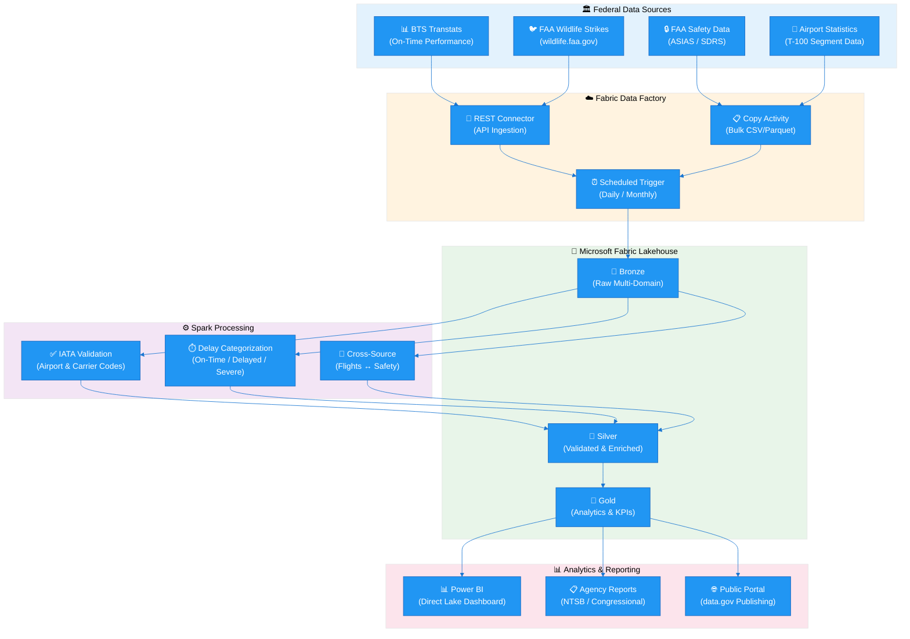

[Home](../../index.md) > [Tutorials](../) > Federal DOT/FAA

# ✈️ Tutorial 31: Federal DOT/FAA

> **Last Updated**: 2026-04-15 | **Version**: 2.0
> **Status**: ✅ Final | **Maintainer**: Documentation Team

<div align="center" markdown>


</div>

---

## ✈️ Tutorial 31: Federal DOT/FAA Aviation Analytics

| | |
|---|---|
| **Difficulty** | ⭐⭐⭐ Advanced |
| **Time** | ⏱️ 120-150 minutes |
| **Focus** | Federal Aviation Data, BTS/FAA Public Datasets, Medallion Architecture & FedRAMP Considerations |

---

### 📊 Progress Tracker

```
┌──────┬──────┬──────┬──────┬──────┬──────┬──────┬──────┬──────┬──────┬──────┬──────┬──────┬──────┐
│  00  │  01  │  02  │  03  │  04  │  05  │  06  │  07  │  08  │  09  │  10  │  11  │  12  │  13  │
│SETUP │BRNZE │SILVR │ GOLD │  RT  │ PBI  │PIPES │ GOV  │MIRRR │AI/ML │TDATA │ SAS  │CICD  │MIGR  │
├──────┼──────┼──────┼──────┼──────┼──────┼──────┼──────┼──────┼──────┼──────┼──────┼──────┼──────┤
│  ✅  │  ✅  │  ✅  │  ✅  │  ✅  │  ✅  │  ✅  │  ✅  │  ✅  │  ✅  │  ✅  │  ✅  │  ✅  │  ✅  │
└──────┴──────┴──────┴──────┴──────┴──────┴──────┴──────┴──────┴──────┴──────┴──────┴──────┴──────┘

┌──────┬──────┬──────┬──────┬──────┬──────┬──────┬──────┬──────┬──────┬──────┬──────┬──────┬──────┬──────┬──────┬──────┬──────┐
│  14  │  15  │  16  │  17  │  18  │  19  │  20  │  21  │  22  │  23  │  24  │  25  │  26  │  27  │  28  │  29  │  30  │  31  │
│ SEC  │ COST │PERF  │ MON  │SHARE │COPLT │WKBST │ GEO  │ NET  │SHIR  │ SNW  │ DB2  │MULTI │VIDEO │MOVMT │GEOLC │TRIBL │ DOT  │
├──────┼──────┼──────┼──────┼──────┼──────┼──────┼──────┼──────┼──────┼──────┼──────┼──────┼──────┼──────┼──────┼──────┼──────┤
│  ✅  │  ✅  │  ✅  │  ✅  │  ✅  │  ✅  │  ✅  │  ✅  │  ✅  │  ✅  │  ✅  │  ✅  │  ✅  │  ✅  │  ✅  │  ✅  │  ✅  │  🔵  │
└──────┴──────┴──────┴──────┴──────┴──────┴──────┴──────┴──────┴──────┴──────┴──────┴──────┴──────┴──────┴──────┴──────┴──────┘
                                                                                                                        ▲
                                                                                                                 YOU ARE HERE
```

| Navigation | |
|---|---|
| ⬅️ **Previous** | [30-Tribal Healthcare Analytics](../30-tribal-healthcare/README.md) |
| ➡️ **Next** | Phase Complete -- Congratulations! |

---

## 📖 Overview

The U.S. Department of Transportation (DOT) and the Federal Aviation Administration (FAA) publish some of the richest public datasets in the federal government. Every domestic flight's on-time performance, every wildlife strike at every airport, and every safety report flows through systems that are freely accessible to analysts, researchers, and government agencies. This tutorial teaches you to build a complete aviation analytics pipeline on Microsoft Fabric, ingesting data from BTS (Bureau of Transportation Statistics) and FAA public APIs, processing it through the medallion architecture, and surfacing carrier performance, safety trends, and airport utilization through Power BI dashboards.

Federal agencies deploying Fabric must also navigate FedRAMP authorization, GCC/GCC-High environments, and data classification requirements. This tutorial addresses those considerations alongside the technical implementation, providing a blueprint that any DOT, FAA, or interagency analytics team can adapt.

> **💡 Why DOT/FAA Aviation Analytics on Fabric?**
>
> - **On-time accountability**: Rank carriers by delay frequency and root cause, giving Congress and the public transparent performance data
> - **Safety pattern detection**: Correlate wildlife strike clusters with seasonal migration patterns and airport geography
> - **Capacity planning**: Analyze passenger volumes and runway utilization to inform infrastructure investment decisions
> - **Cross-agency intelligence**: Join flight operations data with NOAA weather, enabling delay cause attribution at granular levels


*Source: [Lakehouse Overview](https://learn.microsoft.com/en-us/fabric/data-engineering/lakehouse-overview)*

---

## 🎯 Learning Objectives

By the end of this tutorial, you will be able to:

- [ ] Connect to BTS On-Time Performance and FAA public datasets using Data Factory REST connectors
- [ ] Configure Fabric Data Factory pipelines for scheduled federal data ingestion from transtats.bts.gov
- [ ] Understand FedRAMP Moderate/High authorization requirements for Fabric GCC and GCC-High deployments
- [ ] Classify DOT/FAA data domains (CUI, PII, FOUO, public) and apply appropriate handling controls
- [ ] Ingest multi-domain aviation data (flight operations, safety incidents, traffic statistics, infrastructure) into Bronze Delta tables
- [ ] Validate IATA airport codes, categorize delays, standardize carrier names, and cross-correlate sources in the Silver layer
- [ ] Build Gold layer analytics including carrier performance rankings, safety incident trends, and airport utilization metrics
- [ ] Create DAX measures for on-time performance rates, delay cost estimation, and safety severity scoring
- [ ] Design Power BI dashboards with flight performance scorecards, safety incident maps, and delay cause analysis
- [ ] Generate agency-level reports aligned with NTSB, Congressional, and public data portal publishing requirements

---

## 🏗️ Architecture Diagram



| Component | Technology | Purpose |
|-----------|-----------|---------|
| **Data Sources** | BTS Transtats, FAA Wildlife/ASIAS/SDRS, T-100 | Public federal aviation datasets |
| **Ingestion** | Data Factory REST + Copy Activities | Scheduled pull from federal APIs and bulk file downloads |
| **Bronze** | Delta Lake (append-only) | Raw multi-domain ingestion with full lineage |
| **Spark Processing** | PySpark (notebooks 08_bronze, 08_silver, 08_gold) | IATA validation, delay categorization, cross-source correlation |
| **Silver** | Delta Lake (validated) | Cleansed flight performance, enriched safety incidents |
| **Gold** | Delta Lake (aggregated) | Carrier rankings, safety trends, airport utilization KPIs |
| **Visualization** | Power BI Direct Lake | Performance scorecards, safety maps, delay analysis |
| **Reporting** | Fabric notebooks + exports | NTSB, Congressional, and public data portal outputs |

---

## 🛠️ Step 1: Public Dataset Access

Federal aviation data is openly published through several portals. Understanding the structure, update cadence, and access patterns for each source is essential before building ingestion pipelines.

### 1.1 BTS On-Time Performance (transtats.bts.gov)

The Bureau of Transportation Statistics publishes monthly on-time performance data for all domestic flights operated by carriers with at least 1% of domestic scheduled-service passenger revenue.

| Attribute | Detail |
|-----------|--------|
| **URL** | `https://transtats.bts.gov/PREZIP/` |
| **Format** | CSV (zipped), ~500K records/month |
| **History** | 1987 to present, released ~45 days after month end |
| **Key Fields** | Carrier, Origin/Dest, DepDelay, ArrDelay, CarrierDelay, WeatherDelay, NASDelay, SecurityDelay, LateAircraftDelay |
| **Auth** | None required -- fully public data |

### 1.2 FAA Wildlife Strike Database

The FAA collects wildlife strike reports from airlines, airports, and pilots. The database contains over 300,000 reports dating back to 1990.

| Attribute | Detail |
|-----------|--------|
| **URL** | `https://wildlife.faa.gov/downloads` |
| **Format** | XLSX/CSV, ~300,000+ total reports since 1990 |
| **Key Fields** | INCIDENT_DATE, AIRPORT, SPECIES, DAMAGE, COST_REPAIRS, PHASE_OF_FLT, HEIGHT |
| **Update** | Quarterly |

### 1.3 FAA Safety Data (ASIAS and SDRS)

The Aviation Safety Information Analysis and Sharing (ASIAS) system aggregates safety data from multiple sources. The Service Difficulty Reporting System (SDRS) captures mechanical and maintenance issues.

| System | URL | Access | Domains |
|--------|-----|--------|---------|
| **ASIAS** | `asias.faa.gov` | Public aggregates; detailed data requires credentials | Accidents, runway incursions, near-midair collisions |
| **SDRS** | `av-info.faa.gov/sdrx/` | Public | Mechanical difficulties, maintenance issues, component failures |

### 1.4 Airport Activity Statistics (T-100)

The T-100 data provides segment-level traffic information including passengers, freight, mail, and departures for every airport pair served by reporting carriers.

| Attribute | Detail |
|-----------|--------|
| **URL** | `transtats.bts.gov` (T-100 Segment table) |
| **Format** | CSV, ~50K segment records/month |
| **Key Fields** | DEPARTURES_PERFORMED, PASSENGERS, FREIGHT, DISTANCE, UNIQUE_CARRIER, ORIGIN, DEST |
| **Coverage** | All certificated route carriers and commuter air carriers |

### 1.5 Data Factory REST Connector Setup

Configure Fabric Data Factory to pull data from BTS and FAA sources on a scheduled basis.

Create a Data Factory pipeline `pl_ingest_dot_faa` with three Copy Activities:

| Activity | Source | Sink |
|----------|--------|------|
| `Download_BTS_OnTime` | REST: `transtats.bts.gov/PREZIP/On_Time_*.zip` | `Files/landing/dot_faa/flight_operations/` |
| `Download_FAA_Wildlife` | HTTP: `wildlife.faa.gov/downloads/wildlife_data.csv` | `Files/landing/dot_faa/safety_incidents/` |
| `Download_T100_Segments` | REST: `transtats.bts.gov/PREZIP/T_100_Segment_*.zip` | `Files/landing/dot_faa/traffic_statistics/` |

**Trigger:** Schedule monthly on the 15th to capture prior month BTS release (~45-day lag).

> **⚠️ Data Landing Zone Structure**
>
> ```
> Files/
> └── landing/
>     └── dot_faa/
>         ├── flight_operations/     # BTS On-Time CSV/Parquet files
>         ├── safety_incidents/      # FAA Wildlife + ASIAS reports
>         ├── traffic_statistics/    # T-100 segment data
>         └── infrastructure/       # Airport facility data
> ```
> This structure matches the paths referenced in `notebooks/bronze/08_bronze_dot_faa.py`.

---

## 🛠️ Step 2: FedRAMP Deployment Considerations

Federal agencies must operate within authorized cloud environments. Microsoft Fabric is available in Government Community Cloud (GCC) and GCC-High configurations with FedRAMP authorization.

### 2.1 Fabric GCC and GCC-High Environments

| Environment | FedRAMP Level | Suitable For | Fabric Availability |
|-------------|--------------|--------------|---------------------|
| **Commercial** | N/A | Non-government, public data analysis | Full GA |
| **GCC** | FedRAMP Moderate | CUI, FOUO, most federal workloads | GA (feature parity evolving) |
| **GCC-High** | FedRAMP High | DoD IL4/IL5, ITAR, classified-adjacent | GA (limited features) |

### 2.2 FedRAMP Authorization Requirements

| Requirement | FedRAMP Moderate | FedRAMP High |
|-------------|-----------------|--------------|
| **Security Controls** | NIST 800-53 Rev 5 (325 controls) | NIST 800-53 Rev 5 (421 controls) |
| **Assessment** | 3PAO independent assessment | 3PAO + agency ATO |
| **Continuous Monitoring** | Monthly vulnerability scans | Monthly scans + annual assessment |
| **Incident Response** | US-CERT reporting within 1 hour | US-CERT within 1 hour + agency CISO |
| **Data Residency** | US-based data centers | US Government-only data centers |
| **Personnel** | US persons for operations | US citizens with clearance |

### 2.3 Data Classification for DOT/FAA

Understanding data sensitivity determines which environment to deploy in and what controls to apply.

| Classification | Description | Examples | Environment |
|---------------|-------------|----------|-------------|
| **Public** | Openly available, no restrictions | BTS On-Time data, T-100 traffic stats | Commercial or GCC |
| **FOUO** | For Official Use Only, not classified | Internal agency reports, draft analyses | GCC |
| **CUI** | Controlled Unclassified Information | SSI (Sensitive Security Information), PII | GCC |
| **SSI** | Sensitive Security Information | Vulnerability assessments, security plans | GCC-High |
| **PII** | Personally Identifiable Information | Pilot records, passenger manifests | GCC with encryption |

> **💡 For This Tutorial**
>
> All datasets used in this tutorial are **publicly available** through BTS and FAA portals. A commercial Fabric instance is sufficient for the POC. When agencies move to production with internal data, GCC or GCC-High deployment is required based on data classification.

### 2.4 Network Security Architecture

| Control | Configuration |
|---------|--------------|
| **Private Endpoints** | Fabric Lakehouse via Private Link (`privatelink.dfs.fabric.microsoft.com`) |
| **NSG Rules** | Allow DataFactory + PowerBI service tags on 443; Deny Internet inbound |
| **Conditional Access** | MFA required, compliant device required, US-only location restriction |
| **VNet** | `vnet-fabric-gov-eastus2` / `snet-fabric-private` |

---

## 🛠️ Step 3: Bronze Layer -- Multi-Domain Ingestion

The Bronze layer captures raw DOT/FAA data across four domains: flight operations, safety incidents, traffic statistics, and airport infrastructure. This step references `notebooks/bronze/08_bronze_dot_faa.py`.

### 3.1 Data Domain Overview

| Domain | Source | Bronze Table | Records/Month |
|--------|--------|-------------|---------------|
| **Flight Operations** | BTS On-Time | `bronze_dot_flight_ops` | ~500,000 |
| **Safety Incidents** | FAA Wildlife + ASIAS | `bronze_dot_safety` | ~2,000 |
| **Traffic Statistics** | T-100 Segments | `bronze_dot_traffic_stats` | ~50,000 |
| **Infrastructure** | FAA Airport Data | Landing files (reference) | ~20,000 |

### 3.2 Schema Definition

The ingestion schema is defined in `data_generation/schemas/federal/dot_faa_schema.json`. It uses a `data_domain` enum (`flight_operations`, `safety_incident`, `traffic_statistics`, `infrastructure`) to classify records. Key required fields: `record_id`, `carrier_code`, `origin_airport`, `destination_airport`, `departure_date`, `faa_region`, `report_year`, `report_month`. Safety-specific fields include `incident_type`, `incident_severity`, `visibility_miles`, and `wind_speed_knots`.

### 3.3 Bronze Ingestion (PySpark)

This code references the implementation in `notebooks/bronze/08_bronze_dot_faa.py`.

```python
# Notebook: notebooks/bronze/08_bronze_dot_faa.py
# Bronze layer ingestion for DOT/FAA data

from pyspark.sql import SparkSession
from pyspark.sql.functions import (
    current_timestamp, lit, input_file_name,
    col, to_timestamp, when, trim, upper, coalesce
)
from pyspark.sql.types import *
from datetime import datetime

# Configuration
LANDING_BASE_PATH = "Files/landing/dot_faa"
BATCH_ID = datetime.now().strftime("%Y%m%d_%H%M%S")

# Flight Operations schema
flight_ops_schema = StructType([
    StructField("flight_id", StringType(), False),
    StructField("flight_number", StringType(), False),
    StructField("carrier_code", StringType(), False),
    StructField("carrier_name", StringType(), True),
    StructField("origin_airport", StringType(), False),
    StructField("destination_airport", StringType(), False),
    StructField("scheduled_departure", TimestampType(), True),
    StructField("actual_departure", TimestampType(), True),
    StructField("scheduled_arrival", TimestampType(), True),
    StructField("actual_arrival", TimestampType(), True),
    StructField("departure_delay_minutes", IntegerType(), True),
    StructField("arrival_delay_minutes", IntegerType(), True),
    StructField("delay_cause", StringType(), True),
    StructField("cancelled", BooleanType(), True),
    StructField("diverted", BooleanType(), True),
    StructField("aircraft_type", StringType(), True),
    StructField("tail_number", StringType(), True),
    StructField("passengers", IntegerType(), True),
    StructField("flight_date", StringType(), True),
    StructField("faa_region", StringType(), True),
])

# Read raw files from landing zone
df_raw_flights = (
    spark.read
    .option("header", True)
    .schema(flight_ops_schema)
    .csv(f"{LANDING_BASE_PATH}/flight_operations/")
)

# Add ingestion metadata
df_bronze_flights = (
    df_raw_flights
    .withColumn("_ingested_at", current_timestamp())
    .withColumn("_source", lit("bts_ontime_api"))
    .withColumn("_batch_id", lit(BATCH_ID))
    .withColumn("_source_file", input_file_name())
)

# Write to Bronze table (append mode -- immutable raw layer)
(
    df_bronze_flights.write
    .format("delta")
    .mode("append")
    .option("mergeSchema", "true")
    .saveAsTable("bronze_dot_flight_ops")
)

print(f"Bronze flight ops: {df_bronze_flights.count():,} records ingested")
print(f"Batch: {BATCH_ID}")
```

### 3.4 Safety Incident Ingestion

The same pattern applies for safety data. Define an explicit schema for incident fields (`incident_id`, `incident_date`, `incident_type`, `severity`, `airport_code`, `species`, `damage_level`, `cost_repairs`, etc.), read from `Files/landing/dot_faa/safety_incidents/`, add ingestion metadata (`_ingested_at`, `_source`, `_batch_id`), and append to `bronze_dot_safety`. See `notebooks/bronze/08_bronze_dot_faa.py` for the full implementation.

> **💡 Verification**
>
> ```python
> # Verify Bronze tables
> for table in ["bronze_dot_flight_ops", "bronze_dot_safety", "bronze_dot_traffic_stats"]:
>     count = spark.table(table).count()
>     print(f"{table}: {count:,} records")
> ```

---

## 🛠️ Step 4: Silver Layer -- Validation & Enrichment

The Silver layer cleanses, validates, and enriches Bronze data. This step references `notebooks/silver/08_silver_dot_faa.py`. Key transformations include IATA code validation, delay categorization, carrier name standardization, and cross-source correlation.

### 4.1 IATA Airport Code Validation

```python
# Notebook: notebooks/silver/08_silver_dot_faa.py
# Silver layer: Data quality validation and enrichment

from pyspark.sql.functions import *
from pyspark.sql.types import *
from datetime import datetime

# Source tables (Bronze)
SOURCE_FLIGHT_OPS = "lh_bronze.bronze_dot_flight_ops"
SOURCE_SAFETY = "lh_bronze.bronze_dot_safety"

df_flights = spark.table(SOURCE_FLIGHT_OPS)

# Step 1: Validate IATA airport codes (3-letter uppercase alpha)
iata_pattern = "^[A-Z]{3}$"

df_flights_validated = (
    df_flights
    .withColumn("origin_airport", upper(trim(col("origin_airport"))))
    .withColumn("destination_airport", upper(trim(col("destination_airport"))))
    .withColumn("carrier_code", upper(trim(col("carrier_code"))))
    .withColumn("_valid_origin", col("origin_airport").rlike(iata_pattern))
    .withColumn("_valid_destination", col("destination_airport").rlike(iata_pattern))
)

invalid_airports = df_flights_validated.filter(
    ~col("_valid_origin") | ~col("_valid_destination")
).count()
print(f"Records with invalid airport codes: {invalid_airports:,}")

# Filter to valid records only
df_flights_clean = df_flights_validated.filter(
    col("_valid_origin") & col("_valid_destination")
)
```

### 4.2 Delay Categorization

Delays are categorized into three tiers aligned with BTS reporting standards. The thresholds are defined in the Silver notebook: on-time (0-14 minutes), delayed (15-59 minutes), and severely delayed (60+ minutes).

```python
# Delay categorization thresholds
DELAY_ON_TIME_MAX = 14   # minutes
DELAY_SEVERE_MIN = 60    # minutes

df_flights_categorized = (
    df_flights_clean
    .withColumn(
        "delay_category",
        when(col("departure_delay_minutes").isNull(), "unknown")
        .when(col("departure_delay_minutes") <= DELAY_ON_TIME_MAX, "on_time")
        .when(col("departure_delay_minutes") < DELAY_SEVERE_MIN, "delayed")
        .otherwise("severely_delayed")
    )
    .withColumn(
        "delay_cause_standardized",
        when(col("delay_cause") == "carrier", "Carrier")
        .when(col("delay_cause") == "weather", "Weather")
        .when(col("delay_cause") == "nas", "NAS (National Aviation System)")
        .when(col("delay_cause") == "security", "Security")
        .when(col("delay_cause") == "late_aircraft", "Late Aircraft")
        .otherwise("None / Unknown")
    )
)

# Delay category distribution
display(
    df_flights_categorized
    .groupBy("delay_category")
    .count()
    .orderBy("count", ascending=False)
)
```

### 4.3 Carrier Name Standardization

```python
# Major US carrier code to name standardization
CARRIER_MAPPING = {
    "AA": "American Airlines", "DL": "Delta Air Lines",
    "UA": "United Airlines", "WN": "Southwest Airlines",
    "B6": "JetBlue Airways", "AS": "Alaska Airlines",
    "NK": "Spirit Airlines", "F9": "Frontier Airlines",
    "G4": "Allegiant Air", "HA": "Hawaiian Airlines",
    "SY": "Sun Country Airlines", "MX": "Breeze Airways",
}

# FAA regions
FAA_REGIONS = {
    "AAL": "Alaskan", "ACE": "Central", "AEA": "Eastern",
    "AGL": "Great Lakes", "ANE": "New England", "ANM": "Northwest Mountain",
    "ASO": "Southern", "ASW": "Southwest", "AWP": "Western-Pacific",
}

# Create mapping UDF
carrier_map_broadcast = spark.sparkContext.broadcast(CARRIER_MAPPING)

@udf(returnType=StringType())
def standardize_carrier(code):
    if code is None:
        return None
    return carrier_map_broadcast.value.get(code, f"Other ({code})")

df_flights_enriched = (
    df_flights_categorized
    .withColumn("carrier_name_std", standardize_carrier(col("carrier_code")))
)
```

### 4.4 Cross-Source Correlation

Correlate flight operations with safety incidents to identify flights that had associated safety events (bird strikes, runway incursions, etc.).

```python
# Cross-source correlation: join flights with safety incidents
df_safety = spark.table(SOURCE_SAFETY)

df_flights_with_safety = (
    df_flights_enriched.alias("f")
    .join(
        df_safety.alias("s"),
        (col("f.origin_airport") == col("s.airport_code")) &
        (to_date(col("f.flight_date")) == to_date(col("s.incident_date"))) &
        (col("f.carrier_code") == col("s.carrier_code")),
        "left"
    )
    .withColumn("has_safety_incident", col("s.incident_id").isNotNull())
    .withColumn("safety_incident_type", col("s.incident_type"))
    .withColumn("safety_severity", col("s.severity"))
    .select("f.*", "has_safety_incident", "safety_incident_type", "safety_severity")
)

safety_correlated = df_flights_with_safety.filter(col("has_safety_incident")).count()
print(f"Flights correlated with safety incidents: {safety_correlated:,}")
```

### 4.5 Data Quality Scoring and Silver Write

Each record receives a `data_quality_score` (0-100) based on four 25-point checks: valid airport codes, delay value present, known carrier mapping, and valid date. The scored DataFrame is written to `lh_silver.silver_dot_flight_performance`, partitioned by `faa_region`, with internal quality columns dropped before write. See `notebooks/silver/08_silver_dot_faa.py` for the full scoring implementation.

---

## 🛠️ Step 5: Gold Layer -- Aviation Analytics

The Gold layer produces business-ready analytics tables optimized for Power BI Direct Lake consumption. This step references `notebooks/gold/08_gold_dot_faa_analytics.py`.

### 5.1 Carrier Performance Ranking

```python
# Notebook: notebooks/gold/08_gold_dot_faa_analytics.py
# Gold layer: Carrier performance analytics

from pyspark.sql.functions import *
from pyspark.sql.window import Window

# Source tables (Silver)
SOURCE_FLIGHT_PERF = "lh_silver.silver_dot_flight_performance"
df_flights = spark.table(SOURCE_FLIGHT_PERF)

# Monthly carrier performance aggregation
df_carrier_monthly = (
    df_flights
    .withColumn("report_year", year(to_date(col("flight_date"))))
    .withColumn("report_month", month(to_date(col("flight_date"))))
    .groupBy("carrier_code", "carrier_name_std", "report_year", "report_month")
    .agg(
        count("*").alias("total_flights"),
        sum(when(col("delay_category") == "on_time", 1).otherwise(0)).alias("on_time_flights"),
        sum(when(col("delay_category") == "delayed", 1).otherwise(0)).alias("delayed_flights"),
        sum(when(col("delay_category") == "severely_delayed", 1).otherwise(0)).alias("severe_delay_flights"),
        sum(when(col("cancelled") == True, 1).otherwise(0)).alias("cancelled_flights"),
        round(avg("departure_delay_minutes"), 1).alias("avg_delay_minutes"),
        round(max("departure_delay_minutes"), 0).alias("max_delay_minutes"),
        sum("passengers").alias("total_passengers"),
        # Delay cause breakdown
        sum(when(col("delay_cause") == "carrier", col("departure_delay_minutes")).otherwise(0)).alias("carrier_delay_total_min"),
        sum(when(col("delay_cause") == "weather", col("departure_delay_minutes")).otherwise(0)).alias("weather_delay_total_min"),
        sum(when(col("delay_cause") == "nas", col("departure_delay_minutes")).otherwise(0)).alias("nas_delay_total_min"),
        sum(when(col("delay_cause") == "late_aircraft", col("departure_delay_minutes")).otherwise(0)).alias("late_aircraft_delay_total_min"),
    )
    .withColumn(
        "on_time_pct",
        round(col("on_time_flights") / col("total_flights") * 100, 1)
    )
    .withColumn(
        "cancellation_rate_pct",
        round(col("cancelled_flights") / col("total_flights") * 100, 2)
    )
)

# Rank carriers by on-time performance within each month
rank_window = Window.partitionBy("report_year", "report_month").orderBy(col("on_time_pct").desc())
df_carrier_ranked = df_carrier_monthly.withColumn("performance_rank", rank().over(rank_window))

(
    df_carrier_ranked.write
    .format("delta")
    .mode("overwrite")
    .saveAsTable("lh_gold.gold_dot_carrier_performance")
)

display(df_carrier_ranked.orderBy("report_year", "report_month", "performance_rank").limit(20))
```

### 5.2 Safety Incident Trends

```python
# Safety analytics: incident rates, severity trends, species analysis
SOURCE_SAFETY = "lh_silver.silver_dot_safety_enriched"
df_safety = spark.table(SOURCE_SAFETY)

# Monthly incident trends by type and severity
df_safety_trends = (
    df_safety
    .withColumn("report_year", year("incident_date"))
    .withColumn("report_month", month("incident_date"))
    .groupBy("report_year", "report_month", "incident_type", "severity")
    .agg(
        count("*").alias("incident_count"),
        countDistinct("airport_code").alias("airports_affected"),
        round(avg("cost_repairs"), 2).alias("avg_repair_cost"),
        round(sum("cost_repairs"), 2).alias("total_repair_cost"),
        countDistinct("carrier_code").alias("carriers_involved")
    )
)

# Bird strike species analysis (top species by frequency)
df_wildlife_species = (
    df_safety
    .filter(col("incident_type") == "bird_strike")
    .groupBy("species")
    .agg(
        count("*").alias("strike_count"),
        round(avg("height_ft"), 0).alias("avg_height_ft"),
        round(sum("cost_repairs"), 2).alias("total_damage_cost"),
        countDistinct("airport_code").alias("airports_affected")
    )
    .orderBy(col("strike_count").desc())
)

(
    df_safety_trends.write
    .format("delta")
    .mode("overwrite")
    .saveAsTable("lh_gold.gold_dot_safety_analytics")
)

display(df_wildlife_species.limit(15))
```

### 5.3 Airport Utilization Metrics

```python
# Airport-level metrics: traffic volumes, delay profiles, safety records
df_airport_metrics = (
    df_flights
    .groupBy("origin_airport", "faa_region")
    .agg(
        count("*").alias("total_departures"),
        sum("passengers").alias("total_passengers"),
        round(avg("departure_delay_minutes"), 1).alias("avg_departure_delay_min"),
        sum(when(col("delay_category") == "on_time", 1).otherwise(0)).alias("on_time_departures"),
        sum(when(col("cancelled") == True, 1).otherwise(0)).alias("cancelled_departures"),
        countDistinct("carrier_code").alias("carriers_serving"),
        countDistinct("destination_airport").alias("destinations_served"),
    )
    .withColumn(
        "on_time_pct",
        round(col("on_time_departures") / col("total_departures") * 100, 1)
    )
    .withColumn(
        "airport_size_tier",
        when(col("total_passengers") > 10_000_000, "Large Hub")
        .when(col("total_passengers") > 2_500_000, "Medium Hub")
        .when(col("total_passengers") > 500_000, "Small Hub")
        .otherwise("Non-Hub")
    )
)

(
    df_airport_metrics.write
    .format("delta")
    .mode("overwrite")
    .saveAsTable("lh_gold.gold_dot_airport_metrics")
)

display(df_airport_metrics.orderBy(col("total_passengers").desc()).limit(20))
```

### 5.4 DAX Measures for Aviation Analytics

```dax
// ---- Power BI DAX Measures for DOT/FAA Analytics ----

// On-Time Performance Rate (%)
On-Time Performance Rate =
DIVIDE(
    SUM(gold_dot_carrier_performance[on_time_flights]),
    SUM(gold_dot_carrier_performance[total_flights]),
    0
) * 100

// Average Delay (minutes)
Avg Delay Minutes =
AVERAGE(gold_dot_carrier_performance[avg_delay_minutes])

// Cancellation Rate (%)
Cancellation Rate =
DIVIDE(
    SUM(gold_dot_carrier_performance[cancelled_flights]),
    SUM(gold_dot_carrier_performance[total_flights]),
    0
) * 100

// Estimated Delay Cost (FAA estimates $74.20/min per aircraft)
Estimated Delay Cost =
SUMX(
    gold_dot_carrier_performance,
    gold_dot_carrier_performance[avg_delay_minutes]
    * gold_dot_carrier_performance[total_flights]
    * 74.20
)

// Safety Severity Score (weighted)
Safety Severity Score =
SUMX(
    gold_dot_safety_analytics,
    SWITCH(
        gold_dot_safety_analytics[severity],
        "critical", 4 * gold_dot_safety_analytics[incident_count],
        "serious", 3 * gold_dot_safety_analytics[incident_count],
        "moderate", 2 * gold_dot_safety_analytics[incident_count],
        "minor", 1 * gold_dot_safety_analytics[incident_count],
        0
    )
)

// Airport Utilization Index
Airport Utilization Index =
DIVIDE(
    SUM(gold_dot_airport_metrics[total_departures]),
    DISTINCTCOUNT(gold_dot_airport_metrics[origin_airport]),
    0
)
```

---

## 📊 Step 6: Power BI Dashboard

### 6.1 Flight Performance Scorecard

Connect Power BI Desktop to your Fabric Lakehouse via Direct Lake and build a performance scorecard for carrier comparison.

```
┌─────────────────────────────────────────────────────────────────────────┐
│  ✈️ DOT/FAA AVIATION ANALYTICS DASHBOARD            🔄 Monthly Update  │
├──────────────┬──────────────┬──────────────┬───────────────────────────┤
│   ✈️          │   ⏱️          │   ❌          │   🐦                      │
│   4.2M       │   12.3 min   │   1.8%       │   847                    │
│  Total       │  Avg Delay   │  Cancel      │  Wildlife                │
│  Flights     │  (minutes)   │  Rate        │  Strikes                 │
├──────────────┴──────────────┴──────────────┴───────────────────────────┤
│              📊 CARRIER ON-TIME PERFORMANCE RANKING                    │
│  ┌────────────────────────────┬────────┬──────────┬─────────────────┐  │
│  │ Carrier                    │  Rank  │  OTP %   │  Avg Delay      │  │
│  ├────────────────────────────┼────────┼──────────┼─────────────────┤  │
│  │ Delta Air Lines            │   1    │  85.2%   │   8.4 min       │  │
│  │ Alaska Airlines            │   2    │  83.7%   │   9.1 min       │  │
│  │ Southwest Airlines         │   3    │  81.5%   │  10.8 min       │  │
│  │ United Airlines            │   4    │  79.3%   │  12.4 min       │  │
│  │ American Airlines          │   5    │  78.1%   │  13.2 min       │  │
│  │ JetBlue Airways            │   6    │  74.6%   │  16.7 min       │  │
│  └────────────────────────────┴────────┴──────────┴─────────────────┘  │
├──────────────────────────────────┬──────────────────────────────────────┤
│  📊 DELAY CAUSE BREAKDOWN        │  📈 MONTHLY ON-TIME TREND            │
│                                  │                                      │
│  Carrier       ████████ 32%      │  Jan ─────────── 82.1%              │
│  Weather       ██████ 24%        │  Feb ────────── 80.5%               │
│  NAS           █████ 20%         │  Mar ──────────── 83.4%             │
│  Late Aircraft ████ 16%          │  Apr ───────────── 84.7%            │
│  Security      █ 2%              │  May ────────────── 85.2%           │
│  Other         ██ 6%             │  Jun ──────────── 83.8%             │
└──────────────────────────────────┴──────────────────────────────────────┘
```

**Dashboard Configuration Steps:**

1. **Open Power BI Desktop** and connect to your Fabric Lakehouse via Direct Lake
2. **Import tables**: `gold_dot_carrier_performance`, `gold_dot_safety_analytics`, `gold_dot_airport_metrics`
3. **Add Card Visuals** for KPIs: Total Flights, Avg Delay, Cancellation Rate, Wildlife Strikes
4. **Add Table Visual** with carrier ranking columns
5. **Add Bar Chart** for delay cause breakdown
6. **Add Line Chart** for monthly on-time trend

### 6.2 Safety Incident Map

Use the Azure Maps visual to plot safety incidents by airport location.

1. **Add Azure Maps Visual** from the Visualizations pane
2. **Drag** `origin_airport` to **Location**
3. **Drag** `incident_count` to **Size**
4. **Drag** `incident_type` to **Legend**
5. **Configure** bubble layer with color gradient from green (few incidents) to red (many incidents)


*Source: [Azure Maps Power BI visual](https://learn.microsoft.com/en-us/azure/azure-maps/power-bi-visual-get-started)*

### 6.3 Delay Cause Analysis

Build a decomposition tree visual that lets analysts drill from total delay down through carrier, airport, route, month, and cause.

**Visual Configuration:**
- **Analyze**: `avg_delay_minutes`
- **Explain By**: `carrier_name_std`, `origin_airport`, `delay_cause_standardized`, `report_month`
- This enables self-service exploration: "Why is average delay increasing?" -> "American Airlines" -> "JFK" -> "Weather" -> "February"

### 6.4 Route Performance Comparison

Build a `gold_dot_route_performance` table by grouping Silver flights on `origin_airport + destination_airport`, computing `avg_delay_min`, `on_time_pct`, and `cancellations`. Filter to routes with 100+ flights to eliminate statistical noise. Use a **Scatter Chart** in Power BI with `total_flights` on X, `avg_delay_min` on Y, and `route` as the detail -- this lets analysts immediately spot high-volume, high-delay routes that need attention.

---

## 📋 Step 7: Agency Reporting

Federal aviation analytics must feed into several reporting channels: NTSB safety databases, Congressional oversight reports, and public data portals.

### 7.1 NTSB Reporting Integration

The National Transportation Safety Board requires structured safety data for accident and incident investigations. Generate NTSB-compatible extracts from Gold layer safety analytics.

Filter `gold_dot_safety_analytics` for `severity IN ('serious', 'critical')`, rename columns to NTSB-standard names (`event_type`, `highest_injury_level`, `event_count`, `damage_estimate_usd`), add `ntsb_report_date` and `data_source` metadata, and export as CSV to `Files/exports/ntsb/safety_extract/`.

### 7.2 Congressional Report Generation

Aggregate Gold carrier performance into annual summaries grouped by `carrier_name_std` with fields for `annual_flights`, `avg_on_time_pct`, `avg_delay_min`, `cancel_rate_pct`, and `passengers_carried`. Export as CSV to `Files/exports/congressional/carrier_performance_summary/` for briefing packages.

### 7.3 Public Data Portal Publishing

Prepare aggregated, anonymized datasets for data.gov by selecting non-PII columns from `gold_dot_carrier_performance` and adding metadata fields (`dataset_name`, `publisher`, `license: Public Domain (US Government Work)`, `published_date`). Export in both Parquet (for analysts) and CSV (for broad accessibility) to `Files/exports/public_portal/`.

> **💡 Open Data Best Practices**
>
> - Never include PII or SSI in public datasets
> - Version datasets with `report_year` and `report_month` for reproducibility
> - Include a data dictionary alongside published files

---

## 🔧 Troubleshooting

| Symptom | Likely Cause | Solution |
|---------|-------------|----------|
| BTS download returns 403 Forbidden | IP rate limiting or session expiry | Add retry logic with exponential backoff; rotate User-Agent header |
| CSV parsing fails with `AnalysisException` | BTS file header changes between years | Use `mergeSchema` option; define explicit schema in Bronze notebook |
| IATA code validation drops >5% of records | Non-standard codes (e.g., `ZZZ` for unknown) | Add known exceptions to validation allowlist; log dropped records |
| Delay minutes shows negative values | Early arrivals stored as negative delay | Apply `greatest(col("delay_minutes"), lit(0))` in Silver layer |
| Carrier code not in `CARRIER_MAPPING` | New or regional carrier not yet mapped | Add to mapping dictionary; use fallback pattern `Other (XX)` |
| FAA Wildlife data has NULL species | Reporter did not identify species | Map to `"Unknown"` in Silver; do not drop -- still valuable for location analysis |
| GCC-High Fabric missing Data Factory | Feature parity lag in government cloud | Use alternative ingestion via Azure Data Factory (PaaS) with Private Link to Fabric |
| Power BI Direct Lake connection fails in GCC | Tenant configuration mismatch | Verify Fabric capacity is provisioned in same GCC region as Power BI tenant |
| Delta table partition skew on `faa_region` | AWP and ASO regions have 60% of traffic | Repartition by `(faa_region, report_month)` for more even distribution |
| Pipeline timeout on large BTS file download | File exceeds 2GB compressed for busy months | Split download by carrier using BTS field selection; parallel Copy Activities |

---

## 📐 Best Practices

1. **Use explicit schemas at ingestion**: BTS file formats evolve across years. Defining `StructType` schemas in Bronze prevents silent column drift and ensures ingestion fails fast when formats change rather than producing corrupt downstream tables.

2. **Partition by FAA region and time**: Flight operations data grows to millions of rows per month. Partitioning Silver by `faa_region` and Gold by `(report_year, report_month)` enables efficient time-range and regional pruning in both Spark queries and Power BI Direct Lake.

3. **Standardize carrier codes early**: Carrier mergers, codeshare agreements, and regional operator changes mean the same airline may appear under multiple codes. Apply `CARRIER_MAPPING` in the Silver layer so Gold analytics and Power BI always show consistent names.

4. **Separate safety from operations in Bronze**: Safety incidents have fundamentally different schemas, update frequencies, and sensitivity levels than flight operations. Keeping them in separate Bronze tables (`bronze_dot_flight_ops` vs. `bronze_dot_safety`) simplifies schema management and access control.

5. **Apply data quality scoring**: The Silver layer computes a `data_quality_score` (0-100) per record. Use this score to filter Gold layer aggregations -- for example, only include records scoring 75+ in carrier performance rankings to prevent bad data from skewing results.

6. **Respect FedRAMP boundaries**: Even when using public data in a commercial Fabric tenant for POC purposes, design the pipeline as if it will run in GCC. This means using Private Endpoints, Customer-Managed Keys, and RBAC from day one -- retrofitting security is far harder than building it in.

7. **Version your exports**: Congressional and NTSB reports must be reproducible. Include `_batch_id`, `report_year`, and `report_month` in every export so that any published figure can be traced back to the exact Gold table state that produced it.

8. **Cache reference data with broadcast**: The `CARRIER_MAPPING`, `FAA_REGIONS`, and `STATE_TO_FAA_REGION` dictionaries are small datasets. Broadcasting them to Spark executors avoids shuffle joins and dramatically speeds up Silver layer processing.

9. **Monitor delay cause completeness**: BTS only provides delay cause breakdown for flights delayed 15+ minutes. For on-time flights, `delay_cause` is null by design. Do not treat this as missing data -- it is a valid business rule. Document this in your data dictionary.

10. **Automate monthly ingestion with idempotent writes**: BTS releases data ~45 days after month end. Schedule Data Factory pipelines to check for new files on the 15th of each month. Use Delta `MERGE` with `record_id` as the key to ensure reprocessing the same month does not create duplicates.

---

## ✅ Summary

Congratulations! You have built a complete DOT/FAA aviation analytics pipeline on Microsoft Fabric, from public federal data sources through the medallion architecture to agency-ready dashboards and reports.

### What You Accomplished

- ✅ Connected to BTS On-Time Performance, FAA Wildlife Strike, ASIAS, and T-100 datasets
- ✅ Configured Data Factory pipelines for scheduled federal data ingestion
- ✅ Understood FedRAMP Moderate/High requirements for GCC and GCC-High deployments
- ✅ Classified DOT/FAA data domains and applied appropriate handling controls
- ✅ Ingested multi-domain aviation data into Bronze Delta tables with full lineage
- ✅ Validated IATA codes, categorized delays, standardized carriers, and correlated safety data in Silver
- ✅ Built Gold layer analytics with carrier rankings, safety trends, and airport utilization
- ✅ Created DAX measures for on-time performance, delay cost estimation, and safety scoring
- ✅ Designed Power BI dashboards with performance scorecards, safety maps, and delay analysis
- ✅ Generated NTSB, Congressional, and public data portal exports

### Key Takeaways

| Concept | Key Point |
|---------|-----------|
| **Federal Data Access** | BTS and FAA publish rich aviation datasets freely; no API keys required for most sources |
| **FedRAMP Compliance** | GCC/GCC-High Fabric environments provide FedRAMP Moderate/High authorization for federal workloads |
| **Data Classification** | Public data (BTS, T-100) can run on commercial Fabric; CUI and SSI require GCC or GCC-High |
| **Delay Categorization** | BTS defines on-time as within 14 minutes of schedule; delay causes decompose into five categories |
| **Cross-Source Correlation** | Joining flight operations with safety incidents reveals patterns invisible in either dataset alone |
| **Agency Reporting** | NTSB, Congressional, and data.gov outputs require different formats, aggregation levels, and metadata |

---

## 🚀 Next Steps

**Phase Complete!** You have reached the final tutorial in the Microsoft Fabric Casino & Federal Analytics POC series.

**Review & Consolidate:**
- Revisit [Tutorial 00: Environment Setup](../00-environment-setup/README.md) through Tutorial 31 to ensure all components are deployed and validated
- Run the full regression test suite in `validation/unit_tests/` to confirm end-to-end data quality
- Review the [Phase 7 PRP](https://github.com/fgarofalo56/Suppercharge_Microsoft_Fabric/blob/main/.claude/phase7-prp.md) for any remaining feature items

**Related Tutorials:**
- [Tutorial 07: Governance & Purview](../07-governance-purview/README.md) -- Apply Purview data classification and lineage to DOT/FAA datasets
- [Tutorial 14: Security & Networking](../14-security-networking/README.md) -- Configure Private Endpoints and NSGs for federal network security
- [Tutorial 06: Data Pipelines](../06-data-pipelines/README.md) -- Advanced Data Factory pipeline orchestration patterns

---

## 📚 Resources

| Resource | Link |
|----------|------|
| BTS On-Time Performance Data | [transtats.bts.gov](https://transtats.bts.gov/) |
| FAA Wildlife Strike Database | [wildlife.faa.gov](https://wildlife.faa.gov/) |
| FAA Safety Data (ASIAS) | [asias.faa.gov](https://www.asias.faa.gov/) |
| FAA Service Difficulty Reports | [av-info.faa.gov](https://av-info.faa.gov/sdrx/) |
| FedRAMP Authorization | [fedramp.gov](https://www.fedramp.gov/) |
| Microsoft Fabric for Government | [Microsoft Learn](https://learn.microsoft.com/en-us/fabric/admin/fabric-government) |
| Azure Government Cloud | [azure.microsoft.com/government](https://azure.microsoft.com/en-us/global-infrastructure/government/) |
| NIST 800-53 Security Controls | [csrc.nist.gov](https://csrc.nist.gov/publications/detail/sp/800-53/rev-5/final) |
| Fabric Lakehouse Overview | [Microsoft Learn](https://learn.microsoft.com/en-us/fabric/data-engineering/lakehouse-overview) |
| DOT/FAA Schema Reference | `data_generation/schemas/federal/dot_faa_schema.json` |
| Bronze Notebook | `notebooks/bronze/08_bronze_dot_faa.py` |
| Silver Notebook | `notebooks/silver/08_silver_dot_faa.py` |
| Gold Notebook | `notebooks/gold/08_gold_dot_faa_analytics.py` |

---

## 🧭 Navigation

| Previous | Up | Next |
|:---------|:--:|-----:|
| [⬅️ 30-Tribal Healthcare Analytics](../30-tribal-healthcare/README.md) | [📖 Tutorials Index](../index.md) | Phase Complete 🎉 |

---

<div align="center" markdown>

**Questions or issues?** Open an issue in the [GitHub repository](https://github.com/frgarofa/Suppercharge_Microsoft_Fabric/issues)

*Tutorial 31 of 31 in the Microsoft Fabric Casino & Federal Analytics POC Series*

</div>

---

[⬆️ Back to Top](#-tutorial-31-federal-dotfaa) | [📚 Tutorials](../) | [🏠 Home](../../index.md)
