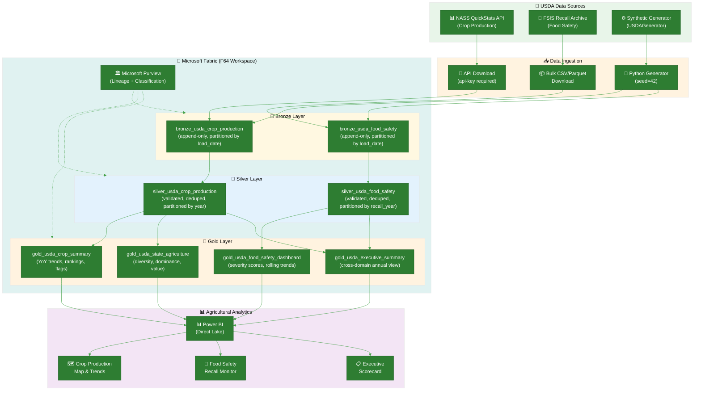

# 🌾 Tutorial 32: USDA Agriculture Analytics

<div align="center" markdown>


</div>

> 🏠 **[Home](https://github.com/fgarofalo56/Suppercharge_Microsoft_Fabric/blob/main/README.md)** > 📖 **[Tutorials](../index.md)** > 🌾 **USDA Agriculture Analytics**

---

!!! info "Third-party references — publicly sourced, good-faith comparison"
    This page references non-Microsoft products and services. That information is drawn from each vendor's **publicly available documentation** and is offered for honest, good-faith comparison only. This is a personal project written from a Microsoft Fabric and Azure perspective; it does **not** claim expertise in, or authority over, any third-party product, and nothing here is an official statement by, or endorsed by, those vendors. Capabilities, pricing, and features change often — always verify against the vendor's current official documentation. Where a third-party offering is the stronger choice, we say so plainly.

---

## 🌾 Tutorial 32: USDA Agriculture Analytics

| | |
|---|---|
| **Difficulty** | ⭐⭐⭐ Intermediate |
| **Time** | ⏱️ 90-120 minutes |
| **Focus** | USDA Crop Production Analytics, Food Safety Monitoring, Federal Agricultural Data Governance |

---

### 📊 Progress Tracker

```
┌──────┬──────┬──────┬──────┬──────┬──────┬──────┬──────┬──────┬──────┬──────┬──────┬──────┬──────┐
│  00  │  01  │  02  │  03  │  04  │  05  │  06  │  07  │  08  │  09  │  10  │  11  │  12  │  13  │
│SETUP │BRNZE │SILVR │ GOLD │  RT  │ PBI  │PIPES │ GOV  │MIRRR │AI/ML │TDATA │ SAS  │CICD  │MIGR  │
├──────┼──────┼──────┼──────┼──────┼──────┼──────┼──────┼──────┼──────┼──────┼──────┼──────┼──────┤
│  ✅  │  ✅  │  ✅  │  ✅  │  ✅  │  ✅  │  ✅  │  ✅  │  ✅  │  ✅  │  ✅  │  ✅  │  ✅  │  ✅  │
└──────┴──────┴──────┴──────┴──────┴──────┴──────┴──────┴──────┴──────┴──────┴──────┴──────┴──────┘

┌──────┬──────┬──────┬──────┬──────┬──────┬──────┬──────┬──────┬──────┬──────┬──────┬──────┬──────┬──────┬──────┬──────┬──────┐
│  14  │  15  │  16  │  17  │  18  │  19  │  20  │  21  │  22  │  23  │  24  │  25  │  26  │  27  │  28  │  29  │  30  │  31  │
│ SEC  │ COST │PERF  │ MON  │SHARE │COPLT │WKBST │ GEO  │ NET  │SHIR  │ SNW  │ DB2  │MULTI │VIDEO │ MOVE │GEOLC │TRIBL │ DOT  │
├──────┼──────┼──────┼──────┼──────┼──────┼──────┼──────┼──────┼──────┼──────┼──────┼──────┼──────┼──────┼──────┼──────┼──────┤
│  ✅  │  ✅  │  ✅  │  ✅  │  ✅  │  ✅  │  ✅  │  ✅  │  ✅  │  ✅  │  ✅  │  ✅  │  ✅  │  ✅  │  ✅  │  ✅  │  ✅  │  ✅  │
└──────┴──────┴──────┴──────┴──────┴──────┴──────┴──────┴──────┴──────┴──────┴──────┴──────┴──────┴──────┴──────┴──────┴──────┘

┌──────┬──────┬──────┬──────┬──────┐
│  32  │  33  │  34  │  35  │  36  │
│ USDA │ SBA  │ NOAA │ EPA  │ DOI  │
├──────┼──────┼──────┼──────┼──────┤
│  🔵  │  ○   │  ○   │  ○   │  ○   │
└──────┴──────┴──────┴──────┴──────┘
   ▲
YOU ARE HERE
```

| Navigation | |
|---|---|
| ⬅️ **Previous** | [31-Federal DOT/FAA Analytics](../31-federal-dot-faa/README.md) |
| ➡️ **Next** | [33-SBA Small Business Analytics](../33-sba-small-business/README.md) |

---

## 📖 Overview

The United States Department of Agriculture (USDA) is one of the most data-intensive federal agencies in the world. Through its sub-agencies -- the **National Agricultural Statistics Service (NASS)**, the **Food Safety and Inspection Service (FSIS)**, the **Food and Nutrition Service (FNS)**, and dozens more -- the USDA collects, validates, and publishes data that drives agricultural policy, food safety enforcement, and nutrition program administration for a nation of 330 million people.

This tutorial teaches you to build a **federal agricultural analytics pipeline** in Microsoft Fabric that ingests USDA crop production statistics and food safety recall records, transforms them through a domain-specific medallion architecture, and produces Gold layer KPIs and Power BI dashboards for crop trend analysis and recall monitoring.

Two data domains form the backbone of this tutorial:

- **Crop Production (NASS):** National, state, and county-level statistics on planted acreage, harvested acreage, yield, production volume, and price received for 10 major commodities (corn, soybeans, wheat, cotton, rice, barley, oats, sorghum, hay, and potatoes). This data mirrors the structure returned by the [NASS QuickStats API](https://quickstats.nass.usda.gov/api), the primary programmatic interface for accessing USDA agricultural statistics.

- **Food Safety (FSIS):** Recall records issued by the Food Safety and Inspection Service covering meat, poultry, and processed food recalls. Each recall includes classification (Class I through III based on health risk severity), reason (pathogen contamination, undeclared allergens, foreign material), distribution scope, and pounds recalled. This data mirrors the [FSIS Recall Case Archive](https://www.fsis.usda.gov/recalls).

> **💡 Why Agricultural Analytics on Fabric?**
>
> - **Unified analytics over massive national datasets**: NASS QuickStats alone contains over 50 GB of agricultural statistics spanning decades. Fabric's OneLake storage and lakehouse architecture handle this scale natively without infrastructure provisioning
> - **Cross-domain insight**: Joining crop production data with food safety recall data reveals patterns invisible in either dataset alone -- for example, whether production surges in specific commodities correlate with increased recall events
> - **Federal open data compliance**: All USDA datasets used in this tutorial are publicly available under federal open data policies, with clearly defined API access patterns and download endpoints
> - **Direct Lake for real-time decision support**: Agricultural analysts and policy makers need dashboards that refresh in near real-time during critical periods (planting season, harvest season, food safety incidents) without the latency of traditional import models

> **⚠️ Federal Data Notice**
>
> USDA data used in this tutorial is sourced from publicly available federal datasets subject to the Confidential Information Protection and Statistical Efficiency Act (CIPSEA) and the Food Safety Modernization Act (FSMA). When working with real USDA data:
>
> - NASS QuickStats data is aggregated -- individual farm-level data is protected under CIPSEA and is never published
> - FSIS recall data is public record, but company names and establishment numbers should be handled with care in analytics to avoid defamation risk
> - Statistical data should not be misrepresented; always cite the source and methodology
> - API rate limits apply to the NASS QuickStats API (see [API documentation](https://quickstats.nass.usda.gov/api))

---

## 🎯 Learning Objectives

By the end of this tutorial, you will be able to:

- [ ] Configure a Fabric workspace for federal agricultural data analytics with appropriate sensitivity labels and access controls
- [ ] Ingest USDA NASS crop production data into a Bronze Delta table using either the synthetic data generator or real data from the QuickStats API
- [ ] Ingest USDA FSIS food safety recall data into a Bronze Delta table using either the synthetic generator or publicly downloadable recall archives
- [ ] Transform crop production data through Silver layer processing including FIPS code validation, commodity standardization, deduplication, and data quality scoring
- [ ] Transform food safety data through Silver layer processing including recall class validation, product type standardization, status normalization, and deduplication on recall number
- [ ] Build Gold layer agricultural KPIs including year-over-year production trends, commodity rankings, state agriculture profiles, and a food safety severity index
- [ ] Create Power BI dashboards with Direct Lake connectivity for crop production maps, commodity trend analysis, and food safety recall monitoring
- [ ] Implement data quality validation with Great Expectations for USDA-specific schemas covering FIPS format, commodity allowlists, and recall class constraints
- [ ] Configure Microsoft Purview governance for federal agricultural data classification, lineage tracking, and access auditing
- [ ] Understand CIPSEA and FSMA compliance considerations for publishing analytics derived from federal agricultural data

---

## 🏗️ Architecture Diagram



| Component | Technology | Purpose |
|-----------|-----------|---------|
| **NASS QuickStats API** | REST API (JSON/CSV) | Crop production, yield, acreage, and price statistics by state and county |
| **FSIS Recall Archive** | Bulk CSV/JSON download | Food safety recall records with classification, reason, and distribution |
| **Synthetic Generator** | Python (`USDAGenerator`) | Reproducible test data aligned to real schema for development and POC |
| **Bronze** | Delta Lake (append-only) | Raw records with ingestion metadata, partitioned by `_bronze_load_date` |
| **Silver** | Delta Lake (validated) | FIPS-validated, standardized, deduplicated records with DQ scores, partitioned by year |
| **Gold** | Delta Lake (aggregated) | Commodity KPIs, state profiles, recall dashboards, and executive summary |
| **Purview** | Microsoft Purview | Data lineage, federal data classification, access governance |
| **Power BI** | Direct Lake | Crop production maps, commodity trends, recall monitoring, executive scorecards |

---

## 📋 Prerequisites

Before starting this tutorial, ensure you have:

- [ ] Completed [Tutorial 00: Environment Setup](../00-environment-setup/README.md)
- [ ] Completed [Tutorial 01: Bronze Layer](../01-bronze-layer/README.md)
- [ ] Completed [Tutorial 02: Silver Layer](../02-silver-layer/README.md)
- [ ] Completed [Tutorial 03: Gold Layer](../03-gold-layer/README.md)
- [ ] Fabric workspace with F64 capacity (or F2+ for development/testing)
- [ ] Python 3.10+ with `pandas`, `numpy`, `faker` installed (for the data generator)
- [ ] Familiarity with PySpark, Delta Lake, and DAX patterns from prior tutorials

**Recommended (not required):**

- [ ] Completed [Tutorial 05: Direct Lake & Power BI](../05-direct-lake-powerbi/README.md) -- for the Power BI dashboard steps
- [ ] Completed [Tutorial 07: Governance & Purview](../07-governance-purview/README.md) -- for the governance configuration steps

> **💡 Two Data Paths Available**
>
> This tutorial supports two data source options:
>
> - **Option A: Synthetic Data Generator** -- No API key required, runs locally, produces schema-aligned test data. Best for development and POC demonstrations.
> - **Option B: Real Open Data Download** -- Uses the NASS QuickStats API (free API key required) and FSIS recall archive (no key required). Best for production-quality demonstrations with real federal data.
>
> All downstream notebooks work identically with either data source because both produce the same schema.

---

## 🛠️ Step 1: Data Source Setup

Choose **Option A** (synthetic data) or **Option B** (real open data) based on your requirements. Both paths produce Parquet files with identical schemas that the Bronze ingestion notebook consumes without modification.

### Option A: Synthetic Data Generation

The `USDAGenerator` produces realistic synthetic records that mirror the schema and value distributions of real USDA data. This is the fastest path to a working pipeline.

```python
from data_generation.generators.federal.usda_generator import USDAGenerator

# Initialize with seed for reproducibility
gen = USDAGenerator(seed=42)

# Generate crop production records (NASS QuickStats format)
crop_df = gen.generate_batch(count=10000, domain="crop_production")
print(f"Crop production records: {len(crop_df):,}")
print(f"Columns: {list(crop_df.columns)}")
print(f"Commodities: {crop_df['commodity'].nunique()} unique")
print(f"States: {crop_df['state_name'].nunique()} unique")
print(f"Year range: {crop_df['year'].min()} - {crop_df['year'].max()}")

# Generate food safety records (FSIS recall format)
food_df = gen.generate_batch(count=5000, domain="food_safety")
print(f"\nFood safety records: {len(food_df):,}")
print(f"Recall classes: {food_df['recall_class'].value_counts().to_dict()}")
print(f"Product types: {food_df['product_type'].nunique()} unique")

# Export to Parquet for notebook consumption
crop_df.to_parquet("data_generation/output/usda_crop_production.parquet", index=False)
food_df.to_parquet("data_generation/output/usda_food_safety.parquet", index=False)

print("\nParquet files written to data_generation/output/")
```

**Expected output:**

```
Crop production records: 10,000
Columns: ['record_id', 'commodity', 'year', 'state_fips', 'state_name', ...]
Commodities: 10 unique
States: 25 unique
Year range: 2015 - 2025

Food safety records: 5,000
Recall classes: {'Class I': ~2750, 'Class II': ~1750, 'Class III': ~500}
Product types: 7 unique

Parquet files written to data_generation/output/
```

> **💡 Generator Details**
>
> The `USDAGenerator` supports two domains:
> - `crop_production` -- NASS QuickStats-style records with commodity, year, state FIPS, county FIPS (for county-level aggregation), statistic category (AREA PLANTED, AREA HARVESTED, YIELD, PRODUCTION, PRICE RECEIVED), value, unit, source (SURVEY/CENSUS), and aggregation level (NATIONAL/STATE/COUNTY)
> - `food_safety` -- FSIS recall-style records with recall number (FSIS-YYYY-NNN format), recall date, product type, recall class (I/II/III), reason (15 possible reasons including pathogen contamination and undeclared allergens), risk level, company, establishment number, pounds recalled, and distribution scope
>
> See [`data_generation/generators/federal/usda_generator.py`](https://github.com/fgarofalo56/Suppercharge_Microsoft_Fabric/blob/main/data_generation/generators/federal/usda_generator.py) for the full implementation.

### Option B: Real Open Data Download

Use the included download script to fetch real USDA data from public APIs and archives.

#### Step B.1: Obtain a NASS API Key

The NASS QuickStats API requires a free API key:

1. Visit [https://quickstats.nass.usda.gov/api#param_define](https://quickstats.nass.usda.gov/api#param_define)
2. Click **"Request API Key"**
3. Enter your email address and submit
4. Check your email for the API key (typically arrives within minutes)
5. Save the key -- you will need it for the download script

> **⚠️ API Rate Limits**
>
> The NASS QuickStats API limits responses to 50,000 records per query. The download script handles pagination automatically, but large date ranges for all commodities may require multiple queries. The script includes built-in rate limiting (1-second delay between requests) to avoid API throttling.

#### Step B.2: Run the Download Script

```bash
# Download NASS crop production data (requires API key)
python -m data_generation.open_data.usda_download --dataset nass \
    --api-key YOUR_NASS_API_KEY \
    --output-dir data_generation/output/

# Download FSIS recall data (no API key required)
python -m data_generation.open_data.usda_download --dataset fsis \
    --output-dir data_generation/output/

# Or download both at once
python -m data_generation.open_data.usda_download --dataset all \
    --api-key YOUR_NASS_API_KEY \
    --output-dir data_generation/output/
```

The download script produces Parquet files with the same column names and types as the synthetic generator, so all downstream notebooks work with either data source.

#### Step B.3: Verify Downloaded Data

```python
import pandas as pd

crop_df = pd.read_parquet("data_generation/output/usda_crop_production.parquet")
food_df = pd.read_parquet("data_generation/output/usda_food_safety.parquet")

print(f"Crop production: {len(crop_df):,} records, {crop_df['commodity'].nunique()} commodities")
print(f"Food safety: {len(food_df):,} records, {food_df['recall_class'].nunique()} recall classes")
```

> **💡 Data Source Configuration**
>
> Full details on available USDA datasets, API endpoints, and download options are documented in [`data_generation/config/federal_datasets.yaml`](https://github.com/fgarofalo56/Suppercharge_Microsoft_Fabric/blob/main/data_generation/config/federal_datasets.yaml) under the `usda` agency section.

### Verification Checkpoint

Before proceeding, confirm you have two Parquet files in `data_generation/output/`:

| File | Expected Records | Key Columns |
|------|-----------------|-------------|
| `usda_crop_production.parquet` | 10,000+ (synthetic) or varies (real) | commodity, year, state_fips, statisticcat_desc, value |
| `usda_food_safety.parquet` | 5,000+ (synthetic) or varies (real) | recall_number, recall_date, product_type, recall_class, risk_level |

---

## 🛠️ Step 2: Bronze Layer Ingestion

The Bronze layer ingests raw USDA data with minimal transformation -- only ingestion metadata columns are added. Data quality checks at this layer are limited to verifying that critical fields are populated.

### 2.1 Upload Data to Fabric Lakehouse

Upload the Parquet files from Step 1 to your Fabric lakehouse:

1. Open your Fabric workspace and navigate to the **lh_bronze** lakehouse
2. Click **Get data** > **Upload files**
3. Upload both files to `Files/output/`:
   - `usda_crop_production.parquet` → `Files/output/usda_crop_production.parquet`
   - `usda_food_safety.parquet` → `Files/output/usda_food_safety.parquet`

> **💡 Alternative: OneLake File Explorer**
>
> If you have OneLake File Explorer installed, you can drag and drop the Parquet files directly into the lakehouse file system from Windows Explorer.

### 2.2 Run the Bronze Ingestion Notebook

Open and run the Bronze ingestion notebook: [`notebooks/bronze/12_bronze_usda.py`](https://github.com/fgarofalo56/Suppercharge_Microsoft_Fabric/blob/main/notebooks/bronze/12_bronze_usda.py)

The notebook performs the following operations:

```python
# Source paths - data generator parquet output (primary)
SOURCE_PATHS = {
    "crop_production": "Files/output/usda_crop_production.parquet",
    "food_safety": "Files/output/usda_food_safety.parquet",
}

# Target Delta tables
TARGET_TABLES = {
    "crop_production": "bronze_usda_crop_production",
    "food_safety": "bronze_usda_food_safety",
}
```

**Key operations performed by the Bronze notebook:**

1. **Schema enforcement** -- Explicit `StructType` schemas are applied at read time for both domains. Crop production enforces 14 fields (commodity, year, state_fips, state_name, county_fips, county_name, statisticcat_desc, unit_desc, value, cv_percent, source_desc, agg_level_desc, domain_desc, reference_period_desc). Food safety enforces 14 fields (recall_id, recall_number, recall_date, product_type, recall_class, reason, risk_level, company_name, establishment_number, city, state, pounds_recalled, distribution, status).

2. **Critical field null checks** -- Crop production requires non-null: commodity, year, state_fips, state_name. Food safety requires non-null: recall_id, recall_number, recall_date.

3. **Bronze metadata columns** -- Each record receives: `_bronze_ingested_at` (timestamp), `_bronze_source_file` (input file name), `_bronze_batch_id` (batch identifier), `_bronze_load_date` (date partition key).

4. **Delta Lake write** -- Append mode with partition by `_bronze_load_date` and `mergeSchema=true` for schema evolution support.

5. **CSV fallback** -- If Parquet files are not found, the notebook falls back to CSV files in `Files/open_data/usda/` (useful when loading data from alternative download paths).

### 2.3 Verify Bronze Ingestion

After running the notebook, verify the results:

```python
# Verify crop production table
df_crop = spark.table("bronze_usda_crop_production")
print(f"Crop Production Records: {df_crop.count():,}")
print(f"Partitions: {df_crop.select('_bronze_load_date').distinct().count()}")

# Verify food safety table
df_food = spark.table("bronze_usda_food_safety")
print(f"Food Safety Records: {df_food.count():,}")
print(f"Partitions: {df_food.select('_bronze_load_date').distinct().count()}")

# Check commodity distribution
df_crop.groupBy("commodity").count().orderBy("count", ascending=False).show()

# Check recall class distribution
df_food.groupBy("recall_class").count().orderBy("count", ascending=False).show()
```

**Expected results:**

| Check | Expected |
|-------|----------|
| Crop production record count | Matches input Parquet row count |
| Food safety record count | Matches input Parquet row count |
| Crop commodity null count | 0 |
| Food safety recall_id null count | 0 |
| Bronze metadata columns present | 4 additional columns per table |
| Delta table version | 0 (first write) |

---

## 🛠️ Step 3: Silver Layer Transformation

The Silver layer applies domain-specific validation, standardization, deduplication, and data quality scoring to produce clean, analytics-ready tables.

### 3.1 Run the Silver Transformation Notebook

Open and run: [`notebooks/silver/12_silver_usda.py`](https://github.com/fgarofalo56/Suppercharge_Microsoft_Fabric/blob/main/notebooks/silver/12_silver_usda.py)

The notebook reads from Bronze tables and writes to Silver tables:

```python
# Source tables (Bronze)
SOURCE_CROP = "lh_bronze.bronze_usda_crop_production"
SOURCE_FOOD_SAFETY = "lh_bronze.bronze_usda_food_safety"

# Target tables (Silver)
TARGET_CROP = "lh_silver.silver_usda_crop_production"
TARGET_FOOD_SAFETY = "lh_silver.silver_usda_food_safety"
```

### 3.2 Crop Production Transformations

The Silver notebook applies these transformations to crop production data:

**Schema enforcement and type casting:**
```python
df_crop_typed = df_crop_bronze \
    .withColumn("value", col("value").cast(DecimalType(18, 2))) \
    .withColumn("cv_percent", col("cv_percent").cast(DecimalType(8, 2))) \
    .withColumn("year", col("year").cast(IntegerType()))
```

**FIPS code validation** -- State FIPS codes are validated against a comprehensive lookup table of 50 US states plus territories. County FIPS codes follow the 5-digit pattern (2-digit state prefix + 3-digit county suffix).

**Commodity and statistic category validation** -- Commodity names are validated against the 10 supported values: CORN, SOYBEANS, WHEAT, COTTON, RICE, BARLEY, OATS, SORGHUM, HAY, POTATOES. Statistic categories are validated against: AREA PLANTED, AREA HARVESTED, YIELD, PRODUCTION, PRICE RECEIVED.

**Standardization** -- All string fields are uppercased and trimmed. State names are normalized via FIPS lookup to handle spelling variations in source data.

**Deduplication** -- Records are deduplicated on the composite key: (commodity, year, state_fips, county_fips, statisticcat_desc, source_desc).

**Data quality scoring (0-100):**

| Component | Points | Rule |
|-----------|--------|------|
| Valid commodity | 20 | Commodity in allowlist |
| Valid state FIPS | 20 | State FIPS in lookup table |
| Value not null | 20 | Statistic value is populated |
| Valid statistic category | 20 | Category in allowlist |
| Valid aggregation level | 20 | Level is NATIONAL, STATE, or COUNTY |

### 3.3 Food Safety Transformations

**Schema enforcement and type casting:**
```python
df_food_typed = df_food_bronze \
    .withColumn("recall_date", to_date(col("recall_date"))) \
    .withColumn("pounds_recalled", col("pounds_recalled").cast(DecimalType(18, 2)))
```

**Recall class and product type validation** -- Recall class validated against: Class I, Class II, Class III. Product type validated against: BEEF, POULTRY, PORK, PROCESSED, READY-TO-EAT, IMPORTED, OTHER.

**Status standardization** -- Status values are uppercased and validated against: OPEN, CLOSED, EXPANDED.

**Deduplication** -- Records are deduplicated on `recall_number` (unique recall identifier in FSIS-YYYY-NNN format).

**Data quality scoring (0-100):**

| Component | Points | Rule |
|-----------|--------|------|
| Valid recall class | 25 | Recall class in allowlist |
| Valid product type | 25 | Product type in allowlist |
| Pounds recalled not null | 25 | Recall volume is populated |
| Distribution not null | 25 | Distribution scope is populated |

### 3.4 Verify Silver Transformations

```python
# Verify crop production Silver table
df_crop_silver = spark.table("lh_silver.silver_usda_crop_production")
print(f"Silver crop records: {df_crop_silver.count():,}")

# Average data quality score
avg_dq = df_crop_silver.agg({"_dq_score": "avg"}).collect()[0][0]
print(f"Avg crop DQ score: {avg_dq:.1f}/100")

# Verify food safety Silver table
df_food_silver = spark.table("lh_silver.silver_usda_food_safety")
print(f"Silver food safety records: {df_food_silver.count():,}")

# Average data quality score
avg_food_dq = df_food_silver.agg({"_dq_score": "avg"}).collect()[0][0]
print(f"Avg food safety DQ score: {avg_food_dq:.1f}/100")

# Check DQ flag distribution
df_crop_silver.groupBy("_dq_score").count().orderBy("_dq_score", ascending=False).show()
```

**Expected results:**

| Check | Expected |
|-------|----------|
| Crop Silver record count | Less than or equal to Bronze (duplicates removed) |
| Food Safety Silver record count | Less than or equal to Bronze (duplicates removed) |
| Crop average DQ score | 90+ (synthetic data is high quality) |
| Food Safety average DQ score | 85+ (some null distribution/pounds fields expected) |
| Crop partition column | `year` |
| Food Safety partition column | `recall_year` |
| Crop Z-Order | commodity, state_fips |
| Food Safety Z-Order | recall_class, product_type |

---

## 🛠️ Step 4: Gold Layer Analytics

The Gold layer produces four aggregated tables optimized for Power BI Direct Lake dashboards. Each table serves a specific analytical purpose.

### 4.1 Run the Gold Analytics Notebook

Open and run: [`notebooks/gold/12_gold_usda_analytics.py`](https://github.com/fgarofalo56/Suppercharge_Microsoft_Fabric/blob/main/notebooks/gold/12_gold_usda_analytics.py)

The notebook reads from Silver tables and writes four Gold tables:

```python
# Target tables (Gold)
TARGET_CROP_SUMMARY = "lh_gold.gold_usda_crop_summary"
TARGET_STATE_AGRICULTURE = "lh_gold.gold_usda_state_agriculture"
TARGET_FOOD_SAFETY_DASHBOARD = "lh_gold.gold_usda_food_safety_dashboard"
TARGET_EXECUTIVE_SUMMARY = "lh_gold.gold_usda_executive_summary"
```

### 4.2 Table 1: Crop Summary (`gold_usda_crop_summary`)

Commodity-level production KPIs aggregated by commodity, year, state, and aggregation level.

**Key metrics:**

| Metric | Description |
|--------|-------------|
| `total_production` | Sum of PRODUCTION statistic values |
| `avg_yield` | Average of YIELD statistic values (BU/ACRE) |
| `total_area_planted` | Sum of AREA PLANTED values (ACRES) |
| `total_area_harvested` | Sum of AREA HARVESTED values (ACRES) |
| `avg_price_received` | Average of PRICE RECEIVED values ($/BU) |
| `year_over_year_change_pct` | Percentage change in total_production vs prior year |
| `commodity_rank` | Rank by total_production within each year |
| `performance_flag` | TOP_PRODUCER, DECLINING_YIELD, or EXPANDING_ACREAGE |

**Performance flags:**
- **TOP_PRODUCER** -- Ranked in top 5 by total production within the year
- **DECLINING_YIELD** -- Average yield dropped more than 5% versus prior year
- **EXPANDING_ACREAGE** -- Area planted increased more than 5% versus prior year

### 4.3 Table 2: State Agriculture Profile (`gold_usda_state_agriculture`)

State-level agricultural profile capturing diversity, dominance, and economic value.

**Key metrics:**

| Metric | Description |
|--------|-------------|
| `total_commodities_grown` | Count of distinct commodities per state per year |
| `total_production_value` | Estimated value = production volume x average price |
| `crop_diversity_index` | Number of distinct commodities (higher = more diverse) |
| `dominant_commodity` | Commodity with highest production volume in that state-year |

### 4.4 Table 3: Food Safety Dashboard (`gold_usda_food_safety_dashboard`)

Recall analytics aggregated by year, quarter, recall class, and product type.

**Key metrics:**

| Metric | Description |
|--------|-------------|
| `total_recalls` | Count of recall events in the period |
| `total_pounds_recalled` | Total weight of recalled product |
| `severity_weighted_score` | Weighted score: Class I=3, Class II=2, Class III=1 (range: 1.0-3.0) |
| `pct_nationwide_distribution` | Percentage of recalls with nationwide distribution |
| `most_common_reason` | Most frequent recall reason in the period |
| `rolling_12m_recalls` | Rolling 4-quarter recall count |
| `rolling_12m_avg_severity` | Rolling 4-quarter average severity score |
| `recall_trend` | INCREASING, DECREASING, STABLE, or NEW |

### 4.5 Table 4: Executive Summary (`gold_usda_executive_summary`)

Cross-domain annual view combining crop production and food safety metrics.

**Key metrics:**

| Metric | Description |
|--------|-------------|
| `total_crop_production_records` | Annual crop statistic record count |
| `distinct_commodities` | Number of commodities reported that year |
| `total_recall_events` | Annual recall count |
| `class_i_recalls` | Count of highest-severity recalls |
| `food_safety_index` | (1 - Class I rate) x 100; range 0-100, higher is safer |
| `top_3_commodities` | Three most-reported commodities |
| `top_3_recall_reasons` | Three most-common recall reasons |

### 4.6 Verify Gold Layer

```python
# Verify all four Gold tables
for table_name in [
    "lh_gold.gold_usda_crop_summary",
    "lh_gold.gold_usda_state_agriculture",
    "lh_gold.gold_usda_food_safety_dashboard",
    "lh_gold.gold_usda_executive_summary"
]:
    df = spark.table(table_name)
    print(f"{table_name}: {df.count():,} records, {len(df.columns)} columns")

# Verify executive summary shows cross-domain join
df_exec = spark.table("lh_gold.gold_usda_executive_summary")
df_exec.select(
    "year", "total_crop_production_records", "total_recall_events",
    "food_safety_index", "top_3_commodities"
).orderBy("year", ascending=False).show(5, truncate=False)
```

**Expected results:**

| Gold Table | Expected Records | Key Verification |
|-----------|-----------------|------------------|
| `gold_usda_crop_summary` | Varies (commodity x year x state x agg_level combinations) | `performance_flag` populated for qualifying records |
| `gold_usda_state_agriculture` | ~25 states x ~11 years | `dominant_commodity` populated for each state-year |
| `gold_usda_food_safety_dashboard` | Varies (year x quarter x class x product combinations) | `severity_weighted_score` between 1.0 and 3.0 |
| `gold_usda_executive_summary` | ~11 rows (one per year) | `food_safety_index` between 0 and 100 |

---

## 🛠️ Step 5: Power BI Dashboard

Build a Direct Lake-connected Power BI report for agricultural analytics and food safety monitoring.

### 5.1 Create the Semantic Model

1. In your Fabric workspace, navigate to the **lh_gold** lakehouse
2. Click **New semantic model**
3. Select the four Gold tables:
   - `gold_usda_crop_summary`
   - `gold_usda_state_agriculture`
   - `gold_usda_food_safety_dashboard`
   - `gold_usda_executive_summary`
4. Name the model: `sm_usda_agriculture`
5. Click **Confirm** to create the Direct Lake semantic model

### 5.2 Define Relationships

In the semantic model editor, create these relationships:

| From Table | From Column | To Table | To Column | Cardinality |
|-----------|------------|----------|-----------|------------|
| `gold_usda_crop_summary` | year | `gold_usda_executive_summary` | year | Many-to-One |
| `gold_usda_state_agriculture` | year | `gold_usda_executive_summary` | year | Many-to-One |
| `gold_usda_food_safety_dashboard` | recall_year | `gold_usda_executive_summary` | year | Many-to-One |
| `gold_usda_crop_summary` | state_name | `gold_usda_state_agriculture` | state_name | Many-to-One |

### 5.3 DAX Measures

Create the following DAX measures in the semantic model:

```dax
// Total US Production (all commodities, all states)
Total US Production =
CALCULATE(
    SUM(gold_usda_crop_summary[total_production]),
    gold_usda_crop_summary[agg_level_desc] = "STATE"
)

// Average National Yield (BU/ACRE)
Avg National Yield =
CALCULATE(
    AVERAGE(gold_usda_crop_summary[avg_yield]),
    gold_usda_crop_summary[agg_level_desc] = "STATE"
)

// Year-over-Year Production Change (formatted)
YoY Production Change =
VAR CurrentYear = MAX(gold_usda_crop_summary[year])
VAR CurrentProduction =
    CALCULATE(
        SUM(gold_usda_crop_summary[total_production]),
        gold_usda_crop_summary[year] = CurrentYear
    )
VAR PriorProduction =
    CALCULATE(
        SUM(gold_usda_crop_summary[total_production]),
        gold_usda_crop_summary[year] = CurrentYear - 1
    )
RETURN
    DIVIDE(CurrentProduction - PriorProduction, PriorProduction, 0)

// Total Recalls (all classes)
Total Recalls =
SUM(gold_usda_food_safety_dashboard[total_recalls])

// Class I Recall Rate (high-severity percentage)
Class I Recall Rate =
DIVIDE(
    CALCULATE(
        SUM(gold_usda_food_safety_dashboard[total_recalls]),
        gold_usda_food_safety_dashboard[recall_class] = "Class I"
    ),
    SUM(gold_usda_food_safety_dashboard[total_recalls]),
    0
)

// Food Safety Index (from executive summary)
Food Safety Index =
AVERAGE(gold_usda_executive_summary[food_safety_index])

// Severity Score (weighted average across all recalls)
Avg Severity Score =
AVERAGE(gold_usda_food_safety_dashboard[severity_weighted_score])

// Total Pounds Recalled (formatted)
Total Pounds Recalled =
FORMAT(
    SUM(gold_usda_food_safety_dashboard[total_pounds_recalled]),
    "#,##0"
) & " lbs"

// Yield Variance (current year vs 5-year average)
Yield Variance vs 5yr Avg =
VAR CurrentYear = MAX(gold_usda_crop_summary[year])
VAR CurrentYield =
    CALCULATE(
        AVERAGE(gold_usda_crop_summary[avg_yield]),
        gold_usda_crop_summary[year] = CurrentYear
    )
VAR FiveYearAvg =
    CALCULATE(
        AVERAGE(gold_usda_crop_summary[avg_yield]),
        gold_usda_crop_summary[year] >= CurrentYear - 5,
        gold_usda_crop_summary[year] < CurrentYear
    )
RETURN
    DIVIDE(CurrentYield - FiveYearAvg, FiveYearAvg, 0)

// Recall Severity Label (for conditional formatting)
Recall Severity Label =
VAR AvgSeverity = AVERAGE(gold_usda_food_safety_dashboard[severity_weighted_score])
RETURN
    SWITCH(
        TRUE(),
        AvgSeverity >= 2.5, "Critical",
        AvgSeverity >= 2.0, "High",
        AvgSeverity >= 1.5, "Moderate",
        "Low"
    )
```

### 5.4 Suggested Dashboard Layout

Create a multi-page Power BI report with these pages:

**Page 1: Crop Production Overview**

| Visual | Type | Data |
|--------|------|------|
| US Production Map | Filled map | state_name (location), total_production (color saturation) |
| Commodity Trend Lines | Line chart | year (x-axis), total_production (y-axis), commodity (legend) |
| Top Producers Table | Table | commodity_rank, commodity, state_name, total_production, avg_yield, performance_flag |
| YoY Change KPI | Card | YoY Production Change measure |
| Avg Yield KPI | Card | Avg National Yield measure |

**Page 2: Food Safety Monitor**

| Visual | Type | Data |
|--------|------|------|
| Recall Trend Area Chart | Stacked area chart | recall_year + recall_quarter (x-axis), total_recalls (y-axis), recall_class (legend) |
| Recall Reason Treemap | Treemap | most_common_reason (category), total_recalls (values) |
| Severity Score Gauge | Gauge | Avg Severity Score measure (min=1, max=3) |
| Pounds Recalled Bar Chart | Clustered bar | product_type (axis), total_pounds_recalled (values), risk_level (legend) |
| Active Recalls Table | Table | recall_year, recall_class, product_type, open_recalls, severity_weighted_score, recall_trend |

**Page 3: State Agriculture Scorecard**

| Visual | Type | Data |
|--------|------|------|
| State Diversity Map | Filled map | state_name (location), crop_diversity_index (color) |
| Dominant Commodity Table | Matrix | state_name (rows), year (columns), dominant_commodity (values) |
| Production Value Bar | Clustered bar | state_name (axis), total_production_value (values) |
| Diversity vs Value Scatter | Scatter | crop_diversity_index (x), total_production_value (y), state_name (details) |

**Page 4: Executive Summary**

| Visual | Type | Data |
|--------|------|------|
| Food Safety Index KPI | Card | Food Safety Index measure |
| Annual Metrics Table | Table | year, total_crop_production_records, total_recall_events, food_safety_index, top_3_commodities |
| Cross-Domain Trend | Dual-axis line | year (x), total_crop_production_records (left axis), total_recall_events (right axis) |

### 5.5 Verify Dashboard

After building the report, verify:

- [ ] Direct Lake mode is active (check semantic model properties -- should not show "DirectQuery fallback")
- [ ] All four pages render correctly with data
- [ ] Slicers for year, commodity, state, and recall class filter across pages
- [ ] YoY calculations show correct trends
- [ ] Food Safety Index ranges between 0-100

---

## 🛠️ Step 6: Data Quality with Great Expectations

Configure Great Expectations validation suites for both USDA data domains.

### 6.1 Crop Production Expectations

```python
# Great Expectations suite: usda_crop_production
crop_expectations = {
    "suite_name": "usda_crop_production",
    "expectations": [
        # Non-null critical fields
        {
            "expectation_type": "expect_column_values_to_not_be_null",
            "kwargs": {"column": "commodity"},
        },
        {
            "expectation_type": "expect_column_values_to_not_be_null",
            "kwargs": {"column": "year"},
        },
        {
            "expectation_type": "expect_column_values_to_not_be_null",
            "kwargs": {"column": "state_fips"},
        },
        # Commodity allowlist
        {
            "expectation_type": "expect_column_values_to_be_in_set",
            "kwargs": {
                "column": "commodity",
                "value_set": [
                    "CORN", "SOYBEANS", "WHEAT", "COTTON", "RICE",
                    "BARLEY", "OATS", "SORGHUM", "HAY", "POTATOES"
                ],
            },
        },
        # FIPS format validation (2-digit state code)
        {
            "expectation_type": "expect_column_values_to_match_regex",
            "kwargs": {
                "column": "state_fips",
                "regex": r"^\d{2}$",
            },
        },
        # County FIPS format (5-digit, when present)
        {
            "expectation_type": "expect_column_values_to_match_regex",
            "kwargs": {
                "column": "county_fips",
                "regex": r"^\d{5}$",
                "mostly": 0.4,  # Only ~40% of records are county-level
            },
        },
        # Year range validation
        {
            "expectation_type": "expect_column_values_to_be_between",
            "kwargs": {
                "column": "year",
                "min_value": 2000,
                "max_value": 2030,
            },
        },
        # Value must be positive
        {
            "expectation_type": "expect_column_values_to_be_between",
            "kwargs": {
                "column": "value",
                "min_value": 0,
                "strict_min": False,
                "mostly": 0.99,
            },
        },
        # Statistic category allowlist
        {
            "expectation_type": "expect_column_values_to_be_in_set",
            "kwargs": {
                "column": "statisticcat_desc",
                "value_set": [
                    "AREA PLANTED", "AREA HARVESTED", "YIELD",
                    "PRODUCTION", "PRICE RECEIVED"
                ],
            },
        },
        # Aggregation level allowlist
        {
            "expectation_type": "expect_column_values_to_be_in_set",
            "kwargs": {
                "column": "agg_level_desc",
                "value_set": ["NATIONAL", "STATE", "COUNTY"],
            },
        },
    ],
}
```

### 6.2 Food Safety Expectations

```python
# Great Expectations suite: usda_food_safety
food_safety_expectations = {
    "suite_name": "usda_food_safety",
    "expectations": [
        # Non-null critical fields
        {
            "expectation_type": "expect_column_values_to_not_be_null",
            "kwargs": {"column": "recall_number"},
        },
        {
            "expectation_type": "expect_column_values_to_not_be_null",
            "kwargs": {"column": "recall_date"},
        },
        # Recall number format: FSIS-YYYY-NNN
        {
            "expectation_type": "expect_column_values_to_match_regex",
            "kwargs": {
                "column": "recall_number",
                "regex": r"^FSIS-\d{4}-\d{3}$",
            },
        },
        # Recall class allowlist
        {
            "expectation_type": "expect_column_values_to_be_in_set",
            "kwargs": {
                "column": "recall_class",
                "value_set": ["Class I", "Class II", "Class III"],
            },
        },
        # Product type allowlist
        {
            "expectation_type": "expect_column_values_to_be_in_set",
            "kwargs": {
                "column": "product_type",
                "value_set": [
                    "BEEF", "POULTRY", "PORK", "PROCESSED",
                    "READY-TO-EAT", "IMPORTED", "OTHER"
                ],
            },
        },
        # Risk level allowlist
        {
            "expectation_type": "expect_column_values_to_be_in_set",
            "kwargs": {
                "column": "risk_level",
                "value_set": ["HIGH", "MEDIUM", "LOW"],
            },
        },
        # Pounds recalled must be positive when present
        {
            "expectation_type": "expect_column_values_to_be_between",
            "kwargs": {
                "column": "pounds_recalled",
                "min_value": 0,
                "strict_min": True,
                "mostly": 0.85,  # ~10-15% may have null pounds
            },
        },
        # Recall number uniqueness (after Silver dedup)
        {
            "expectation_type": "expect_column_values_to_be_unique",
            "kwargs": {"column": "recall_number"},
        },
        # Status allowlist
        {
            "expectation_type": "expect_column_values_to_be_in_set",
            "kwargs": {
                "column": "status",
                "value_set": ["OPEN", "CLOSED", "EXPANDED"],
            },
        },
    ],
}
```

### 6.3 Run Validation

```bash
# Run Great Expectations checkpoint for both suites
great_expectations checkpoint run usda_crop_production_checkpoint
great_expectations checkpoint run usda_food_safety_checkpoint
```

### 6.4 Verify Data Quality

After running the checkpoints, review the Data Docs report:

- [ ] Crop production suite: all expectations passing at >95% threshold
- [ ] Food safety suite: all expectations passing at >95% threshold
- [ ] FIPS format validation shows zero failures
- [ ] Commodity/recall class allowlists show zero out-of-set values
- [ ] Recall number uniqueness confirmed after Silver dedup

---

## 🛠️ Step 7: Governance & Compliance

Configure Microsoft Purview governance for federal agricultural data classification, lineage tracking, and compliance with USDA data handling requirements.

### 7.1 Purview Classification for Agricultural Data

Configure sensitivity labels and data classification in Microsoft Purview for USDA data assets:

```python
# Purview classification configuration for USDA data
purview_classification = {
    "workspace": "ws_federal_agriculture",
    "sensitivity_label": "Federal - Public Statistical Data",
    "data_classifications": {
        "bronze_usda_crop_production": {
            "classification": "Federal Statistical Data",
            "sensitivity": "Public",  # NASS data is publicly available
            "source_agency": "USDA-NASS",
            "governing_law": "CIPSEA",
            "retention_policy": "Permanent (statistical archive)",
            "pii_columns": [],  # No PII in crop production data
        },
        "bronze_usda_food_safety": {
            "classification": "Federal Regulatory Data",
            "sensitivity": "Public",  # FSIS recall data is public record
            "source_agency": "USDA-FSIS",
            "governing_law": "FSMA",
            "retention_policy": "7 years (regulatory records)",
            "pii_columns": [],  # Company names are public; no individual PII
            "sensitive_columns": ["company_name", "establishment_number"],
        },
    },
    "lineage_tracking": {
        "source_to_bronze": "Parquet/CSV ingestion with schema enforcement",
        "bronze_to_silver": "FIPS validation, standardization, dedup, DQ scoring",
        "silver_to_gold": "Aggregation, KPI computation, cross-domain joins",
        "gold_to_pbi": "Direct Lake semantic model connection",
    },
}
```

### 7.2 CIPSEA Compliance (Crop Production)

The **Confidential Information Protection and Statistical Efficiency Act (CIPSEA)** governs how federal statistical agencies collect, protect, and publish data.

| Requirement | Implementation |
|-------------|----------------|
| **No individual farm data** | NASS publishes only aggregated statistics; individual responses are never released. The QuickStats API returns only pre-aggregated data at national, state, or county levels. |
| **Suppression rules** | NASS suppresses data where publication could identify individual respondents. Records with `(D)` in value fields indicate suppressed data. Handle these as nulls in ingestion. |
| **Citation requirements** | When publishing analytics derived from NASS data, cite: "Source: USDA National Agricultural Statistics Service, QuickStats" |
| **No commercial misrepresentation** | Do not use NASS data to create misleading commodity price forecasts or market manipulation tools |

### 7.3 FSMA Compliance (Food Safety)

The **Food Safety Modernization Act (FSMA)** shifted US food safety focus from response to prevention.

| Requirement | Implementation |
|-------------|----------------|
| **Public recall transparency** | FSIS recall data is public record. Your analytics pipeline helps fulfill FSMA's transparency goals by making recall patterns discoverable. |
| **Timely reporting** | Configure Fabric Activator alerts to notify stakeholders when new Class I recalls appear in the pipeline |
| **Establishment accountability** | Establishment numbers link to FSIS-inspected facilities. Handle with care in public-facing dashboards -- while data is public, aggregated patterns should not unfairly single out individual facilities |
| **Record retention** | FSMA requires 7-year retention for food safety records. Configure Delta Lake retention policies accordingly. |

### 7.4 Data Retention Configuration

```python
# Delta Lake retention policy for federal data compliance
retention_policies = {
    # Crop production: permanent archive (statistical records)
    "bronze_usda_crop_production": {
        "vacuum_retain_hours": 8760,  # 365 days for Delta log cleanup
        "data_retention": "permanent",
        "rationale": "Federal statistical archive under CIPSEA"
    },
    # Food safety: 7-year retention per FSMA
    "bronze_usda_food_safety": {
        "vacuum_retain_hours": 8760,
        "data_retention": "7 years",
        "rationale": "Regulatory records under FSMA Section 103"
    },
    # Silver and Gold: match source retention
    "silver_usda_*": {
        "vacuum_retain_hours": 168,  # 7 days for Delta log
        "data_retention": "matches source policy",
    },
    "gold_usda_*": {
        "vacuum_retain_hours": 168,
        "data_retention": "matches source policy",
    },
}

# Apply VACUUM to maintain Delta table health
for table_name in [
    "lh_bronze.bronze_usda_crop_production",
    "lh_bronze.bronze_usda_food_safety"
]:
    spark.sql(f"VACUUM {table_name} RETAIN 8760 HOURS")
    print(f"VACUUM applied: {table_name}")
```

### 7.5 Purview Lineage Verification

After running the full pipeline (Bronze → Silver → Gold → Power BI), verify in Microsoft Purview:

- [ ] All six USDA Delta tables appear in the Purview data catalog
- [ ] Lineage graph shows the complete flow from source files through Bronze, Silver, Gold, and into the Power BI semantic model
- [ ] Classification labels are applied: "Federal Statistical Data" for crop production, "Federal Regulatory Data" for food safety
- [ ] The `company_name` and `establishment_number` columns in food safety tables are flagged as sensitive (not PII, but commercially sensitive)
- [ ] Access audit logs show which users accessed USDA data assets

---

## 🔧 Troubleshooting

| Symptom | Likely Cause | Solution |
|---------|-------------|----------|
| `FileNotFoundException` when running Bronze notebook | Parquet files not uploaded to correct lakehouse path | Verify files exist at `Files/output/usda_crop_production.parquet` and `Files/output/usda_food_safety.parquet` in the lh_bronze lakehouse |
| Zero records after Bronze ingestion | Schema mismatch between generator output and notebook schema | Re-generate data with the same `USDAGenerator` version; check column names match exactly |
| NASS API returns 403 Forbidden | Invalid or expired API key | Request a new key at [quickstats.nass.usda.gov](https://quickstats.nass.usda.gov/api#param_define); keys are free but must be requested |
| NASS API returns empty result set | Query parameters too restrictive | Broaden the query: remove county-level filter, expand year range, or reduce commodity specificity |
| Crop DQ score below 80 for many records | State FIPS codes not in validation lookup | The Silver notebook validates against 50 states; check if source data includes territories (PR, GU, VI) not in the lookup table |
| Food safety dedup removes too many records | Duplicate `recall_number` values in source data | This is expected for the synthetic generator with large batch sizes; real FSIS data has unique recall numbers |
| Gold `food_safety_index` shows 100.0 for all years | No food safety data joined to executive summary | Verify that `recall_year` in food safety Silver matches `year` in crop Silver (both should be integers) |
| Power BI Direct Lake falls back to DirectQuery | Gold tables not optimized | Run `OPTIMIZE ... ZORDER BY` on all Gold tables; reduce column count if table exceeds Direct Lake limits |
| `year_over_year_change_pct` is null | Only one year of data for that commodity-state combination | Expected for the first year in the dataset; ensure source data spans multiple years |
| Great Expectations FIPS regex fails | FIPS codes not zero-padded | Verify that state_fips is stored as a 2-character string, not an integer (e.g., "01" not 1) |
| Purview lineage graph incomplete | Notebook jobs not captured by Purview scanner | Ensure Purview integration is enabled at the workspace level and re-scan after running the full pipeline |

---

## 📋 Best Practices

1. **Use the synthetic generator for development, real data for production demos.** The `USDAGenerator` produces schema-aligned data instantly, but real NASS QuickStats data carries the weight and nuance of actual agricultural patterns. For customer-facing demonstrations, real data is more compelling.

2. **Validate FIPS codes at the Silver layer, not Bronze.** Bronze is append-only raw storage. FIPS validation, commodity allowlisting, and other domain rules belong in Silver where they can be version-controlled and audited without re-ingesting raw data.

3. **Partition crop data by year, food safety by recall_year.** Agricultural queries are almost always time-bounded ("How did corn yields compare in 2023 vs 2024?"). Year-based partitioning ensures partition pruning on the most common filter dimension.

4. **Z-Order on the most common filter-then-join columns.** Crop summary is Z-Ordered on (commodity, year, state_name). Food safety dashboard is Z-Ordered on (recall_year, recall_quarter, recall_class). These match the most common slicer combinations in Power BI.

5. **Use performance flags to drive dashboard interactivity.** The `performance_flag` column in `gold_usda_crop_summary` (TOP_PRODUCER, DECLINING_YIELD, EXPANDING_ACREAGE) enables conditional formatting and drill-through actions in Power BI without complex DAX calculations.

6. **Monitor the food safety severity score as an early warning indicator.** A rising `severity_weighted_score` trend in `gold_usda_food_safety_dashboard` signals an increasing proportion of Class I recalls -- configure a Fabric Activator alert when the rolling 12-month average exceeds 2.5.

7. **Cite USDA data sources in all published reports.** Federal statistical data carries citation requirements. Include "Source: USDA-NASS QuickStats" and "Source: USDA-FSIS Recall Archive" in dashboard footers and exported reports.

8. **Handle NASS suppressed values explicitly.** Real NASS data uses `(D)` to indicate data suppressed to avoid disclosing individual farm operations. In the Bronze layer, these values will be read as strings. In Silver, cast them to null and flag with a DQ flag (`SUPPRESSED_VALUE`).

9. **Keep food safety establishment numbers out of public dashboards.** While FSIS recall data is public, aggregating recall frequency by establishment number in a public-facing dashboard could create legal risk. Use establishment data for internal analysis only.

10. **Run the full pipeline on a schedule during growing season.** If using real NASS data, configure a Fabric pipeline to refresh crop data monthly during the growing season (April-October) when NASS publishes frequent survey updates.

---

## ✅ Summary

Congratulations! You have built a federal agricultural analytics pipeline in Microsoft Fabric that processes USDA crop production and food safety data through a complete medallion architecture.

### What You Accomplished

- Configured a Fabric workspace for federal agricultural data analytics with appropriate classification and governance
- Generated or downloaded USDA data spanning two domains: NASS crop production statistics and FSIS food safety recall records
- Built a Bronze ingestion pipeline with explicit schema enforcement, critical field null checks, and ingestion metadata tracking
- Transformed data through Silver layer processing with FIPS code validation, commodity standardization, recall class validation, deduplication, and data quality scoring (0-100)
- Created four Gold layer analytics tables: crop summary with YoY trends and performance flags, state agriculture profiles with diversity metrics, a food safety dashboard with severity-weighted scoring and rolling trends, and a cross-domain executive summary with a food safety index
- Built a Power BI Direct Lake dashboard with crop production maps, commodity trend lines, recall monitoring visualizations, and executive scorecards
- Implemented Great Expectations data quality suites for both USDA data domains
- Configured Microsoft Purview governance with federal data classification (CIPSEA, FSMA) and lineage tracking

### Key Takeaways

| Concept | Key Point |
|---------|-----------|
| **Federal Open Data** | USDA datasets are publicly available under federal open data policies; the QuickStats API requires a free key while FSIS data is freely downloadable |
| **Dual-Domain Pipeline** | A single pipeline architecture handles both structured statistical data (crop production) and event-based data (food safety recalls) through domain-specific validation rules |
| **Data Quality Scoring** | Each Silver record receives a 0-100 DQ score based on domain-specific validation rules, enabling quality-aware analytics in Gold and Power BI |
| **Performance Flags** | Gold layer flags (TOP_PRODUCER, DECLINING_YIELD, EXPANDING_ACREAGE) turn raw aggregations into actionable insights without complex DAX |
| **Food Safety Index** | The inverse Class I recall rate (0-100) provides a single-number food safety health metric for executive dashboards |
| **Federal Compliance** | CIPSEA protects individual farm-level data; FSMA requires 7-year retention and transparency for recall records |

---

## 🚀 Next Steps

Continue your learning journey:

**Next Tutorial:** [Tutorial 33: SBA Small Business Analytics](../33-sba-small-business/README.md) -- Build small business lending analytics pipelines with SBA PPP loan data, 7(a) loan programs, and NAICS industry analysis.

**Related Tutorials:**
- [Tutorial 01: Bronze Layer](../01-bronze-layer/README.md) -- Foundational Bronze layer patterns used in this tutorial
- [Tutorial 02: Silver Layer](../02-silver-layer/README.md) -- Silver layer validation and standardization patterns
- [Tutorial 03: Gold Layer](../03-gold-layer/README.md) -- Gold layer aggregation and KPI computation patterns
- [Tutorial 05: Direct Lake & Power BI](../05-direct-lake-powerbi/README.md) -- Deep dive into Direct Lake semantic models and Power BI connectivity
- [Tutorial 07: Governance & Purview](../07-governance-purview/README.md) -- Advanced Purview configuration for federal data classification
- [Tutorial 34: NOAA Weather & Climate Analytics](../34-noaa-weather-climate/README.md) -- Federal weather data analytics with potential cross-domain joins to crop production

---

## 📚 Resources

| Resource | Link |
|----------|------|
| USDA Data Portal | [usda.gov/topics/data](https://www.usda.gov/topics/data) |
| NASS QuickStats API | [quickstats.nass.usda.gov/api](https://quickstats.nass.usda.gov/api) |
| FSIS Recall Archive | [fsis.usda.gov/recalls](https://www.fsis.usda.gov/recalls) |
| CIPSEA (Public Law 107-347) | [bjs.gov/cipsea](https://bjs.ojp.gov/cipsea) |
| FSMA Overview | [fda.gov/fsma](https://www.fda.gov/food/food-safety-modernization-act-fsma) |
| Fabric Direct Lake | [Microsoft Learn](https://learn.microsoft.com/en-us/fabric/get-started/direct-lake-overview) |
| Bronze Notebook | [`notebooks/bronze/12_bronze_usda.py`](https://github.com/fgarofalo56/Suppercharge_Microsoft_Fabric/blob/main/notebooks/bronze/12_bronze_usda.py) |
| Silver Notebook | [`notebooks/silver/12_silver_usda.py`](https://github.com/fgarofalo56/Suppercharge_Microsoft_Fabric/blob/main/notebooks/silver/12_silver_usda.py) |
| Gold Notebook | [`notebooks/gold/12_gold_usda_analytics.py`](https://github.com/fgarofalo56/Suppercharge_Microsoft_Fabric/blob/main/notebooks/gold/12_gold_usda_analytics.py) |
| Data Generator | [`data_generation/generators/federal/usda_generator.py`](https://github.com/fgarofalo56/Suppercharge_Microsoft_Fabric/blob/main/data_generation/generators/federal/usda_generator.py) |
| Open Data Download | [`data_generation/open_data/usda_download.py`](https://github.com/fgarofalo56/Suppercharge_Microsoft_Fabric/blob/main/data_generation/open_data/usda_download.py) |
| Dataset Config | [`data_generation/config/federal_datasets.yaml`](https://github.com/fgarofalo56/Suppercharge_Microsoft_Fabric/blob/main/data_generation/config/federal_datasets.yaml) |
| Unit Tests | [`validation/unit_tests/federal/test_usda_generator.py`](https://github.com/fgarofalo56/Suppercharge_Microsoft_Fabric/blob/main/validation/unit_tests/federal/test_usda_generator.py) |

---

## 🧭 Navigation

| Previous | Up | Next |
|:---------|:--:|-----:|
| [⬅️ 31-Federal DOT/FAA Analytics](../31-federal-dot-faa/README.md) | [📖 Tutorials Index](../index.md) | [33-SBA Small Business Analytics ➡️](../33-sba-small-business/README.md) |

---

<div align="center" markdown>

**Questions or issues?** Open an issue in the [GitHub repository](https://github.com/frgarofa/Suppercharge_Microsoft_Fabric/issues)

*Tutorial 32 of 36 in the Microsoft Fabric Casino POC Series*

</div>
