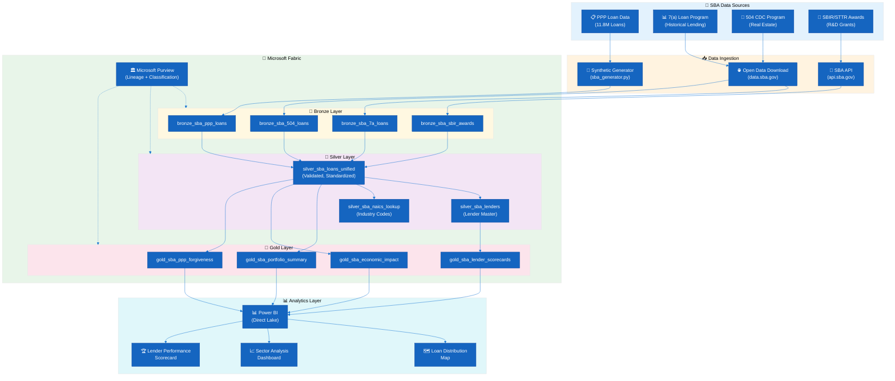
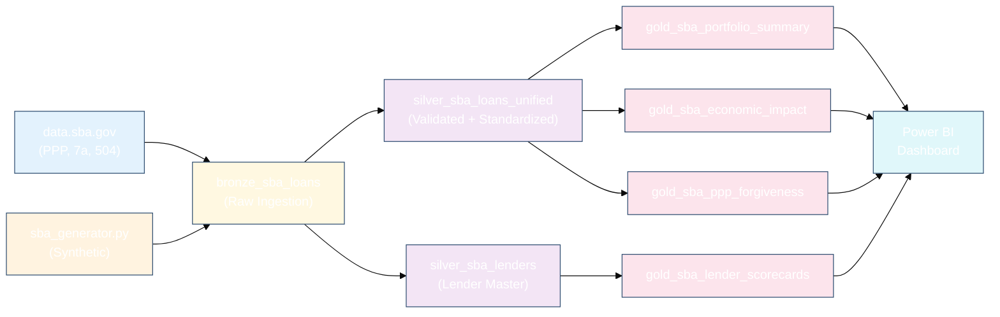

# 🏦 Tutorial 33: SBA Small Business Analytics

<div align="center" markdown>


</div>

> 🏠 **[Home](https://github.com/fgarofalo56/Suppercharge_Microsoft_Fabric/blob/main/README.md)** > 📖 **[Tutorials](../index.md)** > 🏦 **SBA Small Business Analytics**

---

!!! info "Third-party references — publicly sourced, good-faith comparison"
    This page references non-Microsoft products and services. That information is drawn from each vendor's **publicly available documentation** and is offered for honest, good-faith comparison only. This is a personal project written from a Microsoft Fabric and Azure perspective; it does **not** claim expertise in, or authority over, any third-party product, and nothing here is an official statement by, or endorsed by, those vendors. Capabilities, pricing, and features change often — always verify against the vendor's current official documentation. Where a third-party offering is the stronger choice, we say so plainly.

---

## 🏦 Tutorial 33: SBA Small Business Analytics

| | |
|---|---|
| **Difficulty** | ⭐⭐ Intermediate |
| **Time** | ⏱️ 90-120 minutes |
| **Focus** | SBA Loan Program Analytics, PPP Forgiveness Tracking, Economic Impact Analysis & Lender Scorecards |

---

### 📊 Progress Tracker

```
┌──────┬──────┬──────┬──────┬──────┬──────┬──────┬──────┬──────┬──────┬──────┬──────┬──────┬──────┐
│  00  │  01  │  02  │  03  │  04  │  05  │  06  │  07  │  08  │  09  │  10  │  11  │  12  │  13  │
│SETUP │BRNZE │SILVR │ GOLD │  RT  │ PBI  │PIPES │ GOV  │MIRRR │AI/ML │TDATA │ SAS  │CICD  │MIGR  │
├──────┼──────┼──────┼──────┼──────┼──────┼──────┼──────┼──────┼──────┼──────┼──────┼──────┼──────┤
│  ✅  │  ✅  │  ✅  │  ✅  │  ✅  │  ✅  │  ✅  │  ✅  │  ✅  │  ✅  │  ✅  │  ✅  │  ✅  │  ✅  │
└──────┴──────┴──────┴──────┴──────┴──────┴──────┴──────┴──────┴──────┴──────┴──────┴──────┴──────┘

┌──────┬──────┬──────┬──────┬──────┬──────┬──────┬──────┬──────┬──────┬──────┬──────┬──────┬──────┬──────┬──────┬──────┬──────┐
│  14  │  15  │  16  │  17  │  18  │  19  │  20  │  21  │  22  │  23  │  24  │  25  │  26  │  27  │  28  │  29  │  30  │  31  │
│ SEC  │ COST │PERF  │ MON  │SHARE │COPLT │WKBST │ GEO  │ NET  │SHIR  │ SNW  │ DB2  │MULTI │VIDEO │ MOVE │GEOLC │TRIBL │ DOT  │
├──────┼──────┼──────┼──────┼──────┼──────┼──────┼──────┼──────┼──────┼──────┼──────┼──────┼──────┼──────┼──────┼──────┼──────┤
│  ✅  │  ✅  │  ✅  │  ✅  │  ✅  │  ✅  │  ✅  │  ✅  │  ✅  │  ✅  │  ✅  │  ✅  │  ✅  │  ✅  │  ✅  │  ✅  │  ✅  │  ✅  │
└──────┴──────┴──────┴──────┴──────┴──────┴──────┴──────┴──────┴──────┴──────┴──────┴──────┴──────┴──────┴──────┴──────┴──────┘

┌──────┬──────┬──────┬──────┬──────┐
│  32  │  33  │  34  │  35  │  36  │
│ USDA │ SBA  │ NOAA │ EPA  │ DOI  │
├──────┼──────┼──────┼──────┼──────┤
│  ✅  │  🔵  │  ○   │  ○   │  ○   │
└──────┴──────┴──────┴──────┴──────┘
                ▲
         YOU ARE HERE
```

| Navigation | |
|---|---|
| ⬅️ **Previous** | [32-USDA Agriculture Analytics](../32-usda-agriculture/README.md) |
| ➡️ **Next** | [34-NOAA Weather & Climate Analytics](../34-noaa-weather-climate/README.md) |

---

## 📖 Overview

The U.S. Small Business Administration (SBA) has been the nation's primary engine for small business support since 1953, administering loan guarantee programs that have catalyzed trillions of dollars in private-sector lending. The SBA's portfolio spans multiple program types -- the flagship 7(a) general business loan, the 504 commercial real estate program, the Small Business Innovation Research (SBIR) awards for R&D, and the Paycheck Protection Program (PPP) that distributed over $800 billion across 11.8 million loans during the COVID-19 pandemic.

This tutorial teaches you to build a **small business lending analytics pipeline** in Microsoft Fabric that ingests SBA loan data from multiple program types, standardizes borrower and lender information, and produces portfolio-level dashboards revealing loan distribution patterns, economic impact by sector and geography, lender performance scorecards, and PPP forgiveness tracking.

SBA data is publicly available through [data.sba.gov](https://data.sba.gov/) and provides one of the richest open-data landscapes in the federal government. With 11.8 million PPP records alone, this tutorial exercises Fabric's capacity to handle large-scale federal datasets while delivering actionable analytics for economic development stakeholders.

> **💡 Why SBA Analytics on Fabric?**
>
> - **Scale**: 11.8M PPP records + decades of 7(a)/504 data require a platform that handles billions of rows without infrastructure management
> - **Economic impact measurement**: Quantify jobs supported, capital deployed, and forgiveness rates across industries, states, and Congressional districts
> - **Lender accountability**: Build scorecards that track origination volume, default rates, and processing efficiency by lending institution
> - **Program comparison**: Analyze how different SBA programs (7a, 504, SBIR, PPP) serve different segments of the small business ecosystem
> - **Open data transparency**: SBA data is public by law -- Fabric makes it accessible and analytically useful without expensive proprietary tools

> **📋 Data Availability Notice**
>
> All SBA data used in this tutorial is publicly available under the Freedom of Information Act (FOIA). PPP loan data was released by SBA following litigation and Congressional mandate. No personally identifiable information (PII) beyond business names and addresses is included in the public datasets. However, business owner names appear in PPP data for loans above $150K -- handle these fields with appropriate care.

---

## 🎯 Learning Objectives

By the end of this tutorial, you will be able to:

- [ ] Configure SBA data sources using both the synthetic data generator and open data downloads from data.sba.gov
- [ ] Ingest SBA loan records (PPP, 7a, 504, SBIR) into a Bronze Delta table with source tracking and schema enforcement
- [ ] Standardize loan amounts, NAICS codes, lender identifiers, and geographic fields in the Silver layer
- [ ] Build Gold layer portfolio analytics including loan distribution summaries, economic impact calculations, and lender scorecards
- [ ] Calculate PPP forgiveness rates and track forgiveness status across loan cohorts
- [ ] Create DAX measures for a Power BI loan analytics dashboard with geographic drill-down
- [ ] Design lender performance scorecards with origination volume, approval rates, and default tracking
- [ ] Build economic impact visualizations showing jobs supported and capital deployed by industry sector
- [ ] Apply data quality checks specific to federal lending data (NAICS validation, ZIP code standardization, amount thresholds)
- [ ] Configure Microsoft Purview governance for SBA data with appropriate sensitivity labels and lineage tracking

---

## 🏗️ Architecture Diagram



| Component | Technology | Purpose |
|-----------|-----------|---------|
| **SBA Data Sources** | PPP, 7(a), 504, SBIR datasets | Federal small business lending program data across four major program types |
| **Data Ingestion** | Generator + Open Data + API | Two-path ingestion: synthetic generator for development, open data downloads for production |
| **Bronze** | Delta Lake (append-only) | Raw loan records with source tracking, batch metadata, and original field preservation |
| **Silver** | Delta Lake (validated) | Unified loan table with standardized NAICS codes, amounts, lender IDs, and geography |
| **Gold** | Delta Lake (aggregated) | Portfolio summaries, lender scorecards, economic impact calculations, forgiveness tracking |
| **Purview** | Microsoft Purview | Data lineage, PII classification for business owner names, access governance |
| **Power BI** | Direct Lake | Loan distribution maps, sector analysis, lender performance scorecards |

---

## 📋 Prerequisites

Before starting this tutorial, ensure you have:

- [ ] Completed [Tutorial 00: Environment Setup](../00-environment-setup/README.md)
- [ ] Completed [Tutorial 01: Bronze Layer](../01-bronze-layer/README.md)
- [ ] Completed [Tutorial 02: Silver Layer](../02-silver-layer/README.md)
- [ ] Completed [Tutorial 03: Gold Layer](../03-gold-layer/README.md)
- [ ] Completed [Tutorial 05: Direct Lake & Power BI](../05-direct-lake-powerbi/README.md)
- [ ] Completed [Tutorial 07: Governance & Purview](../07-governance-purview/README.md)
- [ ] Fabric workspace with F64 capacity (or F2+ for development/testing)
- [ ] Familiarity with PySpark, Delta Lake, and DAX patterns from prior tutorials
- [ ] Python 3.9+ with `requests` and `pandas` packages (for open data download option)

> **📋 Data Source Options**
>
> This tutorial supports two data ingestion paths:
> 1. **Synthetic Generator** (recommended for learning): Use [`sba_generator.py`](https://github.com/fgarofalo56/Suppercharge_Microsoft_Fabric/blob/main/data_generation/generators/federal/sba_generator.py) to generate realistic SBA loan data locally
> 2. **Open Data Download**: Download real PPP, 7(a), and 504 data from [data.sba.gov](https://data.sba.gov/) for production-grade analytics
>
> Both paths converge at the same Bronze schema. The tutorial walks through both options.

---

## 🛠️ Step 1: Data Source Setup

SBA provides some of the most comprehensive open data in the federal government. Understanding the data landscape across program types is essential for designing the ingestion pipeline.

### 1.1 SBA Loan Programs Overview

| Program | Purpose | Loan Range | Volume | Key Fields |
|---------|---------|------------|--------|------------|
| **PPP** | COVID-19 payroll protection | $1K - $10M | 11.8M loans ($800B+) | Forgiveness amount, jobs reported, NAICS, lender |
| **7(a)** | General small business loans | Up to $5M | ~50K/year | Approval amount, term, SBA guarantee %, default status |
| **504** | Commercial real estate / equipment | $125K - $5.5M | ~6K/year | CDC name, project cost, jobs created, debenture amount |
| **SBIR/STTR** | Research and development | $50K - $2M (phases) | ~4K/year | Agency, topic, phase, award amount, firm size |

### 1.2 Option A: Synthetic Data Generator

The synthetic generator produces realistic SBA loan data matching the schema defined in [`sba_loan_schema.json`](https://github.com/fgarofalo56/Suppercharge_Microsoft_Fabric/blob/main/data_generation/schemas/federal/sba_loan_schema.json).

```python
# Generate synthetic SBA loan data for development
# Reference: data_generation/generators/federal/sba_generator.py

import sys
sys.path.append("../../data_generation")

from generators.federal.sba_generator import SBAGenerator

# Initialize generator
generator = SBAGenerator(
    output_path="/lakehouse/default/Files/raw/sba/",
    num_records=50000,         # 50K loans for development
    programs=["PPP", "7A", "504", "SBIR"],
    date_range=("2020-01-01", "2024-12-31"),
    seed=42
)

# Generate data
df_generated = generator.generate_batch()

print(f"Generated {df_generated.count():,} SBA loan records")
print(f"Program distribution:")
df_generated.groupBy("program_type").count().show()
```

> **💡 Generator Features**
>
> The SBA generator produces:
> - Realistic NAICS code distribution matching actual SBA lending patterns
> - Geographically weighted loan amounts (higher averages in high-cost areas)
> - Proper PPP forgiveness status distribution (94% full, 3% partial, 3% pending)
> - Valid lender name and ID combinations from actual SBA-approved lender lists
> - SBIR phase progression (Phase I -> Phase II) with appropriate award amounts

### 1.3 Option B: Open Data Download from data.sba.gov

For production analytics with real SBA data, download directly from the SBA open data portal.

```python
# Download real SBA data from data.sba.gov
# PPP data: https://data.sba.gov/dataset/ppp-foia
# 7(a)/504: https://data.sba.gov/dataset/7-a-504-foia

import requests
import os

SBA_DATA_URLS = {
    "ppp_150k_plus": "https://data.sba.gov/dataset/ppp-foia/resource/ppp-150k-plus.csv",
    "ppp_under_150k": "https://data.sba.gov/dataset/ppp-foia/resource/ppp-under-150k.csv",
    "sba_7a_504": "https://data.sba.gov/dataset/7-a-504-foia/resource/7a-504-summary.csv",
}

download_path = "/lakehouse/default/Files/raw/sba/downloads/"
os.makedirs(download_path, exist_ok=True)

for name, url in SBA_DATA_URLS.items():
    print(f"Downloading {name}...")
    # Note: PPP files are large (2GB+). Use streaming download.
    response = requests.get(url, stream=True)
    file_path = os.path.join(download_path, f"{name}.csv")

    with open(file_path, "wb") as f:
        for chunk in response.iter_content(chunk_size=8192):
            f.write(chunk)

    file_size_mb = os.path.getsize(file_path) / (1024 * 1024)
    print(f"  Saved: {file_path} ({file_size_mb:.1f} MB)")
```

> **⚠️ Large File Warning**
>
> The PPP dataset exceeds 2 GB when downloaded as CSV. Ensure your Fabric lakehouse has sufficient storage capacity. For initial development, use the synthetic generator (Option A) and switch to real data for production validation.

### 1.4 SBA Data Use Policies

| Policy | Requirement |
|--------|-------------|
| **Public Data** | PPP data over $150K is public by law; under $150K was released after litigation |
| **Business PII** | Business names and addresses are public; owner names appear for loans >$150K |
| **No Re-identification** | Do not attempt to link SBA data with other datasets to identify individuals |
| **Attribution** | Credit "U.S. Small Business Administration" when publishing analyses |
| **Timeliness** | SBA updates datasets quarterly; note the vintage of your download |
| **Accuracy Disclaimer** | SBA data is self-reported by lenders; some records contain errors |

---

## 🛠️ Step 2: Bronze Layer Ingestion

The Bronze layer captures raw SBA loan records from all program types with full source tracking and original field preservation.

> **📓 Notebook Reference**: [`notebooks/bronze/13_bronze_sba.py`](https://github.com/fgarofalo56/Suppercharge_Microsoft_Fabric/blob/main/notebooks/bronze/13_bronze_sba.py)

### 2.1 Schema Definition

The schema accommodates all four SBA program types in a unified structure, with program-specific fields nullable for programs that do not use them.

```python
# Unified SBA loan schema for Bronze layer
from pyspark.sql.types import *

sba_loan_schema = StructType([
    # Core identifiers
    StructField("loan_id", StringType(), False),             # SBA loan number
    StructField("program_type", StringType(), False),         # PPP, 7A, 504, SBIR
    StructField("approval_date", DateType(), True),           # Loan approval date
    StructField("disbursement_date", DateType(), True),       # Funds disbursed date

    # Borrower information
    StructField("business_name", StringType(), True),         # Borrower business name
    StructField("business_type", StringType(), True),         # Corporation, LLC, Sole Prop, etc.
    StructField("naics_code", StringType(), True),            # 6-digit NAICS industry code
    StructField("naics_description", StringType(), True),     # Industry description
    StructField("business_age", StringType(), True),          # New, Existing, Startup
    StructField("jobs_reported", IntegerType(), True),        # Jobs supported/retained

    # Geography
    StructField("borrower_city", StringType(), True),
    StructField("borrower_state", StringType(), True),        # 2-letter state code
    StructField("borrower_zip", StringType(), True),          # 5-digit ZIP
    StructField("congressional_district", StringType(), True), # State-District (e.g., CA-12)
    StructField("rural_urban", StringType(), True),            # Rural, Urban, Suburban

    # Loan details
    StructField("loan_amount", DoubleType(), True),           # Total loan amount ($)
    StructField("sba_guarantee_amount", DoubleType(), True),  # SBA guarantee portion ($)
    StructField("sba_guarantee_pct", DoubleType(), True),     # Guarantee percentage
    StructField("term_months", IntegerType(), True),          # Loan term in months
    StructField("interest_rate", DoubleType(), True),         # Interest rate (%)
    StructField("loan_status", StringType(), True),           # Active, PIF, Default, Charged Off

    # Lender information
    StructField("lender_name", StringType(), True),           # Lending institution
    StructField("lender_id", StringType(), True),             # SBA lender ID
    StructField("lender_city", StringType(), True),
    StructField("lender_state", StringType(), True),

    # PPP-specific fields
    StructField("forgiveness_amount", DoubleType(), True),    # PPP forgiveness amount
    StructField("forgiveness_status", StringType(), True),    # Full, Partial, Denied, Pending
    StructField("forgiveness_date", DateType(), True),
    StructField("ppp_draw", StringType(), True),              # First Draw, Second Draw

    # SBIR-specific fields
    StructField("sbir_phase", StringType(), True),            # Phase I, Phase II
    StructField("awarding_agency", StringType(), True),       # Federal agency
    StructField("research_topic", StringType(), True),

    # 504-specific fields
    StructField("cdc_name", StringType(), True),              # Certified Development Company
    StructField("project_cost", DoubleType(), True),          # Total project cost
    StructField("debenture_amount", DoubleType(), True),      # SBA debenture
])

print(f"Schema fields: {len(sba_loan_schema.fields)}")
print(f"Required fields: {sum(1 for f in sba_loan_schema.fields if not f.nullable)}")
```

### 2.2 Multi-Source Ingestion

```python
# Bronze ingestion: unified pipeline for all SBA program types
# Handles both synthetic generator output and open data CSV downloads

from pyspark.sql.functions import *
from datetime import datetime

BATCH_ID = f"sba-batch-{datetime.utcnow().strftime('%Y%m%d-%H%M%S')}"
RUN_ID = str(uuid4())

# Detect source format and read
source_path = "/lakehouse/default/Files/raw/sba/"

# Read Parquet (from generator)
df_parquet = spark.read \
    .schema(sba_loan_schema) \
    .parquet(f"{source_path}*.parquet") \
    if len(mssparkutils.fs.ls(f"{source_path}*.parquet")) > 0 else None

# Read CSV (from open data download)
df_csv = spark.read \
    .option("header", "true") \
    .option("inferSchema", "false") \
    .csv(f"{source_path}downloads/*.csv") \
    if os.path.exists("/lakehouse/default/Files/raw/sba/downloads/") else None

# Union available sources
sources = [df for df in [df_parquet, df_csv] if df is not None]
df_raw = sources[0]
for df in sources[1:]:
    df_raw = df_raw.unionByName(df, allowMissingColumns=True)

print(f"Raw records loaded: {df_raw.count():,}")
print(f"Program types: {[r.program_type for r in df_raw.select('program_type').distinct().collect()]}")
```

### 2.3 Bronze Write with Source Tracking

```python
# Add Bronze metadata and write
df_bronze = df_raw \
    .withColumn("_ingested_at", current_timestamp()) \
    .withColumn("_source_file", input_file_name()) \
    .withColumn("_batch_id", lit(BATCH_ID)) \
    .withColumn("_run_id", lit(RUN_ID)) \
    .withColumn("_load_date", current_timestamp().cast("date"))

# Write to Delta table (append-only)
df_bronze.write \
    .format("delta") \
    .mode("append") \
    .option("mergeSchema", "true") \
    .partitionBy("program_type", "_load_date") \
    .saveAsTable("lh_bronze.bronze_sba_loans")

# Verification
count = spark.table("lh_bronze.bronze_sba_loans").count()
print(f"Bronze table: {count:,} total records")

# Program distribution
spark.sql("""
    SELECT program_type, COUNT(*) as record_count,
           ROUND(SUM(loan_amount), 0) as total_amount
    FROM lh_bronze.bronze_sba_loans
    GROUP BY program_type
    ORDER BY record_count DESC
""").show()
```

> **💡 Partitioning Strategy**
>
> Partitioning by `program_type` first enables efficient program-specific queries (e.g., PPP-only forgiveness analysis) without scanning the entire dataset. The secondary `_load_date` partition supports incremental processing and batch identification.

---

## 🛠️ Step 3: Silver Layer -- Validation & Standardization

The Silver layer unifies records across all four SBA programs, standardizes geographic and industry codes, validates loan amounts against program limits, and creates lookup tables for lender and NAICS analysis.

> **📓 Notebook Reference**: [`notebooks/silver/13_silver_sba.py`](https://github.com/fgarofalo56/Suppercharge_Microsoft_Fabric/blob/main/notebooks/silver/13_silver_sba.py)

### 3.1 NAICS Code Validation and Enrichment

The North American Industry Classification System (NAICS) is the standard for classifying businesses. SBA data uses 6-digit NAICS codes, but quality varies across self-reported records.

```python
# NAICS code validation and enrichment
NAICS_PATTERN = r"^\d{6}$"

# NAICS sector mapping (first 2 digits)
NAICS_SECTORS = {
    "11": "Agriculture, Forestry, Fishing",
    "21": "Mining, Quarrying, Oil/Gas",
    "22": "Utilities",
    "23": "Construction",
    "31": "Manufacturing", "32": "Manufacturing", "33": "Manufacturing",
    "42": "Wholesale Trade",
    "44": "Retail Trade", "45": "Retail Trade",
    "48": "Transportation/Warehousing", "49": "Transportation/Warehousing",
    "51": "Information",
    "52": "Finance and Insurance",
    "53": "Real Estate",
    "54": "Professional/Scientific/Technical",
    "55": "Management of Companies",
    "56": "Admin/Support/Waste Management",
    "61": "Educational Services",
    "62": "Health Care and Social Assistance",
    "71": "Arts, Entertainment, Recreation",
    "72": "Accommodation and Food Services",
    "81": "Other Services",
    "92": "Public Administration",
}

sector_expr = create_map([lit(x) for pair in NAICS_SECTORS.items() for x in pair])

df_naics = df_bronze \
    .withColumn("naics_code_clean", regexp_replace(col("naics_code"), "[^0-9]", "")) \
    .withColumn("naics_valid", col("naics_code_clean").rlike(NAICS_PATTERN)) \
    .withColumn("naics_sector_code", substring(col("naics_code_clean"), 1, 2)) \
    .withColumn("naics_sector_name",
        coalesce(sector_expr[col("naics_sector_code")], lit("Unknown"))
    )

# Validation report
valid_naics = df_naics.filter(col("naics_valid") == True).count()
invalid_naics = df_naics.filter(col("naics_valid") == False).count()
print(f"NAICS Validation: {valid_naics:,} valid, {invalid_naics:,} invalid")
```

### 3.2 Geographic Standardization

```python
# Standardize state codes, ZIP codes, and congressional districts
df_geo = df_naics \
    .withColumn("borrower_state_std", upper(trim(col("borrower_state")))) \
    .withColumn("borrower_zip_std",
        lpad(regexp_replace(col("borrower_zip"), "[^0-9]", ""), 5, "0")
    ) \
    .withColumn("borrower_zip_valid",
        col("borrower_zip_std").rlike(r"^\d{5}$")
    ) \
    .withColumn("congressional_district_std",
        upper(trim(col("congressional_district")))
    ) \
    .withColumn("sba_region",
        when(col("borrower_state_std").isin("CT","ME","MA","NH","RI","VT"), lit("Region I - New England"))
        .when(col("borrower_state_std").isin("NJ","NY","PR","VI"), lit("Region II - Mid-Atlantic"))
        .when(col("borrower_state_std").isin("DC","DE","MD","PA","VA","WV"), lit("Region III - Atlantic"))
        .when(col("borrower_state_std").isin("AL","FL","GA","KY","MS","NC","SC","TN"), lit("Region IV - Southeast"))
        .when(col("borrower_state_std").isin("IL","IN","MI","MN","OH","WI"), lit("Region V - Great Lakes"))
        .when(col("borrower_state_std").isin("AR","LA","NM","OK","TX"), lit("Region VI - South Central"))
        .when(col("borrower_state_std").isin("IA","KS","MO","NE"), lit("Region VII - Plains"))
        .when(col("borrower_state_std").isin("CO","MT","ND","SD","UT","WY"), lit("Region VIII - Mountain"))
        .when(col("borrower_state_std").isin("AZ","CA","GU","HI","NV"), lit("Region IX - Pacific"))
        .when(col("borrower_state_std").isin("AK","ID","OR","WA"), lit("Region X - Northwest"))
        .otherwise(lit("Unknown"))
    )
```

### 3.3 Loan Amount Validation

```python
# Validate loan amounts against program-specific thresholds
PROGRAM_LIMITS = {
    "PPP": (1000, 10000000),        # $1K - $10M
    "7A": (1000, 5000000),          # $1K - $5M
    "504": (125000, 5500000),       # $125K - $5.5M
    "SBIR": (50000, 2000000),       # $50K - $2M
}

df_validated = df_geo
for program, (min_amt, max_amt) in PROGRAM_LIMITS.items():
    df_validated = df_validated \
        .withColumn(f"amount_valid_{program.lower()}",
            when(
                (col("program_type") == program) &
                (col("loan_amount") >= min_amt) &
                (col("loan_amount") <= max_amt),
                lit(True)
            ).when(col("program_type") != program, lit(None))
            .otherwise(lit(False))
        )

# Unified amount validation flag
df_validated = df_validated \
    .withColumn("loan_amount_valid",
        coalesce(
            col("amount_valid_ppp"),
            col("amount_valid_7a"),
            col("amount_valid_504"),
            col("amount_valid_sbir"),
            lit(True)
        )
    ) \
    .drop("amount_valid_ppp", "amount_valid_7a", "amount_valid_504", "amount_valid_sbir")
```

### 3.4 Deduplication and Data Quality Scoring

```python
# Deduplication by loan_id (primary key)
before_dedup = df_validated.count()
df_deduped = df_validated.dropDuplicates(["loan_id"])
after_dedup = df_deduped.count()
print(f"Deduplication: {before_dedup:,} -> {after_dedup:,} ({before_dedup - after_dedup:,} removed)")

# Data quality scoring (0-100)
df_silver = df_deduped \
    .withColumn("_dq_score",
        when(col("loan_id").isNotNull(), lit(15)).otherwise(lit(0)) +
        when(col("program_type").isNotNull(), lit(10)).otherwise(lit(0)) +
        when(col("loan_amount").isNotNull() & (col("loan_amount") > 0), lit(15)).otherwise(lit(0)) +
        when(col("naics_valid") == True, lit(10)).otherwise(lit(0)) +
        when(col("borrower_state_std").isNotNull(), lit(10)).otherwise(lit(0)) +
        when(col("borrower_zip_valid") == True, lit(10)).otherwise(lit(0)) +
        when(col("lender_name").isNotNull(), lit(10)).otherwise(lit(0)) +
        when(col("approval_date").isNotNull(), lit(10)).otherwise(lit(0)) +
        when(col("loan_amount_valid") == True, lit(5)).otherwise(lit(0)) +
        when(col("jobs_reported").isNotNull(), lit(5)).otherwise(lit(0))
    ) \
    .withColumn("_silver_timestamp", current_timestamp())

# Write Silver
df_silver.write \
    .format("delta") \
    .mode("overwrite") \
    .option("overwriteSchema", "true") \
    .partitionBy("program_type") \
    .saveAsTable("lh_silver.silver_sba_loans_unified")

spark.sql("OPTIMIZE lh_silver.silver_sba_loans_unified ZORDER BY (borrower_state_std, naics_sector_code)")

print(f"Silver: {df_silver.count():,} records written")
print(f"Average DQ score: {df_silver.agg(avg('_dq_score')).collect()[0][0]:.1f}/100")
```

### 3.5 Lender Master Table

```python
# Build lender master from Silver loan data
df_lender_master = df_silver \
    .filter(col("lender_id").isNotNull()) \
    .groupBy("lender_id", "lender_name", "lender_city", "lender_state") \
    .agg(
        count("*").alias("total_loans"),
        sum("loan_amount").alias("total_amount"),
        countDistinct("program_type").alias("programs_served"),
        min("approval_date").alias("earliest_loan"),
        max("approval_date").alias("latest_loan"),
    )

df_lender_master.write \
    .format("delta") \
    .mode("overwrite") \
    .saveAsTable("lh_silver.silver_sba_lenders")

print(f"Lender master: {df_lender_master.count():,} unique lenders")
```

---

## 🛠️ Step 4: Gold Layer -- Portfolio Analytics

The Gold layer builds business-facing aggregations: portfolio summaries by program and geography, economic impact calculations, lender performance scorecards, and PPP forgiveness tracking.

> **📓 Notebook Reference**: [`notebooks/gold/13_gold_sba_analytics.py`](https://github.com/fgarofalo56/Suppercharge_Microsoft_Fabric/blob/main/notebooks/gold/13_gold_sba_analytics.py)

### 4.1 Portfolio Summary

```python
# Portfolio summary: loan counts, amounts, and averages by program, state, and sector
df_portfolio = df_silver \
    .groupBy("program_type", "borrower_state_std", "naics_sector_name") \
    .agg(
        count("*").alias("loan_count"),
        sum("loan_amount").alias("total_loan_amount"),
        avg("loan_amount").alias("avg_loan_amount"),
        sum("sba_guarantee_amount").alias("total_guarantee_amount"),

        # Jobs impact
        sum("jobs_reported").alias("total_jobs_reported"),
        avg("jobs_reported").alias("avg_jobs_per_loan"),

        # Loan outcomes
        sum(when(col("loan_status") == "PIF", 1).otherwise(0)).alias("paid_in_full"),
        sum(when(col("loan_status") == "Default", 1).otherwise(0)).alias("defaults"),
        sum(when(col("loan_status") == "Charged Off", 1).otherwise(0)).alias("charged_off"),
        sum(when(col("loan_status") == "Active", 1).otherwise(0)).alias("active_loans"),

        # Quality metrics
        avg("_dq_score").alias("avg_dq_score"),
    ) \
    .withColumn("default_rate",
        when(col("loan_count") > 0,
            round((col("defaults") + col("charged_off")) * 100.0 / col("loan_count"), 2)
        ).otherwise(lit(0.0))
    ) \
    .withColumn("cost_per_job",
        when(col("total_jobs_reported") > 0,
            round(col("total_loan_amount") / col("total_jobs_reported"), 2)
        ).otherwise(lit(None))
    )

df_portfolio.write \
    .format("delta") \
    .mode("overwrite") \
    .saveAsTable("lh_gold.gold_sba_portfolio_summary")
```

### 4.2 Economic Impact Analysis

```python
# Economic impact by state and congressional district
df_economic = df_silver \
    .groupBy("borrower_state_std", "congressional_district_std", "sba_region") \
    .agg(
        count("*").alias("total_loans"),
        sum("loan_amount").alias("total_capital_deployed"),
        sum("jobs_reported").alias("total_jobs_supported"),
        countDistinct("naics_sector_name").alias("industry_sectors_served"),
        countDistinct("lender_id").alias("active_lenders"),

        # Program breakdown
        sum(when(col("program_type") == "PPP", col("loan_amount")).otherwise(0)).alias("ppp_amount"),
        sum(when(col("program_type") == "7A", col("loan_amount")).otherwise(0)).alias("s7a_amount"),
        sum(when(col("program_type") == "504", col("loan_amount")).otherwise(0)).alias("s504_amount"),
        sum(when(col("program_type") == "SBIR", col("loan_amount")).otherwise(0)).alias("sbir_amount"),

        # Small business density
        countDistinct("business_name").alias("unique_businesses"),
    ) \
    .withColumn("avg_capital_per_job",
        when(col("total_jobs_supported") > 0,
            round(col("total_capital_deployed") / col("total_jobs_supported"), 0)
        ).otherwise(lit(None))
    )

df_economic.write \
    .format("delta") \
    .mode("overwrite") \
    .saveAsTable("lh_gold.gold_sba_economic_impact")
```

### 4.3 Lender Scorecards

```python
# Lender performance scorecards
df_lender_score = df_silver \
    .groupBy("lender_id", "lender_name", "lender_state") \
    .agg(
        count("*").alias("total_loans_originated"),
        sum("loan_amount").alias("total_amount_originated"),
        avg("loan_amount").alias("avg_loan_size"),
        countDistinct("borrower_state_std").alias("states_served"),
        countDistinct("program_type").alias("programs_participated"),

        # Portfolio health
        sum(when(col("loan_status") == "PIF", 1).otherwise(0)).alias("loans_paid_in_full"),
        sum(when(col("loan_status").isin("Default", "Charged Off"), 1).otherwise(0)).alias("loans_defaulted"),
        sum(when(col("loan_status") == "Active", 1).otherwise(0)).alias("loans_active"),

        # PPP performance
        sum(when(col("program_type") == "PPP", 1).otherwise(0)).alias("ppp_loans"),
        sum(when((col("program_type") == "PPP") & (col("forgiveness_status") == "Full"), 1).otherwise(0))
            .alias("ppp_fully_forgiven"),

        # Jobs impact
        sum("jobs_reported").alias("total_jobs_supported"),
        avg("_dq_score").alias("avg_data_quality"),
    ) \
    .withColumn("default_rate_pct",
        when(col("total_loans_originated") > 0,
            round(col("loans_defaulted") * 100.0 / col("total_loans_originated"), 2)
        ).otherwise(lit(0.0))
    ) \
    .withColumn("ppp_forgiveness_rate_pct",
        when(col("ppp_loans") > 0,
            round(col("ppp_fully_forgiven") * 100.0 / col("ppp_loans"), 2)
        ).otherwise(lit(None))
    ) \
    .withColumn("lender_tier",
        when(col("total_loans_originated") >= 10000, lit("Tier 1 - National"))
        .when(col("total_loans_originated") >= 1000, lit("Tier 2 - Regional"))
        .when(col("total_loans_originated") >= 100, lit("Tier 3 - Community"))
        .otherwise(lit("Tier 4 - Micro"))
    )

df_lender_score.write \
    .format("delta") \
    .mode("overwrite") \
    .saveAsTable("lh_gold.gold_sba_lender_scorecards")

spark.sql("OPTIMIZE lh_gold.gold_sba_lender_scorecards ZORDER BY (lender_state, lender_tier)")
```

### 4.4 PPP Forgiveness Tracking

```python
# PPP-specific forgiveness analysis
df_ppp_forgiveness = df_silver \
    .filter(col("program_type") == "PPP") \
    .groupBy("forgiveness_status", "borrower_state_std", "naics_sector_name", "ppp_draw") \
    .agg(
        count("*").alias("loan_count"),
        sum("loan_amount").alias("total_loan_amount"),
        sum("forgiveness_amount").alias("total_forgiveness_amount"),
        avg("loan_amount").alias("avg_loan_amount"),
        sum("jobs_reported").alias("jobs_reported"),
    ) \
    .withColumn("forgiveness_rate_pct",
        when(col("total_loan_amount") > 0,
            round(col("total_forgiveness_amount") * 100.0 / col("total_loan_amount"), 2)
        ).otherwise(lit(0.0))
    )

df_ppp_forgiveness.write \
    .format("delta") \
    .mode("overwrite") \
    .saveAsTable("lh_gold.gold_sba_ppp_forgiveness")

# Summary statistics
print("Gold layer tables written:")
for table in ["gold_sba_portfolio_summary", "gold_sba_economic_impact",
              "gold_sba_lender_scorecards", "gold_sba_ppp_forgiveness"]:
    count = spark.table(f"lh_gold.{table}").count()
    print(f"  {table}: {count:,} rows")
```

---

## 🛠️ Step 5: Power BI Dashboard

The Power BI dashboard provides interactive analytics across SBA loan programs with geographic drill-down, sector analysis, and lender performance tracking.

### 5.1 DAX Measures

```dax
// ===== SBA Portfolio Measures =====

// Total Loans
Total Loans = COUNTROWS(gold_sba_portfolio_summary)

// Total Capital Deployed
Total Capital Deployed =
SUM(gold_sba_portfolio_summary[total_loan_amount])

// Total Jobs Supported
Total Jobs Supported =
SUM(gold_sba_portfolio_summary[total_jobs_reported])

// Average Loan Size
Avg Loan Size =
DIVIDE(
    [Total Capital Deployed],
    [Total Loans],
    0
)

// Default Rate (%)
Portfolio Default Rate % =
DIVIDE(
    SUM(gold_sba_portfolio_summary[defaults]) +
        SUM(gold_sba_portfolio_summary[charged_off]),
    SUM(gold_sba_portfolio_summary[loan_count]),
    0
) * 100

// Cost per Job
Cost per Job =
DIVIDE(
    [Total Capital Deployed],
    [Total Jobs Supported],
    0
)

// PPP Forgiveness Rate (%)
PPP Forgiveness Rate % =
DIVIDE(
    CALCULATE(
        SUM(gold_sba_ppp_forgiveness[total_forgiveness_amount]),
        gold_sba_ppp_forgiveness[forgiveness_status] = "Full"
    ),
    CALCULATE(
        SUM(gold_sba_ppp_forgiveness[total_loan_amount])
    ),
    0
) * 100

// Lender Concentration (Top 10 share)
Top 10 Lender Share % =
VAR Top10Amount =
    CALCULATE(
        SUM(gold_sba_lender_scorecards[total_amount_originated]),
        TOPN(10, ALL(gold_sba_lender_scorecards), [total_amount_originated], DESC)
    )
VAR TotalAmount =
    CALCULATE(
        SUM(gold_sba_lender_scorecards[total_amount_originated]),
        ALL(gold_sba_lender_scorecards)
    )
RETURN
    DIVIDE(Top10Amount, TotalAmount, 0) * 100
```

### 5.2 Dashboard Layout

```
┌─────────────────────────────────────────────────────────────────────────────┐
│  🏦 SBA SMALL BUSINESS ANALYTICS DASHBOARD                                 │
│  Program: [Slicer] │ State: [Slicer] │ Sector: [Slicer] │ Year: [Slicer] │
├───────────────────┬──────────────────┬──────────────────┬──────────────────┤
│  💰 Total Capital │  📊 Total Loans  │  👥 Jobs         │  📉 Default     │
│  Deployed         │                  │  Supported        │  Rate           │
│  $847.2B          │  11.8M           │  62.4M            │  2.8%           │
├───────────────────┴──────────────────┴──────────────────┴──────────────────┤
│                                                                             │
│  ┌─────────────────────────────────┐  ┌──────────────────────────────────┐ │
│  │  Loan Distribution by State     │  │  Capital by Industry Sector     │ │
│  │  [Filled Map Visual]           │  │  [Treemap Visual]               │ │
│  │                                 │  │                                  │ │
│  │  Color: Total Loan Amount      │  │  Accommodation/Food: 28%        │ │
│  │  Tooltip: Loan count, jobs     │  │  Healthcare: 14%                │ │
│  │  Drill: State -> District      │  │  Professional Svcs: 12%         │ │
│  └─────────────────────────────────┘  └──────────────────────────────────┘ │
│                                                                             │
│  ┌─────────────────────────────────┐  ┌──────────────────────────────────┐ │
│  │  Top 20 Lenders by Volume      │  │  PPP Forgiveness Status         │ │
│  │  [Horizontal Bar Chart]        │  │  [Donut Chart]                  │ │
│  │                                 │  │                                  │ │
│  │  JPMorgan Chase: ████████ 12%  │  │  Full: 94%                      │ │
│  │  Bank of America: ██████ 9%    │  │  Partial: 3%                    │ │
│  │  Wells Fargo: █████ 7%         │  │  Pending: 2%                    │ │
│  └─────────────────────────────────┘  └──────────────────────────────────┘ │
│                                                                             │
│  ┌──────────────────────────────────────────────────────────────────────┐  │
│  │  Loan Volume Trend by Month and Program Type                        │  │
│  │  [Stacked Area Chart: PPP, 7a, 504, SBIR]                         │  │
│  └──────────────────────────────────────────────────────────────────────┘  │
└─────────────────────────────────────────────────────────────────────────────┘
```

### 5.3 Lender Performance Scorecard Visual

```dax
// Lender performance ranking
Lender Rank by Volume =
RANKX(
    ALL(gold_sba_lender_scorecards),
    [total_amount_originated],
    ,
    DESC,
    DENSE
)

// Lender health indicator
Lender Health =
VAR DefaultRate = SELECTEDVALUE(gold_sba_lender_scorecards[default_rate_pct])
RETURN
    SWITCH(
        TRUE(),
        DefaultRate <= 2, "Excellent",
        DefaultRate <= 5, "Good",
        DefaultRate <= 10, "Watch",
        "At Risk"
    )
```

---

## 🛠️ Step 6: Data Quality Checks

### 6.1 SBA-Specific Validation Rules

```python
# Data quality checks specific to SBA lending data
from great_expectations.core import ExpectationSuite

sba_expectations = ExpectationSuite(expectation_suite_name="sba_loans_suite")

# Loan ID uniqueness
sba_expectations.add_expectation({
    "expectation_type": "expect_column_values_to_be_unique",
    "kwargs": {"column": "loan_id"}
})

# Program type values
sba_expectations.add_expectation({
    "expectation_type": "expect_column_values_to_be_in_set",
    "kwargs": {"column": "program_type", "value_set": ["PPP", "7A", "504", "SBIR"]}
})

# Loan amount positivity
sba_expectations.add_expectation({
    "expectation_type": "expect_column_values_to_be_between",
    "kwargs": {"column": "loan_amount", "min_value": 0, "strict_min": True}
})

# State code validation (2-letter)
sba_expectations.add_expectation({
    "expectation_type": "expect_column_value_lengths_to_equal",
    "kwargs": {"column": "borrower_state_std", "value": 2}
})

# NAICS code format (6 digits)
sba_expectations.add_expectation({
    "expectation_type": "expect_column_values_to_match_regex",
    "kwargs": {"column": "naics_code_clean", "regex": r"^\d{6}$", "mostly": 0.95}
})

# PPP forgiveness cannot exceed loan amount
sba_expectations.add_expectation({
    "expectation_type": "expect_column_pair_values_a_to_be_less_than_or_equal_to_b",
    "kwargs": {"column_A": "forgiveness_amount", "column_B": "loan_amount", "mostly": 0.99}
})

print(f"SBA validation suite: {len(sba_expectations.expectations)} expectations defined")
```

### 6.2 Quality Monitoring Dashboard

```python
# Automated DQ monitoring
dq_summary = spark.sql("""
    SELECT
        program_type,
        COUNT(*) as total_records,
        ROUND(AVG(_dq_score), 1) as avg_dq_score,
        SUM(CASE WHEN _dq_score >= 80 THEN 1 ELSE 0 END) as high_quality,
        SUM(CASE WHEN _dq_score < 50 THEN 1 ELSE 0 END) as low_quality,
        SUM(CASE WHEN naics_valid = false THEN 1 ELSE 0 END) as invalid_naics,
        SUM(CASE WHEN loan_amount_valid = false THEN 1 ELSE 0 END) as invalid_amounts
    FROM lh_silver.silver_sba_loans_unified
    GROUP BY program_type
    ORDER BY program_type
""")

dq_summary.show(truncate=False)
```

---

## 🛠️ Step 7: Governance & Purview

### 7.1 Sensitivity Classification

SBA data is predominantly public, but business owner PII requires appropriate handling.

| Data Element | Classification | Handling |
|-------------|---------------|----------|
| Loan ID, amounts, terms | **Public** | No restrictions -- published by SBA |
| Business name, address | **Public** | Published in FOIA releases |
| Business owner name | **Internal** | Appears in PPP data >$150K; avoid republishing |
| Lender details | **Public** | Published SBA lender directory |
| NAICS codes, geography | **Public** | Standard classification data |
| Jobs reported | **Public** | Self-reported, published by SBA |

```python
# Purview sensitivity labels for SBA data
purview_classifications = {
    "lh_bronze.bronze_sba_loans": {
        "sensitivity_label": "Public - Federal Open Data",
        "columns_with_pii": ["business_name"],
        "data_owner": "sba_analytics_team@contoso.com",
        "data_steward": "federal_data_governance@contoso.com",
        "retention_policy": "7 years (federal records schedule)",
    },
    "lh_silver.silver_sba_loans_unified": {
        "sensitivity_label": "Internal - Enriched Federal Data",
        "data_lineage": "bronze_sba_loans -> NAICS enrichment -> geo standardization",
    },
    "lh_gold.gold_sba_lender_scorecards": {
        "sensitivity_label": "Internal - Derived Analytics",
        "data_lineage": "silver_sba_loans_unified -> lender aggregation -> scoring",
    },
}

for table, config in purview_classifications.items():
    print(f"\n{table}:")
    for key, value in config.items():
        print(f"  {key}: {value}")
```

### 7.2 Data Lineage



---

## 🔧 Troubleshooting

| Symptom | Likely Cause | Solution |
|---------|-------------|----------|
| CSV download fails or times out | PPP files are 2GB+; network timeout | Use streaming download with `iter_content()`; consider downloading via browser first and uploading to lakehouse |
| NAICS validation rate below 90% | Self-reported NAICS codes have errors | Use fuzzy matching against NAICS reference table; map common misspellings |
| Duplicate loan_id records | Multiple data source overlaps | Ensure deduplication in Silver uses `loan_id` as primary key; check for PPP first/second draw duplicates |
| Loan amount exceeds program limits | Data quality issue in source | Flag but do not reject -- SBA data contains legitimate outliers and edge cases |
| State code is territory (GU, PR, VI, AS) | Valid US territories in SBA data | Ensure state validation includes all US territories, not just 50 states + DC |
| Forgiveness amount exceeds loan amount | PPP data reporting lag | Cap forgiveness at loan amount in Silver; flag for review |
| Congressional district format varies | Mixed formats: "CA-12", "CA12", "California 12th" | Standardize to "XX-NN" format in Silver; handle at-large districts (XX-AL) |
| Power BI map not rendering | State codes not matching Power BI geography | Use full state names or ISO 3166-2 codes for map visuals |
| Lender scorecard double-counting | Same lender with multiple IDs | Build lender master with ID deduplication; group by lender_name + lender_state |
| Gold table performance slow | Large PPP dataset without proper partitioning | Partition by program_type; ZORDER by state and NAICS sector |

---

## 📋 Best Practices

1. **Partition by program type first.** SBA analytics almost always filter by program (PPP vs. 7a vs. 504 vs. SBIR). Partitioning by `program_type` eliminates full-table scans for program-specific analyses, which is critical with the 11.8M-record PPP dataset.

2. **Validate NAICS codes against the Census Bureau reference.** Self-reported NAICS codes in SBA data have a 5-10% error rate. Maintain a NAICS reference table from the Census Bureau and join against it to flag invalid codes rather than silently dropping them.

3. **Handle PPP first and second draws separately.** Many businesses received both a first-draw and second-draw PPP loan. These are distinct loans with separate forgiveness processes. Always include `ppp_draw` in PPP-specific analyses to avoid conflating the two programs.

4. **Do not assume loan_amount = forgiveness_amount for PPP.** While 94% of PPP loans received full forgiveness, the remaining 6% received partial forgiveness or denial. Always use the actual `forgiveness_amount` field rather than assuming full forgiveness.

5. **Respect the self-reported nature of the data.** Jobs reported, business type, and NAICS codes are self-reported by borrowers or lenders. Build dashboards that communicate this limitation. Use ranges and distributions rather than precise point estimates for jobs impact claims.

6. **Attribute SBA as the source.** When publishing analyses, credit the U.S. Small Business Administration. Include the data vintage (download date) in dashboard footnotes, as SBA updates datasets quarterly.

7. **Z-Order by geography for map-based analytics.** Since Power BI loan distribution maps are a primary visualization, Z-Ordering the Silver table by `borrower_state_std` and `naics_sector_code` optimizes the queries that power geographic drill-down.

8. **Monitor lender tier distribution for concentration risk.** Track whether SBA lending is concentrating in fewer large banks over time. The lender scorecard's tier classification enables this analysis across program types.

---

## ✅ Summary

Congratulations! You have built a comprehensive SBA small business analytics pipeline in Microsoft Fabric.

### What You Accomplished

- Configured dual-path data ingestion from the synthetic generator and SBA open data portal (data.sba.gov)
- Ingested loan records across four SBA programs (PPP, 7a, 504, SBIR) into a Bronze Delta table with source tracking
- Standardized NAICS industry codes, geographic fields, and loan amounts in the Silver layer with program-specific validation
- Built a lender master table for cross-program lender analysis
- Created Gold layer portfolio summaries, economic impact calculations, lender performance scorecards, and PPP forgiveness tracking
- Developed DAX measures for an interactive Power BI dashboard with geographic drill-down and sector analysis
- Applied data quality checks specific to federal lending data including NAICS validation, amount thresholds, and forgiveness consistency
- Configured Microsoft Purview governance with appropriate sensitivity labels for public federal data with PII considerations

### Key Takeaways

| Concept | Key Point |
|---------|-----------|
| **Open Data Scale** | SBA's 11.8M PPP records demonstrate Fabric's ability to handle large-scale federal open data without infrastructure management |
| **Multi-Program Analytics** | A unified Silver schema across PPP, 7a, 504, and SBIR enables cross-program portfolio analysis |
| **Economic Impact** | Jobs supported, capital deployed, and cost-per-job metrics quantify SBA's economic contribution by geography and sector |
| **Lender Accountability** | Scorecards with default rates, origination volume, and forgiveness tracking provide lender performance transparency |
| **Data Quality Reality** | Self-reported federal data requires robust validation; flag anomalies rather than silently rejecting records |
| **PPP Forgiveness** | Tracking forgiveness status at scale reveals patterns in loan utilization and program effectiveness |

---

## 🚀 Next Steps

Continue your learning journey:

**Next Tutorial:** [Tutorial 34: NOAA Weather & Climate Analytics](../34-noaa-weather-climate/README.md) -- Build weather observation pipelines with NOAA storm events, climate data, and real-time weather integration via Eventstream.

**Related Tutorials:**
- [Tutorial 32: USDA Agriculture Analytics](../32-usda-agriculture/README.md) -- Federal agriculture data pipelines with crop production and food safety datasets
- [Tutorial 07: Governance & Purview](../07-governance-purview/README.md) -- Deep dive into data classification and lineage for federal open data
- [Tutorial 05: Direct Lake & Power BI](../05-direct-lake-powerbi/README.md) -- Power BI semantic model and Direct Lake connectivity patterns
- [Tutorial 03: Gold Layer](../03-gold-layer/README.md) -- Foundational Gold layer aggregation patterns

---

## 📚 Resources

| Resource | Link |
|----------|------|
| SBA Open Data Portal | [data.sba.gov](https://data.sba.gov/) |
| PPP FOIA Data | [SBA PPP FOIA](https://data.sba.gov/dataset/ppp-foia) |
| 7(a)/504 FOIA Data | [SBA 7a/504 FOIA](https://data.sba.gov/dataset/7-a-504-foia) |
| SBIR/STTR Awards | [sbir.gov](https://www.sbir.gov/) |
| NAICS Code Reference | [Census Bureau NAICS](https://www.census.gov/naics/) |
| SBA Loan Schema | [`data_generation/schemas/federal/sba_loan_schema.json`](https://github.com/fgarofalo56/Suppercharge_Microsoft_Fabric/blob/main/data_generation/schemas/federal/sba_loan_schema.json) |
| Bronze Notebook | [`notebooks/bronze/13_bronze_sba.py`](https://github.com/fgarofalo56/Suppercharge_Microsoft_Fabric/blob/main/notebooks/bronze/13_bronze_sba.py) |
| Silver Notebook | [`notebooks/silver/13_silver_sba.py`](https://github.com/fgarofalo56/Suppercharge_Microsoft_Fabric/blob/main/notebooks/silver/13_silver_sba.py) |
| Gold Notebook | [`notebooks/gold/13_gold_sba_analytics.py`](https://github.com/fgarofalo56/Suppercharge_Microsoft_Fabric/blob/main/notebooks/gold/13_gold_sba_analytics.py) |
| Data Generator | [`data_generation/generators/federal/sba_generator.py`](https://github.com/fgarofalo56/Suppercharge_Microsoft_Fabric/blob/main/data_generation/generators/federal/sba_generator.py) |

---

## 🧭 Navigation

| Previous | Up | Next |
|:---------|:--:|-----:|
| [⬅️ 32-USDA Agriculture Analytics](../32-usda-agriculture/README.md) | [📖 Tutorials Index](../index.md) | [34-NOAA Weather & Climate Analytics ➡️](../34-noaa-weather-climate/README.md) |

---

<div align="center" markdown>

**Questions or issues?** Open an issue in the [GitHub repository](https://github.com/frgarofa/Suppercharge_Microsoft_Fabric/issues)

*Tutorial 33 of 36 in the Microsoft Fabric Casino POC Series*

</div>
