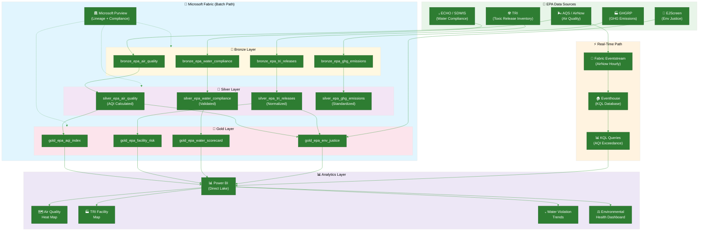

# 🌿 Tutorial 35: EPA Environmental Analytics

<div align="center" markdown>


</div>

> 🏠 **[Home](https://github.com/fgarofalo56/Suppercharge_Microsoft_Fabric/blob/main/README.md)** > 📖 **[Tutorials](../index.md)** > 🌿 **EPA Environmental Analytics**

---

## 🌿 Tutorial 35: EPA Environmental Analytics

| | |
|---|---|
| **Difficulty** | ⭐⭐⭐⭐ Advanced |
| **Time** | ⏱️ 120-150 minutes |
| **Focus** | EPA Air Quality Monitoring, Toxic Release Inventory, Water Compliance, Environmental Justice Analysis & Real-Time AQI Tracking |

---

### 📊 Progress Tracker

```
┌──────┬──────┬──────┬──────┬──────┬──────┬──────┬──────┬──────┬──────┬──────┬──────┬──────┬──────┐
│  00  │  01  │  02  │  03  │  04  │  05  │  06  │  07  │  08  │  09  │  10  │  11  │  12  │  13  │
│SETUP │BRNZE │SILVR │ GOLD │  RT  │ PBI  │PIPES │ GOV  │MIRRR │AI/ML │TDATA │ SAS  │CICD  │MIGR  │
├──────┼──────┼──────┼──────┼──────┼──────┼──────┼──────┼──────┼──────┼──────┼──────┼──────┼──────┤
│  ✅  │  ✅  │  ✅  │  ✅  │  ✅  │  ✅  │  ✅  │  ✅  │  ✅  │  ✅  │  ✅  │  ✅  │  ✅  │  ✅  │
└──────┴──────┴──────┴──────┴──────┴──────┴──────┴──────┴──────┴──────┴──────┴──────┴──────┴──────┘

┌──────┬──────┬──────┬──────┬──────┬──────┬──────┬──────┬──────┬──────┬──────┬──────┬──────┬──────┬──────┬──────┬──────┬──────┐
│  14  │  15  │  16  │  17  │  18  │  19  │  20  │  21  │  22  │  23  │  24  │  25  │  26  │  27  │  28  │  29  │  30  │  31  │
│ SEC  │ COST │PERF  │ MON  │SHARE │COPLT │WKBST │ GEO  │ NET  │SHIR  │ SNW  │ DB2  │MULTI │VIDEO │ MOVE │GEOLC │TRIBL │ DOT  │
├──────┼──────┼──────┼──────┼──────┼──────┼──────┼──────┼──────┼──────┼──────┼──────┼──────┼──────┼──────┼──────┼──────┼──────┤
│  ✅  │  ✅  │  ✅  │  ✅  │  ✅  │  ✅  │  ✅  │  ✅  │  ✅  │  ✅  │  ✅  │  ✅  │  ✅  │  ✅  │  ✅  │  ✅  │  ✅  │  ✅  │
└──────┴──────┴──────┴──────┴──────┴──────┴──────┴──────┴──────┴──────┴──────┴──────┴──────┴──────┴──────┴──────┴──────┴──────┘

┌──────┬──────┬──────┬──────┬──────┐
│  32  │  33  │  34  │  35  │  36  │
│ USDA │ SBA  │ NOAA │ EPA  │ DOI  │
├──────┼──────┼──────┼──────┼──────┤
│  ✅  │  ✅  │  ✅  │  🔵  │  ○   │
└──────┴──────┴──────┴──────┴──────┘
                       ▲
                YOU ARE HERE
```

| Navigation | |
|---|---|
| ⬅️ **Previous** | [34-NOAA Weather & Climate Analytics](../34-noaa-weather-climate/README.md) |
| ➡️ **Next** | [36-DOI Natural Resources Analytics](../36-doi-interior/README.md) |

---

## 📖 Overview

The U.S. Environmental Protection Agency (EPA) is charged with protecting human health and the environment through regulation, enforcement, and scientific research. The EPA collects and publishes some of the most consequential environmental data in the world: air quality measurements from over 4,000 monitoring stations, toxic chemical releases from 21,000+ industrial facilities, drinking water safety records for 150,000+ public water systems, and greenhouse gas emissions from major sources.

This tutorial teaches you to build an **environmental analytics pipeline** in Microsoft Fabric that ingests EPA data across four major domains -- air quality, toxic releases, water compliance, and greenhouse gas emissions -- and produces dashboards revealing pollution patterns, facility risk profiles, environmental compliance trends, and environmental justice indicators. The pipeline includes a **real-time AQI monitoring** component using Fabric Eventhouse and KQL for live air quality tracking.

What distinguishes this tutorial from standard environmental analytics is the **environmental justice angle**: correlating pollution burden with demographic data to identify communities that bear disproportionate environmental risk. This analysis is central to the EPA's current strategic priorities and represents a genuinely advanced analytical pattern.

> **💡 Why EPA Analytics on Fabric?**
>
> - **Multi-domain integration**: Air, water, toxic releases, and GHG data originate from different EPA offices and systems -- Fabric unifies them in a single governed lakehouse
> - **Real-time + historical**: EPA's AirNow API provides hourly AQI readings that can feed Eventhouse for real-time monitoring alongside decades of historical ambient air data
> - **Environmental justice**: Correlating EPA facility data with Census demographics requires cross-domain joins that Fabric's lakehouse architecture handles natively
> - **Regulatory compliance**: EPA data powers compliance reporting, permit tracking, and enforcement case analysis -- all requiring auditable data lineage via Purview
> - **Geospatial richness**: Every EPA data point is geo-referenced, enabling powerful map-based visualizations of pollution patterns

> **📋 EPA Data Access**
>
> All EPA data in this tutorial is publicly available. The AQS API requires a free registration at [aqs.epa.gov](https://aqs.epa.gov/aqsweb/documents/data_api.html). TRI, ECHO, and GHGRP data are bulk-downloadable from [epa.gov/enviro](https://www.epa.gov/enviro) and the EPA's Envirofacts API. No authentication is required for bulk downloads.

---

## 🎯 Learning Objectives

By the end of this tutorial, you will be able to:

- [ ] Configure EPA data sources across air quality (AQS), toxic releases (TRI), water compliance (ECHO/SDWIS), and GHG emissions (GHGRP)
- [ ] Ingest multi-domain environmental records into Bronze Delta tables with EPA registry identifiers and monitoring metadata
- [ ] Standardize pollutant concentrations, unit-normalize measurements, and validate against EPA regulatory thresholds in Silver
- [ ] Build Gold layer AQI calculations, facility risk profiles, water compliance scorecards, and environmental justice indicators
- [ ] Implement real-time AQI monitoring using Fabric Eventhouse with KQL queries for exceedance detection
- [ ] Create Power BI dashboards with air quality heat maps, TRI facility maps, water violation trends, and environmental health dashboards
- [ ] Calculate environmental justice indices by correlating pollution data with Census demographic indicators
- [ ] Apply data quality checks for environmental monitoring data (detection limits, method codes, completeness)
- [ ] Configure EPA data standards and environmental compliance reporting governance in Microsoft Purview
- [ ] Design alerting for regulatory threshold exceedances using Fabric Activator

---

## 🏗️ Architecture Diagram



| Component | Technology | Purpose |
|-----------|-----------|---------|
| **EPA Data Sources** | AQS, TRI, ECHO/SDWIS, GHGRP, EJScreen | Multi-domain environmental data across air, water, chemicals, and emissions |
| **Real-Time Path** | Eventstream + Eventhouse + KQL | Live AQI monitoring with regulatory exceedance detection and alerting |
| **Bronze** | Delta Lake (append-only) | Raw monitoring records, release reports, compliance data with EPA registry IDs |
| **Silver** | Delta Lake (validated) | AQI-calculated air data, unit-normalized releases, validated compliance records |
| **Gold** | Delta Lake (aggregated) | AQI index tables, facility risk profiles, water scorecards, environmental justice metrics |
| **Purview** | Microsoft Purview | Data lineage, EPA data standards compliance, regulatory reporting governance |
| **Power BI** | Direct Lake + KQL | Air quality heat maps, TRI facility maps, water violation trends, environmental health dashboards |

---

## 📋 Prerequisites

Before starting this tutorial, ensure you have:

- [ ] Completed [Tutorial 00: Environment Setup](../00-environment-setup/README.md)
- [ ] Completed [Tutorial 01: Bronze Layer](../01-bronze-layer/README.md)
- [ ] Completed [Tutorial 02: Silver Layer](../02-silver-layer/README.md)
- [ ] Completed [Tutorial 03: Gold Layer](../03-gold-layer/README.md)
- [ ] Completed [Tutorial 04: Real-Time Analytics](../04-real-time-analytics/README.md) (for Eventhouse components)
- [ ] Completed [Tutorial 05: Direct Lake & Power BI](../05-direct-lake-powerbi/README.md)
- [ ] Completed [Tutorial 07: Governance & Purview](../07-governance-purview/README.md)
- [ ] Fabric workspace with F64 capacity (or F2+ for development/testing)
- [ ] EPA AQS API credentials (free registration at [aqs.epa.gov](https://aqs.epa.gov/aqsweb/documents/data_api.html))
- [ ] Familiarity with PySpark, Delta Lake, KQL, and DAX patterns from prior tutorials

> **📋 Data Source Options**
>
> This tutorial supports two data ingestion paths:
> 1. **Synthetic Generator** (recommended for learning): Use [`epa_generator.py`](https://github.com/fgarofalo56/Suppercharge_Microsoft_Fabric/blob/main/data_generation/generators/federal/epa_generator.py) to generate realistic EPA environmental data locally
> 2. **EPA APIs + Bulk Downloads**: Connect to real EPA data from AQS, Envirofacts, TRI, and ECHO for production analytics
>
> Both paths converge at the same Bronze schema.

---

## 🛠️ Step 1: Data Source Setup

EPA operates dozens of environmental data systems. This tutorial integrates the five most analytically significant sources.

### 1.1 EPA Data Systems Overview

| System | Full Name | Data Domain | Volume | Access |
|--------|----------|-------------|--------|--------|
| **AQS** | Air Quality System | Ambient air monitoring (PM2.5, O3, NO2, SO2, CO) | 800M+ hourly records | REST API (registered) |
| **TRI** | Toxic Release Inventory | Chemical releases from industrial facilities | 6M+ release records (1987-present) | Bulk CSV download |
| **ECHO** | Enforcement & Compliance History Online | Facility inspections, violations, enforcement | 800K+ facilities | REST API + bulk |
| **SDWIS** | Safe Drinking Water Info System | Public water system compliance | 150K+ water systems | Bulk download |
| **GHGRP** | Greenhouse Gas Reporting Program | Large-source GHG emissions | 8K+ facilities, 3B+ tons CO2e | Bulk download |
| **EJScreen** | Environmental Justice Screening Tool | Demographic + environmental indicators | Census tract level | Bulk download |

### 1.2 Option A: Synthetic Data Generator

```python
# Generate synthetic EPA environmental data for development
import sys
sys.path.append("../../data_generation")

from generators.federal.epa_generator import EPAGenerator

generator = EPAGenerator(
    output_path="/lakehouse/default/Files/raw/epa/",
    num_air_quality_records=100000,    # 100K air quality observations
    num_tri_records=10000,             # 10K toxic release records
    num_water_records=20000,           # 20K water compliance records
    num_ghg_records=5000,              # 5K GHG emission records
    date_range=("2018-01-01", "2024-12-31"),
    seed=42
)

datasets = generator.generate_batch()
for name, df in datasets.items():
    print(f"Generated {name}: {df.count():,} records")
```

### 1.3 Option B: EPA APIs and Bulk Downloads

```python
# Connect to real EPA data sources
import requests

# 1. AQS API - Air Quality Data
AQS_EMAIL = "your.email@example.com"
AQS_KEY = "your_aqs_key"

def fetch_aqs_data(state_code: str, county_code: str, param: str,
                   begin_date: str, end_date: str) -> dict:
    """Fetch air quality data from EPA AQS API."""
    url = "https://aqs.epa.gov/data/api/dailyData/byCounty"
    params = {
        "email": AQS_EMAIL, "key": AQS_KEY,
        "param": param,          # 88101=PM2.5, 44201=Ozone
        "bdate": begin_date, "edate": end_date,
        "state": state_code, "county": county_code,
    }
    response = requests.get(url, params=params)
    return response.json()

# 2. TRI Bulk Download
TRI_URL = "https://enviro.epa.gov/triexplorer/release_fac?triession=TRIQQM5"
# Also: https://www.epa.gov/toxics-release-inventory-tri-program/tri-basic-data-files-calendar-years-1987-present

# 3. ECHO API - Compliance Data
def fetch_echo_facilities(state: str, program: str = "ALL") -> dict:
    """Fetch facility compliance data from ECHO."""
    url = "https://echo.epa.gov/cgi-bin/get_facilities"
    params = {
        "output": "JSON",
        "p_st": state,
        "p_med": program,
    }
    response = requests.get(url, params=params)
    return response.json()

# Example: Fetch PM2.5 data for Los Angeles County
aqs_data = fetch_aqs_data("06", "037", "88101", "20240101", "20240131")
print(f"AQS records: {len(aqs_data.get('Data', []))}")
```

### 1.4 EPA Data Policies

| Policy | Requirement |
|--------|-------------|
| **Public data** | All EPA environmental monitoring data is publicly available under FOIA |
| **AQS registration** | AQS API requires free email/key registration; no cost or approval needed |
| **TRI self-reported** | TRI data is self-reported by facilities; EPA verifies but does not guarantee accuracy |
| **Attribution** | Credit "U.S. Environmental Protection Agency" in publications |
| **Regulatory context** | EPA data is used for regulatory enforcement; handle with appropriate care |
| **EJScreen disclaimer** | EJScreen is a screening tool, not a basis for regulatory decisions; note this in dashboards |

---

## 🛠️ Step 2: Bronze Layer Ingestion

The Bronze layer captures raw environmental monitoring data from all four EPA domains with facility registry identifiers and measurement metadata.

> **📓 Notebook Reference**: [`notebooks/bronze/15_bronze_epa.py`](https://github.com/fgarofalo56/Suppercharge_Microsoft_Fabric/blob/main/notebooks/bronze/15_bronze_epa.py) *(coming soon)*

### 2.1 Air Quality Schema

```python
# Schema for EPA air quality monitoring data (matches epa_air_quality_schema.json)
from pyspark.sql.types import *

air_quality_schema = StructType([
    StructField("monitor_id", StringType(), False),            # AQS site ID (state-county-site)
    StructField("site_name", StringType(), True),
    StructField("measurement_date", DateType(), False),
    StructField("measurement_time", StringType(), True),       # HH:MM local time
    StructField("parameter_code", StringType(), True),         # EPA AQS parameter code
    StructField("parameter_name", StringType(), True),         # PM2.5, Ozone, NO2, SO2, CO
    StructField("sample_duration", StringType(), True),        # 1 HOUR, 24 HOUR, etc.
    StructField("concentration", DoubleType(), True),          # Measured value
    StructField("units_of_measure", StringType(), True),       # ug/m3, ppb, ppm
    StructField("aqi_value", IntegerType(), True),             # AQI (0-500)
    StructField("aqi_category", StringType(), True),           # Good, Moderate, Unhealthy, etc.

    # Geography
    StructField("state_code", StringType(), True),
    StructField("county_code", StringType(), True),
    StructField("county_name", StringType(), True),
    StructField("latitude", DoubleType(), True),
    StructField("longitude", DoubleType(), True),
    StructField("cbsa_code", StringType(), True),              # Core-Based Statistical Area
    StructField("cbsa_name", StringType(), True),

    # Quality
    StructField("method_code", StringType(), True),            # Measurement method
    StructField("data_validity", StringType(), True),          # Valid, Suspect, Excluded
    StructField("exceptional_event", StringType(), True),      # Wildfire, dust storm, etc.
])

print(f"Air quality schema: {len(air_quality_schema.fields)} fields")
```

### 2.2 Toxic Release Inventory Schema

```python
# Schema for EPA TRI (Toxic Release Inventory)
tri_release_schema = StructType([
    StructField("tri_facility_id", StringType(), False),       # EPA TRI facility ID
    StructField("facility_name", StringType(), True),
    StructField("reporting_year", IntegerType(), True),
    StructField("chemical_name", StringType(), True),
    StructField("cas_number", StringType(), True),             # CAS Registry Number
    StructField("clean_air_act_chemical", BooleanType(), True),
    StructField("carcinogen", BooleanType(), True),

    # Release quantities (pounds)
    StructField("total_releases_lbs", DoubleType(), True),
    StructField("fugitive_air_lbs", DoubleType(), True),       # Air - non-point
    StructField("stack_air_lbs", DoubleType(), True),          # Air - stack/point
    StructField("water_releases_lbs", DoubleType(), True),
    StructField("land_releases_lbs", DoubleType(), True),
    StructField("underground_injection_lbs", DoubleType(), True),
    StructField("offsite_transfers_lbs", DoubleType(), True),

    # Facility details
    StructField("industry_sector", StringType(), True),
    StructField("naics_code", StringType(), True),
    StructField("street_address", StringType(), True),
    StructField("city", StringType(), True),
    StructField("state", StringType(), True),
    StructField("zip_code", StringType(), True),
    StructField("county", StringType(), True),
    StructField("latitude", DoubleType(), True),
    StructField("longitude", DoubleType(), True),
    StructField("federal_facility", BooleanType(), True),
])

print(f"TRI schema: {len(tri_release_schema.fields)} fields")
```

### 2.3 Water Compliance Schema

```python
# Schema for EPA water compliance (ECHO/SDWIS)
water_compliance_schema = StructType([
    StructField("pwsid", StringType(), False),                 # Public Water System ID
    StructField("pws_name", StringType(), True),
    StructField("violation_id", StringType(), True),
    StructField("violation_type", StringType(), True),         # MCL, TT, Monitoring, etc.
    StructField("contaminant_code", StringType(), True),
    StructField("contaminant_name", StringType(), True),
    StructField("compliance_period_begin", DateType(), True),
    StructField("compliance_period_end", DateType(), True),
    StructField("is_health_based", BooleanType(), True),       # Health-based violation
    StructField("enforcement_action", StringType(), True),

    # Water system details
    StructField("pws_type", StringType(), True),               # Community, NTNC, TNC
    StructField("population_served", IntegerType(), True),
    StructField("source_type", StringType(), True),            # Ground Water, Surface Water
    StructField("state_code", StringType(), True),
    StructField("county", StringType(), True),
    StructField("city_served", StringType(), True),
    StructField("epa_region", StringType(), True),
])

print(f"Water compliance schema: {len(water_compliance_schema.fields)} fields")
```

### 2.4 Bronze Ingestion

```python
# Multi-domain EPA Bronze ingestion
from pyspark.sql.functions import *
from datetime import datetime
from uuid import uuid4

BATCH_ID = f"epa-batch-{datetime.utcnow().strftime('%Y%m%d-%H%M%S')}"
RUN_ID = str(uuid4())

source_path = "/lakehouse/default/Files/raw/epa/"

def add_bronze_metadata(df):
    return df \
        .withColumn("_ingested_at", current_timestamp()) \
        .withColumn("_source_file", input_file_name()) \
        .withColumn("_batch_id", lit(BATCH_ID)) \
        .withColumn("_run_id", lit(RUN_ID)) \
        .withColumn("_load_date", current_timestamp().cast("date"))

# Air quality
df_air = spark.read.schema(air_quality_schema).parquet(f"{source_path}air_quality/")
df_air_bronze = add_bronze_metadata(df_air)
df_air_bronze.write.format("delta").mode("append") \
    .partitionBy("state_code", "_load_date") \
    .saveAsTable("lh_bronze.bronze_epa_air_quality")

# TRI
df_tri = spark.read.schema(tri_release_schema).parquet(f"{source_path}tri/")
df_tri_bronze = add_bronze_metadata(df_tri)
df_tri_bronze.write.format("delta").mode("append") \
    .partitionBy("reporting_year") \
    .saveAsTable("lh_bronze.bronze_epa_tri_releases")

# Water compliance
df_water = spark.read.schema(water_compliance_schema).parquet(f"{source_path}water/")
df_water_bronze = add_bronze_metadata(df_water)
df_water_bronze.write.format("delta").mode("append") \
    .partitionBy("state_code") \
    .saveAsTable("lh_bronze.bronze_epa_water_compliance")

print(f"Bronze air quality: {df_air_bronze.count():,}")
print(f"Bronze TRI releases: {df_tri_bronze.count():,}")
print(f"Bronze water compliance: {df_water_bronze.count():,}")
```

---

## 🛠️ Step 3: Silver Layer -- Normalization & AQI Calculation

The Silver layer standardizes pollutant concentrations, calculates the Air Quality Index (AQI) from raw measurements, normalizes TRI release quantities, and validates water compliance records against regulatory thresholds.

> **📓 Notebook Reference**: [`notebooks/silver/15_silver_epa.py`](https://github.com/fgarofalo56/Suppercharge_Microsoft_Fabric/blob/main/notebooks/silver/15_silver_epa.py) *(coming soon)*

### 3.1 AQI Calculation from Raw Concentrations

The EPA Air Quality Index converts pollutant concentrations to a standardized 0-500 scale using breakpoint tables defined in 40 CFR Part 58.

```python
# EPA AQI breakpoint calculation
# Reference: https://www.airnow.gov/aqi/aqi-basics/

AQI_BREAKPOINTS = {
    "PM2.5": [  # 24-hour average (ug/m3)
        (0.0, 12.0, 0, 50),          # Good
        (12.1, 35.4, 51, 100),       # Moderate
        (35.5, 55.4, 101, 150),      # Unhealthy for Sensitive Groups
        (55.5, 150.4, 151, 200),     # Unhealthy
        (150.5, 250.4, 201, 300),    # Very Unhealthy
        (250.5, 500.4, 301, 500),    # Hazardous
    ],
    "OZONE": [  # 8-hour average (ppm)
        (0.000, 0.054, 0, 50),
        (0.055, 0.070, 51, 100),
        (0.071, 0.085, 101, 150),
        (0.086, 0.105, 151, 200),
        (0.106, 0.200, 201, 300),
    ],
    "NO2": [  # 1-hour average (ppb)
        (0, 53, 0, 50),
        (54, 100, 51, 100),
        (101, 360, 101, 150),
        (361, 649, 151, 200),
        (650, 1249, 201, 300),
        (1250, 2049, 301, 500),
    ],
}

def calculate_aqi(concentration, breakpoints):
    """Calculate AQI from concentration using EPA breakpoint formula."""
    for c_lo, c_hi, i_lo, i_hi in breakpoints:
        if c_lo <= concentration <= c_hi:
            aqi = ((i_hi - i_lo) / (c_hi - c_lo)) * (concentration - c_lo) + i_lo
            return round(aqi)
    return None  # Out of range

# Apply AQI calculation as UDF
from pyspark.sql.functions import udf
from pyspark.sql.types import IntegerType

@udf(IntegerType())
def aqi_udf(concentration, parameter):
    if concentration is None or parameter is None:
        return None
    bp = AQI_BREAKPOINTS.get(parameter.upper())
    if bp is None:
        return None
    return calculate_aqi(concentration, bp)

df_air_silver = df_air_bronze \
    .withColumn("aqi_calculated", aqi_udf(col("concentration"), col("parameter_name"))) \
    .withColumn("aqi_category_calculated",
        when(col("aqi_calculated") <= 50, lit("Good"))
        .when(col("aqi_calculated") <= 100, lit("Moderate"))
        .when(col("aqi_calculated") <= 150, lit("Unhealthy for Sensitive Groups"))
        .when(col("aqi_calculated") <= 200, lit("Unhealthy"))
        .when(col("aqi_calculated") <= 300, lit("Very Unhealthy"))
        .when(col("aqi_calculated") > 300, lit("Hazardous"))
        .otherwise(lit("Unknown"))
    )
```

### 3.2 TRI Release Normalization

```python
# Normalize TRI release quantities and classify chemicals
df_tri_silver = df_tri_bronze \
    .withColumn("total_air_releases_lbs",
        coalesce(col("fugitive_air_lbs"), lit(0)) + coalesce(col("stack_air_lbs"), lit(0))
    ) \
    .withColumn("total_onsite_releases_lbs",
        coalesce(col("total_air_releases_lbs"), lit(0)) +
        coalesce(col("water_releases_lbs"), lit(0)) +
        coalesce(col("land_releases_lbs"), lit(0))
    ) \
    .withColumn("total_releases_tons", round(col("total_releases_lbs") / 2000, 2)) \
    .withColumn("state_std", upper(trim(col("state")))) \
    .withColumn("release_tier",
        when(col("total_releases_lbs") >= 1000000, lit("Major (>1M lbs)"))
        .when(col("total_releases_lbs") >= 100000, lit("Large (100K-1M lbs)"))
        .when(col("total_releases_lbs") >= 10000, lit("Medium (10K-100K lbs)"))
        .when(col("total_releases_lbs") >= 1000, lit("Small (1K-10K lbs)"))
        .otherwise(lit("Minor (<1K lbs)"))
    ) \
    .withColumn("chemical_category",
        when(col("carcinogen") == True, lit("Carcinogen"))
        .when(col("clean_air_act_chemical") == True, lit("Clean Air Act"))
        .otherwise(lit("Other Toxic"))
    )

# Deduplication
df_tri_deduped = df_tri_silver.dropDuplicates(["tri_facility_id", "reporting_year", "chemical_name"])
```

### 3.3 Water Compliance Validation

```python
# Validate and enrich water compliance records
df_water_silver = df_water_bronze \
    .withColumn("state_std", upper(trim(col("state_code")))) \
    .withColumn("violation_severity",
        when(col("is_health_based") == True, lit("Health-Based"))
        .when(col("violation_type").isin("MCL", "TT"), lit("Regulatory"))
        .when(col("violation_type") == "Monitoring", lit("Monitoring"))
        .otherwise(lit("Administrative"))
    ) \
    .withColumn("population_impact_tier",
        when(col("population_served") >= 100000, lit("Large System (100K+)"))
        .when(col("population_served") >= 10000, lit("Medium System (10K-100K)"))
        .when(col("population_served") >= 1000, lit("Small System (1K-10K)"))
        .otherwise(lit("Very Small (<1K)"))
    ) \
    .withColumn("violation_duration_days",
        when(col("compliance_period_end").isNotNull(),
            datediff(col("compliance_period_end"), col("compliance_period_begin"))
        ).otherwise(lit(None))
    )

# Deduplication
df_water_deduped = df_water_silver.dropDuplicates(["violation_id"])
```

### 3.4 Data Quality and Write Silver

```python
# Air quality DQ scoring
df_air_silver = df_air_silver \
    .withColumn("_dq_score",
        when(col("monitor_id").isNotNull(), lit(15)).otherwise(lit(0)) +
        when(col("measurement_date").isNotNull(), lit(15)).otherwise(lit(0)) +
        when(col("concentration").isNotNull() & (col("concentration") >= 0), lit(15)).otherwise(lit(0)) +
        when(col("aqi_calculated").isNotNull(), lit(15)).otherwise(lit(0)) +
        when(col("parameter_name").isNotNull(), lit(10)).otherwise(lit(0)) +
        when(col("data_validity") == "Valid", lit(10)).otherwise(lit(0)) +
        when(col("latitude").isNotNull() & col("longitude").isNotNull(), lit(10)).otherwise(lit(0)) +
        when(col("state_code").isNotNull(), lit(5)).otherwise(lit(0)) +
        when(col("method_code").isNotNull(), lit(5)).otherwise(lit(0))
    ) \
    .withColumn("_silver_timestamp", current_timestamp())

# Write Silver tables
df_air_silver.write.format("delta").mode("overwrite") \
    .option("overwriteSchema", "true") \
    .partitionBy("state_code") \
    .saveAsTable("lh_silver.silver_epa_air_quality")

df_tri_deduped.write.format("delta").mode("overwrite") \
    .option("overwriteSchema", "true") \
    .partitionBy("reporting_year") \
    .saveAsTable("lh_silver.silver_epa_tri_releases")

df_water_deduped.write.format("delta").mode("overwrite") \
    .option("overwriteSchema", "true") \
    .partitionBy("state_std") \
    .saveAsTable("lh_silver.silver_epa_water_compliance")

spark.sql("OPTIMIZE lh_silver.silver_epa_air_quality ZORDER BY (monitor_id, measurement_date)")
spark.sql("OPTIMIZE lh_silver.silver_epa_tri_releases ZORDER BY (state_std, chemical_name)")
spark.sql("OPTIMIZE lh_silver.silver_epa_water_compliance ZORDER BY (state_std, violation_severity)")

print(f"Silver air quality: {df_air_silver.count():,}")
print(f"Silver TRI releases: {df_tri_deduped.count():,}")
print(f"Silver water compliance: {df_water_deduped.count():,}")
```

---

## 🛠️ Step 4: Real-Time AQI Monitoring

Fabric Eventhouse enables continuous monitoring of air quality with threshold-based alerting for regulatory exceedances.

### 4.1 Eventstream Configuration for AirNow

```python
# Eventstream ingestion: AirNow API -> Eventhouse for real-time AQI
import json
import requests
import time
from datetime import datetime

AIRNOW_API_KEY = os.environ.get("AIRNOW_API_KEY", "YOUR_KEY_HERE")

# Monitor AQI for major metro areas
MONITORED_ZIPS = [
    "10001", "90001", "60601", "77001", "85001",
    "30301", "80201", "94101", "33101", "98101",
]

def fetch_current_aqi(zip_code: str) -> list:
    """Fetch current AQI from AirNow for a ZIP code."""
    url = "https://www.airnowapi.org/aq/observation/zipCode/current/"
    params = {
        "format": "application/json",
        "zipCode": zip_code,
        "distance": 25,
        "API_KEY": AIRNOW_API_KEY,
    }
    response = requests.get(url, params=params, timeout=10)
    return response.json() if response.status_code == 200 else []

# Polling loop for Eventstream
while True:
    for zip_code in MONITORED_ZIPS:
        observations = fetch_current_aqi(zip_code)
        for obs in observations:
            event = {
                "zip_code": zip_code,
                "parameter": obs.get("ParameterName"),
                "aqi": obs.get("AQI"),
                "category": obs.get("Category", {}).get("Name"),
                "reporting_area": obs.get("ReportingArea"),
                "state": obs.get("StateCode"),
                "latitude": obs.get("Latitude"),
                "longitude": obs.get("Longitude"),
                "event_time": datetime.utcnow().isoformat(),
            }
            emit_event(json.dumps(event))
    time.sleep(3600)  # Hourly polling (AirNow updates hourly)
```

### 4.2 KQL Queries for AQI Monitoring

```kql
// Real-time AQI monitoring queries in Eventhouse

// 1. Current AQI by monitoring area
epa_aqi_stream
| summarize arg_max(event_time, *) by reporting_area, parameter
| project reporting_area, state, parameter, aqi, category
| order by aqi desc

// 2. AQI exceedance detection (above 100 = Unhealthy for Sensitive Groups)
epa_aqi_stream
| where event_time > ago(6h)
| where aqi > 100
| project event_time, reporting_area, state, parameter, aqi, category
| order by aqi desc

// 3. Hazardous air quality alerts (AQI > 300)
epa_aqi_stream
| where event_time > ago(24h)
| where aqi > 300
| summarize alert_count = count(), max_aqi = max(aqi),
            first_alert = min(event_time), last_alert = max(event_time)
  by reporting_area, state, parameter
| order by max_aqi desc

// 4. AQI trend over past 24 hours
epa_aqi_stream
| where event_time > ago(24h)
| where parameter == "PM2.5"
| summarize avg_aqi = avg(aqi) by bin(event_time, 1h), reporting_area
| order by event_time asc
| render timechart
```

---

## 🛠️ Step 5: Gold Layer -- Environmental Analytics

The Gold layer builds decision-ready aggregations: AQI indices by geography, facility risk profiles, water compliance scorecards, and environmental justice indicators.

> **📓 Notebook Reference**: [`notebooks/gold/15_gold_epa_analytics.py`](https://github.com/fgarofalo56/Suppercharge_Microsoft_Fabric/blob/main/notebooks/gold/15_gold_epa_analytics.py) *(coming soon)*

### 5.1 AQI Index by Geography

```python
# AQI summary by state and monitoring site
df_aqi_index = df_air_silver \
    .filter(col("data_validity") == "Valid") \
    .groupBy("state_code", "county_name", "cbsa_name", "parameter_name") \
    .agg(
        avg("aqi_calculated").alias("avg_aqi"),
        max("aqi_calculated").alias("max_aqi"),
        min("aqi_calculated").alias("min_aqi"),
        percentile_approx("aqi_calculated", 0.95).alias("p95_aqi"),
        count("*").alias("observation_count"),

        # Days in each AQI category
        sum(when(col("aqi_category_calculated") == "Good", 1).otherwise(0)).alias("days_good"),
        sum(when(col("aqi_category_calculated") == "Moderate", 1).otherwise(0)).alias("days_moderate"),
        sum(when(col("aqi_category_calculated").contains("Unhealthy"), 1).otherwise(0)).alias("days_unhealthy"),
        sum(when(col("aqi_category_calculated") == "Hazardous", 1).otherwise(0)).alias("days_hazardous"),

        # Exceptional events
        sum(when(col("exceptional_event").isNotNull(), 1).otherwise(0)).alias("exceptional_event_days"),
    ) \
    .withColumn("unhealthy_pct",
        round((col("days_unhealthy") + col("days_hazardous")) * 100.0 / col("observation_count"), 2)
    )

df_aqi_index.write.format("delta").mode("overwrite") \
    .saveAsTable("lh_gold.gold_epa_aqi_index")
```

### 5.2 Facility Risk Profiles (TRI)

```python
# TRI facility risk profiles
df_facility_risk = df_tri_deduped \
    .groupBy("tri_facility_id", "facility_name", "state_std", "county",
             "industry_sector", "latitude", "longitude") \
    .agg(
        count("*").alias("reporting_years"),
        sum("total_releases_lbs").alias("lifetime_releases_lbs"),
        sum("total_air_releases_lbs").alias("lifetime_air_releases_lbs"),
        sum("water_releases_lbs").alias("lifetime_water_releases_lbs"),
        avg("total_releases_lbs").alias("avg_annual_releases_lbs"),
        countDistinct("chemical_name").alias("distinct_chemicals"),
        sum(when(col("carcinogen") == True, col("total_releases_lbs")).otherwise(0))
            .alias("carcinogen_releases_lbs"),
        max("reporting_year").alias("most_recent_report"),
    ) \
    .withColumn("risk_tier",
        when(col("carcinogen_releases_lbs") > 100000, lit("Critical"))
        .when(col("lifetime_releases_lbs") > 1000000, lit("High"))
        .when(col("lifetime_releases_lbs") > 100000, lit("Elevated"))
        .when(col("lifetime_releases_lbs") > 10000, lit("Moderate"))
        .otherwise(lit("Low"))
    )

df_facility_risk.write.format("delta").mode("overwrite") \
    .saveAsTable("lh_gold.gold_epa_facility_risk")

spark.sql("OPTIMIZE lh_gold.gold_epa_facility_risk ZORDER BY (state_std, risk_tier)")
```

### 5.3 Water Compliance Scorecards

```python
# Water system compliance scorecards
df_water_scorecard = df_water_deduped \
    .groupBy("state_std", "population_impact_tier") \
    .agg(
        countDistinct("pwsid").alias("total_systems"),
        count("*").alias("total_violations"),
        sum(when(col("is_health_based") == True, 1).otherwise(0)).alias("health_violations"),
        sum(when(col("violation_type") == "MCL", 1).otherwise(0)).alias("mcl_violations"),
        sum(when(col("violation_type") == "Monitoring", 1).otherwise(0)).alias("monitoring_violations"),
        sum(when(col("enforcement_action").isNotNull(), 1).otherwise(0)).alias("enforcement_actions"),
        sum("population_served").alias("total_population_affected"),
        avg("violation_duration_days").alias("avg_violation_duration_days"),
    ) \
    .withColumn("violations_per_system",
        round(col("total_violations") * 1.0 / col("total_systems"), 2)
    ) \
    .withColumn("health_violation_rate",
        round(col("health_violations") * 100.0 / col("total_violations"), 2)
    )

df_water_scorecard.write.format("delta").mode("overwrite") \
    .saveAsTable("lh_gold.gold_epa_water_scorecard")
```

### 5.4 Environmental Justice Indicators

```python
# Environmental justice: correlate pollution burden with demographics
# Uses EPA EJScreen methodology conceptually (actual EJScreen data would be joined here)

df_ej = df_tri_deduped \
    .groupBy("state_std", "county") \
    .agg(
        count("*").alias("tri_facilities"),
        sum("total_releases_lbs").alias("total_releases_lbs"),
        sum("carcinogen_releases_lbs").alias("carcinogen_releases_lbs"),
    )

# Join with AQI data for multi-domain environmental burden
df_aqi_county = df_air_silver \
    .groupBy("state_code", "county_name") \
    .agg(
        avg("aqi_calculated").alias("avg_aqi"),
        sum(when(col("aqi_category_calculated").contains("Unhealthy"), 1).otherwise(0))
            .alias("unhealthy_air_days"),
    )

df_water_county = df_water_deduped \
    .groupBy("state_std", "county") \
    .agg(
        sum(when(col("is_health_based") == True, 1).otherwise(0)).alias("health_water_violations"),
        sum("population_served").alias("affected_population"),
    )

# Composite environmental burden score
df_env_justice = df_ej \
    .join(df_aqi_county, (df_ej.state_std == df_aqi_county.state_code) &
          (df_ej.county == df_aqi_county.county_name), "left") \
    .join(df_water_county, ["state_std", "county"], "left") \
    .fillna(0) \
    .withColumn("env_burden_index",
        round(
            (col("tri_facilities") * 20 +
             coalesce(col("unhealthy_air_days"), lit(0)) * 30 +
             coalesce(col("health_water_violations"), lit(0)) * 25 +
             when(col("carcinogen_releases_lbs") > 0, lit(25)).otherwise(lit(0))),
            1
        )
    ) \
    .withColumn("env_burden_percentile",
        percent_rank().over(Window.orderBy(col("env_burden_index")))
    ) \
    .withColumn("ej_priority",
        when(col("env_burden_percentile") >= 0.80, lit("High Priority"))
        .when(col("env_burden_percentile") >= 0.50, lit("Moderate"))
        .otherwise(lit("Lower Burden"))
    )

df_env_justice.write.format("delta").mode("overwrite") \
    .saveAsTable("lh_gold.gold_epa_env_justice")

# Summary
for table in ["gold_epa_aqi_index", "gold_epa_facility_risk",
              "gold_epa_water_scorecard", "gold_epa_env_justice"]:
    count = spark.table(f"lh_gold.{table}").count()
    print(f"  {table}: {count:,} rows")
```

---

## 🛠️ Step 6: Power BI Dashboard

### 6.1 DAX Measures

```dax
// ===== EPA Environmental Measures =====

// Average AQI
Average AQI =
AVERAGE(gold_epa_aqi_index[avg_aqi])

// Unhealthy Air Days (%)
Unhealthy Air Days % =
DIVIDE(
    SUM(gold_epa_aqi_index[days_unhealthy]) + SUM(gold_epa_aqi_index[days_hazardous]),
    SUM(gold_epa_aqi_index[observation_count]),
    0
) * 100

// Total Toxic Releases (tons)
Total Toxic Releases Tons =
SUM(gold_epa_facility_risk[lifetime_releases_lbs]) / 2000

// Carcinogen Release Share (%)
Carcinogen Share % =
DIVIDE(
    SUM(gold_epa_facility_risk[carcinogen_releases_lbs]),
    SUM(gold_epa_facility_risk[lifetime_releases_lbs]),
    0
) * 100

// Critical Risk Facilities
Critical Risk Facilities =
CALCULATE(
    COUNTROWS(gold_epa_facility_risk),
    gold_epa_facility_risk[risk_tier] IN {"Critical", "High"}
)

// Water Health Violations
Total Health Violations =
SUM(gold_epa_water_scorecard[health_violations])

// Population Affected by Water Violations
Population Affected =
SUM(gold_epa_water_scorecard[total_population_affected])

// EJ High Priority Counties
EJ High Priority Counties =
CALCULATE(
    COUNTROWS(gold_epa_env_justice),
    gold_epa_env_justice[ej_priority] = "High Priority"
)

// AQI Trend (Year-over-Year)
AQI YoY Change =
VAR CurrentAvg = [Average AQI]
VAR PriorAvg =
    CALCULATE([Average AQI], DATEADD(gold_epa_aqi_index[measurement_date], -1, YEAR))
RETURN CurrentAvg - PriorAvg
```

### 6.2 Dashboard Layout

```
┌─────────────────────────────────────────────────────────────────────────────┐
│  🌿 EPA ENVIRONMENTAL ANALYTICS DASHBOARD                                   │
│  State: [Slicer] │ Pollutant: [Slicer] │ Year: [Slicer] │ Domain: [Slic] │
├───────────────────┬──────────────────┬──────────────────┬──────────────────┤
│  🌬️ Average AQI  │  ☢️ Toxic Release │  💧 Water Health │  ⚖️ EJ Priority │
│                   │  Facilities       │  Violations       │  Counties       │
│  42 (Good)        │  847 Critical     │  12,438           │  623            │
├───────────────────┴──────────────────┴──────────────────┴──────────────────┤
│                                                                             │
│  ┌─────────────────────────────────┐  ┌──────────────────────────────────┐ │
│  │  Air Quality Heat Map           │  │  TRI Facility Risk Map          │ │
│  │  [Filled Map: County-level AQI]│  │  [Bubble Map: Lat/Long]         │ │
│  │                                 │  │                                  │ │
│  │  Color: Average AQI             │  │  Size: Total releases           │ │
│  │  Tooltip: Days unhealthy, P95  │  │  Color: Risk tier               │ │
│  │  Drill: State -> County        │  │  Tooltip: Chemicals, carcinogens│ │
│  └─────────────────────────────────┘  └──────────────────────────────────┘ │
│                                                                             │
│  ┌─────────────────────────────────┐  ┌──────────────────────────────────┐ │
│  │  Water Violation Trends         │  │  Environmental Justice Index    │ │
│  │  [Stacked Bar: Year x Type]    │  │  [Scatter: EJ Index x Demog]   │ │
│  │                                 │  │                                  │ │
│  │  Health-Based ████ 28%         │  │  X: Environmental burden score  │ │
│  │  MCL ██████ 35%                │  │  Y: Demographic vulnerability   │ │
│  │  Monitoring ████████ 37%       │  │  Color: EJ priority             │ │
│  └─────────────────────────────────┘  └──────────────────────────────────┘ │
│                                                                             │
│  ┌──────────────────────────────────────────────────────────────────────┐  │
│  │  Environmental Health Scorecard by State                             │  │
│  │  [Matrix: State x (AQI, TRI Facilities, Water Violations, EJ Score)]│  │
│  │  [Conditional formatting: Red=bad, Green=good]                      │  │
│  └──────────────────────────────────────────────────────────────────────┘  │
└─────────────────────────────────────────────────────────────────────────────┘
```

---

## 🛠️ Step 7: Data Quality & Governance

### 7.1 Environmental Data Quality Checks

```python
# Data quality checks specific to EPA environmental data
from great_expectations.core import ExpectationSuite

epa_expectations = ExpectationSuite(expectation_suite_name="epa_env_suite")

# AQI range (0-500)
epa_expectations.add_expectation({
    "expectation_type": "expect_column_values_to_be_between",
    "kwargs": {"column": "aqi_calculated", "min_value": 0, "max_value": 500}
})

# PM2.5 concentration non-negative
epa_expectations.add_expectation({
    "expectation_type": "expect_column_values_to_be_between",
    "kwargs": {"column": "concentration", "min_value": 0, "mostly": 0.999}
})

# TRI releases non-negative
epa_expectations.add_expectation({
    "expectation_type": "expect_column_values_to_be_between",
    "kwargs": {"column": "total_releases_lbs", "min_value": 0, "mostly": 0.999}
})

# State code format
epa_expectations.add_expectation({
    "expectation_type": "expect_column_value_lengths_to_equal",
    "kwargs": {"column": "state_code", "value": 2}
})

# CAS number format (XXXXXX-XX-X pattern)
epa_expectations.add_expectation({
    "expectation_type": "expect_column_values_to_match_regex",
    "kwargs": {"column": "cas_number", "regex": r"^\d{2,7}-\d{2}-\d$", "mostly": 0.95}
})

print(f"EPA validation suite: {len(epa_expectations.expectations)} expectations")
```

### 7.2 EPA Governance Configuration

```python
# Purview configuration for EPA data
purview_config = {
    "lh_bronze.bronze_epa_air_quality": {
        "sensitivity_label": "Public - Federal Environmental Data",
        "attribution": "U.S. Environmental Protection Agency - Air Quality System (AQS)",
        "regulatory_context": "40 CFR Part 58 - Ambient Air Quality Surveillance",
        "update_frequency": "Hourly (real-time) + daily batch",
    },
    "lh_bronze.bronze_epa_tri_releases": {
        "sensitivity_label": "Public - Federal Environmental Data",
        "attribution": "U.S. EPA - Toxic Release Inventory (TRI)",
        "regulatory_context": "EPCRA Section 313 - Toxic Chemical Release Reporting",
        "note": "Self-reported by facilities; EPA-verified but not guaranteed",
    },
    "lh_gold.gold_epa_env_justice": {
        "sensitivity_label": "Internal - Derived Analytics",
        "disclaimer": "Environmental justice index is a derived composite metric, not an official EPA product",
        "methodology": "Composite of TRI proximity, AQI, water violations (EPA EJScreen-inspired)",
    },
}

for table, config in purview_config.items():
    print(f"\n{table}:")
    for key, value in config.items():
        print(f"  {key}: {value}")
```

---

## 🔧 Troubleshooting

| Symptom | Likely Cause | Solution |
|---------|-------------|----------|
| AQI calculation returns NULL | Concentration value outside breakpoint table range | Check for negative values or extreme outliers; verify parameter_name matches breakpoint keys |
| TRI facility coordinates are (0,0) | Missing or invalid lat/long in TRI submission | Filter facilities with NULL or zero coordinates; geocode from address using Azure Maps |
| AQS API returns 429 (rate limited) | Exceeding 5 requests/second or 10K/day limit | Implement exponential backoff; batch requests by county rather than individual monitors |
| Water violation counts seem too high | Counting sub-violations or multiple compliance periods | Deduplicate by violation_id; group by water system for per-system counts |
| Exceptional events skew AQI averages | Wildfire smoke, dust storms inflate readings | Filter on `exceptional_event IS NULL` for trend analysis; track exceptional days separately |
| TRI release quantities in different units | Some chemicals reported in grams, others in pounds | Check `units` field in raw TRI data; convert all to pounds in Silver |
| EJ index appears arbitrary | Composite weights need calibration | Calibrate against official EPA EJScreen percentiles; document weight rationale |
| Eventhouse data gaps | AirNow API intermittent availability | Add retry logic; track data freshness as a KQL metric |
| Power BI map shows wrong locations | Lat/long swapped or in wrong projection | Verify coordinate order; EPA data uses NAD83/WGS84 datum |
| GHG emissions data missing sectors | GHGRP only covers facilities above 25K MT CO2e/year | Document GHGRP reporting threshold; note that small emitters are excluded |

---

## 📋 Best Practices

1. **Always check data validity flags.** EPA air quality data includes `data_validity` flags (Valid, Suspect, Excluded). Filter to "Valid" observations for regulatory analysis. Include suspect data only for research or gap-filling purposes.

2. **Distinguish health-based from monitoring violations.** Water compliance data contains both health-based violations (direct risk to public health) and monitoring violations (failure to test). Always separate these in analyses -- a monitoring violation indicates a data gap, not necessarily contamination.

3. **Handle exceptional events separately.** Wildfire smoke, volcanic ash, and dust storms can drive AQI to 500+ in otherwise clean-air regions. Track exceptional events as a separate metric rather than blending them into trend analysis.

4. **Respect TRI self-reporting limitations.** TRI data is self-reported by facilities under EPCRA Section 313. The EPA verifies submissions but does not independently measure releases. Build dashboards that communicate this limitation. Year-over-year changes may reflect reporting methodology changes, not actual emission changes.

5. **Use CAS numbers as the chemical identifier.** Chemical names vary across facilities (abbreviations, trade names, etc.). The CAS Registry Number is the universal chemical identifier and should be the join key for chemical-level analysis.

6. **Calibrate environmental justice indices carefully.** Composite EJ indices are powerful but subjective. Document the weights and methodology. Compare your results against the official EPA EJScreen tool to validate reasonableness.

7. **Partition air data by state, Z-Order by monitor and date.** Air quality queries almost always filter by geography then time. This combination optimizes Direct Lake performance for map-based and trend-based visualizations.

8. **Configure Activator alerts for regulatory thresholds.** AQI > 100 triggers "Unhealthy for Sensitive Groups" -- a meaningful threshold for public health notifications. Set up Fabric Activator to alert when real-time AQI crosses this boundary.

---

## ✅ Summary

Congratulations! You have built a comprehensive EPA environmental analytics pipeline in Microsoft Fabric spanning air quality, toxic releases, water compliance, and environmental justice.

### What You Accomplished

- Configured multi-domain EPA data ingestion from AQS, TRI, ECHO/SDWIS, and GHGRP sources (synthetic and real data paths)
- Ingested environmental monitoring records into Bronze Delta tables with EPA registry identifiers and quality flags
- Calculated Air Quality Index (AQI) from raw pollutant concentrations using EPA's official breakpoint formula in Silver
- Normalized TRI toxic release quantities, classified chemical hazards, and validated water compliance records
- Implemented real-time AQI monitoring using Fabric Eventhouse with KQL exceedance detection and Activator alerting
- Built Gold layer AQI summaries, TRI facility risk profiles, water compliance scorecards, and environmental justice indicators
- Developed DAX measures for Power BI dashboards with air quality heat maps, facility risk maps, and environmental health scorecards
- Applied environmental data quality checks for detection limits, method codes, and regulatory thresholds
- Configured EPA data attribution and environmental compliance governance in Microsoft Purview

### Key Takeaways

| Concept | Key Point |
|---------|-----------|
| **Multi-Domain Integration** | Air, water, toxic releases, and emissions data from different EPA systems unified in a single governed lakehouse |
| **AQI Calculation** | EPA's official breakpoint formula converts raw concentrations to a 0-500 index that drives public health decisions |
| **Environmental Justice** | Correlating pollution burden with demographics reveals communities bearing disproportionate environmental risk |
| **Facility Risk Profiling** | TRI data enables tracking chemical releases by facility over time, identifying persistent high-risk sources |
| **Real-Time Monitoring** | Eventhouse + KQL enables production-grade AQI monitoring with threshold-based alerting |
| **Regulatory Context** | EPA data powers compliance reporting; Purview governance ensures audit-ready lineage and attribution |

---

## 🚀 Next Steps

Continue your learning journey:

**Next Tutorial:** [Tutorial 36: DOI Natural Resources Analytics](../36-doi-interior/README.md) -- Build natural resource management pipelines with USGS earthquake data, NPS park visitation, water monitoring, and endangered species tracking.

**Related Tutorials:**
- [Tutorial 34: NOAA Weather & Climate Analytics](../34-noaa-weather-climate/README.md) -- Weather data directly impacts air quality; combine NOAA and EPA data for atmospheric analysis
- [Tutorial 04: Real-Time Analytics](../04-real-time-analytics/README.md) -- Foundational Eventstream and Eventhouse patterns used in real-time AQI monitoring
- [Tutorial 21: GeoAnalytics & ArcGIS](../21-geoanalytics-arcgis/README.md) -- Advanced geospatial visualization for facility locations and pollution patterns
- [Tutorial 07: Governance & Purview](../07-governance-purview/README.md) -- Data lineage and regulatory compliance governance for environmental data

---

## 📚 Resources

| Resource | Link |
|----------|------|
| EPA AQS API | [aqs.epa.gov](https://aqs.epa.gov/aqsweb/documents/data_api.html) |
| AirNow API | [airnowapi.org](https://docs.airnowapi.org/) |
| Toxic Release Inventory | [epa.gov/tri](https://www.epa.gov/toxics-release-inventory-tri-program) |
| ECHO Compliance | [echo.epa.gov](https://echo.epa.gov/) |
| EJScreen | [epa.gov/ejscreen](https://www.epa.gov/ejscreen) |
| GHGRP | [epa.gov/ghgreporting](https://www.epa.gov/ghgreporting) |
| Air Quality Schema | [`data_generation/schemas/federal/epa_air_quality_schema.json`](https://github.com/fgarofalo56/Suppercharge_Microsoft_Fabric/blob/main/data_generation/schemas/federal/epa_air_quality_schema.json) |
| Water Quality Schema | [`data_generation/schemas/federal/epa_water_quality_schema.json`](https://github.com/fgarofalo56/Suppercharge_Microsoft_Fabric/blob/main/data_generation/schemas/federal/epa_water_quality_schema.json) |
| Data Generator | [`data_generation/generators/federal/epa_generator.py`](https://github.com/fgarofalo56/Suppercharge_Microsoft_Fabric/blob/main/data_generation/generators/federal/epa_generator.py) |

---

## 🧭 Navigation

| Previous | Up | Next |
|:---------|:--:|-----:|
| [⬅️ 34-NOAA Weather & Climate Analytics](../34-noaa-weather-climate/README.md) | [📖 Tutorials Index](../index.md) | [36-DOI Natural Resources Analytics ➡️](../36-doi-interior/README.md) |

---

<div align="center" markdown>

**Questions or issues?** Open an issue in the [GitHub repository](https://github.com/frgarofa/Suppercharge_Microsoft_Fabric/issues)

*Tutorial 35 of 36 in the Microsoft Fabric Casino POC Series*

</div>
