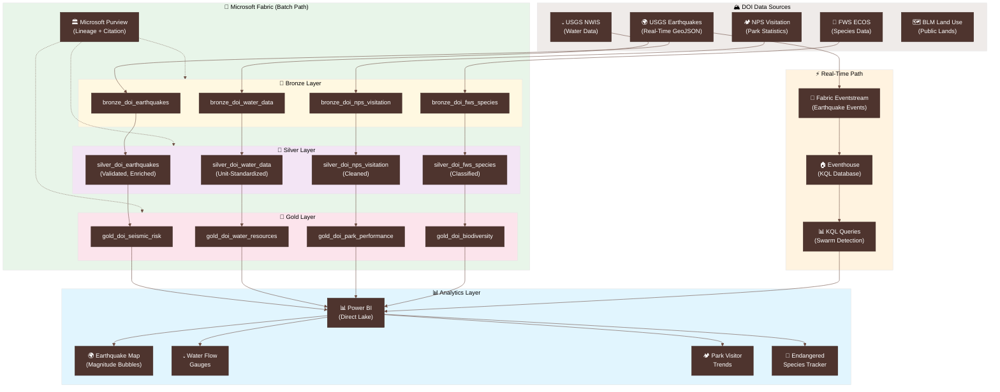

# 🏔️ Tutorial 36: DOI Natural Resources Analytics

<div align="center" markdown>


</div>

> 🏠 **[Home](https://github.com/fgarofalo56/Suppercharge_Microsoft_Fabric/blob/main/README.md)** > 📖 **[Tutorials](../index.md)** > 🏔️ **DOI Natural Resources Analytics**

---

!!! info "Third-party references — publicly sourced, good-faith comparison"
    This page references non-Microsoft products and services. That information is drawn from each vendor's **publicly available documentation** and is offered for honest, good-faith comparison only. This is a personal project written from a Microsoft Fabric and Azure perspective; it does **not** claim expertise in, or authority over, any third-party product, and nothing here is an official statement by, or endorsed by, those vendors. Capabilities, pricing, and features change often — always verify against the vendor's current official documentation. Where a third-party offering is the stronger choice, we say so plainly.

---

## 🏔️ Tutorial 36: DOI Natural Resources Analytics

| | |
|---|---|
| **Difficulty** | ⭐⭐⭐⭐ Advanced |
| **Time** | ⏱️ 120-150 minutes |
| **Focus** | USGS Earthquake Monitoring, Water Resources, NPS Park Analytics, Endangered Species Tracking & Real-Time Seismic Streaming |

---

### 📊 Progress Tracker

```
┌──────┬──────┬──────┬──────┬──────┬──────┬──────┬──────┬──────┬──────┬──────┬──────┬──────┬──────┐
│  00  │  01  │  02  │  03  │  04  │  05  │  06  │  07  │  08  │  09  │  10  │  11  │  12  │  13  │
│SETUP │BRNZE │SILVR │ GOLD │  RT  │ PBI  │PIPES │ GOV  │MIRRR │AI/ML │TDATA │ SAS  │CICD  │MIGR  │
├──────┼──────┼──────┼──────┼──────┼──────┼──────┼──────┼──────┼──────┼──────┼──────┼──────┼──────┤
│  ✅  │  ✅  │  ✅  │  ✅  │  ✅  │  ✅  │  ✅  │  ✅  │  ✅  │  ✅  │  ✅  │  ✅  │  ✅  │  ✅  │
└──────┴──────┴──────┴──────┴──────┴──────┴──────┴──────┴──────┴──────┴──────┴──────┴──────┴──────┘

┌──────┬──────┬──────┬──────┬──────┬──────┬──────┬──────┬──────┬──────┬──────┬──────┬──────┬──────┬──────┬──────┬──────┬──────┐
│  14  │  15  │  16  │  17  │  18  │  19  │  20  │  21  │  22  │  23  │  24  │  25  │  26  │  27  │  28  │  29  │  30  │  31  │
│ SEC  │ COST │PERF  │ MON  │SHARE │COPLT │WKBST │ GEO  │ NET  │SHIR  │ SNW  │ DB2  │MULTI │VIDEO │ MOVE │GEOLC │TRIBL │ DOT  │
├──────┼──────┼──────┼──────┼──────┼──────┼──────┼──────┼──────┼──────┼──────┼──────┼──────┼──────┼──────┼──────┼──────┼──────┤
│  ✅  │  ✅  │  ✅  │  ✅  │  ✅  │  ✅  │  ✅  │  ✅  │  ✅  │  ✅  │  ✅  │  ✅  │  ✅  │  ✅  │  ✅  │  ✅  │  ✅  │  ✅  │
└──────┴──────┴──────┴──────┴──────┴──────┴──────┴──────┴──────┴──────┴──────┴──────┴──────┴──────┴──────┴──────┴──────┴──────┘

┌──────┬──────┬──────┬──────┬──────┐
│  32  │  33  │  34  │  35  │  36  │
│ USDA │ SBA  │ NOAA │ EPA  │ DOI  │
├──────┼──────┼──────┼──────┼──────┤
│  ✅  │  ✅  │  ✅  │  ✅  │  🔵  │
└──────┴──────┴──────┴──────┴──────┘
                              ▲
                       YOU ARE HERE
```

| Navigation | |
|---|---|
| ⬅️ **Previous** | [35-EPA Environmental Analytics](../35-epa-environment/README.md) |
| ➡️ **Next** | [Tutorials Index](../index.md) |

---

## 📖 Overview

The U.S. Department of the Interior (DOI) manages one-fifth of the land area of the United States -- over 500 million acres of public lands, 700 million acres of subsurface minerals, and the nation's water resources, wildlife, and geological hazards. DOI's sub-agencies generate some of the most scientifically valuable data in the federal government: the U.S. Geological Survey (USGS) monitors earthquakes in real time and tracks the nation's water supply, the National Park Service (NPS) manages 423 national parks with 312 million annual visits, the Fish and Wildlife Service (FWS) tracks endangered and threatened species, and the Bureau of Land Management (BLM) oversees mineral leasing and public land use.

This tutorial teaches you to build a **natural resources analytics pipeline** in Microsoft Fabric that integrates data from four DOI sub-agencies, standardizes geospatial measurements, and produces dashboards revealing seismic risk patterns, water resource trends, park visitation dynamics, and biodiversity indicators. The pipeline includes a **real-time earthquake monitoring** component using the USGS Earthquake Hazards API and Fabric Eventhouse.

What makes DOI data uniquely compelling for a Fabric tutorial is the **geospatial emphasis** -- nearly every DOI data point carries latitude/longitude coordinates, making map-based visualizations the primary analytical modality. This tutorial demonstrates advanced geospatial patterns in Power BI alongside the standard medallion architecture.

> **💡 Why DOI Analytics on Fabric?**
>
> - **Real-time seismic data**: USGS provides real-time earthquake data via GeoJSON API and WebSocket feed -- Fabric handles both streaming and batch natively
> - **Geospatial richness**: Earthquake epicenters, water monitoring sites, park boundaries, and species habitats are all geo-referenced, enabling powerful map-based analytics
> - **Cross-agency integration**: Combining USGS water data with NPS visitation and FWS species data in a single lakehouse reveals cross-domain patterns impossible in siloed systems
> - **Scale and history**: USGS earthquake catalog contains 4M+ events; NWIS water data spans 1.5M+ monitoring sites; NPS visitation records go back to 1904
> - **Public interest**: DOI data supports disaster preparedness, conservation planning, recreation management, and natural resource stewardship -- high-impact use cases with broad audiences

> **📋 DOI Data Access**
>
> All DOI data used in this tutorial is freely available. USGS earthquake and water APIs require no authentication. NPS visitation data is published annually on [irma.nps.gov](https://irma.nps.gov/Stats/). FWS species data is available via [ECOS](https://ecos.fws.gov/ecp/). No API keys or registrations are required for any DOI data source.

---

## 🎯 Learning Objectives

By the end of this tutorial, you will be able to:

- [ ] Configure DOI data sources across USGS (earthquakes, water), NPS (parks, visitation), FWS (species), and BLM (land use)
- [ ] Ingest earthquake events, water measurements, park visitation records, and species data into Bronze Delta tables
- [ ] Standardize geospatial coordinates, validate magnitude scales, and normalize water measurement units in Silver
- [ ] Build Gold layer seismic risk indices, water resource dashboards, park performance analytics, and biodiversity indicators
- [ ] Implement real-time earthquake event streaming using the USGS GeoJSON API and Fabric Eventhouse
- [ ] Create KQL queries for earthquake swarm detection and magnitude anomaly alerting in Eventhouse
- [ ] Design Power BI dashboards with earthquake map bubbles, water flow gauges, park visitor trends, and endangered species trackers
- [ ] Calculate seismic risk indices by combining earthquake frequency, magnitude, and population exposure
- [ ] Apply data quality checks for geospatial data (coordinate validation, magnitude range, temporal consistency)
- [ ] Configure USGS data citation requirements and DOI research governance in Microsoft Purview

---

## 🏗️ Architecture Diagram



| Component | Technology | Purpose |
|-----------|-----------|---------|
| **DOI Data Sources** | USGS, NPS, FWS, BLM | Multi-agency natural resource data spanning geology, water, parks, and wildlife |
| **Real-Time Path** | Eventstream + Eventhouse + KQL | Live earthquake event processing with swarm detection and magnitude alerting |
| **Bronze** | Delta Lake (append-only) | Raw earthquake events, water measurements, park visitation, and species records |
| **Silver** | Delta Lake (validated) | Validated earthquakes, unit-standardized water data, cleaned visitation, classified species |
| **Gold** | Delta Lake (aggregated) | Seismic risk indices, water resource dashboards, park performance metrics, biodiversity indicators |
| **Purview** | Microsoft Purview | Data lineage, USGS citation tracking, DOI research governance |
| **Power BI** | Direct Lake + KQL | Earthquake magnitude maps, water flow gauges, park visitor trends, endangered species tracker |

---

## 📋 Prerequisites

Before starting this tutorial, ensure you have:

- [ ] Completed [Tutorial 00: Environment Setup](../00-environment-setup/README.md)
- [ ] Completed [Tutorial 01: Bronze Layer](../01-bronze-layer/README.md)
- [ ] Completed [Tutorial 02: Silver Layer](../02-silver-layer/README.md)
- [ ] Completed [Tutorial 03: Gold Layer](../03-gold-layer/README.md)
- [ ] Completed [Tutorial 04: Real-Time Analytics](../04-real-time-analytics/README.md) (for Eventhouse components)
- [ ] Completed [Tutorial 05: Direct Lake & Power BI](../05-direct-lake-powerbi/README.md)
- [ ] Completed [Tutorial 07: Governance & Purview](../07-governance-purview/README.md)
- [ ] Fabric workspace with F64 capacity (or F2+ for development/testing)
- [ ] Familiarity with PySpark, Delta Lake, KQL, and DAX patterns from prior tutorials
- [ ] No API keys required -- all DOI APIs are open access

> **📋 Data Source Options**
>
> This tutorial supports two data ingestion paths:
> 1. **Synthetic Generator** (recommended for learning): Use [`doi_generator.py`](https://github.com/fgarofalo56/Suppercharge_Microsoft_Fabric/blob/main/data_generation/generators/federal/doi_generator.py) to generate realistic DOI data locally
> 2. **DOI APIs**: Connect directly to USGS Earthquake API, NWIS, NPS Stats, and FWS ECOS for real data
>
> Both paths converge at the same Bronze schema. The real-time earthquake streaming component uses the USGS GeoJSON API.

---

## 🛠️ Step 1: Data Source Setup

DOI sub-agencies maintain independent data systems. This tutorial integrates the four most analytically valuable sources.

### 1.1 DOI Sub-Agency Data Overview

| Sub-Agency | System | Data Type | Volume | Update Frequency |
|------------|--------|----------|--------|-----------------|
| **USGS** | Earthquake Hazards | Earthquake events (location, magnitude, depth) | 4M+ historical; ~20K/month | Real-time (seconds) |
| **USGS** | NWIS (National Water Info System) | Streamflow, groundwater, water quality | 1.5M+ sites; billions of measurements | Real-time (15-min intervals) |
| **NPS** | IRMA / Stats | Park visitation counts, recreation data | 423 parks; monthly since 1904 | Monthly |
| **FWS** | ECOS (Environmental Conservation Online) | Threatened/endangered species listings | 2,700+ listed species | As listing actions occur |
| **BLM** | Public Land Statistics | Land acreage, mineral leasing, grazing permits | Summary statistics by state | Annual |

### 1.2 Option A: Synthetic Data Generator

```python
# Generate synthetic DOI data for development
import sys
sys.path.append("../../data_generation")

from generators.federal.doi_generator import DOIGenerator

generator = DOIGenerator(
    output_path="/lakehouse/default/Files/raw/doi/",
    num_earthquakes=50000,          # 50K earthquake events
    num_water_measurements=100000,  # 100K water readings
    num_park_records=5000,          # 5K visitation records
    num_species_records=3000,       # 3K species records
    date_range=("2019-01-01", "2024-12-31"),
    seed=42
)

datasets = generator.generate_batch()
for name, df in datasets.items():
    print(f"Generated {name}: {df.count():,} records")
```

### 1.3 Option B: DOI APIs (No Authentication Required)

```python
# Connect to real DOI data sources -- all open, no API keys needed
import requests

# 1. USGS Earthquake API (GeoJSON)
def fetch_earthquakes(start_time: str, end_time: str, min_magnitude: float = 2.5) -> dict:
    """Fetch earthquake events from USGS."""
    url = "https://earthquake.usgs.gov/fdsnws/event/1/query"
    params = {
        "format": "geojson",
        "starttime": start_time,
        "endtime": end_time,
        "minmagnitude": min_magnitude,
        "orderby": "time-asc",
    }
    response = requests.get(url, params=params)
    return response.json()

# 2. USGS NWIS Water Data
def fetch_water_data(site_no: str, param_cd: str = "00060",
                     start_date: str = "2024-01-01") -> dict:
    """Fetch streamflow data from USGS NWIS. param_cd 00060 = discharge (cfs)."""
    url = "https://waterservices.usgs.gov/nwis/iv/"
    params = {
        "format": "json",
        "sites": site_no,
        "parameterCd": param_cd,
        "startDT": start_date,
    }
    response = requests.get(url, params=params)
    return response.json()

# 3. NPS Visitation (CSV download)
NPS_STATS_URL = "https://irma.nps.gov/Stats/SSRSReports/National%20Reports/Query%20Builder%20for%20Public%20Use%20Statistics"

# 4. FWS ECOS Species Data
def fetch_species_list(status: str = "E") -> dict:
    """Fetch endangered (E) or threatened (T) species from ECOS."""
    url = "https://ecos.fws.gov/ecp/report/species-listings-by-tax-group"
    # Note: ECOS provides bulk downloads; API is limited
    return {}

# Example: Fetch recent earthquakes
eq_data = fetch_earthquakes("2024-01-01", "2024-01-31", min_magnitude=4.0)
print(f"Earthquakes (M4.0+, Jan 2024): {eq_data['metadata']['count']}")
for feature in eq_data["features"][:5]:
    props = feature["properties"]
    coords = feature["geometry"]["coordinates"]
    print(f"  M{props['mag']:.1f} - {props['place']} ({coords[1]:.2f}, {coords[0]:.2f})")
```

### 1.4 DOI Data Policies

| Policy | Requirement |
|--------|-------------|
| **Free and open** | All DOI scientific data is freely available under federal open data mandates |
| **No authentication** | USGS, NPS, and FWS APIs require no API keys or registration |
| **Citation required** | USGS data requires proper citation (see [USGS data citation guidelines](https://www.usgs.gov/data-management/data-citation)) |
| **Research permits** | Using NPS data for published research may require a permit from the park superintendent |
| **Rate limits** | USGS Earthquake API: No hard limit but requests are logged; NWIS: Reasonable use expected |
| **Provisional data** | Recent USGS data may be provisional; magnitudes and locations are refined over hours/days |

---

## 🛠️ Step 2: Bronze Layer Ingestion

The Bronze layer captures raw data from all four DOI sub-agencies with geospatial coordinates and source metadata preserved.

> **📓 Notebook Reference**: [`notebooks/bronze/16_bronze_doi.py`](https://github.com/fgarofalo56/Suppercharge_Microsoft_Fabric/blob/main/notebooks/bronze/16_bronze_doi.py) *(coming soon)*

### 2.1 Earthquake Schema

```python
# Schema for USGS earthquake events (matches doi_earthquake_schema.json)
from pyspark.sql.types import *

earthquake_schema = StructType([
    StructField("event_id", StringType(), False),             # USGS event ID (e.g., us7000abcd)
    StructField("event_time", TimestampType(), False),        # UTC origin time
    StructField("magnitude", DoubleType(), True),             # Event magnitude
    StructField("magnitude_type", StringType(), True),        # ml, mb, mw, md
    StructField("depth_km", DoubleType(), True),              # Hypocenter depth (km)
    StructField("latitude", DoubleType(), True),              # Epicenter latitude
    StructField("longitude", DoubleType(), True),             # Epicenter longitude

    # Location details
    StructField("place_description", StringType(), True),     # "5km NW of City, State"
    StructField("state", StringType(), True),                 # US state (if applicable)
    StructField("country", StringType(), True),
    StructField("region", StringType(), True),                # Seismic region

    # Impact and quality
    StructField("felt_reports", IntegerType(), True),         # DYFI felt reports count
    StructField("cdi", DoubleType(), True),                   # Community Decimal Intensity
    StructField("mmi", DoubleType(), True),                   # Modified Mercalli Intensity
    StructField("alert_level", StringType(), True),           # green, yellow, orange, red
    StructField("tsunami", BooleanType(), True),              # Tsunami flag
    StructField("significance", IntegerType(), True),         # USGS significance (0-1000+)

    # Metadata
    StructField("status", StringType(), True),                # automatic, reviewed
    StructField("net", StringType(), True),                   # Contributing network
    StructField("nst", IntegerType(), True),                  # Number of stations
    StructField("gap", DoubleType(), True),                   # Azimuthal gap (degrees)
    StructField("rms", DoubleType(), True),                   # Travel time residual (seconds)
    StructField("updated_at", TimestampType(), True),
])

print(f"Earthquake schema: {len(earthquake_schema.fields)} fields")
```

### 2.2 Water Data Schema

```python
# Schema for USGS NWIS water data
water_data_schema = StructType([
    StructField("site_no", StringType(), False),              # USGS site number (8-15 digits)
    StructField("site_name", StringType(), True),
    StructField("measurement_time", TimestampType(), False),
    StructField("parameter_code", StringType(), True),        # 00060=discharge, 00065=gage height
    StructField("parameter_name", StringType(), True),
    StructField("value", DoubleType(), True),                 # Measurement value
    StructField("unit", StringType(), True),                  # cfs, ft, deg C, mg/L
    StructField("qualification_code", StringType(), True),    # A=approved, P=provisional

    # Site geography
    StructField("latitude", DoubleType(), True),
    StructField("longitude", DoubleType(), True),
    StructField("state_code", StringType(), True),
    StructField("county_code", StringType(), True),
    StructField("huc_code", StringType(), True),              # Hydrologic Unit Code (watershed)
    StructField("drainage_area_sq_mi", DoubleType(), True),
    StructField("site_type", StringType(), True),             # Stream, Well, Spring, Lake
])

print(f"Water data schema: {len(water_data_schema.fields)} fields")
```

### 2.3 NPS Visitation and FWS Species Schemas

```python
# NPS Park Visitation schema
nps_visitation_schema = StructType([
    StructField("park_code", StringType(), False),            # 4-letter NPS unit code
    StructField("park_name", StringType(), True),
    StructField("year", IntegerType(), True),
    StructField("month", IntegerType(), True),
    StructField("recreation_visitors", LongType(), True),     # Recreational visits
    StructField("non_recreation_visitors", LongType(), True),
    StructField("total_visitors", LongType(), True),

    # Park details
    StructField("park_type", StringType(), True),             # National Park, Monument, etc.
    StructField("region", StringType(), True),                # NPS region
    StructField("state", StringType(), True),
    StructField("latitude", DoubleType(), True),
    StructField("longitude", DoubleType(), True),
    StructField("acres", DoubleType(), True),                 # Park area
])

# FWS Species schema
fws_species_schema = StructType([
    StructField("species_id", StringType(), False),
    StructField("scientific_name", StringType(), True),
    StructField("common_name", StringType(), True),
    StructField("taxonomic_group", StringType(), True),       # Mammals, Birds, Fish, Plants, etc.
    StructField("listing_status", StringType(), True),        # Endangered, Threatened
    StructField("listing_date", DateType(), True),
    StructField("critical_habitat", BooleanType(), True),
    StructField("recovery_plan", BooleanType(), True),

    # Geography
    StructField("range_states", StringType(), True),          # Comma-separated state codes
    StructField("lead_region", StringType(), True),           # FWS region responsible
    StructField("population_description", StringType(), True),
])

print(f"NPS visitation schema: {len(nps_visitation_schema.fields)} fields")
print(f"FWS species schema: {len(fws_species_schema.fields)} fields")
```

### 2.4 Bronze Ingestion

```python
# Multi-domain DOI Bronze ingestion
from pyspark.sql.functions import *
from datetime import datetime
from uuid import uuid4

BATCH_ID = f"doi-batch-{datetime.utcnow().strftime('%Y%m%d-%H%M%S')}"
RUN_ID = str(uuid4())

source_path = "/lakehouse/default/Files/raw/doi/"

def add_bronze_metadata(df):
    return df \
        .withColumn("_ingested_at", current_timestamp()) \
        .withColumn("_source_file", input_file_name()) \
        .withColumn("_batch_id", lit(BATCH_ID)) \
        .withColumn("_run_id", lit(RUN_ID)) \
        .withColumn("_load_date", current_timestamp().cast("date"))

# Earthquakes
df_eq = spark.read.schema(earthquake_schema).parquet(f"{source_path}earthquakes/")
df_eq_bronze = add_bronze_metadata(df_eq)
df_eq_bronze.write.format("delta").mode("append") \
    .partitionBy("_load_date") \
    .saveAsTable("lh_bronze.bronze_doi_earthquakes")

# Water data
df_water = spark.read.schema(water_data_schema).parquet(f"{source_path}water/")
df_water_bronze = add_bronze_metadata(df_water)
df_water_bronze.write.format("delta").mode("append") \
    .partitionBy("state_code", "_load_date") \
    .saveAsTable("lh_bronze.bronze_doi_water_data")

# NPS visitation
df_nps = spark.read.schema(nps_visitation_schema).parquet(f"{source_path}nps/")
df_nps_bronze = add_bronze_metadata(df_nps)
df_nps_bronze.write.format("delta").mode("append") \
    .partitionBy("year") \
    .saveAsTable("lh_bronze.bronze_doi_nps_visitation")

# FWS species
df_fws = spark.read.schema(fws_species_schema).parquet(f"{source_path}species/")
df_fws_bronze = add_bronze_metadata(df_fws)
df_fws_bronze.write.format("delta").mode("append") \
    .saveAsTable("lh_bronze.bronze_doi_fws_species")

print(f"Bronze earthquakes: {df_eq_bronze.count():,}")
print(f"Bronze water data: {df_water_bronze.count():,}")
print(f"Bronze NPS visitation: {df_nps_bronze.count():,}")
print(f"Bronze FWS species: {df_fws_bronze.count():,}")
```

---

## 🛠️ Step 3: Silver Layer -- Validation & Enrichment

The Silver layer validates earthquake magnitudes and coordinates, standardizes water measurement units, cleans NPS visitation anomalies, and classifies species by conservation priority.

> **📓 Notebook Reference**: [`notebooks/silver/16_silver_doi.py`](https://github.com/fgarofalo56/Suppercharge_Microsoft_Fabric/blob/main/notebooks/silver/16_silver_doi.py) *(coming soon)*

### 3.1 Earthquake Validation and Enrichment

```python
# Validate earthquake parameters against seismological limits
MAGNITUDE_RANGES = {"ml": (-2, 8), "mb": (0, 9), "mw": (0, 10), "md": (-2, 6)}

df_eq_silver = df_eq_bronze \
    .withColumn("magnitude_valid",
        when(col("magnitude").isNull(), lit(False))
        .when(col("magnitude") < -2, lit(False))
        .when(col("magnitude") > 10, lit(False))
        .otherwise(lit(True))
    ) \
    .withColumn("depth_valid",
        when(col("depth_km") < 0, lit(False))
        .when(col("depth_km") > 700, lit(False))  # Deepest: ~700 km
        .otherwise(lit(True))
    ) \
    .withColumn("coords_valid",
        (col("latitude").between(-90, 90)) & (col("longitude").between(-180, 180))
    ) \
    .withColumn("magnitude_category",
        when(col("magnitude") < 2, lit("Micro (<2)"))
        .when(col("magnitude") < 4, lit("Minor (2-3.9)"))
        .when(col("magnitude") < 5, lit("Light (4-4.9)"))
        .when(col("magnitude") < 6, lit("Moderate (5-5.9)"))
        .when(col("magnitude") < 7, lit("Strong (6-6.9)"))
        .when(col("magnitude") < 8, lit("Major (7-7.9)"))
        .otherwise(lit("Great (8+)"))
    ) \
    .withColumn("depth_category",
        when(col("depth_km") < 70, lit("Shallow (0-70 km)"))
        .when(col("depth_km") < 300, lit("Intermediate (70-300 km)"))
        .otherwise(lit("Deep (300+ km)"))
    ) \
    .withColumn("is_significant",
        (col("magnitude") >= 4.5) | (col("felt_reports") > 100) | (col("alert_level").isin("orange", "red"))
    ) \
    .withColumn("energy_joules",
        pow(lit(10), lit(1.5) * col("magnitude") + lit(4.8))
    )

# Quality score
df_eq_silver = df_eq_silver \
    .withColumn("_dq_score",
        when(col("event_id").isNotNull(), lit(15)).otherwise(lit(0)) +
        when(col("event_time").isNotNull(), lit(15)).otherwise(lit(0)) +
        when(col("magnitude_valid") == True, lit(15)).otherwise(lit(0)) +
        when(col("depth_valid") == True, lit(10)).otherwise(lit(0)) +
        when(col("coords_valid") == True, lit(15)).otherwise(lit(0)) +
        when(col("status") == "reviewed", lit(10)).otherwise(lit(5)) +
        when(col("nst").isNotNull() & (col("nst") >= 10), lit(10)).otherwise(lit(0)) +
        when(col("gap").isNotNull() & (col("gap") < 180), lit(5)).otherwise(lit(0)) +
        when(col("rms").isNotNull() & (col("rms") < 1.0), lit(5)).otherwise(lit(0))
    )

# Deduplication (USGS may update events)
from pyspark.sql.window import Window
w = Window.partitionBy("event_id").orderBy(col("updated_at").desc())
df_eq_deduped = df_eq_silver \
    .withColumn("_row_num", row_number().over(w)) \
    .filter(col("_row_num") == 1) \
    .drop("_row_num")
```

### 3.2 Water Data Standardization

```python
# Standardize water measurement units
WATER_PARAM_UNITS = {
    "00060": ("Discharge", "cfs"),          # Cubic feet per second
    "00065": ("Gage Height", "ft"),          # Feet
    "00010": ("Water Temperature", "deg C"),
    "00300": ("Dissolved Oxygen", "mg/L"),
    "00400": ("pH", "std units"),
    "00095": ("Specific Conductance", "uS/cm"),
}

param_name_expr = create_map([lit(x) for pair in
    {k: v[0] for k, v in WATER_PARAM_UNITS.items()}.items() for x in pair])
param_unit_expr = create_map([lit(x) for pair in
    {k: v[1] for k, v in WATER_PARAM_UNITS.items()}.items() for x in pair])

df_water_silver = df_water_bronze \
    .withColumn("parameter_name_std",
        coalesce(param_name_expr[col("parameter_code")], col("parameter_name"))
    ) \
    .withColumn("unit_std",
        coalesce(param_unit_expr[col("parameter_code")], col("unit"))
    ) \
    .withColumn("value_valid",
        when(col("value").isNull(), lit(False))
        .when((col("parameter_code") == "00060") & (col("value") < 0), lit(False))
        .when((col("parameter_code") == "00400") & ~col("value").between(0, 14), lit(False))
        .otherwise(lit(True))
    ) \
    .withColumn("state_std", upper(trim(col("state_code")))) \
    .withColumn("is_provisional", col("qualification_code") == "P")

# Deduplication
df_water_deduped = df_water_silver.dropDuplicates(["site_no", "measurement_time", "parameter_code"])
```

### 3.3 NPS Visitation Cleaning

```python
# Clean NPS visitation data
df_nps_silver = df_nps_bronze \
    .withColumn("park_code_std", upper(trim(col("park_code")))) \
    .withColumn("visitors_valid",
        (col("recreation_visitors") >= 0) & (col("total_visitors") >= 0)
    ) \
    .withColumn("visit_date",
        to_date(concat(col("year"), lit("-"), lpad(col("month"), 2, "0"), lit("-01")))
    ) \
    .withColumn("visitors_per_acre",
        when(col("acres") > 0,
            round(col("recreation_visitors") / col("acres"), 2)
        ).otherwise(lit(None))
    ) \
    .withColumn("season",
        when(col("month").isin(12, 1, 2), lit("Winter"))
        .when(col("month").isin(3, 4, 5), lit("Spring"))
        .when(col("month").isin(6, 7, 8), lit("Summer"))
        .otherwise(lit("Fall"))
    )
```

### 3.4 Species Classification

```python
# Classify and enrich species data
df_species_silver = df_fws_bronze \
    .withColumn("listing_status_std", upper(trim(col("listing_status")))) \
    .withColumn("conservation_priority",
        when(col("listing_status_std") == "ENDANGERED", lit("Critical"))
        .when(col("listing_status_std") == "THREATENED", lit("High"))
        .otherwise(lit("Monitor"))
    ) \
    .withColumn("has_critical_habitat", coalesce(col("critical_habitat"), lit(False))) \
    .withColumn("has_recovery_plan", coalesce(col("recovery_plan"), lit(False))) \
    .withColumn("num_range_states",
        size(split(col("range_states"), ","))
    ) \
    .withColumn("years_listed",
        when(col("listing_date").isNotNull(),
            datediff(current_date(), col("listing_date")) / 365
        ).otherwise(lit(None))
    )
```

### 3.5 Write Silver Tables

```python
# Write all Silver tables
df_eq_deduped.write.format("delta").mode("overwrite") \
    .option("overwriteSchema", "true") \
    .saveAsTable("lh_silver.silver_doi_earthquakes")
spark.sql("OPTIMIZE lh_silver.silver_doi_earthquakes ZORDER BY (latitude, longitude, event_time)")

df_water_deduped.write.format("delta").mode("overwrite") \
    .option("overwriteSchema", "true") \
    .partitionBy("state_std") \
    .saveAsTable("lh_silver.silver_doi_water_data")
spark.sql("OPTIMIZE lh_silver.silver_doi_water_data ZORDER BY (site_no, measurement_time)")

df_nps_silver.write.format("delta").mode("overwrite") \
    .option("overwriteSchema", "true") \
    .saveAsTable("lh_silver.silver_doi_nps_visitation")

df_species_silver.write.format("delta").mode("overwrite") \
    .option("overwriteSchema", "true") \
    .saveAsTable("lh_silver.silver_doi_fws_species")

print(f"Silver earthquakes: {df_eq_deduped.count():,}")
print(f"Silver water data: {df_water_deduped.count():,}")
print(f"Silver NPS visitation: {df_nps_silver.count():,}")
print(f"Silver FWS species: {df_species_silver.count():,}")
```

---

## 🛠️ Step 4: Real-Time Earthquake Streaming

The USGS Earthquake Hazards API provides real-time earthquake data via GeoJSON that can feed Fabric Eventhouse for live seismic monitoring.

### 4.1 Eventstream Configuration

```python
# Eventstream ingestion: USGS Earthquake API -> Eventhouse
import json
import requests
import time
from datetime import datetime, timedelta

USGS_EARTHQUAKE_API = "https://earthquake.usgs.gov/earthquakes/feed/v1.0/summary"

def fetch_recent_earthquakes(timeframe: str = "hour", min_mag: str = "2.5") -> list:
    """Fetch recent earthquakes from USGS GeoJSON feed.
    timeframe: hour, day, week, month
    min_mag: significant, 4.5, 2.5, 1.0, all
    """
    url = f"{USGS_EARTHQUAKE_API}/{min_mag}_{timeframe}.geojson"
    response = requests.get(url, timeout=15)
    if response.status_code != 200:
        return []

    data = response.json()
    events = []
    for feature in data["features"]:
        props = feature["properties"]
        coords = feature["geometry"]["coordinates"]
        events.append({
            "event_id": feature["id"],
            "event_time": datetime.utcfromtimestamp(props["time"] / 1000).isoformat(),
            "magnitude": props["mag"],
            "magnitude_type": props.get("magType"),
            "depth_km": coords[2],
            "latitude": coords[1],
            "longitude": coords[0],
            "place": props.get("place"),
            "alert_level": props.get("alert"),
            "tsunami": bool(props.get("tsunami", 0)),
            "significance": props.get("sig"),
            "felt_reports": props.get("felt"),
            "status": props.get("status"),
            "ingestion_time": datetime.utcnow().isoformat(),
        })
    return events

# Polling loop for Eventstream
while True:
    earthquakes = fetch_recent_earthquakes("hour", "2.5")
    for eq in earthquakes:
        emit_event(json.dumps(eq))
    print(f"[{datetime.utcnow().isoformat()}] Emitted {len(earthquakes)} earthquake events")
    time.sleep(300)  # 5-minute polling interval
```

### 4.2 KQL Queries for Seismic Monitoring

```kql
// Real-time earthquake monitoring queries in Eventhouse

// 1. Latest significant earthquakes (M4.0+)
doi_earthquake_stream
| where magnitude >= 4.0
| where event_time > ago(24h)
| project event_time, magnitude, depth_km, place, alert_level, tsunami, latitude, longitude
| order by magnitude desc

// 2. Earthquake swarm detection (5+ events within 50km in 6 hours)
doi_earthquake_stream
| where event_time > ago(6h)
| extend lat_bin = round(latitude, 0), lon_bin = round(longitude, 0)
| summarize event_count = count(),
            avg_mag = avg(magnitude),
            max_mag = max(magnitude),
            events = make_list(pack("time", event_time, "mag", magnitude, "place", place))
  by lat_bin, lon_bin
| where event_count >= 5
| project lat_bin, lon_bin, event_count, avg_mag, max_mag
| order by event_count desc

// 3. Tsunami-capable events (shallow M6.5+ near ocean)
doi_earthquake_stream
| where magnitude >= 6.5
| where depth_km < 70
| where tsunami == true or alert_level in ("orange", "red")
| project event_time, magnitude, depth_km, place, latitude, longitude, alert_level

// 4. Event rate anomaly (compare hourly rate to 7-day baseline)
let baseline = doi_earthquake_stream
    | where event_time between (ago(7d) .. ago(1d))
    | summarize hourly_avg = count() / (6.0 * 24);
doi_earthquake_stream
| where event_time > ago(1h)
| summarize current_count = count()
| extend baseline_avg = toscalar(baseline)
| extend rate_ratio = current_count / baseline_avg
| where rate_ratio > 3.0  // 3x normal rate
| project current_count, baseline_avg, rate_ratio

// 5. Magnitude distribution over past 30 days
doi_earthquake_stream
| where event_time > ago(30d)
| summarize count() by mag_bin = bin(magnitude, 0.5)
| order by mag_bin asc
| render columnchart
```

---

## 🛠️ Step 5: Gold Layer -- Natural Resources Analytics

The Gold layer builds decision-ready aggregations: seismic risk indices, water resource dashboards, park performance metrics, and biodiversity indicators.

> **📓 Notebook Reference**: [`notebooks/gold/16_gold_doi_analytics.py`](https://github.com/fgarofalo56/Suppercharge_Microsoft_Fabric/blob/main/notebooks/gold/16_gold_doi_analytics.py) *(coming soon)*

### 5.1 Seismic Risk Index

```python
# Seismic risk index by state/region
df_seismic_risk = df_eq_deduped \
    .filter(col("magnitude_valid") == True) \
    .filter(col("coords_valid") == True) \
    .groupBy("state", "region") \
    .agg(
        count("*").alias("total_events"),
        sum(when(col("magnitude") >= 4.0, 1).otherwise(0)).alias("significant_events"),
        sum(when(col("magnitude") >= 6.0, 1).otherwise(0)).alias("major_events"),
        avg("magnitude").alias("avg_magnitude"),
        max("magnitude").alias("max_magnitude"),
        avg("depth_km").alias("avg_depth_km"),
        sum(col("energy_joules")).alias("total_energy_released"),
        sum(when(col("tsunami") == True, 1).otherwise(0)).alias("tsunami_events"),
        sum("felt_reports").alias("total_felt_reports"),
    ) \
    .withColumn("events_per_year",
        round(col("total_events") / 5.0, 1)  # Assuming 5-year window
    )

# Composite risk score (0-100)
from pyspark.sql.window import Window
w_rank = Window.orderBy(col("total_events").desc())
df_seismic_risk = df_seismic_risk \
    .withColumn("freq_rank", percent_rank().over(w_rank)) \
    .withColumn("mag_rank", percent_rank().over(Window.orderBy(col("max_magnitude").desc()))) \
    .withColumn("felt_rank", percent_rank().over(Window.orderBy(col("total_felt_reports").desc()))) \
    .withColumn("seismic_risk_index",
        round((col("freq_rank") * 40 + col("mag_rank") * 35 + col("felt_rank") * 25) * 100, 1)
    )

df_seismic_risk.write.format("delta").mode("overwrite") \
    .saveAsTable("lh_gold.gold_doi_seismic_risk")
```

### 5.2 Water Resources Dashboard

```python
# Water resource summary by state and watershed
df_water_resources = df_water_deduped \
    .filter(col("value_valid") == True) \
    .filter(col("parameter_code") == "00060")  # Streamflow discharge
    .groupBy("state_std", "huc_code", "site_type") \
    .agg(
        countDistinct("site_no").alias("monitoring_sites"),
        avg("value").alias("avg_discharge_cfs"),
        min("value").alias("min_discharge_cfs"),
        max("value").alias("max_discharge_cfs"),
        percentile_approx("value", 0.10).alias("p10_discharge"),
        percentile_approx("value", 0.90).alias("p90_discharge"),
        count("*").alias("total_measurements"),
        sum(when(col("is_provisional") == True, 1).otherwise(0)).alias("provisional_count"),
    ) \
    .withColumn("flow_variability",
        when(col("avg_discharge_cfs") > 0,
            round((col("p90_discharge") - col("p10_discharge")) / col("avg_discharge_cfs"), 2)
        ).otherwise(lit(None))
    )

df_water_resources.write.format("delta").mode("overwrite") \
    .saveAsTable("lh_gold.gold_doi_water_resources")
```

### 5.3 Park Performance Analytics

```python
# NPS park performance metrics
df_park_performance = df_nps_silver \
    .groupBy("park_code_std", "park_name", "park_type", "state", "region",
             "latitude", "longitude", "acres") \
    .agg(
        sum("recreation_visitors").alias("total_recreation_visitors"),
        avg("recreation_visitors").alias("avg_monthly_visitors"),
        max("recreation_visitors").alias("peak_monthly_visitors"),
        min("recreation_visitors").alias("min_monthly_visitors"),
        countDistinct("year").alias("years_of_data"),

        # Seasonal patterns
        sum(when(col("season") == "Summer", col("recreation_visitors")).otherwise(0))
            .alias("summer_visitors"),
        sum(when(col("season") == "Winter", col("recreation_visitors")).otherwise(0))
            .alias("winter_visitors"),
    ) \
    .withColumn("seasonality_ratio",
        when(col("winter_visitors") > 0,
            round(col("summer_visitors") / col("winter_visitors"), 2)
        ).otherwise(lit(None))
    ) \
    .withColumn("visitors_per_acre",
        when(col("acres") > 0,
            round(col("total_recreation_visitors") / col("acres"), 0)
        ).otherwise(lit(None))
    ) \
    .withColumn("park_tier",
        when(col("total_recreation_visitors") >= 10000000, lit("Tier 1 - Iconic (10M+)"))
        .when(col("total_recreation_visitors") >= 1000000, lit("Tier 2 - Major (1M-10M)"))
        .when(col("total_recreation_visitors") >= 100000, lit("Tier 3 - Regional (100K-1M)"))
        .otherwise(lit("Tier 4 - Local (<100K)"))
    )

df_park_performance.write.format("delta").mode("overwrite") \
    .saveAsTable("lh_gold.gold_doi_park_performance")
```

### 5.4 Biodiversity Indicators

```python
# Biodiversity indicators from FWS species data
df_biodiversity = df_species_silver \
    .groupBy("taxonomic_group", "conservation_priority") \
    .agg(
        count("*").alias("species_count"),
        sum(when(col("has_critical_habitat") == True, 1).otherwise(0)).alias("with_critical_habitat"),
        sum(when(col("has_recovery_plan") == True, 1).otherwise(0)).alias("with_recovery_plan"),
        avg("num_range_states").alias("avg_range_states"),
        avg("years_listed").alias("avg_years_listed"),
    ) \
    .withColumn("recovery_plan_coverage_pct",
        round(col("with_recovery_plan") * 100.0 / col("species_count"), 1)
    ) \
    .withColumn("habitat_designation_pct",
        round(col("with_critical_habitat") * 100.0 / col("species_count"), 1)
    )

df_biodiversity.write.format("delta").mode("overwrite") \
    .saveAsTable("lh_gold.gold_doi_biodiversity")

# Summary
for table in ["gold_doi_seismic_risk", "gold_doi_water_resources",
              "gold_doi_park_performance", "gold_doi_biodiversity"]:
    count = spark.table(f"lh_gold.{table}").count()
    print(f"  {table}: {count:,} rows")
```

---

## 🛠️ Step 6: Power BI Dashboard

### 6.1 DAX Measures

```dax
// ===== DOI Natural Resources Measures =====

// Total Earthquakes
Total Earthquakes =
COUNTROWS(gold_doi_seismic_risk)

// Significant Events (M4.0+)
Significant Earthquakes =
SUM(gold_doi_seismic_risk[significant_events])

// Maximum Magnitude
Max Magnitude Recorded =
MAX(gold_doi_seismic_risk[max_magnitude])

// Park Visitors (Total)
Total Park Visitors =
SUM(gold_doi_park_performance[total_recreation_visitors])

// Endangered Species Count
Endangered Species =
CALCULATE(
    COUNTROWS(gold_doi_biodiversity),
    gold_doi_biodiversity[conservation_priority] = "Critical"
)

// Average Streamflow
Avg Streamflow CFS =
AVERAGE(gold_doi_water_resources[avg_discharge_cfs])

// Seismic Risk Score
Avg Seismic Risk =
AVERAGE(gold_doi_seismic_risk[seismic_risk_index])

// Park Visitor Trend YoY
Visitor YoY Change % =
VAR CurrentYear =
    CALCULATE(SUM(silver_doi_nps_visitation[recreation_visitors]),
        silver_doi_nps_visitation[year] = MAX(silver_doi_nps_visitation[year]))
VAR PriorYear =
    CALCULATE(SUM(silver_doi_nps_visitation[recreation_visitors]),
        silver_doi_nps_visitation[year] = MAX(silver_doi_nps_visitation[year]) - 1)
RETURN
    DIVIDE(CurrentYear - PriorYear, PriorYear, 0) * 100

// Species Recovery Progress
Recovery Plan Coverage % =
DIVIDE(
    CALCULATE(COUNTROWS(silver_doi_fws_species),
        silver_doi_fws_species[has_recovery_plan] = TRUE()),
    COUNTROWS(silver_doi_fws_species),
    0
) * 100
```

### 6.2 Dashboard Layout

```
┌─────────────────────────────────────────────────────────────────────────────┐
│  🏔️ DOI NATURAL RESOURCES ANALYTICS DASHBOARD                               │
│  Agency: [Slicer] │ State: [Slicer] │ Year: [Slicer] │ Domain: [Slicer]  │
├───────────────────┬──────────────────┬──────────────────┬──────────────────┤
│  🌍 Earthquakes   │  🏕️ Park Visitors│  🦅 Endangered   │  💧 Monitoring   │
│  (Last 30 days)   │  (Annual)        │  Species          │  Sites           │
│  4,231             │  312.4M          │  1,673            │  8,247           │
├───────────────────┴──────────────────┴──────────────────┴──────────────────┤
│                                                                             │
│  ┌─────────────────────────────────┐  ┌──────────────────────────────────┐ │
│  │  Earthquake Map                 │  │  Water Flow Gauges by State     │ │
│  │  [Bubble Map: Lat/Long]        │  │  [Gauge Visuals]                │ │
│  │                                 │  │                                  │ │
│  │  Size: Magnitude               │  │  Colorado River: 12,450 cfs     │ │
│  │  Color: Depth category          │  │  Mississippi: 448,200 cfs       │ │
│  │  Tooltip: Place, time, mag     │  │  Columbia: 187,600 cfs          │ │
│  │  Drill: Click for details      │  │  [Color: Normal/Low/Flood]      │ │
│  └─────────────────────────────────┘  └──────────────────────────────────┘ │
│                                                                             │
│  ┌─────────────────────────────────┐  ┌──────────────────────────────────┐ │
│  │  Top 20 Parks by Visitors      │  │  Endangered Species by Group    │ │
│  │  [Horizontal Bar Chart]        │  │  [Donut Chart]                  │ │
│  │                                 │  │                                  │ │
│  │  Great Smoky: ████████ 12.1M   │  │  Plants: 42%                    │ │
│  │  Grand Canyon: ██████ 6.4M     │  │  Fish: 18%                      │ │
│  │  Zion: █████ 4.7M              │  │  Birds: 12%                     │ │
│  └─────────────────────────────────┘  └──────────────────────────────────┘ │
│                                                                             │
│  ┌──────────────────────────────────────────────────────────────────────┐  │
│  │  Park Visitor Trends (Monthly, 2019-2024)                            │  │
│  │  [Line Chart: Recreation visitors with COVID impact visible]        │  │
│  └──────────────────────────────────────────────────────────────────────┘  │
└─────────────────────────────────────────────────────────────────────────────┘
```

---

## 🛠️ Step 7: Data Quality & Governance

### 7.1 DOI-Specific Data Quality Checks

```python
# Data quality checks for DOI natural resources data
from great_expectations.core import ExpectationSuite

doi_expectations = ExpectationSuite(expectation_suite_name="doi_natural_resources_suite")

# Earthquake magnitude range
doi_expectations.add_expectation({
    "expectation_type": "expect_column_values_to_be_between",
    "kwargs": {"column": "magnitude", "min_value": -2, "max_value": 10, "mostly": 0.999}
})

# Earthquake depth range
doi_expectations.add_expectation({
    "expectation_type": "expect_column_values_to_be_between",
    "kwargs": {"column": "depth_km", "min_value": 0, "max_value": 700, "mostly": 0.999}
})

# Latitude/longitude validity
doi_expectations.add_expectation({
    "expectation_type": "expect_column_values_to_be_between",
    "kwargs": {"column": "latitude", "min_value": -90, "max_value": 90}
})

doi_expectations.add_expectation({
    "expectation_type": "expect_column_values_to_be_between",
    "kwargs": {"column": "longitude", "min_value": -180, "max_value": 180}
})

# Streamflow non-negative
doi_expectations.add_expectation({
    "expectation_type": "expect_column_values_to_be_between",
    "kwargs": {"column": "value", "min_value": 0, "mostly": 0.99}
})

# Park visitors non-negative
doi_expectations.add_expectation({
    "expectation_type": "expect_column_values_to_be_between",
    "kwargs": {"column": "recreation_visitors", "min_value": 0}
})

print(f"DOI validation suite: {len(doi_expectations.expectations)} expectations")
```

### 7.2 USGS Citation and DOI Governance

```python
# Purview configuration for DOI data
purview_config = {
    "lh_bronze.bronze_doi_earthquakes": {
        "sensitivity_label": "Public - Federal Scientific Data",
        "attribution": "USGS Earthquake Hazards Program",
        "citation": "U.S. Geological Survey, Earthquake Hazards Program (YYYY): ANSS Comprehensive Earthquake Catalog",
        "data_source_url": "https://earthquake.usgs.gov/",
        "update_frequency": "Real-time (seconds) + daily batch review",
    },
    "lh_bronze.bronze_doi_water_data": {
        "sensitivity_label": "Public - Federal Scientific Data",
        "attribution": "USGS National Water Information System (NWIS)",
        "citation": "U.S. Geological Survey, YYYY, National Water Information System data",
        "provisional_data_note": "Recent data may be provisional and subject to revision",
    },
    "lh_bronze.bronze_doi_nps_visitation": {
        "sensitivity_label": "Public - Federal Recreation Data",
        "attribution": "National Park Service, Integrated Resource Management Applications (IRMA)",
        "research_permit_note": "Published research using NPS data may require park superintendent approval",
    },
    "lh_gold.gold_doi_seismic_risk": {
        "sensitivity_label": "Internal - Derived Analytics",
        "disclaimer": "Seismic risk index is a derived composite metric, not an official USGS product",
        "methodology": "Composite of event frequency, maximum magnitude, and felt reports",
    },
}

for table, config in purview_config.items():
    print(f"\n{table}:")
    for key, value in config.items():
        print(f"  {key}: {value}")
```

---

## 🔧 Troubleshooting

| Symptom | Likely Cause | Solution |
|---------|-------------|----------|
| Earthquake API returns empty results | Time range too narrow or min_magnitude too high | Expand time range or lower min_magnitude; use "all_week.geojson" for broader results |
| Duplicate earthquake events after batch | USGS updates events (magnitude revisions, reviews) | Deduplicate by event_id keeping most recent `updated_at` timestamp |
| Magnitude is negative | Valid for micro-earthquakes (detected but sub-zero on Richter-like scales) | Accept negative magnitudes in Silver; they are scientifically valid |
| Water data gaps (NULL values) | Sensor offline, ice-affected, or equipment failure | Track data completeness as a DQ metric; do not interpolate for regulatory use |
| NPS visitation shows sharp 2020 drop | COVID-19 park closures (March-June 2020) | Document as expected pattern; exclude from trend analysis or annotate in dashboard |
| Species listed in multiple states | Species ranges span state borders | The `range_states` field is comma-separated; use `explode()` for per-state analysis |
| Earthquake map shows ocean events | Earthquakes occur on oceanic ridges and subduction zones | Filter to US-only with bounding box or include oceanic events with appropriate labeling |
| KQL swarm detection false positives | Aftershock sequences trigger swarm alerts | Add magnitude threshold to swarm query; differentiate mainshock-aftershock from true swarms |
| Water parameter codes not matching | Using site-specific parameter codes vs. national codes | Always use national NWIS parameter codes (5-digit); map site-specific codes in Bronze |
| Power BI map bubbles too small | Magnitude scale is logarithmic but bubble size is linear | Use `10^(magnitude/2)` for bubble size to represent energy release proportionally |

---

## 📋 Best Practices

1. **Always deduplicate earthquakes by event_id, keeping the latest update.** USGS revises earthquake parameters (magnitude, location, depth) for hours or days after the initial automatic detection. Use `updated_at` to select the most authoritative version.

2. **Represent earthquake magnitude on a logarithmic visual scale.** Magnitude is already logarithmic (each whole number represents 10x amplitude, 31.6x energy). When mapping bubble size to magnitude, use an exponential transform to visually represent this difference -- a M7 should appear dramatically larger than a M5.

3. **Accept negative earthquake magnitudes.** Micro-earthquakes with magnitudes below 0 are scientifically valid and detected by sensitive instruments. Do not filter them out in Silver unless your analysis specifically requires felt earthquakes.

4. **Handle provisional water data explicitly.** USGS marks recent water measurements as "P" (provisional). These values are subject to revision. In dashboards, clearly label provisional vs. approved data and avoid regulatory conclusions based solely on provisional measurements.

5. **Account for COVID-19 impact on park visitation.** NPS visitation dropped 28% in 2020. Any trend analysis spanning 2019-2024 must acknowledge this anomaly. Consider calculating "pandemic-adjusted" trends by excluding March-June 2020.

6. **Cite USGS data properly.** USGS requires formal citation for published use of their data. Include the citation format from the data source page. This is not merely a courtesy -- it is a condition of data use.

7. **Partition earthquakes by date, Z-Order by coordinates.** Earthquake queries filter by time (recent events) and geography (map views). This combination optimizes both patterns for Direct Lake.

8. **Use hydrologic unit codes (HUC) for watershed-level water analysis.** Individual site-level analysis is useful but HUC-based aggregation reveals watershed health patterns that site-level data cannot. The 8-digit HUC provides a good balance between resolution and aggregation.

---

## ✅ Summary

Congratulations! You have built a comprehensive DOI natural resources analytics pipeline in Microsoft Fabric spanning seismic monitoring, water resources, park management, and biodiversity conservation.

### What You Accomplished

- Configured multi-agency DOI data ingestion from USGS (earthquakes, water), NPS (parks), FWS (species), and BLM sources
- Ingested earthquake events, water measurements, park visitation, and species data into Bronze Delta tables with geospatial metadata
- Validated earthquake magnitudes and coordinates, standardized water measurement units, and classified species conservation priority in Silver
- Implemented real-time earthquake event streaming using the USGS GeoJSON API and Fabric Eventhouse with KQL swarm detection
- Built Gold layer seismic risk indices, water resource summaries, park performance analytics, and biodiversity indicators
- Created DAX measures for Power BI dashboards with earthquake magnitude maps, water flow gauges, park visitor trends, and species trackers
- Applied data quality checks for geospatial data including coordinate validation, magnitude range checks, and temporal consistency
- Configured USGS data citation requirements and DOI research governance in Microsoft Purview

### Key Takeaways

| Concept | Key Point |
|---------|-----------|
| **Real-Time Seismology** | USGS earthquake data is available in seconds; Fabric Eventhouse enables production-grade seismic monitoring with swarm detection |
| **Geospatial First** | Every DOI data point carries coordinates; map-based visualization is the primary analytical modality, not an afterthought |
| **Cross-Agency Integration** | Combining earthquake, water, park, and species data in a single lakehouse reveals patterns impossible in siloed agency systems |
| **Magnitude Logarithm** | Earthquake magnitude is logarithmic; visual representations must account for this to avoid misleading users |
| **Provisional Data Handling** | Recent USGS data is provisional and subject to revision; always label data provenance in dashboards |
| **Citation Requirements** | USGS data requires formal citation for published use; Purview governance tracks attribution compliance |

---

## 🚀 Next Steps

Continue your learning journey:

**Tutorial series complete.** Return to the [Tutorials Index](../index.md) to review or revisit any tutorial.

**Related Tutorials:**
- [Tutorial 34: NOAA Weather & Climate Analytics](../34-noaa-weather-climate/README.md) -- Combine NOAA weather data with USGS earthquake data for multi-hazard analysis
- [Tutorial 35: EPA Environmental Analytics](../35-epa-environment/README.md) -- Environmental monitoring pairs with DOI water and land data for ecosystem analysis
- [Tutorial 04: Real-Time Analytics](../04-real-time-analytics/README.md) -- Foundational Eventstream patterns used in earthquake streaming
- [Tutorial 21: GeoAnalytics & ArcGIS](../21-geoanalytics-arcgis/README.md) -- Advanced geospatial visualization for earthquake maps, park boundaries, and species habitats

---

## 📚 Resources

| Resource | Link |
|----------|------|
| USGS Earthquake Hazards | [earthquake.usgs.gov](https://earthquake.usgs.gov/) |
| USGS NWIS Water Data | [waterdata.usgs.gov](https://waterdata.usgs.gov/nwis) |
| NPS Visitation Statistics | [irma.nps.gov/Stats](https://irma.nps.gov/Stats/) |
| FWS ECOS Species | [ecos.fws.gov](https://ecos.fws.gov/ecp/) |
| BLM Public Land Statistics | [blm.gov/about/data](https://www.blm.gov/about/data) |
| USGS Data Citation Guide | [usgs.gov/data-management/data-citation](https://www.usgs.gov/data-management/data-citation) |
| Earthquake Schema | [`data_generation/schemas/federal/doi_earthquake_schema.json`](https://github.com/fgarofalo56/Suppercharge_Microsoft_Fabric/blob/main/data_generation/schemas/federal/doi_earthquake_schema.json) |
| Land Use Schema | [`data_generation/schemas/federal/doi_land_use_schema.json`](https://github.com/fgarofalo56/Suppercharge_Microsoft_Fabric/blob/main/data_generation/schemas/federal/doi_land_use_schema.json) |
| Data Generator | [`data_generation/generators/federal/doi_generator.py`](https://github.com/fgarofalo56/Suppercharge_Microsoft_Fabric/blob/main/data_generation/generators/federal/doi_generator.py) |

---

## 🧭 Navigation

| Previous | Up | Next |
|:---------|:--:|-----:|
| [⬅️ 35-EPA Environmental Analytics](../35-epa-environment/README.md) | [📖 Tutorials Index](../index.md) | — |

---

<div align="center" markdown>

**Questions or issues?** Open an issue in the [GitHub repository](https://github.com/frgarofa/Suppercharge_Microsoft_Fabric/issues)

*Tutorial 36 of 36 in the Microsoft Fabric Casino POC Series*

</div>
